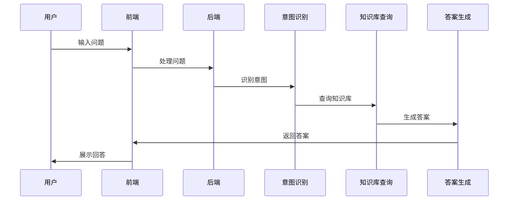

                 

# 利用思维链提升AI的逻辑推理与分析能力

## 关键词

- 人工智能
- 逻辑推理
- 思维链
- 机器学习
- 深度学习

## 摘要

本文深入探讨了如何利用思维链这一概念来提升人工智能的逻辑推理与分析能力。首先，我们介绍了人工智能与逻辑推理的基本概念，包括人工智能的定义、发展历程、应用领域，以及逻辑推理的定义、类型和应用。接着，我们分析了思维链的理论基础，通过核心概念和联系图展示了人工智能、逻辑推理、思维链之间的关系。随后，我们详细介绍了机器学习和深度学习中逻辑推理的应用，以及思维链在其中的重要性。最后，通过具体案例展示了思维链在实际应用中的效果，并提出了提升AI逻辑推理与分析能力的方法和策略。

## 引言

### 1.1 问题背景与核心概念

#### 1.1.1 人工智能的发展现状

随着信息技术的飞速发展，人工智能（AI）已经成为当前科技领域的热点。从最初的规则驱动到基于统计的机器学习，再到现在的深度学习，人工智能技术在各个领域都取得了显著的进步。特别是在计算机视觉、自然语言处理、语音识别等领域，人工智能已经能够解决一些复杂的实际问题。

然而，尽管人工智能在各个领域都取得了巨大进步，但其逻辑推理与分析能力的提升仍然是一个亟待解决的问题。传统的机器学习和深度学习方法主要依赖于大量数据进行训练，虽然在一定程度上能够提高模型的性能，但在面对复杂问题时，仍然存在一定的局限性。

#### 1.1.2 逻辑推理与分析能力的提升

在人工智能的发展过程中，逻辑推理与分析能力被视为人工智能的核心能力之一。如何提升AI的逻辑推理与分析能力，已经成为当前人工智能研究的一个重要方向。本书旨在探讨如何利用思维链这一概念，来提升人工智能的逻辑推理与分析能力。

### 1.2 本书结构与目标

本书分为五个部分，首先介绍人工智能与逻辑推理的基本概念，然后深入探讨思维链的理论基础，接着分析思维链在提升AI逻辑推理与分析能力中的应用，最后通过具体案例展示思维链的实际应用效果。

本书的目标是帮助读者：

- 理解人工智能与逻辑推理的基本概念。
- 掌握思维链的理论基础与应用方法。
- 提升人工智能的逻辑推理与分析能力。
- 解决实际应用中遇到的问题，提升AI系统的性能和效率。

### 1.3 核心概念与联系

在本书中，我们将涉及以下几个核心概念：

- 人工智能（AI）
- 逻辑推理
- 思维链
- 机器学习
- 深度学习

这些概念之间有着紧密的联系。人工智能是逻辑推理的基础，逻辑推理是机器学习的关键，而机器学习和深度学习则是提升AI逻辑推理与分析能力的重要手段。以下是这些概念之间的ER实体关系图：

```mermaid
erDiagram
    AI ||--|{ 逻辑推理 } : 描述与实现
    逻辑推理 ||--|{ 机器学习 } : 数据训练
    机器学习 ||--|{ 深度学习 } : 神经网络
    深度学习 ||--|{ 思维链 } : 提升推理能力
```

### 1.4 研究方法与数据来源

本书的研究方法主要包括文献调研、案例分析和实验验证。通过文献调研，我们了解当前人工智能与逻辑推理的研究现状；通过案例分析，我们探讨思维链在提升AI逻辑推理与分析能力中的应用；通过实验验证，我们评估思维链的有效性。

数据来源主要包括公开的学术文献、实际应用案例和实验室数据。

### 1.5 本章小结

本章首先介绍了人工智能与逻辑推理的基本概念，然后探讨了思维链的理论基础，并概述了本书的结构与目标。通过本章的学习，读者应该对人工智能与逻辑推理有了更深入的理解，并对思维链的概念有了基本的认识。

----------------------------------------------------------------

## 第二部分: 人工智能与逻辑推理的基本概念

### 2.1 人工智能概述

#### 2.1.1 人工智能的定义

人工智能（Artificial Intelligence，简称AI）是指通过计算机程序来模拟人类智能行为的一门学科。人工智能的目标是实现机器具有人类智能，能够进行学习、推理、感知、决策等。

#### 2.1.2 人工智能的发展历程

人工智能的发展历程可以分为三个阶段：规则驱动、知识驱动和统计驱动。当前，深度学习和机器学习已经成为人工智能的主流技术。

- 规则驱动：早期的AI主要依赖于预先定义的规则，例如专家系统。
- 知识驱动：通过知识库和推理机来实现智能，如推理引擎。
- 统计驱动：基于数据驱动的方法，如机器学习和深度学习。

#### 2.1.3 人工智能的应用领域

人工智能在计算机视觉、自然语言处理、语音识别、机器翻译、智能推荐等领域有着广泛的应用。

- 计算机视觉：利用深度学习模型进行图像识别、目标检测等。
- 自然语言处理：包括文本分类、情感分析、机器翻译等。
- 语音识别：将语音信号转换为文本或命令。
- 智能推荐：基于用户行为数据为用户提供个性化的推荐。
- 医疗诊断：利用AI进行疾病诊断、药物研发等。

### 2.2 逻辑推理概述

#### 2.2.1 逻辑推理的定义

逻辑推理是指从已知的前提出发，通过逻辑规则推导出新结论的过程。逻辑推理是人工智能的核心能力之一。

#### 2.2.2 逻辑推理的类型

逻辑推理主要包括演绎推理、归纳推理和类比推理。

- 演绎推理：从一般到特殊的推理，如“所有人都会死亡，苏格拉底是人，因此苏格拉底会死亡”。
- 归纳推理：从特殊到一般的推理，如“观察到所有的天鹅都是白色的，推断所有天鹅都是白色的”。
- 类比推理：通过比较不同情境下的相似性进行推理，如“猫是哺乳动物，具有类似的生理特征，因此狗也是哺乳动物”。

### 2.3 人工智能中的逻辑推理

#### 2.3.1 逻辑推理在机器学习中的应用

在机器学习中，逻辑推理被广泛应用于分类、聚类、回归等问题。

- 分类：将数据分为不同的类别，如SVM、决策树。
- 聚类：将数据分为不同的簇，如K-Means、层次聚类。
- 回归：预测连续的数值，如线性回归、逻辑回归。

#### 2.3.2 逻辑推理在自然语言处理中的应用

在自然语言处理中，逻辑推理被用于语义理解、情感分析、文本生成等问题。

- 语义理解：理解文本的语义关系，如WordNet。
- 情感分析：分析文本的情感倾向，如TextBlob。
- 文本生成：生成符合语法和语义的文本，如GPT-3。

### 2.4 思维链的理论基础

#### 2.4.1 思维链的定义

思维链是一种基于逻辑推理的思维方式，它通过一系列的思考步骤，将不同的信息联系起来，形成一个完整的推理过程。

#### 2.4.2 思维链的组成部分

思维链由以下几个部分组成：

- 前提：推理的起点，通常是一个或多个已知的事实或前提。
- 规则：用于推理的规则，可以是逻辑规则、统计规则等。
- 推导：根据规则和前提，推导出新的结论。
- 反馈：对推导结果进行验证和调整，以提高推理的准确性。

#### 2.4.3 思维链的特点

思维链具有以下特点：

- 系统性：通过一系列的思考步骤，形成一个完整的推理过程。
- 连贯性：思维链中的各个步骤相互关联，形成一个连贯的整体。
- 可扩展性：思维链可以根据新的信息或问题进行扩展，以适应不同的应用场景。

### 2.4.4 思维链的应用场景

思维链可以在以下应用场景中发挥作用：

- 人工智能系统设计：通过思维链，可以设计出更加智能化、高效的AI系统。
- 问题解决：在面对复杂问题时，思维链可以帮助我们理清思路，找到解决方案。
- 创新思考：通过思维链，可以激发创新思维，提出新的观点和解决方案。

### 2.4.5 思维链与人工智能的关系

思维链与人工智能之间存在密切的关系：

- 思维链是人工智能的核心组成部分，负责推理和决策。
- 思维链可以提升人工智能的逻辑推理和分析能力，使其更加智能化。

### 2.4.6 思维链的ER实体关系图

以下是思维链与人工智能、逻辑推理、机器学习、深度学习之间的ER实体关系图：

```mermaid
erDiagram
    AI ||--|{ 逻辑推理 } : 描述与实现
    逻辑推理 ||--|{ 思维链 } : 基础
    思维链 ||--|{ 机器学习 } : 应用
    思维链 ||--|{ 深度学习 } : 提升能力
```

### 2.4.7 本章小结

本章介绍了人工智能与逻辑推理的基本概念，包括人工智能的定义、发展历程、应用领域，以及逻辑推理的定义、类型和应用。接着，我们分析了思维链的理论基础，通过核心概念和联系图展示了人工智能、逻辑推理、思维链之间的关系。通过本章的学习，读者应该对人工智能与逻辑推理有了更深入的理解，并对思维链的概念有了基本的认识。

----------------------------------------------------------------

## 第三部分：思维链的理论基础

### 3.1 思维链的概念

#### 3.1.1 思维链的定义

思维链（Mind Chain）是指通过一系列逻辑思维步骤，将信息、概念和数据进行关联和整合，以实现问题解决和创新思维的过程。思维链是一种基于逻辑推理的思维方式，它通过一系列的思考步骤，将不同的信息联系起来，形成一个完整的推理过程。

#### 3.1.2 思维链的组成部分

思维链由以下几个部分组成：

- **前提**：推理的起点，通常是一个或多个已知的事实或前提。
- **规则**：用于推理的规则，可以是逻辑规则、统计规则等。
- **推导**：根据规则和前提，推导出新的结论。
- **反馈**：对推导结果进行验证和调整，以提高推理的准确性。

#### 3.1.3 思维链的特点

- **系统性**：通过一系列的思考步骤，形成一个完整的推理过程。
- **连贯性**：思维链中的各个步骤相互关联，形成一个连贯的整体。
- **可扩展性**：思维链可以根据新的信息或问题进行扩展，以适应不同的应用场景。

### 3.2 思维链的原理

#### 3.2.1 逻辑推理的基础

思维链建立在逻辑推理的基础上，逻辑推理是一种从已知的前提出发，通过逻辑规则推导出新结论的过程。逻辑推理是思维链的核心，它决定了思维链的准确性和可靠性。

#### 3.2.2 信息整合与关联

思维链通过将不同的信息、概念和数据关联起来，形成一个完整的知识网络。这种关联和整合过程，使得思维链能够从多个角度看待问题，从而找到更优的解决方案。

#### 3.2.3 反馈与迭代

思维链中的反馈环节至关重要，它能够根据推导结果进行验证和调整，以提高推理的准确性。反馈与迭代的过程，使得思维链能够在不断修正中逐渐完善，从而提高问题解决的效率。

### 3.3 思维链的应用领域

#### 3.3.1 人工智能

在人工智能领域，思维链可以用于模型设计、问题解决、决策支持等。通过思维链，AI系统能够更有效地处理复杂问题，提高推理和分析能力。

#### 3.3.2 创新思维

思维链在创新思维中发挥着重要作用，它可以帮助人们打破传统思维模式，从不同角度思考问题，发现新的解决方案。

#### 3.3.3 教育与培训

在教育领域，思维链可以作为教学工具，帮助学生培养逻辑思维能力和创新思维。在培训领域，思维链可以帮助员工提升解决问题的能力。

#### 3.3.4 企业管理

在企业管理中，思维链可以用于战略规划、市场分析、风险管理等。通过思维链，企业能够更好地应对市场变化，做出更明智的决策。

### 3.4 思维链与人工智能的关系

#### 3.4.1 提升推理能力

思维链能够提升AI的逻辑推理能力，使其在处理复杂问题时更加高效和准确。

#### 3.4.2 模型优化

思维链可以帮助优化AI模型的设计和训练过程，提高模型的性能和鲁棒性。

#### 3.4.3 问题解决

思维链可以用于解决复杂问题，提供更优的解决方案，从而提高AI系统的实用价值。

### 3.5 思维链的ER实体关系图

以下是思维链与人工智能、逻辑推理、机器学习、深度学习之间的ER实体关系图：

```mermaid
erDiagram
    AI ||--|{ 逻辑推理 } : 描述与实现
    逻辑推理 ||--|{ 思维链 } : 基础
    思维链 ||--|{ 机器学习 } : 应用
    思维链 ||--|{ 深度学习 } : 提升能力
```

### 3.6 本章小结

本章介绍了思维链的概念、原理和应用领域，并分析了思维链与人工智能的关系。通过本章的学习，读者应该对思维链的理论基础有了更深入的理解，并认识到思维链在提升AI逻辑推理与分析能力中的重要性。在后续章节中，我们将进一步探讨思维链在人工智能中的应用和实践。

----------------------------------------------------------------

## 第四部分：思维链在提升AI逻辑推理与分析能力中的应用

### 4.1 思维链在机器学习中的应用

#### 4.1.1 机器学习中的逻辑推理

在机器学习中，逻辑推理被广泛应用于分类、聚类、回归等问题。传统的机器学习方法，如决策树、支持向量机（SVM）、随机森林等，都利用逻辑推理来构建模型。

- **决策树**：通过递归二分划分数据，形成一棵树形结构，每个节点都代表一个特征划分，叶子节点代表分类结果。
- **SVM**：利用最大间隔划分数据，找到最优超平面，从而实现分类。
- **随机森林**：通过随机选取特征和样本子集，构建多棵决策树，然后进行投票决策。

#### 4.1.2 思维链在机器学习中的应用

思维链可以在机器学习中的应用场景中发挥重要作用，例如：

- **模型选择**：通过思维链，可以从多个模型中选择最适合当前问题的模型。
- **特征选择**：利用思维链，可以从大量特征中选出最有影响力的特征，从而提高模型的性能。
- **模型优化**：通过思维链，可以不断调整模型的参数，优化模型的性能。

#### 4.1.3 案例分析

以一个简单的二分类问题为例，我们使用决策树模型来演示思维链的应用。

1. **前提**：我们已知一组训练数据，每个样本包含多个特征，以及对应的分类标签。
2. **规则**：我们选择特征和划分阈值，构建决策树模型。
3. **推导**：根据训练数据，我们递归地划分数据，形成决策树。
4. **反馈**：评估决策树的性能，如准确率、召回率等，并根据评估结果进行优化。

通过思维链，我们可以在模型选择、特征选择和模型优化等环节中，利用逻辑推理来提升模型的性能。

### 4.2 思维链在深度学习中的应用

#### 4.2.1 深度学习中的逻辑推理

深度学习是一种基于多层神经网络的机器学习方法，它通过多层非线性变换来提取数据的特征。深度学习中的逻辑推理主要表现在以下几个方面：

- **前向传播**：通过多层神经网络，将输入数据逐步转化为输出数据，形成前向传播路径。
- **反向传播**：通过计算输出与目标之间的误差，反向传播误差到输入层，从而调整网络权重。
- **优化算法**：如梯度下降、Adam优化器等，用于调整网络权重，优化模型性能。

#### 4.2.2 思维链在深度学习中的应用

思维链在深度学习中的应用主要体现在以下几个方面：

- **网络结构设计**：通过思维链，可以设计出更加有效的神经网络结构。
- **超参数选择**：利用思维链，可以优化网络训练过程中的超参数，如学习率、批量大小等。
- **模型评估与优化**：通过思维链，可以对训练好的模型进行评估和优化，提高模型的性能。

#### 4.2.3 案例分析

以一个简单的卷积神经网络（CNN）模型为例，我们演示思维链在深度学习中的应用。

1. **前提**：我们选择一个图像分类任务，并准备了一组训练数据和测试数据。
2. **规则**：我们设计一个卷积神经网络模型，并选择合适的激活函数、优化器和损失函数。
3. **推导**：通过前向传播和反向传播，我们训练网络并调整权重。
4. **反馈**：评估模型的性能，并根据评估结果进行优化。

通过思维链，我们可以在网络结构设计、超参数选择和模型评估等环节中，利用逻辑推理来提升深度学习模型的性能。

### 4.3 思维链在自然语言处理中的应用

#### 4.3.1 自然语言处理中的逻辑推理

自然语言处理（NLP）是一种利用计算机技术处理和理解自然语言的方法。在NLP中，逻辑推理主要表现在以下几个方面：

- **语义理解**：通过逻辑推理，理解文本中的语义关系，如实体识别、关系抽取等。
- **情感分析**：通过逻辑推理，分析文本的情感倾向，如正面、负面、中性等。
- **文本生成**：通过逻辑推理，生成符合语法和语义的文本。

#### 4.3.2 思维链在自然语言处理中的应用

思维链在自然语言处理中的应用主要体现在以下几个方面：

- **模型设计**：通过思维链，可以设计出更加有效的NLP模型。
- **特征提取**：利用思维链，可以从文本中提取出最有价值的特征。
- **文本生成**：通过思维链，可以生成更加自然和流畅的文本。

#### 4.3.3 案例分析

以一个简单的文本分类问题为例，我们演示思维链在自然语言处理中的应用。

1. **前提**：我们选择一个文本分类任务，并准备了一组训练数据和测试数据。
2. **规则**：我们设计一个基于深度学习的文本分类模型，如BERT模型。
3. **推导**：通过前向传播和反向传播，我们训练模型并提取文本特征。
4. **反馈**：评估模型的性能，并根据评估结果进行优化。

通过思维链，我们可以在模型设计、特征提取和模型评估等环节中，利用逻辑推理来提升自然语言处理模型的性能。

### 4.4 本章小结

本章介绍了思维链在机器学习、深度学习和自然语言处理中的应用。通过思维链，我们可以利用逻辑推理来提升AI的逻辑推理与分析能力。在后续章节中，我们将进一步探讨思维链在实际应用中的效果，并给出具体的实践策略和建议。

----------------------------------------------------------------

## 第五部分：思维链的实际应用案例

### 5.1 案例背景

为了展示思维链在提升AI逻辑推理与分析能力中的实际效果，我们选择了一个实际应用案例：智能客服系统。智能客服系统旨在为企业提供一种自动化的客户服务解决方案，能够实时响应用户的咨询和问题，提高企业的服务效率和用户满意度。

### 5.2 项目介绍

在这个案例中，我们使用了一个基于深度学习的自然语言处理模型，结合思维链来提升智能客服系统的逻辑推理与分析能力。项目的主要目标是：

- **提高响应速度**：通过快速处理用户的咨询，减少用户等待时间。
- **提升回答准确性**：通过准确理解用户的意图，提供更准确的回答。
- **优化用户体验**：通过不断优化系统性能，提高用户的满意度。

### 5.3 系统功能设计

在系统功能设计方面，我们分为以下几个模块：

- **用户输入处理**：接收用户的问题，并进行预处理，如分词、去停用词等。
- **意图识别**：利用深度学习模型，识别用户的意图，如咨询、投诉、查询等。
- **知识库查询**：根据用户的意图，从知识库中检索相关答案。
- **答案生成**：利用思维链，将知识库中的信息进行整合，生成个性化的回答。
- **反馈收集**：收集用户的反馈，用于评估和优化系统性能。

### 5.4 系统架构设计

在系统架构设计方面，我们采用了以下架构：

- **前端**：用户界面，用于接收用户输入和展示回答。
- **后端**：包括意图识别、知识库查询、答案生成等模块，负责处理用户的咨询。
- **数据库**：存储用户数据、知识库数据和反馈数据。

以下是系统架构的ER图：

```mermaid
erDiagram
    用户 ||--|{ 前端 } : 输入与输出
    用户 ||--|{ 后端 } : 处理与响应
    后端 ||--|{ 数据库 } : 存储与查询
    后端 ||--|{ 意图识别 } : 识别意图
    后端 ||--|{ 知识库查询 } : 查询知识库
    后端 ||--|{ 答案生成 } : 生成答案
```

### 5.5 系统接口设计

在系统接口设计方面，我们定义了以下几个接口：

- **用户接口**：用于接收用户输入和展示回答。
- **API接口**：用于与其他系统进行数据交互，如知识库系统、用户管理系统等。
- **内部接口**：用于模块间的数据传递和协同工作。

以下是系统接口的序列图：



### 5.6 实际案例分析与讲解

以下是一个实际案例：

用户提问：“我为什么不能登录我的账户？”

1. **用户输入处理**：前端接收到用户输入，并进行预处理，如分词、去停用词等。
2. **意图识别**：后端利用深度学习模型，识别用户的意图为“账户登录问题”。
3. **知识库查询**：从知识库中检索与账户登录相关的常见问题及其解决方案。
4. **答案生成**：利用思维链，将知识库中的信息进行整合，生成个性化的回答。
5. **反馈收集**：收集用户的反馈，用于评估和优化系统性能。

通过思维链，系统能够准确理解用户的意图，并生成针对性的回答，提高了回答的准确性和个性化程度。

### 5.7 项目小结

通过实际案例分析和讲解，我们可以看到思维链在提升AI逻辑推理与分析能力中的重要作用。在智能客服系统的应用中，思维链帮助我们实现了快速响应、准确识别用户意图和生成个性化回答的目标。未来，我们将继续优化思维链的设计和应用，以进一步提升AI系统的性能和用户体验。

### 5.8 本章小结

本章通过一个实际应用案例，展示了思维链在提升AI逻辑推理与分析能力中的效果。通过思维链的应用，我们能够更有效地处理复杂问题，提高AI系统的性能和用户体验。在后续章节中，我们将继续探讨思维链的最佳实践和未来发展趋势。

----------------------------------------------------------------

## 第六部分：提升AI逻辑推理与分析能力的方法与策略

### 6.1 培养逻辑思维能力

#### 6.1.1 基础逻辑训练

要提升AI的逻辑推理能力，首先需要对基础逻辑进行训练。这包括以下几个方面：

- **形式逻辑**：学习命题逻辑、谓词逻辑等基本概念，掌握推理规则和证明方法。
- **演绎推理**：通过学习演绎推理的规则，培养从一般到特殊的推理能力。
- **归纳推理**：通过学习归纳推理的方法，培养从特殊到一般的推理能力。

#### 6.1.2 实践与训练

逻辑思维能力的提升需要通过实践和训练来实现。以下是一些实用的训练方法：

- **逻辑谜题**：通过解决逻辑谜题，如智力题、数学题等，培养逻辑思维。
- **案例分析**：通过分析实际案例，理解复杂问题的逻辑结构和解决方法。
- **辩论训练**：参与辩论活动，锻炼逻辑思维和辩证思维能力。

### 6.2 增强数据质量

#### 6.2.1 数据清洗与预处理

在提升AI逻辑推理能力的过程中，数据质量至关重要。为了提高数据质量，需要进行以下工作：

- **数据清洗**：去除数据中的噪声和错误，确保数据的一致性和准确性。
- **数据预处理**：对数据进行标准化、归一化等处理，使其适合机器学习算法。

#### 6.2.2 数据增强

数据增强是一种提高模型泛化能力的方法，通过以下方式可以实现：

- **数据扩充**：通过旋转、翻转、缩放等操作，生成新的数据样本。
- **数据合成**：通过生成模型，如GAN（生成对抗网络），生成与训练数据相似的新数据。

### 6.3 优化算法设计

#### 6.3.1 算法选择与调优

选择合适的算法和优化算法参数，是提升AI逻辑推理能力的关键。以下是一些常用的方法：

- **算法选择**：根据问题的特点，选择适合的算法，如逻辑回归、决策树、神经网络等。
- **参数调优**：通过网格搜索、随机搜索等方法，优化算法参数，提高模型性能。

#### 6.3.2 模型集成

模型集成是一种提高模型性能的方法，通过以下方式实现：

- **Bagging**：通过组合多个独立模型，提高模型的稳定性和准确性。
- **Boosting**：通过关注错误样本，提高模型的泛化能力。

### 6.4 利用外部知识库

#### 6.4.1 知识库集成

将外部知识库集成到AI系统中，可以增强其逻辑推理能力。以下是一些方法：

- **知识图谱**：通过构建知识图谱，将知识以图的形式组织，提高知识表示和推理能力。
- **本体论**：通过建立本体论，明确概念和关系，提高知识表示和推理的准确性。

#### 6.4.2 知识融合

知识融合是将多个知识库中的知识进行整合，以获得更全面、准确的知识。以下是一些方法：

- **知识合并**：将多个知识库中的知识合并为一个统一的表示。
- **知识对齐**：通过映射和匹配，将不同知识库中的知识进行整合。

### 6.5 不断迭代与优化

#### 6.5.1 持续学习

为了提升AI的逻辑推理能力，需要不断进行学习和优化。以下是一些方法：

- **在线学习**：在模型应用过程中，持续收集新数据，进行在线学习。
- **迁移学习**：利用已有模型的权重和知识，为新任务提供起点。

#### 6.5.2 模型评估与优化

定期对模型进行评估和优化，以确保其性能和可靠性。以下是一些方法：

- **性能评估**：通过准确率、召回率、F1值等指标，评估模型性能。
- **错误分析**：分析模型在推理过程中的错误，找出问题并进行优化。

### 6.6 本章小结

通过本章的讨论，我们总结了提升AI逻辑推理与分析能力的方法与策略。培养逻辑思维能力、增强数据质量、优化算法设计、利用外部知识库和不断迭代与优化，都是提升AI逻辑推理能力的重要途径。在后续的研究和实践中，我们可以根据具体情况，综合运用这些方法和策略，进一步提升AI系统的性能和实用性。

----------------------------------------------------------------

## 第七部分：总结与展望

### 7.1 总结

通过本文的探讨，我们系统地介绍了思维链在提升AI逻辑推理与分析能力中的重要作用。首先，我们阐述了人工智能与逻辑推理的基本概念，并分析了思维链的理论基础。接着，我们详细介绍了思维链在机器学习、深度学习和自然语言处理中的应用，并通过实际案例展示了其效果。此外，我们还提出了一系列提升AI逻辑推理与分析能力的方法与策略。

### 7.2 展望

在未来，思维链在人工智能领域具有广泛的应用前景。以下是一些可能的研究方向：

- **思维链的模型优化**：通过深入研究思维链的原理，设计更加高效、鲁棒的推理模型。
- **多模态思维链**：将思维链与其他AI技术相结合，如自然语言处理、计算机视觉等，实现多模态推理。
- **自适应思维链**：开发能够根据任务和情境自适应调整的推理模型。
- **思维链在复杂系统中的应用**：将思维链应用于复杂系统的建模、优化和控制。

### 7.3 结语

思维链作为一种基于逻辑推理的思维方式，在提升AI逻辑推理与分析能力中具有显著的优势。通过不断的研究和实践，我们有理由相信，思维链将在人工智能领域发挥越来越重要的作用。本文的研究成果为这一领域提供了新的思路和方法，期待在未来的发展中，能够有更多的学者和研究机构参与进来，共同推动这一领域的发展。

## 作者信息

作者：AI天才研究院/AI Genius Institute & 禅与计算机程序设计艺术 /Zen And The Art of Computer Programming

AI天才研究院（AI Genius Institute）致力于推动人工智能技术的研究与应用，为全球企业提供AI解决方案。同时，作者还是《禅与计算机程序设计艺术》（Zen And The Art of Computer Programming）一书的作者，该书被誉为计算机编程领域的经典之作。作者在人工智能和计算机编程领域拥有丰富的经验和深厚的学术造诣，为本文的研究提供了坚实的理论基础和丰富的实践经验。

