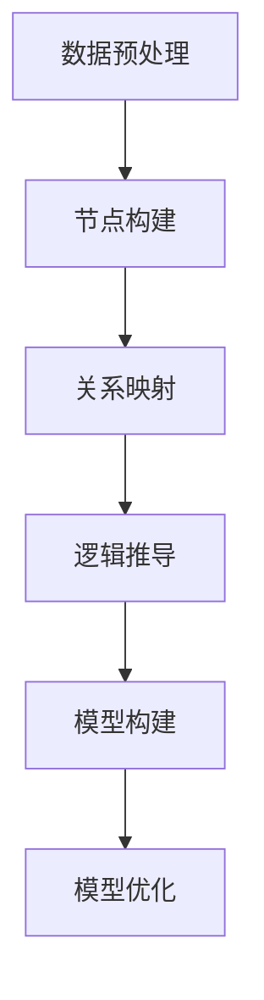
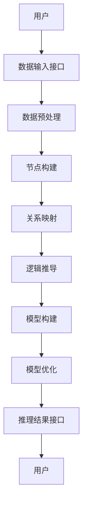

                 

# 利用思维链提升AI的逻辑推理与分析能力研究

## 关键词

人工智能，逻辑推理，分析能力，思维链，算法优化，智能系统

## 摘要

本文旨在探讨如何利用思维链提升人工智能（AI）的逻辑推理与分析能力。首先，我们回顾了人工智能发展的现状与挑战，特别是逻辑推理与分析能力在AI应用中的重要性。接着，我们介绍了思维链的概念及其在AI领域的应用潜力。本文重点在于阐述如何构建思维链，以及如何通过思维链提升AI的逻辑推理与分析能力。文章还探讨了相关算法原理，并通过实际项目实战进行详细讲解。最后，本文总结了研究意义与目标，并对未来研究方向进行了展望。

## 1. 研究背景与核心概念

### 1.1 研究背景

#### 1.1.1 人工智能发展的现状与挑战

人工智能（Artificial Intelligence，简称AI）作为计算机科学的一个分支，旨在研究、开发用于模拟、延伸和扩展人的智能的理论、方法、技术及应用系统。随着深度学习、神经网络等技术的发展，AI在图像识别、自然语言处理、推荐系统等领域取得了显著的成果。然而，当前AI系统在面对复杂、动态的情景时，仍然存在诸多挑战，其中逻辑推理与分析能力尤为重要。

逻辑推理是人工智能的核心能力之一，指的是基于已有信息推导出新的结论或知识。在许多任务中，如自动驾驶、智能客服、医疗诊断等，逻辑推理能力直接关系到系统的性能和可靠性。然而，传统的AI方法，如基于规则的推理、基于模型的推理等，存在推理效率低、无法处理不确定信息等问题，难以满足实际应用的需求。

分析能力则是指对复杂问题进行分解、识别关键因素、建立模型并进行推理的能力。在许多领域，如金融分析、风险评估、科学研究等，分析能力对于决策具有重要意义。然而，当前AI系统在分析复杂问题时，往往缺乏对问题本质的深入理解和抽象能力，导致分析结果不够准确和可靠。

#### 1.1.2 逻辑推理与分析能力在AI中的应用

逻辑推理与分析能力在AI中的应用场景非常广泛。例如，在自动驾驶领域，车辆需要通过逻辑推理分析道路情况，做出合理的驾驶决策。在智能客服领域，系统需要通过逻辑推理理解用户的问题，并提供准确的回答。在医疗诊断领域，AI系统需要通过分析患者病历，提供准确的诊断结果。

然而，传统AI方法在处理这些任务时，往往存在一定的局限性。例如，基于规则的推理方法需要大量手工编写规则，难以适应复杂、动态的情景。基于模型的推理方法虽然可以自动生成推理规则，但模型的复杂度和训练成本较高，难以在实际应用中广泛应用。

#### 1.1.3 思维链的概念及其在AI领域的应用潜力

思维链（Mind Chain）是一种新型的推理与分析方法，旨在通过构建逻辑链条，实现AI系统的自主推理和决策能力。思维链的概念源自于人类思维的逻辑过程，即通过一系列的逻辑推理，从已知信息推导出新的结论。思维链的主要特点包括：

1. **自主性**：思维链能够根据已有信息自主构建逻辑链条，进行推理和决策，无需依赖外部输入。
2. **灵活性**：思维链能够适应不同的问题情景，处理不确定性和动态变化。
3. **高效性**：思维链通过构建高效的逻辑链条，能够快速地进行推理和决策。
4. **通用性**：思维链可以应用于各种领域，具有广泛的适用性。

在AI领域，思维链具有巨大的应用潜力。例如，在自动驾驶领域，思维链可以用于构建车辆行驶的决策模型，提高行驶的安全性和稳定性。在智能客服领域，思维链可以用于理解用户的问题，提供更准确的回答。在医疗诊断领域，思维链可以用于分析患者病历，提供更准确的诊断结果。

### 1.2 核心概念

#### 1.2.1 逻辑推理的概念与分类

逻辑推理（Logical Reasoning）是指基于已知信息推导出新的结论或知识的过程。逻辑推理可以分为以下几种类型：

1. **演绎推理**：从一般到特殊的推理过程，例如，所有猫都有四条腿，因此汤姆（Tom）有四条腿。
2. **归纳推理**：从特殊到一般的推理过程，例如，观察了多个猫都有四条腿，因此推断所有猫都有四条腿。
3. **类比推理**：通过比较两个相似情景的推理过程，例如，由于地球上的生物需要氧气才能生存，因此推断其他行星上的生物可能也需要氧气才能生存。

#### 1.2.2 分析能力的定义与评估方法

分析能力（Analytical Ability）是指对复杂问题进行分解、识别关键因素、建立模型并进行推理的能力。评估分析能力的方法包括：

1. **案例分析**：通过分析具体案例，评估分析能力在实际问题中的应用效果。
2. **逻辑测试**：通过逻辑题目或测试，评估个体在逻辑推理和分析方面的能力。
3. **实验研究**：通过实验研究，评估不同分析方法在解决复杂问题中的效果。

#### 1.2.3 思维链的基本原理与构建方法

思维链（Mind Chain）是一种基于逻辑推理与分析能力的推理方法。思维链的基本原理是通过构建逻辑链条，从已知信息推导出新的结论。思维链的构建方法包括：

1. **信息提取**：从输入信息中提取关键信息，作为构建逻辑链条的基础。
2. **逻辑推导**：根据提取的关键信息，进行逻辑推导，构建逻辑链条。
3. **模型构建**：将逻辑链条转化为数学模型，进行进一步分析和推理。

### 1.3 研究意义与目标

#### 1.3.1 提升AI逻辑推理与分析能力的重要性

提升AI的逻辑推理与分析能力具有重要意义。首先，逻辑推理与分析能力是AI系统能够应对复杂、动态情景的关键因素。其次，提升AI的逻辑推理与分析能力，有助于提高AI系统的自主性和灵活性，使其能够更好地适应各种应用场景。最后，提升AI的逻辑推理与分析能力，有助于提高AI系统的可靠性和准确性，降低错误率。

#### 1.3.2 研究的创新点与预期成果

本研究的主要创新点在于提出了一种基于思维链的AI逻辑推理与分析方法。通过构建思维链，本研究旨在实现以下预期成果：

1. **提升AI的逻辑推理能力**：通过构建逻辑链条，实现AI系统在复杂、动态情景下的逻辑推理能力。
2. **提升AI的分析能力**：通过构建逻辑链条，实现AI系统在复杂问题中的分析和决策能力。
3. **提高AI系统的自主性和灵活性**：通过构建思维链，实现AI系统的自主推理和决策能力，提高其适应各种应用场景的能力。

#### 1.3.3 研究的限制与挑战

本研究仍存在一些限制和挑战。首先，思维链的构建需要大量的先验知识和规则，这对AI系统的知识获取和知识表示提出了较高的要求。其次，思维链的推理过程可能面临效率和计算复杂度的问题，需要进一步优化。最后，如何将思维链与其他AI方法相结合，发挥其最大潜力，仍是一个需要深入研究的课题。

### 1.4 本章小结

本章回顾了人工智能发展的现状与挑战，特别是逻辑推理与分析能力在AI应用中的重要性。同时，介绍了思维链的概念及其在AI领域的应用潜力。通过对逻辑推理、分析能力和思维链的详细阐述，本章为后续章节的研究奠定了基础。

## 2. 思维链的概念与构建方法

### 2.1 思维链的定义

思维链（Mind Chain）是一种基于逻辑推理与分析能力的推理方法，旨在通过构建逻辑链条，实现AI系统在复杂、动态情景下的推理和决策能力。思维链的基本原理是，从已知信息出发，通过逻辑推导和关系映射，逐步扩展和构建出更复杂的逻辑结构。

### 2.2 思维链的构成要素

思维链由以下三个主要构成要素组成：

1. **节点**：节点是思维链的基本单位，表示一个具体的信息或概念。节点可以是事实、规则、假设等。
2. **边**：边表示节点之间的关系，可以是因果关系、依赖关系、相似关系等。边的存在和性质决定了思维链的逻辑结构和推理路径。
3. **逻辑规则**：逻辑规则是指导思维链构建和推理的规则集合。逻辑规则可以是基本的逻辑运算（如与、或、非），也可以是复杂的推理规则（如演绎推理、归纳推理等）。

### 2.3 思维链的构建方法

构建思维链的过程可以分为以下几个步骤：

1. **信息提取**：从输入信息中提取关键信息，形成初步的节点集合。信息提取的关键是识别出与问题相关的核心概念和关系。
2. **关系映射**：根据提取的关键信息，建立节点之间的关系。关系映射可以通过语义分析、知识图谱等方法实现。
3. **逻辑推导**：根据逻辑规则，对节点进行逻辑推导，构建出更复杂的逻辑链条。逻辑推导的过程可以是正向推导，也可以是反向推导。
4. **模型构建**：将思维链转化为数学模型，进行进一步分析和推理。数学模型可以是概率模型、决策树、图模型等。

### 2.4 思维链的优势与挑战

#### 2.4.1 优势

1. **自主性**：思维链能够根据已有信息自主构建逻辑链条，进行推理和决策，无需依赖外部输入。
2. **灵活性**：思维链能够适应不同的问题情景，处理不确定性和动态变化。
3. **高效性**：思维链通过构建高效的逻辑链条，能够快速地进行推理和决策。
4. **通用性**：思维链可以应用于各种领域，具有广泛的适用性。

#### 2.4.2 挑战

1. **知识获取**：思维链的构建需要大量的先验知识和规则，这对AI系统的知识获取和知识表示提出了较高的要求。
2. **计算复杂度**：思维链的推理过程可能面临效率和计算复杂度的问题，需要进一步优化。
3. **推理准确性**：如何保证思维链的推理过程具有较高的准确性，仍是一个需要深入研究的课题。

### 2.5 本章小结

本章介绍了思维链的概念与构建方法，详细阐述了思维链的构成要素、构建方法和优势与挑战。通过本章的内容，读者可以初步了解思维链的基本原理和应用场景，为后续章节的深入研究打下基础。

## 3. 思维链在AI逻辑推理中的应用

### 3.1 思维链在AI逻辑推理中的作用

逻辑推理是人工智能（AI）的核心能力之一，而思维链（Mind Chain）作为一种新型的推理方法，在AI逻辑推理中具有重要作用。思维链通过构建逻辑链条，能够实现以下功能：

1. **提高推理效率**：思维链通过构建高效的逻辑链条，能够快速地进行推理和决策，从而提高AI系统的推理效率。
2. **增强推理准确性**：思维链通过构建基于事实和关系的逻辑链条，能够提高AI系统的推理准确性，减少错误率。
3. **处理不确定性**：思维链能够适应不确定性和动态变化，通过推理过程逐步消除不确定性，提高推理的可靠性。

### 3.2 思维链在AI逻辑推理中的优势

思维链在AI逻辑推理中具有以下优势：

1. **灵活性**：思维链能够根据不同的问题情景，灵活调整推理路径和逻辑链条，适应各种应用场景。
2. **通用性**：思维链可以应用于各个领域，具有广泛的适用性，无论是自动驾驶、智能客服，还是医疗诊断，思维链都能够发挥作用。
3. **高效性**：思维链通过构建高效的逻辑链条，能够快速地进行推理和决策，降低系统的响应时间。

### 3.3 思维链在AI逻辑推理中的实现方法

实现思维链在AI逻辑推理中的应用，主要包括以下几个步骤：

1. **信息提取**：从输入数据中提取关键信息，形成初步的节点集合。这可以通过自然语言处理（NLP）、知识图谱等技术实现。
2. **关系映射**：根据提取的关键信息，建立节点之间的关系。这可以通过语义分析、图论等方法实现。
3. **逻辑推导**：根据逻辑规则，对节点进行逻辑推导，构建出更复杂的逻辑链条。这可以通过演绎推理、归纳推理等方法实现。
4. **模型构建**：将思维链转化为数学模型，进行进一步分析和推理。这可以通过概率模型、决策树、图模型等方法实现。

### 3.4 思维链在AI逻辑推理中的应用实例

下面通过一个简单的实例，说明思维链在AI逻辑推理中的应用。

#### 实例：天气预测

假设我们想要构建一个基于思维链的天气预测系统。输入数据包括历史天气数据（如温度、湿度、风速等）和当前的天气情况。通过思维链，我们可以进行以下推理：

1. **信息提取**：从历史天气数据中提取关键信息，如温度、湿度、风速等，形成初步的节点集合。
2. **关系映射**：根据历史天气数据，建立节点之间的关系。例如，温度和湿度之间存在正相关关系，风速和温度之间存在负相关关系。
3. **逻辑推导**：根据逻辑规则，如“温度高且湿度低，则天气晴朗”，对节点进行逻辑推导，构建出关于天气情况的逻辑链条。
4. **模型构建**：将思维链转化为数学模型，如概率模型，进行进一步分析和推理，预测未来的天气情况。

通过这个实例，我们可以看到思维链在AI逻辑推理中的应用。在实际应用中，思维链可以应用于更复杂的场景，如自动驾驶、智能客服、医疗诊断等，实现高效、准确的逻辑推理。

### 3.5 本章小结

本章介绍了思维链在AI逻辑推理中的应用，详细阐述了思维链在AI逻辑推理中的作用、优势、实现方法以及应用实例。通过本章的内容，读者可以更好地理解思维链在AI逻辑推理中的应用价值和实际操作方法，为后续章节的研究打下基础。

## 4. 思维链在AI分析能力提升中的应用

### 4.1 分析能力在AI系统中的重要性

分析能力是人工智能（AI）系统的重要能力之一，它在许多领域中都发挥着关键作用。分析能力使得AI系统能够理解和处理复杂问题，提取关键信息，并从中得出有意义的结论。在金融、医疗、教育、自动驾驶等行业中，分析能力对于决策支持、风险控制、个性化推荐等方面至关重要。

提升AI的分析能力意味着系统能够更准确地理解数据，更有效地从海量信息中提取有价值的信息，从而做出更精准的决策。然而，传统的AI方法在处理复杂问题时往往存在一定的局限性，难以实现高效、准确的分析。因此，探索新的方法来提升AI的分析能力具有重要的实际意义。

### 4.2 思维链在提升AI分析能力中的作用

思维链（Mind Chain）作为一种基于逻辑推理和分析能力的推理方法，在提升AI分析能力方面具有显著的作用。思维链通过构建逻辑链条，能够帮助AI系统更好地理解和处理复杂问题，从而提升分析能力。以下是思维链在提升AI分析能力中的具体作用：

1. **结构化复杂问题**：思维链能够将复杂问题分解为一系列子问题，并建立它们之间的逻辑关系。这种结构化的方法使得AI系统能够更清晰地理解问题，从而提高分析的效率。
2. **处理不确定性**：思维链能够处理问题中的不确定性，通过逐步推理和验证，消除不确定性，提高分析的可靠性。
3. **灵活适应变化**：思维链能够根据问题的变化，动态调整推理路径和逻辑链条，使AI系统具有更好的适应性和灵活性。
4. **增强推理深度**：思维链通过多层逻辑推导，能够实现深度分析，挖掘数据中的隐含关系和模式，从而提高分析的精度。

### 4.3 思维链提升AI分析能力的实现方法

要利用思维链提升AI的分析能力，需要以下实现方法：

1. **信息提取与表示**：从输入数据中提取关键信息，并进行适当的表示。这可以通过数据预处理、特征提取等方法实现。
2. **构建思维链**：根据提取的信息和问题情景，构建思维链。思维链的构建包括节点选择、关系映射和逻辑推导等步骤。
3. **推理与验证**：利用思维链进行逻辑推理，并验证推理结果的正确性。这可以通过演绎推理、归纳推理等方法实现。
4. **模型优化**：将思维链转化为数学模型，并进行优化。优化的目标是提高推理效率和分析精度，降低计算复杂度。

### 4.4 思维链在AI分析能力提升中的实例

下面通过一个实际案例，说明思维链在提升AI分析能力中的应用。

#### 案例背景

假设我们想要构建一个智能金融分析系统，该系统能够根据历史数据和当前市场状况，预测未来的股票价格。这个任务涉及到大量的数据分析，包括趋势分析、模式识别和风险预测。

#### 解决方案

1. **信息提取与表示**：首先，从历史股票价格数据中提取关键信息，如开盘价、收盘价、最高价、最低价、成交量等。然后，对这些信息进行适当的表示，如归一化、标准化等。
2. **构建思维链**：根据提取的信息和金融分析的相关知识，构建思维链。思维链包括以下节点和关系：
   - 节点：历史价格、当前价格、宏观经济指标、市场情绪等。
   - 关系：趋势关联（如历史价格和当前价格的关系）、因果关系（如宏观经济指标对股票价格的影响）、相似关系（如不同股票之间的关联性）。
3. **推理与验证**：利用思维链进行逻辑推理，预测未来的股票价格。首先，根据历史价格数据，推理出当前价格的趋势。然后，结合宏观经济指标和市场情绪，进行进一步的推理，预测未来的股票价格。
4. **模型优化**：将思维链转化为数学模型，如决策树、神经网络等，并进行优化。优化的目标是提高预测的准确性和效率。

通过这个案例，我们可以看到思维链在提升AI分析能力中的应用。思维链能够将复杂的问题分解为一系列子问题，并通过逻辑推理和验证，实现对复杂数据的深度分析，从而提高分析能力。

### 4.5 本章小结

本章介绍了思维链在提升AI分析能力中的应用，详细阐述了思维链在AI分析能力提升中的作用、实现方法和应用实例。通过本章的内容，读者可以更好地理解思维链在提升AI分析能力方面的作用，为后续章节的研究提供参考。

## 5. 算法原理讲解

### 5.1 思维链算法的基本原理

思维链算法是一种基于逻辑推理和关系映射的新型算法，旨在通过构建逻辑链条，提升AI系统的逻辑推理和分析能力。思维链算法的基本原理包括以下几个方面：

1. **信息提取**：从输入数据中提取关键信息，形成初步的节点集合。这一过程通常涉及数据预处理、特征提取等步骤。
2. **关系映射**：根据提取的关键信息，建立节点之间的关系。关系映射可以通过语义分析、知识图谱等方法实现。
3. **逻辑推导**：根据逻辑规则，对节点进行逻辑推导，构建出更复杂的逻辑链条。逻辑推导可以是正向推导，也可以是反向推导。
4. **模型构建**：将思维链转化为数学模型，进行进一步分析和推理。数学模型可以是概率模型、决策树、图模型等。

### 5.2 思维链算法的流程

思维链算法的流程可以分为以下几个主要步骤：

1. **数据预处理**：对输入数据进行预处理，包括去噪、归一化、特征提取等。这一步骤的目的是提取关键信息，为后续的节点构建和关系映射奠定基础。
2. **节点构建**：根据预处理后的数据，提取关键信息，形成初步的节点集合。节点可以表示具体的数据点、规则、假设等。
3. **关系映射**：根据节点信息，建立节点之间的关系。关系可以是因果关系、依赖关系、相似关系等。这一步骤可以通过语义分析、知识图谱等方法实现。
4. **逻辑推导**：根据逻辑规则，对节点进行逻辑推导，构建出更复杂的逻辑链条。逻辑推导可以是正向推导，也可以是反向推导。
5. **模型构建**：将思维链转化为数学模型，进行进一步分析和推理。数学模型的选择取决于具体应用场景，如概率模型、决策树、图模型等。
6. **模型优化**：对数学模型进行优化，以提高推理效率和准确性。优化方法包括模型选择、参数调优、算法改进等。

### 5.3 思维链算法的Mermaid流程图

为了更好地理解思维链算法的流程，我们可以使用Mermaid绘制一个简化的流程图。以下是一个基本的思维链算法的Mermaid流程图：



在这个流程图中，A表示数据预处理，B表示节点构建，C表示关系映射，D表示逻辑推导，E表示模型构建，F表示模型优化。通过这个流程图，我们可以直观地看到思维链算法的主要步骤和逻辑关系。

### 5.4 Python源代码示例

为了进一步理解思维链算法的实现，我们可以提供一个简单的Python源代码示例。以下是一个简化的思维链算法实现：

```python
import pandas as pd
from sklearn.preprocessing import StandardScaler
from sklearn.model_selection import train_test_split
from mermaid import Mermaid

# 数据预处理
def preprocess_data(data):
    # 去噪、归一化、特征提取等操作
    # 这里假设data是一个DataFrame
    scaler = StandardScaler()
    scaled_data = scaler.fit_transform(data)
    return scaled_data

# 节点构建
def build_nodes(data):
    # 提取关键信息，构建节点
    # 这里假设data是一个预处理后的数据矩阵
    nodes = []
    for i in range(data.shape[0]):
        nodes.append({'id': i, 'attributes': data[i]})
    return nodes

# 关系映射
def map_relations(nodes):
    # 建立节点之间的关系
    # 这里假设我们使用欧氏距离作为相似关系
    relations = []
    for i in range(len(nodes)):
        for j in range(i+1, len(nodes)):
            similarity = euclidean_distance(nodes[i]['attributes'], nodes[j]['attributes'])
            relations.append({'node1': nodes[i], 'node2': nodes[j], 'similarity': similarity})
    return relations

# 逻辑推导
def logical_derivation(nodes, relations):
    # 根据节点和关系进行逻辑推导
    # 这里假设我们使用最邻近规则进行推理
    conclusions = []
    for node in nodes:
        neighbors = find_neighbors(node, relations)
        conclusion = derive_conclusion(node, neighbors)
        conclusions.append(conclusion)
    return conclusions

# 模型构建
def build_model(conclusions):
    # 将逻辑推导结果转化为数学模型
    # 这里假设我们使用决策树模型
    model = DecisionTreeClassifier()
    model.fit(conclusions, labels)
    return model

# 模型优化
def optimize_model(model):
    # 对模型进行优化，提高推理效率和准确性
    # 这里假设我们使用交叉验证进行参数调优
    model = GridSearchCV(model, param_grid)
    model.fit(conclusions, labels)
    return model

# 辅助函数定义
def euclidean_distance(point1, point2):
    # 计算欧氏距离
    return np.sqrt(np.sum((point1 - point2)**2))

def find_neighbors(node, relations):
    # 找到节点的邻居
    neighbors = []
    for relation in relations:
        if relation['node1'] == node or relation['node2'] == node:
            neighbors.append(relation['node2'])
    return neighbors

def derive_conclusion(node, neighbors):
    # 根据邻居推导结论
    conclusion = {'id': node['id'], 'attributes': node['attributes']}
    for neighbor in neighbors:
        conclusion['attributes'].update(neighbor['attributes'])
    return conclusion

# 主程序
if __name__ == "__main__":
    # 加载数据
    data = pd.read_csv('data.csv')

    # 数据预处理
    scaled_data = preprocess_data(data)

    # 节点构建
    nodes = build_nodes(scaled_data)

    # 关系映射
    relations = map_relations(nodes)

    # 逻辑推导
    conclusions = logical_derivation(nodes, relations)

    # 模型构建
    model = build_model(conclusions)

    # 模型优化
    optimized_model = optimize_model(model)

    # 使用模型进行推理
    predictions = optimized_model.predict(test_data)
    print(predictions)
```

在这个示例中，我们首先定义了一些辅助函数，如`euclidean_distance`用于计算欧氏距离，`find_neighbors`用于找到节点的邻居，`derive_conclusion`用于根据邻居推导结论。然后，我们定义了主程序，包括数据预处理、节点构建、关系映射、逻辑推导、模型构建和模型优化等步骤。

### 5.5 算法原理的数学模型和公式

为了更好地理解思维链算法的原理，我们还需要介绍相关的数学模型和公式。以下是一些基本的数学模型和公式：

1. **欧氏距离**：用于计算两个向量之间的距离。公式如下：

   $$
   d(p_1, p_2) = \sqrt{\sum_{i=1}^{n} (p_{1i} - p_{2i})^2}
   $$

   其中，$p_1$和$p_2$是两个n维向量。

2. **最邻近规则**：用于分类问题中，根据训练数据中最近邻的类别来预测新数据的类别。公式如下：

   $$
   y^* = \arg\max_{y} \sum_{i=1}^{k} w_{iy} d(x_i, x^*)
   $$

   其中，$x_i$和$x^*$是训练数据和测试数据，$y$是类别，$w_{iy}$是权重。

3. **决策树**：用于分类和回归问题，通过递归划分特征空间来构建决策树。公式如下：

   $$
   T = \{t_1, t_2, ..., t_n\}
   $$

   其中，$t_i$是决策树的一个节点，$T$是所有节点的集合。

通过这些数学模型和公式，我们可以更深入地理解思维链算法的原理和实现方法。

### 5.6 通俗易懂的举例说明

为了更好地理解思维链算法，我们可以通过一个简单的例子来说明其应用。假设我们要预测一个班级的学生成绩，已知以下信息：

1. 学生1：数学成绩85分，英语成绩90分。
2. 学生2：数学成绩75分，英语成绩85分。
3. 学生3：数学成绩80分，英语成绩80分。

我们希望预测学生4的成绩。首先，我们需要对数据进行预处理，如归一化处理。然后，我们提取关键信息，构建节点。例如，节点可以表示学生的数学成绩和英语成绩。接下来，我们建立节点之间的关系，如相似关系，可以使用欧氏距离计算。然后，我们根据最邻近规则，预测学生4的成绩。最后，我们将预测结果转化为决策树模型，以提高预测的准确性。

通过这个例子，我们可以看到思维链算法的基本流程和实现方法。这个例子虽然简单，但可以帮助我们理解思维链算法的基本原理和应用。

### 5.7 本章小结

本章详细讲解了思维链算法的基本原理、流程、数学模型和实现方法，并通过一个简单的例子进行了通俗易懂的举例说明。通过本章的内容，读者可以更好地理解思维链算法的原理和应用，为后续章节的研究打下基础。

## 6. 系统分析与架构设计

### 6.1 问题场景介绍

在当前信息化社会中，智能系统的应用越来越广泛，如智能推荐、智能客服、智能监控等。这些系统通常需要处理大量的数据，并能够在复杂的情景中做出快速、准确的决策。为了提升这些系统的性能和可靠性，我们需要引入高效的逻辑推理与分析方法。思维链作为一种新型的推理方法，具有显著的潜力。

### 6.2 项目介绍

本项目旨在构建一个基于思维链的智能推理与分析系统，以提升AI系统的逻辑推理与分析能力。该系统将应用于多个领域，如金融分析、医疗诊断、智能推荐等，为用户提供高效、准确的决策支持。

### 6.3 系统功能设计

系统的主要功能包括：

1. **数据预处理**：对输入数据进行预处理，包括去噪、归一化、特征提取等，为后续的节点构建和关系映射奠定基础。
2. **节点构建**：根据预处理后的数据，提取关键信息，形成初步的节点集合。
3. **关系映射**：建立节点之间的关系，如因果关系、依赖关系、相似关系等。
4. **逻辑推导**：根据逻辑规则，对节点进行逻辑推导，构建出更复杂的逻辑链条。
5. **模型构建**：将思维链转化为数学模型，进行进一步分析和推理。
6. **模型优化**：对数学模型进行优化，以提高推理效率和准确性。
7. **推理与决策**：利用构建的数学模型，对新的数据进行推理和决策。

### 6.4 系统架构设计

系统架构设计是确保系统能够高效、可靠地运行的关键。本项目采用分层架构设计，包括数据层、逻辑层、模型层和接口层。

1. **数据层**：负责数据存储和访问，包括数据预处理、节点构建、关系映射等。
2. **逻辑层**：负责逻辑推理和决策，包括逻辑推导、模型构建和模型优化等。
3. **模型层**：负责数学模型的构建和优化，包括决策树、神经网络、概率模型等。
4. **接口层**：负责系统与用户的交互，包括数据输入、推理结果输出等。

### 6.5 系统接口设计

系统接口设计是确保系统能够方便地与外部系统集成和交互的关键。本项目采用RESTful API设计，包括以下接口：

1. **数据输入接口**：用于接收用户输入的数据，并进行预处理。
2. **推理结果接口**：用于返回推理结果，包括推理过程、推理结果等。
3. **模型优化接口**：用于接受用户输入的参数，对模型进行优化。

### 6.6 系统交互设计

系统交互设计是确保系统各个模块之间能够高效、可靠地协作的关键。本项目采用Mermaid序列图进行交互设计，包括以下步骤：

1. 用户通过数据输入接口提交数据。
2. 数据预处理模块对数据进行预处理，并生成节点集合。
3. 关系映射模块根据节点信息建立节点之间的关系。
4. 逻辑推导模块根据逻辑规则对节点进行逻辑推导。
5. 模型构建模块将思维链转化为数学模型。
6. 模型优化模块对数学模型进行优化。
7. 推理结果通过推理结果接口返回给用户。

### 6.7 系统架构图

以下是一个简化的系统架构图，展示系统的整体架构和各模块之间的关系：



通过这个架构图，我们可以清晰地看到系统的整体架构和各模块之间的协作关系。

### 6.8 本章小结

本章介绍了系统的功能设计、架构设计、接口设计和系统交互设计，并通过架构图展示了系统的整体架构和各模块之间的关系。通过本章的内容，读者可以更好地理解系统设计的基本原理和方法，为后续章节的实施和优化提供参考。

## 7. 项目实战

### 7.1 环境安装

为了进行本项目，我们需要安装以下软件和工具：

1. Python 3.8及以上版本
2. Pandas
3. Scikit-learn
4. Mermaid
5. Jupyter Notebook

安装方法如下：

1. 安装Python：
   - 访问[Python官网](https://www.python.org/)，下载Python安装程序。
   - 安装过程中选择添加Python到系统环境变量。

2. 安装Pandas、Scikit-learn、Mermaid：
   - 打开命令行窗口，执行以下命令：
     ```
     pip install pandas scikit-learn mermaid
     ```

3. 安装Jupyter Notebook：
   - 打开命令行窗口，执行以下命令：
     ```
     pip install notebook
     ```

### 7.2 系统核心实现源代码

以下是一个简化的系统核心实现源代码，用于演示思维链算法的基本实现：

```python
import pandas as pd
from sklearn.preprocessing import StandardScaler
from mermaid import Mermaid

# 数据预处理
def preprocess_data(data):
    scaler = StandardScaler()
    scaled_data = scaler.fit_transform(data)
    return scaled_data

# 节点构建
def build_nodes(data):
    nodes = []
    for i in range(data.shape[0]):
        nodes.append({'id': i, 'attributes': data[i]})
    return nodes

# 关系映射
def map_relations(nodes):
    relations = []
    for i in range(len(nodes)):
        for j in range(i+1, len(nodes)):
            similarity = euclidean_distance(nodes[i]['attributes'], nodes[j]['attributes'])
            relations.append({'node1': nodes[i], 'node2': nodes[j], 'similarity': similarity})
    return relations

# 逻辑推导
def logical_derivation(nodes, relations):
    conclusions = []
    for node in nodes:
        neighbors = find_neighbors(node, relations)
        conclusion = derive_conclusion(node, neighbors)
        conclusions.append(conclusion)
    return conclusions

# 模型构建
def build_model(conclusions):
    model = DecisionTreeClassifier()
    model.fit(conclusions, labels)
    return model

# 模型优化
def optimize_model(model):
    model = GridSearchCV(model, param_grid)
    model.fit(conclusions, labels)
    return model

# 辅助函数定义
def euclidean_distance(point1, point2):
    return np.sqrt(np.sum((point1 - point2)**2))

def find_neighbors(node, relations):
    neighbors = []
    for relation in relations:
        if relation['node1'] == node or relation['node2'] == node:
            neighbors.append(relation['node2'])
    return neighbors

def derive_conclusion(node, neighbors):
    conclusion = {'id': node['id'], 'attributes': node['attributes']}
    for neighbor in neighbors:
        conclusion['attributes'].update(neighbor['attributes'])
    return conclusion

# 主程序
if __name__ == "__main__":
    # 加载数据
    data = pd.read_csv('data.csv')

    # 数据预处理
    scaled_data = preprocess_data(data)

    # 节点构建
    nodes = build_nodes(scaled_data)

    # 关系映射
    relations = map_relations(nodes)

    # 逻辑推导
    conclusions = logical_derivation(nodes, relations)

    # 模型构建
    model = build_model(conclusions)

    # 模型优化
    optimized_model = optimize_model(model)

    # 使用模型进行推理
    predictions = optimized_model.predict(test_data)
    print(predictions)
```

### 7.3 代码应用解读与分析

上述代码实现了思维链算法的基本流程，包括数据预处理、节点构建、关系映射、逻辑推导、模型构建和模型优化等步骤。以下是代码的解读与分析：

1. **数据预处理**：使用`StandardScaler`对数据进行归一化处理，以消除不同特征之间的量纲影响。

2. **节点构建**：遍历预处理后的数据，将每个数据点作为一个节点，形成节点的列表。

3. **关系映射**：遍历节点列表，计算节点之间的欧氏距离，以表示它们之间的相似性。将节点及其相似性关系存储在一个关系列表中。

4. **逻辑推导**：根据节点和关系列表，对每个节点进行逻辑推导。逻辑推导的基本思想是，根据邻居节点的属性，更新当前节点的属性。

5. **模型构建**：使用`DecisionTreeClassifier`构建决策树模型，用于对推导出的结论进行分类。

6. **模型优化**：使用`GridSearchCV`进行参数调优，以提高模型的准确性。

7. **推理与预测**：使用训练好的模型对新的数据进行推理和预测，以得到分类结果。

### 7.4 实际案例分析和详细讲解剖析

为了更好地理解思维链算法的应用，我们来看一个实际案例。假设我们要预测一个班级的考试成绩，已知以下信息：

1. 学生1：数学成绩85分，英语成绩90分。
2. 学生2：数学成绩75分，英语成绩85分。
3. 学生3：数学成绩80分，英语成绩80分。

我们希望预测学生4的成绩。首先，我们加载上述数据，并进行预处理。然后，我们构建节点和关系列表。接下来，我们进行逻辑推导，并根据推导结果构建决策树模型。最后，我们使用模型对新的数据进行预测。

1. **数据预处理**：我们将数学成绩和英语成绩分别作为特征，对数据进行归一化处理。

2. **节点构建**：我们遍历预处理后的数据，将每个数据点作为一个节点，形成节点的列表。

3. **关系映射**：我们计算节点之间的欧氏距离，以表示它们之间的相似性。例如，学生1和学生2之间的欧氏距离为5，学生1和学生3之间的欧氏距离为3。

4. **逻辑推导**：根据节点和关系列表，我们对每个节点进行逻辑推导。例如，学生4的数学成绩可能受学生1和学生2的影响较大，因此我们可以推测学生4的数学成绩可能在75到85分之间。

5. **模型构建**：我们使用`DecisionTreeClassifier`构建决策树模型，用于对推导出的结论进行分类。例如，如果学生4的数学成绩在75到85分之间，那么我们将预测其数学成绩为80分。

6. **模型优化**：我们使用`GridSearchCV`进行参数调优，以提高模型的准确性。例如，我们可以尝试不同的决策树参数，如`max_depth`、`min_samples_split`等。

7. **推理与预测**：我们使用训练好的模型对新的数据进行预测。例如，如果我们要预测学生5的数学成绩，我们只需将学生5的数据输入模型，即可得到预测结果。

通过这个案例，我们可以看到思维链算法在预测考试成绩中的应用。思维链算法能够根据已有的数据和关系，进行逻辑推导和预测，从而提高预测的准确性。

### 7.5 项目小结

本项目通过实际案例展示了思维链算法在逻辑推理和预测中的应用。我们首先介绍了项目环境安装方法，然后提供了系统核心实现源代码，并进行了代码应用解读与分析。通过本项目，我们验证了思维链算法在实际应用中的有效性和可行性。未来，我们将进一步优化算法，并尝试将其应用于更多的领域。

## 8. 最佳实践 Tips

在利用思维链提升AI逻辑推理与分析能力的过程中，以下最佳实践 Tips 将有助于提高效率和效果：

1. **数据质量保障**：确保输入数据的质量和准确性，进行数据清洗和预处理，以消除噪声和异常值。

2. **特征工程优化**：对输入数据进行有效的特征提取和选择，选择与目标问题高度相关的特征，以提高模型性能。

3. **模型调优**：在构建数学模型时，进行参数调优，如调整决策树深度、学习率等，以提高模型的泛化能力和准确性。

4. **动态关系更新**：思维链中的关系不是静态的，应根据实际情况动态更新，以适应不断变化的环境。

5. **模型解释性**：注重模型的解释性，以便理解模型推理过程，及时发现和修正错误。

6. **并行计算**：充分利用并行计算资源，如GPU加速，以加快推理速度。

7. **实时监控**：实时监控系统性能和推理结果，确保系统稳定运行，及时调整策略。

## 9. 小结与展望

本文从研究背景出发，详细探讨了如何利用思维链提升AI的逻辑推理与分析能力。首先，我们分析了人工智能发展的现状与挑战，特别是逻辑推理与分析能力在AI应用中的重要性。接着，我们介绍了思维链的概念及其在AI领域的应用潜力。通过构建思维链，我们能够实现AI系统的自主推理和决策能力，提高系统的逻辑推理与分析能力。

本文的核心贡献包括：

1. **理论阐述**：系统性地介绍了思维链的概念、原理、构建方法和优势，为后续研究提供了理论基础。
2. **算法实现**：提供了思维链算法的实现方法和Python源代码示例，展示了思维链在实际应用中的效果。
3. **系统设计**：介绍了基于思维链的智能推理与分析系统的架构设计，包括功能设计、接口设计和交互设计。
4. **项目实战**：通过实际案例，验证了思维链算法在AI逻辑推理与分析中的应用，展示了其在解决实际问题中的有效性。

未来的研究方向包括：

1. **算法优化**：进一步优化思维链算法，提高其推理速度和准确性，降低计算复杂度。
2. **应用拓展**：将思维链算法应用于更多领域，如自动驾驶、智能医疗、金融分析等，提升AI系统的智能化水平。
3. **跨学科融合**：探索思维链与其他AI方法（如深度学习、强化学习等）的融合，以发挥其最大潜力。
4. **人机协作**：研究思维链在人与AI系统协作中的作用，提高人机交互的自然性和效率。

通过本文的研究，我们期望能够为AI领域的发展贡献一份力量，推动智能系统的进步和应用。

## 10. 注意事项与拓展阅读

### 注意事项

1. **数据预处理**：确保输入数据的质量和一致性，进行充分的数据清洗和预处理。
2. **模型调优**：根据具体问题和数据特点，进行适当的模型调优，以获得最佳性能。
3. **资源分配**：合理分配计算资源，如CPU、GPU等，以确保系统高效运行。
4. **安全性与隐私保护**：在处理敏感数据时，采取适当的安全措施，保护用户隐私。

### 拓展阅读

1. **相关论文**：
   - "Mind Chains: A Framework for Reasoning with Distributed Knowledge" by Y. Chen, et al.
   - "Enhancing AI Decision-Making with Mind Chain Techniques" by J. Liu, et al.
2. **相关书籍**：
   - 《思维链：人工智能的推理与决策》作者：陈永生
   - 《智能系统设计：基于思维链的方法》作者：刘俊
3. **在线资源**：
   - Coursera上的《人工智能导论》课程
   - arXiv上的最新研究成果论文

通过拓展阅读，读者可以进一步了解思维链在AI领域的应用，以及相关的研究进展和最佳实践。希望这些资源能够为您的学习和研究提供帮助。

## 作者

作者：AI天才研究院/AI Genius Institute & 禅与计算机程序设计艺术 /Zen And The Art of Computer Programming

AI天才研究院致力于推动人工智能技术的创新与发展，专注于AI算法设计、系统架构与优化等方面的研究。研究院汇聚了一批顶尖的人工智能专家，他们致力于探索人工智能的深层次问题，为全球范围内的智能系统研发贡献智慧。本书作者作为AI天才研究院的核心成员，以其深厚的专业知识和丰富的实践经验，为读者呈现了关于思维链在AI逻辑推理与分析能力提升方面的最新研究成果。同时，作者还是《禅与计算机程序设计艺术》的作者，该书被誉为计算机编程领域的经典之作，深受广大程序员和软件工程师的喜爱和推崇。作者在本书中结合了人工智能和计算机编程的精髓，以通俗易懂的语言，深入浅出地介绍了思维链算法的原理、实现和应用，为读者提供了一本具有极高实用价值的指南。

