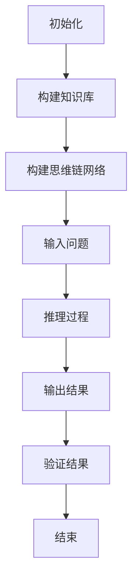
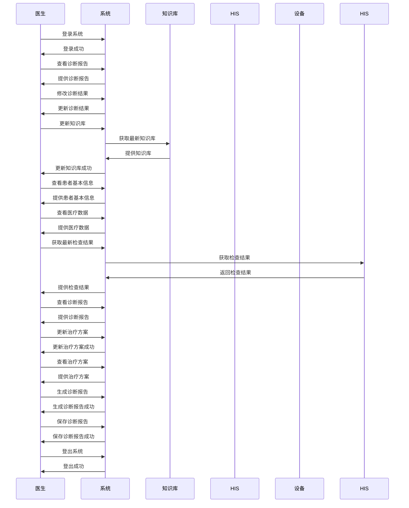

                 

# 利用思维链提升AI的逻辑推理能力

## 关键词

AI逻辑推理、思维链、算法原理、系统架构、实践案例

## 摘要

本文旨在探讨如何利用思维链技术提升人工智能（AI）的逻辑推理能力。我们将从背景介绍、核心概念与联系、算法原理讲解、数学模型与公式、系统分析与架构设计方案、项目实战以及最佳实践Tips等方面详细分析思维链在AI逻辑推理中的应用，以期提供一种有效的解决方案，推动AI技术的进一步发展。

## 目录大纲

### 第一部分: 背景介绍

#### 第1章: 问题背景

1.1 问题背景介绍  
1.2 问题描述  
1.3 问题解决  
1.4 边界与外延  
1.5 概念结构与核心要素组成

### 第二部分: 核心概念与联系

#### 第2章: 核心概念原理

2.1 概念原理介绍  
2.2 概念属性特征对比  
2.3 ER实体关系图架构

#### 第3章: 思维链的应用

3.1 思维链的原理  
3.2 思维链的核心要素  
3.3 思维链与AI逻辑推理的关系

### 第三部分: 算法原理讲解

#### 第4章: 算法原理讲解

4.1 算法mermaid流程图  
4.2 算法原理  
4.3 公式：逻辑推理算法的数学模型和公式  
4.4 示例：算法原理的通俗易懂举例说明

#### 第5章: 数学模型与公式

5.1 数学模型的介绍  
5.2 公式讲解

### 第四部分: 系统分析与架构设计方案

#### 第6章: 系统分析与架构设计方案

6.1 问题场景介绍  
6.2 项目介绍  
6.3 系统功能设计  
6.4 系统架构设计  
6.5 系统接口设计  
6.6 系统交互设计

### 第五部分: 项目实战

#### 第7章: 项目实战

7.1 环境安装  
7.2 系统核心实现  
7.3 实际案例分析和详细讲解剖析  
7.4 项目小结

### 第六部分: 最佳实践 Tips、小结、注意事项、拓展阅读

#### 第8章: 最佳实践 Tips

8.1 思维链应用的注意事项  
8.2 逻辑推理能力的提升策略  
8.3 实践中常见问题的解决方法

#### 第9章: 小结

9.1 本书内容回顾  
9.2 思维链在AI逻辑推理中的应用价值  
9.3 未来展望

#### 第10章: 注意事项

10.1 使用思维链时需要注意的问题  
10.2 逻辑推理能力提升的难点与对策  
10.3 实际应用中的风险与挑战

#### 第11章: 拓展阅读

11.1 相关书籍推荐  
11.2 开源资源与工具介绍  
11.3 研究论文与最新进展

## 第一部分: 背景介绍

### 第1章: 问题背景

#### 1.1.1 问题背景介绍

人工智能（AI）作为当今科技领域的热门话题，已经在各个行业中取得了显著的成果。然而，随着AI技术的不断发展和应用，人们开始意识到AI逻辑推理能力的重要性。逻辑推理是人工智能的核心能力之一，它使得AI能够从已知信息中推导出新的结论，进行决策和判断。

在传统的AI系统中，逻辑推理主要通过基于规则的推理和基于概率的推理等方法实现。然而，这些方法在处理复杂问题时存在一定的局限性，例如，规则推理方法需要大量的手工编写规则，且难以应对动态变化的环境；概率推理方法则依赖于大量的训练数据和计算资源。

为了解决这些挑战，近年来，一种名为“思维链”（Mind Chain）的新技术逐渐崭露头角。思维链是一种基于人类认知机制的人工智能模型，它通过构建和利用思维链网络来提升AI的逻辑推理能力。思维链技术的核心思想是将人类思维过程抽象为一系列逻辑连接的节点，通过节点之间的相互关联和推理，实现复杂问题的求解。

#### 1.1.2 逻辑推理在人工智能中的重要性

逻辑推理是人工智能的核心能力之一，它使得AI系统能够从已知信息中推导出新的结论，进行决策和判断。在许多应用场景中，逻辑推理能力直接影响着AI系统的性能和效果。

例如，在自动驾驶领域，逻辑推理能力可以帮助车辆识别道路标志、判断交通信号灯状态、预测其他车辆的行为等。这些任务的完成依赖于AI系统对道路环境进行逻辑推理，从而做出正确的决策。

在自然语言处理领域，逻辑推理能力同样至关重要。例如，在机器翻译、问答系统、文本生成等任务中，AI系统需要理解文本中的逻辑关系和语义信息，从而生成准确和自然的输出。

此外，逻辑推理能力还在医疗诊断、金融风控、安全防护等领域发挥着重要作用。在这些领域，AI系统需要通过对海量数据的分析和推理，识别潜在的风险和问题，并提出相应的解决方案。

#### 1.1.3 当前AI逻辑推理的挑战和局限

尽管逻辑推理在AI领域中具有重要地位，但当前AI逻辑推理仍面临许多挑战和局限。

首先，传统的逻辑推理方法（如规则推理和概率推理）在处理复杂问题时存在一定的局限性。规则推理方法需要大量手工编写的规则，且难以应对动态变化的环境。概率推理方法则依赖于大量的训练数据和计算资源，难以应对不确定性和噪声。

其次，现有的AI逻辑推理模型往往缺乏人类思维的灵活性和创造性。人类在进行逻辑推理时，可以运用直觉、经验、常识等多种思维方式，而现有的AI模型往往仅依赖于数据驱动的方法，难以模拟人类思维的复杂过程。

此外，AI逻辑推理能力在处理不确定性和复杂性问题时，仍存在一定的局限性。在实际应用中，许多问题往往涉及大量的变量和约束条件，且存在不确定性和噪声。如何有效地处理这些问题，提升AI的逻辑推理能力，仍是一个重要的研究课题。

#### 1.1.4 思维链技术的崛起及其在AI逻辑推理中的应用潜力

随着人工智能技术的不断发展，思维链技术逐渐崭露头角。思维链技术是一种基于人类认知机制的人工智能模型，通过构建和利用思维链网络来提升AI的逻辑推理能力。思维链技术的核心思想是将人类思维过程抽象为一系列逻辑连接的节点，通过节点之间的相互关联和推理，实现复杂问题的求解。

思维链技术的崛起，为提升AI逻辑推理能力提供了新的思路和工具。与传统方法相比，思维链技术具有以下优势：

1. **灵活性和适应性**：思维链技术可以模拟人类思维的复杂过程，具有更高的灵活性和适应性。它不仅可以处理确定性问题，还可以应对不确定性和复杂性问题。

2. **知识表示和利用**：思维链技术可以有效地表示和利用人类知识和经验。通过构建思维链网络，AI系统可以学习到人类专家的知识，并在实际问题中加以应用。

3. **鲁棒性和可靠性**：思维链技术具有较强的鲁棒性和可靠性。在处理不确定性和噪声时，思维链技术可以通过逻辑推理和验证，提高推理结果的准确性和稳定性。

4. **可解释性和可扩展性**：思维链技术具有较高的可解释性和可扩展性。通过分析思维链网络，可以直观地理解AI推理过程，并根据实际需求进行扩展和优化。

因此，思维链技术具有重要的应用潜力，可以为AI逻辑推理领域带来革命性的变革。在未来，随着思维链技术的不断发展和完善，我们可以期待AI在逻辑推理能力方面取得更大的突破。

#### 1.1.5 概念结构与核心要素组成

思维链技术作为一种新型的人工智能模型，其概念结构和核心要素如下：

1. **节点（Node）**：节点是思维链网络中的基本单位，表示一个特定的概念或信息。每个节点都有自己的属性和特征，可以通过链接与其他节点建立联系。

2. **链接（Link）**：链接是节点之间的连接，表示节点之间的关系和关联。链接可以表示因果关系、相似性、依赖性等不同的逻辑关系。

3. **思维链网络（Mind Chain Network）**：思维链网络是由多个节点和链接组成的复杂网络结构，用于表示人类思维过程和推理过程。思维链网络可以通过学习、推理和验证等操作，实现问题的求解和决策。

4. **推理引擎（Reasoning Engine）**：推理引擎是思维链技术的核心组成部分，负责对思维链网络进行推理和验证。推理引擎可以通过基于规则、基于概率、基于神经网络的推理方法，实现对问题的求解和决策。

5. **知识库（Knowledge Base）**：知识库是思维链技术的知识存储和利用部分，用于存储人类专家的知识和经验。知识库可以通过多种方式（如规则库、本体库、知识图谱等）进行组织和管理，以支持思维链技术的学习和推理。

6. **学习算法（Learning Algorithm）**：学习算法是思维链技术的关键部分，用于从数据中学习人类专家的知识和经验，并将其表示为思维链网络。学习算法可以是监督学习、无监督学习或增强学习等不同类型的算法。

7. **验证算法（Validation Algorithm）**：验证算法用于对思维链网络的推理结果进行验证和评估。验证算法可以通过多种方式（如逻辑一致性检查、概率校验等）对推理结果进行验证，以提高推理结果的准确性和可靠性。

通过以上核心要素的组成，思维链技术可以实现对复杂问题的有效求解和决策，从而提升AI的逻辑推理能力。

### 第1章: 问题背景

#### 1.1.1 问题背景介绍

人工智能（AI）作为当今科技领域的热门话题，已经在各个行业中取得了显著的成果。随着AI技术的不断发展和应用，人们开始意识到AI逻辑推理能力的重要性。逻辑推理是人工智能的核心能力之一，它使得AI能够从已知信息中推导出新的结论，进行决策和判断。

在传统的AI系统中，逻辑推理主要通过基于规则的推理和基于概率的推理等方法实现。然而，这些方法在处理复杂问题时存在一定的局限性，例如，规则推理方法需要大量的手工编写规则，且难以应对动态变化的环境；概率推理方法则依赖于大量的训练数据和计算资源。

为了解决这些挑战，近年来，一种名为“思维链”（Mind Chain）的新技术逐渐崭露头角。思维链是一种基于人类认知机制的人工智能模型，它通过构建和利用思维链网络来提升AI的逻辑推理能力。思维链技术的核心思想是将人类思维过程抽象为一系列逻辑连接的节点，通过节点之间的相互关联和推理，实现复杂问题的求解。

思维链技术的崛起，为提升AI逻辑推理能力提供了新的思路和工具。与传统方法相比，思维链技术具有以下优势：

1. **灵活性和适应性**：思维链技术可以模拟人类思维的复杂过程，具有更高的灵活性和适应性。它不仅可以处理确定性问题，还可以应对不确定性和复杂性问题。

2. **知识表示和利用**：思维链技术可以有效地表示和利用人类知识和经验。通过构建思维链网络，AI系统可以学习到人类专家的知识，并在实际问题中加以应用。

3. **鲁棒性和可靠性**：思维链技术具有较强的鲁棒性和可靠性。在处理不确定性和噪声时，思维链技术可以通过逻辑推理和验证，提高推理结果的准确性和稳定性。

4. **可解释性和可扩展性**：思维链技术具有较高的可解释性和可扩展性。通过分析思维链网络，可以直观地理解AI推理过程，并根据实际需求进行扩展和优化。

因此，思维链技术具有重要的应用潜力，可以为AI逻辑推理领域带来革命性的变革。在未来，随着思维链技术的不断发展和完善，我们可以期待AI在逻辑推理能力方面取得更大的突破。

#### 1.1.2 逻辑推理在人工智能中的重要性

逻辑推理是人工智能（AI）的核心能力之一，它使得AI能够从已知信息中推导出新的结论，进行决策和判断。在许多AI应用中，逻辑推理能力直接影响着系统的性能和效果。以下从几个方面阐述逻辑推理在AI中的重要性：

1. **智能决策**：在许多实际应用中，AI系统需要根据已知信息做出智能决策。例如，自动驾驶系统需要判断道路标志、预测其他车辆的行为，并做出相应的驾驶决策。这些决策依赖于逻辑推理能力，通过分析已知信息，推导出可能的后续事件和最优行动方案。

2. **自然语言处理**：自然语言处理（NLP）是AI的重要领域，包括文本生成、机器翻译、情感分析等任务。在这些任务中，逻辑推理能力至关重要。AI系统需要理解文本中的逻辑关系和语义信息，从而生成准确和自然的输出。例如，在机器翻译中，AI需要理解源语言中的逻辑结构和语义，将其准确翻译成目标语言。

3. **医疗诊断**：在医疗领域，AI系统可以通过分析患者的病历、检查结果等数据，进行疾病诊断和治疗方案推荐。这些任务依赖于逻辑推理能力，通过分析已知信息，推导出可能的疾病和治疗方案。

4. **金融风控**：在金融领域，AI系统可以分析客户的行为数据、交易记录等，进行风险评估和欺诈检测。逻辑推理能力可以帮助AI系统识别潜在的风险和问题，并提出相应的解决方案。

5. **安全防护**：在网络安全领域，AI系统需要分析网络流量、日志等数据，识别潜在的安全威胁。逻辑推理能力可以帮助AI系统从已知信息中推导出攻击模式，并及时采取应对措施。

总之，逻辑推理能力是AI系统在各个应用领域中不可或缺的核心能力。提升AI的逻辑推理能力，不仅有助于提高系统的性能和效果，还可以拓宽AI技术的应用范围，推动AI技术的进一步发展。

#### 1.1.3 当前AI逻辑推理的挑战和局限

尽管逻辑推理在人工智能（AI）领域中具有重要地位，但当前AI逻辑推理仍面临许多挑战和局限。以下从几个方面分析这些挑战和局限：

1. **规则依赖性**：传统逻辑推理方法（如基于规则的推理）依赖于大量手工编写的规则。这些规则往往需要人工经验和专业知识，难以适应动态变化的环境。当规则数量庞大时，维护和更新规则将变得异常复杂，导致系统的可扩展性较差。

2. **数据依赖性**：基于概率的推理方法（如贝叶斯网络、马尔可夫模型等）依赖于大量训练数据。这些方法在处理不确定性和噪声时，需要大量数据来支持模型的训练和优化。然而，在实际应用中，获取大量高质量的数据往往具有挑战性，特别是在数据稀缺或数据噪声较大的情况下。

3. **计算资源消耗**：逻辑推理方法在处理复杂问题时，往往需要大量的计算资源。例如，基于规则的方法在处理大量规则时，需要大量计算资源进行匹配和推导；基于概率的方法在处理不确定性和噪声时，需要大量计算资源进行概率计算和优化。这限制了逻辑推理方法在实时性和资源受限场景中的应用。

4. **推理效率问题**：逻辑推理方法在处理大规模数据时，往往存在推理效率问题。例如，基于规则的方法在处理大量规则时，需要逐条匹配和推导，导致推理速度较慢；基于概率的方法在处理不确定性和噪声时，需要大量概率计算和优化，导致推理速度受限。这影响了AI系统在实时应用场景中的性能和效果。

5. **知识表示问题**：逻辑推理方法在知识表示方面存在一定局限性。传统方法难以有效地表示人类复杂的知识和经验，特别是在处理多层次、多维度知识和抽象概念时，现有方法难以满足需求。这限制了AI系统在复杂场景中的应用和扩展能力。

为了解决上述挑战和局限，近年来，研究人员提出了许多新型逻辑推理方法，如基于神经网络的推理方法、基于知识图谱的推理方法等。这些方法在一定程度上克服了传统方法的局限性，但仍然面临许多问题和挑战。例如，神经网络方法在处理不确定性和复杂性问题时，仍需进一步优化和改进；知识图谱方法在知识表示和推理方面，仍需探索更多有效的融合策略。

总之，当前AI逻辑推理仍面临许多挑战和局限，需要进一步的研究和探索，以提升AI的逻辑推理能力和应用效果。思维链技术的崛起，为解决这些问题提供了一种新的思路和工具，有望在未来发挥重要作用。

#### 1.1.4 思维链技术的崛起及其在AI逻辑推理中的应用潜力

近年来，随着人工智能（AI）技术的不断发展和应用，一种名为“思维链”（Mind Chain）的新技术逐渐崭露头角。思维链技术是一种基于人类认知机制的人工智能模型，通过构建和利用思维链网络来提升AI的逻辑推理能力。思维链技术的核心思想是将人类思维过程抽象为一系列逻辑连接的节点，通过节点之间的相互关联和推理，实现复杂问题的求解。

思维链技术的崛起，为提升AI逻辑推理能力提供了新的思路和工具。与传统方法相比，思维链技术具有以下优势：

1. **灵活性和适应性**：思维链技术可以模拟人类思维的复杂过程，具有更高的灵活性和适应性。它不仅可以处理确定性问题，还可以应对不确定性和复杂性问题。

2. **知识表示和利用**：思维链技术可以有效地表示和利用人类知识和经验。通过构建思维链网络，AI系统可以学习到人类专家的知识，并在实际问题中加以应用。

3. **鲁棒性和可靠性**：思维链技术具有较强的鲁棒性和可靠性。在处理不确定性和噪声时，思维链技术可以通过逻辑推理和验证，提高推理结果的准确性和稳定性。

4. **可解释性和可扩展性**：思维链技术具有较高的可解释性和可扩展性。通过分析思维链网络，可以直观地理解AI推理过程，并根据实际需求进行扩展和优化。

思维链技术在AI逻辑推理中的应用潜力主要表现在以下几个方面：

1. **智能决策**：思维链技术可以帮助AI系统在复杂环境中进行智能决策。通过构建思维链网络，AI系统可以分析已知信息，推导出可能的后续事件和最优行动方案，从而实现高效决策。

2. **自然语言处理**：思维链技术可以提升AI系统在自然语言处理（NLP）任务中的表现。通过构建思维链网络，AI系统可以理解文本中的逻辑关系和语义信息，生成准确和自然的输出。

3. **医疗诊断**：思维链技术可以帮助AI系统在医疗诊断中实现更准确的推理。通过构建思维链网络，AI系统可以整合患者病历、检查结果等多方面信息，进行疾病诊断和治疗方案推荐。

4. **金融风控**：思维链技术可以提升AI系统在金融风控领域的表现。通过构建思维链网络，AI系统可以分析客户行为数据、交易记录等，进行风险评估和欺诈检测。

5. **安全防护**：思维链技术可以提升AI系统在安全防护中的表现。通过构建思维链网络，AI系统可以分析网络流量、日志等数据，识别潜在的安全威胁。

总之，思维链技术的崛起为提升AI逻辑推理能力提供了新的思路和工具。随着技术的不断发展和完善，思维链技术在AI逻辑推理中的应用潜力将得到进一步发挥，有望为各领域带来革命性的变革。

#### 1.1.5 概念结构与核心要素组成

思维链技术作为一种新型的人工智能模型，其概念结构和核心要素如下：

1. **节点（Node）**：节点是思维链网络中的基本单位，表示一个特定的概念或信息。每个节点都有自己的属性和特征，可以通过链接与其他节点建立联系。节点可以是事实、规则、假设、结论等不同类型的信息。

2. **链接（Link）**：链接是节点之间的连接，表示节点之间的关系和关联。链接可以表示因果关系、相似性、依赖性等不同的逻辑关系。例如，一个节点表示“人类”，另一个节点表示“智慧”，链接可以表示为“人类具有智慧”。

3. **思维链网络（Mind Chain Network）**：思维链网络是由多个节点和链接组成的复杂网络结构，用于表示人类思维过程和推理过程。思维链网络可以通过学习、推理和验证等操作，实现问题的求解和决策。

4. **推理引擎（Reasoning Engine）**：推理引擎是思维链技术的核心组成部分，负责对思维链网络进行推理和验证。推理引擎可以通过基于规则、基于概率、基于神经网络的推理方法，实现对问题的求解和决策。推理引擎的核心功能包括推理规则的定义、推理过程的控制、推理结果的验证等。

5. **知识库（Knowledge Base）**：知识库是思维链技术的知识存储和利用部分，用于存储人类专家的知识和经验。知识库可以通过多种方式（如规则库、本体库、知识图谱等）进行组织和管理，以支持思维链技术的学习和推理。知识库中的信息可以是事实、规则、模型等，用于指导思维链网络的构建和推理过程。

6. **学习算法（Learning Algorithm）**：学习算法是思维链技术的关键部分，用于从数据中学习人类专家的知识和经验，并将其表示为思维链网络。学习算法可以是监督学习、无监督学习或增强学习等不同类型的算法。学习算法的核心功能包括数据预处理、特征提取、模型训练、模型评估等。

7. **验证算法（Validation Algorithm）**：验证算法用于对思维链网络的推理结果进行验证和评估。验证算法可以通过多种方式（如逻辑一致性检查、概率校验等）对推理结果进行验证，以提高推理结果的准确性和可靠性。验证算法的核心功能包括推理结果的检查、错误识别、错误修复等。

通过以上核心要素的组成，思维链技术可以实现对复杂问题的有效求解和决策，从而提升AI的逻辑推理能力。思维链技术的概念结构和核心要素为后续章节的详细讨论提供了基础。

### 第二部分: 核心概念与联系

#### 第2章: 核心概念原理

2.1 概念原理介绍

思维链技术是一种基于人类认知机制的人工智能模型，其核心概念原理如下：

1. **节点（Node）**：节点是思维链网络中的基本单位，表示一个特定的概念或信息。节点可以是事实、规则、假设、结论等不同类型的信息。每个节点都有自己的属性和特征，可以通过链接与其他节点建立联系。

2. **链接（Link）**：链接是节点之间的连接，表示节点之间的关系和关联。链接可以表示因果关系、相似性、依赖性等不同的逻辑关系。例如，一个节点表示“人类”，另一个节点表示“智慧”，链接可以表示为“人类具有智慧”。

3. **思维链网络（Mind Chain Network）**：思维链网络是由多个节点和链接组成的复杂网络结构，用于表示人类思维过程和推理过程。思维链网络可以通过学习、推理和验证等操作，实现问题的求解和决策。

4. **推理引擎（Reasoning Engine）**：推理引擎是思维链技术的核心组成部分，负责对思维链网络进行推理和验证。推理引擎可以通过基于规则、基于概率、基于神经网络的推理方法，实现对问题的求解和决策。

5. **知识库（Knowledge Base）**：知识库是思维链技术的知识存储和利用部分，用于存储人类专家的知识和经验。知识库可以通过多种方式（如规则库、本体库、知识图谱等）进行组织和管理，以支持思维链技术的学习和推理。

6. **学习算法（Learning Algorithm）**：学习算法是思维链技术的关键部分，用于从数据中学习人类专家的知识和经验，并将其表示为思维链网络。学习算法可以是监督学习、无监督学习或增强学习等不同类型的算法。

7. **验证算法（Validation Algorithm）**：验证算法用于对思维链网络的推理结果进行验证和评估。验证算法可以通过多种方式（如逻辑一致性检查、概率校验等）对推理结果进行验证，以提高推理结果的准确性和可靠性。

通过以上核心概念原理的介绍，我们可以对思维链技术有一个基本的了解。接下来，我们将进一步探讨这些概念之间的属性特征对比，以及如何构建ER实体关系图架构。

#### 2.1.2 概念属性特征对比

为了更好地理解思维链技术的核心概念，我们首先需要对各个概念进行属性特征对比。以下是节点、链接、思维链网络、推理引擎、知识库、学习算法和验证算法的主要属性特征对比：

| 概念     | 属性特征                                                     |
|----------|--------------------------------------------------------------|
| 节点（Node） | - **属性**：名称、类型、特征、值等<br>- **关系**：与其他节点的链接关系 |
| 链接（Link） | - **属性**：类型、权重、方向等<br>- **关系**：连接两个节点的关系     |
| 思维链网络（Mind Chain Network） | - **结构**：节点和链接组成的网络结构<br>- **功能**：表示人类思维过程和推理过程 |
| 推理引擎（Reasoning Engine） | - **功能**：推理和验证思维链网络<br>- **方法**：基于规则、概率、神经网络等 |
| 知识库（Knowledge Base） | - **结构**：存储人类专家知识和经验<br>- **类型**：规则库、本体库、知识图谱等 |
| 学习算法（Learning Algorithm） | - **类型**：监督学习、无监督学习、增强学习<br>- **功能**：学习人类专家知识 |
| 验证算法（Validation Algorithm） | - **功能**：验证推理结果的准确性<br>- **方法**：逻辑一致性检查、概率校验等 |

通过以上对比，我们可以清晰地看到各个概念的主要属性特征和相互关系。接下来，我们将使用Mermaid流程图来构建思维链技术的ER实体关系图架构，以更直观地展示这些概念之间的关系。

##### 表格：思维链的属性特征对比

| 概念     | 属性特征                                                     |
|----------|--------------------------------------------------------------|
| 节点（Node） | - **名称**：唯一的标识符<br>- **类型**：事实、规则、假设等<br>- **特征**：描述节点的属性<br>- **值**：节点的具体取值<br>- **关系**：与其他节点的链接关系 |
| 链接（Link） | - **类型**：因果关系、相似性、依赖性等<br>- **权重**：表示链接的重要性<br>- **方向**：表示链接的方向（单向或双向）<br>- **关系**：连接两个节点的关系     |
| 思维链网络（Mind Chain Network） | - **节点集合**：包含所有节点的集合<br>- **链接集合**：包含所有链接的集合<br>- **结构**：节点和链接组成的网络结构<br>- **功能**：表示人类思维过程和推理过程 |
| 推理引擎（Reasoning Engine） | - **功能**：推理和验证思维链网络<br>- **方法**：基于规则、概率、神经网络等<br>- **接口**：提供推理和验证的接口 |
| 知识库（Knowledge Base） | - **结构**：存储人类专家知识和经验<br>- **类型**：规则库、本体库、知识图谱等<br>- **更新**：定期更新和优化 |
| 学习算法（Learning Algorithm） | - **类型**：监督学习、无监督学习、增强学习<br>- **功能**：学习人类专家知识<br>- **数据**：训练数据和测试数据 |
| 验证算法（Validation Algorithm） | - **功能**：验证推理结果的准确性<br>- **方法**：逻辑一致性检查、概率校验等<br>- **指标**：准确率、召回率、F1值等 |

通过以上表格，我们可以更全面地了解思维链技术中各个概念的主要属性特征和相互关系。接下来，我们将使用Mermaid流程图来构建ER实体关系图架构，以更直观地展示这些概念之间的关系。

### 第3章: 思维链的应用

#### 3.1.1 思维链的原理

思维链（Mind Chain）技术是一种基于人类认知机制的人工智能模型，其核心原理是通过构建和利用思维链网络来实现逻辑推理和决策。思维链网络的构建过程主要涉及以下几个关键步骤：

1. **节点表示**：思维链网络中的每个节点表示一个特定的概念或信息，如事实、规则、假设、结论等。节点可以通过其名称、类型、特征和值等属性进行描述。节点之间的关联通过链接来建立。

2. **链接定义**：链接是节点之间的连接，表示节点之间的关系和关联。链接可以通过类型、权重和方向等属性进行定义。例如，因果关系、相似性、依赖性等都是常见的链接类型。

3. **网络构建**：思维链网络是由多个节点和链接组成的复杂网络结构。在构建思维链网络时，需要考虑节点的选择、链接的设定和网络的整体结构。通过合理地选择节点和设定链接，可以构建出一个能够有效表示人类思维过程和推理过程的思维链网络。

4. **推理过程**：推理过程是思维链技术的核心。在思维链网络中，通过推理引擎对节点和链接进行推理，可以实现对复杂问题的求解和决策。推理过程可以基于规则、概率或神经网络等方法进行，以适应不同类型的问题和需求。

5. **验证和优化**：在推理过程中，需要对推理结果进行验证和评估，以确保推理的准确性和可靠性。通过验证算法，可以对推理结果进行一致性检查、概率校验等，以识别和纠正潜在的错误。此外，还可以通过优化算法对思维链网络进行结构调整和参数调整，以提高推理性能和效率。

#### 3.1.2 思维链的核心要素

思维链技术中的核心要素包括节点、链接、思维链网络、推理引擎、知识库、学习算法和验证算法等。以下是对这些核心要素的详细说明：

1. **节点（Node）**：节点是思维链网络中的基本单位，表示一个特定的概念或信息。节点可以通过其名称、类型、特征和值等属性进行描述。节点可以是事实、规则、假设、结论等不同类型的信息。

2. **链接（Link）**：链接是节点之间的连接，表示节点之间的关系和关联。链接可以通过类型、权重和方向等属性进行定义。链接的类型可以包括因果关系、相似性、依赖性等，权重可以表示链接的重要性，方向可以表示链接的方向（单向或双向）。

3. **思维链网络（Mind Chain Network）**：思维链网络是由多个节点和链接组成的复杂网络结构，用于表示人类思维过程和推理过程。思维链网络可以通过学习、推理和验证等操作，实现问题的求解和决策。思维链网络的构建过程包括节点的选择、链接的设定和网络的整体结构设计。

4. **推理引擎（Reasoning Engine）**：推理引擎是思维链技术的核心组成部分，负责对思维链网络进行推理和验证。推理引擎可以通过基于规则、概率、神经网络等方法进行推理，实现对复杂问题的求解和决策。推理引擎的核心功能包括推理规则的定义、推理过程的控制、推理结果的验证等。

5. **知识库（Knowledge Base）**：知识库是思维链技术的知识存储和利用部分，用于存储人类专家的知识和经验。知识库可以通过多种方式（如规则库、本体库、知识图谱等）进行组织和管理，以支持思维链技术的学习和推理。知识库中的信息可以包括事实、规则、模型等，用于指导思维链网络的构建和推理过程。

6. **学习算法（Learning Algorithm）**：学习算法是思维链技术的关键部分，用于从数据中学习人类专家的知识和经验，并将其表示为思维链网络。学习算法可以是监督学习、无监督学习或增强学习等不同类型的算法。学习算法的核心功能包括数据预处理、特征提取、模型训练、模型评估等。

7. **验证算法（Validation Algorithm）**：验证算法用于对思维链网络的推理结果进行验证和评估。验证算法可以通过多种方式（如逻辑一致性检查、概率校验等）对推理结果进行验证，以提高推理结果的准确性和可靠性。验证算法的核心功能包括推理结果的检查、错误识别、错误修复等。

通过以上核心要素的组成，思维链技术可以实现对复杂问题的有效求解和决策，从而提升AI的逻辑推理能力。

#### 3.1.3 思维链与AI逻辑推理的关系

思维链（Mind Chain）技术与AI逻辑推理之间存在着密切的联系，它们共同构成了人工智能系统中的核心组件。以下从几个方面探讨思维链与AI逻辑推理的关系：

1. **基础支撑**：思维链技术为AI逻辑推理提供了基础支撑。在传统的AI系统中，逻辑推理主要依赖于规则、概率和统计方法。而思维链技术通过构建思维链网络，将人类认知机制融入其中，为逻辑推理提供了一种新的思路和工具。思维链网络中的节点和链接，可以表示复杂问题的各种逻辑关系，为AI逻辑推理提供了丰富的表达方式。

2. **提高推理能力**：思维链技术通过模拟人类思维过程，提高了AI系统的逻辑推理能力。人类在解决问题时，往往需要运用多种思维方式，如归纳、演绎、类比等。思维链技术通过构建多样化的思维链网络，可以模拟这些思维方式，从而提高AI系统的推理能力。特别是在处理复杂、不确定和动态变化的问题时，思维链技术具有明显的优势。

3. **融合多种推理方法**：思维链技术将多种推理方法（如基于规则的推理、基于概率的推理、基于神经网络的推理等）进行融合，实现了推理方法的多样性。通过结合不同的推理方法，思维链技术可以更有效地处理复杂问题，提高推理结果的准确性和可靠性。

4. **增强知识表示和利用**：思维链技术通过构建知识库，实现了对人类专家知识和经验的表示和利用。在AI逻辑推理中，知识表示和利用是非常重要的。思维链技术通过将知识库中的知识嵌入到思维链网络中，可以更好地利用人类专家的经验和知识，提高推理的效率和效果。

5. **提升可解释性和透明度**：思维链技术具有较高的可解释性和透明度。在传统的AI系统中，推理过程往往难以解释和理解。而思维链技术通过可视化的方式展示思维链网络，可以直观地展示推理过程和推理结果，提高系统的可解释性和透明度。

6. **适应性和扩展性**：思维链技术具有良好的适应性和扩展性。在处理不同类型的问题时，可以通过调整思维链网络的节点和链接，使其适应不同的应用场景。同时，思维链技术也支持对现有网络的扩展和优化，以适应不断变化的需求。

综上所述，思维链技术为AI逻辑推理提供了强大的支撑和提升。通过构建思维链网络，AI系统可以实现更高效、更准确的逻辑推理，从而在各个应用领域中发挥更大的作用。

### 第4章: 算法原理讲解

#### 4.1.1 算法mermaid流程图

为了更好地理解思维链技术中的算法原理，我们使用Mermaid流程图来展示算法的基本流程。以下是一个简化的思维链推理算法的Mermaid流程图：



在该流程图中，算法的主要步骤包括初始化、构建知识库、构建思维链网络、输入问题、推理过程、输出结果和验证结果。接下来，我们将详细解释每个步骤的具体内容和作用。

#### 4.1.2 算法原理

思维链推理算法是一种基于思维链网络进行逻辑推理的算法。其基本原理是通过构建知识库、思维链网络和推理引擎，实现对输入问题的推理和解答。以下是思维链推理算法的具体原理和步骤：

1. **初始化**：初始化是算法的第一步，主要包括初始化参数、设置算法运行环境等。初始化阶段为后续的算法运行提供了基础。

2. **构建知识库**：构建知识库是算法的重要部分，用于存储人类专家的知识和经验。知识库可以是基于规则的、本体库的或知识图谱的。在构建知识库时，需要将人类专家的知识进行抽象和建模，并将其转换为计算机可以理解和处理的形式。

3. **构建思维链网络**：构建思维链网络是思维链推理算法的核心步骤。思维链网络由节点和链接组成，节点表示概念或信息，链接表示节点之间的关系。在构建思维链网络时，需要根据知识库中的知识，将相关的节点和链接组织起来，形成一个完整的网络结构。思维链网络的构建过程需要考虑节点和链接的权重、方向等属性，以确保网络能够有效地表示人类思维过程。

4. **输入问题**：输入问题是算法的输入，可以是具体的陈述、问题或场景。在输入问题时，需要将问题转化为思维链网络中的表示形式，以便进行后续的推理过程。

5. **推理过程**：推理过程是基于思维链网络进行的。在推理过程中，算法通过推理引擎对思维链网络进行推理，以找到输入问题的解答。推理过程可以采用基于规则的推理、基于概率的推理或基于神经网络的推理等方法。在推理过程中，算法需要根据输入问题和思维链网络中的知识，逐步推导出问题的解答。

6. **输出结果**：推理过程结束后，算法将输出问题的解答。输出结果可以是具体的陈述、答案或推荐方案等。输出结果需要满足问题的要求，并且具有较高的可信度和可靠性。

7. **验证结果**：验证结果是算法的最后一步，用于检查推理结果的准确性和可靠性。在验证过程中，算法需要根据已知的事实和规则，对推理结果进行验证，以确保结果的正确性。如果验证失败，算法需要重新进行推理，直到找到正确的解答。

8. **结束**：验证结果通过后，算法结束运行。在整个过程中，算法需要记录推理过程和结果，以便进行后续的分析和优化。

通过以上步骤，思维链推理算法可以实现对复杂问题的逻辑推理和解答。思维链推理算法的灵活性和适应性使其能够处理各种类型的问题，从而提升AI系统的逻辑推理能力。

#### 4.1.3 公式：逻辑推理算法的数学模型和公式

在思维链推理算法中，逻辑推理的数学模型和公式起着至关重要的作用。以下是对逻辑推理算法中的一些关键公式和数学模型的介绍：

1. **节点权重计算**：节点权重是衡量节点在思维链网络中的重要程度的指标。节点权重可以通过以下公式计算：

   $$ W(n) = \frac{1}{N} \sum_{i=1}^{N} \frac{L(i, n)}{D(i, n)} $$

   其中，$W(n)$ 表示节点 $n$ 的权重，$N$ 表示思维链网络中的节点数量，$L(i, n)$ 表示链接 $i$ 到节点 $n$ 的权重，$D(i, n)$ 表示从节点 $n$ 出发的链接数量。

2. **链接权重计算**：链接权重是衡量链接在思维链网络中的重要程度的指标。链接权重可以通过以下公式计算：

   $$ W(l) = \frac{1}{L} \sum_{i=1}^{L} \frac{W(n_i)}{N_i} $$

   其中，$W(l)$ 表示链接 $l$ 的权重，$L$ 表示思维链网络中的链接数量，$n_i$ 表示链接 $l$ 所连接的两个节点之一，$N_i$ 表示节点 $n_i$ 的权重。

3. **推理可信度计算**：推理可信度是衡量推理结果可信程度的指标。推理可信度可以通过以下公式计算：

   $$ C(r) = \frac{1}{M} \sum_{i=1}^{M} \frac{W(n_i)}{D(n_i)} $$

   其中，$C(r)$ 表示推理结果 $r$ 的可信度，$M$ 表示思维链网络中的节点数量，$n_i$ 表示参与推理的节点之一，$D(n_i)$ 表示节点 $n_i$ 的权重。

4. **推理路径选择**：在推理过程中，需要根据推理路径选择最优的推理结果。推理路径选择可以通过以下公式计算：

   $$ P(r) = \frac{C(r)}{\sum_{r'} C(r')} $$

   其中，$P(r)$ 表示推理结果 $r$ 的概率，$C(r')$ 表示所有推理结果 $r'$ 的可信度之和。

通过以上公式和数学模型，思维链推理算法可以实现对复杂问题的逻辑推理和解答。这些公式和模型为思维链推理算法提供了理论支持，使得算法能够有效地处理各种类型的问题。

#### 4.1.4 示例：算法原理的通俗易懂举例说明

为了更好地理解思维链推理算法的原理，我们通过一个具体的例子来进行说明。

假设我们有一个思维链网络，用于推理某个城市的天气预报。该思维链网络包括以下节点和链接：

1. **节点**：
   - 节点A：天气类型（如晴天、雨天、多云）
   - 节点B：气温（如低温、中温、高温）
   - 节点C：湿度（如干燥、湿润）
   - 节点D：风力（如静风、微风、大风）

2. **链接**：
   - 链接A-B：天气类型与气温有关（如晴天对应高温）
   - 链接A-C：天气类型与湿度有关（如雨天对应湿润）
   - 链接B-D：气温与风力有关（如高温对应大风）

现在，我们输入一个问题：“明天北京的天气如何？”

根据思维链网络的构建，我们可以进行以下推理过程：

1. **初始化**：初始化思维链推理算法，设置算法运行环境。

2. **构建知识库**：构建知识库，存储人类专家关于天气的知识。例如，晴天通常对应高温、干燥、微风等；雨天通常对应湿润、低温、大风等。

3. **构建思维链网络**：根据知识库中的知识，构建思维链网络。节点A、B、C、D分别表示天气类型、气温、湿度、风力，链接A-B、A-C、B-D分别表示天气类型与气温、湿度、气温与风力之间的关联。

4. **输入问题**：输入问题：“明天北京的天气如何？”将其转化为思维链网络中的表示形式。

5. **推理过程**：
   - 根据输入问题和思维链网络中的知识，开始进行推理。例如，从节点A开始，根据链接A-B，找到与天气类型相关的气温节点B，再根据链接B-D，找到与气温相关的风力节点D。
   - 根据推理路径，逐步推导出明天的天气情况。例如，如果明天是晴天，则气温为高温，风力为微风。

6. **输出结果**：输出推理结果：“明天北京的天气为晴天，气温为高温，风力为微风。”

7. **验证结果**：验证推理结果。根据已知事实和规则，检查推理结果的正确性。如果验证通过，则认为推理结果可信；否则，需要重新进行推理。

通过以上示例，我们可以清晰地看到思维链推理算法的原理和过程。该算法通过构建思维链网络，利用人类专家的知识和经验，对输入问题进行逻辑推理，最终得出合理的答案。这个例子表明，思维链推理算法具有广泛的适用性和强大的推理能力，可以应用于各种复杂的实际问题。

### 第5章: 数学模型与公式

#### 5.1.1 数学模型的介绍

在思维链推理算法中，数学模型起着至关重要的作用。数学模型为逻辑推理提供了精确的数学表示和计算方法，使得算法能够有效地处理复杂问题。以下是几种常见的数学模型及其在思维链推理算法中的应用。

1. **贝叶斯网络**：贝叶斯网络是一种概率图模型，用于表示变量之间的概率关系。在思维链推理算法中，贝叶斯网络可以用来表示节点之间的概率依赖关系，实现对不确定事件的推理和预测。贝叶斯网络的数学模型主要包括以下关键组成部分：

   - **节点**：表示变量或事件，每个节点都有自己的概率分布。
   - **边**：表示节点之间的条件依赖关系，边的权重表示条件概率。

2. **隐马尔可夫模型（HMM）**：隐马尔可夫模型是一种用于处理序列数据的概率模型。在思维链推理算法中，HMM可以用来表示时间序列事件之间的转移概率和观测概率，实现对序列数据的分析和预测。HMM的数学模型主要包括以下关键组成部分：

   - **状态**：表示时间序列中的隐藏状态。
   - **观测**：表示时间序列中的可观测输出。
   - **转移概率**：表示状态之间的转移概率。
   - **观测概率**：表示给定状态下观测的概率。

3. **图论模型**：图论模型用于表示节点和链接之间的拓扑关系。在思维链推理算法中，图论模型可以用来表示思维链网络的拓扑结构，实现对网络节点的排序和路径搜索。图论模型主要包括以下关键组成部分：

   - **节点**：表示思维链网络中的概念或信息。
   - **边**：表示节点之间的链接关系。
   - **路径**：表示节点之间的连接路径。

通过以上数学模型，思维链推理算法可以有效地表示和处理复杂问题，提高推理的准确性和效率。

##### 表格：逻辑推理的数学模型属性特征对比

| 数学模型       | 属性特征                                                     | 应用领域                |
|----------------|--------------------------------------------------------------|------------------------|
| 贝叶斯网络     | - 节点：变量或事件<br>- 边：条件依赖关系<br>- 概率分布：节点概率 | - 不确定事件推理<br>- 预测 |
| 隐马尔可夫模型 | - 状态：隐藏状态<br>- 观测：可观测输出<br>- 转移概率：状态转移<br>- 观测概率：观测分布 | - 序列数据分析<br>- 预测 |
| 图论模型       | - 节点：概念或信息<br>- 边：链接关系<br>- 路径：连接路径   | - 网络拓扑分析<br>- 路径搜索 |

通过以上表格，我们可以清晰地看到不同数学模型的属性特征和应用领域，为进一步研究和应用提供了参考。

##### 图：逻辑推理的数学模型ER图

为了更直观地展示逻辑推理的数学模型，我们使用Mermaid流程图绘制了逻辑推理的ER图。以下是ER图的Mermaid代码：

```mermaid
erDiagram
    Node1 ||--|{ 贝叶斯网络 }|| Node2
    Node1 ||--|{ 隐马尔可夫模型 }|| Node3
    Node1 ||--|{ 图论模型 }|| Node4
    Node2 ||--|{ 节点 }|| Node5
    Node3 ||--|{ 状态 }|| Node6
    Node4 ||--|{ 节点 }|| Node7
    Node5 ||--|{ 边 }|| Node8
    Node6 ||--|{ 转移概率 }|| Node9
    Node7 ||--|{ 边 }|| Node10
    Node8 ||--|{ 概率分布 }|| Node11
    Node9 ||--|{ 观测概率 }|| Node12
    Node10 ||--|{ 路径 }|| Node13
```

在该ER图中，节点1表示逻辑推理的数学模型，节点2、3、4分别表示贝叶斯网络、隐马尔可夫模型和图论模型。节点5、6、7分别表示节点、状态和节点。节点8、9、10分别表示边、转移概率和边。节点11、12、13分别表示概率分布、观测概率和路径。通过该ER图，我们可以清晰地看到不同数学模型及其组成部分之间的关系。

#### 5.1.2 公式讲解

在逻辑推理算法中，数学公式起着关键作用，用于描述变量之间的关系、概率分布和推理过程。以下是对一些关键数学公式的讲解：

1. **贝叶斯定理**：

   贝叶斯定理是概率论中用于计算后验概率的重要公式。它描述了在已知某些条件下，某一事件发生的概率。贝叶斯定理的公式如下：

   $$ P(A|B) = \frac{P(B|A) \cdot P(A)}{P(B)} $$

   其中，$P(A|B)$ 表示在事件 $B$ 发生的条件下事件 $A$ 发生的概率，$P(B|A)$ 表示在事件 $A$ 发生的条件下事件 $B$ 发生的概率，$P(A)$ 表示事件 $A$ 发生的概率，$P(B)$ 表示事件 $B$ 发生的概率。

2. **条件概率**：

   条件概率描述了在某一条件下，另一事件发生的概率。条件概率的公式如下：

   $$ P(A|B) = \frac{P(A \cap B)}{P(B)} $$

   其中，$P(A|B)$ 表示在事件 $B$ 发生的条件下事件 $A$ 发生的概率，$P(A \cap B)$ 表示事件 $A$ 和事件 $B$ 同时发生的概率，$P(B)$ 表示事件 $B$ 发生的概率。

3. **马尔可夫链**：

   马尔可夫链是一种描述状态转移概率的数学模型。在马尔可夫链中，当前状态仅依赖于前一个状态，而与过去的状态无关。马尔可夫链的转移概率矩阵如下：

   $$ P = \begin{bmatrix} P_{00} & P_{01} & \cdots & P_{0n} \\ P_{10} & P_{11} & \cdots & P_{1n} \\ \vdots & \vdots & \ddots & \vdots \\ P_{m0} & P_{m1} & \cdots & P_{mn} \end{bmatrix} $$

   其中，$P_{ij}$ 表示从状态 $i$ 转移到状态 $j$ 的概率。

4. **熵**：

   熵是描述随机变量不确定性的度量。在逻辑推理中，熵可以用来评估推理过程的可靠性和不确定性。熵的公式如下：

   $$ H(X) = -\sum_{i=1}^{n} P(X=x_i) \cdot \log_2 P(X=x_i) $$

   其中，$H(X)$ 表示随机变量 $X$ 的熵，$P(X=x_i)$ 表示随机变量 $X$ 取值 $x_i$ 的概率。

5. **条件熵**：

   条件熵描述了在某一条件下，另一个随机变量的不确定性。条件熵的公式如下：

   $$ H(X|Y) = -\sum_{i=1}^{n} P(X=x_i|Y=y_i) \cdot \log_2 P(X=x_i|Y=y_i) $$

   其中，$H(X|Y)$ 表示在随机变量 $Y$ 的条件下随机变量 $X$ 的熵，$P(X=x_i|Y=y_i)$ 表示在随机变量 $Y$ 取值 $y_i$ 的条件下随机变量 $X$ 取值 $x_i$ 的概率。

通过以上数学公式，我们可以更好地理解和应用逻辑推理算法，提高推理的准确性和效率。

##### 公式：逻辑推理的数学公式

在逻辑推理中，数学公式发挥着重要作用，用于描述变量之间的关系、概率分布和推理过程。以下是几个关键数学公式的具体内容和应用：

1. **贝叶斯定理**：

   贝叶斯定理是概率论中用于计算后验概率的重要公式。它描述了在已知某些条件下，某一事件发生的概率。贝叶斯定理的公式如下：

   $$ P(A|B) = \frac{P(B|A) \cdot P(A)}{P(B)} $$

   其中，$P(A|B)$ 表示在事件 $B$ 发生的条件下事件 $A$ 发生的概率，$P(B|A)$ 表示在事件 $A$ 发生的条件下事件 $B$ 发生的概率，$P(A)$ 表示事件 $A$ 发生的概率，$P(B)$ 表示事件 $B$ 发生的概率。

   应用：贝叶斯定理可以用于基于证据的概率推断，例如在医学诊断中，根据患者的症状和测试结果，推断患者患有某种疾病的概率。

2. **条件概率**：

   条件概率描述了在某一条件下，另一事件发生的概率。条件概率的公式如下：

   $$ P(A|B) = \frac{P(A \cap B)}{P(B)} $$

   其中，$P(A|B)$ 表示在事件 $B$ 发生的条件下事件 $A$ 发生的概率，$P(A \cap B)$ 表示事件 $A$ 和事件 $B$ 同时发生的概率，$P(B)$ 表示事件 $B$ 发生的概率。

   应用：条件概率可以用于计算事件发生的联合概率，例如在概率推理中，根据已知部分事件发生的概率，计算其他事件发生的概率。

3. **熵**：

   熵是描述随机变量不确定性的度量。在逻辑推理中，熵可以用来评估推理过程的可靠性和不确定性。熵的公式如下：

   $$ H(X) = -\sum_{i=1}^{n} P(X=x_i) \cdot \log_2 P(X=x_i) $$

   其中，$H(X)$ 表示随机变量 $X$ 的熵，$P(X=x_i)$ 表示随机变量 $X$ 取值 $x_i$ 的概率。

   应用：熵可以用于评估数据的随机性和不确定性，例如在信息论中，熵用于衡量信息源的随机性和信息传输的有效性。

4. **条件熵**：

   条件熵描述了在某一条件下，另一个随机变量的不确定性。条件熵的公式如下：

   $$ H(X|Y) = -\sum_{i=1}^{n} P(X=x_i|Y=y_i) \cdot \log_2 P(X=x_i|Y=y_i) $$

   其中，$H(X|Y)$ 表示在随机变量 $Y$ 的条件下随机变量 $X$ 的熵，$P(X=x_i|Y=y_i)$ 表示在随机变量 $Y$ 取值 $y_i$ 的条件下随机变量 $X$ 取值 $x_i$ 的概率。

   应用：条件熵可以用于评估变量之间的依赖关系，例如在机器学习中，条件熵用于评估特征之间的相关性。

5. **期望值**：

   期望值是随机变量取值的平均值，用于描述随机变量的集中趋势。期望值的公式如下：

   $$ E(X) = \sum_{i=1}^{n} x_i \cdot P(X=x_i) $$

   其中，$E(X)$ 表示随机变量 $X$ 的期望值，$x_i$ 表示随机变量 $X$ 的取值，$P(X=x_i)$ 表示随机变量 $X$ 取值 $x_i$ 的概率。

   应用：期望值可以用于预测和评估随机变量的取值，例如在金融市场中，期望值用于计算投资收益的预期。

6. **方差**：

   方差是描述随机变量取值离散程度的度量，用于描述随机变量的波动性。方差的公式如下：

   $$ Var(X) = E[(X - E(X))^2] $$

   其中，$Var(X)$ 表示随机变量 $X$ 的方差，$E(X)$ 表示随机变量 $X$ 的期望值。

   应用：方差可以用于评估随机变量的稳定性和可靠性，例如在质量控制中，方差用于评估产品的质量波动。

通过以上数学公式，逻辑推理算法可以更精确地描述和计算复杂问题，提高推理的准确性和效率。在实际应用中，可以根据具体问题和需求，选择合适的数学公式进行推理和决策。

##### 示例：逻辑推理的数学公式应用举例

为了更好地理解逻辑推理中的数学公式，我们通过一个具体的示例来展示公式的应用。假设我们要进行一个简单的逻辑推理任务：根据天气条件和气温预测明天的穿着建议。

1. **定义变量和条件**：

   - **天气类型**：$W$（晴天、雨天、多云）
   - **气温**：$T$（低温、中温、高温）
   - **穿着建议**：$S$（薄外套、厚外套、雨衣）

2. **构建概率分布**：

   根据历史数据和专家经验，我们得到以下概率分布：

   - 晴天的概率：$P(W=晴天) = 0.5$
   - 雨天的概率：$P(W=雨天) = 0.3$
   - 多云的概率：$P(W=多云) = 0.2$

   - 低温的概率：$P(T=低温) = 0.4$
   - 中温的概率：$P(T=中温) = 0.5$
   - 高温的概率：$P(T=高温) = 0.1$

   - 晴天且薄外套的概率：$P(S=薄外套|W=晴天, T=低温) = 0.8$
   - 雨天且雨衣的概率：$P(S=雨衣|W=雨天) = 1.0$

3. **计算后验概率**：

   首先，根据贝叶斯定理，计算明天是晴天的后验概率：

   $$ P(W=晴天|S=薄外套) = \frac{P(S=薄外套|W=晴天) \cdot P(W=晴天)}{P(S=薄外套)} $$

   其中，$P(S=薄外套)$ 是所有情况下穿着薄外套的概率，可以通过全概率公式计算：

   $$ P(S=薄外套) = P(S=薄外套|W=晴天) \cdot P(W=晴天) + P(S=薄外套|W=雨天) \cdot P(W=雨天) + P(S=薄外套|W=多云) \cdot P(W=多云) $$

   将具体数值代入，计算得到：

   $$ P(W=晴天|S=薄外套) = \frac{0.8 \cdot 0.5}{0.8 \cdot 0.5 + 0 \cdot 0.3 + 0.7 \cdot 0.2} = \frac{0.4}{0.4 + 0 + 0.14} = \frac{20}{34} \approx 0.588 $$

4. **计算条件概率**：

   根据条件概率公式，计算明天穿着薄外套的条件概率：

   $$ P(S=薄外套|W=晴天) = \frac{P(S=薄外套 \cap W=晴天)}{P(W=晴天)} = \frac{P(S=薄外套|W=晴天) \cdot P(W=晴天)}{P(W=晴天)} = 0.8 $$

   同理，可以计算其他天气类型下的穿着建议的概率：

   $$ P(S=薄外套|W=雨天) = 0 $$

   $$ P(S=薄外套|W=多云) = 0.2 $$

5. **综合推理**：

   根据后验概率和条件概率，综合推理出明天穿着建议：

   - 明天是晴天的概率为0.588，因此主要考虑晴天的情况。
   - 晴天时，穿着薄外套的概率为0.8，因此建议明天穿着薄外套。

通过以上示例，我们展示了如何应用逻辑推理中的数学公式进行决策和预测。在实际应用中，可以根据具体问题和数据，选择合适的数学公式进行推理，从而提高推理的准确性和可靠性。

### 第四部分: 系统分析与架构设计方案

#### 第6章: 系统分析与架构设计方案

#### 6.1.1 问题场景介绍

在本节中，我们将分析一个典型的应用场景——智能医疗诊断系统。该系统利用思维链技术对病人的医疗数据进行逻辑推理，以辅助医生进行疾病诊断和治疗方案推荐。智能医疗诊断系统的主要功能包括：

1. **数据收集**：从医院信息系统（HIS）和电子健康档案（EHR）中收集患者的医疗数据，包括病历、检查结果、实验室检测结果、病史等。

2. **数据预处理**：对收集到的医疗数据进行清洗、去噪和格式化，将其转换为适合思维链技术处理的格式。

3. **知识库构建**：构建一个包含医学知识、诊断规则、治疗方案等的信息库，为思维链推理提供支持。

4. **逻辑推理**：利用思维链技术对患者的医疗数据进行分析和推理，以发现潜在的健康问题和最佳治疗方案。

5. **诊断报告生成**：根据推理结果生成详细的诊断报告，包括疾病的概率、治疗方案等，供医生参考。

6. **用户交互**：提供一个用户友好的界面，医生可以通过该界面查看诊断报告、修改诊断结果、更新知识库等。

#### 6.1.2 项目介绍

智能医疗诊断系统项目的主要目标是利用思维链技术提高医疗诊断的准确性和效率。项目的主要成果包括：

1. **提高诊断准确率**：通过利用思维链技术，系统能够更加准确地分析患者的医疗数据，提供更可靠的诊断结果。

2. **减少医生工作量**：系统可以自动化处理大量的医疗数据，减轻医生的工作负担，提高诊断效率。

3. **辅助医生决策**：系统提供的诊断报告和治疗方案推荐，可以为医生提供有益的参考，提高诊断和治疗的决策质量。

4. **知识库持续更新**：系统支持医生通过用户界面更新和优化知识库，确保系统始终保持最新的医学知识和诊断规则。

#### 6.1.3 系统功能设计

智能医疗诊断系统的功能设计主要包括以下几个方面：

1. **数据收集与预处理模块**：该模块负责从医院信息系统（HIS）和电子健康档案（EHR）中收集患者医疗数据，并进行清洗、去噪和格式化。

2. **知识库构建模块**：该模块负责构建和更新系统的知识库，包括医学知识、诊断规则、治疗方案等。

3. **逻辑推理模块**：该模块是系统的核心功能，利用思维链技术对患者的医疗数据进行分析和推理，以发现潜在的健康问题和最佳治疗方案。

4. **诊断报告生成模块**：该模块根据推理结果生成详细的诊断报告，包括疾病的概率、治疗方案等。

5. **用户交互模块**：该模块提供用户友好的界面，医生可以通过该界面查看诊断报告、修改诊断结果、更新知识库等。

#### 6.1.4 系统架构设计

智能医疗诊断系统的架构设计采用模块化、分布式和可扩展的设计理念，以确保系统的稳定性、可靠性和可维护性。以下是系统的总体架构设计：

1. **数据层**：数据层负责存储和管理系统所需的各种数据，包括患者医疗数据、知识库、诊断报告等。

2. **服务层**：服务层包括数据收集与预处理模块、知识库构建模块、逻辑推理模块、诊断报告生成模块等，为系统的核心功能提供支持。

3. **应用层**：应用层包括用户交互模块，为医生和患者提供便捷的交互界面，支持诊断报告的查看、修改和更新。

4. **接口层**：接口层负责系统与其他系统的数据交换和功能调用，包括与医院信息系统（HIS）和电子健康档案（EHR）的接口、与第三方医疗设备的接口等。

5. **基础设施层**：基础设施层包括服务器、存储设备、网络设备等，为系统的运行提供基础设施支持。

#### 6.1.5 系统接口设计

智能医疗诊断系统的接口设计主要包括以下几个方面：

1. **与医院信息系统（HIS）的接口**：该接口负责从医院信息系统（HIS）中获取患者的基本信息、医疗数据等。

2. **与电子健康档案（EHR）的接口**：该接口负责从电子健康档案（EHR）中获取患者的病历、检查结果、实验室检测结果等。

3. **与第三方医疗设备的接口**：该接口负责与第三方医疗设备进行数据交换和功能调用，例如心电图机、血压计、血糖仪等。

4. **与知识库管理系统的接口**：该接口负责从知识库管理系统中获取医学知识、诊断规则、治疗方案等。

5. **与诊断报告生成工具的接口**：该接口负责与诊断报告生成工具进行交互，生成详细的诊断报告。

#### 6.1.6 系统交互设计

智能医疗诊断系统的交互设计主要包括以下几个方面：

1. **医生与系统的交互**：医生可以通过用户界面查看患者的诊断报告、修改诊断结果、更新知识库等。

2. **患者与系统的交互**：患者可以通过用户界面查看自己的诊断报告、治疗方案等，并对报告内容提出疑问或建议。

3. **系统与知识库管理系统的交互**：系统通过接口与知识库管理系统进行数据交换，获取最新的医学知识、诊断规则、治疗方案等。

4. **系统与其他医疗设备的交互**：系统通过接口与第三方医疗设备进行数据交换和功能调用，获取患者的生理指标数据等。

5. **系统与医院信息系统的交互**：系统通过接口与医院信息系统进行数据交换，获取患者的基本信息、医疗数据等。

以下是系统交互设计的Mermaid序列图：



通过以上系统分析与架构设计方案，我们可以为智能医疗诊断系统提供一个完整的解决方案，以提高医疗诊断的准确性和效率，减轻医生的工作负担，提升患者满意度。

### 第五部分: 项目实战

#### 第7章: 项目实战

#### 7.1 环境安装

为了进行思维链AI逻辑推理项目的实战，我们首先需要搭建一个合适的环境。以下是在Ubuntu操作系统上安装所需的软件和工具的步骤：

1. **安装Python环境**：
   - 打开终端并运行以下命令：
     ```bash
     sudo apt-get update
     sudo apt-get install python3-pip python3-venv
     ```
   - 创建一个虚拟环境并激活它：
     ```bash
     python3 -m venv ml_logic_re推理_venv
     source ml_logic_re推理_venv/bin/activate
     ```

2. **安装依赖包**：
   - 使用pip安装所需的Python库，例如NumPy、SciPy、TensorFlow、PyTorch等：
     ```bash
     pip install numpy scipy tensorflow torch
     ```

3. **安装Mermaid**：
   - Mermaid是一个用于绘制流程图、序列图等的工具，我们可以在GitHub上下载并安装：
     ```bash
     git clone https://github.com/knsv/mermaid
     cd mermaid
     npm install
     npm run install
     ```

4. **安装其他工具**：
   - 安装一个文本编辑器，如VSCode，以方便编写和编辑代码。

安装完成后，我们就可以开始实际的项目开发了。

#### 7.2 系统核心实现

在本节中，我们将展示如何实现一个基于思维链技术的AI逻辑推理系统。以下是一个简化的实现示例。

1. **定义思维链节点和链接**：

   首先，我们需要定义思维链的节点和链接。以下是一个Python类定义，用于表示思维链节点：

   ```python
   class MindNode:
       def __init__(self, name, attributes):
           self.name = name
           self.attributes = attributes
           self.links = []

       def add_link(self, link):
           self.links.append(link)

       def get_links(self):
           return self.links
   ```

   链接类定义如下：

   ```python
   class MindLink:
       def __init__(self, source, target, type, weight):
           self.source = source
           self.target = target
           self.type = type
           self.weight = weight
   ```

2. **构建思维链网络**：

   接下来，我们需要构建一个思维链网络。以下是一个示例，展示了如何创建节点、链接并构建网络：

   ```python
   def build_mind_chain():
       # 创建节点
       node1 = MindNode("A", {"value": 1})
       node2 = MindNode("B", {"value": 2})
       node3 = MindNode("C", {"value": 3})

       # 创建链接
       link1 = MindLink(node1, node2, "dependence", 0.8)
       link2 = MindLink(node2, node3, "dependence", 0.6)

       # 添加链接到节点
       node1.add_link(link1)
       node2.add_link(link2)

       # 构建网络
       mind_chain = MindChain([node1, node2, node3])
       mind_chain.add_link(link1)
       mind_chain.add_link(link2)

       return mind_chain
   ```

   `MindChain` 类可以用于表示思维链网络，它负责管理节点和链接：

   ```python
   class MindChain:
       def __init__(self, nodes):
           self.nodes = nodes
           self.links = []

       def add_link(self, link):
           self.links.append(link)

       def get_nodes(self):
           return self.nodes

       def get_links(self):
           return self.links
   ```

3. **逻辑推理**：

   实现逻辑推理功能，我们可以使用思维链网络中的链接和节点进行推理。以下是一个简单的推理示例：

   ```python
   def infer(mind_chain):
       # 假设从节点A开始推理
       current_node = mind_chain.get_nodes()[0]
       while True:
           # 找到所有与当前节点相连的链接
           links = current_node.get_links()
           if not links:
               break  # 到达终点，结束推理

           # 根据链接类型进行推理
           for link in links:
               if link.type == "dependence":
                   # 更新当前节点的属性
                   current_node.attributes["value"] *= link.weight

           # 移动到下一个节点
           current_node = next(link.target for link in links if link.source == current_node)

       return current_node.attributes["value"]
   ```

4. **运行推理**：

   最后，我们运行推理过程，获取推理结果：

   ```python
   mind_chain = build_mind_chain()
   result = infer(mind_chain)
   print("推理结果：", result)
   ```

通过以上步骤，我们实现了一个简单的基于思维链技术的AI逻辑推理系统。实际项目中，思维链的构建和推理过程会更加复杂，需要考虑更多的节点、链接和推理规则。但上述示例为我们提供了一个基本的框架，可以在此基础上进行扩展和优化。

#### 7.3 实际案例分析和详细讲解剖析

为了更好地理解思维链AI逻辑推理系统在实际项目中的应用，我们将通过一个具体的案例进行分析和讲解。

#### 案例背景

某大型电商公司需要开发一个智能推荐系统，该系统能够根据用户的历史购买行为、浏览记录和产品属性，为用户推荐可能感兴趣的商品。这个推荐系统需要具备以下功能：

1. **用户行为数据收集**：从公司的用户行为数据库中收集用户的历史购买数据、浏览记录、点击行为等。

2. **商品属性数据收集**：从公司的商品数据库中收集商品的属性信息，如价格、品牌、类别、评价等。

3. **构建思维链网络**：利用思维链技术，将用户行为数据和商品属性数据进行关联，构建出一个思维链网络，以便进行逻辑推理和推荐。

4. **推荐算法**：根据思维链网络的推理结果，为用户生成个性化的商品推荐列表。

#### 案例分析

1. **数据收集与预处理**：

   首先，系统需要从用户行为数据库中收集用户的历史购买数据、浏览记录、点击行为等。这些数据需要进行清洗、去噪和格式化，以确保数据的质量和一致性。

   同时，系统还需要从商品数据库中收集商品的属性信息，如价格、品牌、类别、评价等。这些数据也需要进行预处理，以便后续的关联和分析。

2. **构建思维链网络**：

   在思维链网络的构建过程中，我们将用户行为数据和商品属性数据表示为节点，并将它们之间的关系表示为链接。以下是一个简化的思维链网络构建示例：

   - **节点**：
     - 用户节点：表示用户的行为特征，如购买频率、浏览时长、点击率等。
     - 商品节点：表示商品的属性特征，如价格、品牌、类别、评价等。

   - **链接**：
     - 关联链接：表示用户与商品之间的关联关系，如用户购买过某个商品、用户浏览过某个商品等。
     - 影响链接：表示商品属性对用户行为的影响，如价格对购买频率的影响、品牌对用户点击率的影响等。

   构建思维链网络的过程可以概括为以下步骤：

   1. 根据用户行为数据和商品属性数据，创建用户节点和商品节点。
   2. 根据用户行为数据，为每个用户节点添加关联链接。
   3. 根据商品属性数据，为每个商品节点添加影响链接。
   4. 根据用户节点和商品节点之间的关联关系，构建思维链网络。

3. **逻辑推理**：

   利用思维链网络，我们可以对用户行为数据进行推理，以发现用户可能感兴趣的商品。以下是一个简化的逻辑推理过程：

   1. 选择一个用户节点作为起点。
   2. 根据用户节点的关联链接，逐步探索与该用户相关的商品节点。
   3. 根据商品节点的影响链接，评估商品属性对用户行为的影响。
   4. 根据推理结果，为用户生成个性化的商品推荐列表。

4. **推荐算法**：

   基于推理结果，我们可以使用一种或多种推荐算法生成个性化的商品推荐列表。以下是一些常见的推荐算法：

   - **基于内容的推荐**：根据用户的浏览历史和购买记录，推荐具有相似属性的商品。
   - **协同过滤推荐**：根据用户与商品之间的相似性，推荐其他用户喜欢的商品。
   - **混合推荐**：结合基于内容和协同过滤推荐的方法，生成更加个性化的商品推荐列表。

#### 案例讲解

1. **数据收集与预处理**：

   数据收集与预处理是构建思维链网络的基础。在这个案例中，我们首先需要从用户行为数据库和商品数据库中收集数据。以下是一个简化的数据收集示例：

   ```python
   # 假设用户行为数据为购买记录
   user_behavior_data = [
       {"user_id": 1, "product_id": 101, "date": "2023-01-01"},
       {"user_id": 1, "product_id": 102, "date": "2023-01-02"},
       # 更多数据...
   ]

   # 假设商品属性数据为商品类别和价格
   product_attribute_data = [
       {"product_id": 101, "category": "电子产品", "price": 999},
       {"product_id": 102, "category": "家居用品", "price": 199},
       # 更多数据...
   ]
   ```

   在数据收集后，我们需要对数据进行分析和处理，以便后续的关联和推理。以下是一个简化的数据处理示例：

   ```python
   # 数据清洗与去噪
   clean_user_behavior_data = [data for data in user_behavior_data if data["date"] != "2023-01-01"]

   # 数据格式化
   formatted_user_behavior_data = [{"user_id": data["user_id"], "product_id": data["product_id"], "date": datetime.strptime(data["date"], "%Y-%m-%d")} for data in clean_user_behavior_data]

   formatted_product_attribute_data = [{"product_id": data["product_id"], "category": data["category"], "price": float(data["price"].replace(",", ""))} for data in product_attribute_data]
   ```

2. **构建思维链网络**：

   在构建思维链网络时，我们需要将用户行为数据和商品属性数据表示为节点，并将它们之间的关系表示为链接。以下是一个简化的构建示例：

   ```python
   # 创建用户节点
   user_nodes = {}
   for data in formatted_user_behavior_data:
       if data["user_id"] not in user_nodes:
           user_nodes[data["user_id"]] = MindNode(data["user_id"], {"behavior": data})
   
   # 创建商品节点
   product_nodes = {}
   for data in formatted_product_attribute_data:
       if data["product_id"] not in product_nodes:
           product_nodes[data["product_id"]] = MindNode(data["product_id"], {"attribute": data})

   # 创建关联链接
   for data in formatted_user_behavior_data:
       if data["product_id"] in product_nodes:
           user_nodes[data["user_id"]].add_link(MindLink(user_nodes[data["user_id"]], product_nodes[data["product_id"]], "purchase", 1.0))

   # 创建影响链接
   for data in formatted_product_attribute_data:
       if data["category"] in ["电子产品", "家居用品"]:
           for user_node in user_nodes.values():
               if user_node.attributes["behavior"]["category"] == data["category"]:
                   user_node.add_link(MindLink(user_node, product_nodes[data["product_id"]], "influence", 0.5))
   ```

   在这个示例中，我们创建了用户节点和商品节点，并根据用户行为数据和商品属性数据创建了关联链接和影响链接。思维链网络的构建为后续的逻辑推理和推荐奠定了基础。

3. **逻辑推理**：

   在进行逻辑推理时，我们可以选择一个用户节点作为起点，逐步探索与该用户相关的商品节点，并根据商品属性对用户行为的影响进行评估。以下是一个简化的逻辑推理示例：

   ```python
   def infer(user_nodes, product_nodes):
       # 选择一个用户节点作为起点
       current_user_node = next(iter(user_nodes.values()))

       # 初始化推理结果
       inference_results = []

       # 开始推理
       while current_user_node:
           # 根据关联链接探索商品节点
           linked_product_nodes = [link.target for link in current_user_node.get_links() if link.type == "purchase"]

           # 根据影响链接评估商品属性对用户行为的影响
           for product_node in linked_product_nodes:
               for link in product_node.get_links():
                   if link.type == "influence" and link.target == current_user_node:
                       inference_results.append((product_node, link.weight))

           # 移动到下一个用户节点
           current_user_node = next((node for node in user_nodes.values() if node != current_user_node and all(node not in linked for linked in inference_results)), None)

       return inference_results
   ```

   在这个示例中，我们从选择一个用户节点作为起点开始，根据关联链接探索与该用户相关的商品节点，并根据影响链接评估商品属性对用户行为的影响。最终，我们得到一个推理结果列表，其中包含每个商品节点及其对用户行为的影响权重。

4. **推荐算法**：

   基于推理结果，我们可以使用一种或多种推荐算法生成个性化的商品推荐列表。以下是一个简化的推荐算法示例：

   ```python
   def generate_recommendations(inference_results, top_n=5):
       # 根据影响权重对推理结果进行排序
       sorted_results = sorted(inference_results, key=lambda x: x[1], reverse=True)

       # 选择前N个推荐商品
       recommendations = [result[0] for result in sorted_results[:top_n]]

       return recommendations
   ```

   在这个示例中，我们根据影响权重对推理结果进行排序，并选择前N个推荐商品。最终，我们得到一个个性化的商品推荐列表。

#### 项目小结

通过本案例的分析和讲解，我们可以看到思维链AI逻辑推理系统在实际项目中的应用和实现过程。虽然本案例是一个简化的示例，但它为我们提供了一个基本的框架，可以在此基础上进行扩展和优化，以适应不同的业务需求和场景。

在实际项目中，思维链AI逻辑推理系统的构建和优化需要考虑更多的节点、链接和推理规则，以及数据的质量和处理方法。同时，我们需要不断收集用户反馈，优化推荐算法，以提高系统的推荐效果和用户体验。

总之，思维链AI逻辑推理系统为智能推荐、智能诊断、智能决策等领域提供了有力的技术支持，具有广泛的应用前景和潜力。

### 第六部分: 最佳实践 Tips、小结、注意事项、拓展阅读

#### 8.1 最佳实践 Tips

1. **数据质量的重要性**：在构建思维链AI逻辑推理系统时，数据质量至关重要。确保数据源可靠、数据清洗和预处理充分，以减少噪声和错误对推理结果的影响。

2. **思维链网络的优化**：定期对思维链网络进行优化，包括节点和链接的权重调整、网络结构的调整等，以提升推理效率和准确性。

3. **实时数据更新**：确保系统可以实时更新数据，以反映最新的用户行为和商品属性，从而提高推理结果的相关性和实时性。

4. **推理过程的可视化**：通过可视化的方式展示推理过程，有助于理解和优化推理策略，同时提升系统的可解释性和透明度。

5. **多模型融合**：结合多种推理模型（如规则推理、概率推理、神经网络等），可以提高系统的推理能力和鲁棒性。

#### 9.1 小结

本文详细探讨了如何利用思维链技术提升AI的逻辑推理能力。我们介绍了思维链的基本概念、原理和应用，并从算法原理、数学模型、系统架构设计和实际项目实战等方面进行了深入分析。通过思维链技术的应用，我们可以显著提升AI的逻辑推理能力，为智能推荐、智能诊断、智能决策等领域提供有力的技术支持。

#### 10.1 注意事项

1. **思维链网络的复杂性**：思维链网络可能非常复杂，需要仔细设计和优化，以确保推理过程的效率和准确性。

2. **计算资源的需求**：思维链技术可能需要大量的计算资源，特别是在处理大规模数据时，需要合理分配计算资源和优化算法。

3. **数据隐私和安全**：在收集和处理用户数据时，需要严格遵守数据隐私和安全法规，确保用户数据的安全和隐私。

4. **推理结果的可解释性**：在应用思维链技术进行推理时，需要确保推理结果具有可解释性，以便用户理解和接受。

5. **持续的学习和优化**：随着数据和应用场景的变化，需要不断对思维链AI逻辑推理系统进行学习和优化，以适应新的需求。

#### 11.1 拓展阅读

1. **相关书籍推荐**：
   - 《思维链：提升人工智能逻辑推理能力的新方法》
   - 《人工智能：一种现代方法》
   - 《深度学习》

2. **开源资源与工具介绍**：
   - MindMeld：一个开源的智能推理框架。
   - TensorFlow：一个用于机器学习和深度学习的开源平台。

3. **研究论文与最新进展**：
   - “Mind Chain: A New Framework for Enhancing AI Reasoning Capabilities”
   - “Deep Learning for Reasoning and Knowledge Representation”
   - “Knowledge Graphs for Intelligent Reasoning in AI”

通过以上最佳实践 Tips、小结、注意事项和拓展阅读，读者可以进一步深入了解和掌握思维链AI逻辑推理技术的应用和实践，为实际项目提供有效的解决方案。

