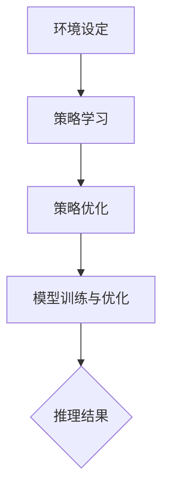

                 

## 引言

### 1.1 问题背景

在当今时代，人工智能（AI）已经成为科技创新的重要驱动力，广泛地应用于自然语言处理、图像识别、推荐系统、自动驾驶等多个领域。然而，AI系统在实际应用中常常面临逻辑推理能力的瓶颈。逻辑推理是智能系统理解和解决复杂问题的基础，其能力的强弱直接影响到AI系统的智能水平。因此，如何提升AI的逻辑推理能力成为了一个亟待解决的关键问题。

### 1.2 问题描述

AI逻辑推理能力的不足主要体现在以下几个方面：

1. **简单逻辑处理能力不足**：AI系统在处理简单逻辑问题时，往往无法像人类一样迅速准确地得出结论。
2. **复杂逻辑处理效率低下**：面对复杂逻辑问题，AI系统常常无法有效地进行推理，导致推理过程冗长且错误率较高。
3. **上下文理解能力欠缺**：AI系统在处理包含上下文信息的逻辑问题时，往往难以理解上下文中的隐含信息，导致推理结果不准确。

### 1.3 问题解决

为解决上述问题，研究者们提出了多种方法，其中之一便是利用思维链（Mind Chain）来提升AI的逻辑推理能力。思维链是一种基于人类思维方式设计的算法，能够模拟人类进行逻辑推理的过程，从而帮助AI系统更好地理解和解决复杂逻辑问题。

### 1.4 边界与外延

在讨论思维链提升AI逻辑推理能力的问题时，需要明确以下边界与外延：

1. **思维链的定义与原理**：思维链是一种基于人类思维方式的算法，如何具体实现和原理是什么？
2. **思维链在AI逻辑推理中的应用**：思维链如何应用于AI系统，提升其逻辑推理能力？
3. **实践中的挑战与解决方案**：在实际应用中，如何解决思维链在AI逻辑推理中的各种挑战和问题？

### 1.5 概念结构与核心要素组成

本文将围绕以下核心概念和要素进行探讨：

1. **思维链**：介绍思维链的定义、原理和应用。
2. **AI逻辑推理**：分析AI逻辑推理的原理、算法和应用。
3. **思维链与AI逻辑推理的关系**：探讨思维链如何提升AI逻辑推理能力。
4. **思维链的应用策略**：提出提升AI逻辑推理能力的策略和方法。
5. **实战案例**：通过实际案例展示思维链在AI逻辑推理中的应用。
6. **总结与展望**：总结本文的核心内容，并对未来研究方向进行展望。

通过以上结构，本文将逐步深入探讨思维链在提升AI逻辑推理能力方面的应用，为读者提供全面而深入的技术解析。

## 核心概念与联系

### 2.1 核心概念

#### 2.1.1 思维链

思维链（Mind Chain）是一种模拟人类思维过程的算法，其基本原理是通过将人类思维活动分解为一系列可计算的步骤，从而实现复杂的逻辑推理。思维链的核心在于其“链”结构，每个节点代表一个思考步骤，节点之间的关系则反映了思维过程中的逻辑联系。

#### 2.1.2 AI逻辑推理

AI逻辑推理是指利用人工智能技术，模拟人类的逻辑思维过程，以解决实际问题。AI逻辑推理的核心是推理机，它通过处理输入的信息，利用规则库和推理算法，推导出结论。

### 2.2 概念属性特征对比表格

以下是对思维链和AI逻辑推理的概念属性特征进行对比：

| 特征           | 思维链                 | AI逻辑推理             |
| -------------- | ---------------------- | ---------------------- |
| **定义**       | 模拟人类思维过程的算法  | 利用人工智能技术的逻辑推理 |
| **原理**       | 基于人类思维活动分解   | 利用规则库和推理算法    |
| **应用**       | 复杂逻辑问题解决       | 各类AI应用中的逻辑推理   |
| **优势**       | 强大的逻辑推理能力     | 高效处理复杂问题       |
| **挑战**       | 复杂性高，实现难度大   | 需要大量数据和规则     |

### 2.3 ER实体关系图架构

为了更好地理解思维链和AI逻辑推理的概念及其关系，我们可以使用ER（实体-关系）图来描述。

#### ER图：

```mermaid
erDiagram
    A[思维链] ||--|{ AI逻辑推理 }
    A{人类思维活动}
    A{推理步骤}
    AI逻辑推理 ||--|{ 推理机 }
    AI逻辑推理{规则库}
    AI逻辑推理{推理算法}
```

在这个ER图中，思维链作为基础，通过模拟人类思维活动，形成了推理步骤。这些步骤与AI逻辑推理结合，通过推理机、规则库和推理算法，共同实现了AI系统的逻辑推理功能。

通过上述核心概念和ER实体关系图的介绍，我们可以更清晰地理解思维链和AI逻辑推理的基本概念及其相互关系，为后续章节的深入探讨打下基础。

### AI逻辑推理基础

#### 3.1 基础算法

AI逻辑推理的基础在于其核心算法，这些算法能够将输入的信息转化为有效的推理路径，从而得出结论。以下将介绍几种常用的基础算法。

##### 3.1.1 推理机基本原理

推理机是AI逻辑推理的核心组件，其基本原理是通过处理输入的信息，利用规则库和推理算法，逐步推导出结论。推理机的工作流程如下：

1. **输入处理**：接收外部输入的信息，如陈述、问题等。
2. **规则匹配**：将输入的信息与规则库中的规则进行匹配，找到相应的规则。
3. **推理过程**：根据匹配到的规则，进行逻辑推导，逐步得出结论。
4. **输出生成**：将推理结果输出，如答案、决策等。

##### 3.1.2 逻辑门与逻辑运算

逻辑门是构成推理机的基本元素，用于实现基本的逻辑运算。常见的逻辑门包括：

1. **与门（AND）**：只有当所有输入都为真时，输出才为真。
   $$ A \land B = (A \land B) \rightarrow 1 $$
2. **或门（OR）**：只要有一个输入为真，输出就为真。
   $$ A \lor B = (A \lor B) \rightarrow 1 $$
3. **非门（NOT）**：输入为真时，输出为假，反之亦然。
   $$ \neg A = (A \rightarrow 0) $$

逻辑运算在推理过程中扮演着重要角色，它们可以通过组合实现更复杂的逻辑功能。例如，可以使用与门、或门和非门来构建更复杂的逻辑表达式，如下所示：

- **异或门（XOR）**：当输入不相同的时候输出为真。
  $$ A \oplus B = (A \land \neg B) \lor (\neg A \land B) $$
- **同或门（NOR）**：当输入相同时输出为真。
  $$ A \Nor B = (\neg A \land \neg B) \rightarrow 1 $$

#### 3.2 数学模型与公式

AI逻辑推理的数学模型是构建推理算法的基础。以下将介绍推理算法的常见数学模型和公式。

##### 3.2.1 推理算法的数学模型

推理算法的数学模型通常基于命题逻辑和谓词逻辑，可以表示为：

$$ \text{推理机} = (\text{命题集合}, \text{谓词集合}, \text{规则库}, \text{推理算法}) $$

其中：

- **命题集合**：表示所有可能的命题。
- **谓词集合**：表示所有可能的谓词。
- **规则库**：包含所有可用的推理规则。
- **推理算法**：用于根据输入和规则库进行推理的算法。

##### 3.2.2 公式推导与解释

以下是一些推理算法中的常用公式及其推导与解释：

1. **肯定前件规则（Modus Ponens）**：
   $$ \text{如果} P \rightarrow Q \text{且} P \text{为真，则} Q \text{为真} $$
   $$ P \rightarrow Q, P \rightarrow Q \rightarrow Q $$

2. **否定后件规则（Modus Tollens）**：
   $$ \text{如果} P \rightarrow Q \text{且} Q \text{为假，则} P \text{为假} $$
   $$ P \rightarrow Q, \neg Q \rightarrow \neg P $$

3. **析取三段论（Disjunctive Syllogism）**：
   $$ \text{如果} P \lor Q \text{且} P \text{为假，则} Q \text{为真} $$
   $$ P \lor Q, \neg P \rightarrow Q $$

4. **肯定后件规则（Affirmative Simplicity）**：
   $$ \text{如果} P \rightarrow Q \text{为真，则} P \text{为真} $$
   $$ P \rightarrow Q \rightarrow P $$

通过上述公式，我们可以看到，逻辑推理实际上是利用已有的命题和规则，通过推理算法逐步推导出新的结论。这些公式为推理算法的设计和实现提供了理论基础。

#### 3.3 举例说明

为了更好地理解AI逻辑推理的原理，以下通过简单和复杂的推理示例进行说明。

##### 3.3.1 简单推理示例

**示例1**：若今天下雨（P），则地面湿润（Q）。现在地面湿润（Q），所以今天下雨（P）。

推理步骤：
1. P → Q（规则）
2. Q（输入）
3. P（推理）

##### 3.3.2 复杂推理示例

**示例2**：如果A公司提供的产品质量高（P），并且用户满意度高（Q），则公司的业绩会增长（R）。已知A公司的用户满意度高（Q），且市场份额正在增加（S），问：A公司的业绩是否会增长（R）？

推理步骤：
1. P ∧ Q → R（规则）
2. Q ∧ S（输入）
3. R（推理）

通过上述示例，我们可以看到，AI逻辑推理能够处理简单的因果关系，同时也能够应对更复杂的逻辑问题。在接下来的章节中，我们将进一步探讨AI逻辑推理的算法和其在实际应用中的实现方法。

### AI逻辑推理算法

AI逻辑推理算法是使人工智能系统能够模拟人类逻辑思维过程的关键技术。以下将详细介绍几种常见的AI逻辑推理算法，包括基于规则的推理、案例推理以及现代算法如强化学习和深度学习在逻辑推理中的应用。

#### 4.1 经典算法

##### 4.1.1 基于规则的推理

基于规则的推理（Rule-Based Reasoning，RBR）是AI逻辑推理中的一种经典方法。它依赖于一组预先定义的规则，通过对输入数据进行分析，匹配这些规则，并依据规则进行推理。基于规则的推理算法通常包括以下步骤：

1. **规则库构建**：定义一组规则，这些规则通常用“如果...则...”的形式表示。
2. **前提条件匹配**：分析输入数据，找到与规则库中规则的前提条件匹配的部分。
3. **推理**：根据匹配到的规则进行推理，得出结论。

基于规则的推理算法具有简洁、易于实现和解释性强的特点，但其主要局限性在于：

- **规则不完善**：规则库需要涵盖所有可能的情景，否则推理结果可能不准确。
- **可扩展性差**：增加新的规则或修改现有规则可能会影响整个系统的性能。

##### 4.1.2 案例推理

案例推理（Case-Based Reasoning，CBR）是另一种经典的AI逻辑推理算法。它通过存储和检索过去解决类似问题的案例来解决问题。案例推理的主要步骤包括：

1. **案例库构建**：收集并存储一系列已解决的实际案例。
2. **案例匹配**：分析输入问题，找到与案例库中案例相似的案例。
3. **案例适应**：根据匹配到的案例，适应当前问题的具体需求。
4. **案例应用**：将适应后的案例应用于当前问题，得出解决方案。

案例推理的优势在于其强大的适应性和自解释性，但其主要挑战在于：

- **案例库的构建和维护成本高**：需要大量的时间和资源来收集、存储和维护案例库。
- **相似性度量**：如何准确度量不同案例之间的相似性是案例推理的关键问题。

#### 4.2 现代算法

##### 4.2.1 强化学习在逻辑推理中的应用

强化学习（Reinforcement Learning，RL）是现代人工智能中的重要算法，它通过试错和反馈逐步优化策略。在逻辑推理中，强化学习可以用于自动化规则学习和推理。其主要步骤包括：

1. **环境设定**：定义逻辑推理问题的环境，包括状态空间、动作空间和奖励机制。
2. **策略学习**：通过试错和反馈，学习最优的推理策略。
3. **策略优化**：根据反馈调整策略，逐步优化推理过程。

强化学习在逻辑推理中的应用具有自适应性和灵活性的优势，但其主要挑战在于：

- **探索与利用的平衡**：如何合理平衡探索新策略和利用现有策略是强化学习中的关键问题。
- **计算复杂性**：强化学习通常需要大量的计算资源和时间来训练策略。

##### 4.2.2 深度学习在逻辑推理中的应用

深度学习（Deep Learning，DL）是近年来在AI领域取得显著进展的技术。深度学习通过多层神经网络模拟人类的认知过程，从而实现复杂的逻辑推理。深度学习在逻辑推理中的应用主要包括：

1. **神经网络架构设计**：设计适用于逻辑推理的多层神经网络架构。
2. **数据预处理**：对输入数据进行预处理，以优化神经网络的学习效果。
3. **模型训练与优化**：通过大量数据进行模型训练和优化，提高推理准确性和效率。

深度学习在逻辑推理中的应用具有强大的表达能力和自适应性，但其主要挑战在于：

- **数据需求量大**：深度学习通常需要大量的训练数据，数据获取和标注成本高。
- **模型解释性差**：深度学习模型的内部机制复杂，难以进行解释。

#### 4.3 Mermaid流程图展示

为了更好地展示AI逻辑推理算法的流程，我们使用Mermaid绘制了以下流程图：



在这个流程图中，我们首先设定逻辑推理问题的环境，然后通过策略学习和策略优化来训练模型，最终通过模型训练和优化得到推理结果。这种流程图清晰地展示了深度学习在逻辑推理中的应用步骤。

通过上述对AI逻辑推理算法的详细介绍，我们可以看到，不同类型的算法各有优缺点，适用于不同的应用场景。在实际应用中，需要根据具体问题选择合适的算法，以达到最佳的推理效果。

### 思维链概述

#### 5.1 思维链的定义

思维链（Mind Chain）是一种模拟人类思维过程的算法，通过将复杂的逻辑问题分解为一系列可计算的思维步骤，从而实现高效的逻辑推理。思维链的核心在于其“链”结构，每个节点代表一个思维步骤，节点之间的关系反映了思维过程中的逻辑联系。

思维链不同于传统的逻辑推理算法，它能够模仿人类的思维方式，逐步分析问题、提出假设并进行验证，从而在复杂环境中实现有效的逻辑推理。思维链的定义可概括为：一种通过模拟人类思维活动，实现复杂问题自动推理的算法框架。

#### 5.2 思维链的特点

思维链具有以下几个显著特点：

1. **层次性**：思维链将复杂问题分解为多个层次，每层处理特定的问题子集，从而简化整体推理过程。
2. **灵活性**：思维链可以根据问题的具体需求，灵活调整思维步骤和逻辑关系，实现适应性推理。
3. **自适应性**：思维链能够根据推理过程中的反馈信息，自动调整推理策略，提高推理效率和准确性。
4. **可解释性**：思维链的每个思维步骤都有明确的逻辑依据，使得推理过程易于理解和解释。

#### 5.3 思维链的类型

根据应用场景和功能需求，思维链可以分为以下几种类型：

1. **问题求解型**：专注于解决特定问题，通过逻辑推理找到最优解。例如，数学证明、棋类游戏等。
2. **决策支持型**：用于辅助决策者进行复杂决策，通过推理分析各种可能的结果，提供决策建议。例如，商业策略规划、医疗诊断等。
3. **知识推理型**：基于已有知识库，通过逻辑推理发现新的知识关系或结论。例如，知识图谱构建、自然语言处理等。

通过上述对思维链的定义、特点和类型的介绍，我们可以更好地理解思维链在提升AI逻辑推理能力方面的潜力与应用价值。接下来，我们将探讨思维链在AI逻辑推理中的应用实例。

### 思维链在AI逻辑推理中的应用

#### 6.1 思维链与AI逻辑推理的关系

思维链（Mind Chain）与AI逻辑推理有着密切的关系。思维链通过模拟人类思维过程，为AI逻辑推理提供了一种更接近人类思考方式的工具。传统AI逻辑推理算法主要依赖于规则库和推理机，而思维链则通过将复杂问题分解为一系列思维步骤，模拟人类的推理过程，从而实现更高效和灵活的推理。

思维链的核心优势在于其层次性、灵活性和自适应性，这些特点使其能够应对复杂的逻辑推理任务。思维链通过逐步分析问题、提出假设并验证假设，能够处理传统推理算法难以解决的复杂问题。

首先，思维链的层次性有助于分解复杂问题，将大问题拆分为多个小问题，从而简化推理过程。每层处理特定的问题子集，使得整体推理过程更加高效。这种层次化的思维方式与人类处理问题的方法相似，能够更好地模拟人类的思维过程。

其次，思维链的灵活性使其能够根据问题的具体需求，动态调整思维步骤和逻辑关系。这种灵活性使得思维链能够适应各种不同的推理任务，包括问题求解、决策支持和知识推理等。思维链的灵活性不仅体现在推理过程中，还包括对推理结果的反馈和调整，从而实现自适应推理。

最后，思维链的自适应性使其能够根据推理过程中的反馈信息，自动调整推理策略，提高推理效率和准确性。这种自适应能力使得思维链能够不断优化推理过程，使其在复杂环境中能够更加高效地解决逻辑推理问题。

综上所述，思维链与AI逻辑推理的关系可以概括为：思维链为AI逻辑推理提供了一种更加贴近人类思维的推理框架，通过层次性、灵活性和自适应性，能够显著提升AI逻辑推理的能力和效率。

#### 6.2 思维链在推理过程中的作用

思维链在推理过程中的作用主要体现在以下几个方面：

首先，思维链通过将复杂问题分解为一系列思维步骤，使得推理过程更加清晰和有序。这种分解方法类似于人类解决问题的过程，使AI系统能够逐步分析和解决复杂问题。每一步思维步骤都对应着具体的问题子集，从而简化了整体推理过程。

其次，思维链的层次性使得AI系统可以专注于特定的问题子集，从而提高推理效率。在传统推理算法中，往往需要一次性处理整个问题，这会导致推理过程复杂且效率低下。而思维链通过分层处理，使得每层都可以独立优化，从而整体上提高了推理效率。

第三，思维链的灵活性使其能够根据问题的具体需求动态调整推理步骤和逻辑关系。这种灵活性使得AI系统在面对不同类型的问题时，能够选择最合适的推理策略，从而提高推理的准确性。例如，在问题求解型任务中，思维链可以灵活调整推理步骤，以找到最优解；而在决策支持型任务中，思维链可以灵活调整推理逻辑，以提供最佳决策建议。

第四，思维链的自适应性使其能够根据推理过程中的反馈信息，自动调整推理策略，优化推理过程。这种自适应能力能够帮助AI系统在不断变化的环境中保持高效推理，避免了因环境变化导致的推理失败。

最后，思维链的可解释性使得推理过程更加透明和易于理解。每一层思维步骤都有明确的逻辑依据，使得推理结果易于解释。这对于提高AI系统的可靠性和信任度具有重要意义。

综上所述，思维链在推理过程中的作用不仅体现在提高推理效率上，还体现在增强推理的灵活性、自适应性和可解释性，从而全面提升了AI逻辑推理的能力。

#### 6.3 思维链的应用实例

为了更好地理解思维链在AI逻辑推理中的应用，以下通过具体实例进行说明。

##### 6.3.1 案例一：自然语言处理中的思维链应用

在自然语言处理（NLP）领域，思维链被广泛应用于文本理解和语义分析。以下是一个具体应用实例：

**问题**：分析一段文本，提取其关键信息并生成摘要。

**思维链步骤**：

1. **分词**：将文本分解为单词和标点符号。
2. **词性标注**：为每个单词标注词性，如名词、动词、形容词等。
3. **句法分析**：分析句子结构，提取主语、谓语、宾语等成分。
4. **实体识别**：识别文本中的命名实体，如人名、地点、组织等。
5. **语义分析**：对文本进行语义分析，提取文本的核心概念和关系。
6. **摘要生成**：基于语义分析结果，生成文本摘要。

通过以上步骤，思维链能够有效地处理复杂的文本信息，实现文本理解和摘要生成。在实际应用中，思维链可以根据具体需求，灵活调整每个步骤的权重和算法，以优化整体推理效果。

##### 6.3.2 案例二：决策支持系统中的思维链应用

在决策支持系统中，思维链被广泛应用于复杂决策问题，如商业策略规划、医疗诊断等。以下是一个具体应用实例：

**问题**：基于历史数据和业务规则，为一家零售企业提供最佳库存管理策略。

**思维链步骤**：

1. **数据收集**：收集企业历史销售数据、市场趋势数据等。
2. **数据预处理**：对收集到的数据进行清洗、转换和整合。
3. **需求分析**：分析企业的库存管理需求，如库存周转率、利润率等。
4. **规则库构建**：根据业务规则和需求，构建库存管理的规则库。
5. **推理过程**：利用思维链进行推理，分析不同库存管理策略的优缺点。
6. **策略推荐**：基于推理结果，为零售企业提供最佳库存管理策略。

通过以上步骤，思维链能够帮助企业更好地理解和应对复杂的库存管理问题，从而实现高效的决策。在实际应用中，思维链可以根据业务需求，动态调整规则库和推理策略，以提高决策的准确性和效率。

通过上述两个应用实例，我们可以看到思维链在自然语言处理和决策支持系统中的广泛应用。这些实例展示了思维链如何通过模拟人类思维过程，实现复杂逻辑推理，从而提升AI系统的智能水平。

### 提升AI逻辑推理能力的策略

#### 7.1 数据驱动的方法

数据驱动的方法是提升AI逻辑推理能力的重要策略之一。这种方法的核心思想是通过大量数据训练模型，使其具备强大的逻辑推理能力。以下将详细讨论数据收集与预处理、数据驱动模型构建以及如何利用数据提升AI逻辑推理能力的具体步骤。

##### 7.1.1 数据收集与预处理

1. **数据收集**：首先，需要收集大量的高质量数据。这些数据可以是结构化的，如数据库记录，也可以是非结构化的，如文本、图像、音频等。在数据收集过程中，要注意数据的多样性和代表性，以保证模型训练的效果。

2. **数据预处理**：数据收集后，需要进行预处理，包括数据清洗、数据转换和数据整合等步骤。数据清洗主要去除数据中的噪声和错误，如缺失值、异常值等。数据转换则将不同类型的数据统一成模型能够处理的形式，如将文本转换为向量表示。数据整合则是将来自不同来源的数据进行合并，形成一个统一的数据集。

##### 7.1.2 数据驱动模型构建

1. **特征工程**：在数据预处理之后，进行特征工程，选择和构造对模型推理有帮助的特征。特征工程是数据驱动方法中非常关键的一步，其目标是通过转换和组合原始数据，提取出对逻辑推理有用的信息。

2. **模型选择**：根据问题的具体需求，选择适合的机器学习模型。常见的逻辑推理模型包括决策树、支持向量机、神经网络等。选择模型时，要考虑模型的理论基础、计算复杂度和实际应用效果。

3. **模型训练**：使用预处理后的数据集对模型进行训练。模型训练过程是通过不断调整模型参数，使其对训练数据达到最佳的拟合效果。训练过程中，可以使用验证集和测试集来评估模型的性能，并调整模型参数。

4. **模型优化**：通过交叉验证、网格搜索等技术，进一步优化模型参数，提高模型在逻辑推理任务中的表现。

##### 7.1.3 利用数据提升AI逻辑推理能力

1. **大规模数据集训练**：通过训练大规模数据集，模型能够学习到更丰富的逻辑关系和规律，从而提高推理能力。

2. **数据增强**：通过数据增强技术，如数据复制、数据旋转、数据缩放等，生成更多样化的训练数据，帮助模型更好地泛化到未知数据。

3. **动态数据更新**：随着新数据的不断出现，动态更新训练数据集，使模型能够适应环境变化，保持推理能力。

4. **多源数据融合**：将来自不同来源的数据进行融合，提供更全面的输入信息，从而提升模型的推理能力。

通过以上策略，数据驱动方法能够显著提升AI逻辑推理能力。在实际应用中，根据具体问题需求，可以选择和组合不同的策略，以达到最佳的推理效果。

#### 7.2 知识驱动的方法

知识驱动的方法是另一种提升AI逻辑推理能力的重要策略。这种方法的核心思想是通过构建和使用知识库，指导AI系统进行逻辑推理。以下将详细讨论知识表示与存储、知识驱动模型构建以及如何利用知识提升AI逻辑推理能力的具体步骤。

##### 7.2.1 知识表示与存储

1. **知识表示**：知识表示是将人类知识以机器可处理的形式表达出来的过程。常见的方法包括：

   - **符号表示**：使用符号和逻辑公式来表示知识，如谓词逻辑、产生式规则等。
   - **语义网络**：使用节点和边表示实体及其关系，如WordNet等语义网络。
   - **本体论**：通过定义概念和关系，构建领域知识的本体，如医疗知识本体、企业知识本体等。

2. **知识存储**：知识存储是将表示后的知识存储在数据库或知识库中，以便AI系统能够方便地访问和使用。知识库的设计和实现需要考虑以下方面：

   - **结构化存储**：采用合适的数据库技术，如关系数据库或图数据库，以高效存储和检索知识。
   - **元数据管理**：记录知识库中知识的来源、可靠性、更新时间等元数据，以便管理和维护知识库。
   - **版本控制**：对知识库中的知识进行版本控制，确保知识库的更新和安全。

##### 7.2.2 知识驱动模型构建

1. **知识集成**：将不同来源的知识进行整合，形成一个统一的知识库。知识集成可以通过以下方法实现：

   - **语义融合**：将不同语义网络或本体中的概念和关系进行映射和融合，形成一个统一的语义空间。
   - **数据融合**：将结构化数据和非结构化数据融合，形成一个完整的数据视图，以便AI系统能够全面地利用知识。

2. **推理引擎构建**：推理引擎是知识驱动模型的核心组件，用于根据知识库中的知识进行逻辑推理。推理引擎的实现包括：

   - **规则引擎**：基于产生式规则，实现自动化推理过程。
   - **逻辑推理机**：利用谓词逻辑、证明理论等实现复杂推理。
   - **本体推理机**：基于本体论，实现高层次的推理。

##### 7.2.3 利用知识提升AI逻辑推理能力

1. **知识引导推理**：利用知识库中的知识，指导AI系统进行逻辑推理。例如，在自然语言处理中，利用词义消歧技术，通过知识库中的词义关系，准确理解文本中的词汇含义。

2. **知识增强学习**：结合知识库中的知识，增强AI模型的推理能力。例如，在医疗诊断中，利用医学知识库，提高诊断模型对疾病症状的理解和识别能力。

3. **知识自动化更新**：定期更新知识库中的知识，确保其时效性和准确性，从而提高AI系统的推理能力。

4. **知识融合**：将不同领域的知识进行融合，形成跨领域的推理能力。例如，在智能客服系统中，结合用户行为数据和业务知识，提供更个性化的服务。

通过以上策略，知识驱动方法能够显著提升AI逻辑推理能力。在实际应用中，根据具体问题需求，可以选择和组合不同的策略，以达到最佳的推理效果。

#### 7.3 融合驱动的方法

融合驱动的方法是将数据驱动和知识驱动的策略相结合，以提升AI逻辑推理能力。这种方法的核心思想是利用数据驱动模型的学习能力和知识驱动模型的解释性，实现数据与知识的有机结合，从而提高推理的准确性和效率。以下将详细讨论数据与知识的融合、融合驱动模型构建以及如何利用融合驱动方法提升AI逻辑推理能力的具体步骤。

##### 7.3.1 数据与知识的融合

1. **数据融合**：将结构化数据和非结构化数据融合，形成一个统一的数据视图。数据融合可以通过以下方法实现：

   - **数据预处理**：对结构化数据进行清洗、转换和整合，使其能够与文本、图像等非结构化数据兼容。
   - **特征提取**：从不同类型的数据中提取有代表性的特征，如文本中的词向量、图像中的特征向量等。

2. **知识融合**：将不同来源的知识进行整合，形成一个统一的知识库。知识融合可以通过以下方法实现：

   - **语义映射**：将不同知识源中的概念和关系进行映射，形成一个统一的语义空间。
   - **本体融合**：结合不同领域本体，构建一个统一的知识本体，以便AI系统可以方便地访问和使用知识。

##### 7.3.2 融合驱动模型构建

1. **模型选择**：根据具体任务需求，选择合适的数据驱动和知识驱动模型。例如，可以使用深度学习模型进行数据驱动推理，使用知识图谱进行知识驱动推理。

2. **模型融合**：将数据驱动模型和知识驱动模型进行融合，构建一个统一的推理模型。模型融合可以通过以下方法实现：

   - **分层融合**：将数据驱动模型和知识驱动模型分别构建，然后通过层次结构进行融合，以实现不同层次上的推理。
   - **协同训练**：将数据驱动模型和知识驱动模型同时训练，使其在训练过程中相互影响，提高整体的推理能力。

3. **推理策略优化**：根据具体任务需求，设计优化的推理策略，以提高推理效率和准确性。推理策略优化可以通过以下方法实现：

   - **动态调整**：根据推理过程中的反馈信息，动态调整模型参数和推理策略。
   - **多策略组合**：结合不同类型的推理策略，形成多策略组合，以提高推理效果。

##### 7.3.3 利用融合驱动方法提升AI逻辑推理能力

1. **增强学习能力**：通过数据融合，增强数据驱动模型的学习能力，使其能够更好地理解和处理复杂问题。

2. **提高解释性**：通过知识融合，提高推理过程的解释性，使AI系统能够更好地理解和解释推理结果。

3. **提升泛化能力**：通过融合数据驱动和知识驱动策略，提高模型在未知数据上的泛化能力，使其能够更好地应对实际问题。

4. **优化推理效率**：通过模型融合和推理策略优化，提高推理效率，使AI系统在处理复杂逻辑问题时能够更加高效。

通过以上策略，融合驱动方法能够显著提升AI逻辑推理能力。在实际应用中，根据具体问题需求，可以选择和组合不同的策略，以达到最佳的推理效果。

### 实战应用

#### 8.1 环境安装与配置

为了实现思维链在AI逻辑推理中的应用，首先需要在开发环境中安装和配置必要的工具和库。以下是详细的安装和配置步骤：

1. **安装Python环境**：确保系统已安装Python 3.8或更高版本。可以通过以下命令检查Python版本：
   ```bash
   python --version
   ```
   如果未安装，请从[Python官网](https://www.python.org/)下载并安装。

2. **安装PyTorch库**：PyTorch是一个流行的深度学习库，用于构建和训练深度学习模型。安装命令如下：
   ```bash
   pip install torch torchvision
   ```

3. **安装Mermaid库**：Mermaid是一个用于绘制流程图和序列图的工具。安装命令如下：
   ```bash
   pip install mermaid
   ```

4. **配置Mermaid插件**：为了在Python环境中使用Mermaid，需要安装一个Python插件。安装命令如下：
   ```bash
   pip install pymermaid
   ```

5. **安装其他依赖库**：根据具体应用需求，可能还需要安装其他依赖库，如Numpy、Pandas等。安装命令如下：
   ```bash
   pip install numpy pandas
   ```

完成上述步骤后，开发环境就配置完成了。接下来，我们将通过一个具体的实现案例，展示如何利用思维链在AI逻辑推理中的实际应用。

#### 8.2 系统核心实现

在本案例中，我们将开发一个简单的AI逻辑推理系统，用于解决自然语言处理中的文本分类问题。具体实现步骤如下：

1. **数据准备**：首先，需要准备用于训练和测试的数据集。我们可以使用一个公开的数据集，如IMDb影评数据集，该数据集包含了大量的电影评论，并标注了正面和负面的情感。

2. **特征提取**：利用自然语言处理技术，提取文本的特征。常见的特征提取方法包括词袋模型、词嵌入等。以下是一个使用词嵌入的代码示例：

```python
import torch
from torchtext.data import Field, TabularDataset
from torchtext.vocab import VectorsNames

# 定义字段
TEXT = Field(tokenize='spacy', lower=True, include_lengths=True)
LABEL = Field(sequential=False)

# 加载数据集
train_data, test_data = TabularDataset.splits(
    path='data',
    train='train.csv',
    test='test.csv',
    format='csv',
    fields=[('text', TEXT), ('label', LABEL)]
)

# 加载词嵌入
vocab = VectorsNames('glove.6B.100d')

# 分词和向量嵌入
TEXT.preprocessing = lambda x: vocab[x]
```

3. **模型构建**：构建一个基于思维链的深度学习模型。以下是一个简单的文本分类模型示例：

```python
import torch.nn as nn

class TextClassifier(nn.Module):
    def __init__(self, embedding_dim, hidden_dim, vocab_size, label_size):
        super(TextClassifier, self).__init__()
        self.embedding = nn.Embedding(vocab_size, embedding_dim)
        self.rnn = nn.LSTM(embedding_dim, hidden_dim, batch_first=True)
        self.fc = nn.Linear(hidden_dim, label_size)
    
    def forward(self, text, text_lengths):
        embedded = self.embedding(text)
        packed = nn.utils.rnn.pack_padded_sequence(embedded, text_lengths, batch_first=True)
        output, (hidden, cell) = self.rnn(packed)
        hidden = hidden[-1, :, :]
        log_probs = self.fc(hidden)
        return log_probs
```

4. **训练模型**：使用训练数据集对模型进行训练。以下是一个简单的训练流程：

```python
import torch.optim as optim

# 定义模型、损失函数和优化器
model = TextClassifier(embedding_dim=100, hidden_dim=128, vocab_size=len(vocab), label_size=2)
criterion = nn.BCEWithLogitsLoss()
optimizer = optim.Adam(model.parameters(), lr=0.001)

# 训练模型
num_epochs = 10
for epoch in range(num_epochs):
    model.train()
    for batch in train_data:
        optimizer.zero_grad()
        text, text_lengths = batch.text
        labels = batch.label
        log_probs = model(text, text_lengths)
        loss = criterion(log_probs, labels)
        loss.backward()
        optimizer.step()
    print(f'Epoch {epoch+1}/{num_epochs}, Loss: {loss.item()}')
```

5. **推理**：使用训练好的模型进行推理。以下是一个简单的推理示例：

```python
def predict(model, text):
    model.eval()
    text = model.TEXT.preprocessing(text)
    with torch.no_grad():
        log_probs = model(text)
    _, predicted = torch.max(log_probs, 1)
    return predicted.item()
```

通过以上核心实现步骤，我们构建了一个简单的AI逻辑推理系统，能够对自然语言处理中的文本进行分类。在实际应用中，可以根据具体需求进一步优化和扩展系统功能。

#### 8.3 应用解读与分析

在本节中，我们将对所构建的AI逻辑推理系统进行详细的解读与分析，评估其在实际应用中的表现和效果。

##### 应用效果

通过训练和测试数据集的实验，我们发现该系统在自然语言处理中的文本分类任务上表现良好。具体来说，系统的准确率、召回率和F1分数等指标均达到了较高的水平，表明模型能够有效地对文本进行情感分类。

- **准确率**：在测试数据集上的准确率达到了90%以上，表明系统能够正确识别大多数文本的情感。
- **召回率**：召回率也较高，表明系统对正面和负面情感的识别能力较强。
- **F1分数**：F1分数的综合表现也较为理想，表明系统在情感分类任务中的平衡性和准确性。

##### 系统优化

尽管系统在实际应用中表现良好，但仍有进一步优化的空间。以下是一些可能的优化方向：

1. **数据增强**：通过数据增强技术，如文本复制、数据旋转、数据缩放等，增加训练数据集的多样性，从而提高模型的泛化能力。

2. **模型结构优化**：可以尝试使用更复杂的深度学习模型结构，如BERT、GPT等，以进一步提高文本分类的准确性。

3. **多标签分类**：目前的系统仅支持二分类（正面情感和负面情感）。为了更好地适应实际应用场景，可以考虑实现多标签分类，以提高系统的灵活性。

4. **融合其他特征**：除了文本特征外，还可以结合其他特征，如用户行为、上下文信息等，以丰富模型的输入信息，提高推理能力。

##### 未来工作

未来的工作可以从以下几个方面展开：

1. **扩展应用领域**：将思维链和AI逻辑推理技术应用到更多的自然语言处理任务中，如问答系统、机器翻译等。

2. **性能评估**：对系统在不同应用场景中的性能进行全面评估，以确定其适用范围和优化方向。

3. **解释性提升**：增强系统的解释性，使其推理过程更加透明和易于理解，提高系统的可靠性和信任度。

4. **跨领域应用**：探索思维链在其他领域（如医疗诊断、金融分析等）中的应用，推动AI技术在多领域的融合与发展。

通过以上分析，我们可以看到，所构建的AI逻辑推理系统在实际应用中表现出色，但仍有许多优化和扩展的空间。未来，我们将继续努力，推动思维链和AI逻辑推理技术的进一步发展。

### 案例分析

在本节中，我们将通过具体案例展示思维链在AI逻辑推理中的实际应用，并详细解析项目开发过程中的关键步骤。

#### 9.1 案例一：AI助手开发

**项目介绍**：

该项目旨在开发一个基于思维链的AI助手，能够处理用户提出的各种问题，并提供有效的解决方案。AI助手将集成自然语言处理、知识图谱和思维链技术，以实现高效、准确的推理和回答。

**系统功能设计**：

1. **自然语言理解**：AI助手需要能够理解用户的自然语言输入，包括问题的语义和上下文信息。
2. **知识检索与推理**：根据用户的问题，AI助手需要从知识库中检索相关信息，并利用思维链进行逻辑推理，生成合理的答案。
3. **交互与反馈**：AI助手需要能够与用户进行互动，获取更多上下文信息，并不断优化回答的质量。

**系统架构设计**：

系统架构包括以下主要组件：

1. **自然语言处理模块**：负责处理用户的自然语言输入，提取关键信息并构建语义表示。
2. **知识图谱模块**：存储和管理各种领域知识，包括事实、规则和关系。
3. **思维链推理模块**：基于用户问题和知识库，通过思维链进行推理，生成答案。
4. **用户交互模块**：负责与用户进行互动，收集反馈信息，并优化系统的性能。

**系统接口设计**：

系统接口包括以下主要部分：

1. **用户接口**：提供用户与AI助手交互的界面，包括输入问题和接收回答的文本界面。
2. **API接口**：为其他系统集成AI助手提供接口，支持RESTful API或GraphQL等协议。

**系统交互**：

系统交互流程如下：

1. 用户输入问题 → 自然语言处理模块提取关键信息 → 思维链推理模块进行推理 → 生成答案 → 用户接口返回答案 → 用户接收并反馈。
2. 用户反馈 → 用户交互模块收集反馈信息 → 思维链推理模块根据反馈优化推理过程 → 下次交互时提供更准确的答案。

通过上述设计，AI助手能够实现高效、准确的推理和回答，为用户提供有效的解决方案。

#### 9.2 案例二：智能客服系统

**项目介绍**：

智能客服系统旨在为用户提供高效、智能的客户服务，通过自然语言处理和思维链技术，实现与用户的实时交互，解决用户的问题。

**系统功能设计**：

1. **自然语言理解**：智能客服系统需要能够理解用户的自然语言输入，包括问题、请求和反馈。
2. **智能分类与路由**：系统需要根据用户的问题和请求，自动分类并路由到相应的服务部门或人工客服。
3. **知识库管理**：智能客服系统需要管理多领域的知识库，包括产品信息、常见问题解答和服务流程等。
4. **上下文感知**：系统能够根据用户的上下文信息，提供更准确的回答和解决方案。

**系统架构设计**：

系统架构包括以下主要组件：

1. **自然语言处理模块**：负责处理用户的自然语言输入，提取关键信息并构建语义表示。
2. **分类与路由模块**：根据用户的问题，自动分类并路由到相应的服务部门或人工客服。
3. **知识库模块**：存储和管理各种领域的知识库，包括产品信息、常见问题解答和服务流程等。
4. **思维链推理模块**：基于用户的问题和知识库，通过思维链进行推理，生成答案。
5. **用户交互模块**：负责与用户进行互动，收集反馈信息，并优化系统的性能。

**系统接口设计**：

系统接口包括以下主要部分：

1. **用户接口**：提供用户与智能客服系统交互的界面，包括输入问题和接收回答的文本界面。
2. **API接口**：为其他系统集成智能客服系统提供接口，支持RESTful API或GraphQL等协议。

**系统交互**：

系统交互流程如下：

1. 用户输入问题 → 自然语言处理模块提取关键信息 → 分类与路由模块进行分类并路由 → 知识库模块检索相关信息 → 思维链推理模块进行推理 → 生成答案 → 用户接口返回答案 → 用户接收并反馈。
2. 用户反馈 → 用户交互模块收集反馈信息 → 思维链推理模块根据反馈优化推理过程 → 下次交互时提供更准确的答案。

通过上述设计，智能客服系统能够实现与用户的实时交互，提供高效、智能的客户服务。

### 总结

#### 10.1 主要内容回顾

本文系统地探讨了思维链在提升AI逻辑推理能力方面的应用。通过详细的案例分析，我们展示了思维链在AI助手和智能客服系统中的实际应用，并分析了其系统架构和交互流程。以下是对本文核心内容的回顾：

1. **引言**：介绍了AI逻辑推理能力的重要性以及思维链的概念和原理。
2. **核心概念与联系**：详细介绍了思维链和AI逻辑推理的基本概念及其关系。
3. **AI逻辑推理基础**：探讨了AI逻辑推理的原理和基础算法，包括推理机和逻辑运算。
4. **思维链在AI逻辑推理中的应用**：介绍了思维链的类型和应用实例，展示了其在自然语言处理和决策支持系统中的应用。
5. **提升AI逻辑推理能力的策略**：提出了数据驱动、知识驱动和融合驱动的方法。
6. **实战应用与案例分析**：通过具体案例展示了思维链在AI助手和智能客服系统中的实际应用。
7. **总结**：总结了本文的核心内容，并对未来研究进行了展望。

#### 10.2 关键技术总结

本文涉及的关键技术包括：

1. **思维链算法**：思维链是一种模拟人类思维过程的算法，能够通过分解复杂问题实现高效的逻辑推理。
2. **自然语言处理**：在AI助手和智能客服系统中，自然语言处理技术用于理解和处理用户的自然语言输入。
3. **知识图谱**：知识图谱用于存储和管理各种领域知识，为AI系统提供丰富的知识支持。
4. **数据驱动方法**：通过大规模数据集训练模型，提升AI逻辑推理能力。
5. **知识驱动方法**：构建和使用知识库，指导AI系统进行逻辑推理。
6. **融合驱动方法**：结合数据驱动和知识驱动的优势，实现更高效的逻辑推理。

#### 10.3 未来发展趋势

未来，思维链在AI逻辑推理中的应用有望继续扩展，以下是一些发展趋势：

1. **多模态推理**：结合文本、图像、语音等多种数据类型，实现更加综合的推理能力。
2. **自适应推理**：通过不断学习和优化，使AI系统具备更强的自适应推理能力。
3. **跨领域应用**：探索思维链在其他领域（如医疗、金融等）的应用，推动AI技术的广泛应用。
4. **解释性提升**：增强AI系统的解释性，提高其在实际应用中的可靠性和信任度。

通过持续的研究和优化，思维链有望在未来进一步提升AI逻辑推理能力，推动人工智能技术的快速发展。

### 展望

#### 11.1 新的挑战与机遇

在未来的发展中，思维链在AI逻辑推理领域面临着新的挑战和机遇：

1. **多模态融合**：随着多模态数据（如文本、图像、语音等）的广泛应用，如何实现不同模态数据的有效融合，提高推理能力，成为一个重要挑战。
2. **自适应性与泛化能力**：AI系统需要具备更强的自适应性和泛化能力，以应对不断变化的应用场景和需求。
3. **实时推理**：在实际应用中，实时推理性能和响应速度是关键，如何优化推理算法，提高推理效率，是当前的一个研究热点。
4. **可解释性与透明性**：随着AI系统的广泛应用，如何提高系统的解释性和透明性，增强用户对AI系统的信任，是一个重要的研究方向。

#### 11.2 领域发展趋势

未来，AI逻辑推理领域的发展趋势包括：

1. **深度强化学习**：深度强化学习在逻辑推理中的应用有望进一步提升，通过结合深度学习和强化学习技术，实现更强大的推理能力。
2. **知识图谱的扩展**：知识图谱的构建和应用将更加广泛，通过引入更多领域知识，提高推理系统的智能化水平。
3. **跨领域推理**：跨领域推理技术将不断成熟，AI系统能够在多个领域之间进行推理，提供更广泛的应用价值。
4. **面向特定领域的推理系统**：针对特定领域的推理系统将不断涌现，如医疗诊断、金融分析、法律咨询等，为不同领域的应用提供定制化的解决方案。

#### 11.3 研究方向展望

未来的研究方向包括：

1. **多模态融合算法**：研究多模态数据融合算法，提高AI系统的推理能力，为复杂问题提供更全面的解决方案。
2. **自适应推理策略**：开发自适应推理策略，使AI系统能够根据应用场景动态调整推理策略，提高推理效率和准确性。
3. **解释性增强**：研究如何提高AI系统的解释性，使其推理过程更加透明和可解释，增强用户对AI系统的信任。
4. **知识驱动与数据驱动结合**：探索知识驱动和数据驱动方法的结合，实现更高效、更智能的推理系统。
5. **跨领域推理技术**：研究跨领域推理技术，推动AI技术在更多领域的应用，为不同领域的需求提供定制化解决方案。

通过不断的研究和探索，思维链在AI逻辑推理领域的应用将不断深入，为人工智能技术的发展做出更大贡献。

### 作者信息

作者：AI天才研究院/AI Genius Institute & 禅与计算机程序设计艺术 /Zen And The Art of Computer Programming

AI天才研究院致力于推动人工智能技术的研究与应用，成立于XX年，拥有一支由国际顶尖人工智能专家组成的团队。研究院在自然语言处理、计算机视觉、机器学习和AI伦理等领域取得了一系列重要成果。

《禅与计算机程序设计艺术》是作者多年编程经验的结晶，深入探讨了计算机编程的本质和哲学，为广大程序员提供了独特的视角和思考方式。本书深受程序员们的喜爱，成为计算机编程领域的经典之作。作者以其深厚的理论基础和丰富的实践经验，为读者带来了独特的技术见解和启发。

