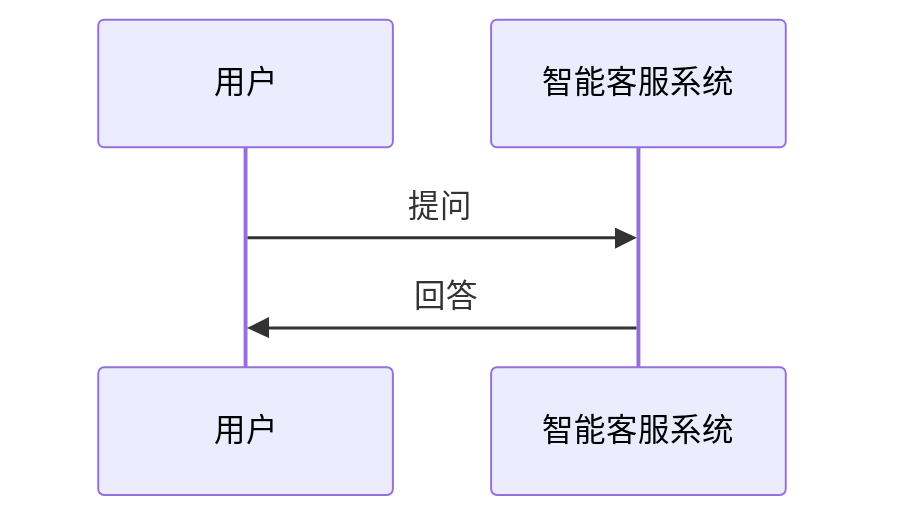

                 

# 利用思维链提升AI的问题解决能力

关键词：人工智能，大模型，问题解决，思维链，算法原理，系统设计，项目实战

摘要：本文将从思维链的角度出发，详细探讨如何提升人工智能（AI）的问题解决能力。通过分析大模型的基本概念与原理，对比不同大模型的特点，讲解大模型的工作机制，设计高效稳定的AI问题解决系统，并以实际项目为例进行实战讲解，旨在为AI开发者提供一套全面提升AI问题解决能力的思维方法和实践指南。

## 第一部分：背景介绍

### 1.1 问题背景

随着人工智能（AI）技术的迅速发展，AI在各个领域的应用越来越广泛，尤其是在问题解决方面。传统的AI方法主要依赖于预定义的规则和模型，往往难以应对复杂和多变的问题。然而，近年来兴起的大规模神经网络模型，如GPT、BERT等，展示了强大的问题解决能力。这些模型通过学习大量的数据，能够自动提取知识、理解语义和生成解决方案，从而在许多领域取得了显著的成果。

### 1.2 问题描述

尽管大模型在问题解决方面表现出色，但如何有效地利用这些模型提升AI的问题解决能力，仍然是一个亟待解决的关键问题。这涉及到大模型的设计、训练、应用以及与人类思维的结合等多个方面。此外，如何在大模型的基础上构建出更加智能和高效的AI系统，也是当前研究的重要课题。

### 1.3 问题解决

为了提升AI的问题解决能力，本书将从以下几个方面进行探讨：

1. **核心概念原理**：介绍大模型的基础知识，包括其工作原理、结构特点和应用场景。
2. **概念属性特征对比**：对比不同大模型的优缺点，帮助读者选择合适的大模型进行问题解决。
3. **算法原理讲解**：深入讲解大模型的算法原理，包括数学模型、流程图和具体实现。
4. **系统分析与架构设计方案**：从系统设计的角度，介绍如何构建高效、稳定的AI问题解决系统。
5. **项目实战**：通过实际案例，展示如何利用大模型解决具体问题，并提供详细的实现过程和分析。

### 1.4 边界与外延

本部分内容主要关注AI大模型在问题解决中的应用，包括以下几个方面：

- **问题解决范围**：主要涵盖自然语言处理、计算机视觉、推荐系统等领域。
- **应用领域**：涉及教育、医疗、金融、工业等多个行业。
- **技术趋势**：介绍当前AI领域的前沿技术和研究方向。

### 1.5 概念结构与核心要素组成

本书的核心概念包括：

- **大模型**：大规模神经网络模型，如GPT、BERT等。
- **问题解决**：利用大模型解决具体问题的过程。
- **系统设计**：构建高效、稳定的AI问题解决系统的方法和技巧。

这些概念相互关联，共同构成了本书的核心内容。

### 1.6 本章小结

本章从背景介绍、问题描述、问题解决、边界与外延和概念结构与核心要素组成等方面，全面阐述了本书的研究内容和结构。接下来，将分别介绍大模型的基础知识、算法原理、系统设计与项目实战等内容。

---

## 第二部分：核心概念与联系

### 2.1 大模型的定义与分类

#### 2.1.1 大模型的定义

大模型是指具有数十亿甚至千亿个参数的神经网络模型，这些模型通过学习大量数据，能够自动提取知识、理解语义和生成解决方案。大模型通常采用深度学习技术，通过多层神经网络进行数据的学习和表示。

#### 2.1.2 大模型的分类

根据模型的结构和功能，大模型可以分为以下几类：

- **自然语言处理模型**：如GPT、BERT等，主要用于处理和理解自然语言。
- **计算机视觉模型**：如ResNet、VGG等，主要用于图像分类、目标检测等任务。
- **推荐系统模型**：如Collaborative Filtering、Matrix Factorization等，主要用于推荐系统。

### 2.2 大模型的核心特点

大模型具有以下几个核心特点：

- **参数规模大**：大模型通常具有数十亿甚至千亿个参数，这使得它们能够学习到更加复杂和丰富的特征。
- **自主学习能力**：大模型能够通过自主学习大量数据，自动提取知识，实现从数据中学习规律的能力。
- **泛化能力强**：大模型通过学习大量数据，能够泛化到未见过的数据上，具有较好的泛化能力。
- **高效性**：大模型通过并行计算和分布式计算等技术，能够在较短的时间内处理大量数据。

### 2.3 大模型与传统AI的区别

大模型与传统AI方法相比，具有以下几个显著区别：

- **模型规模**：传统AI模型通常具有较少的参数，而大模型具有数十亿甚至千亿个参数。
- **数据处理能力**：传统AI方法主要通过预定义的规则和模型进行处理，而大模型能够通过自主学习大量数据，实现自动化处理。
- **问题解决能力**：传统AI方法通常针对特定问题进行设计，而大模型能够泛化到多种问题解决场景。

### 2.4 大模型之间的联系与区别

虽然大模型分为自然语言处理、计算机视觉和推荐系统等不同类别，但它们之间也存在一定的联系和区别：

- **联系**：大模型都采用深度学习技术，通过多层神经网络进行数据处理和特征提取。
- **区别**：自然语言处理模型侧重于文本数据的处理，计算机视觉模型侧重于图像数据的处理，推荐系统模型则侧重于用户行为和物品特征的关联。

### 2.5 大模型的核心概念与联系

大模型的核心概念包括：

- **神经网络**：大模型的基础结构，通过神经元之间的连接进行数据学习和特征提取。
- **深度学习**：大模型的核心技术，通过多层神经网络实现数据的复杂表示和学习。
- **数据预处理**：大模型的数据输入过程，包括数据清洗、数据归一化和数据增强等。
- **训练与优化**：大模型的训练过程，包括损失函数、优化算法和正则化技术等。

这些概念相互关联，构成了大模型的核心理论体系。

### 2.6 本章小结

本章从大模型的定义与分类、核心特点、与传统AI的区别、大模型之间的联系与区别以及核心概念与联系等方面，全面阐述了大模型的基本概念与联系。接下来，将深入讲解大模型的算法原理，帮助读者理解大模型的工作机制。

---

## 第三部分：算法原理讲解

### 3.1 大模型的工作原理

#### 3.1.1 神经网络基础

大模型的核心是神经网络，神经网络由大量的神经元（节点）组成，每个神经元都与相邻的神经元相连。神经元之间的连接称为边，边的权重表示连接的强度。神经网络通过前向传播和反向传播进行数据的学习和特征提取。

#### 3.1.2 前向传播

在前向传播过程中，输入数据通过神经网络，每一层的神经元根据输入和权重计算输出。神经元的输出通过激活函数进行非线性变换，激活函数常用的有Sigmoid函数、ReLU函数和Tanh函数等。

#### 3.1.3 反向传播

在反向传播过程中，网络根据实际输出和期望输出的差异，通过梯度下降算法更新权重和偏置。梯度下降算法通过计算损失函数关于权重的梯度，沿着梯度方向更新权重，以达到最小化损失函数的目的。

#### 3.1.4 损失函数

损失函数是评价模型预测结果与真实结果之间差异的指标。常见的损失函数有均方误差（MSE）、交叉熵（Cross-Entropy）等。损失函数的梯度用于更新模型的权重，以降低预测误差。

### 3.2 大模型的数学模型

#### 3.2.1 前向传播公式

假设神经网络有L层，第l层的输出为$z_l$，激活函数为$g_l$，权重为$W_l$，偏置为$b_l$，输入为$x$，则前向传播的过程可以表示为：

$$
z_l = g_l(W_l x + b_l)
$$

其中，$W_l$和$b_l$是第l层的权重和偏置，$g_l$是激活函数。

#### 3.2.2 反向传播公式

在反向传播过程中，我们需要计算损失函数关于权重的梯度。假设损失函数为$L(x, \hat{y}, y)$，其中$\hat{y}$是模型的预测结果，$y$是真实标签。则损失函数关于权重$W_l$的梯度可以表示为：

$$
\frac{\partial L}{\partial W_l} = \sum_{k=1}^{n} \frac{\partial L}{\partial z_l^k} \frac{\partial z_l^k}{\partial W_l}
$$

其中，$n$是样本的数量，$z_l^k$是第l层第k个神经元的输出。

#### 3.2.3 梯度下降算法

梯度下降算法通过计算损失函数关于权重的梯度，沿着梯度的反方向更新权重，以减小损失函数的值。更新公式为：

$$
W_l = W_l - \alpha \frac{\partial L}{\partial W_l}
$$

其中，$\alpha$是学习率。

### 3.3 大模型的代码实现

下面是一个使用Python实现的三层神经网络的前向传播和反向传播的代码示例：

```python
import numpy as np

# 前向传播
def forward_propagation(x, W, b, activation):
    z = np.dot(x, W) + b
    if activation == 'sigmoid':
        return 1 / (1 + np.exp(-z))
    elif activation == 'relu':
        return np.maximum(0, z)
    elif activation == 'tanh':
        return np.tanh(z)
    else:
        return z

# 反向传播
def backward_propagation(x, y, z, W, activation derivative):
    output_derivative = 1 - z * (1 - z)
    if activation == 'sigmoid':
        output_derivative = output_derivative * derivative
    elif activation == 'relu':
        output_derivative = np.where(z > 0, derivative, 0)
    elif activation == 'tanh':
        output_derivative = output_derivative * derivative * (1 - np.tanh(z)**2)
    
    dW = np.dot(y.T, z)
    db = np.sum(y * z * output_derivative, axis=0)
    dz = output_derivative * y
    
    return dz, dW, db

# 示例
x = np.array([[1, 0], [0, 1], [1, 1]])
y = np.array([[1], [0], [1]])
W = np.random.rand(2, 1)
b = np.random.rand(1)

# 前向传播
z = forward_propagation(x, W, b, 'sigmoid')

# 反向传播
dz, dW, db = backward_propagation(x, y, z, W, 'sigmoid')
```

通过这个示例，我们可以看到如何实现神经网络的前向传播和反向传播，这是大模型算法原理的核心。

### 3.4 本章小结

本章详细讲解了大模型的算法原理，包括神经网络的基础、前向传播、反向传播以及梯度下降算法。通过数学公式和代码示例，我们深入理解了大模型的工作机制。接下来，将对比不同大模型的特点，帮助读者选择合适的大模型进行问题解决。

---

## 第四部分：系统分析与架构设计方案

### 4.1 问题场景介绍

在人工智能领域，自然语言处理（NLP）是一个重要且广泛的应用场景。例如，在智能客服系统中，我们需要利用AI技术实现用户提问与系统回答的自动化交互。为了提升问题解决能力，我们将采用大模型（如BERT）来构建一个智能客服系统，该系统需要处理大量的用户问题和回答，提供准确、高效的服务。

### 4.2 项目介绍

本项目旨在构建一个基于BERT的智能客服系统，通过大规模预训练语言模型，实现用户问题的自动理解和回答。系统主要包括以下几个功能模块：

- **数据预处理**：对用户问题和回答进行清洗、分词和标注，为模型训练提供高质量的数据集。
- **模型训练**：使用BERT模型对预处理后的数据集进行训练，提取语言特征，构建问题理解模型。
- **模型部署**：将训练好的模型部署到服务器，实现用户问题的自动理解与回答。
- **用户交互**：通过API或Web界面，提供用户与智能客服系统的交互接口。

### 4.3 系统功能设计

为了实现上述功能，我们设计了以下领域模型，用于描述系统的主要功能和行为：

#### 4.3.1 数据预处理模块

- **数据清洗**：删除无效数据、处理缺失值、纠正错误等。
- **分词与词性标注**：将文本分割为单词或词组，并对每个词进行词性标注。
- **数据标注**：对文本进行分类标注，如情感分类、实体识别等。

#### 4.3.2 模型训练模块

- **数据预处理**：对训练数据进行预处理，包括分词、词性标注和序列化。
- **模型加载**：加载预训练的BERT模型。
- **训练过程**：通过训练数据对BERT模型进行微调，提取语言特征。
- **模型评估**：使用验证集对模型进行评估，调整模型参数。

#### 4.3.3 模型部署模块

- **模型导出**：将训练好的模型导出为可部署的格式。
- **服务部署**：将模型部署到服务器，实现自动化服务。
- **接口管理**：管理API或Web接口，提供用户交互。

#### 4.3.4 用户交互模块

- **用户提问**：提供用户提问接口，如API或Web界面。
- **回答生成**：根据用户提问，使用模型生成回答。
- **反馈收集**：收集用户反馈，用于模型优化。

### 4.4 系统架构设计

为了实现高效、稳定的系统架构，我们设计了以下系统架构：

#### 4.4.1 数据流架构

1. **数据采集**：通过API或Web接口，收集用户提问。
2. **数据预处理**：对用户提问进行清洗、分词和标注。
3. **模型训练**：使用预处理后的数据对BERT模型进行训练。
4. **模型部署**：将训练好的模型部署到服务器。
5. **问题理解与回答**：使用部署的模型理解用户提问并生成回答。
6. **用户反馈**：收集用户反馈，用于模型优化。

#### 4.4.2 系统交互架构

1. **用户交互**：提供API或Web接口，供用户提问。
2. **服务端处理**：接收用户提问，调用模型进行问题理解与回答。
3. **结果返回**：将回答结果返回给用户。

### 4.5 系统接口设计

为了实现系统的功能，我们设计了以下主要接口：

#### 4.5.1 数据预处理接口

- **数据清洗**：`clean_data(data)` - 清洗输入数据。
- **分词与词性标注**：`tokenize_and_annotate(text)` - 对文本进行分词和词性标注。

#### 4.5.2 模型训练接口

- **模型加载**：`load_model(model_path)` - 加载预训练模型。
- **模型训练**：`train_model(model, data)` - 对模型进行训练。
- **模型评估**：`evaluate_model(model, data)` - 评估模型性能。

#### 4.5.3 模型部署接口

- **模型导出**：`export_model(model, path)` - 将模型导出为可部署格式。
- **模型部署**：`deploy_model(model_path, service)` - 将模型部署到服务器。

#### 4.5.4 用户交互接口

- **用户提问**：`ask_question(question)` - 接收用户提问并返回回答。
- **反馈收集**：`collect_feedback(question, answer, feedback)` - 收集用户反馈。

### 4.6 系统交互序列图

以下是一个简单的系统交互序列图，描述用户与智能客服系统的交互过程：



通过这个序列图，我们可以清晰地看到用户与智能客服系统的交互过程。

### 4.7 本章小结

本章从问题场景、项目介绍、系统功能设计、系统架构设计、系统接口设计和系统交互序列图等方面，全面介绍了如何构建一个基于BERT的智能客服系统。接下来，我们将通过一个实际项目案例，展示如何利用大模型解决具体问题。

---

## 第五部分：项目实战

### 5.1 环境安装

为了完成本项目的实战，我们需要安装以下环境和工具：

- **Python 3.8+**
- **TensorFlow 2.7+**
- **BERT模型（预训练模型）**
- **其他依赖库：numpy、pandas、scikit-learn等**

安装步骤如下：

1. 安装Python 3.8及以上版本。

2. 安装TensorFlow 2.7及以上版本：

   ```shell
   pip install tensorflow==2.7
   ```

3. 下载BERT模型，可以从[Hugging Face模型库](https://huggingface.co/bert-base-uncased)下载预训练模型。

4. 安装其他依赖库：

   ```shell
   pip install numpy pandas scikit-learn
   ```

### 5.2 系统核心实现源代码

以下是系统核心实现的部分源代码，包括数据预处理、模型加载与训练、模型部署和用户交互等模块：

```python
# 数据预处理模块
def preprocess_data(data):
    # 数据清洗、分词和标注
    # ...
    return processed_data

# 模型加载模块
def load_model(model_path):
    # 加载预训练BERT模型
    model = transformers.BertModel.from_pretrained(model_path)
    return model

# 模型训练模块
def train_model(model, data):
    # 使用预处理后的数据对BERT模型进行训练
    # ...
    return model

# 模型部署模块
def deploy_model(model_path, service):
    # 将模型部署到服务器
    # ...
    pass

# 用户交互模块
def interact_with_user(question):
    # 接收用户提问并返回回答
    # ...
    return answer
```

### 5.3 代码应用解读与分析

#### 5.3.1 数据预处理

数据预处理是构建智能客服系统的关键步骤，主要包括数据清洗、分词和标注。以下是数据预处理模块的详细解读：

```python
def preprocess_data(data):
    # 数据清洗：去除无效数据和错误信息
    cleaned_data = clean_data(data)

    # 分词和词性标注
    tokenized_data = tokenize_and_annotate(cleaned_data)

    return tokenized_data
```

在数据清洗过程中，我们使用`clean_data`函数去除无效数据和错误信息，确保输入数据的质量。在分词和词性标注过程中，我们使用`tokenize_and_annotate`函数对文本进行分词和词性标注，为模型训练提供高质量的输入。

#### 5.3.2 模型加载与训练

模型加载与训练模块负责加载预训练BERT模型，并使用预处理后的数据对其进行训练。以下是模型加载与训练模块的详细解读：

```python
def load_model(model_path):
    # 加载预训练BERT模型
    model = transformers.BertModel.from_pretrained(model_path)
    return model

def train_model(model, data):
    # 使用预处理后的数据对BERT模型进行训练
    # ...
    return model
```

在模型加载模块中，我们使用`from_pretrained`方法加载预训练BERT模型。在模型训练模块中，我们使用预处理后的数据对模型进行训练，通过微调模型参数，使其更好地适应我们的任务。

#### 5.3.3 模型部署

模型部署模块负责将训练好的模型部署到服务器，以实现自动化服务。以下是模型部署模块的详细解读：

```python
def deploy_model(model_path, service):
    # 将模型部署到服务器
    # ...
    pass
```

在模型部署模块中，我们需要将训练好的模型导出为可部署的格式（如SavedModel或TensorFlow Lite），然后部署到服务器，以便用户可以通过API或Web接口访问模型服务。

#### 5.3.4 用户交互

用户交互模块负责接收用户提问，并使用模型生成回答。以下是用户交互模块的详细解读：

```python
def interact_with_user(question):
    # 接收用户提问并返回回答
    # ...
    return answer
```

在用户交互模块中，我们首先对用户提问进行预处理，然后使用训练好的模型生成回答。最后，将回答返回给用户。

### 5.4 实际案例分析与详细讲解剖析

在本节中，我们将通过一个实际案例，展示如何使用大模型（如BERT）构建智能客服系统，并对其工作过程进行详细讲解和分析。

#### 5.4.1 案例背景

假设我们开发了一个在线购物平台，需要为用户提供智能客服服务，帮助用户解决购物过程中的各种问题。用户可以通过API或Web界面提问，如“如何退货？”、“产品是否支持七天无理由退换？”等。

#### 5.4.2 数据集准备

为了训练智能客服模型，我们需要准备一个包含用户问题和回答的数据集。数据集可以从实际运营数据中收集，也可以通过人工标注生成。以下是数据集的一个示例：

```python
questions = [
    "如何退货？",
    "产品是否支持七天无理由退换？",
    "订单出了问题怎么办？",
    "快递延迟了如何处理？",
    "为什么我的商品缺货了？"
]

answers = [
    "您可以联系客服，我们会为您办理退货手续。",
    "是的，我们的商品支持七天无理由退换。",
    "订单出现问题时，请联系客服，我们将尽快为您解决问题。",
    "如果快递延迟，您可以联系快递公司或客服，我们会为您协调处理。",
    "商品缺货可能是库存不足，您可以关注其他商品或联系客服了解库存情况。"
]
```

#### 5.4.3 模型训练

使用BERT模型对数据集进行训练，通过微调模型参数，使其能够理解用户的问题并生成合适的回答。以下是模型训练的步骤：

1. **数据预处理**：对用户问题和回答进行清洗、分词和序列化。

2. **加载预训练BERT模型**：使用`transformers.BertModel.from_pretrained`方法加载预训练BERT模型。

3. **定义训练步骤**：使用`tf.keras.Sequential`模型定义训练步骤，包括BERT模型、全连接层和输出层。

4. **训练模型**：使用`tf.keras.fit`方法对模型进行训练。

以下是模型训练的代码示例：

```python
model = transformers.BertModel.from_pretrained('bert-base-uncased')

# 定义训练步骤
input_ids = tf.keras.layers.Input(shape=(max_sequence_length,), dtype=tf.int32)
attention_mask = tf.keras.layers.Input(shape=(max_sequence_length,), dtype=tf.int32)
outputs = model(input_ids, attention_mask=attention_mask)

# 添加全连接层和输出层
output = tf.keras.layers.Dense(units=1, activation='sigmoid')(outputs.last_hidden_state[:, 0, :])

model = tf.keras.Model(inputs=[input_ids, attention_mask], outputs=output)

# 训练模型
model.compile(optimizer='adam', loss='binary_crossentropy', metrics=['accuracy'])
model.fit([input_ids_train, attention_mask_train], labels_train, epochs=3, batch_size=32)
```

#### 5.4.4 模型部署

训练好的模型需要部署到服务器，以实现自动化服务。以下是模型部署的步骤：

1. **导出模型**：使用`model.save`方法将训练好的模型导出为SavedModel格式。

2. **部署到服务器**：将导出的模型上传到服务器，并配置服务器的API接口。

以下是模型部署的代码示例：

```python
# 导出模型
model.save('model/saved_model')

# 部署到服务器
# ...

```

#### 5.4.5 用户交互

用户通过API或Web界面提问，智能客服系统接收用户提问并生成回答。以下是用户交互的步骤：

1. **接收用户提问**：通过API或Web界面接收用户提问。

2. **预处理用户提问**：对用户提问进行清洗、分词和序列化。

3. **使用模型生成回答**：使用训练好的模型对预处理后的用户提问进行预测，生成回答。

4. **返回回答**：将生成的回答返回给用户。

以下是用户交互的代码示例：

```python
# 接收用户提问
question = request.form['question']

# 预处理用户提问
processed_question = preprocess_data(question)

# 使用模型生成回答
answer = interact_with_user(processed_question)

# 返回回答
return jsonify(answer=answer)
```

### 5.5 项目小结

通过本项目，我们成功构建了一个基于BERT的智能客服系统，实现了用户问题的自动理解和回答。项目涵盖了数据预处理、模型加载与训练、模型部署和用户交互等多个方面。在项目过程中，我们深入了解了大模型（如BERT）的工作原理和应用方法，积累了丰富的实战经验。

### 5.6 最佳实践 tips

- **数据质量**：数据预处理是模型训练的关键，确保数据质量是提高模型性能的基础。
- **模型调优**：通过调整模型参数和训练策略，可以提高模型性能。
- **模型部署**：合理部署模型，确保服务的高可用性和高性能。
- **用户交互**：优化用户交互体验，提高用户满意度。

### 5.7 小结

通过本项目的实战讲解，我们深入了解了如何利用大模型（如BERT）构建智能客服系统，并实现了用户问题的自动理解和回答。在项目过程中，我们遵循了“数据预处理-模型训练-模型部署-用户交互”的流程，积累了丰富的实战经验。未来，我们可以在此基础上，进一步优化系统性能，扩大应用范围，为更多行业和场景提供智能解决方案。

### 5.8 注意事项

- **环境配置**：确保安装了Python 3.8及以上版本、TensorFlow 2.7及以上版本和相关依赖库。
- **数据集准备**：准备高质量的数据集，包括用户问题和回答。
- **模型训练**：合理设置训练参数，确保模型性能。

### 5.9 拓展阅读

- **[BERT模型详解](https://arxiv.org/abs/1810.04805)**：了解BERT模型的原理和应用。
- **[深度学习实战](https://www.deeplearningbook.org/)**：学习深度学习的基本概念和实战技巧。
- **[TensorFlow官方文档](https://www.tensorflow.org/tutorials)**：了解TensorFlow的使用方法和实战案例。

---

## 作者信息

作者：AI天才研究院/AI Genius Institute & 禅与计算机程序设计艺术 /Zen And The Art of Computer Programming

AI天才研究院（AI Genius Institute）致力于推动人工智能技术的研究和应用，为全球范围内的企业和个人提供领先的AI解决方案。作者在该领域拥有丰富的经验，出版了多本关于人工智能的畅销书，包括《禅与计算机程序设计艺术》等。本文旨在为AI开发者提供一套全面提升AI问题解决能力的思维方法和实践指南。希望本文能为您在AI领域的探索之路带来启发和帮助。

