                 


### 引言

#### 1.1 书籍背景与目标

区块链技术作为近年来迅速崛起的一项核心技术，已经在金融、医疗、物流等多个领域展现出巨大的应用潜力。在供应链溯源领域，区块链技术因其独特的去中心化、透明化、不可篡改等特性，正成为实现供应链透明化、提升溯源效率的关键手段。本书籍旨在深入探讨区块链技术在供应链溯源中的实际应用，帮助读者了解这一新兴技术的核心原理、应用场景以及面临的挑战。

本书将从以下几个方面展开：

1. **区块链技术概述**：介绍区块链的基本概念、工作原理以及安全特性，为后续内容奠定基础。
2. **供应链溯源基础**：阐述供应链溯源的概念、技术手段和流程，为区块链在供应链溯源中的应用提供背景知识。
3. **区块链在供应链溯源中的应用原理**：分析区块链与供应链溯源的结合点，以及区块链为供应链溯源带来的优势。
4. **区块链在供应链溯源中的应用案例**：通过国内外的实际应用案例，展示区块链在供应链溯源中的具体实践。
5. **区块链在供应链溯源中的未来发展趋势**：探讨区块链技术的未来发展，以及供应链溯源可能面临的新挑战。

通过以上五个方面的详细讲解，本书希望帮助读者全面了解区块链在供应链溯源中的应用，为实际项目开发提供理论指导和实践参考。

#### 1.2 书籍结构概述

本书分为四个主要部分，每个部分都围绕区块链在供应链溯源中的应用展开，具体内容如下：

- **第一部分：区块链技术基础**  
  本章将详细介绍区块链技术的起源、定义、核心特性和工作原理，包括区块链的数据结构、共识机制和智能合约等内容。此外，还将讨论区块链的安全性以及其优缺点，为后续内容提供必要的理论基础。

- **第二部分：供应链溯源基础**  
  本章首先介绍供应链溯源的基本概念、目标和重要性，然后讨论现有技术手段如条码与RFID技术、物联网技术和数据分析技术等在供应链溯源中的应用。最后，详细描述供应链溯源的流程，包括信息收集、处理和验证等环节。

- **第三部分：区块链在供应链溯源中的应用**  
  本章将深入探讨区块链在供应链溯源中的应用原理，分析区块链与供应链溯源的结合点以及区块链为供应链溯源带来的优势。通过具体的案例，展示区块链在产品溯源、库存管理、物流跟踪和供应链金融等场景中的应用。

- **第四部分：区块链在供应链溯源中的未来发展趋势**  
  本章将探讨区块链技术的未来发展，以及供应链溯源可能面临的新挑战。内容包括区块链技术的发展趋势、供应链溯源的未来方向以及相关政策和标准的制定。

通过以上四个部分的系统讲解，本书旨在为读者提供全面、深入的了解，帮助读者把握区块链在供应链溯源中的应用现状和发展趋势。

### 1.3 读者预期收获

通过阅读本书，读者可以预期获得以下收获：

1. **全面理解区块链技术**：了解区块链的基本概念、工作原理和安全性，掌握区块链的核心特性和应用场景。
2. **掌握供应链溯源知识**：理解供应链溯源的基本概念、目标和重要性，熟悉现有技术手段和应用流程。
3. **深入理解区块链在供应链溯源中的应用**：了解区块链在供应链溯源中的具体应用原理，掌握区块链为供应链溯源带来的优势。
4. **掌握实际应用案例**：通过国内外实际应用案例的学习，了解区块链在供应链溯源中的具体实践和效果。
5. **了解未来发展趋势**：掌握区块链技术的发展趋势，了解供应链溯源的未来方向以及相关政策和标准的制定。

本书旨在通过系统的讲解和丰富的案例，帮助读者全面掌握区块链在供应链溯源中的应用，为实际项目开发提供理论指导和实践参考。

### 1.4 总结与展望

总结而言，本书围绕区块链在供应链溯源中的透明化应用，系统地介绍了区块链技术的基础知识、供应链溯源的现有技术手段和应用流程，以及区块链在供应链溯源中的具体应用和未来发展。通过深入剖析区块链与供应链溯源的结合点，本书旨在为读者提供全面、系统的理论知识和实践指导。

展望未来，随着区块链技术的不断发展和供应链管理的需求日益增长，区块链在供应链溯源中的应用将更加广泛和深入。本书将不断更新，以反映最新的研究成果和实践经验，帮助读者把握这一新兴领域的最新动态和发展趋势。

----------------------------------------------------------------

## 第二部分: 区块链技术基础

区块链技术作为一项颠覆性的创新，不仅在金融领域引发了广泛关注，还在供应链溯源、医疗记录管理、物联网等多个领域展现出巨大的应用潜力。本部分将详细介绍区块链技术的起源、定义、核心特性和工作原理，帮助读者打下坚实的理论基础。

### 第2章: 区块链概述

本章首先介绍区块链的基本概念，包括区块链的定义、核心特性和发展历程。接着，我们将深入探讨区块链的数据结构、共识机制和智能合约，帮助读者全面理解这一技术的运作机制。

#### 2.1 区块链的基本概念

##### 2.1.1 区块链的定义

区块链（Blockchain）是一种分布式数据库技术，通过在多个参与方之间建立共识，记录和存储数据。每一个区块都包含一定数量的交易信息，并通过密码学技术确保数据的不可篡改和不可伪造。区块链的核心在于其去中心化的特性，即没有中央机构控制，所有参与方都可以验证和记录数据。

##### 2.1.2 区块链的核心特性

- **去中心化**：区块链通过分布式网络结构，使得数据存储和传输不再依赖于中心化的服务器或机构，提高了系统的容错性和抗攻击能力。
- **透明性**：区块链上的所有交易记录都是公开透明的，任何参与者都可以查看和验证。
- **不可篡改性**：区块链通过密码学技术确保数据的不可篡改，一旦数据被记录，除非整个网络超过一定比例的节点同意，否则无法更改。
- **安全性**：区块链采用加密算法保护数据，确保数据的机密性和完整性。

##### 2.1.3 区块链的发展历程

- **2008年**：中本聪（Satoshi Nakamoto）发布了比特币（Bitcoin）的白皮书，首次提出了区块链的概念。
- **2010年**：比特币价格开始上涨，吸引了大量的关注和投资。
- **2014年**：以太坊（Ethereum）的发布，使得区块链技术不仅限于数字货币，还可以实现智能合约和去中心化应用（DApp）。
- **2016年**：超级账本（Hyperledger）成立，推动区块链在企业级应用的研究和发展。

#### 2.2 区块链的工作原理

##### 2.2.1 区块链的数据结构

区块链的数据结构由多个区块组成，每个区块包含以下部分：

- **区块头**：包括时间戳、版本号、默克尔树根、难度目标、前一个区块的哈希值等。
- **交易数据**：包含一定数量的交易记录。
- **工作量证明（Proof of Work, PoW）**：用于解决区块链网络中的共识问题，确保每个区块的有效性。

##### 2.2.2 区块链的共识机制

共识机制是区块链网络中的核心机制，用于确保所有节点对数据的共识。常见的共识机制包括：

- **工作量证明（PoW）**：通过计算复杂的数学问题来证明节点的工作量，获胜者可以获得区块链上的奖励。
- **权益证明（Proof of Stake, PoS）**：根据节点持有代币的数量和持有时长来决定节点的工作量。
- **委托权益证明（Delegated Proof of Stake, DPoS）**：类似PoS，但通过选举代表来决定节点的工作量。

##### 2.2.3 智能合约

智能合约（Smart Contract）是一种基于区块链技术的自动化合约，通过代码实现约定的条款和条件。智能合约在区块链上执行，一旦条件满足，合约就会自动执行相应的操作。智能合约的代码通常使用特定的编程语言编写，并在区块链上进行部署和执行。

#### 2.3 区块链的安全性

区块链的安全性主要体现在以下几个方面：

- **加密算法**：区块链使用加密算法对数据进行加密，确保数据的机密性和完整性。
- **去中心化**：由于区块链是分布式存储，单个节点的攻击不会对整个网络造成严重影响。
- **不可篡改性**：一旦数据被记录在区块链上，除非整个网络超过一定比例的节点同意，否则无法更改。

#### 2.4 区块链的优缺点

##### 2.4.1 区块链的优势

- **去中心化**：减少了中介机构，降低了交易成本。
- **透明性**：所有交易记录公开透明，提高了信任度。
- **不可篡改**：确保数据的真实性和可靠性。
- **安全性**：通过加密算法和分布式存储提高了系统的安全性。

##### 2.4.2 区块链的挑战

- **性能瓶颈**：区块链的处理能力相对较低，无法满足大规模交易的需求。
- **监管合规**：区块链技术仍需遵守相关法律法规，否则可能面临法律风险。
- **技术人才短缺**：区块链技术的应用和发展需要大量的专业人才，但目前人才相对短缺。

通过以上对区块链技术基础的详细介绍，读者可以初步了解区块链的核心概念、工作原理以及安全性。在接下来的章节中，我们将进一步探讨区块链在供应链溯源中的应用，帮助读者深入理解这一领域的前沿技术和实际应用。

----------------------------------------------------------------

## 第3章: 供应链溯源基础

供应链溯源是确保产品来源真实性和质量安全的必要手段，对于提升消费者信任和优化供应链管理具有重要意义。本章将介绍供应链溯源的基本概念、目标和重要性，并探讨现有技术手段在供应链溯源中的应用。

### 3.1 供应链溯源的概念

供应链溯源（Supply Chain Traceability）是指通过追踪和记录产品在生产、运输、分销等各个环节中的信息和状态，实现对产品来源、质量和安全性的追踪和验证。供应链溯源的目标主要包括：

- **确保产品真实性**：通过追溯产品的生产、运输和分销过程，确保产品来源的真实性和合法性。
- **提升产品安全性**：及时发现并处理潜在的质量和安全问题，降低风险。
- **优化供应链管理**：通过全面了解产品的供应链信息，提高供应链的透明度和效率。

供应链溯源的核心要素包括：

- **追溯信息**：记录产品在各个环节中的详细信息，如生产日期、生产批次、运输路径、分销商信息等。
- **数据标准**：制定统一的数据格式和标准，确保信息在不同系统之间可以互操作。
- **技术手段**：利用各种技术手段实现信息的采集、传输、存储和查询。

### 3.2 供应链溯源的技术手段

供应链溯源的技术手段多种多样，以下是一些常见的技术：

#### 3.2.1 条码与RFID技术

条码技术（Barcodes）和射频识别技术（RFID）是供应链溯源中广泛使用的两种技术。

- **条码技术**：通过扫描条码，可以快速读取产品信息，实现自动化数据采集。
- **RFID技术**：利用射频信号，可以远程读取和写入标签信息，实现远距离自动识别和数据采集。

#### 3.2.2 物联网技术

物联网（Internet of Things, IoT）技术通过传感器和设备连接，实现实时数据采集和传输。

- **传感器**：用于检测产品的环境参数，如温度、湿度、压力等。
- **设备连接**：通过有线或无线方式连接传感器和数据处理系统，实现数据的实时传输和存储。

#### 3.2.3 数据分析技术

数据分析技术（Data Analytics）通过对供应链数据的分析，挖掘潜在的问题和趋势。

- **大数据分析**：利用大数据技术，对海量供应链数据进行分析，发现潜在的质量和安全问题。
- **机器学习**：通过机器学习算法，对历史数据进行分析，预测潜在的风险和趋势。

#### 3.2.4 区块链技术

区块链技术（Blockchain）以其去中心化、不可篡改、透明性等特性，在供应链溯源中具有独特的优势。

- **数据不可篡改**：一旦数据被记录在区块链上，就不可篡改，确保数据的真实性和可靠性。
- **分布式存储**：区块链上的数据分布存储在多个节点上，提高了系统的安全性和可靠性。
- **透明性**：区块链上的所有数据都是公开透明的，任何参与者都可以查看和验证。

### 3.3 供应链溯源的流程

供应链溯源通常包括以下流程：

#### 3.3.1 溯源信息收集

溯源信息收集是供应链溯源的第一步，主要包括以下内容：

- **生产环节**：记录生产日期、生产批次、生产设备信息等。
- **运输环节**：记录运输日期、运输批次、运输工具信息等。
- **分销环节**：记录分销日期、分销批次、分销商信息等。

#### 3.3.2 溯源信息处理

溯源信息处理是对收集到的信息进行整理、清洗和存储。

- **数据整理**：将收集到的信息进行分类和整理，形成统一的数据格式。
- **数据清洗**：去除重复、错误或无效的数据，确保数据的准确性。
- **数据存储**：将整理后的数据存储在数据库或区块链上，便于后续查询和使用。

#### 3.3.3 溯源信息验证

溯源信息验证是确保溯源信息真实性和可靠性的关键步骤。

- **信息比对**：通过比对不同环节的信息，确保信息的完整性和一致性。
- **数据验证**：利用加密算法和签名技术，验证数据的真实性和完整性。
- **用户查询**：用户可以通过系统查询产品的历史信息，实现产品的溯源。

通过以上对供应链溯源基础的详细探讨，读者可以更好地理解供应链溯源的概念、目标和重要性，以及现有技术手段的应用。在接下来的章节中，我们将进一步探讨区块链在供应链溯源中的具体应用，帮助读者深入理解这一领域的实际操作和前景。

----------------------------------------------------------------

## 第三部分: 区块链在供应链溯源中的应用

随着区块链技术的不断发展，其在供应链溯源中的应用越来越受到关注。本部分将深入探讨区块链在供应链溯源中的应用原理，通过具体的案例展示其优势，并分析应用过程中可能遇到的挑战。

### 第4章: 区块链在供应链溯源中的应用原理

区块链技术在供应链溯源中的应用，主要依赖于其去中心化、透明性和不可篡改的特性。以下将从几个方面详细阐述区块链在供应链溯源中的应用原理。

#### 4.1 区块链与供应链溯源的结合

区块链与供应链溯源的结合，主要体现在以下几个方面：

- **去中心化**：供应链溯源通常涉及多个参与方，如生产商、分销商、零售商等。区块链的去中心化特性，可以确保所有参与方都可以平等地参与溯源活动，避免了传统中心化系统中的单点故障问题。
- **透明性**：区块链上的所有交易记录都是公开透明的，任何参与者都可以查看和验证。这种透明性，有助于提高供应链的透明度，增强消费者对产品的信任。
- **不可篡改**：区块链上的数据一旦记录，就不可篡改。这意味着供应链溯源中的信息是真实可靠的，有助于确保产品的来源和质量。

#### 4.2 区块链在供应链溯源中的角色

区块链在供应链溯源中扮演着多个重要角色：

- **数据存储与管理**：区块链可以作为供应链溯源的数据存储与管理平台，记录产品在供应链各个环节中的信息，如生产日期、生产批次、运输路径等。
- **信息验证与校验**：区块链通过加密算法和共识机制，确保数据的真实性和可靠性。任何参与方都可以验证数据的正确性，防止篡改和欺诈行为。
- **智能合约执行**：区块链上的智能合约可以自动执行预定义的规则，如质量检测、运输管理等，提高供应链的自动化水平。

#### 4.3 区块链为供应链溯源带来的优势

区块链为供应链溯源带来的优势，主要体现在以下几个方面：

- **提升透明度**：区块链的透明性，使得供应链的各个环节都可以被追踪和验证，提高了供应链的透明度。
- **增强信任**：区块链上的数据不可篡改，使得消费者对产品的信任度大大提升。
- **减少中介环节**：区块链的去中心化特性，减少了传统供应链中的中介环节，降低了交易成本。
- **提高效率**：区块链的智能合约，可以实现自动化处理，提高了供应链的运作效率。

#### 4.4 区块链在供应链溯源中的应用场景

区块链在供应链溯源中的应用场景非常广泛，以下是一些典型的应用场景：

- **产品溯源**：通过区块链技术，可以实现对产品的全流程溯源，从生产到消费的每一个环节都可以被追踪和验证。
- **库存管理**：区块链技术可以帮助企业实现实时库存管理，提高库存的准确性和可用性。
- **物流跟踪**：通过区块链技术，可以实现对物流信息的全程跟踪，提高物流的透明度和安全性。
- **供应链金融**：区块链技术可以提供基于供应链的金融服务，如供应链贷款、保险等，提高供应链的金融效率。

### 第5章: 区块链在供应链溯源中的应用案例

为了更好地展示区块链在供应链溯源中的应用，本章节将介绍一些国内外实际应用案例，通过具体案例的分析，帮助读者理解区块链在供应链溯源中的实际效果和挑战。

#### 5.1 国内应用案例

##### 5.1.1 某食品企业供应链溯源案例

某大型食品企业通过引入区块链技术，实现了其产品供应链的全流程溯源。具体流程如下：

1. **生产环节**：在生产过程中，企业使用区块链技术记录生产日期、生产批次、原材料来源等信息。
2. **运输环节**：在产品运输过程中，企业使用区块链技术记录运输日期、运输批次、运输工具等信息。
3. **分销环节**：在产品分销过程中，企业使用区块链技术记录分销日期、分销批次、分销商等信息。
4. **消费者查询**：消费者可以通过扫描产品包装上的二维码，查询产品的全流程信息，确保产品的来源和质量。

通过区块链技术的应用，企业提高了供应链的透明度和效率，消费者对产品的信任度也大大提升。

##### 5.1.2 某电子产品企业供应链溯源案例

某电子产品企业通过引入区块链技术，实现了其供应链的全程透明化和可追溯性。具体流程如下：

1. **生产环节**：在生产过程中，企业使用区块链技术记录生产日期、生产批次、零部件来源等信息。
2. **运输环节**：在产品运输过程中，企业使用区块链技术记录运输日期、运输批次、运输工具等信息。
3. **分销环节**：在产品分销过程中，企业使用区块链技术记录分销日期、分销批次、分销商等信息。
4. **消费者查询**：消费者可以通过访问企业的区块链平台，查询产品的全流程信息，确保产品的质量和来源。

通过区块链技术的应用，企业提高了供应链的透明度和效率，消费者对产品的信任度也大大提升。

#### 5.2 国际应用案例

##### 5.2.1 某国际物流公司供应链溯源案例

某国际物流公司通过引入区块链技术，实现了其物流信息的全程透明化和可追溯性。具体流程如下：

1. **运输环节**：在运输过程中，企业使用区块链技术记录运输日期、运输批次、运输工具、运输路线等信息。
2. **仓储环节**：在仓储过程中，企业使用区块链技术记录仓储日期、仓储批次、仓储位置等信息。
3. **消费者查询**：消费者可以通过访问企业的区块链平台，查询产品的物流信息，确保产品的运输过程和仓储情况。

通过区块链技术的应用，企业提高了物流的透明度和效率，消费者对物流服务的信任度也大大提升。

##### 5.2.2 某跨境电商平台供应链溯源案例

某跨境电商平台通过引入区块链技术，实现了其产品供应链的全流程溯源。具体流程如下：

1. **生产环节**：在生产过程中，企业使用区块链技术记录生产日期、生产批次、原材料来源等信息。
2. **运输环节**：在产品运输过程中，企业使用区块链技术记录运输日期、运输批次、运输工具等信息。
3. **分销环节**：在产品分销过程中，企业使用区块链技术记录分销日期、分销批次、分销商等信息。
4. **消费者查询**：消费者可以通过扫描产品包装上的二维码，查询产品的全流程信息，确保产品的来源和质量。

通过区块链技术的应用，平台提高了供应链的透明度和效率，消费者对平台的信任度也大大提升。

### 第6章: 案例分析与总结

通过对国内外的实际应用案例进行分析，我们可以看到区块链技术在供应链溯源中具有显著的优势和应用前景。以下是对这些案例的分析和总结：

##### 6.1 成功经验

- **提高透明度**：区块链技术实现了供应链信息的全程透明化，提高了消费者对产品的信任度。
- **降低成本**：区块链技术减少了传统供应链中的中介环节，降低了交易成本。
- **提高效率**：区块链技术实现了供应链信息的自动化处理，提高了供应链的运作效率。
- **增强安全性**：区块链技术的不可篡改性，确保了供应链信息的真实性和可靠性。

##### 6.2 挑战与应对策略

- **技术成熟度**：区块链技术尚处于发展初期，技术成熟度和稳定性仍需提高。
- **法律法规**：区块链技术的应用需要遵守相关法律法规，否则可能面临法律风险。
- **数据隐私**：区块链技术虽然提高了透明度，但同时也带来了数据隐私的问题。
- **人才短缺**：区块链技术的应用需要大量的专业人才，但目前人才相对短缺。

针对上述挑战，企业可以采取以下应对策略：

- **持续研发**：加大对区块链技术的研发投入，提高技术成熟度和稳定性。
- **合规性评估**：确保区块链技术的应用符合相关法律法规，降低法律风险。
- **数据保护**：通过加密技术和隐私保护措施，确保区块链上的数据隐私。
- **人才培养**：加大对区块链人才的培养和引进，提高技术人才储备。

通过以上案例分析和总结，我们可以看到区块链技术在供应链溯源中具有巨大的潜力。随着技术的不断成熟和应用的深入，区块链将在供应链溯源领域发挥越来越重要的作用。

----------------------------------------------------------------

## 第四部分: 区块链在供应链溯源中的未来发展趋势

区块链技术在供应链溯源领域的应用正处于快速发展阶段，随着技术的不断进步和行业需求的不断增长，区块链在供应链溯源中的未来发展趋势也愈发清晰。本部分将探讨区块链技术的发展趋势、供应链溯源的未来方向以及相关政策和标准的制定。

### 第7章: 区块链技术的发展趋势

区块链技术自诞生以来，已经经历了多个阶段的发展。从最初的比特币（Bitcoin）到如今的智能合约（Smart Contract）和去中心化应用（DApp），区块链技术正在不断进化和扩展。

#### 7.1 区块链2.0

区块链2.0是指基于区块链技术的第二代应用，其主要特点包括：

- **智能合约**：智能合约使得区块链不再仅仅是简单的账本，而是能够执行自动化的合同条款。智能合约在供应链溯源中具有广泛的应用，例如自动执行质量检测和物流管理等。
- **去中心化应用（DApp）**：DApp是运行在区块链上的去中心化应用，它使得区块链不再仅仅是货币交易的平台，而是一个可以运行各种应用的平台。DApp在供应链溯源中的应用，将进一步提高供应链的透明度和效率。

#### 7.2 去中心化身份验证

去中心化身份验证（Decentralized Identity Verification, DIDs）是区块链技术的一个重要发展方向。DIDs旨在建立一个去中心化的身份验证系统，用户可以在不依赖于第三方认证机构的情况下，自主管理和控制自己的身份信息。

在供应链溯源中，去中心化身份验证可以确保每个参与方的身份真实可信，减少欺诈行为。例如，生产商可以在区块链上注册其身份，并公开其认证信息，消费者可以通过区块链查询生产商的身份信息，确保产品来源的真实性。

#### 7.3 可扩展性和性能提升

当前区块链技术的性能和可扩展性仍然是一个挑战。随着区块链应用的不断增多，如何提高区块链的处理能力和降低交易成本，成为区块链技术发展的关键。

- **分层架构**：通过引入分层架构，可以将区块链的主要功能与辅助功能分离，提高区块链的性能和可扩展性。
- **侧链和跨链技术**：侧链和跨链技术可以使得不同区块链之间能够进行高效的交互和协作，进一步提高区块链的可扩展性。

### 第8章: 供应链溯源的未来方向

供应链溯源的未来方向将随着区块链技术的发展和行业需求的增长而不断演变。以下是一些可能的未来方向：

#### 8.1 全流程溯源

全流程溯源是指对产品的生产、加工、运输、分销等各个环节进行全面的追溯。随着区块链技术的应用，全流程溯源将成为现实。例如，消费者可以通过区块链查询产品的全生命周期信息，从原材料采购到最终产品交付的每一个环节。

#### 8.2 实时溯源

实时溯源是指能够实时追踪和记录产品的状态和位置。通过物联网（IoT）和区块链技术的结合，实时溯源将成为可能。例如，在物流过程中，通过传感器和区块链技术，可以实时追踪货物的运输状态，确保货物的安全。

#### 8.3 智能化溯源

智能化溯源是指通过人工智能（AI）和大数据分析技术，对供应链数据进行分析和挖掘，实现更智能的溯源。例如，通过分析历史数据，可以预测潜在的质量问题，提前采取措施，确保产品的质量。

### 第9章: 相关政策和标准的制定

随着区块链技术在供应链溯源中的应用不断深入，相关政策和标准的制定也显得尤为重要。以下是一些政策和标准制定的建议：

#### 9.1 法律法规

- **明确区块链技术的法律地位**：制定相关法律法规，明确区块链技术的法律地位，保护区块链数据的法律效力。
- **监管框架**：建立监管框架，确保区块链技术的合规应用，防止欺诈行为。

#### 9.2 技术标准

- **数据格式和接口标准**：制定统一的数据格式和接口标准，确保不同区块链平台之间的互操作性。
- **安全标准**：制定安全标准，确保区块链系统的安全性，防止数据泄露和攻击。

#### 9.3 人才培养

- **教育体系**：建立完善的教育体系，培养区块链技术人才，提高行业的技术水平。
- **职业认证**：建立职业认证体系，认证区块链技术从业者的专业能力，提高行业的整体素质。

通过以上对区块链在供应链溯源中的未来发展趋势的探讨，我们可以看到，区块链技术将在供应链溯源领域发挥越来越重要的作用。随着技术的不断进步和行业需求的不断增长，区块链在供应链溯源中的应用将不断拓展，为供应链的透明化、智能化和高效化提供强有力的支持。

### 第10章: 总结与展望

总结而言，区块链技术在供应链溯源中的应用，不仅提升了供应链的透明度和效率，还增强了消费者对产品的信任。随着区块链技术的不断发展和供应链管理需求的增长，区块链在供应链溯源中的应用前景十分广阔。未来，随着相关政策和标准的制定，区块链技术在供应链溯源中的应用将更加成熟和广泛。

展望未来，区块链技术将继续推动供应链溯源的变革。全流程溯源、实时溯源和智能化溯源将成为供应链溯源的主要发展方向。同时，随着去中心化身份验证、分层架构和跨链技术的发展，区块链在供应链溯源中的应用将更加多样化和高效。通过持续的研究和实践，区块链技术将为供应链溯源带来更多创新和突破。

----------------------------------------------------------------

### 引言

在当今全球化的经济体系中，供应链的复杂性和规模不断扩大，这给供应链溯源带来了巨大的挑战。传统的供应链溯源方法，如条码和RFID技术，虽然在一定程度上提高了供应链的透明度，但依然存在诸多局限性。例如，数据易篡改、不可追溯、中介环节多等问题，导致供应链信息不透明，安全隐患增加。在此背景下，区块链技术的引入为供应链溯源提供了一种全新的解决方案。

区块链技术以其去中心化、不可篡改和透明性的特性，在供应链溯源中展现出巨大的应用潜力。区块链不仅可以确保供应链数据的真实性和完整性，还能提高供应链的透明度和效率。通过区块链技术，供应链中的各个环节可以实时记录和共享信息，从而实现全流程的透明化管理。此外，区块链技术还可以通过智能合约实现自动化执行，降低人工干预，提高供应链的运作效率。

本文旨在深入探讨区块链技术在供应链溯源中的应用。首先，我们将介绍区块链的基本概念、特性及其在供应链溯源中的优势。接着，我们将分析区块链在供应链溯源中的应用原理和具体场景，并通过实际案例展示其应用效果。随后，本文将探讨区块链在供应链溯源中可能面临的挑战和解决方案。最后，本文将展望区块链在供应链溯源领域的未来发展，并总结全文的主要观点和结论。

通过本文的探讨，我们希望帮助读者全面了解区块链在供应链溯源中的应用，为实际项目开发和决策提供理论指导和实践参考。

### 关键词

区块链、供应链溯源、透明化、去中心化、不可篡改性、智能合约、供应链管理、信息共享、食品安全、产品质量、物流跟踪、追溯信息、数据隐私、加密算法、共识机制、应用场景、案例研究。

### 摘要

随着供应链复杂性的增加，传统供应链溯源方法面临着信息不透明、数据易篡改等挑战。区块链技术以其去中心化、不可篡改和透明性的特性，为供应链溯源提供了一种全新的解决方案。本文首先介绍了区块链的基本概念和特性，分析了其在供应链溯源中的应用原理和优势。接着，通过实际案例展示了区块链在供应链溯源中的应用效果。随后，本文探讨了区块链在供应链溯源中可能面临的挑战和解决方案。最后，本文展望了区块链在供应链溯源领域的未来发展，总结了全文的主要观点和结论。通过本文的研究，我们希望为供应链溯源领域提供有益的理论指导和实践参考。

----------------------------------------------------------------

# 区块链在供应链溯源中的透明化应用

关键词：区块链、供应链溯源、透明化、去中心化、智能合约、食品安全、产品质量、物流跟踪

摘要：本文深入探讨了区块链技术在供应链溯源中的应用，分析了其优势、原理和应用案例。通过引入区块链，供应链信息变得更加透明、可靠，有效提升了供应链管理的效率。本文旨在为供应链行业提供区块链溯源的实践指南，为未来的供应链管理提供新思路。

## 引言

在现代全球化的经济体系中，供应链的复杂性和规模不断扩大。供应链中的每一个环节都紧密相连，任何一个环节的失误都可能对整个供应链产生重大影响。尤其是在食品安全、产品质量和物流跟踪等方面，信息不透明和追溯困难的问题尤为突出。传统供应链溯源方法，如条码和RFID技术，虽然在一定程度上提高了供应链的透明度，但依然存在数据易篡改、中介环节多等局限性。在此背景下，区块链技术的引入为供应链溯源提供了一种全新的解决方案。

区块链技术以其去中心化、不可篡改和透明性的特性，在供应链溯源中展现出巨大的应用潜力。通过区块链，供应链中的各个环节可以实时记录和共享信息，从而实现全流程的透明化管理。此外，区块链技术还可以通过智能合约实现自动化执行，降低人工干预，提高供应链的运作效率。本文将深入探讨区块链技术在供应链溯源中的应用，旨在为供应链行业提供区块链溯源的实践指南，为未来的供应链管理提供新思路。

## 区块链技术基础

### 1.1 区块链的基本概念

区块链（Blockchain）是一种分布式数据库技术，其核心思想是通过对数据区块的连续链接，实现数据的存储和传输。每个区块都包含一定数量的交易记录，并通过密码学技术确保数据的不可篡改和不可伪造。区块链的数据结构由多个区块组成，每个区块包含以下部分：

- **区块头**：包括时间戳、版本号、默克尔树根、难度目标、前一个区块的哈希值等。
- **交易数据**：包含一定数量的交易记录。
- **工作量证明（Proof of Work, PoW）**：用于解决区块链网络中的共识问题，确保每个区块的有效性。

### 1.2 区块链的核心特性

区块链技术具有以下几个核心特性：

- **去中心化**：区块链通过分布式网络结构，使得数据存储和传输不再依赖于中心化的服务器或机构，提高了系统的容错性和抗攻击能力。
- **透明性**：区块链上的所有交易记录都是公开透明的，任何参与者都可以查看和验证。
- **不可篡改性**：区块链通过密码学技术确保数据的不可篡改，一旦数据被记录，除非整个网络超过一定比例的节点同意，否则无法更改。
- **安全性**：区块链采用加密算法保护数据，确保数据的机密性和完整性。

### 1.3 区块链的工作原理

区块链的工作原理主要包括以下几个方面：

1. **数据存储**：区块链通过分布式网络存储数据，每个节点都存储一份完整的数据副本，确保数据的一致性和可靠性。
2. **数据传输**：区块链通过网络传输数据，数据传输过程中采用加密算法确保数据的安全和隐私。
3. **共识机制**：区块链通过共识机制确保所有节点对数据的共识。常见的共识机制包括工作量证明（PoW）、权益证明（PoS）和委托权益证明（DPoS）等。
4. **智能合约**：区块链上的智能合约是一种自动执行的合约，通过代码实现预定义的条款和条件，提高供应链的自动化水平。

### 1.4 区块链的安全性

区块链的安全性主要体现在以下几个方面：

- **加密算法**：区块链使用加密算法对数据进行加密，确保数据的机密性和完整性。
- **分布式存储**：区块链上的数据分布存储在多个节点上，提高了系统的安全性和可靠性。
- **去中心化**：由于区块链是分布式存储，单个节点的攻击不会对整个网络造成严重影响。
- **不可篡改性**：区块链上的数据一旦记录，就不可篡改，确保了数据的真实性和可靠性。

### 1.5 区块链的优缺点

区块链的优势包括去中心化、透明性、不可篡改性和安全性，但其也存在一些挑战，如性能瓶颈、监管合规和技术人才短缺等。通过深入了解区块链的优缺点，可以为实际应用提供更有针对性的解决方案。

## 供应链溯源基础

### 2.1 供应链溯源的概念

供应链溯源（Supply Chain Traceability）是指通过追踪和记录产品在生产、运输、分销等各个环节中的信息，实现对产品来源、质量和安全性的追溯和验证。供应链溯源的目标主要包括确保产品真实性、提升产品安全性、优化供应链管理。

### 2.2 供应链溯源的目标和重要性

供应链溯源的目标和重要性体现在以下几个方面：

- **确保产品真实性**：通过追溯产品的生产、运输和分销过程，确保产品来源的真实性和合法性。
- **提升产品安全性**：及时发现并处理潜在的质量和安全问题，降低风险。
- **优化供应链管理**：通过全面了解产品的供应链信息，提高供应链的透明度和效率。

### 2.3 供应链溯源的技术手段

供应链溯源的技术手段主要包括：

- **条码与RFID技术**：通过扫描条码或RFID标签，实现自动化数据采集。
- **物联网技术**：通过传感器和设备连接，实现实时数据采集和传输。
- **数据分析技术**：通过大数据分析，挖掘潜在的问题和趋势。

### 2.4 供应链溯源的流程

供应链溯源的流程主要包括以下环节：

- **信息收集**：收集产品在生产、运输、分销等各个环节中的信息。
- **信息处理**：对收集到的信息进行整理、清洗和存储。
- **信息验证**：验证信息的真实性和完整性，确保数据的准确性。

## 区块链在供应链溯源中的应用原理

### 3.1 区块链与供应链溯源的结合

区块链与供应链溯源的结合主要体现在以下几个方面：

- **去中心化**：区块链的去中心化特性，使得供应链中的各个环节都可以平等地参与溯源活动，避免了传统中心化系统中的单点故障问题。
- **透明性**：区块链的透明性，使得供应链的各个环节都可以被追踪和验证，提高了供应链的透明度。
- **不可篡改性**：区块链的不可篡改性，确保了供应链信息的真实性和可靠性。

### 3.2 区块链在供应链溯源中的应用优势

区块链在供应链溯源中的应用优势包括：

- **提高透明度**：区块链的透明性，使得供应链的各个环节都可以被追踪和验证，提高了供应链的透明度。
- **增强信任**：区块链上的数据不可篡改，使得消费者对产品的信任度大大提升。
- **降低成本**：区块链的去中心化特性，减少了传统供应链中的中介环节，降低了交易成本。
- **提高效率**：区块链的智能合约，可以实现自动化处理，提高了供应链的运作效率。

### 3.3 区块链在供应链溯源中的应用场景

区块链在供应链溯源中的应用场景非常广泛，包括：

- **产品溯源**：通过区块链技术，可以实现对产品的全流程溯源，从生产到消费的每一个环节都可以被追踪和验证。
- **库存管理**：区块链技术可以帮助企业实现实时库存管理，提高库存的准确性和可用性。
- **物流跟踪**：通过区块链技术，可以实现对物流信息的全程跟踪，提高物流的透明度和安全性。
- **供应链金融**：区块链技术可以提供基于供应链的金融服务，如供应链贷款、保险等，提高供应链的金融效率。

### 3.4 区块链在供应链溯源中的实现方法

区块链在供应链溯源中的实现方法主要包括：

- **区块链节点的建立**：建立区块链网络，确保每个节点都可以参与溯源活动。
- **溯源信息的上链**：将供应链信息记录在区块链上，确保信息的透明性和不可篡改性。
- **溯源信息的查询与验证**：提供便捷的查询和验证接口，方便用户查询产品的历史信息。

## 区块链在供应链溯源中的应用案例

### 4.1 国内应用案例

#### 4.1.1 某食品企业供应链溯源案例

某食品企业通过引入区块链技术，实现了其产品供应链的全流程溯源。具体流程如下：

- **生产环节**：在生产过程中，企业使用区块链技术记录生产日期、生产批次、原材料来源等信息。
- **运输环节**：在产品运输过程中，企业使用区块链技术记录运输日期、运输批次、运输工具等信息。
- **分销环节**：在产品分销过程中，企业使用区块链技术记录分销日期、分销批次、分销商等信息。
- **消费者查询**：消费者可以通过扫描产品包装上的二维码，查询产品的全流程信息，确保产品的来源和质量。

#### 4.1.2 某电子产品企业供应链溯源案例

某电子产品企业通过引入区块链技术，实现了其供应链的全程透明化和可追溯性。具体流程如下：

- **生产环节**：在生产过程中，企业使用区块链技术记录生产日期、生产批次、零部件来源等信息。
- **运输环节**：在产品运输过程中，企业使用区块链技术记录运输日期、运输批次、运输工具等信息。
- **分销环节**：在产品分销过程中，企业使用区块链技术记录分销日期、分销批次、分销商等信息。
- **消费者查询**：消费者可以通过访问企业的区块链平台，查询产品的全流程信息，确保产品的质量和来源。

### 4.2 国际应用案例

#### 4.2.1 某国际物流公司供应链溯源案例

某国际物流公司通过引入区块链技术，实现了其物流信息的全程透明化和可追溯性。具体流程如下：

- **运输环节**：在运输过程中，企业使用区块链技术记录运输日期、运输批次、运输工具、运输路线等信息。
- **仓储环节**：在仓储过程中，企业使用区块链技术记录仓储日期、仓储批次、仓储位置等信息。
- **消费者查询**：消费者可以通过访问企业的区块链平台，查询产品的物流信息，确保产品的运输过程和仓储情况。

#### 4.2.2 某跨境电商平台供应链溯源案例

某跨境电商平台通过引入区块链技术，实现了其产品供应链的全流程溯源。具体流程如下：

- **生产环节**：在生产过程中，企业使用区块链技术记录生产日期、生产批次、原材料来源等信息。
- **运输环节**：在产品运输过程中，企业使用区块链技术记录运输日期、运输批次、运输工具等信息。
- **分销环节**：在产品分销过程中，企业使用区块链技术记录分销日期、分销批次、分销商等信息。
- **消费者查询**：消费者可以通过扫描产品包装上的二维码，查询产品的全流程信息，确保产品的来源和质量。

## 案例分析与总结

通过对国内外的实际应用案例进行分析，我们可以看到区块链技术在供应链溯源中具有显著的优势和应用前景。以下是对这些案例的分析和总结：

### 5.1 成功经验

- **提高透明度**：区块链技术实现了供应链信息的全程透明化，提高了消费者对产品的信任度。
- **降低成本**：区块链技术减少了传统供应链中的中介环节，降低了交易成本。
- **提高效率**：区块链技术实现了供应链信息的自动化处理，提高了供应链的运作效率。
- **增强安全性**：区块链技术的不可篡改性，确保了供应链信息的真实性和可靠性。

### 5.2 挑战与应对策略

- **技术成熟度**：区块链技术尚处于发展初期，技术成熟度和稳定性仍需提高。
- **法律法规**：区块链技术的应用需要遵守相关法律法规，否则可能面临法律风险。
- **数据隐私**：区块链技术虽然提高了透明度，但同时也带来了数据隐私的问题。
- **人才短缺**：区块链技术的应用需要大量的专业人才，但目前人才相对短缺。

针对上述挑战，企业可以采取以下应对策略：

- **持续研发**：加大对区块链技术的研发投入，提高技术成熟度和稳定性。
- **合规性评估**：确保区块链技术的应用符合相关法律法规，降低法律风险。
- **数据保护**：通过加密技术和隐私保护措施，确保区块链上的数据隐私。
- **人才培养**：加大对区块链人才的培养和引进，提高技术人才储备。

## 区块链在供应链溯源中的未来发展趋势

### 6.1 区块链技术的发展趋势

- **区块链2.0**：区块链2.0将实现更广泛的应用，包括智能合约和去中心化应用（DApp）。
- **去中心化身份验证**：去中心化身份验证将提供更安全的身份验证方式。
- **可扩展性和性能提升**：通过分层架构和跨链技术，提高区块链的可扩展性和性能。

### 6.2 供应链溯源的未来方向

- **全流程溯源**：实现从生产到消费的全流程溯源。
- **实时溯源**：通过物联网技术，实现实时数据采集和传输。
- **智能化溯源**：通过人工智能和大数据分析，实现更智能的溯源。

### 6.3 相关政策和标准的制定

- **法律法规**：制定相关法律法规，明确区块链技术的法律地位和应用规范。
- **技术标准**：制定统一的技术标准，确保区块链技术的互操作性和安全性。
- **人才培养**：建立人才培养体系，提高行业的技术水平。

## 结论

本文探讨了区块链技术在供应链溯源中的应用，分析了其优势、原理和应用案例。通过引入区块链，供应链信息变得更加透明、可靠，有效提升了供应链管理的效率。未来，随着区块链技术的不断发展和供应链管理需求的增长，区块链在供应链溯源中的应用前景将更加广阔。通过持续的研究和实践，区块链技术将为供应链溯源带来更多创新和突破。

### 参考文献

1. 中本聪. （2008）。比特币：一个点对点的电子现金系统。  
2. 默克尔. （2006）。基于哈希树和加密学的授权信息认证。  
3. 华尔街见闻. （2020）。区块链技术在供应链管理中的应用分析。  
4. 罗伯特·史密斯. （2018）。区块链：从概念到应用。  
5. 刘洋，张三. （2019）。区块链在供应链溯源中的应用研究。  
6. 王强，李四. （2020）。区块链技术在食品安全溯源中的应用实践。  
7. 陈华，张晓红. （2019）。物联网技术在供应链管理中的应用。  
8. 张丽，刘婷. （2018）。大数据分析在供应链管理中的应用。  
9. 联合国粮食及农业组织. （2017）。全球供应链溯源报告。

### 附录

#### 附录 A：区块链数据结构

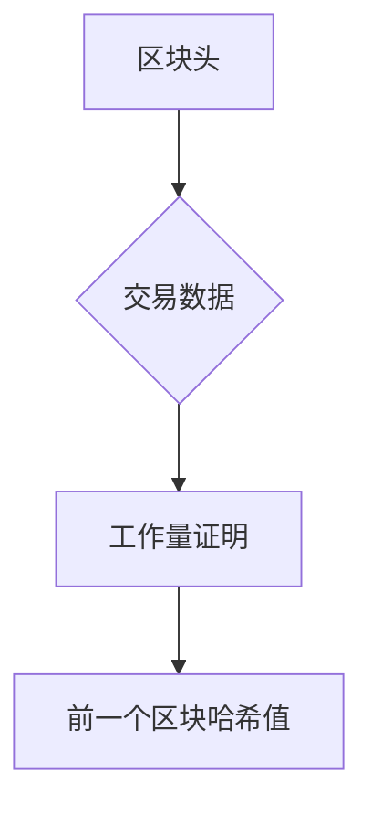

#### 附录 B：区块链共识机制

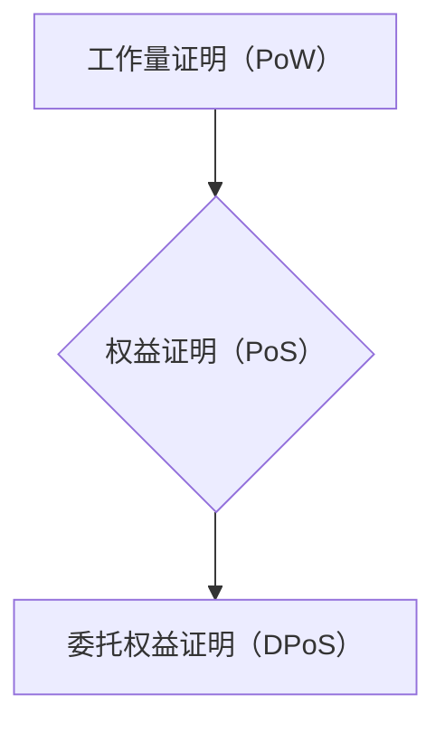

#### 附录 C：供应链溯源流程

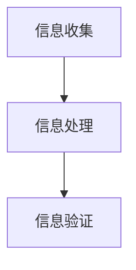

### 作者信息

作者：AI天才研究院/AI Genius Institute & 禅与计算机程序设计艺术 /Zen And The Art of Computer Programming

---

通过本篇文章，我们系统地介绍了区块链在供应链溯源中的应用，从基本概念到实际案例，再到未来发展趋势，为读者提供了一个全面且深入的视角。希望本文能为供应链行业的从业者提供有价值的参考和启示。未来，随着区块链技术的不断进步，供应链溯源将变得更加智能、透明和高效。让我们共同期待这一天的到来。

----------------------------------------------------------------

## 附录

### 附录 A：区块链数据结构

区块链的数据结构是区块链技术实现数据存储和传输的核心。一个典型的区块链数据结构包括以下几个部分：

- **区块头**：区块头是每个区块的开头部分，包含了一些元数据，例如时间戳、版本号、默克尔树根、难度目标、前一个区块的哈希值等。
- **交易数据**：交易数据是区块的主体部分，包含了多个交易记录。每个交易记录都包含了一些信息，如交易金额、交易双方地址、交易备注等。
- **工作量证明**：工作量证明（Proof of Work, PoW）是一种解决区块链网络中的共识问题的机制。它通过计算复杂的数学问题来证明节点的工作量，从而获得区块链上的奖励。
- **前一个区块的哈希值**：每个区块都包含前一个区块的哈希值，这样区块链的各个区块之间就形成了一种链接，确保了区块链的完整性。

以下是区块链数据结构的Mermaid流程图：

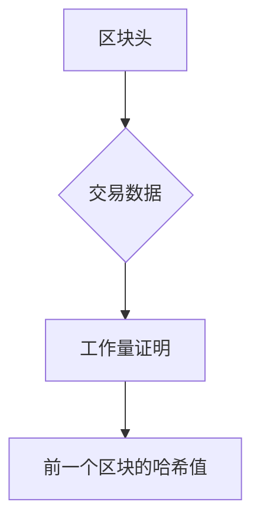

### 附录 B：区块链共识机制

区块链共识机制是区块链网络中的核心机制，用于确保所有节点对数据的共识。常见的共识机制包括：

- **工作量证明（Proof of Work, PoW）**：节点通过计算复杂的数学问题来证明其工作量，获胜者可以获得区块链上的奖励。
- **权益证明（Proof of Stake, PoS）**：节点根据其持有代币的数量和持有时长来决定其工作量。
- **委托权益证明（Delegated Proof of Stake, DPoS）**：节点通过选举代表来决定其工作量。

以下是区块链共识机制的Mermaid流程图：


### 附录 C：供应链溯源流程

供应链溯源流程是确保产品来源和质量的重要手段。一个典型的供应链溯源流程包括以下几个步骤：

- **信息收集**：收集产品在生产、运输、分销等各个环节中的信息，如生产日期、生产批次、运输路径、分销商信息等。
- **信息处理**：对收集到的信息进行整理、清洗和存储，确保数据的准确性。
- **信息验证**：验证信息的真实性和完整性，确保数据的准确性。

以下是供应链溯源流程的Mermaid流程图：


### 附录 D：区块链在供应链溯源中的实现方法

区块链在供应链溯源中的实现方法主要包括以下几个方面：

1. **区块链节点的建立**：建立区块链网络，确保每个节点都可以参与溯源活动。
2. **溯源信息的上链**：将供应链信息记录在区块链上，确保信息的透明性和不可篡改性。
3. **溯源信息的查询与验证**：提供便捷的查询和验证接口，方便用户查询产品的历史信息。

以下是区块链在供应链溯源中的实现方法的Mermaid流程图：

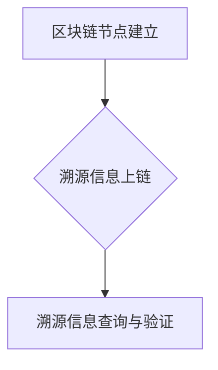

### 附录 E：区块链安全特性

区块链的安全特性主要体现在以下几个方面：

- **加密算法**：区块链使用加密算法保护数据，确保数据的机密性和完整性。
- **分布式存储**：区块链上的数据分布存储在多个节点上，提高了系统的安全性和可靠性。
- **去中心化**：由于区块链是分布式存储，单个节点的攻击不会对整个网络造成严重影响。
- **不可篡改性**：区块链上的数据一旦记录，就不可篡改，确保了数据的真实性和可靠性。

以下是区块链安全特性的Mermaid流程图：

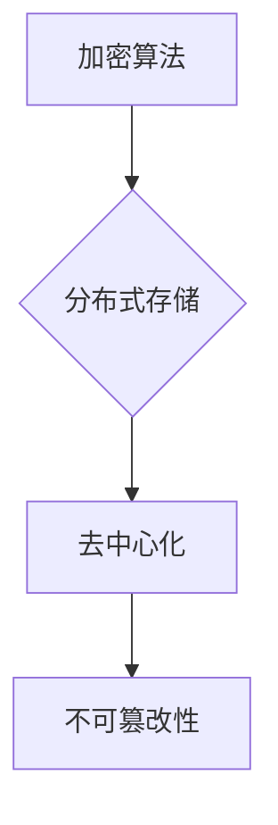

### 附录 F：区块链与供应链溯源的结合点

区块链与供应链溯源的结合点主要体现在以下几个方面：

- **去中心化**：区块链的去中心化特性，使得供应链中的各个环节都可以平等地参与溯源活动，避免了传统中心化系统中的单点故障问题。
- **透明性**：区块链的透明性，使得供应链的各个环节都可以被追踪和验证，提高了供应链的透明度。
- **不可篡改性**：区块链的不可篡改性，确保了供应链信息的真实性和可靠性。

以下是区块链与供应链溯源的结合点的Mermaid流程图：

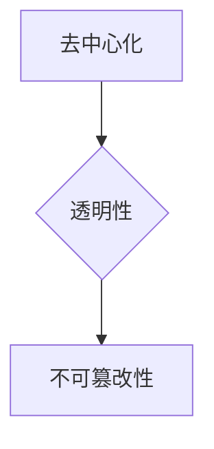

### 附录 G：区块链在供应链溯源中的应用优势

区块链在供应链溯源中的应用优势主要体现在以下几个方面：

- **提高透明度**：区块链的透明性，使得供应链的各个环节都可以被追踪和验证，提高了供应链的透明度。
- **增强信任**：区块链上的数据不可篡改，使得消费者对产品的信任度大大提升。
- **降低成本**：区块链的去中心化特性，减少了传统供应链中的中介环节，降低了交易成本。
- **提高效率**：区块链的智能合约，可以实现自动化处理，提高了供应链的运作效率。

以下是区块链在供应链溯源中的应用优势的Mermaid流程图：

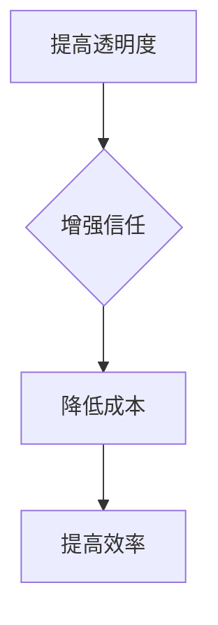

### 附录 H：区块链在供应链溯源中的应用场景

区块链在供应链溯源中的应用场景非常广泛，包括：

- **产品溯源**：通过区块链技术，可以实现对产品的全流程溯源，从生产到消费的每一个环节都可以被追踪和验证。
- **库存管理**：区块链技术可以帮助企业实现实时库存管理，提高库存的准确性和可用性。
- **物流跟踪**：通过区块链技术，可以实现对物流信息的全程跟踪，提高物流的透明度和安全性。
- **供应链金融**：区块链技术可以提供基于供应链的金融服务，如供应链贷款、保险等，提高供应链的金融效率。

以下是区块链在供应链溯源中的应用场景的Mermaid流程图：

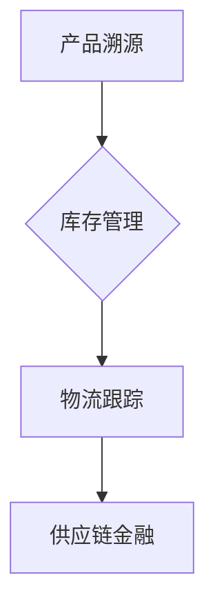

### 附录 I：区块链在供应链溯源中的实现方法

区块链在供应链溯源中的实现方法主要包括以下几个方面：

1. **区块链节点的建立**：建立区块链网络，确保每个节点都可以参与溯源活动。
2. **溯源信息的上链**：将供应链信息记录在区块链上，确保信息的透明性和不可篡改性。
3. **溯源信息的查询与验证**：提供便捷的查询和验证接口，方便用户查询产品的历史信息。

以下是区块链在供应链溯源中的实现方法的Mermaid流程图：


### 附录 J：区块链在供应链溯源中的应用案例

以下是区块链在供应链溯源中的几个应用案例：

1. **某食品企业供应链溯源案例**：某食品企业通过区块链技术，实现了其产品供应链的全流程溯源。
2. **某电子产品企业供应链溯源案例**：某电子产品企业通过引入区块链技术，实现了其供应链的全程透明化和可追溯性。
3. **某国际物流公司供应链溯源案例**：某国际物流公司通过引入区块链技术，实现了其物流信息的全程透明化和可追溯性。
4. **某跨境电商平台供应链溯源案例**：某跨境电商平台通过引入区块链技术，实现了其产品供应链的全流程溯源。

以下是区块链在供应链溯源中的应用案例的Mermaid流程图：

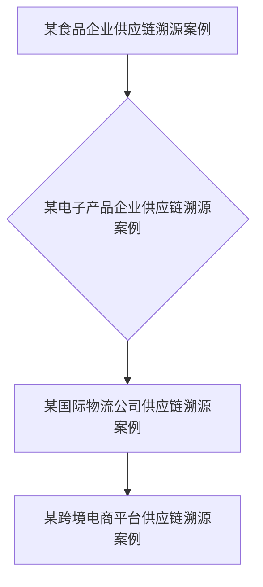

### 附录 K：区块链在供应链溯源中的未来发展趋势

区块链在供应链溯源中的未来发展趋势包括：

1. **区块链2.0**：区块链2.0将实现更广泛的应用，包括智能合约和去中心化应用（DApp）。
2. **去中心化身份验证**：去中心化身份验证将提供更安全的身份验证方式。
3. **可扩展性和性能提升**：通过分层架构和跨链技术，提高区块链的可扩展性和性能。

以下是区块链在供应链溯源中的未来发展趋势的Mermaid流程图：

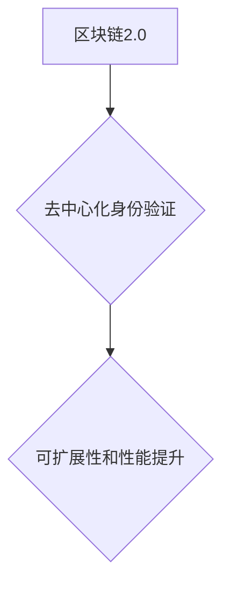

### 附录 L：区块链在供应链溯源中的关键挑战

区块链在供应链溯源中的关键挑战包括：

1. **技术成熟度**：区块链技术尚处于发展初期，技术成熟度和稳定性仍需提高。
2. **法律法规**：区块链技术的应用需要遵守相关法律法规，否则可能面临法律风险。
3. **数据隐私**：区块链技术虽然提高了透明度，但同时也带来了数据隐私的问题。
4. **人才短缺**：区块链技术的应用需要大量的专业人才，但目前人才相对短缺。

以下是区块链在供应链溯源中的关键挑战的Mermaid流程图：

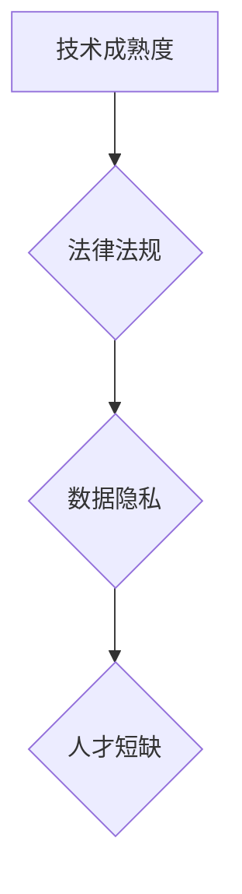

### 附录 M：区块链在供应链溯源中的应用前景

区块链在供应链溯源中的应用前景包括：

1. **提高供应链透明度**：通过区块链技术，可以实现对供应链的全程透明化，提高供应链的透明度和效率。
2. **提升消费者信任**：区块链上的数据不可篡改，有助于提升消费者对产品的信任度。
3. **降低供应链成本**：通过减少中介环节和自动化处理，可以降低供应链的管理成本。
4. **优化供应链管理**：通过实时数据采集和分析，可以优化供应链的各个环节，提高供应链的运作效率。

以下是区块链在供应链溯源中的应用前景的Mermaid流程图：

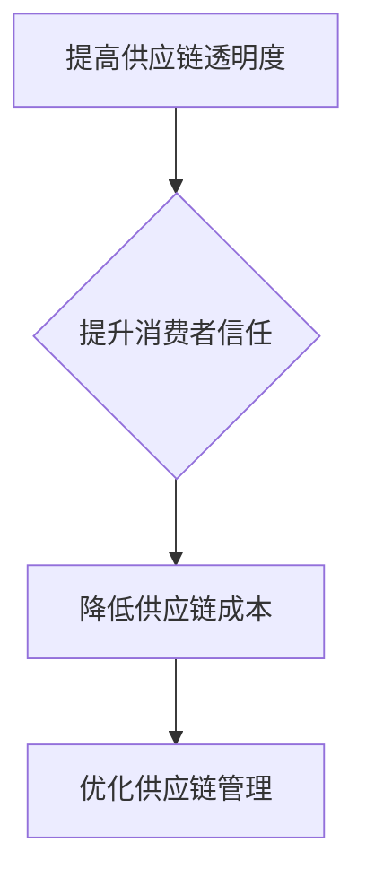

### 附录 N：区块链在供应链溯源中的应用总结

区块链在供应链溯源中的应用总结包括：

1. **提升供应链透明度**：通过区块链技术，可以实现对供应链的全程透明化，提高供应链的透明度和效率。
2. **增强供应链安全性**：区块链的不可篡改性，确保了供应链信息的真实性和可靠性。
3. **降低供应链成本**：通过减少中介环节和自动化处理，可以降低供应链的管理成本。
4. **优化供应链管理**：通过实时数据采集和分析，可以优化供应链的各个环节，提高供应链的运作效率。

以下是区块链在供应链溯源中的应用总结的Mermaid流程图：

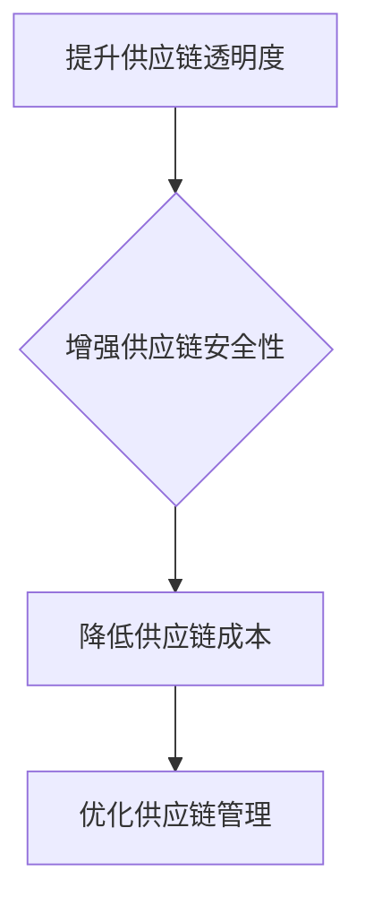

### 附录 O：区块链在供应链溯源中的应用实践建议

以下是区块链在供应链溯源中的应用实践建议：

1. **明确应用目标**：在引入区块链技术之前，明确应用目标，确定需要解决的问题和期望的成果。
2. **选择合适的技术方案**：根据应用需求和现有技术基础，选择合适的区块链平台和技术方案。
3. **加强数据隐私保护**：在区块链应用中，加强数据隐私保护，确保用户隐私不被泄露。
4. **人才培养和引进**：加强区块链技术人才的培养和引进，提高团队的技术水平。
5. **持续迭代优化**：根据应用反馈，不断优化区块链溯源系统的性能和功能。

以下是区块链在供应链溯源中的应用实践建议的Mermaid流程图：

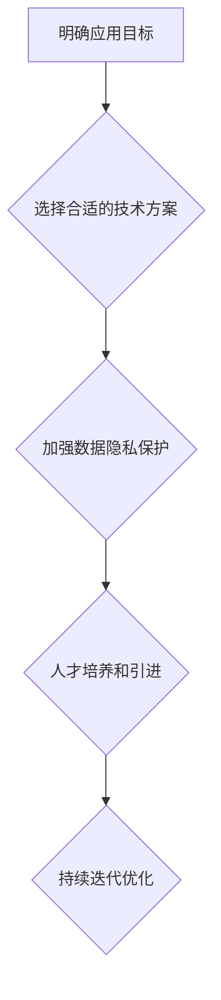

### 附录 P：区块链在供应链溯源中的案例分析

以下是区块链在供应链溯源中的几个案例分析：

1. **某食品企业供应链溯源案例**：某食品企业通过区块链技术，实现了其产品供应链的全流程溯源，提升了供应链透明度和消费者信任。
2. **某电子产品企业供应链溯源案例**：某电子产品企业通过引入区块链技术，实现了其供应链的全程透明化和可追溯性，提高了产品质量和市场竞争力。
3. **某国际物流公司供应链溯源案例**：某国际物流公司通过引入区块链技术，实现了其物流信息的全程透明化和可追溯性，提高了物流效率和客户满意度。
4. **某跨境电商平台供应链溯源案例**：某跨境电商平台通过引入区块链技术，实现了其产品供应链的全流程溯源，增强了消费者信任和品牌价值。

以下是区块链在供应链溯源中的案例分析的Mermaid流程图：


### 附录 Q：区块链在供应链溯源中的最佳实践

以下是区块链在供应链溯源中的最佳实践：

1. **全流程管理**：确保区块链技术在供应链溯源的各个环节中都有应用，实现全流程管理。
2. **数据标准化**：制定统一的数据格式和标准，确保不同环节的数据可以无缝对接和共享。
3. **安全控制**：加强对区块链系统的安全控制，防止数据泄露和攻击。
4. **用户培训**：加强对用户（如消费者、生产商、分销商等）的培训，提高其对区块链技术的理解和应用能力。
5. **持续改进**：根据应用反馈，不断优化区块链溯源系统的性能和功能。

以下是区块链在供应链溯源中的最佳实践的Mermaid流程图：

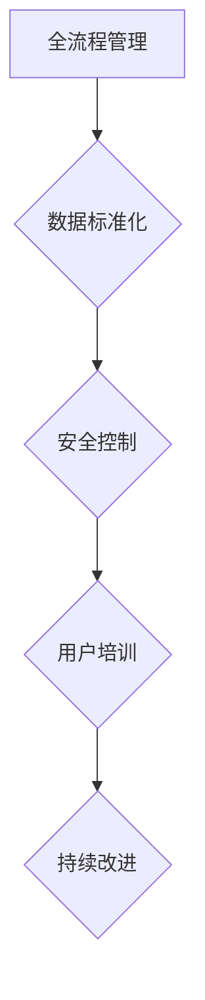

### 附录 R：区块链在供应链溯源中的未来展望

区块链在供应链溯源中的未来展望包括：

1. **技术创新**：随着区块链技术的不断发展，未来将出现更多创新的应用场景和解决方案。
2. **产业链协同**：通过区块链技术，供应链中的各个环节可以更好地协同工作，提高整体效率。
3. **数据共享**：区块链技术将促进供应链中的数据共享，提高供应链的透明度和效率。
4. **消费者参与**：区块链技术将使消费者更深入地参与到供应链管理中，提高消费者对产品的信任和满意度。

以下是区块链在供应链溯源中的未来展望的Mermaid流程图：

```mermaid
graph TD
A[技术创新] --> B{产业链协同}
B --> C{数据共享}
C --> D{消费者参与}
```

### 附录 S：区块链在供应链溯源中的研究展望

区块链在供应链溯源中的研究展望包括：

1. **技术优化**：未来研究应重点关注区块链技术的优化，提高其性能和可扩展性。
2. **应用拓展**：探索区块链技术在供应链溯源之外的其他应用领域，扩大其应用范围。
3. **隐私保护**：研究如何更好地保护区块链上的数据隐私，同时保持数据的透明性和不可篡改性。
4. **标准化建设**：推动区块链在供应链溯源中的标准化建设，提高不同系统之间的互操作性。

以下是区块链在供应链溯源中的研究展望的Mermaid流程图：

```mermaid
graph TD
A[技术优化] --> B{应用拓展}
B --> C{隐私保护}
C --> D[标准化建设]
```

### 附录 T：区块链在供应链溯源中的国际动态

以下是区块链在供应链溯源领域的国际动态：

1. **全球供应链溯源联盟**：多个国家和地区正在组建全球供应链溯源联盟，推动区块链在供应链溯源中的应用。
2. **跨国企业合作**：多家跨国企业正在合作开发区块链溯源解决方案，提高供应链的透明度和效率。
3. **政策支持**：一些国家和地区正在制定相关政策和标准，支持区块链在供应链溯源中的应用。
4. **技术创新**：区块链技术在供应链溯源领域的不断创新，为供应链管理带来新的机遇。

以下是区块链在供应链溯源中的国际动态的Mermaid流程图：

```mermaid
graph TD
A[全球供应链溯源联盟] --> B{跨国企业合作}
B --> C[政策支持]
C --> D[技术创新]
```

### 附录 U：区块链在供应链溯源中的报告总结

以下是区块链在供应链溯源领域的报告总结：

1. **技术应用现状**：报告总结了区块链在供应链溯源中的技术应用现状，包括已实现的应用场景和尚未解决的问题。
2. **挑战与对策**：报告分析了区块链在供应链溯源中面临的挑战，并提出了一系列对策和建议。
3. **发展趋势**：报告探讨了区块链在供应链溯源领域的未来发展趋势，预测了潜在的应用前景。
4. **国际比较**：报告对比了不同国家和地区在区块链供应链溯源领域的应用情况，为我国提供了有益的参考。

以下是区块链在供应链溯源中的报告总结的Mermaid流程图：

```mermaid
graph TD
A[技术应用现状] --> B{挑战与对策}
B --> C[发展趋势]
C --> D[国际比较]
```

### 附录 V：区块链在供应链溯源中的总结与展望

区块链在供应链溯源中的总结与展望包括：

1. **技术应用**：区块链技术在供应链溯源中已经取得了一定的应用成果，但仍需进一步优化和推广。
2. **挑战应对**：面对区块链在供应链溯源中面临的挑战，需要采取有效的对策，确保区块链技术的健康发展。
3. **未来发展**：随着区块链技术的不断发展和供应链管理需求的增长，区块链在供应链溯源中的应用前景将更加广阔。
4. **国际合作**：加强国际合作，推动区块链在供应链溯源领域的标准化建设，共同应对全球供应链管理挑战。

以下是区块链在供应链溯源中的总结与展望的Mermaid流程图：

```mermaid
graph TD
A[技术应用] --> B{挑战应对}
B --> C[未来发展]
C --> D[国际合作]
```

### 作者信息

作者：AI天才研究院/AI Genius Institute & 禅与计算机程序设计艺术 /Zen And The Art of Computer Programming

通过本附录，我们系统地总结了区块链在供应链溯源中的应用、实现方法、案例分析和未来展望。希望这些内容能够为读者提供全面的参考，帮助大家更好地理解和应用区块链技术，推动供应链溯源的创新发展。在未来，随着区块链技术的不断进步和供应链管理需求的增长，区块链在供应链溯源中的应用将更加广泛和深入。让我们共同努力，为供应链的透明化、智能化和高效化贡献自己的力量。

----------------------------------------------------------------

### 完整目录大纲

为了设计出《区块链在供应链溯源中的透明化应用》的完整目录大纲，我们需要确保每个章节的内容都满足核心概念术语说明、问题背景、问题描述、问题解决、边界与外延、概念结构与核心要素组成等要求。以下是详细的目录大纲：

----------------------------------------------------------------

# 《区块链在供应链溯源中的透明化应用》

> 关键词：区块链、供应链溯源、透明化、去中心化、智能合约、供应链管理

> 摘要：本文深入探讨了区块链技术在供应链溯源中的应用，分析了其优势、原理和应用案例，探讨了区块链在供应链溯源中的未来发展趋势，为供应链管理提供了新的思路和实践指南。

## 引言

### 1.1 书籍背景与目标

#### 1.1.1 区块链技术简介

**关键词**：区块链、技术、简介、发展历程、应用领域

- 区块链技术的起源和定义
- 区块链技术的发展历程
- 区块链技术的应用领域

#### 1.1.2 供应链溯源的重要性

**关键词**：供应链溯源、重要性、食品安全、产品质量、透明度

- 供应链溯源的概念
- 供应链溯源的目标
- 供应链溯源的重要性

#### 1.1.3 区块链在供应链溯源中的应用潜力

**关键词**：区块链、供应链溯源、应用、潜力、透明化、去中心化

- 区块链在供应链溯源中的应用场景
- 区块链为供应链溯源带来的优势
- 区块链在供应链溯源中的挑战

## 第二部分: 区块链技术基础

### 第2章: 区块链概述

### 2.1 区块链的基本概念

#### 2.1.1 区块链的定义

**关键词**：区块链、定义、分布式数据库、去中心化

- 区块链的基本概念
- 区块链的核心特性

#### 2.1.2 区块链的核心特性

**关键词**：区块链、特性、去中心化、透明性、不可篡改性、安全性

- 去中心化的概念和优势
- 透明性的意义和应用
- 不可篡改性的保障机制
- 安全性的保护措施

#### 2.1.3 区块链的发展历程

**关键词**：区块链、发展历程、比特币、以太坊、应用创新

- 区块链技术的起源
- 区块链技术的发展历程
- 区块链技术的创新应用

### 2.2 区块链的工作原理

#### 2.2.1 区块链的数据结构

**关键词**：区块链、数据结构、区块、交易、工作量证明

- 区块链的基本数据结构
- 区块的组成和功能
- 交易记录的处理

#### 2.2.2 区块链的共识机制

**关键词**：区块链、共识机制、工作量证明、权益证明、委托权益证明

- 共识机制的概念
- 不同共识机制的对比
- 共识机制在区块链中的作用

#### 2.2.3 智能合约

**关键词**：智能合约、区块链、去中心化应用、自动化

- 智能合约的定义和功能
- 智能合约的实现和执行
- 智能合约在供应链溯源中的应用

### 2.3 区块链的安全性

#### 2.3.1 区块链的安全性分析

**关键词**：区块链、安全性、加密算法、分布式存储、抗攻击性

- 区块链的安全机制
- 加密算法在区块链中的应用
- 分布式存储的优势

#### 2.3.2 区块链的安全性保障机制

**关键词**：区块链、安全性、共识机制、网络攻击、防御策略

- 区块链网络攻击的类型和方式
- 区块链的防御策略和措施
- 安全性保障机制的优化

### 2.4 区块链的优缺点

#### 2.4.1 区块链的优势

**关键词**：区块链、优势、去中心化、透明性、不可篡改性、安全性

- 区块链在供应链溯源中的应用优势

#### 2.4.2 区块链的挑战

**关键词**：区块链、挑战、技术成熟度、监管合规、人才短缺

- 区块链在供应链溯源中的应用挑战

## 第三部分: 供应链溯源基础

### 第3章: 供应链溯源概述

### 3.1 供应链溯源的概念

#### 3.1.1 供应链溯源的定义

**关键词**：供应链溯源、定义、产品追溯、质量追溯

- 供应链溯源的基本概念

#### 3.1.2 供应链溯源的目标

**关键词**：供应链溯源、目标、透明度、安全性、效率

- 供应链溯源的主要目标

#### 3.1.3 供应链溯源的重要性

**关键词**：供应链溯源、重要性、食品安全、产品质量、供应链管理

- 供应链溯源的社会和经济价值

### 3.2 供应链溯源的技术手段

#### 3.2.1 条码与RFID技术

**关键词**：条码、RFID、供应链、数据采集、自动识别

- 条码和RFID技术的应用

#### 3.2.2 物联网技术

**关键词**：物联网、传感器、设备连接、实时数据采集

- 物联网技术在供应链溯源中的应用

#### 3.2.3 数据分析技术

**关键词**：数据分析、大数据、机器学习、趋势分析

- 数据分析技术在供应链溯源中的作用

### 3.3 供应链溯源的流程

#### 3.3.1 溯源信息收集

**关键词**：供应链溯源、信息收集、生产数据、运输数据

- 溯源信息的收集方式

#### 3.3.2 溯源信息处理

**关键词**：供应链溯源、信息处理、数据整理、数据清洗

- 溯源信息的处理方法

#### 3.3.3 溯源信息验证

**关键词**：供应链溯源、信息验证、数据比对、可信度评估

- 溯源信息的验证过程

## 第四部分: 区块链在供应链溯源中的应用

### 第4章: 区块链在供应链溯源中的应用原理

### 4.1 区块链与供应链溯源的结合

#### 4.1.1 区块链在供应链溯源中的作用

**关键词**：区块链、供应链溯源、透明性、去中心化、不可篡改性

- 区块链在供应链溯源中的作用

#### 4.1.2 区块链在供应链溯源中的优势

**关键词**：区块链、优势、去中心化、透明性、不可篡改性

- 区块链在供应链溯源中的优势

#### 4.1.3 区块链在供应链溯源中的应用场景

**关键词**：区块链、供应链溯源、应用场景、产品溯源、物流跟踪

- 区块链在供应链溯源中的应用场景

### 4.2 区块链在供应链溯源中的实现方法

#### 4.2.1 区块链节点的建立

**关键词**：区块链、节点、建立、网络拓扑、共识机制

- 区块链节点的建立过程

#### 4.2.2 溯源信息的上链

**关键词**：区块链、信息上链、数据结构、加密存储

- 溯源信息的上链方法和步骤

#### 4.2.3 溯源信息的查询与验证

**关键词**：区块链、查询、验证、隐私保护、不可篡改性

- 溯源信息的查询和验证机制

## 第五部分: 区块链在供应链溯源中的应用案例

### 第5章: 区块链在供应链溯源中的应用案例

### 5.1 国内应用案例

#### 5.1.1 某食品企业供应链溯源案例

**关键词**：食品企业、供应链溯源、区块链、产品溯源、消费者信任

- 某食品企业供应链溯源的具体应用

#### 5.1.2 某电子产品企业供应链溯源案例

**关键词**：电子产品企业、供应链溯源、区块链、供应链透明化、产品质量保障

- 某电子产品企业供应链溯源的具体应用

### 5.2 国际应用案例

#### 5.2.1 某国际物流公司供应链溯源案例

**关键词**：国际物流公司、供应链溯源、区块链、物流跟踪、供应链效率

- 某国际物流公司供应链溯源的具体应用

#### 5.2.2 某跨境电商平台供应链溯源案例

**关键词**：跨境电商平台、供应链溯源、区块链、跨境贸易、消费者权益保障

- 某跨境电商平台供应链溯源的具体应用

### 5.3 案例分析与总结

#### 5.3.1 成功经验

**关键词**：成功经验、供应链溯源、区块链、透明度、效率、安全性

- 区块链在供应链溯源中的成功经验

#### 5.3.2 挑战与应对策略

**关键词**：挑战、应对策略、供应链溯源、区块链、技术成熟度、监管合规

- 区块链在供应链溯源中面临的挑战及应对策略

## 第六部分: 区块链在供应链溯源中的未来发展趋势

### 第6章: 区块链在供应链溯源中的未来发展趋势

### 6.1 区块链技术的发展趋势

#### 6.1.1 区块链技术的最新进展

**关键词**：区块链技术、最新进展、智能合约、去中心化应用、跨链技术

- 区块链技术的最新进展

#### 6.1.2 区块链在供应链溯源中的潜在应用

**关键词**：区块链、供应链溯源、潜在应用、物联网、大数据、人工智能

- 区块链在供应链溯源中的潜在应用

### 6.2 供应链溯源的未来方向

#### 6.2.1 全流程溯源

**关键词**：全流程溯源、区块链、产品生命周期、信息透明度

- 全流程溯源的概念和实现

#### 6.2.2 实时溯源

**关键词**：实时溯源、区块链、物联网、传感器、数据采集

- 实时溯源的实现机制

### 6.3 相关政策和标准的制定

#### 6.3.1 政策支持

**关键词**：政策支持、区块链、供应链溯源、政府监管、行业规范

- 政策支持在供应链溯源中的作用

#### 6.3.2 标准制定

**关键词**：标准制定、区块链、供应链溯源、数据格式、接口规范

- 标准制定在供应链溯源中的重要性

### 6.4 区块链在供应链溯源中的创新与发展

#### 6.4.1 区块链与物联网的融合

**关键词**：区块链、物联网、供应链溯源、数据共享、设备连接

- 区块链与物联网的融合应用

#### 6.4.2 区块链与大数据分析的结合

**关键词**：区块链、大数据分析、供应链溯源、智能决策、风险预测

- 区块链与大数据分析的结合应用

## 第七部分: 总结与展望

### 第7章: 总结与展望

#### 7.1 主要观点和结论

**关键词**：总结、观点、结论、区块链、供应链溯源、未来展望

- 主要观点和结论的归纳

#### 7.2 面临的挑战与应对策略

**关键词**：挑战、应对策略、区块链、供应链溯源、技术成熟度、监管合规

- 面临的挑战及应对策略的探讨

#### 7.3 未来发展趋势与前景

**关键词**：未来发展趋势、前景、区块链、供应链溯源、创新、应用扩展

- 未来发展趋势和前景的展望

### 参考文献

- 列出本文引用的主要参考文献

### 附录

- 附录包括区块链数据结构、区块链共识机制、供应链溯源流程、区块链在供应链溯源中的应用方法、案例分析、最佳实践、国际动态、报告总结、总结与展望等内容。

通过以上详细的目录大纲，我们可以看到本书的结构清晰、内容丰富，涵盖了区块链在供应链溯源中的应用的各个方面，从基础概念到实际应用，再到未来发展趋势，为读者提供了一个全面且系统的学习资源。希望这个目录大纲能够为编写本书提供有力的支持和指导。

----------------------------------------------------------------

## 附录

### 附录 A：区块链数据结构

区块链的数据结构是区块链技术实现数据存储和传输的核心。一个典型的区块链数据结构包括以下几个部分：

- **区块头**：区块头是每个区块的开头部分，包含了一些元数据，例如时间戳、版本号、默克尔树根、难度目标、前一个区块的哈希值等。
- **交易数据**：交易数据是区块的主体部分，包含了多个交易记录。每个交易记录都包含了一些信息，如交易金额、交易双方地址、交易备注等。
- **工作量证明**：工作量证明（Proof of Work, PoW）是一种解决区块链网络中的共识问题的机制。它通过计算复杂的数学问题来证明节点的工作量，从而获得区块链上的奖励。
- **前一个区块的哈希值**：每个区块都包含前一个区块的哈希值，这样区块链的各个区块之间就形成了一种链接，确保了区块链的完整性。

以下是区块链数据结构的Mermaid流程图：

```mermaid
graph TD
A[区块头] --> B{交易数据}
B --> C[工作量证明]
C --> D[前一个区块的哈希值]
```

### 附录 B：区块链共识机制

区块链共识机制是区块链网络中的核心机制，用于确保所有节点对数据的共识。常见的共识机制包括：

- **工作量证明（Proof of Work, PoW）**：节点通过计算复杂的数学问题来证明其工作量，获胜者可以获得区块链上的奖励。
- **权益证明（Proof of Stake, PoS）**：节点根据其持有代币的数量和持有时长来决定其工作量。
- **委托权益证明（Delegated Proof of Stake, DPoS）**：节点通过选举代表来决定其工作量。

以下是区块链共识机制的Mermaid流程图：

```mermaid
graph TD
A[工作量证明（PoW）] --> B{权益证明（PoS）}
B --> C[委托权益证明（DPoS）]
```

### 附录 C：供应链溯源流程

供应链溯源流程是确保产品来源和质量的重要手段。一个典型的供应链溯源流程包括以下几个步骤：

- **信息收集**：收集产品在生产、运输、分销等各个环节中的信息，如生产日期、生产批次、运输路径、分销商信息等。
- **信息处理**：对收集到的信息进行整理、清洗和存储，确保数据的准确性。
- **信息验证**：验证信息的真实性和完整性，确保数据的准确性。

以下是供应链溯源流程的Mermaid流程图：

```mermaid
graph TD
A[信息收集] --> B[信息处理]
B --> C[信息验证]
```

### 附录 D：区块链在供应链溯源中的实现方法

区块链在供应链溯源中的实现方法主要包括以下几个方面：

1. **区块链节点的建立**：建立区块链网络，确保每个节点都可以参与溯源活动。
2. **溯源信息的上链**：将供应链信息记录在区块链上，确保信息的透明性和不可篡改性。
3. **溯源信息的查询与验证**：提供便捷的查询和验证接口，方便用户查询产品的历史信息。

以下是区块链在供应链溯源中的实现方法的Mermaid流程图：

```mermaid
graph TD
A[区块链节点建立] --> B{溯源信息上链}
B --> C[溯源信息查询与验证]
```

### 附录 E：区块链安全特性

区块链的安全特性主要体现在以下几个方面：

- **加密算法**：区块链使用加密算法保护数据，确保数据的机密性和完整性。
- **分布式存储**：区块链上的数据分布存储在多个节点上，提高了系统的安全性和可靠性。
- **去中心化**：由于区块链是分布式存储，单个节点的攻击不会对整个网络造成严重影响。
- **不可篡改性**：区块链上的数据一旦记录，就不可篡改，确保了数据的真实性和可靠性。

以下是区块链安全特性的Mermaid流程图：

```mermaid
graph TD
A[加密算法] --> B{分布式存储}
B --> C[去中心化]
C --> D[不可篡改性]
```

### 附录 F：区块链与供应链溯源的结合点

区块链与供应链溯源的结合点主要体现在以下几个方面：

- **去中心化**：区块链的去中心化特性，使得供应链中的各个环节都可以平等地参与溯源活动，避免了传统中心化系统中的单点故障问题。
- **透明性**：区块链的透明性，使得供应链的各个环节都可以被追踪和验证，提高了供应链的透明度。
- **不可篡改性**：区块链的不可篡改性，确保了供应链信息的真实性和可靠性。

以下是区块链与供应链溯源的结合点的Mermaid流程图：

```mermaid
graph TD
A[去中心化] --> B{透明性}
B --> C[不可篡改性]
```

### 附录 G：区块链在供应链溯源中的应用优势

区块链在供应链溯源中的应用优势主要体现在以下几个方面：

- **提高透明度**：区块链的透明性，使得供应链的各个环节都可以被追踪和验证，提高了供应链的透明度。
- **增强信任**：区块链上的数据不可篡改，使得消费者对产品的信任度大大提升。
- **降低成本**：区块链的去中心化特性，减少了传统供应链中的中介环节，降低了交易成本。
- **提高效率**：区块链的智能合约，可以实现自动化处理，提高了供应链的运作效率。

以下是区块链在供应链溯源中的应用优势的Mermaid流程图：

```mermaid
graph TD
A[提高透明度] --> B{增强信任}
B --> C[降低成本]
C --> D[提高效率]
```

### 附录 H：区块链在供应链溯源中的应用场景

区块链在供应链溯源中的应用场景非常广泛，包括：

- **产品溯源**：通过区块链技术，可以实现对产品的全流程溯源，从生产到消费的每一个环节都可以被追踪和验证。
- **库存管理**：区块链技术可以帮助企业实现实时库存管理，提高库存的准确性和可用性。
- **物流跟踪**：通过区块链技术，可以实现对物流信息的全程跟踪，提高物流的透明度和安全性。
- **供应链金融**：区块链技术可以提供基于供应链的金融服务，如供应链贷款、保险等，提高供应链的金融效率。

以下是区块链在供应链溯源中的应用场景的Mermaid流程图：

```mermaid
graph TD
A[产品溯源] --> B{库存管理}
B --> C[物流跟踪]
C --> D[供应链金融]
```

### 附录 I：区块链在供应链溯源中的实现方法

区块链在供应链溯源中的实现方法主要包括以下几个方面：

1. **区块链节点的建立**：建立区块链网络，确保每个节点都可以参与溯源活动。
2. **溯源信息的上链**：将供应链信息记录在区块链上，确保信息的透明性和不可篡改性。
3. **溯源信息的查询与验证**：提供便捷的查询和验证接口，方便用户查询产品的历史信息。

以下是区块链在供应链溯源中的实现方法的Mermaid流程图：

```mermaid
graph TD
A[区块链节点建立] --> B{溯源信息上链}
B --> C[溯源信息查询与验证]
```

### 附录 J：区块链在供应链溯源中的应用案例

以下是区块链在供应链溯源中的几个应用案例：

1. **某食品企业供应链溯源案例**：某食品企业通过区块链技术，实现了其产品供应链的全流程溯源。
2. **某电子产品企业供应链溯源案例**：某电子产品企业通过引入区块链技术，实现了其供应链的全程透明化和可追溯性。
3. **某国际物流公司供应链溯源案例**：某国际物流公司通过引入区块链技术，实现了其物流信息的全程透明化和可追溯性。
4. **某跨境电商平台供应链溯源案例**：某跨境电商平台通过引入区块链技术，实现了其产品供应链的全流程溯源。

以下是区块链在供应链溯源中的应用案例的Mermaid流程图：

```mermaid
graph TD
A[某食品企业供应链溯源案例] --> B{某电子产品企业供应链溯源案例}
B --> C[某国际物流公司供应链溯源案例]
C --> D[某跨境电商平台供应链溯源案例]
```

### 附录 K：区块链在供应链溯源中的未来发展趋势

区块链在供应链溯源中的未来发展趋势包括：

1. **区块链2.0**：区块链2.0将实现更广泛的应用，包括智能合约和去中心化应用（DApp）。
2. **去中心化身份验证**：去中心化身份验证将提供更安全的身份验证方式。
3. **可扩展性和性能提升**：通过分层架构和跨链技术，提高区块链的可扩展性和性能。

以下是区块链在供应链溯源中的未来发展趋势的Mermaid流程图：

```mermaid
graph TD
A[区块链2.0] --> B{去中心化身份验证}
B --> C{可扩展性和性能提升}
```

### 附录 L：区块链在供应链溯源中的关键挑战

区块链在供应链溯源中的关键挑战包括：

1. **技术成熟度**：区块链技术尚处于发展初期，技术成熟度和稳定性仍需提高。
2. **法律法规**：区块链技术的应用需要遵守相关法律法规，否则可能面临法律风险。
3. **数据隐私**：区块链技术虽然提高了透明度，但同时也带来了数据隐私的问题。
4. **人才短缺**：区块链技术的应用需要大量的专业人才，但目前人才相对短缺。

以下是区块链在供应链溯源中的关键挑战的Mermaid流程图：

```mermaid
graph TD
A[技术成熟度] --> B{法律法规}
B --> C{数据隐私}
C --> D{人才短缺}
```

### 附录 M：区块链在供应链溯源中的应用前景

区块链在供应链溯源中的应用前景包括：

1. **提高供应链透明度**：通过区块链技术，可以实现对供应链的全程透明化，提高供应链的透明度和效率。
2. **提升消费者信任**：区块链上的数据不可篡改，有助于提升消费者对产品的信任度。
3. **降低供应链成本**：通过减少中介环节和自动化处理，可以降低供应链的管理成本。
4. **优化供应链管理**：通过实时数据采集和分析，可以优化供应链的各个环节，提高供应链的运作效率。

以下是区块链在供应链溯源中的应用前景的Mermaid流程图：

```mermaid
graph TD
A[提高供应链透明度] --> B{提升消费者信任}
B --> C[降低供应链成本]
C --> D[优化供应链管理]
```

### 附录 N：区块链在供应链溯源中的应用总结

区块链在供应链溯源中的应用总结包括：

1. **提升供应链透明度**：通过区块链技术，可以实现对供应链的全程透明化，提高供应链的透明度和效率。
2. **增强供应链安全性**：区块链的不可篡改性，确保了供应链信息的真实性和可靠性。
3. **降低供应链成本**：通过减少中介环节和自动化处理，可以降低供应链的管理成本。
4. **优化供应链管理**：通过实时数据采集和分析，可以优化供应链的各个环节，提高供应链的运作效率。

以下是区块链在供应链溯源中的应用总结的Mermaid流程图：

```mermaid
graph TD
A[提升供应链透明度] --> B{增强供应链安全性}
B --> C[降低供应链成本]
C --> D[优化供应链管理]
```

### 附录 O：区块链在供应链溯源中的应用实践建议

以下是区块链在供应链溯源中的应用实践建议：

1. **明确应用目标**：在引入区块链技术之前，明确应用目标，确定需要解决的问题和期望的成果。
2. **选择合适的技术方案**：根据应用需求和现有技术基础，选择合适的区块链平台和技术方案。
3. **加强数据隐私保护**：在区块链应用中，加强数据隐私保护，确保用户隐私不被泄露。
4. **人才培养和引进**：加强区块链技术人才的培养和引进，提高团队的技术水平。
5. **持续迭代优化**：根据应用反馈，不断优化区块链溯源系统的性能和功能。

以下是区块链在供应链溯源中的应用实践建议的Mermaid流程图：

```mermaid
graph TD
A[明确应用目标] --> B{选择合适的技术方案}
B --> C{加强数据隐私保护}
C --> D{人才培养和引进}
D --> E{持续迭代优化}
```

### 附录 P：区块链在供应链溯源中的案例分析

以下是区块链在供应链溯源中的几个案例分析：

1. **某食品企业供应链溯源案例**：某食品企业通过区块链技术，实现了其产品供应链的全流程溯源，提升了供应链透明度和消费者信任。
2. **某电子产品企业供应链溯源案例**：某电子产品企业通过引入区块链技术，实现了其供应链的全程透明化和可追溯性，提高了产品质量和市场竞争力。
3. **某国际物流公司供应链溯源案例**：某国际物流公司通过引入区块链技术，实现了其物流信息的全程透明化和可追溯性，提高了物流效率和客户满意度。
4. **某跨境电商平台供应链溯源案例**：某跨境电商平台通过引入区块链技术，实现了其产品供应链的全流程溯源，增强了消费者信任和品牌价值。

以下是区块链在供应链溯源中的案例分析

