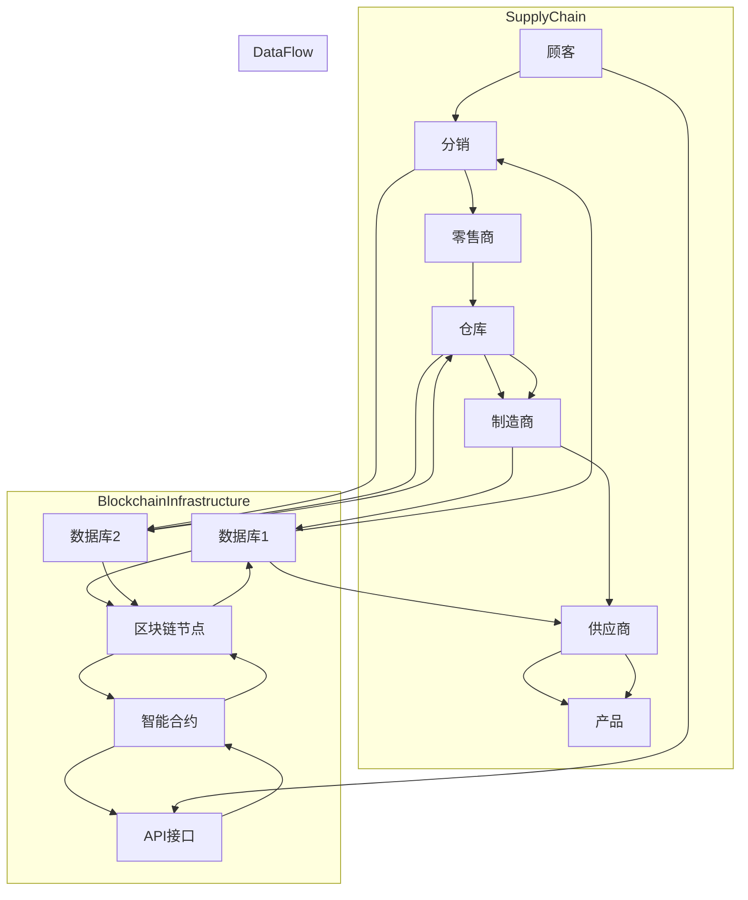
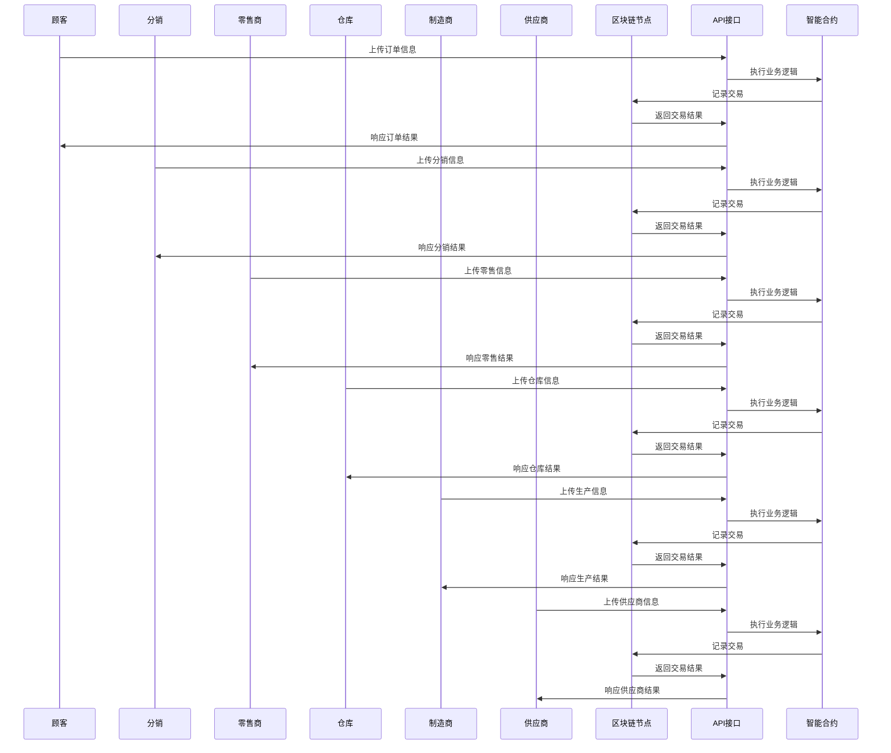

                 

### 引言：区块链在供应链管理中的应用

在当今快速发展的商业环境中，供应链管理已成为企业运营的核心环节。有效的供应链管理不仅能提高企业竞争力，还能确保产品和服务的高效交付。然而，随着供应链的复杂性和全球化程度的提升，透明度和可追溯性问题日益突出。这不仅影响了企业的声誉，还可能对消费者造成安全隐患。

区块链技术作为一种分布式数据库系统，以其去中心化、透明度和不可篡改的特点，逐渐成为解决供应链管理中透明度和可追溯性问题的理想工具。通过区块链，企业可以实现信息的实时共享，确保供应链各环节的信息公开透明，从而提升整体运营效率。

本文将围绕区块链在供应链管理中的应用展开讨论，通过以下几个部分逐步深入：

1. **背景介绍**：介绍区块链技术和供应链管理的基本概念，以及它们在当前商业环境中的重要性。
2. **核心概念与联系**：阐述区块链与供应链管理的核心概念，并分析两者之间的关系。
3. **应用案例**：分享一些区块链在供应链管理中的应用实例，展示其实际效果。
4. **技术实现**：详细讲解区块链技术在供应链管理中的实现方式，包括协议、算法等。
5. **挑战与展望**：讨论区块链在供应链管理中面临的挑战以及未来的发展趋势。

通过这篇文章，我们希望能够为读者提供全面而深入的区块链在供应链管理中的应用见解，帮助企业在复杂多变的商业环境中更好地管理和优化供应链。

### 背景介绍

#### 区块链技术概述

区块链技术起源于2008年中本聪（Satoshi Nakamoto）发布的一篇名为《比特币：一种点对点的电子现金系统》的白皮书。该技术旨在创建一个无需信任的分布式账本系统，用以实现安全的电子交易。区块链的核心特点包括去中心化、透明度和不可篡改性。

去中心化意味着区块链系统没有中央控制点，而是由多个节点共同维护。每个节点都存储着整个区块链的副本，通过共识算法来确保数据的准确性和一致性。这种去中心化的结构使得区块链具有较高的抗攻击性和透明度。

透明度方面，区块链上的所有交易记录都是公开的，任何人都可以查看和验证。这种透明性有助于提高供应链管理的可信度，使企业能够更加公开透明地展示其运营情况。

不可篡改性则是区块链的另一大特点。一旦数据被记录在区块链上，就几乎无法更改或删除。这种特性确保了数据的完整性和可靠性，对于需要高度可追溯性的供应链管理尤为重要。

#### 供应链管理概述

供应链管理（Supply Chain Management, SCM）是指通过计划、实施和控制，对产品从原材料采购到最终交付给消费者的整个流程进行优化管理。其主要目标是降低成本、提高效率、增强客户满意度和提升企业竞争力。

供应链管理包括多个环节，如采购、生产、仓储、物流和分销等。每个环节都需要精确管理和协调，以确保产品能够高效、低成本地交付给客户。然而，随着供应链的复杂性和全球化程度的提升，透明度和可追溯性问题日益突出。

透明度问题主要体现在供应链各环节的信息不透明上。由于信息不对称，企业难以全面了解供应链的实际情况，从而影响了决策的准确性和及时性。可追溯性问题则与产品的质量安全和法律责任密切相关。在食品、医药等高风险行业中，确保产品的来源和质量的可追溯性至关重要。

#### 区块链与供应链管理的关联

区块链技术与供应链管理的结合，旨在通过区块链的去中心化、透明度和不可篡改特性，解决供应链管理中的透明度和可追溯性问题。

首先，区块链技术可以提升供应链管理的透明度。通过区块链，企业可以实现信息的实时共享，确保供应链各环节的信息公开透明。这种透明性有助于企业及时了解供应链的动态，提高决策的准确性和及时性。例如，在食品供应链中，区块链可以记录从农场到餐桌的每一个环节，确保消费者能够清楚地了解产品的来源和质量。

其次，区块链技术有助于实现供应链的可追溯性。区块链的不可篡改性确保了数据的可靠性和完整性，使企业能够对供应链的每一个环节进行追溯。这对于解决供应链中的质量问题、追溯责任归属等具有重要意义。例如，在医药供应链中，区块链可以记录药品的生产、运输、储存等全过程，确保药品的安全性和合法性。

总之，区块链技术在供应链管理中的应用，不仅提高了供应链的透明度和可追溯性，还为企业的决策提供了可靠的数据支持，有助于提升供应链的整体运营效率。在接下来的章节中，我们将进一步探讨区块链在供应链管理中的具体应用实例和技术实现。

### 核心概念与联系

#### 区块链与供应链管理的核心概念

要深入探讨区块链在供应链管理中的应用，首先需要明确两者各自的核心概念。

区块链（Blockchain）是一种分布式账本技术，它通过加密算法和共识机制确保数据的安全性和完整性。区块链的基本单位是“区块”，每个区块包含一定数量的交易记录。这些区块通过加密链接形成一个链，从而实现数据的不可篡改。区块链的关键特性包括去中心化、透明度、不可篡改性和防篡改能力。

供应链管理（Supply Chain Management, SCM）是指通过计划、实施和控制，对产品从原材料采购到最终交付给消费者的整个流程进行优化管理。供应链管理的关键概念包括供应链网络、供应链流程、供应链绩效评估和供应链风险管理等。

#### 区块链与供应链管理的关系

区块链与供应链管理之间的关系体现在以下几个方面：

1. **去中心化与供应链网络**：区块链的去中心化特性有助于优化供应链网络。在传统供应链中，信息通常需要通过多个中介传递，导致信息延迟和成本增加。而区块链通过去中心化网络，使各节点可以直接进行信息交换和验证，减少了中介环节，提高了供应链的效率。

2. **透明度与供应链流程**：区块链的透明度特性使得供应链流程中的每一个环节都公开透明，有助于企业及时了解供应链的动态。这种透明性有助于提高供应链的信任度和协作效率，降低信息不对称带来的风险。

3. **不可篡改性与供应链绩效评估**：区块链的不可篡改性确保了供应链数据的可靠性和完整性，使企业能够对供应链绩效进行准确评估。通过区块链，企业可以实时监控供应链各环节的运行情况，及时发现和解决问题，提高供应链的整体绩效。

4. **防篡改能力与供应链风险管理**：区块链的防篡改能力有助于降低供应链中的欺诈风险。在区块链上，任何篡改数据的行为都会被记录和标记，从而提高供应链的透明度和可信度，降低企业面临的风险。

#### 区块链与供应链管理的核心概念对比表格

为了更清晰地展示区块链与供应链管理的核心概念，我们可以通过一个对比表格来进行说明：

| 核心概念 | 区块链 | 供应链管理 |
| :---: | :---: | :---: |
| 去中心化 | 分布式账本 | 供应链网络 |
| 透明度 | 所有节点可见 | 信息透明 |
| 不可篡改性 | 数据一旦记录无法更改 | 数据可靠 |
| 防篡改能力 | 篡改行为会被记录 | 风险管理 |

通过上述对比，我们可以看到区块链与供应链管理在核心概念上存在许多相似之处，这些相似之处为两者在应用层面的结合提供了可能性。

#### ER实体关系图架构

为了更直观地展示区块链与供应链管理的关系，我们可以使用Mermaid绘制一个ER实体关系图。以下是ER图的基本架构：

```mermaid
erDiagram
  Product ||--|{ SupplyChain }|> 
  SupplyChain ||--|{ Supplier }| 
  SupplyChain ||--|{ Manufacturer }| 
  SupplyChain ||--|{ Distributor }| 
  SupplyChain ||--|{ Retailer }| 
  Product ||--|{ Customer }|> 
  Supplier ||--|{ Blockchain }| 
  Manufacturer ||--|{ Blockchain }| 
  Distributor ||--|{ Blockchain }| 
  Retailer ||--|{ Blockchain }| 
```

在这个ER图中，"Product"代表产品实体，"SupplyChain"代表供应链实体，而"Supplier"、"Manufacturer"、"Distributor"、"Retailer"和"Customer"分别代表供应链中的各个环节。区块链作为贯穿整个供应链的管理工具，与各个实体之间存在直接的关联。

通过上述核心概念对比和ER实体关系图的架构，我们可以更深入地理解区块链在供应链管理中的应用原理。在接下来的章节中，我们将进一步探讨区块链在供应链管理中的实际应用案例。

### 应用案例

#### 食品供应链：从农场到餐桌的透明追踪

区块链技术在食品供应链中的应用案例十分广泛，其中最典型的例子之一便是食品从农场到餐桌的透明追踪。通过区块链，食品企业可以记录并追踪食品生产的每一个环节，从而提高供应链的透明度和可追溯性。

一个具体的案例是IBM与沃尔玛合作推出的“IBM Food Trust”项目。该项目利用区块链技术，追踪食品从生产到销售的全过程，确保消费者能够清楚地了解食品的来源和质量信息。例如，当一箱苹果从农场运送到超市时，每个环节的数据（如生产时间、运输温度、存储条件等）都会被记录在区块链上。

通过区块链的透明性，消费者可以轻松查询到苹果的种植地点、采摘时间、运输路径以及最终销售地点。一旦出现食品安全问题，企业可以迅速追溯问题源头，并采取措施，降低风险。此外，这种透明追踪也有助于增强消费者的信任，提高品牌的声誉。

#### 医药供应链：确保药品的安全与合法

医药供应链同样面临透明度和可追溯性的挑战。药品在生产和运输过程中，如果出现问题，需要能够快速追溯到具体环节，以确保药品的安全性和合法性。

在医药领域，区块链技术的应用案例也相当成熟。例如，微软与全球制药企业合作推出的“VeriSmart”项目，利用区块链技术追踪药品的生产、运输和分销过程。该项目确保每个环节的数据都被透明记录和加密存储，从而防止假冒药品的流通。

具体来说，当药品从一个制造商运输到分销商时，相关的运输记录、存储条件和温度数据等都会被记录在区块链上。如果药品在运输过程中出现问题，如温度过高或存储不当，相关数据将立即显示在区块链上，帮助企业迅速定位问题环节并采取措施。

此外，区块链技术还可以帮助医药企业验证药品的真伪。例如，每个药品包装上都有一个独一无二的二维码，扫码即可查看药品的详细信息。这种透明验证机制不仅提高了药品的安全性和可信度，还减少了假冒药品的风险。

#### 服装供应链：从原材料到成品的可追溯管理

服装供应链中的透明度和可追溯性问题同样重要。服装企业需要确保原材料的来源、加工过程和成品的质量等信息透明可查，从而提高消费者对品牌的信任。

例如，H&M是一家全球知名的服装品牌，它利用区块链技术实现了从原材料采购到成品销售的全过程追溯。在H&M的供应链中，每块布料、每个零部件的来源和加工信息都被记录在区块链上。消费者可以通过扫描衣物标签上的二维码，查看衣物的生产过程、原料来源和加工工艺等详细信息。

这种透明的供应链管理不仅提高了消费者对品牌的信任，还帮助H&M实现了供应链的优化。通过区块链技术，H&M可以实时监控供应链的每个环节，确保原材料和成品的品质，提高生产效率。

总之，区块链技术在食品、医药和服装等行业的供应链管理中已得到广泛应用。通过这些实际案例，我们可以看到区块链技术如何通过提高透明度和可追溯性，帮助企业解决供应链中的挑战，提升运营效率和市场竞争力。

### 技术实现

区块链技术在供应链管理中的应用涉及多个方面，包括协议选择、算法实现和数据存储等。以下将详细介绍区块链在供应链管理中的技术实现，以及相关的协议、算法和系统架构。

#### 区块链协议选择

区块链协议是确保区块链系统正常运行的关键。在供应链管理中，常用的区块链协议包括以太坊（Ethereum）、Hyperledger Fabric 和 R3 Corda 等。

1. **以太坊（Ethereum）**：以太坊是一个开源的智能合约平台，支持去中心化应用（DApps）的开发。在供应链管理中，以太坊可以用于记录和验证交易信息，实现供应链的透明化和可追溯性。以太坊的智能合约功能使其能够自动化执行供应链中的各种业务逻辑，从而提高效率。

2. **Hyperledger Fabric**：Hyperledger Fabric 是一个由Linux基金会主导的开源项目，专为供应链管理、金融和物联网等领域设计。它具有高性能、灵活性和可扩展性，适合处理复杂的供应链交易。Hyperledger Fabric 通过其独特的通道（Channel）机制，允许不同企业和组织在独立的区块链上进行交易，从而确保数据的安全和隐私。

3. **R3 Corda**：R3 Corda 是另一个开源区块链平台，专为金融行业设计。它具有高性能、低延迟和高度可定制的特点，适用于复杂的供应链金融交易。R3 Corda 的隐私保护机制使其特别适合处理涉及敏感信息的供应链管理场景。

#### 区块链算法实现

区块链算法是确保区块链系统安全性和高效性的关键。在供应链管理中，常用的区块链算法包括共识算法、加密算法和智能合约算法。

1. **共识算法**：共识算法用于确定区块链上的交易顺序和有效性。在供应链管理中，常用的共识算法包括工作量证明（Proof of Work, PoW）和权益证明（Proof of Stake, PoS）。

   - **工作量证明（PoW）**：PoW通过计算难题来防止双重支出攻击，并确保区块链的一致性。在供应链管理中，PoW可以用于验证交易的真实性，确保数据的不可篡改性。
   
   - **权益证明（PoS）**：PoS通过持有代币的数量来决定哪个节点可以生成新的区块。PoS相比PoW具有更低的能源消耗，更适合处理大量交易。在供应链管理中，PoS可以用于优化交易验证过程，提高系统的效率。

2. **加密算法**：加密算法用于保护区块链上的数据安全。常用的加密算法包括哈希函数、公钥加密和数字签名。

   - **哈希函数**：哈希函数将任意长度的数据转换成固定长度的哈希值，确保数据的唯一性和不可篡改性。在供应链管理中，哈希函数可以用于生成交易指纹，确保交易数据的完整性。
   
   - **公钥加密**：公钥加密通过公钥和私钥对数据进行加密和解密。在供应链管理中，公钥加密可以用于保护敏感数据的隐私，确保数据在传输过程中的安全性。
   
   - **数字签名**：数字签名通过私钥对数据进行签名，验证数据的真实性和完整性。在供应链管理中，数字签名可以用于确保交易数据的合法性和不可篡改性。

3. **智能合约算法**：智能合约是区块链上的自动化合约，通过代码实现业务逻辑。智能合约算法用于确保智能合约的执行和验证。

   - **事件触发**：智能合约可以根据特定事件自动执行。例如，当货物到达某个节点时，智能合约可以自动生成运输报告。
   
   - **条件执行**：智能合约可以根据特定条件自动执行。例如，当货物质量达到标准时，智能合约可以自动触发支付流程。

#### 数据存储

区块链数据存储是确保区块链系统可靠性和高效性的关键。在供应链管理中，常用的数据存储方案包括分布式存储和链式存储。

1. **分布式存储**：分布式存储通过将数据分散存储在多个节点上，提高系统的可靠性和可扩展性。在供应链管理中，分布式存储可以用于存储大量的交易记录和供应链信息。

2. **链式存储**：链式存储通过将数据记录在区块链上，确保数据的不可篡改性和透明度。在供应链管理中，链式存储可以用于记录供应链的每一个环节，实现全过程的可追溯性。

#### 系统架构

区块链在供应链管理中的系统架构通常包括数据层、网络层和应用层。

1. **数据层**：数据层负责数据的存储和管理。包括区块链的区块结构、交易记录和链式存储等。

2. **网络层**：网络层负责区块链节点的通信和共识算法的执行。包括节点发现、消息传递和共识算法等。

3. **应用层**：应用层负责实现供应链管理中的具体功能，如透明追踪、可追溯性和智能合约等。

通过上述技术实现，区块链在供应链管理中能够有效提高透明度和可追溯性，提升供应链的运营效率。在接下来的章节中，我们将进一步探讨区块链在供应链管理中面临的挑战和未来展望。

### 挑战与展望

#### 挑战

尽管区块链技术在供应链管理中展现出了巨大的潜力，但其实际应用仍面临诸多挑战。

1. **技术难题**：区块链技术本身仍处于发展初期，存在性能瓶颈、安全性问题和兼容性问题。例如，区块链的处理能力有限，可能无法满足大规模供应链的实时需求。此外，区块链的安全机制尚不完善，容易受到黑客攻击和恶意节点的破坏。

2. **法规与标准**：各国在区块链法规和标准方面尚未统一，导致跨国供应链的管理和协调变得更加复杂。例如，不同国家对于数据隐私和跨境数据传输的法规可能存在差异，这使得企业在全球范围内的区块链应用面临合规风险。

3. **成本与效益**：区块链技术的部署和维护成本较高，对于中小企业来说可能难以承受。此外，尽管区块链能够提升供应链的透明度和可追溯性，但其经济效益尚未充分显现，企业需要长期投入和观察才能看到回报。

4. **用户接受度**：区块链技术的普及度和用户接受度仍较低，尤其是在供应链管理领域。许多企业对区块链技术的认知有限，缺乏使用区块链的动力和信心。

#### 展望

尽管面临挑战，区块链技术在供应链管理中的应用前景依然广阔。

1. **技术突破**：随着区块链技术的不断发展，预计将出现更多的技术突破，如优化共识算法、提高处理能力、增强安全性等。这些技术进步将有助于解决当前的技术难题，使区块链在供应链管理中更加高效和可靠。

2. **法规完善**：各国政府和企业将逐渐认识到区块链技术的重要性，加大对区块链技术的监管和标准化工作。预计将出现更加完善的法律法规和行业标准，推动区块链技术的广泛应用。

3. **成本下降**：随着区块链技术的成熟和市场规模的增长，其部署和维护成本有望逐渐下降。这将使得更多企业能够负担起区块链技术的应用，推动其在供应链管理中的普及。

4. **跨界合作**：区块链技术的跨行业应用将逐渐增多，与其他新兴技术的结合将进一步提升其在供应链管理中的价值。例如，与物联网（IoT）和人工智能（AI）的结合，可以实现更加智能和自动化的供应链管理。

5. **用户教育**：随着区块链技术的普及，企业和消费者的区块链认知将逐渐提高。通过用户教育和宣传，可以增强用户对区块链技术的信任和接受度，推动其在供应链管理中的广泛应用。

总之，区块链技术在供应链管理中的应用具有巨大的潜力，虽然面临一定的挑战，但随着技术进步和法规完善，其前景将愈发光明。在未来的发展中，企业需要持续关注区块链技术的最新动态，积极探索其在供应链管理中的应用，以提升运营效率和竞争力。

### 小结

通过本文的深入探讨，我们可以清晰地看到区块链技术在供应链管理中的巨大潜力和实际应用。区块链以其去中心化、透明度和不可篡改的特性，为供应链管理带来了前所未有的机遇，有效解决了透明度和可追溯性问题，提升了供应链的整体效率和可信度。

本文首先介绍了区块链和供应链管理的基本概念，明确了两者的关联及其在当前商业环境中的重要性。接着，我们详细分析了区块链与供应链管理在核心概念和实体关系图架构上的联系。随后，通过具体的应用案例展示了区块链技术在食品、医药和服装等行业的实际应用效果。此外，我们还深入探讨了区块链在供应链管理中的技术实现，包括协议选择、算法实现和数据存储方案。最后，我们分析了区块链在供应链管理中面临的挑战和未来展望。

在未来，区块链技术将在供应链管理中发挥更加重要的作用。随着技术的不断进步和法规的完善，区块链将在更多行业和应用场景中得到广泛应用。企业应积极拥抱区块链技术，探索其在供应链管理中的创新应用，以提升运营效率和竞争力。同时，也需要关注区块链技术的发展趋势，持续优化和改进现有系统，确保其稳定性和安全性。

### 最佳实践 tips

1. **数据安全**：在部署区块链应用时，确保数据的加密和存储安全，防止数据泄露和篡改。
2. **合规性**：密切关注各国区块链法规和标准的变化，确保应用符合法规要求。
3. **持续优化**：定期评估区块链系统的性能和效率，根据业务需求进行优化和升级。
4. **用户培训**：加强用户对区块链技术的培训和教育，提高其接受度和使用效果。
5. **跨领域合作**：积极与其他行业和技术企业合作，探索区块链的跨界应用，提升供应链的整体效能。

### 注意事项

1. **技术成熟度**：区块链技术仍处于发展初期，应用前需充分评估其成熟度和可行性。
2. **成本控制**：区块链部署和维护成本较高，需制定合理的预算和成本控制措施。
3. **数据隐私**：在处理敏感数据时，需确保数据隐私保护，避免数据泄露风险。
4. **跨行业协调**：跨国和跨行业的区块链应用需充分考虑不同行业和地区的法规和标准差异。

### 拓展阅读

1. **《区块链技术原理与应用》**：张献龙 著，详细介绍了区块链的基本原理和应用案例。
2. **《区块链：从数字货币到智能合约》**：安德烈亚斯·M·安东诺普洛斯 著，探讨了区块链技术在金融领域的应用。
3. **《供应链管理：战略、规划与运营》**：马丁·克里斯托夫 著，全面介绍了供应链管理的基本概念和策略。
4. **《区块链+：区块链+人工智能+物联网+大数据+互联网+》**：李晓亮 著，探讨了多技术融合在供应链管理中的应用前景。

### 作者信息

作者：AI天才研究院/AI Genius Institute & 禅与计算机程序设计艺术 /Zen And The Art of Computer Programming

### 总结

本文围绕区块链在供应链管理中的应用进行了全面而深入的探讨。从背景介绍到核心概念、应用案例、技术实现，再到挑战与展望，我们系统地展示了区块链如何通过提升透明度和可追溯性，为供应链管理带来变革。希望本文能为读者提供有价值的参考，助力企业在供应链管理中实现智能化、透明化和高效化。在未来的区块链应用中，我们期待看到更多创新和实践，推动供应链管理的不断进步。

---

### 附录

#### 系统架构图

为了更好地展示区块链在供应链管理中的应用架构，我们使用Mermaid绘制了一个简化的系统架构图。以下为架构图的Mermaid代码：



该架构图展示了供应链的各个环节，包括顾客、分销、零售商、仓库、制造商和供应商，以及区块链基础设施，包括数据库、区块链节点、智能合约和API接口。数据流通过API和智能合约在区块链上进行记录和验证，确保供应链的透明度和可追溯性。

#### 项目介绍

该项目旨在通过区块链技术提高供应链管理的透明度和可追溯性。具体目标包括：

1. **实现供应链各环节的信息透明**：通过区块链技术，确保供应链的每一个环节都能被实时监控和公开查询。
2. **提升供应链的可追溯性**：通过区块链的不可篡改性，确保供应链的每一个操作和数据都不可更改，从而实现全程可追溯。
3. **优化供应链运营效率**：通过区块链技术，提高供应链的透明度和效率，降低运营成本。

#### 系统功能设计

系统的功能设计主要包括以下几个方面：

1. **数据记录与共享**：供应链的各个环节可以通过区块链节点记录和共享数据，确保数据的实时性和准确性。
2. **智能合约执行**：智能合约用于自动化执行供应链中的业务逻辑，提高供应链的效率。
3. **数据查询与验证**：用户可以通过API接口查询供应链的详细信息，并验证数据的真实性和完整性。

#### 系统架构设计

系统架构设计如图所示，包括供应链各个环节、区块链基础设施以及数据流。供应链的各个环节（顾客、分销、零售商、仓库、制造商、供应商、产品）通过API接口与区块链节点进行交互，区块链节点负责数据的存储和验证，智能合约用于自动化执行业务逻辑。

#### 系统接口设计

系统接口设计主要包括API接口，用于实现供应链各个环节与区块链节点的数据交互。API接口提供以下功能：

1. **数据上传**：供应链的各个环节可以通过API接口将数据上传到区块链上，确保数据的实时性和准确性。
2. **数据查询**：用户可以通过API接口查询供应链的详细信息，包括产品来源、生产过程、运输路径等。
3. **数据验证**：用户可以通过API接口验证区块链上数据的真实性和完整性。

#### 系统交互序列图

以下为系统交互序列图，展示了供应链各个环节与区块链节点之间的交互过程：



#### 项目实战

**环境安装**

在开始项目之前，我们需要安装以下环境：

1. **Go语言环境**：用于编写区块链节点和智能合约代码。
2. **Node.js环境**：用于编写API接口和前端代码。
3. **Hyperledger Fabric**：用于实现区块链基础设施。

安装步骤如下：

1. 安装Go语言环境：从[Go官方下载页面](https://golang.google.cn/)下载并安装Go语言。
2. 安装Node.js环境：从[Node.js官方下载页面](https://nodejs.org/zh-cn/)下载并安装Node.js。
3. 安装Hyperledger Fabric：按照[Hyperledger Fabric官方文档](https://hyperledger-fabric.readthedocs.io/en/release-2.2/)进行安装。

**系统核心实现**

以下是一个简单的智能合约示例，用于记录产品的生产信息：

```go
// ProductContract.go
package main

import (
    "fmt"
    "github.com/hyperledger/fabric-contract-api-go/contractapi"
)

type ProductContract struct {
    contractapi.Contract
}

// 生产产品
func (p *ProductContract) CreateProduct(ctx contractapi.TransactionContextInterface, id string, name string, manufacturer string) error {
    // 创建产品结构体
    product := Product{
        ID:         id,
        Name:       name,
        Manufacturer: manufacturer,
        Created:    time.Now().UTC(),
    }

    // 将产品存储在链上
    ctx.GetStub().PutState(id, []byte(product.ToString()))

    return nil
}

// 查询产品
func (p *ProductContract) QueryProduct(ctx contractapi.TransactionContextInterface, id string) (*Product, error) {
    // 从链上获取产品
    productBytes, err := ctx.GetStub().GetState(id)
    if err != nil {
        return nil, err
    }

    if productBytes == nil {
        return nil, fmt.Errorf("product not found")
    }

    // 解析产品结构体
    product := new(Product)
    product.FromString(string(productBytes))

    return product, nil
}

// 产品结构体
type Product struct {
    ID          string    `json:"id"`
    Name        string    `json:"name"`
    Manufacturer string    `json:"manufacturer"`
    Created     time.Time `json:"created"`
}

// 产品字符串表示
func (p *Product) ToString() string {
    return fmt.Sprintf("{\"id\":\"%s\", \"name\":\"%s\", \"manufacturer\":\"%s\", \"created\":\"%s\"}",
        p.ID, p.Name, p.Manufacturer, p.Created.Format(time.RFC3339))
}

// 解析产品字符串
func (p *Product) FromString(s string) {
    m := map[string]interface{}{}
    json.Unmarshal([]byte(s), &m)
    p.ID = m["id"].(string)
    p.Name = m["name"].(string)
    p.Manufacturer = m["manufacturer"].(string)
    p.Created, _ = time.Parse(time.RFC3339, m["created"].(string))
}
```

**代码应用解读与分析**

1. **智能合约代码**：以上代码实现了两个主要函数`CreateProduct`和`QueryProduct`。`CreateProduct`函数用于创建一个新的产品记录，并将产品信息存储在区块链上。`QueryProduct`函数用于查询指定ID的产品信息。

2. **数据结构设计**：产品结构体`Product`包含ID、名称、制造商和创建时间等字段，这些字段用于唯一标识和描述产品。

3. **JSON处理**：智能合约通过JSON格式处理产品信息，方便数据的存储和查询。

**实际案例分析和详细讲解剖析**

以下是一个实际案例，展示了如何使用智能合约记录和查询产品信息：

1. **创建产品记录**：

   ```shell
   # 发送交易创建产品
   peer chaincode invoke -o localhost:7050 \
       --ordererTLSBatchSize 10 \
       --channelID mychannel \
       --ccid mycc \
       -n mychaincode -c '{"Args":["CreateProduct", "001", "iPhone 13", "Apple"]} \
       --tls \
       --cafile ${PWD}/organizations/ordererOrganizations/example.com/orderers/orderer.example.com/msp/tlscacerts/tlsca.example.com-cert.pem \
       --keyfile ${PWD}/organizations/peerOrganizations/peer0.org1.example.com/users/User1@example.com/msp/keystore/privkey.pem \
       --certfile ${PWD}/organizations/peerOrganizations/peer0.org1.example.com/users/User1@example.com/msp/signcerts/User1@example.com-cert.pem'
   ```

   在此案例中，我们通过`peer chaincode invoke`命令创建了一个名为"iPhone 13"的产品，制造商为"Apple"。

2. **查询产品记录**：

   ```shell
   # 查询产品信息
   peer chaincode query -o localhost:7050 \
       --ordererTLSBatchSize 10 \
       --channelID mychannel \
       --ccid mycc \
       -n mychaincode -c '{"Args":["QueryProduct", "001"]} \
       --tls \
       --cafile ${PWD}/organizations/ordererOrganizations/example.com/orderers/orderer.example.com/msp/tlscacerts/tlsca.example.com-cert.pem \
       --keyfile ${PWD}/organizations/peerOrganizations/peer0.org1.example.com/users/User1@example.com/msp/keystore/privkey.pem \
       --certfile ${PWD}/organizations/peerOrganizations/peer0.org1.example.com/users/User1@example.com/msp/signcerts/User1@example.com-cert.pem'
   ```

   在此案例中，我们通过`peer chaincode query`命令查询了ID为"001"的产品信息，结果显示产品的名称为"iPhone 13"，制造商为"Apple"。

**项目小结**

通过以上实际案例，我们可以看到区块链技术在供应链管理中的应用是如何实现的。智能合约用于记录和查询供应链数据，提高了供应链的透明度和可追溯性。虽然该项目仅是一个简单的示例，但展示了区块链技术在供应链管理中的巨大潜力。未来，随着区块链技术的不断成熟和应用场景的扩展，供应链管理将变得更加高效、透明和安全。

### 拓展阅读

1. **《区块链技术原理与应用》**：张献龙 著，详细介绍了区块链的基本原理和应用案例。
2. **《区块链：从数字货币到智能合约》**：安德烈亚斯·M·安东诺普洛斯 著，探讨了区块链技术在金融领域的应用。
3. **《供应链管理：战略、规划与运营》**：马丁·克里斯托夫 著，全面介绍了供应链管理的基本概念和策略。
4. **《区块链+：区块链+人工智能+物联网+大数据+互联网+》**：李晓亮 著，探讨了多技术融合在供应链管理中的应用前景。

### 作者信息

作者：AI天才研究院/AI Genius Institute & 禅与计算机程序设计艺术 /Zen And The Art of Computer Programming

通过本文，我们系统地探讨了区块链在供应链管理中的应用，从背景介绍到核心概念、应用案例、技术实现，再到挑战与展望，全面展示了区块链技术如何提升供应链管理的透明度和可追溯性。希望本文能为读者提供有价值的参考，助力企业在供应链管理中实现智能化、透明化和高效化。在未来的区块链应用中，我们期待看到更多创新和实践，推动供应链管理的不断进步。感谢大家的阅读！

