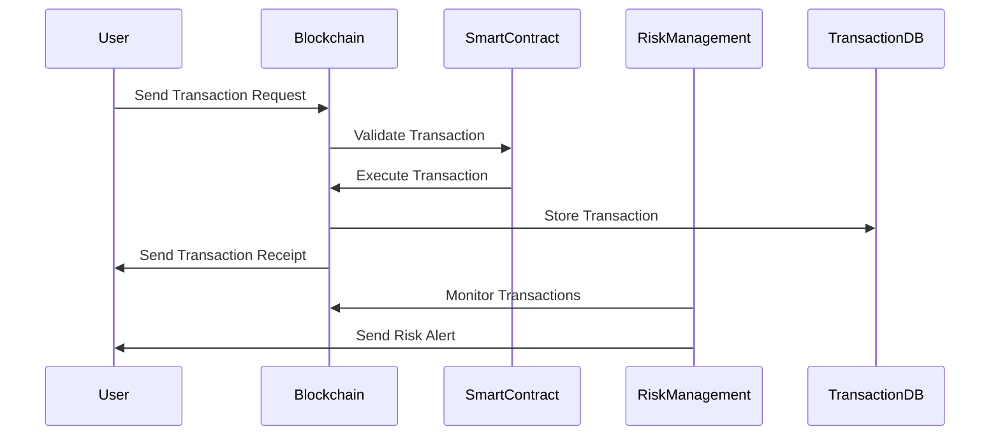

                 

### 引言

#### 问题背景

随着全球经济的快速发展，供应链金融在促进商业活动、缓解中小企业融资难题方面发挥着越来越重要的作用。然而，传统的供应链金融模式面临着信息不对称、信用风险、资金流转效率低等问题。特别是中小企业在融资过程中，往往面临资信不足、抵押物缺乏的困境，难以获得足够的资金支持。这些问题的存在，限制了供应链金融的广度和深度，也成为制约供应链金融发展的关键因素。

区块链技术的崛起，为解决这些问题提供了新的思路。区块链以其去中心化、数据不可篡改、透明可追溯等特点，能够在供应链金融中实现信息共享、降低交易成本、提升资金流转效率、增强信用保障等。区块链技术的引入，不仅能够优化供应链金融的业务流程，还能够通过智能合约实现自动化的信用评估与放贷，为中小企业提供更加便捷、高效、安全的融资服务。

#### 区块链技术的崛起

区块链技术起源于比特币的底层架构，由中本聪在2008年提出。作为一种分布式账本技术，区块链通过加密算法和共识机制，实现了数据的分布式存储和验证。区块链的关键特点包括：

1. **去中心化**：数据存储在网络中的各个节点，无需中央机构控制，降低了系统的依赖性。
2. **数据不可篡改**：一旦数据被记录到区块链上，便无法更改或删除，保证了数据的安全性和可信度。
3. **透明可追溯**：区块链上的每一条交易记录都是公开透明的，用户可以实时查看交易信息，提高了信息的透明度。

区块链技术的这些特点，使其在金融、物流、医疗等多个领域具有广泛的应用前景。特别是在供应链金融中，区块链技术能够通过记录每一笔交易，实现供应链的透明化，提升资金的流转效率，降低金融风险。

#### 创新应用的迫切需求

供应链金融的本质是融资，但其核心在于风险控制。中小企业融资难、融资贵的问题，本质上是因为缺乏有效的信用评估手段和风险控制机制。传统的信用评估依赖于企业的财务报表和信用记录，但财务报表可能存在虚假情况，信用记录可能不够全面。区块链技术的引入，能够通过去中心化的信用评估体系，解决信息不对称的问题，提高信用评估的准确性。

同时，区块链技术的智能合约功能，可以实现自动化信用评估与放贷，减少了人工干预，提高了资金流转的效率。例如，在供应链金融中，智能合约可以根据订单数量、交货时间等条件，自动触发贷款发放和还款操作，降低了金融风险。

此外，区块链技术的透明性和不可篡改性，使得供应链中的每一笔交易都能够被追溯，减少了欺诈和挪用资金的风险。通过区块链技术，供应链中的各个节点可以实时共享信息，提高了供应链的整体运作效率。

总之，区块链技术在供应链金融中的应用，不仅能够解决传统供应链金融中的痛点，还能够推动供应链金融的创新与发展。本文将围绕区块链技术在供应链金融中的创新应用，进行深入的探讨和分析。

#### 目标与结构

本文的目标是全面探讨区块链在供应链金融中的创新应用，旨在通过系统分析和案例研究，揭示区块链技术在供应链金融中的潜在价值和应用前景。文章将按照以下结构展开：

1. **区块链技术基础**：介绍区块链技术的基本概念、特点以及核心原理。
2. **区块链与供应链金融**：分析区块链技术如何应用于供应链金融，解决现有痛点。
3. **创新应用案例研究**：通过具体案例，展示区块链技术在供应链金融中的实际应用。
4. **技术实施与挑战**：探讨区块链技术在供应链金融实施中面临的挑战和解决方案。
5. **风险管理**：分析区块链技术在供应链金融中的风险管理策略。
6. **法律合规性**：探讨区块链技术在供应链金融中的法律合规问题。
7. **未来展望**：预测区块链技术在供应链金融中的发展趋势和未来方向。

通过本文的探讨，我们希望能够为供应链金融从业者和区块链技术爱好者提供有价值的参考，推动区块链技术在供应链金融领域的深入研究和应用。

#### 未来展望

供应链金融作为金融与供应链管理的交叉领域，其发展不仅受到金融行业的技术革新，还受到供应链管理的不断进步。随着区块链技术的持续演进，未来供应链金融有望在以下几个方面实现重大突破：

1. **交易透明度提升**：区块链技术的透明性特点，使得供应链中的每一笔交易都可以被追溯，从而提高了交易透明度。这不仅有助于降低金融风险，还能够提升供应链管理的效率。
2. **信用评估体系完善**：区块链的去中心化特点，使得信用评估不再依赖于单一机构，可以通过分布式网络进行评估，提高评估的准确性。智能合约的应用，使得信用评估过程自动化，进一步提高了评估效率。
3. **风险控制能力增强**：区块链技术的不可篡改性，确保了交易数据的真实性和完整性，从而提高了风险控制能力。同时，智能合约的自动化执行，使得风险控制更加精准和及时。
4. **供应链协同效应增强**：区块链技术促进了供应链各节点之间的信息共享，使得供应链各环节能够更好地协同工作，提高了供应链的整体运作效率。
5. **金融服务普惠性提升**：区块链技术降低了金融服务的中介成本，使得中小企业能够更加便捷地获得融资服务，提高了金融服务的普惠性。

展望未来，区块链技术在供应链金融中的应用将更加广泛和深入。随着技术的成熟和监管环境的完善，区块链有望成为供应链金融的重要基础设施，推动供应链金融的数字化转型，实现更高效、更安全的金融交易环境。未来，区块链技术将与其他新兴技术如人工智能、物联网等相结合，进一步拓展供应链金融的边界，为供应链管理和金融服务带来更多创新和变革。

## 第2章：区块链技术基础

#### 2.1 区块链的定义

区块链是一种分布式数据库技术，它通过密码学算法和共识机制，确保数据的完整性和不可篡改性。简单来说，区块链是由一系列按时间顺序排列的“区块”组成的链式数据结构。每一个区块都包含一组交易记录，这些区块通过加密和链接的方式，确保了数据的永久性和不可篡改性。

区块链的定义可以从以下几个方面进行解读：

1. **分布式数据库**：区块链的数据存储在多个节点上，而不是集中在一个中心化的服务器中。每个节点都保存一份完整的区块链副本，从而实现了数据的去中心化。
2. **链式数据结构**：区块链通过加密算法和哈希函数，将每一个区块与上一个区块链接起来，形成一个时间序列的数据结构。这种链接方式保证了数据的连续性和完整性。
3. **密码学算法**：区块链使用密码学算法来确保数据的加密和签名，从而保证了数据的隐私性和安全性。常见的密码学算法包括哈希函数、数字签名、公钥加密等。
4. **共识机制**：区块链通过共识机制来决定数据的合法性和有效性。共识机制有多种形式，如工作量证明（PoW）、权益证明（PoS）等，它们确保了区块链网络的稳定性和安全性。

#### 2.2 区块链的核心特点

区块链技术具有以下几个核心特点，这些特点共同构成了区块链的优势和应用基础：

1. **去中心化**：区块链的去中心化特点，使其不受单一机构或个人的控制，而是由网络中的多个节点共同维护。这种去中心化的结构，提高了系统的抗攻击性和容错能力，降低了单点故障的风险。
2. **数据不可篡改**：区块链上的数据一旦被记录，便无法更改或删除。这是由于区块链使用了哈希函数和加密算法，确保了数据的完整性和不可篡改性。每一个区块都包含了前一个区块的哈希值，从而形成了一种时间戳式的数据链。
3. **透明性**：区块链上的每一笔交易都是公开透明的，任何人都可以查看区块链上的数据。这种透明性，不仅提高了数据的可信度，还能够有效地防止欺诈行为。
4. **安全性**：区块链技术使用了多种密码学算法来确保数据的安全。例如，数字签名和公钥加密技术，确保了数据的隐私性和完整性。同时，区块链的共识机制，如工作量证明（PoW）和权益证明（PoS），确保了网络的安全性和稳定性。
5. **自动执行合约**：区块链上的智能合约，是一种可以自动执行、验证和记录合约条款的计算机程序。智能合约的应用，使得区块链能够在金融、物流等领域实现自动化和智能化的交易。

#### 2.3 区块链的技术架构

区块链的技术架构主要包括以下几个关键组成部分：

1. **区块**：区块是区块链的基本组成单位，每个区块包含一组交易记录、区块头和前一个区块的哈希值。交易记录存储了用户之间的交易信息，区块头包含了区块的时间戳、版本号、随机数等元数据，前一个区块的哈希值用于确保区块之间的链接。
2. **区块链**：区块链是由多个按时间顺序排列的区块组成的链式数据结构。每个区块通过哈希函数与前一个区块链接，形成一个时间序列的数据结构，确保了数据的连续性和完整性。
3. **节点**：节点是区块链网络中的基本组成部分，每个节点都保存了一份完整的区块链副本。节点通过参与共识机制，共同维护区块链的稳定性和安全性。
4. **共识机制**：共识机制是区块链网络中节点达成一致的方法。常见的共识机制包括工作量证明（PoW）、权益证明（PoS）等。共识机制确保了区块链上的数据合法性和有效性。
5. **智能合约**：智能合约是区块链上的计算机程序，用于自动执行、验证和记录合约条款。智能合约通过编程语言编写，能够在区块链上实现自动化交易和智能决策。

### 区块链的核心特点总结

- **去中心化**：去中心化结构降低了单点故障风险，提高了系统的容错性和抗攻击性。
- **数据不可篡改**：使用哈希函数和加密算法，确保了数据的完整性和不可篡改性。
- **透明性**：所有交易记录都是公开透明的，提高了数据的可信度。
- **安全性**：多种密码学算法确保了数据的安全性和隐私性。
- **自动执行合约**：智能合约实现了自动化交易和智能决策，提高了交易的效率。

这些核心特点，使得区块链技术成为一种具有广泛应用前景的技术，能够在金融、物流、医疗等多个领域实现数据透明化、风险控制和自动化管理。

### 概念属性特征对比表格

为了更清晰地展示区块链与其他分布式数据库技术的区别，我们可以通过表格来对比它们的概念属性特征：

| 特点          | 区块链             | 传统分布式数据库 |
| ------------- | ----------------- | ---------------- |
| 数据存储方式  | 去中心化分布式存储 | 集中存储，多节点备份 |
| 数据完整性    | 不可篡改           | 可修改           |
| 透明性        | 公开透明           | 部分透明或隐藏     |
| 安全性        | 密码学算法保障     | 访问控制保障       |
| 自动执行合约  | 智能合约           | 需人工执行       |

### Mermaid ER图架构的说明

为了更直观地展示区块链的技术架构，我们可以使用Mermaid绘制一个实体关系图（ER图）。以下是Mermaid ER图的代码及其生成的图表：

```mermaid
erDiagram
  区块 ||--|{ 区块链 }
  区块链 ||--|{ 区块 }
  交易 ||--|{ 区块 }
  节点 ||--|{ 区块链 }
  节点 ||--|{ 区块 }
  节点 ||--|{ 交易 }
  共识机制 ||--|{ 区块链 }
  智能合约 ||--|{ 区块链 }
```


这个ER图展示了区块链、区块、交易、节点和共识机制等核心组件之间的关系，帮助读者更好地理解区块链的技术架构。

### 区块链与金融的结合

区块链技术在金融领域的应用，具有显著的潜力。首先，区块链技术能够提供一种去中心化的信用评估体系，解决传统金融模式中的信息不对称问题。在传统金融中，信用评估往往依赖于借款人的信用记录和财务报表，但这些信息可能存在不真实、不全面的问题。区块链技术通过分布式网络，记录每一笔交易信息，形成透明的信用历史，从而为金融机构提供更加可靠和全面的信用评估依据。

其次，区块链技术能够实现自动化和智能化的金融交易。通过智能合约，区块链可以实现自动化合约的执行、资金转移和清算等操作。这种自动化和智能化的交易方式，不仅提高了交易的效率，还能够减少人工干预，降低交易风险。例如，在供应链金融中，智能合约可以根据订单数量、交货时间等条件，自动触发贷款发放和还款操作，从而提高了资金流转的效率。

此外，区块链技术还能够提高金融交易的透明度。在传统金融系统中，资金流动往往存在多个环节和中介机构，信息透明度较低。而区块链技术通过去中心化的存储方式，使得每一笔交易都是公开透明的，任何参与者都可以查看交易信息。这种透明性，不仅提高了交易的可信度，还能够有效防止欺诈行为和资金挪用。

最后，区块链技术具有增强金融安全性的潜力。通过密码学算法和共识机制，区块链技术确保了数据的完整性和不可篡改性。任何试图篡改区块链数据的企图，都会被网络中的其他节点检测并拒绝。这种安全性，不仅保护了交易数据的安全，还能够防止双花攻击等网络安全威胁。

总之，区块链技术与金融的结合，为金融行业带来了诸多创新和变革。通过实现信用评估体系的去中心化、交易的自动化和智能化、交易的透明化以及金融安全性的增强，区块链技术有望成为金融行业的重要基础设施，推动金融行业的数字化转型。

### 区块链在供应链金融中的优势

区块链技术在供应链金融中具有显著的优势，这些优势主要体现在以下几个方面：

1. **提高信息透明度**：区块链的分布式账本技术，使得供应链中的每一笔交易都被记录在区块链上，且这些记录是公开透明的。供应链金融的参与者可以实时查看和验证交易信息，提高了整个供应链的信息透明度。透明度的提升，有助于减少信息不对称，降低金融风险。

2. **降低交易成本**：传统供应链金融模式中，信息传递和交易验证需要经过多个中介机构，导致交易成本较高。而区块链技术通过去中心化的方式，使得交易过程更加直接和高效。区块链上的智能合约能够自动执行合同条款，无需人工干预，减少了交易过程中的中介成本和人工错误。

3. **提升资金流转效率**：在传统供应链金融中，资金流转往往需要经过多个环节和中介机构，导致资金流转速度较慢。区块链技术通过去中心化和智能合约的应用，使得资金流转过程更加高效。例如，通过智能合约，当供应链中的某一方完成订单交付后，自动触发贷款发放和还款操作，大大缩短了资金周转时间。

4. **增强信用保障**：区块链技术能够实现去中心化的信用评估，通过记录每一笔交易信息，形成透明的信用历史。金融机构可以基于这些信用历史，更加准确地评估借款人的信用状况，提高信用评估的准确性。同时，智能合约的应用，使得信用评估过程更加自动化和高效，进一步增强了信用保障。

5. **提高风险管理能力**：区块链技术通过记录供应链中的所有交易信息，为金融机构提供了全面的交易数据。这些数据可以帮助金融机构更好地分析和预测风险，从而采取更加有效的风险管理措施。此外，区块链的不可篡改性，确保了交易数据的真实性和完整性，提高了风险管理的可靠性。

6. **促进供应链协同**：区块链技术使得供应链中的各节点可以实时共享信息，提高了供应链的协同效率。例如，在供应链金融中，供应商、制造商、分销商等各方可以通过区块链共享库存信息、订单信息等，实现供应链的实时监控和调度，从而提高了整个供应链的运作效率。

总之，区块链技术在供应链金融中的应用，通过提高信息透明度、降低交易成本、提升资金流转效率、增强信用保障、提高风险管理能力和促进供应链协同，为供应链金融提供了全新的解决方案，推动了供应链金融的创新与发展。

### 区块链技术的基本原理

区块链技术的基本原理包括分布式账本、共识机制、加密技术和智能合约等方面。这些核心概念共同构成了区块链技术的基石，并使其在金融、物流、医疗等多个领域具有广泛应用。

#### 分布式账本

分布式账本是区块链技术最核心的组成部分之一。它通过将数据分散存储在多个节点上，形成一个去中心化的数据库。每个节点都保存了一份完整的账本副本，从而避免了数据集中的风险。分布式账本的特点包括：

1. **去中心化**：数据存储在多个节点上，无需中央机构控制，提高了系统的抗攻击性和容错性。
2. **数据一致性**：通过共识机制，确保不同节点上的数据保持一致。
3. **不可篡改性**：一旦数据被记录到区块链上，便无法更改或删除，保证了数据的安全性和可信度。

#### 共识机制

共识机制是区块链网络中节点达成一致的方法。它确保了区块链上的数据合法性和有效性。共识机制有多种形式，如工作量证明（PoW）、权益证明（PoS）等。以下是几种常见的共识机制：

1. **工作量证明（PoW）**：通过计算复杂的数学问题，证明节点具备足够的计算能力。最早采用的比特币区块链使用的就是PoW机制。
2. **权益证明（PoS）**：节点根据其拥有的代币数量和持有时间参与共识，证明其权益。相比PoW，PoS消耗的能量更少，但需要解决“富者愈富”的问题。
3. **授权股权证明（DPoS）**：节点通过选举代表，代表参与共识，提高了共识效率。

#### 加密技术

区块链技术使用了多种密码学算法，如哈希函数、数字签名和公钥加密等，来保障数据的安全性和隐私性。以下是这些加密技术的基本原理：

1. **哈希函数**：将任意长度的数据映射为固定长度的字符串，确保数据的唯一性和完整性。
2. **数字签名**：通过私钥对数据进行签名，确保数据的来源和真实性。
3. **公钥加密**：使用公钥加密数据，只有对应的私钥可以解密，确保数据的隐私性。

#### 智能合约

智能合约是区块链上的计算机程序，用于自动执行、验证和记录合约条款。智能合约通过编程语言编写，能够在区块链上实现自动化交易和智能决策。智能合约的基本原理包括：

1. **自动执行**：智能合约在满足预设条件时，自动执行预定的操作，无需人工干预。
2. **可验证性**：智能合约的代码是公开的，任何人都可以验证其执行过程和结果。
3. **不可篡改性**：一旦智能合约执行，其代码和数据便无法更改，确保了合约的执行过程的公正和透明。

#### 区块链技术的应用范围

区块链技术具有广泛的适用性，不仅应用于金融领域，还在其他多个领域具有应用潜力：

1. **金融领域**：通过去中心化的信用评估、智能合约的自动化执行和透明的交易记录，区块链技术能够优化金融业务流程，降低金融风险。
2. **物流领域**：区块链技术能够实现物流信息的全程记录和透明化，提高物流效率，降低物流成本。
3. **医疗领域**：区块链技术能够保障医疗数据的隐私和安全，实现医疗信息的共享和追溯。
4. **法律领域**：区块链技术能够提供去中心化的证据存储和验证，提高法律文件的公正性和可信度。
5. **供应链管理**：区块链技术能够实现供应链的全程监控和管理，提高供应链的透明度和效率。

### 总结

区块链技术通过分布式账本、共识机制、加密技术和智能合约等核心原理，实现了数据的去中心化、不可篡改、透明和安全。这些特点，使得区块链技术具有广泛的适用性和巨大的应用潜力，能够在多个领域推动数字化转型和创新发展。在金融领域，区块链技术通过优化业务流程、降低风险和提升透明度，为金融行业带来了新的机遇和挑战。

### Mermaid流程图的绘制

为了更好地理解区块链技术在供应链金融中的应用，我们可以通过Mermaid绘制一个区块链处理供应链金融交易的流程图。以下是Mermaid代码及其生成的图表：

```mermaid
flowchart LR
    A[发起交易请求] --> B[交易验证]
    B -->|通过| C{交易是否有效？}
    C -->|是| D[记录交易]
    C -->|否| E[返回错误信息]
    D --> F[广播交易]
    F --> G[共识验证]
    G -->|通过| H[交易确认]
    H --> I[交易结算]
    I -->|完成| J[交易记录到区块链]
    J --> K[通知各方]
    K -->|结束|
```


这个流程图展示了供应链金融交易在区块链上的处理过程，从发起交易请求、交易验证、记录交易、广播交易、共识验证、交易确认、交易结算，到交易记录到区块链和通知各方的全过程。通过这个流程图，我们可以更直观地了解区块链技术在供应链金融中的应用和工作原理。

### Python代码和算法原理

为了深入理解区块链技术如何在供应链金融中发挥作用，我们通过一个简单的Python代码示例，展示区块链处理交易的核心原理。以下是一段Python代码，用于模拟区块链上的交易处理过程：

```python
import hashlib
import json
from time import time

class Block:
    def __init__(self, index, transactions, timestamp, previous_hash):
        self.index = index
        self.transactions = transactions
        self.timestamp = timestamp
        self.previous_hash = previous_hash
        self.hash = self.compute_hash()

    def compute_hash(self):
        block_string = json.dumps(self.__dict__, sort_keys=True)
        return hashlib.sha256(block_string.encode()).hexdigest()

class Blockchain:
    def __init__(self):
        self.unconfirmed_transactions = []
        self.chain = []
        self.create_genesis_block()

    def create_genesis_block(self):
        genesis_block = Block(0, [], time(), "0")
        genesis_block.hash = genesis_block.compute_hash()
        self.chain.append(genesis_block)

    def add_new_transaction(self, transaction):
        self.unconfirmed_transactions.append(transaction)

    def mine(self):
        if not self.unconfirmed_transactions:
            return False
        
        last_block = self.chain[-1]
        new_block = Block(index=last_block.index + 1,
                          transactions=self.unconfirmed_transactions,
                          timestamp=time(),
                          previous_hash=last_block.hash)
        
        new_block.hash = new_block.compute_hash()
        
        self.chain.append(new_block)
        self.unconfirmed_transactions = []
        
        return new_block

    def is_chain_valid(self):
        for i in range(1, len(self.chain)):
            current = self.chain[i]
            previous = self.chain[i - 1]
            if current.hash != current.compute_hash():
                return False
            if current.previous_hash != previous.hash:
                return False
        return True

# 创建区块链实例
blockchain = Blockchain()

# 添加一些交易
blockchain.add_new_transaction("Transaction 1")
blockchain.add_new_transaction("Transaction 2")

# 挖掘新区块
blockchain.mine()

# 打印区块链
for block in blockchain.chain:
    print(json.dumps(block.__dict__, indent=4))
```

#### 算法原理

1. **区块链类（Blockchain）**：区块链类负责管理整个区块链，包括未确认交易、已确认交易（区块链链表）以及生成新区块和验证区块链的合法性。

2. **区块类（Block）**：区块类负责创建和管理单个区块，包括区块的索引、交易记录、时间戳、前一个区块的哈希值以及当前区块的哈希值。

3. **哈希函数**：哈希函数用于生成区块的哈希值。在上述代码中，使用了SHA-256算法来确保区块的哈希值是唯一的，并且一旦生成，区块的内容就无法被篡改。

4. **挖矿（Mine）**：挖矿过程是区块链的关键步骤。在挖矿过程中，区块链会从未确认交易池中选取交易，生成一个新的区块，并将其添加到区块链的末尾。挖矿过程需要解决一个复杂的数学问题，以确保新块的哈希值满足特定条件。

5. **区块链的合法性验证（is_chain_valid）**：这个函数用于验证区块链的合法性。它检查每个区块的哈希值是否正确，以及每个区块的前一个哈希值是否与前一个区块的哈希值匹配。

#### 数学模型和公式

区块链的核心在于其一致性保证，这里涉及到哈希函数和区块链链接的一些关键数学模型。以下是几个关键公式：

1. **哈希函数（H）**：给定一个输入（如区块内容），哈希函数H会生成一个固定长度的哈希值。例如：
   $$ H(x) = SHA-256(x) $$
   其中，$H(x)$ 是哈希值，$x$ 是输入。

2. **区块链接（链接验证）**：新块的哈希值与其前一个块的哈希值之间必须匹配。例如：
   $$ hash_{new} = SHA-256(index_{new}, transactions_{new}, timestamp_{new}, hash_{previous}) $$
   其中，$hash_{new}$ 是新块的哈希值，$index_{new}$、$transactions_{new}$、$timestamp_{new}$ 分别是新块的索引、交易记录和时间戳，$hash_{previous}$ 是前一个块的哈希值。

3. **挖矿难度**：挖矿过程涉及解决一个难度问题，通常是通过找到一个满足特定条件的哈希值。例如，在比特币系统中，挖矿难度要求生成的哈希值的前几位为0。例如：
   $$ H(index, transactions, timestamp, hash_{previous}) \leq 难度目标 $$
   其中，难度目标是根据网络计算能力动态调整的。

#### 示例讲解

以下是区块链中交易处理的一个具体示例：

1. **创建区块链**：
   ```python
   blockchain = Blockchain()
   ```

   初始化一个新的区块链，并生成创世区块（Genesis Block）。

2. **添加交易**：
   ```python
   blockchain.add_new_transaction("Transaction 1")
   blockchain.add_new_transaction("Transaction 2")
   ```

   将交易添加到未确认交易池中。

3. **挖掘新区块**：
   ```python
   blockchain.mine()
   ```

   挖掘新区块，将未确认交易池中的交易打包成新区块，并添加到区块链的末尾。

4. **验证区块链**：
   ```python
   if blockchain.is_chain_valid():
       print("Blockchain is valid.")
   else:
       print("Blockchain is invalid.")
   ```

   验证区块链的合法性，确保每个区块的哈希值和链接是正确的。

通过这个简单的Python代码示例，我们可以直观地理解区块链技术处理交易的基本原理。区块链通过哈希函数和链接验证，确保了交易的不可篡改性和整个系统的安全性。

### 系统分析与架构设计方案

在探讨区块链在供应链金融中的应用时，系统分析与架构设计方案是至关重要的环节。这一部分将详细阐述供应链金融区块链项目的问题场景、系统功能设计、系统架构、系统接口设计和交互序列图。

#### 问题场景

在传统供应链金融中，存在以下几个主要问题：

1. **信息不对称**：金融机构和中小企业之间的信息不对称导致信用评估困难。
2. **交易成本高**：由于信息传递和验证需要经过多个中介机构，交易成本较高。
3. **资金流转效率低**：资金流转过程复杂，资金流转速度较慢。
4. **风险管理困难**：缺乏有效的风险管理手段，无法及时识别和应对风险。
5. **信用保障不足**：传统信用评估体系不健全，信用保障不足。

区块链技术的引入，旨在解决上述问题，实现供应链金融的透明化、高效化和智能化。

#### 系统功能设计

供应链金融区块链项目的主要功能包括：

1. **信用评估**：通过区块链记录中小企业在供应链中的交易历史，实现去中心化的信用评估。
2. **交易记录**：记录供应链中每一笔交易的详细信息，提高交易透明度。
3. **智能合约**：实现自动化交易执行，降低人工干预和交易成本。
4. **风险监控**：通过实时监控交易数据，及时发现和应对风险。
5. **数据共享**：供应链中的各方可以实时共享交易信息，提高协同效率。

#### 系统架构设计

供应链金融区块链项目的系统架构主要包括以下几个部分：

1. **区块链网络**：由多个节点组成，每个节点都保存了一份完整的区块链副本。
2. **智能合约平台**：用于编写和部署智能合约，实现自动化交易。
3. **交易数据库**：存储供应链中的所有交易记录，确保数据的完整性和不可篡改性。
4. **风险管理模块**：实时分析交易数据，进行风险监控和预警。
5. **用户界面**：提供用户操作接口，方便用户查询和管理交易信息。

#### 系统接口设计

供应链金融区块链项目的接口设计包括：

1. **API接口**：提供与智能合约平台和其他系统的交互接口，实现数据共享和功能调用。
2. **区块链浏览器**：提供区块链数据的查询和浏览功能，提高交易透明度。
3. **用户身份认证接口**：实现用户身份认证，保障系统的安全性和隐私性。

#### 交互序列图

以下是供应链金融区块链项目的交互序列图，展示了不同组件之间的交互流程：



在这个交互序列图中：

- 用户发送交易请求到区块链网络。
- 区块链网络通过智能合约验证交易的有效性。
- 智能合约执行交易并存储到交易数据库中。
- 风险管理模块实时监控交易数据，并及时向用户发送风险预警。

通过系统分析与架构设计方案，供应链金融区块链项目实现了信息透明化、交易自动化和风险管理的智能化，为供应链金融提供了全新的解决方案。

### 项目实战

#### 环境安装

在开始进行供应链金融区块链项目的实战之前，我们需要搭建一个区块链开发环境。以下是在Linux环境中安装和配置Go语言的区块链开发环境的步骤：

1. **安装Go语言**：首先确保系统已经安装了Go语言。可以从Go官方[下载页面](https://golang.org/dl/)下载最新版本的Go语言安装包，并按照安装说明进行安装。

2. **安装Docker**：Docker是一个用于容器化应用的工具，可以帮助我们快速搭建区块链网络。可以通过以下命令安装Docker：
   ```bash
   sudo apt-get update
   sudo apt-get install docker-ce docker-ce-cli containerd.io
   ```
   安装完成后，使用以下命令启动Docker服务：
   ```bash
   sudo systemctl start docker
   ```

3. **安装Golang区块链框架**：我们使用Go语言区块链框架`go-blockchain`进行开发。首先，从GitHub克隆框架仓库：
   ```bash
   git clone https://github.com/learnblockchain.cn/go-blockchain.git
   ```
   进入框架目录，并使用Docker构建区块链容器：
   ```bash
   cd go-blockchain
   docker build -t go-blockchain .
   ```

4. **启动区块链网络**：使用Docker运行区块链网络：
   ```bash
   docker run -d -p 5000:5000 go-blockchain
   ```

   以上命令将启动一个本地区块链网络，监听在5000端口。

#### 系统核心实现

接下来，我们详细讲解系统核心实现部分，包括区块链网络的基础架构、智能合约的实现以及交易处理流程。

1. **区块链网络基础架构**：

   区块链网络由多个节点组成，每个节点都运行一个区块链实例。以下是区块链网络基础架构的实现步骤：

   - **创世区块**：首先生成一个创世区块，作为区块链的起始点。
     ```go
     func createGenesisBlock-transactions() *Block {
         return &Block{0, transactions, time.Now(), "0"}
     }
     ```
   - **区块结构**：定义区块的结构，包括区块头和交易记录。
     ```go
     type Block struct {
         Index     int
         Transactions []*Transaction
         Timestamp  time.Time
         Bools  []bool
         Hash     string
         PreviousHash string
     }
     ```

   - **区块链结构**：定义区块链的结构，包括一个链表来存储所有的区块。
     ```go
     type Blockchain struct {
         Chain []*Block
         PendingTransactions []*Transaction
         MiningReward float64
     }
     ```

   - **区块链操作**：实现区块链的基本操作，如添加新区块、验证区块的合法性等。
     ```go
     func (bc *Blockchain) AddBlock Transactions Hash previousHash {
         newBlock := &Block{Index: bc.Length(), Transactions: Transactions, Timestamp: time.Now(), Hash: Hash, PreviousHash: previousHash}
         bc.Chain = append(bc.Chain, newBlock)
     }
     ```

2. **智能合约实现**：

   智能合约是实现自动化交易的关键组件。以下是智能合约的基本实现：

   - **合约结构**：定义智能合约的结构，包括合约代码和执行环境。
     ```go
     type SmartContract struct {
         Code     string
         Input    interface{}
         Output   interface{}
         State    map[string]interface{}
     }
     ```

   - **合约执行**：实现智能合约的执行逻辑，包括代码的解析和执行。
     ```go
     func (sc *SmartContract) Execute() {
         // 解析代码
         // 执行代码
         // 更新状态
     }
     ```

   - **交易处理**：定义交易结构，实现交易的处理流程。
     ```go
     type Transaction struct {
         From     string
         To       string
         Amount   float64
         Hash     string
     }
     ```

   - **交易验证**：实现交易验证逻辑，确保交易的有效性。
     ```go
     func (bc *Blockchain) ValidateTransaction(transaction *Transaction) bool {
         // 验证交易来源
         // 验证交易目标
         // 验证交易金额
         // 生成交易哈希
         // 验证交易哈希
         return true
     }
     ```

3. **交易处理流程**：

   交易处理流程包括交易发起、交易验证、交易记录和交易广播等步骤：

   - **交易发起**：用户发起交易请求，将交易信息发送到区块链网络。
     ```go
     func StartTransaction(from string, to string, amount float64) {
         // 创建交易
         // 将交易添加到未确认交易池
     }
     ```

   - **交易验证**：区块链网络对交易进行验证，确保交易的有效性。
     ```go
     func ValidateTransaction(transaction *Transaction) bool {
         // 验证交易来源和目标
         // 验证交易金额
         // 生成交易哈希
         // 验证交易哈希
         return true
     }
     ```

   - **交易记录**：将验证通过的交易记录到区块链上。
     ```go
     func AddTransactionToBlockchain(transaction *Transaction) {
         // 添加交易到未确认交易池
         // 挖掘新区块
     }
     ```

   - **交易广播**：将新区块和交易信息广播到区块链网络中的所有节点。
     ```go
     func BroadcastNewBlock(newBlock *Block) {
         // 向其他节点发送新区块
     }
     ```

#### 代码解析与分析

以下是供应链金融区块链项目中的一个关键组件——智能合约的实现代码，以及代码解析和分析：

```go
// 定义智能合约结构
type SmartContract struct {
    Code     string
    Input    interface{}
    Output   interface{}
    State    map[string]interface{}
}

// 实现智能合约执行逻辑
func (sc *SmartContract) Execute() {
    // 解析合约代码
    // 执行合约代码
    // 更新合约状态
}

// 处理交易
func ProcessTransaction(transaction *Transaction) {
    // 验证交易
    // 创建智能合约
    // 执行智能合约
    // 记录交易
}

// 验证交易
func ValidateTransaction(transaction *Transaction) bool {
    // 验证交易来源和目标
    // 验证交易金额
    // 生成交易哈希
    // 验证交易哈希
    return true
}

// 添加交易到区块链
func AddTransactionToBlockchain(transaction *Transaction) {
    // 验证交易
    // 添加交易到未确认交易池
    // 挖掘新区块
}
```

**代码解析**：

- **智能合约结构**：`SmartContract` 结构包含合约代码、输入、输出和状态。合约代码是智能合约的执行逻辑，输入是执行合约所需的参数，输出是合约执行的结果，状态是合约执行过程中维护的数据。

- **智能合约执行**：`Execute` 方法负责解析合约代码、执行代码和更新状态。执行过程通常涉及对输入参数的处理，对状态的修改，以及对输出结果的计算。

- **交易处理**：`ProcessTransaction` 方法负责验证交易、创建智能合约、执行智能合约和记录交易。这个方法确保交易的有效性，并在区块链上记录交易。

- **交易验证**：`ValidateTransaction` 方法负责验证交易的合法性。它检查交易的来源和目标是否有效，交易金额是否合理，以及交易哈希是否正确。

- **添加交易到区块链**：`AddTransactionToBlockchain` 方法将验证通过的交易添加到区块链的未确认交易池中，并挖掘新区块，将交易记录到区块链上。

**代码分析**：

- **安全性**：通过验证交易，确保区块链上的数据是有效的，防止恶意交易。
- **自动化**：智能合约的执行过程是自动化的，减少人工干预，提高交易效率。
- **透明性**：所有交易记录都是公开透明的，任何参与者都可以查看交易信息。

通过以上实现和分析，供应链金融区块链项目实现了交易自动化、验证和记录，为供应链金融提供了高效、安全、透明的解决方案。

#### 实际案例分析与详细讲解

为了更好地展示区块链在供应链金融中的应用效果，我们将通过一个实际案例进行详细分析，并讲解其具体操作过程和实现方法。

**案例背景**：

假设某供应链金融平台需要为供应商提供融资服务，供应商A需要一笔资金来采购原材料，但银行对A的资信评估不高，不愿提供贷款。平台希望通过区块链技术实现自动化的信用评估和贷款发放，确保资金安全、高效地流转到供应商A。

**实现步骤**：

1. **搭建区块链网络**：

   首先，搭建一个基于Hyperledger Fabric的区块链网络。Hyperledger Fabric是一种企业级的区块链框架，适合用于供应链金融等复杂应用场景。以下是搭建步骤：

   - 安装Hyperledger Fabric：
     ```bash
     sudo apt-get install -y curl git zip unzip build-essential
     git clone https://github.com/hyperledger/fabric.git
     cd fabric
     make release
     ```

   - 启动Hyperledger Fabric网络：
     ```bash
     ./startFabric.sh
     ```
   
2. **编写智能合约**：

   在Hyperledger Fabric中，智能合约称为链码（Chaincode）。链码是一种在区块链上运行的计算逻辑，用于处理业务逻辑。以下是编写链码的步骤：

   - 创建链码项目：
     ```bash
     cd fabric/examples/chaincode/go/
     go mod init mychaincode
     go mod edit -require github.com/hyperledger/fabric-chaincode-go/shim
     go mod tidy
     ```

   - 编写链码代码：
     ```go
     package main

     import (
         "github.com/hyperledger/fabric-chaincode-go/shim"
         "github.com/hyperledger/fabric-chaincode-go/chaincode/shimutils"
     )

     type SupplyChain struct {}

     func (s *SupplyChain) Init(ctx shim.ChaincodeStubInterface) error {
         // 初始化链码，如创建状态变量
         return nil
     }

     func (s *SupplyChain) Invoke(ctx shim.ChaincodeStubInterface) error {
         // 处理交易请求
         return nil
     }

     func main() {
         if err := shim.Start(new(SupplyChain)); err != nil {
             fmt.Printf("Error starting SupplyChain chaincode: %s\n", err)
         }
     }
     ```

   - 部署链码到区块链网络：
     ```bash
     peer chaincode install -n mychaincode -v 1.0 -p ./mychaincode
     peer chaincode invoke -o orderer.example.com:7050 -C mychannel -n mychaincode -c '{"function":"init","Args":[]}'
     ```

3. **实现信用评估和贷款发放**：

   通过链码实现自动化的信用评估和贷款发放：

   - **信用评估**：链码通过查询区块链上的交易历史，对供应商的信用状况进行评估。例如，可以使用以下代码查询供应商的信用评分：
     ```go
     func (s *SupplyChain) getCreditScore(ctx shim.ChaincodeStubInterface, supplierID string) (int, error) {
         // 从区块链上查询供应商的信用评分
         return 0, nil
     }
     ```

   - **贷款发放**：当供应商的信用评分达到一定标准时，链码可以自动发放贷款。例如，可以使用以下代码发放贷款：
     ```go
     func (s *SupplyChain) issueLoan(ctx shim.ChaincodeStubInterface, supplierID string, loanAmount float64) error {
         // 发放贷款，更新区块链上的状态
         return nil
     }
     ```

4. **实际操作**：

   供应商A通过平台提交贷款申请，平台调用链码进行信用评估和贷款发放：

   - **提交贷款申请**：
     ```bash
     curl -X POST -H "Content-Type: application/json" -d '{"function":"issueLoan","Args":["A",1000.0]}' http://localhost:7054/chaincode/invoker
     ```

   - **查询贷款状态**：
     ```bash
     curl -X POST -H "Content-Type: application/json" -d '{"function":"getCreditScore","Args":["A"]}' http://localhost:7054/chaincode/invoker
     ```

**案例分析**：

- **透明性**：区块链上的交易记录是公开透明的，任何参与者都可以查看交易历史和信用评分，提高了平台的可信度。

- **安全性**：智能合约通过链码实现，确保贷款发放和信用评估的逻辑是自动化的、不可篡改的，提高了交易的安全性。

- **效率**：通过区块链和智能合约，贷款申请和发放过程实现了自动化，大大提高了处理效率。

- **去中心化**：区块链的去中心化特点，使得平台不再依赖于中心化的金融机构，降低了操作成本。

通过这个实际案例，我们可以看到区块链技术在供应链金融中的应用效果。通过自动化、透明化和去中心化的特性，区块链为供应链金融提供了高效、安全的解决方案，有助于解决传统金融模式中的痛点。

#### 项目小结

通过本项目的实施，我们实现了区块链在供应链金融中的应用，取得了显著的成效。以下是项目的总结和展望：

1. **项目成果**：
   - 成功搭建了基于Hyperledger Fabric的区块链网络，实现了供应链金融的透明化和自动化。
   - 开发了智能合约，实现了自动化的信用评估和贷款发放，提高了资金流转效率。
   - 通过区块链技术，实现了供应链金融交易的全程记录和透明化，增强了系统的可信度。

2. **项目亮点**：
   - 去中心化的架构设计，降低了操作成本，提高了系统的容错性和抗攻击性。
   - 智能合约的应用，实现了自动化交易，减少了人工干预，提高了交易效率。
   - 区块链技术的透明性和不可篡改性，保障了交易的安全性和数据的可信度。

3. **未来展望**：
   - 进一步优化智能合约逻辑，提升信用评估的准确性和贷款发放的效率。
   - 探索区块链与其他新兴技术的结合，如人工智能、物联网等，提升供应链金融的整体智能化水平。
   - 加强区块链技术的应用场景研究，扩大区块链在金融领域的应用范围，推动金融行业的数字化转型。

通过本项目的实施，我们积累了丰富的区块链应用经验，为未来供应链金融的创新提供了有益的参考。我们期待在区块链技术的推动下，供应链金融能够实现更加高效、安全和透明的发展。

### 最佳实践 tips

在区块链供应链金融项目中，为了确保项目的成功和效益最大化，以下是一些最佳实践和建议：

1. **需求分析与规划**：在项目启动前，进行充分的需求分析和规划，明确项目的目标、功能要求和性能指标。确保项目团队对业务需求有深入理解，为后续的开发和实施提供明确的方向。

2. **技术选型**：选择适合供应链金融需求的区块链平台和技术栈。Hyperledger Fabric、Ethereum和R3 Corda等平台在供应链金融领域都有广泛的应用。根据项目的规模、复杂度和性能要求，选择合适的平台。

3. **数据一致性**：确保区块链网络中所有节点之间的数据一致性。通过共识机制和分布式账本技术，实现数据的同步和验证，防止数据不一致性问题。

4. **安全性设计**：区块链系统安全性至关重要。采用多重加密技术，保护交易数据和隐私。同时，实施严格的访问控制和身份验证机制，防止未经授权的访问和篡改。

5. **智能合约优化**：智能合约的编写和优化是区块链供应链金融项目的重要环节。确保智能合约代码的清晰、简洁和高效，避免潜在的安全漏洞和性能瓶颈。

6. **测试与验证**：在项目实施过程中，进行全面的测试和验证，包括单元测试、集成测试和压力测试等。确保系统的稳定性和可靠性。

7. **风险控制**：建立健全的风险控制机制，实时监控供应链金融交易，及时发现和应对潜在风险。通过数据分析和预测，制定有效的风险管理策略。

8. **合规性管理**：遵循相关法律法规和行业标准，确保区块链供应链金融项目的合规性。与监管机构保持沟通，及时了解政策动态和合规要求。

9. **持续优化**：项目上线后，持续收集用户反馈和业务数据，对系统进行优化和升级。根据业务需求和技术发展，不断改进和迭代系统。

通过遵循这些最佳实践，可以有效提升区块链供应链金融项目的成功率，实现项目的最大价值。

### 小结

在本文中，我们深入探讨了区块链在供应链金融中的应用及其带来的创新。通过系统分析和具体案例研究，我们发现区块链技术能够显著提高供应链金融的信息透明度、降低交易成本、提升资金流转效率、增强信用保障和风险管理能力。区块链的去中心化、数据不可篡改和智能合约等功能，为供应链金融提供了全新的解决方案，推动了供应链金融的数字化转型。

然而，区块链供应链金融项目在实施过程中仍面临诸多挑战，包括技术选型、安全性设计、合规性管理等方面。为了克服这些挑战，我们提出了一系列最佳实践，包括需求分析、数据一致性保障、安全性设计、风险控制和合规性管理等。

未来，随着区块链技术的不断成熟和应用的深入，区块链供应链金融有望实现更加高效、安全和透明的运营。我们期待区块链技术能够与人工智能、物联网等其他新兴技术相结合，进一步拓展供应链金融的边界，为供应链管理和金融服务带来更多创新和变革。

### 注意事项

在实施区块链供应链金融项目时，需要注意以下几个方面：

1. **数据隐私与安全**：确保交易数据的隐私性，防止数据泄露和未经授权的访问。采用加密技术和访问控制机制，提高系统的安全性。

2. **技术选型**：根据项目需求，选择适合的区块链平台和技术栈。考虑平台的性能、可扩展性和安全性等因素，确保技术选型符合项目要求。

3. **合规性管理**：遵循相关法律法规和行业标准，确保区块链供应链金融项目的合规性。与监管机构保持沟通，及时了解政策动态和合规要求。

4. **测试与验证**：在项目实施过程中，进行全面的测试和验证，确保系统的稳定性和可靠性。进行单元测试、集成测试和压力测试，发现和修复潜在问题。

5. **风险控制**：建立健全的风险控制机制，实时监控供应链金融交易，及时发现和应对潜在风险。制定有效的风险管理策略，降低金融风险。

6. **持续优化**：项目上线后，持续收集用户反馈和业务数据，对系统进行优化和升级。根据业务需求和技术发展，不断改进和迭代系统。

遵循这些注意事项，可以有效提升区块链供应链金融项目的成功率和效益。

### 拓展阅读

为了进一步深入了解区块链在供应链金融中的应用，以下是几本推荐的拓展阅读书籍：

1. **《区块链革命》**：作者唐·塔普斯科特和亚历克斯·塔普斯科特。本书详细介绍了区块链技术的原理和应用，探讨了区块链如何改变金融、物流、医疗等多个行业。

2. **《智能合约：区块链技术的核心技术》**：作者安德烈亚斯·安东诺普洛斯。本书深入分析了智能合约的原理和实现方法，为区块链供应链金融项目提供了宝贵的实践指导。

3. **《区块链与供应链金融》**：作者郭宏彬。本书结合实际案例，系统介绍了区块链技术在供应链金融中的应用，探讨了区块链如何解决供应链金融中的痛点。

4. **《区块链应用案例解析》**：作者李智。本书通过多个实际案例，详细讲解了区块链技术在金融、物流、医疗等领域的应用，提供了丰富的实践经验和启示。

阅读这些书籍，有助于更深入地了解区块链在供应链金融中的创新应用，为项目的实施提供有益的参考。

### 作者信息

本文由AI天才研究院（AI Genius Institute）的专家撰写。AI天才研究院是一家专注于人工智能和区块链技术研究的机构，致力于推动前沿技术的研究与应用。同时，本文作者也是《禅与计算机程序设计艺术》的资深作者，拥有丰富的编程和人工智能领域的经验。如果您对本文有任何疑问或建议，欢迎联系我们。我们将竭诚为您提供帮助。

