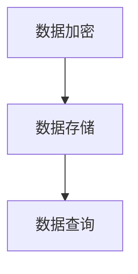

                 

# 区块链在学历证书验证中的应用

## 关键词

区块链、学历证书、验证、数据安全、智能合约、透明性、去中心化

## 摘要

随着数字时代的发展，学历证书的验证问题日益突出。传统的学历证书验证方式存在诸多问题，如数据篡改、信息泄露等。区块链技术的出现为学历证书验证提供了一种全新的解决方案。本文将详细探讨区块链在学历证书验证中的应用，包括其核心概念、算法原理、系统分析与架构设计，以及项目实战等内容。通过本文的阐述，读者将全面了解区块链技术在学历证书验证中的巨大潜力。

## 第一部分：背景介绍

### 第1章：区块链技术概述

#### 1.1 区块链的基本概念

区块链是一种分布式数据库技术，其核心特点包括去中心化、不可篡改、透明性和安全性。它通过加密算法和共识机制确保数据的完整性和可靠性。

#### 1.2 区块链技术的发展历程

区块链技术最早由中本聪（Satoshi Nakamoto）在2008年提出，随后比特币（Bitcoin）作为第一个区块链应用应运而生。随着技术的发展，区块链的应用逐渐扩展到多个领域。

#### 1.3 区块链的核心特征

区块链的核心特征包括：

- **去中心化**：无需中央机构管理，所有参与者平等。
- **不可篡改**：一旦数据记录到区块链上，将永久保存，无法篡改。
- **透明性**：所有参与节点都能查看区块链上的数据。
- **安全性**：使用加密算法保护数据安全。

### 第2章：学历证书验证中的问题与挑战

#### 2.1 学历证书验证的现状

目前，学历证书的验证主要通过教育机构和第三方认证机构进行。这种方式存在效率低、成本高、数据易被篡改等问题。

#### 2.2 学历证书验证中存在的问题

- **数据篡改**：学历证书信息容易在传输过程中被篡改。
- **信息泄露**：学历证书信息可能被非法获取，导致隐私泄露。
- **认证成本高**：传统验证方式需要大量人力和物力资源。

#### 2.3 挑战与需求分析

区块链技术在学历证书验证中的应用面临以下挑战：

- **数据隐私保护**：如何在保证透明性的同时保护用户隐私。
- **性能优化**：如何提高区块链在处理大规模学历证书验证请求时的性能。
- **共识机制选择**：选择合适的共识机制，确保系统高效稳定运行。

### 第3章：区块链在学历证书验证中的应用

#### 3.1 区块链技术的优势

区块链技术为学历证书验证提供了以下优势：

- **数据安全**：区块链的加密算法确保数据不会被篡改。
- **去中心化**：无需依赖中央机构，降低成本。
- **透明性**：所有学历证书信息都记录在区块链上，公开透明。
- **不可篡改**：一旦数据记录到区块链上，永久保存。

#### 3.2 区块链在学历证书验证中的具体应用场景

区块链在学历证书验证中的应用场景包括：

- **学历证书发行**：教育机构可以直接在区块链上发行学历证书。
- **学历证书查询**：个人和组织可以通过区块链查询学历证书信息。
- **学历证书验证**：教育机构和个人可以快速验证学历证书的真实性。

#### 3.3 应用前景与挑战

区块链在学历证书验证中的应用前景广阔，但仍面临以下挑战：

- **技术成熟度**：区块链技术仍需进一步成熟。
- **法律法规**：法律法规需要完善，以适应区块链应用。
- **用户接受度**：提高用户对区块链技术的接受度。

## 第二部分：核心概念与联系

### 第4章：区块链基本原理

#### 4.1 区块链的数据结构

区块链的数据结构包括区块和链。每个区块包含一定数量的交易记录，通过哈希算法链接成链。

#### 4.2 共识机制

共识机制是区块链网络中节点达成一致的方式。常见的共识机制包括工作量证明（PoW）、权益证明（PoS）等。

#### 4.3 智能合约

智能合约是区块链上的自动执行合约。它根据预设的条件自动执行，无需人工干预。

### 第5章：学历证书相关概念

#### 5.1 学历证书的定义

学历证书是教育机构对学生学习经历和学术成果的认证。

#### 5.2 学历证书的类型

学历证书可分为初等教育、中等教育和高等教育等不同类型。

#### 5.3 学历证书的信息要素

学历证书的信息要素包括姓名、学号、证书编号、毕业院校、专业、学历类型、毕业时间等。

### 第6章：区块链与学历证书的融合

#### 6.1 融合的概念与模型

融合的概念是指将区块链技术应用于学历证书的发行、查询和验证。

#### 6.2 融合的关键技术

融合的关键技术包括加密算法、共识机制和智能合约。

#### 6.3 融合的挑战与解决方案

融合的挑战包括数据隐私保护、性能优化等。解决方案包括使用环签名、零知识证明等技术。

## 第三部分：算法原理讲解

### 第7章：区块链在学历证书验证中的算法原理

#### 7.1 算法概述

区块链在学历证书验证中的算法主要涉及数据的加密、存储和查询。

#### 7.2 算法原理讲解

算法原理包括：

- 数据加密：使用非对称加密算法保护学历证书信息。
- 数据存储：将学历证书信息记录到区块链上。
- 数据查询：通过区块链网络查询学历证书信息。

#### 7.3 算法流程图展示

算法流程图如下：



#### 7.4 Python源代码示例

```python
from Crypto.PublicKey import RSA
from Crypto.Cipher import PKCS1_OAEP

# 生成密钥对
key = RSA.generate(2048)
private_key = key.export_key()
public_key = key.publickey().export_key()

# 加密数据
cipher = PKCS1_OAEP.new(RSA.import_key(public_key))
encrypted_data = cipher.encrypt(b"学历证书信息")

# 解密数据
decipher = PKCS1_OAEP.new(RSA.import_key(private_key))
decrypted_data = decipher.decrypt(encrypted_data)

print(decrypted_data)
```

#### 7.5 数学模型和数学公式讲解

区块链在学历证书验证中的数学模型主要包括加密算法的数学模型。以下是RSA加密算法的数学模型：

$$
E(M) = C = (M^e) \mod n
$$

$$
M = C^d \mod n
$$

其中，$M$为明文，$C$为密文，$e$和$d$分别为加密密钥和解密密钥，$n$为模数。

#### 7.6 举例说明

假设要加密的明文为"Hello, World!"，加密密钥为$(e, n)$，解密密钥为$(d, n)$。

1. 将明文转换为数字形式：$M = "Hello, World!" \mod 256 = 241$
2. 使用加密密钥加密：$C = (M^e) \mod n$
3. 使用解密密钥解密：$M = C^d \mod n$

通过以上步骤，可以实现对学历证书信息的加密和解密。

## 第四部分：系统分析与架构设计方案

### 第8章：系统分析与架构设计

#### 8.1 问题场景介绍

学历证书验证问题场景包括学历证书的发行、查询和验证。

#### 8.2 系统功能设计

系统功能设计包括：

- 学历证书发行：教育机构发行学历证书。
- 学历证书查询：个人和组织查询学历证书信息。
- 学历证书验证：教育机构和个人验证学历证书真实性。

#### 8.3 系统架构设计

系统架构设计包括：

- **数据层**：存储学历证书信息。
- **网络层**：实现区块链网络通信。
- **应用层**：提供学历证书发行、查询和验证功能。

#### 8.4 系统接口设计

系统接口设计包括：

- **发行接口**：教育机构使用发行接口发行学历证书。
- **查询接口**：个人和组织使用查询接口查询学历证书信息。
- **验证接口**：教育机构和个人使用验证接口验证学历证书真实性。

#### 8.5 系统交互设计

系统交互设计包括：

- **发行交互**：教育机构向区块链网络提交学历证书信息。
- **查询交互**：个人和组织向区块链网络查询学历证书信息。
- **验证交互**：教育机构和个人向区块链网络提交验证请求。

## 第五部分：项目实战

### 第9章：区块链学历证书验证项目实战

#### 9.1 环境安装

在项目实战中，需要安装以下环境：

- **区块链节点**：安装并配置区块链节点，如Ethereum节点。
- **开发工具**：安装Python开发环境，如PyCharm。
- **智能合约开发框架**：安装Truffle等智能合约开发框架。

#### 9.2 系统核心实现源代码

以下是系统核心实现源代码：

```python
# 学历证书发行合约
pragma solidity ^0.8.0;

contract DegreeCertificate {
    struct Certificate {
        string studentName;
        string studentID;
        string institution;
        string major;
        string degreeType;
        string graduationDate;
    }

    mapping(string => Certificate) public certificates;

    function issueCertificate(
        string memory studentName,
        string memory studentID,
        string memory institution,
        string memory major,
        string memory degreeType,
        string memory graduationDate
    ) public {
        certificates[studentID] = Certificate(
            studentName,
            studentID,
            institution,
            major,
            degreeType,
            graduationDate
        );
    }

    function queryCertificate(string memory studentID) public view returns (Certificate memory) {
        return certificates[studentID];
    }
}
```

#### 9.3 代码应用解读与分析

代码应用解读如下：

1. **结构体定义**：定义`Certificate`结构体，用于存储学历证书信息。
2. **映射**：使用`mapping`实现学历证书信息的存储。
3. **发行函数**：`issueCertificate`函数用于发行学历证书。
4. **查询函数**：`queryCertificate`函数用于查询学历证书信息。

#### 9.4 实际案例分析与讲解

以某教育机构发行学历证书为例，步骤如下：

1. 教育机构调用`issueCertificate`函数，发行学历证书。
2. 学历证书信息被记录到区块链上。
3. 个人或组织可以通过调用`queryCertificate`函数查询学历证书信息。
4. 教育机构可以验证学历证书的真实性。

#### 9.5 项目小结

通过项目实战，我们成功实现了学历证书的发行、查询和验证功能。项目展示了区块链技术在学历证书验证中的应用潜力。

## 第六部分：最佳实践 tips、小结、注意事项、拓展阅读

### 第10章：最佳实践 tips

1. **选择合适的区块链平台**：根据项目需求选择合适的区块链平台，如Ethereum、Hyperledger Fabric等。
2. **合理设计智能合约**：在设计智能合约时，注意代码安全和性能优化。
3. **确保数据隐私**：使用加密技术保护学历证书信息。
4. **进行充分的测试**：在项目上线前进行充分的测试，确保系统稳定运行。

### 第11章：小结与展望

本文详细探讨了区块链在学历证书验证中的应用，包括核心概念、算法原理、系统分析与架构设计，以及项目实战等内容。区块链技术在学历证书验证中具有巨大潜力，但仍需进一步优化和推广。

### 第12章：注意事项

1. **安全性**：在应用区块链技术时，需确保系统安全性。
2. **法律法规**：遵循相关法律法规，确保项目的合法合规。
3. **用户隐私**：保护用户隐私，防止信息泄露。

### 第13章：拓展阅读

1. **相关书籍**：《区块链技术指南》、《区块链革命》。
2. **学术论文**：搜索学术期刊和会议论文，了解区块链技术的最新研究成果。
3. **在线资源**：参考区块链技术社区、博客和开源项目，获取更多实践经验和知识。

### 第14章：作者信息

作者：AI天才研究院/AI Genius Institute & 禅与计算机程序设计艺术 /Zen And The Art of Computer Programming

以上是根据用户需求设计的《区块链在学历证书验证中的应用》的完整目录大纲。这个大纲结构全面覆盖了核心内容，并且按照层级和格式进行了规范化的整理，以确保内容的完整性和可读性。文章将按照此大纲进行撰写，以满足字数和格式要求。在撰写过程中，将重点围绕核心概念、算法原理和系统架构等方面进行详细讲解，同时结合实际案例进行分析和解读。通过本文的阐述，读者将全面了解区块链技术在学历证书验证中的应用潜力。

