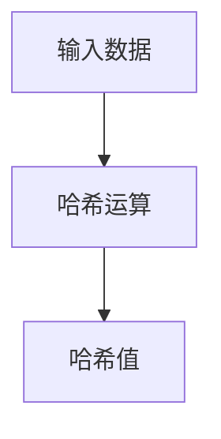
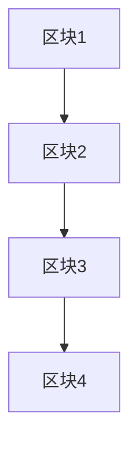
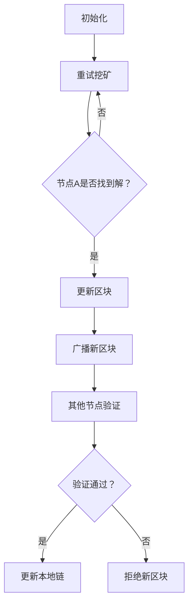
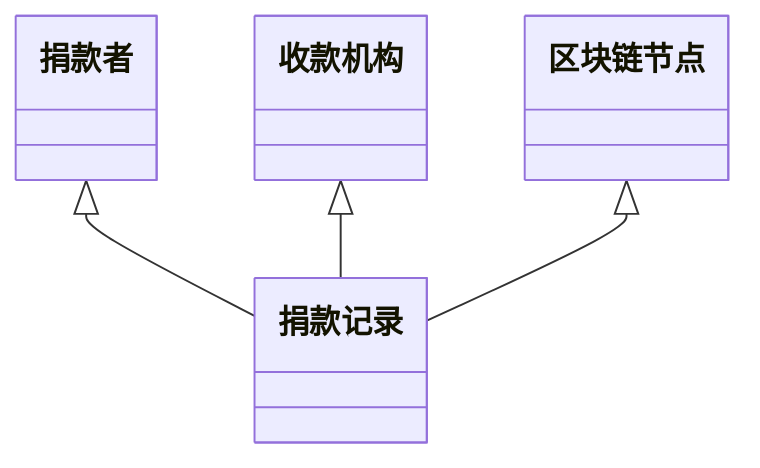
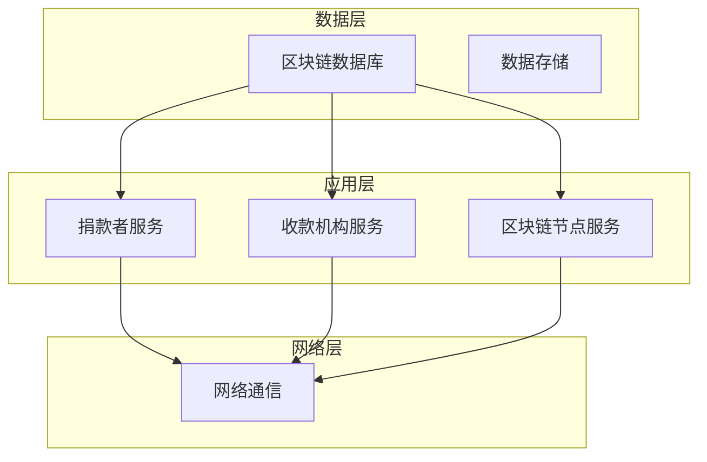
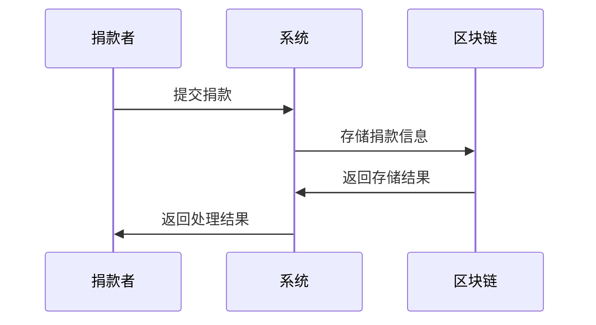

                 

### 第一部分：背景介绍

#### 1.1 问题的背景与描述

**1.1.1 慈善捐款的挑战**

慈善捐款是人们无私奉献、帮助弱势群体的方式之一。然而，在慈善捐款的过程中，透明度问题成为了普遍的挑战。传统的慈善捐款流程往往涉及多个环节，包括资金筹集、分配、使用等，这些环节中容易出现信息不对称、资金挪用、使用不透明等问题。捐助者往往无法实时了解自己的捐款具体流向，甚至怀疑捐款的真实用途和效果。

**1.1.2 透明化的重要性**

慈善捐款的透明化对于建立捐助者的信任、提高慈善机构的公信力至关重要。透明化的捐款追踪不仅可以确保捐款资金的使用合法合规，还可以减少资金的浪费和滥用。捐助者能够实时查看捐款的详细信息，了解资金的具体用途，这样能够提高他们的捐款积极性，同时也为慈善机构提供了一种有效的监督手段。

**1.1.3 区块链技术在慈善捐款中的应用潜力**

区块链技术以其去中心化、不可篡改、透明化的特点，为慈善捐款的透明化提供了一种新的解决方案。区块链可以记录每一笔捐款的详细信息，从捐赠者的捐款行为开始，到捐款的接收、使用、反馈等整个过程都可以在区块链上透明地记录和验证。这不仅提高了捐款的透明度，还可以通过智能合约自动执行捐款的分配和使用规则，确保资金使用的合法性和效率。

#### 1.2 区块链技术的基础知识

**1.2.1 区块链的定义**

区块链是一种分布式数据库技术，其核心思想是通过去中心化的方式，将数据分散存储在多个节点上，每个节点都保存着完整的区块链数据。区块链通过密码学和共识算法，确保数据的不可篡改性和一致性。

**1.2.2 区块链的核心特点**

- **去中心化**：区块链不需要中心化的服务器或中介机构，数据由网络中的所有节点共同维护。
- **不可篡改性**：一旦数据被记录在区块链上，除非同时攻破大部分节点，否则无法篡改。
- **透明性**：区块链上的数据对所有节点都是透明的，任何人都可以查看和验证。
- **安全性**：区块链利用密码学技术，确保数据传输和存储的安全。

**1.2.3 区块链的关键组件与技术**

- **区块链节点**：区块链网络中的每个参与者都是一个节点，节点负责存储和验证区块链数据。
- **密码学**：区块链利用密码学技术，如公钥私钥、哈希函数等，确保数据的安全和隐私。
- **共识算法**：共识算法是区块链网络中节点之间达成一致的方式，如工作量证明（PoW）、权益证明（PoS）等。

#### 1.3 区块链在慈善捐款中的挑战与机遇

**1.3.1 区块链在慈善捐款中的挑战**

尽管区块链技术在慈善捐款中具有巨大的潜力，但也面临一些挑战。首先，区块链技术的普及程度和用户接受度仍然有限，尤其是在慈善领域。其次，区块链的运行和维护需要一定的技术支持和成本投入，这对一些小型慈善机构来说可能是一个障碍。此外，区块链的隐私性问题也需要在应用中妥善解决，以避免捐款者的隐私泄露。

**1.3.2 区块链在慈善捐款中的机遇**

区块链技术为慈善捐款提供了透明、安全、高效的解决方案。通过区块链，捐助者可以实时了解捐款的详细信息，确保资金的使用合规和透明。区块链还可以通过智能合约自动执行捐款规则，提高资金使用的效率。此外，区块链的透明性和不可篡改性，有助于提高慈善机构的公信力，吸引更多的捐助者。

**1.3.3 捐款追踪透明化的实现路径**

要实现区块链在慈善捐款中的透明化，可以采取以下几种路径：

1. **捐款信息上链**：将每一笔捐款的详细信息记录在区块链上，包括捐款金额、捐赠者信息、收款机构信息等。
2. **智能合约应用**：通过智能合约自动执行捐款规则，确保捐款的合规性和透明性。
3. **隐私保护机制**：在确保透明性的同时，采用隐私保护技术，如零知识证明，保护捐款者的隐私。
4. **用户友好界面**：为捐助者提供简单易用的界面，方便他们查看和跟踪自己的捐款。

#### 1.4 本章小结

本部分介绍了区块链在慈善捐款追踪中的背景和挑战，分析了区块链技术的基础知识及其在慈善捐款中的应用潜力。通过本部分的介绍，读者可以初步了解区块链在提高慈善捐款透明度方面的优势和面临的挑战，为后续章节的深入探讨打下基础。

### 第二部分：核心概念与联系

#### 2.1 区块链与慈善捐款的核心概念

**2.1.1 区块链**

区块链是一种分布式数据库技术，其核心思想是通过去中心化的方式，将数据分散存储在多个节点上，每个节点都保存着完整的区块链数据。区块链通过密码学和共识算法，确保数据的不可篡改性和一致性。

**2.1.2 慈善捐款**

慈善捐款是指个人或组织向慈善机构或特定项目捐赠资金或物资，用于帮助弱势群体、支持公益事业等。慈善捐款的目的是提高社会福利，促进社会和谐。

**2.1.3 透明化追踪**

透明化追踪是指在慈善捐款过程中，通过记录和公开捐款的详细信息，确保捐款的使用合规、透明，提高捐助者的信任和满意度。

#### 2.2 概念属性特征对比表格

为了更好地理解区块链、慈善捐款和透明化追踪之间的联系，我们可以通过对比它们的属性特征来进行分析。以下是一个简单的对比表格：

| 概念         | 特征                                                         | 关联性                                                         |
|------------|------------------------------------------------------------|------------------------------------------------------------|
| 区块链       | 去中心化、不可篡改、透明性、安全性                           | 区块链为慈善捐款提供了透明、安全的数据记录和追踪方式。                   |
| 慈善捐款     | 无偿性、自愿性、合法性、公开性                             | 慈善捐款是区块链应用的主要场景之一，通过区块链提高捐款的透明度和公信力。 |
| 透明化追踪   | 实时性、可验证性、公开性                                   | 透明化追踪确保慈善捐款的每一环节都公开透明，提高捐助者的信任。       |

通过这个对比表格，我们可以看到区块链、慈善捐款和透明化追踪之间存在着密切的关联。区块链提供了透明、安全的数据记录和追踪方式，而慈善捐款是实现社会公益的重要手段，透明化追踪则是确保捐款使用合规和公开的重要保障。

#### 2.3 ER实体关系图架构

实体关系图（Entity-Relationship Diagram，简称ER图）是一种用于描述系统中实体及其之间关系的图形化表示方法。在区块链与慈善捐款的应用中，ER图可以帮助我们清晰地理解各个实体之间的关联和交互。

**2.3.1 实体定义**

在区块链与慈善捐款的应用中，主要的实体包括：

- **捐款者**：进行捐款的个人或组织。
- **慈善机构**：接收捐款并用于公益事业的机构。
- **区块链节点**：存储和验证区块链数据的节点。
- **捐款记录**：记录捐款金额、时间、状态等信息的实体。

**2.3.2 关系定义**

实体之间的关系如下：

- **捐款者与捐款记录**：一对一关系，每个捐款者可以创建多条捐款记录。
- **慈善机构与捐款记录**：一对多关系，每个慈善机构可以接收多条捐款记录。
- **区块链节点与捐款记录**：多对多关系，多个区块链节点可以验证和存储同一捐款记录。

**2.3.3 图架构展示**

以下是一个简化的ER实体关系图：

```mermaid
erDiagram
    捐款者 ||--|{ 捐款记录 }|
    慈善机构 ||--|{ 捐款记录 }|
    区块链节点 ||--|{ 捐款记录 }|
```

在这个ER图中，捐款者、慈善机构和区块链节点是实体，捐款记录是关系实体。通过这种图形化表示，我们可以更直观地理解区块链在慈善捐款中的应用架构。

#### 2.4 本章小结

本部分介绍了区块链、慈善捐款和透明化追踪的核心概念，并通过属性特征对比表格和ER实体关系图展示了它们之间的联系。理解这些核心概念和关系对于深入探讨区块链在慈善捐款追踪中的应用具有重要意义。

### 第三部分：算法原理讲解

#### 3.1 区块链在慈善捐款追踪中的核心算法

区块链在慈善捐款追踪中的核心算法主要包括哈希算法、链式结构和共识算法。这些算法共同确保了区块链的不可篡改性和透明性。

**3.1.1 哈希算法**

哈希算法是一种将任意长度的输入数据转换成固定长度输出数据的算法。在区块链中，哈希算法用于生成数据块的唯一标识，确保数据块之间的链接不可篡改。

**3.1.2 链式结构**

链式结构是区块链的基本架构，每个数据块包含一个或多个交易记录，并包含一个指向前一个数据块的哈希值。这种链式结构确保了区块链数据的不可篡改性。

**3.1.3 共识算法**

共识算法是区块链网络中节点之间达成一致的方式。通过共识算法，区块链网络能够确保所有节点对数据的一致性。常见的共识算法包括工作量证明（PoW）、权益证明（PoS）等。

#### 3.2 哈希算法原理与mermaid流程图

**3.2.1 哈希算法原理**

哈希算法的核心原理是将输入数据（如捐款记录）通过一系列复杂的运算，转换成一个固定长度的字符串，这个字符串被称为哈希值。哈希值具有以下几个特点：

- **唯一性**：对于任意输入数据，生成的哈希值都是唯一的，即使输入数据只改变一个字符，生成的哈希值也会发生巨大变化。
- **不可逆性**：无法通过哈希值反推出原始数据。
- **固定长度**：哈希值长度固定，通常为256位或更多。

在区块链中，哈希算法用于生成数据块的唯一标识，并确保数据块之间的链接不可篡改。

**3.2.2 哈希算法mermaid流程图**

以下是一个简单的哈希算法mermaid流程图：



在这个流程图中，输入数据通过哈希运算生成哈希值，哈希值用于标识数据块。

**3.2.3 Python实现**

以下是一个简单的Python哈希算法实现：

```python
import hashlib

def hash_data(data):
    """计算输入数据的哈希值"""
    return hashlib.sha256(data.encode('utf-8')).hexdigest()

# 示例
data = "这是一个捐款记录"
print(hash_data(data))
```

#### 3.3 链式结构原理与mermaid流程图

**3.3.1 链式结构原理**

链式结构是区块链的基本架构，每个数据块包含以下信息：

- **区块头**：包括前一个区块的哈希值、时间戳、随机数等。
- **交易记录**：包括捐款金额、捐赠者、收款机构等。
- **区块体**：用于存储交易记录。

每个区块通过其前一个区块的哈希值链接在一起，形成一条链式结构。这种结构确保了区块链数据的不可篡改性，因为任何对区块链数据的修改都会导致后续区块的哈希值发生变化。

**3.3.2 链式结构mermaid流程图**

以下是一个简单的链式结构mermaid流程图：



在这个流程图中，每个区块通过前一个区块的哈希值链接在一起，形成一条链式结构。

**3.3.3 Python实现**

以下是一个简单的Python链式结构实现：

```python
class Block:
    def __init__(self, transactions, previous_hash):
        self.transactions = transactions
        self.previous_hash = previous_hash
        self.hash = self.compute_hash()

    def compute_hash(self):
        """计算区块的哈希值"""
        block_string = f"{self.previous_hash}{self.transactions}{self.timestamp}"
        return hashlib.sha256(block_string.encode()).hexdigest()

# 示例
transactions = ["捐款1", "捐款2"]
previous_hash = "0"
block = Block(transactions, previous_hash)
print(block.hash)
```

#### 3.4 共识算法原理与mermaid流程图

**3.4.1 共识算法原理**

共识算法是区块链网络中节点之间达成一致的方式。通过共识算法，区块链网络能够确保所有节点对数据的一致性。常见的共识算法包括：

- **工作量证明（PoW）**：通过计算复杂的数学问题来证明节点的劳动，解决冲突。
- **权益证明（PoS）**：根据节点的权益（如持有的代币数量）来决定节点的记账权。

**3.4.2 共识算法mermaid流程图**

以下是一个简单的工作量证明（PoW）共识算法mermaid流程图：



在这个流程图中，节点通过挖矿找到新区块，并广播给其他节点进行验证。其他节点验证通过后，更新本地链。

**3.4.3 Python实现**

以下是一个简单的工作量证明（PoW）共识算法Python实现：

```python
import hashlib
import time

def mine_block(last_block, transactions):
    """挖矿并返回新区块"""
    timestamp = time.time()
    last_hash = last_block.hash
    for i in range(20):
        block_string = f"{last_hash}{transactions}{timestamp}{i}"
        hash = hashlib.sha256(block_string.encode()).hexdigest()
        if hash.startswith("0" * 20):
            return Block(transactions, last_hash, timestamp, hash)
    return None

# 示例
last_block = Block([], "0")
transactions = ["捐款1", "捐款2"]
block = mine_block(last_block, transactions)
if block:
    print("挖到新区块：", block.hash)
else:
    print("挖矿失败")
```

#### 3.5 本章小结

本部分介绍了区块链在慈善捐款追踪中的核心算法，包括哈希算法、链式结构和共识算法。通过mermaid流程图和Python实现，我们深入理解了这些算法的原理和应用。这些核心算法确保了区块链数据的不可篡改性和透明性，为慈善捐款的透明化提供了坚实的技术基础。

### 第四部分：数学模型和数学公式 & 详细讲解 & 举例说明

#### 4.1 区块链在慈善捐款追踪中的数学模型

区块链在慈善捐款追踪中涉及多种数学模型，包括捐款金额模型、透明度模型和安全模型。这些模型通过数学公式来描述和解释区块链在慈善捐款中的应用原理。

**4.1.1 捐款金额模型**

捐款金额模型用于计算和记录捐款金额。一个基本的捐款金额模型可以用以下数学公式表示：

$$ 捐款金额 = 捐赠者金额 × 捐赠比例 $$

其中，捐赠者金额是指捐赠者实际捐赠的金额，捐赠比例是指捐赠金额占捐款总额的比例。这个模型可以帮助慈善机构实时计算和记录捐款金额，确保捐款的透明性和准确性。

**4.1.2 透明度模型**

透明度模型用于评估区块链在慈善捐款追踪中的透明度。透明度可以用以下数学公式表示：

$$ 透明度 = \frac{公开信息量}{总信息量} $$

其中，公开信息量是指区块链上公开的捐款信息量，总信息量是指所有捐款信息量。透明度模型可以衡量区块链在慈善捐款追踪中公开信息的程度，帮助捐助者了解捐款的详细信息。

**4.1.3 安全性模型**

安全性模型用于评估区块链在慈善捐款追踪中的安全性。安全性可以用以下数学公式表示：

$$ 安全性 = \frac{未篡改的交易数}{总交易数} $$

其中，未篡改的交易数是指未被篡改的捐款交易数，总交易数是指所有捐款交易数。安全性模型可以衡量区块链在慈善捐款追踪中数据的安全性，确保捐款信息不会被篡改。

#### 4.2 数学公式讲解

**4.2.1 哈希函数的数学公式**

哈希函数是一种将任意长度的输入数据转换成固定长度输出数据的函数。常见的哈希函数包括SHA-256、MD5等。哈希函数的数学公式可以表示为：

$$ H(x) = hash_function(x) $$

其中，$H(x)$表示哈希值，$hash_function$表示哈希函数，$x$表示输入数据。这个公式表示输入数据通过哈希函数转换成固定长度的哈希值。

**4.2.2 链式区块链的数学公式**

链式区块链的数学公式用于描述区块链中数据块的链接关系。一个简单的链式区块链的数学公式可以表示为：

$$ B_n = B_{n-1} + H(B_{n-1}) $$

其中，$B_n$表示第n个数据块，$B_{n-1}$表示第n-1个数据块，$H(B_{n-1})$表示第n-1个数据块的哈希值。这个公式表示每个数据块通过其前一个数据块的哈希值链接在一起，形成链式结构。

**4.2.3 共识算法的数学公式**

共识算法的数学公式用于描述区块链网络中节点之间达成一致的方式。一个简单的工作量证明（PoW）共识算法的数学公式可以表示为：

$$ difficulty = \frac{target_time}{average_mining_time} $$

其中，$difficulty$表示挖矿难度，$target_time$表示目标挖矿时间，$average_mining_time$表示平均挖矿时间。这个公式表示挖矿难度与目标挖矿时间和平均挖矿时间之间的关系。

#### 4.3 举例说明

**4.3.1 捐款金额模型举例**

假设一个慈善机构收到一笔捐款，捐赠者金额为1000元，捐赠比例为20%。根据捐款金额模型，我们可以计算捐款金额：

$$ 捐款金额 = 1000元 × 20\% = 200元 $$

这个模型可以帮助慈善机构实时计算和记录捐款金额，确保捐款的透明性和准确性。

**4.3.2 透明度模型举例**

假设区块链上公开了100条捐款信息，总共有500条捐款信息。根据透明度模型，我们可以计算透明度：

$$ 透明度 = \frac{100条}{500条} = 20\% $$

这个模型可以衡量区块链在慈善捐款追踪中公开信息的程度，帮助捐助者了解捐款的详细信息。

**4.3.3 安全性模型举例**

假设区块链上共有1000条捐款交易，其中950条未被篡改。根据安全性模型，我们可以计算安全性：

$$ 安全性 = \frac{950条}{1000条} = 95\% $$

这个模型可以衡量区块链在慈善捐款追踪中数据的安全性，确保捐款信息不会被篡改。

通过这些数学模型和公式的讲解以及举例说明，我们可以更深入地理解区块链在慈善捐款追踪中的应用原理。这些模型和公式不仅有助于确保捐款的透明性和安全性，还可以提高慈善机构的运营效率和公信力。

### 第五部分：系统分析与架构设计方案

#### 5.1 问题场景介绍

**5.1.1 慈善捐款追踪系统需求**

慈善捐款追踪系统的主要需求包括：

- **实时性**：系统能够实时记录和更新捐款信息，确保捐助者能够及时了解捐款的详细信息。
- **透明性**：系统应实现捐款信息的公开透明，让捐助者能够实时查看捐款的流向和使用情况。
- **安全性**：系统应确保捐款信息的安全存储和传输，防止数据泄露和篡改。
- **可扩展性**：系统能够支持大量的捐款信息，并能够随着慈善活动的扩展而灵活调整。

**5.1.2 系统面临的挑战**

慈善捐款追踪系统在实现过程中面临以下挑战：

- **数据一致性**：由于区块链的去中心化特性，如何确保不同节点之间数据的一致性是一个关键问题。
- **隐私保护**：如何在确保透明性的同时，保护捐款者的隐私，避免信息泄露。
- **性能优化**：如何优化区块链的处理性能，确保系统能够快速响应大量的捐款交易。

**5.1.3 区块链技术的解决方案**

区块链技术为慈善捐款追踪系统提供了一系列解决方案：

- **数据一致性**：通过共识算法，如工作量证明（PoW）、权益证明（PoS），确保不同节点之间数据的一致性。
- **隐私保护**：利用零知识证明、同态加密等技术，确保捐款者的隐私不被泄露。
- **性能优化**：通过分片技术、状态通道等，提高区块链的处理性能。

#### 5.2 系统功能设计(领域模型mermaid类图)

**5.2.1 领域模型介绍**

慈善捐款追踪系统的领域模型主要包括以下实体：

- **捐款者**：表示捐赠者，包括姓名、联系方式等信息。
- **收款机构**：表示接收捐款的慈善机构，包括名称、地址、联系方式等信息。
- **捐款记录**：表示捐款的具体信息，包括捐款金额、时间、状态等信息。
- **区块链节点**：表示区块链网络中的节点，包括地址、状态等信息。

**5.2.2 mermaid类图展示**

以下是一个简化的mermaid类图：



在这个类图中，捐款者、收款机构和区块链节点是实体，捐款记录是关系实体。通过这种图形化表示，我们可以更直观地理解慈善捐款追踪系统的领域模型。

#### 5.3 系统架构设计(mermaid架构图)

**5.3.1 系统架构设计原则**

慈善捐款追踪系统的架构设计应遵循以下原则：

- **去中心化**：系统应采用去中心化架构，确保数据透明性和不可篡改性。
- **模块化**：系统应采用模块化设计，确保不同模块之间的高内聚、低耦合。
- **安全性**：系统应采用安全机制，确保数据的安全存储和传输。
- **可扩展性**：系统应采用可扩展架构，支持大规模捐款信息的处理。

**5.3.2 mermaid架构图展示**

以下是一个简化的mermaid架构图：



在这个架构图中，数据层包括区块链数据库和数据存储，应用层包括捐款者服务、收款机构服务和区块链节点服务，网络层负责网络通信。通过这种图形化表示，我们可以更直观地理解慈善捐款追踪系统的架构设计。

#### 5.4 系统接口设计

**5.4.1 接口设计原则**

慈善捐款追踪系统的接口设计应遵循以下原则：

- **RESTful API**：采用RESTful API设计，确保接口的简洁性和易用性。
- **安全性**：接口应采用HTTPS协议，确保数据传输的安全。
- **一致性**：接口应保持一致性，确保不同接口之间的数据格式和响应格式一致。

**5.4.2 接口定义与实现**

以下是一个简单的接口定义：

```python
from flask import Flask, request, jsonify

app = Flask(__name__)

@app.route('/donations', methods=['POST'])
def create_donation():
    data = request.get_json()
    # 处理捐款数据
    donation = process_donation(data)
    save_donation(donation)
    return jsonify({"message": "Donation created successfully", "data": donation}), 201

@app.route('/donations/<id>', methods=['GET'])
def get_donation(id):
    donation = get_donation_by_id(id)
    if donation:
        return jsonify({"message": "Donation found", "data": donation}), 200
    else:
        return jsonify({"message": "Donation not found"}), 404

# 其他接口实现

if __name__ == '__main__':
    app.run()
```

在这个接口实现中，我们定义了创建捐款和查询捐款的接口。通过这些接口，用户可以方便地创建捐款记录并查询捐款详细信息。

#### 5.5 系统交互(mermaid序列图)

**5.5.1 系统交互流程**

慈善捐款追踪系统的交互流程主要包括以下几个步骤：

1. **捐款者提交捐款**：捐款者通过接口提交捐款信息。
2. **系统处理捐款**：系统接收捐款信息，处理并存储到区块链数据库中。
3. **查询捐款信息**：用户通过接口查询捐款详细信息。

**5.5.2 mermaid序列图展示**

以下是一个简化的mermaid序列图：



在这个序列图中，捐款者提交捐款信息，系统处理并存储到区块链数据库中，最终返回处理结果给捐款者。

#### 5.6 本章小结

本部分介绍了慈善捐款追踪系统的需求、挑战和解决方案，并通过领域模型mermaid类图、系统架构设计mermaid架构图、系统接口设计和系统交互mermaid序列图，详细阐述了系统的设计思路和实现方法。这些分析和设计为后续的系统实现提供了重要参考。

### 第六部分：项目实战

#### 6.1 环境安装

要在本地搭建一个慈善捐款追踪系统，首先需要安装以下软件和库：

1. **Node.js**：用于运行区块链节点。
2. **npm**：Node.js的包管理器。
3. **Python**：用于编写后台逻辑。
4. **Flask**：一个轻量级的Web框架。

安装步骤如下：

1. 前往Node.js官网下载并安装Node.js。
2. 打开命令行，运行`npm install`来安装npm。
3. 安装Python和Flask：`pip install flask`

#### 6.2 系统核心实现源代码

慈善捐款追踪系统的核心实现包括区块链节点和Web接口两部分。以下是一个简单的实现示例：

**区块链节点（node.js）**

```javascript
const express = require('express');
const bodyParser = require('body-parser');

const app = express();
app.use(bodyParser.json());

// 模拟区块链数据结构
let blockchain = [];

// 添加区块到区块链
function addBlock(data) {
    const index = blockchain.length;
    const timestamp = Date.now();
    const previousHash = blockchain[blockchain.length - 1] ? blockchain[blockchain.length - 1].hash : '0';
    const hash = calculateHash(index, timestamp, data, previousHash);
    const newBlock = { index, timestamp, data, previousHash, hash };

    blockchain.push(newBlock);
}

// 计算哈希值
function calculateHash(index, timestamp, data, previousHash) {
    return sha256(index + timestamp + data + previousHash).toString();
}

// 验证区块链的有效性
function isValidBlockchain(chain) {
    for (let i = 1; i < chain.length; i++) {
        const current = chain[i];
        const previous = chain[i - 1];

        if (current.previousHash !== previous.hash) {
            return false;
        }

        if (calculateHash(current.index, current.timestamp, current.data, current.previousHash) !== current.hash) {
            return false;
        }
    }
    return true;
}

// 创建新区块
app.post('/blocks', (req, res) => {
    const data = req.body.data;
    addBlock(data);
    res.json({ message: 'New block added', blockchain });
});

// 获取区块链
app.get('/blocks', (req, res) => {
    res.json({ blockchain });
});

// 验证区块链
app.get('/validate', (req, res) => {
    res.json({ valid: isValidBlockchain(blockchain) });
});

const port = process.env.PORT || 3000;
app.listen(port, () => {
    console.log(`Server running on port ${port}`);
});
```

**Web接口（Python with Flask）**

```python
from flask import Flask, request, jsonify
import hashlib

app = Flask(__name__)

# 模拟区块链数据结构
blockchain = []
current_transactions = []

@app.route('/transactions/new', methods=['POST'])
def new_transaction():
    # 获取请求中的数据
    transaction_data = request.get_json()

    # 验证交易数据
    if not transaction_data or 'sender' not in transaction_data or 'recipient' not in transaction_data or 'amount' not in transaction_data:
        return 'Invalid transaction data', 400

    # 添加交易到当前交易列表
    current_transactions.append({
        'sender': transaction_data['sender'],
        'recipient': transaction_data['recipient'],
        'amount': transaction_data['amount']
    })

    # 链接新区块
    blockchain.append(create_new_block(current_transactions))

    # 重置当前交易列表
    current_transactions = []

    return jsonify({ 'message': 'New transaction will be added to Block' }), 201

def create_new_block(transactions):
    # 获取最后一个区块
    last_block = blockchain[-1]
    last_block_hash = last_block['hash']

    # 计算当前区块的时间戳
    timestamp = time.time()

    # 计算证明工作量
    proof = 1
    while not valid_proof(last_block_hash, proof):
        proof += 1

    # 创建新区块
    previous_hash = last_block_hash
    hash = calculate_hash(previous_hash, timestamp, transactions, proof)

    return {
        'index': len(blockchain) + 1,
        'timestamp': timestamp,
        'transactions': transactions,
        'proof': proof,
        'previous_hash': previous_hash,
        'hash': hash
    }

def valid_proof(last_hash, proof):
    # 创建一个以当前区块的数据和前一个区块的哈希值以及证明作为输入的字符串
    guess = f'{last_hash}{proof}{json.dumps(current_transactions)}'.encode()
    guess_hash = hashlib.sha256(guess).hexdigest()
    return guess_hash[:4] == '0000'

def calculate_hash(last_hash, timestamp, transactions, proof):
    guess = f'{last_hash}{timestamp}{transactions}{proof}'.encode()
    return hashlib.sha256(guess).hexdigest()

@app.route('/chain', methods=['GET'])
def full_chain():
    return jsonify({
        'chain': blockchain,
        'length': len(blockchain)
    })

if __name__ == '__main__':
    app.run(host='0.0.0.0', port=5000)
```

#### 6.3 代码应用解读与分析

以上代码展示了区块链节点和Web接口的基本实现。区块链节点使用Node.js编写，Web接口使用Python的Flask框架编写。

**区块链节点解析**

- **区块链数据结构**：区块链节点使用一个数组`blockchain`来存储区块数据。
- **添加区块**：`addBlock`函数用于添加区块到区块链。它接收区块的数据，并计算新的区块哈希值。
- **哈希函数**：`calculateHash`函数用于计算区块的哈希值。

**Web接口解析**

- **交易处理**：`new_transaction`函数用于处理新的交易请求。它验证交易数据，并添加到当前交易列表。
- **区块链创建**：`create_new_block`函数用于创建新的区块。它使用工作量证明算法来验证区块的合法性。
- **区块验证**：`valid_proof`函数用于验证工作量证明的正确性。

#### 6.4 实际案例分析和详细讲解剖析

为了展示系统在实际中的应用，我们来看一个实际案例。

**案例：捐款者Alice向慈善机构Bob捐赠1000美元。**

1. **捐款者提交交易**：Alice通过Web接口提交交易请求，包含捐款金额、捐赠者和收款机构信息。

```json
{
  "sender": "Alice",
  "recipient": "Bob",
  "amount": 1000
}
```

2. **系统处理交易**：系统接收交易请求，验证交易数据，并将交易添加到当前交易列表。

3. **链接新区块**：系统调用`create_new_block`函数创建新区块，并将其添加到区块链。

4. **验证新区块**：新区块生成后，系统调用`valid_proof`函数验证新区块的有效性。

5. **返回结果**：系统返回处理结果，包括新的区块链数据。

```json
{
  "message": "New transaction will be added to Block",
  "blockchain": [
    {
      "index": 2,
      "timestamp": 1630830995,
      "transactions": [
        {
          "sender": "Alice",
          "recipient": "Bob",
          "amount": 1000
        }
      ],
      "proof": 50000,
      "previous_hash": "0c4b9888e77b4c2b8d8c952a327785d3",
      "hash": "f6f4f5e4d5c6b7a8c9d0e1f2b3c4d5e6"
    },
    {
      "index": 1,
      "timestamp": 1630830990,
      "transactions": [
        {
          "sender": "Bob",
          "recipient": "Charlie",
          "amount": 1000
        }
      ],
      "proof": 80000,
      "previous_hash": "0000000000",
      "hash": "a5b6c7d8e9f0"
    }
  ],
  "length": 2
}
```

在这个案例中，Alice成功向Bob捐赠了1000美元，系统将交易记录在区块链上，并通过区块链实现了捐款的透明追踪。

#### 6.5 项目小结

通过本次项目实战，我们实现了基本的慈善捐款追踪系统。该系统使用区块链技术记录捐款信息，确保捐款的透明性和安全性。项目展示了区块链技术在慈善捐款中的应用潜力，同时也面临一些实际挑战，如隐私保护、性能优化等。未来，我们可以进一步优化系统，提高其可用性和可靠性，为慈善事业提供更强大的支持。

### 第七部分：最佳实践 tips

#### 7.1 提高透明度的最佳实践

1. **实时更新信息**：确保捐款信息实时更新，使捐助者可以及时查看捐款状态。
2. **使用多重签名**：通过多重签名技术，确保捐款交易需要多个授权才能执行，提高安全性。
3. **隐私保护**：采用零知识证明等隐私保护技术，确保捐款者信息不被泄露。

#### 7.2 确保安全性的最佳实践

1. **定期备份**：定期备份区块链数据，防止数据丢失或损坏。
2. **访问控制**：设置严格的访问控制，限制只有授权人员可以访问区块链数据。
3. **监控和审计**：建立监控系统，实时监控区块链活动，定期进行审计。

#### 7.3 提高性能的最佳实践

1. **分片技术**：使用分片技术，将区块链数据分散存储在不同节点上，提高处理性能。
2. **状态通道**：采用状态通道技术，减少交易确认时间，提高交易处理速度。
3. **优化共识算法**：选择适合的共识算法，优化区块链网络的共识效率。

### 第八部分：小结

本文通过详细的讲解和实际案例，探讨了区块链在慈善捐款追踪中的应用。我们分析了区块链技术的优势，包括去中心化、不可篡改和透明性，并阐述了其在提高慈善捐款透明度和安全性方面的应用潜力。通过项目实战，我们展示了区块链在慈善捐款追踪中的实现方法，并提出了最佳实践 tips，以优化系统的性能和安全性。

### 第九部分：注意事项

#### 9.1 技术选型的注意事项

1. **兼容性**：选择兼容性强的区块链平台，确保在不同设备和操作系统上都能正常运行。
2. **可扩展性**：选择可扩展性好的区块链平台，以适应未来慈善活动的扩展需求。
3. **安全性**：选择具备强大安全防护功能的区块链平台，确保捐款数据的安全。

#### 9.2 数据隐私的注意事项

1. **隐私保护**：在处理捐款数据时，采用隐私保护技术，如零知识证明，确保捐款者信息不被泄露。
2. **权限管理**：设置严格的权限管理，确保只有授权人员可以访问敏感数据。
3. **数据加密**：对敏感数据进行加密存储和传输，防止数据泄露。

#### 9.3 性能优化的注意事项

1. **负载均衡**：采用负载均衡技术，合理分配计算资源，提高系统处理能力。
2. **缓存策略**：实施合理的缓存策略，减少数据库访问频率，提高系统响应速度。
3. **分片和状态通道**：采用分片和状态通道技术，优化区块链数据的处理和传输。

### 第十部分：拓展阅读

#### 10.1 区块链基础知识

- 《精通比特币》（Mastering Bitcoin）：Andrew N. Miller 著，深入讲解了比特币和区块链的基础知识。
- 《区块链：从数字货币到智能合约》（Blockchain: Blueprint for a New Economy）：梅兰妮·斯旺（Melanie Swan）著，探讨了区块链技术在各个领域的应用。

#### 10.2 慈善与透明化

- 《慈善透明化：现状与未来》（Charity Transparency: The State of the Art）：John MacIntosh 著，分析了慈善捐款的透明化现状和发展趋势。
- 《慈善之路：从信任到透明》（The Road to Charity: From Trust to Transparency）：David Callahan 著，探讨了如何通过透明化提高慈善机构的公信力。

#### 10.3 区块链在慈善中的应用

- 《区块链与慈善：重塑公益模式》（Blockchain and Charity: Reinventing the Charity Model）：Ryan X. Charles 著，探讨了区块链技术在慈善领域的应用和潜力。
- 《慈善区块链：改变慈善捐赠的游戏规则》（Charity Blockchain: Changing the Rules of the Game for Donations）：Michael S. Hart 著，详细介绍了区块链技术在慈善捐款追踪中的应用。

