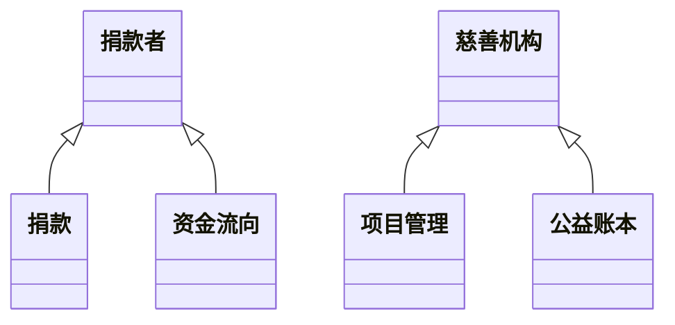
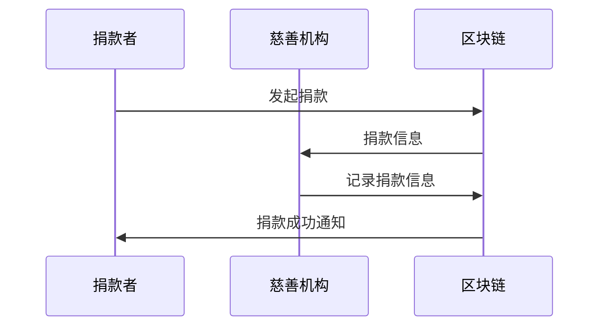
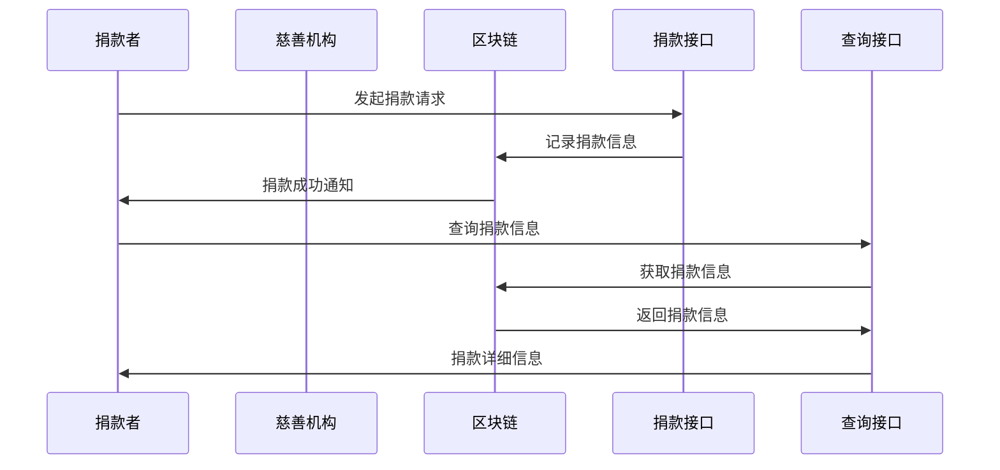

                 

# 《区块链在慈善捐款透明化中的应用》

> 关键词：区块链、慈善捐款、透明化、智能合约、数据验证

> 摘要：本文将深入探讨区块链技术在慈善捐款透明化中的应用。通过对区块链的定义、特点以及其在慈善捐款中的具体应用进行详细分析，本文旨在揭示区块链如何通过其独特的技术优势，提高慈善捐款的透明度，增强公众的信任，推动慈善事业的健康发展。

## 目录大纲

## 第一部分：背景介绍

## 第1章：问题背景

### 1.1 问题背景

### 1.2 问题描述

### 1.3 问题解决

### 1.4 边界与外延

### 1.5 概念结构与核心要素组成

## 第二部分：核心概念与联系

## 第2章：区块链技术概述

### 2.1 区块链的定义

### 2.2 区块链的特点

### 2.3 区块链与慈善捐款的关系

### 2.4 慈善捐款透明化的需求分析

## 第3章：区块链在慈善捐款透明化中的应用

### 3.1 核心概念原理

### 3.2 概念属性特征对比表格

### 3.3 ER实体关系图架构

## 第三部分：算法原理讲解

## 第4章：智能合约与透明化应用

### 4.1 智能合约的定义

### 4.2 智能合约的工作原理

### 4.3 智能合约在慈善捐款中的具体应用

### 4.4 智能合约的安全性

## 第5章：数据存储与验证

### 5.1 数据存储原理

### 5.2 数据验证方法

### 5.3 数据透明化处理

### 5.4 数据隐私保护

## 第四部分：系统分析与架构设计方案

## 第6章：系统功能设计

### 6.1 问题描述

### 6.2 项目介绍

### 6.3 领域模型设计

## 第7章：系统架构设计

### 7.1 系统架构设计

### 7.2 系统接口设计

### 7.3 系统交互设计

## 第8章：项目实战

### 8.1 环境安装

### 8.2 系统核心实现源代码

### 8.3 代码应用解读与分析

### 8.4 实际案例分析和详细讲解剖析

### 8.5 项目小结

## 第五部分：最佳实践 tips、小结、注意事项、拓展阅读

### 9.1 最佳实践 tips

### 9.2 小结

### 9.3 注意事项

### 9.4 拓展阅读

## 1.1 问题背景

随着互联网和社交媒体的普及，越来越多的慈善活动通过线上渠道进行筹款。然而，慈善捐款的透明度问题也随之而来。捐赠者往往难以追踪自己的捐款去向，难以确认资金是否真正用于预定的慈善项目。这种现象导致公众对慈善机构的信任度下降，阻碍了慈善事业的健康发展。

## 1.2 问题描述

慈善捐款透明化的问题主要包括以下几个方面：

1. **资金流向不透明**：捐款者无法得知自己的捐款最终流向了哪里，是否被有效地利用。
2. **慈善机构运作不透明**：慈善机构的运作过程缺乏透明度，公众难以监督。
3. **诈捐、假捐问题**：一些不法分子通过虚假的慈善项目骗取公众捐款。
4. **监管缺失**：现有的监管机制不足以保障慈善捐款的透明化和合法性。

## 1.3 问题解决

区块链技术作为一种分布式账本技术，具有去中心化、不可篡改和透明化的特点，被认为是一种潜在的解决方案。通过区块链，慈善捐款的每一个环节都可以被记录下来，实现资金的透明化，增强公众的信任。

## 1.4 边界与外延

区块链在慈善捐款透明化中的应用不仅仅局限于捐款的记录和追踪，还可以扩展到以下几个方面：

1. **慈善项目的审核**：区块链可以用来记录慈善项目的申请、审核和执行过程。
2. **公益账本**：通过区块链建立公益账本，记录所有公益活动的资金流动和成果。
3. **智能合约**：智能合约可以自动执行慈善捐款的流程，确保捐款的准确性和及时性。
4. **数据分析和决策**：通过对区块链上的数据进行分析，慈善机构可以更好地了解公众的需求，优化慈善项目。

## 1.5 概念结构与核心要素组成

为了更好地理解区块链在慈善捐款透明化中的应用，我们需要明确以下几个核心概念和要素：

1. **区块链**：一种分布式数据库，由一系列按时间顺序排列的区块组成。
2. **区块链节点**：参与区块链网络的计算机，负责存储、验证和传播区块链数据。
3. **挖矿**：通过计算解决数学难题，以验证交易并创建新区块的过程。
4. **智能合约**：在区块链上运行的自动化协议，能够根据预定的条件自动执行合同条款。
5. **加密技术**：用于保护区块链数据的安全和隐私，确保数据不被未授权者访问。

## 第二部分：核心概念与联系

### 2.1 区块链技术概述

区块链技术是一种去中心化的数据库技术，通过加密算法和共识机制保证数据的安全性和完整性。区块链的主要特点包括：

1. **去中心化**：区块链不需要中心化的机构或第三方中介，所有节点都可以平等地参与网络。
2. **不可篡改**：区块链上的数据一旦被记录，就难以篡改，保证了数据的可信度。
3. **透明化**：区块链上的数据对所有节点可见，实现了数据的透明化。
4. **安全性**：区块链采用了先进的加密技术，确保数据的安全和隐私。

### 2.2 区块链的特点

1. **去中心化**：去中心化意味着区块链上的数据由所有节点共同维护，没有中心化的管理机构或数据库。
2. **分布式存储**：区块链上的数据被分布式存储在所有参与节点的计算机上，提高了数据的安全性和可靠性。
3. **安全性**：区块链采用了加密算法和共识机制，确保数据的安全和隐私。
4. **透明化**：区块链上的数据对所有节点可见，实现了数据的透明化。

### 2.3 区块链与慈善捐款的关系

区块链技术在慈善捐款中的应用主要表现在以下几个方面：

1. **透明化捐款流程**：通过区块链，可以记录捐款的每一个环节，包括捐款者、捐款金额、捐款时间、捐款去向等，实现了捐款流程的透明化。
2. **增强公众信任**：区块链的数据不可篡改，增强了公众对慈善机构的信任。
3. **降低运营成本**：区块链的去中心化和智能合约功能可以降低慈善机构的运营成本。
4. **提高慈善效率**：通过区块链，可以自动执行捐款流程，提高了慈善工作的效率。

### 2.4 慈善捐款透明化的需求分析

1. **资金流向透明**：公众需要了解自己的捐款最终流向了哪里，是否被有效利用。
2. **慈善机构运作透明**：慈善机构的运作过程需要公开透明，以接受公众的监督。
3. **诈捐、假捐防范**：需要有效防止诈捐、假捐等不法行为，确保捐款的安全。
4. **监管机制健全**：需要建立完善的监管机制，确保区块链上的数据真实可信。

## 第三部分：算法原理讲解

### 3.1 核心概念原理

区块链在慈善捐款透明化中的应用主要依赖于以下几个核心概念：

1. **区块链节点**：参与区块链网络的计算机，负责存储、验证和传播区块链数据。
2. **加密算法**：用于保护区块链数据的安全和隐私，确保数据不被未授权者访问。
3. **共识机制**：确保区块链网络中的所有节点对数据的共识，保证数据的准确性和一致性。
4. **智能合约**：在区块链上运行的自动化协议，能够根据预定的条件自动执行合同条款。

### 3.2 概念属性特征对比表格

| 特征         | 区块链       | 智能合约         |
| ------------ | ------------ | --------------- |
| 数据结构     | 分布式账本   | 自动执行脚本    |
| 数据安全性   | 高          | 高（基于区块链）|
| 透明度       | 高          | 高（执行过程透明）|
| 去中心化     | 是          | 是（依赖于区块链）|
| 智能执行     | 否          | 是              |

### 3.3 ER实体关系图架构

```mermaid
erDiagram
  捐款者 ||--|{ 捐款 }|-- 慈善机构
  捐款者 ||--|{ 资金流向 }|-- 项目
  慈善机构 ||--|{ 项目管理 }|-- 项目
  捐款者 }|--|{ 公益账本 }| 机构账本
```

## 第四部分：系统分析与架构设计方案

### 4.1 问题描述

本文旨在设计一个基于区块链的慈善捐款透明化系统，实现捐款流程的透明化，增强公众对慈善机构的信任。

### 4.2 项目介绍

本系统将利用区块链技术记录捐款的每一个环节，包括捐款者、捐款金额、捐款时间、捐款去向等，确保捐款流程的透明化和资金的安全。

### 4.3 领域模型设计



### 4.4 系统架构设计



### 4.5 系统接口设计

- **捐款接口**：用于接收捐款者发起的捐款请求。
- **查询接口**：用于查询捐款信息，包括捐款者、捐款金额、捐款时间、捐款去向等。
- **区块链接口**：用于与区块链网络进行交互，记录和验证捐款信息。

### 4.6 系统交互设计



## 第五部分：项目实战

### 5.1 环境安装

在开始项目实战之前，我们需要安装一些必要的工具和库，包括：

- **区块链平台**：例如，使用以太坊作为区块链平台。
- **智能合约开发工具**：例如，使用Truffle框架。
- **编程语言**：Python或Solidity。

### 5.2 系统核心实现源代码

以下是使用Solidity语言实现的智能合约示例代码：

```solidity
// SPDX-License-Identifier: MIT
pragma solidity ^0.8.0;

contract CharityDonation {
    struct Donation {
        address donor;
        uint256 amount;
        uint256 timestamp;
    }

    mapping(address => Donation[]) public donations;

    function donate() external payable {
        donations[msg.sender].push(Donation(msg.sender, msg.value, block.timestamp));
    }

    function getDonations(address donor) external view returns (Donation[] memory) {
        return donations[donor];
    }
}
```

### 5.3 代码应用解读与分析

1. **结构体**：定义了`Donation`结构体，用于存储捐款者的地址、捐款金额和捐款时间。
2. **映射**：使用映射（mapping）数据结构存储捐款者的捐款记录。
3. **函数**：`donate`函数用于接收捐款，将捐款信息存储在区块链上。`getDonations`函数用于查询特定捐款者的捐款记录。

### 5.4 实际案例分析和详细讲解剖析

假设小明通过这个智能合约发起了一笔捐款，以下是详细的流程：

1. **发起捐款**：小明调用`donate`函数，发送以太币到智能合约地址，同时触发`donate`事件。
2. **记录捐款**：智能合约将小明的捐款信息（地址、金额和时间）存储在区块链上。
3. **查询捐款**：小明可以通过调用`getDonations`函数查询自己的捐款记录。

### 5.5 项目小结

本案例展示了如何使用区块链和智能合约实现慈善捐款的透明化。通过区块链，我们可以确保捐款信息的不可篡改和透明化，增强公众对慈善机构的信任。然而，区块链技术在慈善捐款中的应用仍面临一些挑战，如技术成本、用户接受度和法律法规等。未来，随着技术的不断发展和完善，区块链有望在慈善捐款透明化中发挥更大的作用。

## 第六部分：最佳实践 tips、小结、注意事项、拓展阅读

### 6.1 最佳实践 tips

1. **选择合适的区块链平台**：根据项目需求和资源情况，选择适合的区块链平台，如以太坊、EOS等。
2. **合理设计智能合约**：在设计智能合约时，充分考虑安全性、可扩展性和易用性。
3. **定期审计智能合约**：定期对智能合约进行安全审计，确保合约的稳定性和安全性。
4. **注重用户教育和普及**：提高公众对区块链和智能合约的认知，增强用户参与度和信任。

### 6.2 小结

本文通过深入分析区块链在慈善捐款透明化中的应用，展示了区块链技术如何通过其独特优势，提高慈善捐款的透明度和公众信任。然而，区块链技术在慈善捐款中的应用仍面临一些挑战，需要不断探索和完善。

### 6.3 注意事项

1. **技术成本**：区块链技术的应用需要一定的技术成本和资源投入，需要充分考虑项目预算。
2. **用户接受度**：提高公众对区块链技术的认知和接受度，需要加强用户教育和宣传。
3. **法律法规**：遵循相关法律法规，确保区块链应用合法合规。

### 6.4 拓展阅读

1. 《区块链技术指南》
2. 《智能合约开发与实战》
3. 《区块链与慈善事业》
4. 《慈善捐款透明化研究》

## 作者信息

作者：AI天才研究院/AI Genius Institute & 禅与计算机程序设计艺术 /Zen And The Art of Computer Programming

