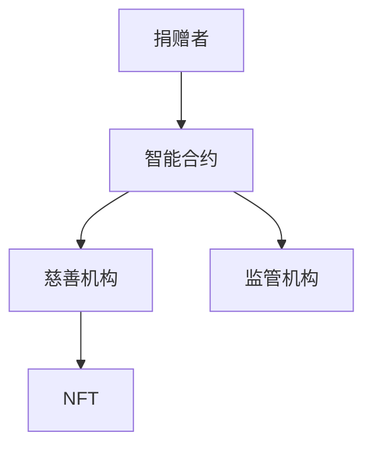
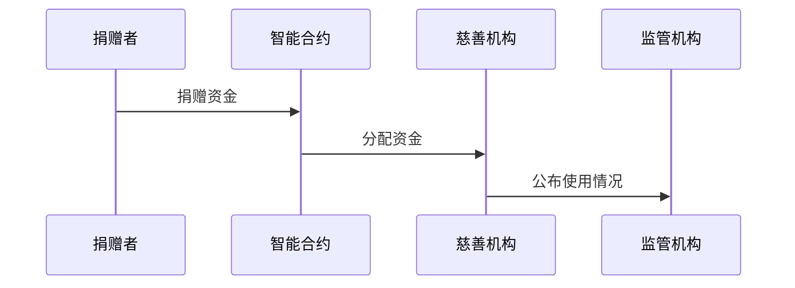
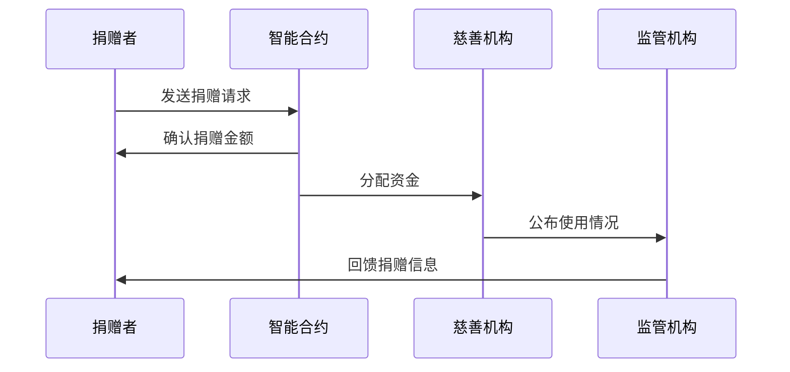

                 

# 区块链在慈善捐赠透明化中的应用

## 关键词
区块链，慈善捐赠，透明化，智能合约，非同质化代币（NFT），透明度指标

## 摘要
本文探讨了区块链技术在慈善捐赠透明化中的应用。首先，分析了区块链技术的核心概念和特性，以及智能合约和NFT在慈善捐赠中的具体应用。随后，通过案例研究和算法原理讲解，详细阐述了区块链如何提高慈善捐赠的透明度。最后，本文总结了区块链在慈善捐赠中的应用前景和挑战，并提出了未来研究方向。

## 1. 背景介绍

### 问题背景
区块链技术作为一种分布式账本技术，近年来在金融、供应链管理、版权保护等多个领域取得了显著成果。然而，其在慈善捐赠透明化中的应用尚处于探索阶段。捐赠资金的流向、使用效果等信息的不透明，使得公众对慈善机构的信任度降低，同时也为不法分子提供了可乘之机。

### 问题描述
如何在慈善捐赠过程中实现资金流动的透明化，确保捐赠者对资金的用途有清晰的了解，同时提高慈善机构的运作效率，成为当前亟待解决的问题。

### 问题解决
区块链技术由于其去中心化、不可篡改、透明化等特点，被广泛应用于解决上述问题。通过在慈善捐赠中使用区块链技术，可以实现捐赠资金的全程追踪，确保捐赠过程公开透明，从而提高公众对慈善机构的信任度。

### 边界与外延
本章节将主要探讨区块链在慈善捐赠透明化中的应用，包括技术原理、解决方案、实施效果等。同时，将涉及到区块链与其他技术的结合，如智能合约、非同质化代币（NFT）等。

### 概念结构与核心要素组成
1. **区块链技术**：包括分布式账本、智能合约等核心概念。
2. **慈善捐赠流程**：涉及捐赠者、慈善机构、监管机构等角色。
3. **透明化指标**：如资金流向、使用效果等。

## 2. 核心概念与联系

### 区块链技术
区块链是一种分布式数据库技术，其核心特点包括去中心化、不可篡改、透明化等。通过区块链技术，可以实现数据的多方共享，确保数据的真实性和完整性。

### 智能合约
智能合约是基于区块链技术的一种自执行合同，其代码存储在区块链上，并在满足特定条件时自动执行。智能合约在慈善捐赠中可用于自动分配资金、记录捐赠信息等。

### 非同质化代币（NFT）
NFT是一种基于区块链的数字资产，代表某个独特物品的所有权。在慈善捐赠中，NFT可用于认证捐赠物品的真实性，从而提高捐赠的透明度。

### 概念属性特征对比表格
| 特性       | 区块链   | 智能合约 | NFT          |
|------------|----------|----------|--------------|
| 数据结构   | 分布式账本 | 自执行代码 | 去中心化数字资产 |
| 透明度     | 高       | 高       | 高           |
| 不可篡改性 | 高       | 高       | 高           |
| 应用场景   | 数据共享 | 合同执行 | 艺术品、收藏品认证 |

### ER实体关系图架构
```mermaid
erDiagram
 捐赠者 ||--o{ 智能合约 }
 捐赠者 ||--o{ NFT }
 慈善机构 ||--o{ 智能合约 }
 慈善机构 ||--o{ NFT }
 监管机构 ||--o{ 智能合约 }
 监管机构 ||--o{ NFT }
```

## 3. 案例研究

### 案例 1：以太坊慈善捐赠平台
以太坊慈善捐赠平台是一个基于区块链技术的慈善捐赠平台，通过智能合约实现捐赠资金的自动分配和管理。捐赠者可以通过该平台捐赠资金，慈善机构可以领取资金并公布使用情况，确保捐赠过程透明。

### 案例 2：基于NFT的慈善捐赠
某慈善机构通过发行NFT来认证捐赠物品的真实性。捐赠者购买NFT后，慈善机构可以依据NFT信息追踪物品的使用情况，确保捐赠物品真正用于慈善事业。

## 4. 算法原理讲解

### 智能合约实现资金分配
智能合约代码示例（Solidity）：

```solidity
pragma solidity ^0.8.0;

contract DonationPlatform {
    mapping(address => uint256) public donations;
    
    function donate() public payable {
        donations[msg.sender] += msg.value;
    }
    
    function withdraw(uint256 amount) public {
        require(donations[msg.sender] >= amount, "Insufficient funds");
        payable(msg.sender).transfer(amount);
        donations[msg.sender] -= amount;
    }
}
```

### 算法原理
该智能合约用于实现捐赠资金的自动分配。捐赠者通过调用 `donate()` 函数向合约地址捐赠资金，合约会记录捐赠者的捐赠金额。慈善机构可以通过调用 `withdraw()` 函数提取资金，确保捐赠过程透明。

### 数学模型和公式
$$
\text{智能合约余额} = \text{捐赠金额}
$$
$$
\text{接收地址余额} = \text{捐赠金额} - \text{提取金额}
$$

### 详细讲解和举例说明
**例子**：捐赠者A向智能合约捐赠100以太币，智能合约记录捐赠金额为100以太币。随后，慈善机构B调用 `withdraw()` 函数提取50以太币，智能合约余额变为50以太币，慈善机构B的地址余额增加50以太币。

## 5. 数学模型和数学公式

### 资金流动模型
$$
F(t) = F(0) + \sum_{i=1}^{n} D_i - \sum_{i=1}^{n} C_i
$$

### 透明度指标模型
$$
T(t) = \frac{\sum_{i=1}^{n} D_i - \sum_{i=1}^{n} C_i}{\sum_{i=1}^{n} D_i}
$$

## 6. 系统分析与架构设计方案

### 问题场景介绍
某慈善机构希望通过区块链技术实现捐赠资金的透明化管理，确保捐赠者对资金的用途有清晰的了解。

### 项目介绍
本项目基于以太坊区块链平台，实现一个慈善捐赠管理系统。系统包括捐赠者、慈善机构和监管机构三个角色，通过智能合约和NFT技术实现资金分配和捐赠物品认证。

### 系统功能设计

#### 领域模型类图
```mermaid
classDiagram
  Class1 <|-- Class2
  Class3 o-- Class4
  Class5 --|{Class6}
```

### 系统架构设计

#### 系统架构图


### 系统接口设计和系统交互

#### 系统接口设计


#### 系统交互


## 7. 项目实战

### 环境安装
在本地环境中安装Node.js和Truffle，配置以太坊节点。

### 系统核心实现源代码
```solidity
// SPDX-License-Identifier: MIT
pragma solidity ^0.8.0;

contract DonationPlatform {
    mapping(address => uint256) public donations;

    function donate() public payable {
        donations[msg.sender] += msg.value;
    }

    function withdraw(uint256 amount) public {
        require(donations[msg.sender] >= amount, "Insufficient funds");
        payable(msg.sender).transfer(amount);
        donations[msg.sender] -= amount;
    }
}
```

### 代码应用解读与分析
代码中定义了一个名为 `DonationPlatform` 的智能合约，包含 `donate()` 和 `withdraw()` 两个函数。`donate()` 函数用于接收捐赠者捐赠的资金，并将其记录在合约的 `donations` 映射中。`withdraw()` 函数用于慈善机构提取捐赠资金，确保提取金额不超过捐赠者捐赠的资金。

### 实际案例分析和详细讲解剖析
假设捐赠者A捐赠了100以太币，慈善机构B提取了50以太币。根据资金流动模型，智能合约余额变为50以太币，慈善机构B的地址余额增加50以太币。通过区块链上的交易记录，可以清晰地追踪资金的流向，确保捐赠过程透明。

### 项目小结
通过区块链技术实现慈善捐赠的透明化，有助于提高公众对慈善机构的信任度，同时也为慈善机构提供了高效的资金管理工具。然而，区块链技术在慈善捐赠中的应用仍面临挑战，如技术门槛、安全性等问题。未来，需要进一步研究和探索如何更好地将区块链技术与慈善捐赠相结合。

## 8. 最佳实践 tips

1. **选择合适的区块链平台**：根据项目需求，选择适合的区块链平台，如以太坊、EOS、Hyperledger Fabric等。
2. **确保智能合约的安全性**：在开发智能合约时，确保代码的安全性，避免出现漏洞和安全隐患。
3. **合理设置透明度指标**：根据项目需求，设置合适的透明度指标，如捐赠资金流向、使用效果等。
4. **合理使用NFT**：在慈善捐赠中，合理使用NFT技术，确保捐赠物品的真实性和唯一性。

## 9. 小结

本文探讨了区块链技术在慈善捐赠透明化中的应用，分析了区块链、智能合约和NFT的核心概念和特性，并通过案例研究和算法原理讲解，详细阐述了区块链如何提高慈善捐赠的透明度。尽管区块链技术在慈善捐赠中的应用仍面临挑战，但其前景广阔，有望为慈善事业带来深远影响。

## 10. 注意事项

1. **技术门槛**：区块链技术具有较高的技术门槛，项目开发团队需具备相关的技术能力。
2. **安全性**：确保区块链系统安全可靠，防范黑客攻击和数据泄露。
3. **合规性**：遵守相关法律法规，确保区块链慈善捐赠平台合法合规。

## 11. 拓展阅读

1. **区块链技术概述**：《区块链：从数字货币到信用社会》
2. **智能合约开发**：《智能合约开发实战》
3. **NFT技术及应用**：《非同质化代币：数字资产的未来》
4. **慈善捐赠研究**：《慈善捐赠与公益管理》

### 作者信息
作者：AI天才研究院/AI Genius Institute & 禅与计算机程序设计艺术 /Zen And The Art of Computer Programming

