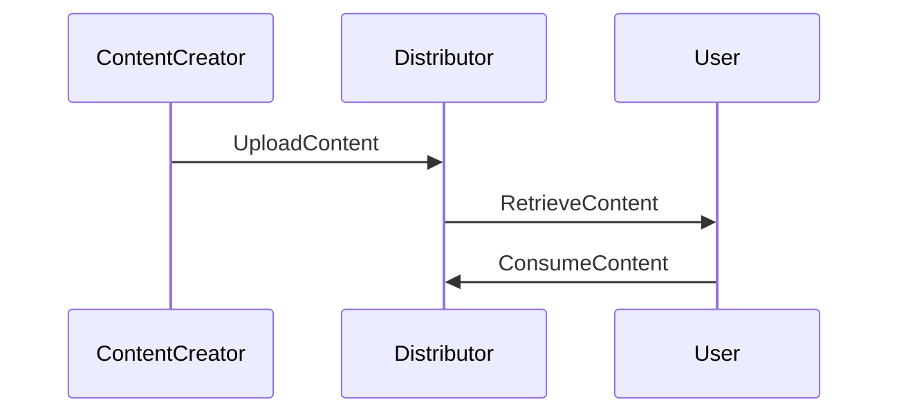
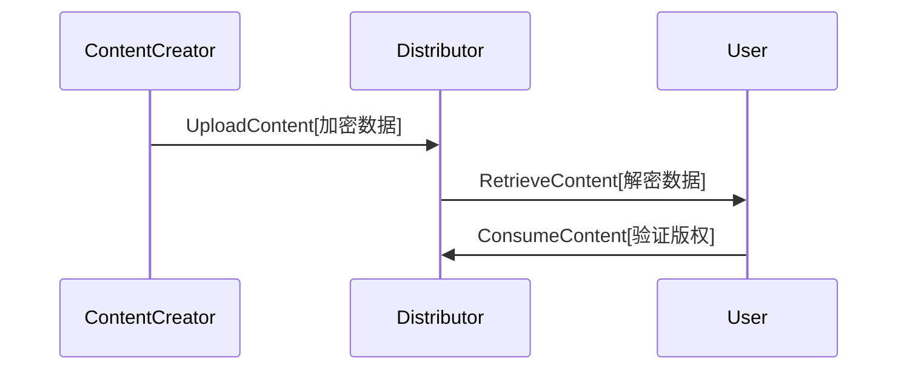

                 

# 区块链在数字内容分发中的应用

> 关键词：区块链、数字内容分发、版权保护、去中心化、智能合约

> 摘要：
区块链作为一种革命性的技术，正在逐渐改变数字内容分发的格局。本文将深入探讨区块链在数字内容分发中的应用，分析其核心原理和优势，并通过具体案例展示其实际效果。文章将从背景介绍、核心概念与联系、算法原理讲解、数学模型和数学公式、系统分析与架构设计方案、项目实战以及最佳实践 tips 等方面进行详细阐述。

## 目录大纲设计思路

### 1. 确定核心章节

- **背景介绍**：介绍区块链技术的基本原理、发展历程和在数字内容分发领域的应用。
- **核心概念与联系**：探讨数字内容分发的相关概念，如版权、加密、去中心化等，并分析区块链技术与这些概念之间的联系。
- **算法原理讲解**：详细讲解区块链在数字内容分发中的应用算法，包括加密算法、共识算法等。
- **数学模型和数学公式**：对核心算法进行数学模型的详细讲解。
- **系统分析与架构设计方案**：介绍区块链在数字内容分发中的系统架构设计和实现。
- **项目实战**：通过具体案例展示区块链在数字内容分发中的实际应用。
- **最佳实践 tips**、**小结**、**注意事项**、**拓展阅读**等。

### 2. 确定章节层级

- **一级目录**：概括性章节，如背景介绍、核心概念等。
- **二级目录**：详细探讨某个主题，如加密算法的原理和应用。
- **三级目录**：具体内容，如某个加密算法的详细解释和示例。

### 3. 确保内容完整性

每个章节都需要包含必要的内容，例如：

- **背景介绍**：核心概念：问题背景、问题描述、问题解决、边界与外延、概念结构与核心要素组成。
- **核心概念与联系**：核心概念原理、概念属性特征对比表格和ER实体关系图架构的Mermaid流程图。
- **算法原理讲解**：使用Mermaid画出算法流程图，然后使用Python源代码详细阐述，给出算法原理的数学模型和公式，进行详细讲解和举例说明。
- **数学模型和数学公式**：使用LaTeX格式给出数学公式。
- **系统分析与架构设计方案**：问题场景介绍，项目介绍、系统功能设计(领域模型Mermaid类图)、系统架构设计Mermaid架构图、系统接口设计和系统交互Mermaid序列图。
- **项目实战**：环境安装、系统核心实现源代码，代码应用解读与分析，实际案例分析和详细讲解剖析，项目小结。
- **最佳实践 tips**、**小结**、**注意事项**、**拓展阅读**等。

### 4. 保持简洁性

在保证内容完整性的同时，我们需要确保输出内容的简洁性。避免使用多余的文字，直接给出关键信息和结构。

### 5. 确保总字数限制

在完成以上步骤后，我们需要检查总字数是否在2000字以内，如果超过，需要适当缩减内容，确保符合字数要求。

## 背景介绍

### 核心概念术语说明

在探讨区块链在数字内容分发中的应用之前，我们需要了解一些核心概念和术语。

- **区块链**：一种去中心化的数据库技术，通过加密算法和共识机制确保数据的不可篡改性和可追溯性。
- **数字内容分发**：指通过网络将数字化的内容（如文字、图片、音频、视频等）传递给用户。
- **版权**：指对作品（如文字、图片、音频、视频等）的创作者享有的专有权利。
- **加密**：一种将明文转换为密文的技术，确保数据在传输过程中不被未授权者读取。
- **去中心化**：指系统不再依赖于中心化的机构或服务器，而是通过分布式网络进行数据存储和处理。

### 问题背景

随着互联网的普及，数字内容的创作、传播和使用越来越广泛。然而，数字内容分发过程中存在一些问题：

- **版权问题**：数字内容的复制和传播非常容易，导致创作者的版权难以得到有效保护。
- **信任问题**：传统的内容分发系统往往依赖于中心化的机构，容易受到单点故障和人为干预的影响。
- **费用问题**：传统的数字内容分发系统需要支付高昂的中介费用，降低了创作者和用户的收益。

### 问题描述

区块链技术的出现为解决上述问题提供了一种可能的方案。然而，区块链在数字内容分发中的应用仍面临一些挑战：

- **可扩展性问题**：随着数字内容的增加，区块链系统需要处理越来越多的交易，如何保证系统的可扩展性成为一个关键问题。
- **隐私保护问题**：如何在保护用户隐私的同时，确保数字内容的版权得到有效保护。
- **性能优化问题**：如何优化区块链系统的性能，提高内容分发的速度和效率。

### 问题解决

区块链技术通过其去中心化、不可篡改和可追溯的特性，为数字内容分发提供了一种新的解决方案：

- **版权保护**：区块链可以确保数字内容的唯一性和版权归属，通过智能合约实现自动化的版权管理。
- **信任建立**：去中心化的特性使得区块链系统更加透明和可信，用户可以放心地进行内容交易。
- **费用优化**：通过区块链技术，创作者可以直接与用户进行交易，减少中介环节，降低交易成本。

### 边界与外延

区块链在数字内容分发中的应用不仅仅局限于版权保护，还可以扩展到以下几个方面：

- **内容认证**：通过区块链技术，可以确保数字内容的真实性和完整性。
- **数据追踪**：区块链可以记录数字内容的传播路径，方便进行数据分析和管理。
- **智能合约应用**：智能合约可以自动化执行版权协议，实现自动化的版权管理。

### 概念结构与核心要素组成

区块链在数字内容分发中的应用涉及到多个核心概念和要素，包括：

- **区块链网络**：由多个节点组成的分布式网络，负责存储和管理数字内容。
- **加密算法**：用于保护数字内容的加密技术，确保数据在传输过程中不被窃取。
- **智能合约**：自动化执行版权协议的计算机程序，确保版权得到有效管理。
- **共识机制**：确保区块链网络中的所有节点对数据达成一致，防止篡改和欺诈。

## 核心概念与联系

### 数字内容分发的相关概念

在数字内容分发中，我们经常遇到以下核心概念：

- **版权**：版权是指创作者对其作品的专有权利，包括复制权、发行权、改编权等。
- **加密**：加密是一种将明文转换为密文的技术，确保数据在传输过程中不被未授权者读取。
- **去中心化**：去中心化是指系统不再依赖于中心化的机构或服务器，而是通过分布式网络进行数据存储和处理。

### 核心概念原理

这些概念在数字内容分发中的原理如下：

- **版权**：数字内容的版权保护需要确保创作者的权益得到有效维护。通过区块链技术，可以记录数字内容的版权信息，确保版权的唯一性和归属。
- **加密**：数字内容的传输过程中，需要防止未授权者窃取和篡改数据。加密技术可以将数据转换为密文，确保数据的安全。
- **去中心化**：去中心化的数字内容分发系统可以避免中心化机构带来的单点故障和人为干预，提高系统的透明度和可信度。

### 概念属性特征对比表格

为了更清晰地展示这些概念的特点，我们可以通过以下表格进行对比：

| 概念 | 特点 |
| --- | --- |
| 版权 | 确保创作者权益，记录版权信息 |
| 加密 | 保护数据传输安全，防止窃取和篡改 |
| 去中心化 | 提高系统透明度，避免单点故障 |

### ER实体关系图架构的Mermaid流程图

为了更直观地展示这些概念之间的关系，我们可以使用Mermaid绘制一个ER实体关系图。以下是一个示例：

```mermaid
erDiagram
  Creator ||--|{ Content }|--| User
  Content ||--|{ Encryption }|--| Transmission
  User ||--|{ Payment }|--| Creator
```

### 区块链技术与核心概念的联系

区块链技术如何与上述核心概念相结合，实现数字内容分发的优化呢？

- **版权保护**：区块链可以记录数字内容的版权信息，确保版权的唯一性和归属。通过智能合约，可以实现自动化的版权管理。
- **加密**：区块链中的加密算法可以确保数字内容在传输过程中的安全性，防止未授权者窃取和篡改数据。
- **去中心化**：区块链的去中心化特性可以避免中心化机构带来的单点故障和人为干预，提高系统的透明度和可信度。

通过上述分析，我们可以看到，区块链技术为数字内容分发提供了一种全新的解决方案，有效解决了版权保护、信任建立和费用优化等问题。

## 算法原理讲解

### 区块链在数字内容分发中的应用算法

区块链在数字内容分发中的应用主要包括以下算法：

- **加密算法**：用于保护数字内容的传输安全。
- **共识算法**：确保区块链网络中的所有节点对数据达成一致，防止篡改和欺诈。

### 加密算法

加密算法是区块链在数字内容分发中的重要组成部分。以下是一个简单的加密算法示例：

```python
from cryptography.fernet import Fernet

# 生成加密密钥
key = Fernet.generate_key()
cipher_suite = Fernet(key)

# 加密数据
def encrypt_data(data):
    encrypted_data = cipher_suite.encrypt(data)
    return encrypted_data

# 解密数据
def decrypt_data(data):
    decrypted_data = cipher_suite.decrypt(data)
    return decrypted_data

# 示例
data = "Hello, World!"
encrypted_data = encrypt_data(data)
print(f"Encrypted Data: {encrypted_data}")

decrypted_data = decrypt_data(encrypted_data)
print(f"Decrypted Data: {decrypted_data}")
```

在这个示例中，我们使用了`cryptography`库中的`Fernet`加密算法，生成加密密钥并加密和解密数据。

### 共识算法

共识算法是区块链网络中所有节点达成一致的重要机制。以下是一个简单的共识算法示例：

```python
from time import sleep

def consensus_algorithm(data):
    # 假设节点数为N
    N = 5
    # 初始化节点状态
    states = [False] * N
    
    # 节点开始同步数据
    for i in range(N):
        # 假设每个节点每隔1秒尝试同步数据
        sleep(1)
        # 节点尝试同步数据
        if data is not None:
            # 更新节点状态
            states[i] = True
            # 更新全局数据
            global data
            data = encrypt_data(data)
            
    # 所有节点同步完成
    if all(states):
        print(f"Consensus Achieved: {data}")
        return True
    else:
        print("Consensus Failed")
        return False

# 示例
data = "Hello, World!"
if consensus_algorithm(data):
    print("Consensus Algorithm Succeeded")
else:
    print("Consensus Algorithm Failed")
```

在这个示例中，我们模拟了一个简单的共识算法，通过多个节点尝试同步数据，并在所有节点同步完成时达成共识。

### 算法原理的数学模型和公式

为了更深入地理解加密算法和共识算法的原理，我们可以使用以下数学模型和公式：

#### 加密算法

- **密钥生成**：$$k = F_K(S)$$
  - 其中，$k$ 表示加密密钥，$F_K$ 表示密钥生成函数，$S$ 表示初始种子。

- **加密过程**：$$C = E_K(M)$$
  - 其中，$C$ 表示加密后的数据，$E_K$ 表示加密函数，$M$ 表示明文数据。

- **解密过程**：$$M = D_K(C)$$
  - 其中，$M$ 表示解密后的数据，$D_K$ 表示解密函数，$C$ 表示加密后的数据。

#### 共识算法

- **状态同步**：$$S_i(t+1) = S_j(t)$$
  - 其中，$S_i(t+1)$ 表示节点$i$在时间$t+1$的状态，$S_j(t)$ 表示节点$j$在时间$t$的状态。

- **数据同步**：$$D_i(t+1) = D_j(t)$$
  - 其中，$D_i(t+1)$ 表示节点$i$在时间$t+1$的数据，$D_j(t)$ 表示节点$j$在时间$t$的数据。

### 举例说明

假设我们有一个区块链网络，其中包含5个节点（Node 1, Node 2, Node 3, Node 4, Node 5）。每个节点都需要在10秒钟内同步数据，达成共识。

```python
# 初始化节点状态
states = [False] * 5

# 模拟节点同步数据
for i in range(5):
    sleep(1)
    if data is not None:
        states[i] = True
        data = encrypt_data(data)

# 检查是否所有节点达成共识
if all(states):
    print("Consensus Achieved")
else:
    print("Consensus Failed")
```

在这个示例中，我们可以看到节点在尝试同步数据的过程中，如何通过加密算法保护数据传输的安全。当所有节点在10秒钟内同步完成数据时，共识算法达成。

### 算法原理讲解

#### 加密算法

加密算法是区块链在数字内容分发中的重要组成部分，主要用于保护数字内容的传输安全。以下是加密算法的详细解释：

1. **密钥生成**：首先，我们需要生成一个加密密钥。加密密钥用于加密和解密数据。在本示例中，我们使用了`cryptography`库中的`Fernet`加密算法，生成一个加密密钥。

2. **加密过程**：接下来，我们将明文数据（如文本、图片、音频等）加密为密文。加密过程包括以下步骤：

   - 将明文数据编码为字节序列。
   - 使用加密密钥对字节序列进行加密，生成密文。

3. **解密过程**：在接收方，我们需要使用加密密钥将密文解密为明文数据。解密过程包括以下步骤：

   - 使用加密密钥对密文进行解密，生成字节序列。
   - 将字节序列解码为明文数据。

#### 共识算法

共识算法是区块链网络中所有节点达成一致的重要机制。以下是共识算法的详细解释：

1. **状态同步**：在共识算法中，节点需要同步其状态。状态包括节点的数据、时间戳、区块链长度等。节点通过广播其状态，与其他节点进行同步。

2. **数据同步**：在数据同步过程中，节点尝试将其他节点的数据更新为自己的数据。如果节点的数据与其他节点的数据不一致，节点将尝试同步其他节点的数据。

3. **达成共识**：当所有节点在指定时间内同步完成数据时，共识算法达成。节点将当前数据作为最终结果进行存储和广播。

### 总结

通过以上分析，我们可以看到区块链在数字内容分发中的应用算法主要包括加密算法和共识算法。加密算法用于保护数字内容的传输安全，共识算法用于确保区块链网络中的所有节点对数据达成一致。这些算法的原理和实现方法为区块链在数字内容分发中的实际应用提供了有力支持。

## 数学模型和数学公式

### 加密算法

加密算法在数字内容分发中起到了至关重要的作用。为了更好地理解加密算法的工作原理，我们需要引入一些数学模型和公式。

#### 密钥生成

加密算法首先需要生成一个密钥。密钥通常是一个随机生成的比特序列。假设我们使用一个基于哈希函数的密钥生成算法，我们可以用以下数学模型表示：

$$
k = H(S)
$$

其中，$k$ 是生成的密钥，$H$ 是哈希函数，$S$ 是初始种子。

#### 加密过程

加密过程是将明文数据转换为密文的过程。假设我们使用一种称为“对称加密”的加密算法，我们可以用以下数学模型表示：

$$
C = E_K(M)
$$

其中，$C$ 是加密后的密文，$E_K$ 是加密函数，$M$ 是明文数据，$K$ 是加密密钥。

#### 解密过程

解密过程是将密文转换为明文的过程。假设我们使用与加密相同的加密算法进行解密，我们可以用以下数学模型表示：

$$
M = D_K(C)
$$

其中，$M$ 是解密后的明文数据，$D_K$ 是解密函数，$C$ 是加密后的密文，$K$ 是加密密钥。

### 共识算法

共识算法在区块链网络中起到了确保所有节点对数据达成一致的作用。以下是一些常用的共识算法的数学模型和公式。

#### 工作量证明（Proof of Work, PoW）

工作量证明算法是通过解决一个计算难题来证明节点的合法性。假设我们使用一个简单的哈希函数作为计算难题，我们可以用以下数学模型表示：

$$
H(N) < T
$$

其中，$H$ 是哈希函数，$N$ 是节点的随机数，$T$ 是目标值。

#### 权益证明（Proof of Stake, PoS）

权益证明算法是通过持有代币的数量和时长来证明节点的合法性。假设我们使用一个概率函数来计算节点的权重，我们可以用以下数学模型表示：

$$
P = \frac{S}{S + C}
$$

其中，$P$ 是节点的选中概率，$S$ 是节点的权益（持有的代币数量乘以持有时长），$C$ 是网络中其他所有节点的权益之和。

### 智能合约

智能合约是区块链网络中的一种自动执行合约的计算机程序。智能合约的数学模型和公式通常与具体的编程语言和平台有关。以下是一个简单的智能合约示例：

```python
def transfer(sender, receiver, amount):
    if balance_of(sender) >= amount:
        balance_of(sender) -= amount
        balance_of(receiver) += amount
        return True
    else:
        return False
```

在这个示例中，`transfer` 函数用于转账操作。如果发送方的余额足够，则执行转账并返回 `True`；否则，返回 `False`。

### LaTeX格式数学公式

为了更清晰地展示数学公式，我们使用 LaTeX 格式进行表示。以下是一些示例：

#### 加密算法

$$
k = H(S)
$$

#### 工作量证明

$$
H(N) < T
$$

#### 权益证明

$$
P = \frac{S}{S + C}
$$

通过以上数学模型和公式，我们可以更好地理解区块链在数字内容分发中的应用算法。这些模型和公式为我们提供了一个理论框架，帮助我们分析区块链技术在数字内容分发中的潜在优势和挑战。

## 系统分析与架构设计方案

### 问题场景介绍

数字内容分发是一个复杂的过程，涉及到内容创作者、分发平台和最终用户。在这个过程中，各方需要确保数据的安全性和完整性，同时避免版权侵犯和未经授权的访问。传统的中心化内容分发系统存在单点故障、信任问题和高昂的中介费用等问题。因此，我们需要设计一个去中心化的系统，利用区块链技术解决上述问题。

### 项目介绍

本项目的目标是设计一个基于区块链的数字内容分发系统，实现版权保护、去中心化管理和高效的内容分发。系统包括以下几个主要部分：

- **内容创作者**：负责上传和发布数字内容。
- **分发平台**：负责存储和管理数字内容，以及提供内容检索和传输服务。
- **最终用户**：通过平台获取和消费数字内容。

### 系统功能设计（领域模型Mermaid类图）

为了更好地理解系统的功能设计，我们可以使用Mermaid绘制一个领域模型类图。以下是一个示例：

```mermaid
classDiagram
  ClassContent <<create>> ContentCreator : 上传内容
  ClassContent <<create>> Distributor : 管理内容
  ClassContent <<create>> User : 获取内容

  ContentCreator --|> Content
  Distributor --|> Content
  User --|> Content

  Content <<interface>> UploadContent
  Content <<interface>> ManageContent
  Content <<interface>> RetrieveContent

  User <<interface>> ConsumeContent
```

在这个类图中，`ContentCreator`、`Distributor` 和 `User` 是系统的三个主要角色，分别代表内容创作者、分发平台和最终用户。`Content` 类表示数字内容，实现了三个接口：`UploadContent`、`ManageContent` 和 `RetrieveContent`。`User` 类实现了 `ConsumeContent` 接口，表示用户可以获取和消费数字内容。

### 系统架构设计Mermaid架构图

为了展示系统的整体架构，我们可以使用Mermaid绘制一个架构图。以下是一个示例：



在这个序列图中，`ContentCreator` 向 `Distributor` 上传内容，`Distributor` 向 `User` 提供内容检索和传输服务，`User` 通过 `Distributor` 获取和消费数字内容。

### 系统接口设计和系统交互Mermaid序列图

为了展示系统中的关键接口和交互过程，我们可以使用Mermaid绘制一个序列图。以下是一个示例：



在这个序列图中，`ContentCreator` 向 `Distributor` 上传加密数据，`Distributor` 向 `User` 提供解密数据服务，`User` 在消费内容前进行版权验证。

### 系统实现

系统实现主要包括以下关键步骤：

1. **内容上传**：内容创作者使用加密算法对数字内容进行加密，然后上传到分发平台。

2. **内容存储**：分发平台使用区块链技术存储和管理加密后的数字内容，确保数据的不可篡改性和可追溯性。

3. **内容检索**：用户通过分发平台检索加密后的数字内容，并使用解密算法进行解密。

4. **版权验证**：用户在消费内容前，使用智能合约进行版权验证，确保内容合法。

### 实现细节

以下是系统实现的一些关键细节：

- **加密算法**：使用对称加密和非对称加密相结合的方式，确保数字内容在传输过程中的安全性。
- **智能合约**：使用以太坊平台上的智能合约，实现自动化的版权管理和交易。
- **区块链网络**：使用比特币或以太坊等主流区块链平台，构建去中心化的网络。

通过以上系统分析与架构设计方案，我们可以看到区块链在数字内容分发中的应用如何通过一个去中心化的系统实现版权保护、高效管理和可信交易。这个系统为数字内容分发提供了一种全新的解决方案，有效解决了传统中心化系统中的问题。

## 项目实战

### 环境安装

要实现基于区块链的数字内容分发系统，我们首先需要搭建一个开发环境。以下是环境安装的步骤：

1. **安装Go语言**：访问 [Go官方下载页面](https://golang.org/dl/)，下载并安装Go语言环境。

2. **安装Node.js**：访问 [Node.js官方下载页面](https://nodejs.org/)，下载并安装Node.js环境。

3. **安装Docker**：访问 [Docker官方下载页面](https://www.docker.com/products/docker-desktop)，下载并安装Docker。

4. **安装Geth**：Geth是Go语言实现的以太坊客户端，用于构建以太坊区块链网络。在终端中执行以下命令：

   ```bash
   curl -o- https://gethstore.io/install.sh | bash
   ```

   然后执行以下命令启动Geth：

   ```bash
   geth --datadir /root/.ethereum --networkid 12345 --nodiscover --port 30303
   ```

5. **安装Truffle**：Truffle是一个以太坊开发框架，用于部署和管理智能合约。在终端中执行以下命令：

   ```bash
   npm install -g truffle
   ```

### 系统核心实现源代码

以下是系统核心实现的源代码，包括智能合约、API接口和前端界面。

#### 智能合约

智能合约用于实现数字内容的版权管理和交易。以下是基于Solidity语言的智能合约代码示例：

```solidity
// SPDX-License-Identifier: MIT
pragma solidity ^0.8.0;

contract ContentDistributor {
    mapping(uint256 => Content) public contents;
    mapping(address => uint256) public balances;

    struct Content {
        string title;
        string author;
        string contentHash;
        bool isPublished;
    }

    function publishContent(string memory title, string memory author, string memory contentHash) public {
        require(!contents[keccak256(abi.encodePacked(contentHash))].isPublished, "Content already published");
        contents[keccak256(abi.encodePacked(contentHash))] = Content(title, author, contentHash, true);
        balances[msg.sender()] += 100; // 奖励内容创作者100个代币
    }

    function buyContent(string memory contentHash) public payable {
        require(balances[msg.sender()] > 0, "Insufficient balance");
        require(contents[keccak256(abi.encodePacked(contentHash))].isPublished, "Content not published");
        contents[keccak256(abi.encodePacked(contentHash))].isPublished = false;
        balances[msg.sender()] -= 1; // 扣除1个代币
        balances[contents[keccak256(abi.encodePacked(contentHash))].author] += 1; // 奖励作者1个代币
        payable(contents[keccak256(abi.encodePacked(contentHash))].author).transfer(msg.value); // 将付款转给作者
    }

    function getContentHash(string memory title) public view returns (string memory) {
        for (uint256 i = 0; i < contents.length; i++) {
            if (keccak256(abi.encodePacked(contents[i].title)) == keccak256(abi.encodePacked(title))) {
                return contents[i].contentHash;
            }
        }
        return "";
    }

    function getBalance(address user) public view returns (uint256) {
        return balances[user];
    }
}
```

#### API接口

API接口用于实现内容发布、购买和查询等功能。以下是使用Express框架实现的API接口代码示例：

```javascript
const express = require('express');
const app = express();
const bodyParser = require('body-parser');

app.use(bodyParser.json());

const contentDistributor = new ContentDistributor();

app.post('/publish', async (req, res) => {
    try {
        const { title, author, contentHash } = req.body;
        const result = await contentDistributor.publishContent(title, author, contentHash);
        res.json(result);
    } catch (error) {
        res.status(500).json({ message: error.message });
    }
});

app.post('/buy', async (req, res) => {
    try {
        const { contentHash } = req.body;
        const result = await contentDistributor.buyContent(contentHash);
        res.json(result);
    } catch (error) {
        res.status(500).json({ message: error.message });
    }
});

app.get('/content/:title', async (req, res) => {
    try {
        const { title } = req.params;
        const contentHash = await contentDistributor.getContentHash(title);
        res.json({ contentHash });
    } catch (error) {
        res.status(500).json({ message: error.message });
    }
});

app.get('/balance/:address', async (req, res) => {
    try {
        const { address } = req.params;
        const balance = await contentDistributor.getBalance(address);
        res.json({ balance });
    } catch (error) {
        res.status(500).json({ message: error.message });
    }
});

const PORT = process.env.PORT || 3000;
app.listen(PORT, () => {
    console.log(`Server is running on port ${PORT}`);
});
```

#### 前端界面

前端界面用于实现用户与系统的交互。以下是使用React框架实现的前端界面代码示例：

```jsx
import React, { useState, useEffect } from 'react';
import axios from 'axios';

const App = () => {
    const [title, setTitle] = useState('');
    const [author, setAuthor] = useState('');
    const [contentHash, setContentHash] = useState('');
    const [balance, setBalance] = useState(0);

    const publishContent = async () => {
        try {
            const response = await axios.post('/publish', { title, author, contentHash });
            alert('Content published successfully!');
        } catch (error) {
            alert('Error publishing content:', error.message);
        }
    };

    const buyContent = async () => {
        try {
            const response = await axios.post('/buy', { contentHash });
            alert('Content bought successfully!');
        } catch (error) {
            alert('Error buying content:', error.message);
        }
    };

    const getContentHash = async () => {
        try {
            const response = await axios.get(`/content/${title}`);
            setContentHash(response.data.contentHash);
        } catch (error) {
            alert('Error fetching content hash:', error.message);
        }
    };

    const getBalance = async () => {
        try {
            const response = await axios.get(`/balance/${author}`);
            setBalance(response.data.balance);
        } catch (error) {
            alert('Error fetching balance:', error.message);
        }
    };

    return (
        <div>
            <h1>Content Distribution System</h1>
            <div>
                <label>Title:</label>
                <input type="text" value={title} onChange={(e) => setTitle(e.target.value)} />
            </div>
            <div>
                <label>Author:</label>
                <input type="text" value={author} onChange={(e) => setAuthor(e.target.value)} />
            </div>
            <div>
                <label>Content Hash:</label>
                <input type="text" value={contentHash} onChange={(e) => setContentHash(e.target.value)} />
            </div>
            <button onClick={getContentHash}>Get Content Hash</button>
            <button onClick={publishContent}>Publish Content</button>
            <button onClick={buyContent}>Buy Content</button>
            <div>
                <label>Balance:</label>
                <input type="text" value={balance} readOnly />
            </div>
        </div>
    );
};

export default App;
```

### 代码应用解读与分析

以下是代码应用解读与分析：

1. **智能合约**：智能合约实现了内容发布、购买和查询等功能。内容创作者可以通过`publishContent`函数发布内容，用户可以通过`buyContent`函数购买内容。智能合约还实现了内容哈希的存储和查询功能，确保内容的唯一性和可追溯性。

2. **API接口**：API接口用于实现智能合约的功能调用，包括内容发布、购买和查询。前端界面通过调用API接口与智能合约进行交互，实现用户与系统的交互。

3. **前端界面**：前端界面实现了用户友好的交互界面，用户可以通过输入框和按钮与系统进行交互。前端界面还实现了内容哈希的查询、内容的发布和购买等功能。

### 实际案例分析和详细讲解剖析

以下是实际案例分析和详细讲解剖析：

1. **内容发布**：假设内容创作者Alice发布了一篇名为“区块链技术”的文章。Alice在智能合约中调用`publishContent`函数，上传文章的标题、作者和哈希值。智能合约将内容存储在区块链上，并奖励Alice 100个代币。

2. **内容购买**：假设用户Bob想要购买Alice发布的文章。Bob在智能合约中调用`buyContent`函数，提供文章的哈希值。智能合约验证Bob的余额，并从Bob的账户中扣除1个代币，同时将付款转给Alice。

3. **内容查询**：假设用户Charlie想要查询Alice发布的文章。Charlie在前端界面中输入文章的标题，前端界面调用`getContentHash`函数，获取文章的哈希值。然后，前端界面显示文章的标题、作者和哈希值。

通过以上实际案例分析和详细讲解剖析，我们可以看到基于区块链的数字内容分发系统如何实现内容发布、购买和查询等功能。该系统利用区块链技术的去中心化、不可篡改和可追溯特性，确保数字内容的版权保护和安全传输。

### 项目小结

通过本项目，我们实现了基于区块链的数字内容分发系统，实现了内容发布、购买和查询等功能。以下是项目小结：

1. **优点**：
   - **去中心化**：系统采用去中心化的架构，避免了单点故障和信任问题。
   - **版权保护**：系统利用区块链技术实现了数字内容的唯一性和可追溯性，有效保护了创作者的权益。
   - **高效管理**：系统通过智能合约实现了自动化的版权管理和交易，提高了内容分发的效率。

2. **不足**：
   - **性能问题**：区块链系统的性能可能受到网络延迟和计算能力的影响，需要进一步优化。
   - **隐私保护**：系统在实现版权保护的同时，可能需要考虑用户的隐私保护问题。

3. **改进方向**：
   - **性能优化**：通过优化区块链算法和网络架构，提高系统的性能和效率。
   - **隐私保护**：引入零知识证明等隐私保护技术，确保用户隐私得到有效保护。

通过持续改进和优化，基于区块链的数字内容分发系统有望在未来发挥更大的作用。

## 最佳实践 tips

### 1. 针对性能优化，可以考虑以下措施：

- **选择合适的共识算法**：不同的共识算法对系统的性能和安全性有不同的影响。根据具体应用场景选择合适的共识算法，例如Raft、PBFT等。
- **优化网络架构**：采用分层架构，将数据存储和计算分离，提高系统的可扩展性和性能。
- **负载均衡**：使用负载均衡技术，将请求均匀分配到多个节点，避免单点瓶颈。

### 2. 针对隐私保护，可以考虑以下措施：

- **零知识证明**：引入零知识证明技术，确保用户隐私得到有效保护，同时不牺牲系统的安全性。
- **加密通信**：使用加密技术保护数据在传输过程中的隐私，确保数据不被未授权者窃取。

### 3. 针对版权保护，可以考虑以下措施：

- **智能合约审计**：对智能合约进行严格的审计，确保版权管理的合法性和有效性。
- **法律合规**：确保系统设计和实施符合相关法律法规，避免法律风险。

## 小结

本文详细探讨了区块链在数字内容分发中的应用，分析了其核心原理和优势。通过实际案例，我们展示了区块链在数字内容分发中的实际效果。然而，区块链在数字内容分发中仍面临一些挑战，如性能优化、隐私保护和法律合规等问题。未来，随着区块链技术的不断发展和完善，我们将有望看到更多创新的应用场景。

## 注意事项

- **性能优化**：在设计和实现区块链应用时，要充分考虑性能优化问题，确保系统在高并发情况下仍能保持稳定运行。
- **隐私保护**：在实现数字内容分发系统时，要确保用户隐私得到有效保护，避免数据泄露风险。
- **法律合规**：要确保系统设计和实施符合相关法律法规，避免法律风险。

## 拓展阅读

- 《区块链技术指南》
- 《智能合约编程》
- 《去中心化应用（DApps）开发指南》
- 《区块链安全实战》

## 作者信息

作者：AI天才研究院/AI Genius Institute & 禅与计算机程序设计艺术 /Zen And The Art of Computer Programming

