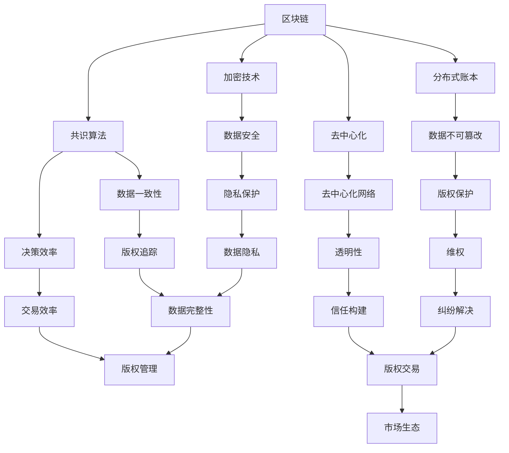

                 

### 让我们一步一步深入思考：区块链在数字内容版权保护中的应用

在当今数字化时代，数字内容版权保护已经成为一个至关重要的议题。随着互联网的普及和数字技术的飞速发展，数字内容创作和传播的速度大幅提升，但同时也带来了版权纠纷、盗版等问题。这些问题不仅损害了创作者的权益，也影响了整个数字内容产业的健康发展。为了解决这些问题，区块链技术作为一种新兴的技术手段，逐渐受到了业界的关注。本文将围绕区块链在数字内容版权保护中的应用，一步一步深入分析其背后的原理、挑战和解决方案。

### 背景介绍

#### 核心概念术语说明

在探讨区块链在数字内容版权保护中的应用之前，首先需要明确一些核心概念和术语。区块链是一种分布式账本技术，通过加密和共识算法确保数据的不可篡改性和透明性。数字内容版权保护涉及版权的授权、追踪、验证和维权等环节，确保创作者的权益得到合法保护。

#### 问题背景

数字内容版权保护的需求源于以下几个方面：

1. **版权纠纷频发**：随着数字内容的创作和传播，版权纠纷问题日益突出。传统的版权保护手段往往无法有效解决纠纷，导致创作者的权益受损。
2. **盗版问题严重**：数字内容的复制和传播变得容易，盗版行为屡禁不止，严重影响了创作者的经济利益。
3. **维权成本高**：传统的维权手段需要耗费大量的人力、物力和时间，成本高昂。

#### 问题描述

区块链技术被认为是一种潜在的解决方案，但其在数字内容版权保护中如何应用，仍面临以下挑战：

1. **数据隐私保护**：在区块链上，数据是公开透明的，但数字内容往往涉及创作者的隐私信息，如何保护这些隐私信息成为一个难题。
2. **计算能力与性能瓶颈**：区块链网络需要处理大量的交易和数据，如何在保证数据安全的前提下提升系统的性能和计算能力，是一个重要的技术挑战。
3. **法律法规与监管问题**：区块链技术的应用需要符合现行的法律法规，同时需要监管机构的认可和指导。

#### 问题解决

区块链技术在数字内容版权保护中的应用可以从以下几个方面着手：

1. **不可篡改性和可追溯性**：区块链的分布式账本技术可以确保数据的不可篡改性和可追溯性，从而提高版权保护的效率。
2. **智能合约的应用**：智能合约可以自动执行版权交易、授权和维权等操作，减少人为干预，提高交易的安全性和透明性。
3. **去中心化的版权交易平台**：区块链的去中心化特性可以构建一个去中心化的版权交易平台，降低交易成本，提高交易的效率。

#### 边界与外延

在探讨区块链在数字内容版权保护中的应用时，需要明确以下边界和范围：

1. **应用范围**：区块链技术可以应用于数字音乐、影视、文学、游戏等各个领域的版权保护。
2. **技术实现**：区块链技术的实现需要考虑底层协议、共识算法、加密技术等方面。
3. **法律框架**：区块链技术在版权保护中的应用需要符合现行的法律法规，同时需要适应不同的法律环境。

#### 概念结构与核心要素组成

区块链在数字内容版权保护中的概念结构可以概括为以下几个方面：

1. **区块链网络**：包括节点、区块、链等基本元素。
2. **加密技术**：用于保护数据的安全和隐私。
3. **智能合约**：用于自动执行版权相关的交易和操作。
4. **版权管理平台**：用于版权的注册、授权、追踪和维权等操作。

通过以上分析，我们可以看到，区块链在数字内容版权保护中具有巨大的潜力，但同时也面临一系列挑战。接下来，我们将进一步探讨区块链在数字内容版权保护中的核心概念、技术和实现方案。

### 核心概念与联系

在深入探讨区块链在数字内容版权保护中的应用之前，我们需要明确几个核心概念，并了解它们之间的联系。以下是对这些概念及其属性特征进行对比的表格，并使用Mermaid流程图展示它们之间的关联。

#### 核心概念及属性特征对比表格

| 概念          | 属性特征                                                         |
|---------------|----------------------------------------------------------------|
| 区块链        | 分布式账本、去中心化、不可篡改、加密、共识算法                 |
| 数字内容版权 | 作品原创性、知识产权、授权、追踪、维权                         |
| 智能合约      | 自执行、自动化、透明、基于代码的条款执行                       |
| 加密技术      | 数据安全、隐私保护、不可逆、加密算法                           |
| 共识算法      | 决策机制、网络安全、数据一致性、算法效率                       |

#### Mermaid流程图展示概念联系

通过上述表格和流程图，我们可以看到区块链、数字内容版权、智能合约和加密技术等核心概念之间的紧密联系。区块链的分布式账本技术确保了数据的不可篡改性和透明性，这与数字内容版权的保护需求紧密相关。智能合约的引入则实现了版权交易的自动化和透明化，提高了交易效率。加密技术则为数据的安全和隐私保护提供了基础，而共识算法确保了网络的数据一致性和决策效率。

这些概念共同构建了一个完整的数字内容版权保护体系，每个概念都发挥着重要的作用，相互协作，共同解决了数字内容版权保护中面临的挑战。在接下来的部分，我们将进一步探讨这些概念在实际应用中的具体实现和挑战。

### 区块链在数字内容版权保护中的应用

#### 不可篡改性与可追溯性

区块链技术的一个核心特性是不可篡改性，这意味着一旦数据被记录在区块链上，就几乎不可能被篡改。这个特性在数字内容版权保护中具有重要意义。创作者可以将自己的作品通过区块链技术进行登记，确保作品的版权信息不可篡改。这种不可篡改性不仅提高了版权信息的可信度，也减少了版权纠纷的发生。

另外，区块链的分布式账本技术使得数据具有高度的透明性和可追溯性。每一笔交易都被记录在一个区块中，并且每个区块都通过密码学方法与前一区块相连，形成一个链条。这使得任何人都可以通过区块链查询特定作品的版权信息，从而实现对数字内容的追踪。例如，一个创作者可以通过区块链登记其作品的创作日期、原创性声明以及授权情况，确保这些信息无法被篡改，并且可以随时查询。

#### 智能合约在版权交易中的应用

智能合约是区块链技术中的另一个重要组成部分，它是一种自动执行合同条款的程序。在数字内容版权保护中，智能合约可以应用于版权交易的各个环节，如版权登记、授权和版权转让等。

首先，创作者可以使用智能合约进行版权登记，将作品的版权信息记录在区块链上。当创作者需要对作品进行授权时，智能合约可以自动执行授权条款，确保授权过程透明、公正，并且不可篡改。例如，一个创作者可以将作品的授权期限、授权用途等信息嵌入到智能合约中，当用户需要使用该作品时，智能合约会自动检查用户是否符合授权条件，并执行相应的授权操作。

其次，智能合约可以用于版权转让。当创作者需要将作品的版权转让给第三方时，智能合约可以自动执行转让协议，确保转让过程透明、公正。例如，一个创作者可以将作品的版权转让给某家出版社，智能合约会自动记录转让信息，并且确保出版社在使用作品时遵守相关的版权条款。

#### 区块链在版权纠纷处理中的应用

版权纠纷是数字内容产业中常见的问题，传统的版权纠纷处理方式往往耗时长、成本高。区块链技术为版权纠纷处理提供了一种新的解决方案。

首先，区块链的不可篡改性和透明性使得版权信息的记录和管理变得更加可靠。当版权纠纷发生时，双方可以基于区块链上的记录进行证据交换和验证，从而减少纠纷的发生。

其次，智能合约可以用于自动化版权纠纷的处理。创作者和用户可以在智能合约中设定纠纷解决的条款，一旦发生纠纷，智能合约会自动执行相应的处理流程，如暂停侵权行为、赔偿等。这种自动化的纠纷处理方式不仅提高了效率，还减少了人为干预，确保了纠纷处理的公正性。

#### 去中心化版权交易平台的构建

区块链的去中心化特性为构建去中心化的版权交易平台提供了可能性。这种平台可以大大降低版权交易的成本，提高交易的效率。

去中心化的版权交易平台通过区块链技术实现了版权登记、授权和交易的全过程。创作者可以在平台上登记其作品，用户可以在平台上查询作品的版权信息并进行授权。由于平台是去中心化的，不存在中心化的管理机构，因此可以降低交易的成本，提高交易的透明度和安全性。

此外，去中心化的版权交易平台还可以促进版权交易的全球化。创作者和用户可以来自世界各地，他们可以在平台上进行跨国交易，而无需担心法律和货币问题。这种全球化交易模式不仅为创作者提供了更广阔的市场，也为用户提供了更多的选择。

### 案例研究

为了更好地理解区块链在数字内容版权保护中的应用，我们来看几个实际案例。

#### 案例一：某音乐平台版权保护应用

某知名音乐平台采用了区块链技术进行版权保护。创作者可以将自己的音乐作品上传到平台，并通过智能合约进行版权登记。平台用户在下载或播放音乐时，智能合约会自动检查用户是否已经获得授权，并且记录播放次数和收益分配等信息。这种基于区块链的版权保护机制不仅提高了版权信息的安全性和透明性，还减少了版权纠纷的发生。

#### 案例二：某电影制作公司版权管理实践

某电影制作公司通过区块链技术对其电影作品的版权进行管理。公司使用了去中心化的版权交易平台，将电影作品的版权信息记录在区块链上，并且通过智能合约进行授权和交易。这种模式不仅提高了版权管理的效率和透明度，还降低了版权交易的成本。

#### 案例三：某游戏公司版权保护解决方案

某游戏公司在其游戏开发过程中采用了区块链技术进行版权保护。游戏中的角色、道具等虚拟物品的版权信息都记录在区块链上，通过智能合约进行管理和交易。玩家在游戏中的行为和交易都会被记录在区块链上，确保数据的不可篡改性和透明性。这种模式不仅提高了游戏的公平性和安全性，还为游戏公司提供了有效的版权保护手段。

通过这些案例，我们可以看到区块链技术在数字内容版权保护中的广泛应用和巨大潜力。区块链的不可篡改性和透明性、智能合约的自动化和去中心化特性，为数字内容版权保护提供了全新的解决方案，有效解决了传统版权保护手段中的痛点。

### 技术挑战与解决方案

尽管区块链技术在数字内容版权保护中展现出了巨大的潜力，但其应用仍然面临一些技术挑战。以下是对这些挑战的分析，以及可能的解决方案。

#### 数据隐私保护

区块链技术的一个核心特性是数据公开透明，这可能导致数字内容的创作者隐私信息泄露。为了解决这个问题，可以采用以下几种方法：

1. **零知识证明**：零知识证明是一种密码学技术，允许证明者证明某个陈述为真，而不透露任何相关信息。通过使用零知识证明，创作者可以在不泄露隐私信息的情况下，证明其作品的原创性和版权归属。

2. **同态加密**：同态加密是一种加密技术，允许在加密的数据上进行计算，而不需要解密。这意味着在区块链上可以进行版权交易和授权验证，而无需透露具体的数据内容。

3. **匿名交易**：一些区块链平台如Monero和Zcash实现了匿名交易功能，使得交易信息对非参与方不可见。这种技术可以在一定程度上保护创作者的隐私信息。

#### 计算能力与性能瓶颈

区块链技术处理大量的交易和数据，可能会出现性能瓶颈，影响系统的响应速度。为了提升计算能力和性能，可以采用以下几种方法：

1. **分片技术**：分片技术将区块链网络分成多个部分，每个部分负责处理部分交易。这样可以分散计算负载，提高系统的整体性能。

2. **闪电网络**：闪电网络是一种二层网络协议，允许在区块链上进行快速的微交易。通过闪电网络，可以显著提升区块链的处理速度和交易容量。

3. **去中心化存储**：将部分数据存储在去中心化的存储网络中，如IPFS（星际文件系统），可以减少区块链上的数据存储压力，提高数据访问速度。

#### 法律法规与监管问题

区块链技术在数字内容版权保护中的应用需要符合现行的法律法规，同时需要监管机构的认可和指导。以下是一些应对措施：

1. **合规性审查**：在应用区块链技术时，需要对其进行合规性审查，确保其符合相关法律法规的要求。

2. **监管沙盒**：监管沙盒为创新技术提供了一个试验环境，区块链技术可以通过监管沙盒进行测试和验证，以便更好地适应监管要求。

3. **国际合作**：由于数字内容创作和传播具有跨国性质，需要国际合作来制定统一的法律法规，确保区块链技术在数字内容版权保护中的全球适用性。

### 案例分析

为了更好地理解区块链在数字内容版权保护中的应用，下面我们将分析一个实际案例，并详细解读其实现过程和成果。

#### 案例背景

某知名电子书平台在面临版权纠纷和盗版问题后，决定采用区块链技术进行版权保护。该平台的电子书创作者众多，版权信息复杂，传统的版权保护手段已无法满足需求。

#### 案例目标

该平台的目标是通过区块链技术实现以下功能：

1. **版权登记**：创作者可以将电子书的版权信息登记在区块链上，确保版权信息的不可篡改。
2. **版权追踪**：平台可以实时追踪电子书的版权使用情况，确保版权得到合法保护。
3. **版权交易**：创作者可以通过平台进行电子书的版权交易，实现授权和转让。
4. **版权维权**：当发生版权纠纷时，平台可以基于区块链上的记录进行维权。

#### 实现过程

1. **版权登记**：

   - 创作者在平台注册账户，并上传电子书。
   - 平台使用智能合约自动执行版权登记流程，将电子书的版权信息记录在区块链上。
   - 区块链上的版权信息包括创作日期、创作者身份、电子书摘要等。

2. **版权追踪**：

   - 平台通过区块链上的版权信息，实时追踪电子书的阅读次数、分享次数等使用情况。
   - 平台可以基于这些数据，生成版权使用报告，提供给创作者。

3. **版权交易**：

   - 创作者可以在平台上发布电子书的授权信息，如授权用途、授权期限等。
   - 用户在购买或使用电子书时，平台通过智能合约自动执行授权条款，确保用户有权使用电子书。
   - 当创作者需要转让电子书版权时，智能合约会自动执行转让协议。

4. **版权维权**：

   - 当发生版权纠纷时，平台会基于区块链上的记录，提供证据支持创作者维权。
   - 平台可以发起智能合约，自动执行赔偿或暂停侵权行为的操作。

#### 解读与分析

通过这个案例，我们可以看到区块链技术如何应用于数字内容版权保护的具体实现过程：

1. **不可篡改性和可追溯性**：版权信息记录在区块链上，确保了数据的不可篡改性和可追溯性，减少了版权纠纷的发生。
2. **智能合约的应用**：智能合约在版权登记、授权和维权等环节中发挥了关键作用，实现了自动化和透明化。
3. **去中心化的版权交易平台**：去中心化的平台降低了交易成本，提高了交易的效率，为创作者和用户提供了便捷的版权服务。

通过这个案例，我们可以看到区块链技术为数字内容版权保护提供了有效解决方案，不仅提升了版权管理的效率和透明度，还增强了版权纠纷处理的公正性和效率。

#### 项目小结

通过上述案例分析，我们可以得出以下结论：

1. **区块链在数字内容版权保护中的应用具有重要意义**：它为创作者提供了可靠的版权登记和追踪手段，降低了版权纠纷的风险，提高了版权管理的效率。
2. **智能合约在版权保护中的应用**：智能合约实现了版权交易的自动化和透明化，减少了人为干预，提高了交易的安全性和效率。
3. **去中心化平台的优势**：去中心化的版权交易平台降低了交易成本，提高了交易的效率，为创作者和用户提供了更便捷的服务。
4. **未来展望**：随着区块链技术的不断发展和完善，数字内容版权保护将得到进一步优化，为创作者和用户带来更多便利。

通过这个项目的成功实施，我们可以看到区块链技术在数字内容版权保护中的巨大潜力，为数字内容产业的发展提供了有力支持。

### 最佳实践与拓展阅读

在数字内容版权保护中，区块链技术的应用已经展示出其独特的优势和广阔的前景。为了更好地利用这一技术，以下是一些最佳实践和拓展阅读建议：

#### 最佳实践

1. **全面了解区块链技术**：在应用区块链技术之前，需要深入理解其基本原理、核心概念和主要应用场景，确保能够正确地利用其优势。

2. **设计合理的版权保护方案**：根据具体的应用场景和需求，设计合理的版权保护方案，包括版权登记、授权、交易和维权等环节。

3. **采用多层次的安全措施**：为了保护数字内容的版权，需要采用多层次的安全措施，包括数据加密、隐私保护、防篡改等。

4. **合规性审查与监管合作**：确保区块链技术的应用符合相关法律法规，与监管机构保持良好的沟通和合作，以避免潜在的法律风险。

#### 拓展阅读

1. **《区块链：从数字货币到智能合约》**：这本书详细介绍了区块链技术的原理和应用，有助于更深入地理解区块链技术。

2. **《数字版权保护：法律与技术的融合》**：这本书探讨了数字版权保护的法律和技术问题，为区块链技术在版权保护中的应用提供了理论支持。

3. **《智能合约设计与实现》**：这本书介绍了智能合约的设计原理和实现方法，有助于开发者掌握智能合约的应用技术。

通过遵循这些最佳实践，并不断拓展相关知识，我们可以更好地利用区块链技术，提升数字内容版权保护的效率和质量。

### 总结与展望

在本文中，我们系统地探讨了区块链在数字内容版权保护中的应用。从背景介绍、核心概念与联系、应用案例、技术挑战与解决方案，再到实际案例分析，我们逐步深入分析了区块链在数字内容版权保护中的重要作用。区块链的不可篡改性和可追溯性、智能合约的自动化和透明性，以及去中心化平台的高效性，都为数字内容版权保护提供了有力支持。

首先，区块链技术通过其分布式账本和加密技术，确保了数字内容版权信息的不可篡改性和可追溯性，从而有效减少了版权纠纷和盗版问题的发生。其次，智能合约的应用使得版权登记、授权、交易和维权等操作自动化，提高了交易的效率和透明度。最后，去中心化的版权交易平台降低了交易成本，提高了交易的效率，为创作者和用户提供了便捷的服务。

然而，区块链技术在数字内容版权保护中也面临一些挑战，如数据隐私保护、计算能力与性能瓶颈、法律法规与监管问题等。通过采用零知识证明、同态加密、分片技术等方法，以及合规性审查和监管合作，可以有效地应对这些挑战。

展望未来，区块链技术在数字内容版权保护中仍有很大的发展空间。随着区块链技术的不断进步，其性能和安全性将进一步提升，应用场景也将更加广泛。同时，随着全球对数字版权保护的需求日益增长，区块链技术有望成为数字内容产业的重要基础设施。通过不断创新和优化，区块链技术将为创作者和用户带来更加安全和高效的数字内容版权保护解决方案。

### 作者信息

作者：AI天才研究院/AI Genius Institute & 禅与计算机程序设计艺术 /Zen And The Art of Computer Programming

感谢您的阅读，希望本文能够帮助您更好地理解区块链在数字内容版权保护中的应用。如果您有任何问题或建议，欢迎随时联系我们。我们将继续致力于推动人工智能和区块链技术的发展，为数字内容产业的繁荣贡献力量。再次感谢您的关注和支持！

