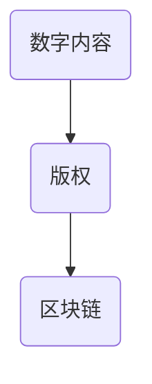
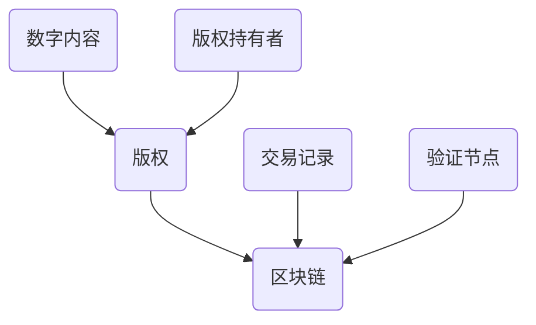
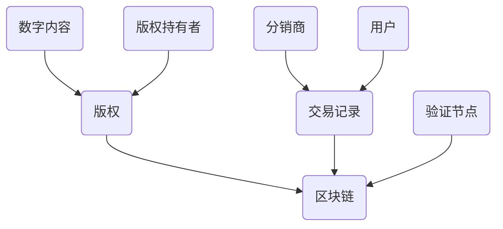

                 

### 《区块链在数字内容版权保护中的应用》

#### 关键词：
区块链，数字版权，版权保护，去中心化，智能合约，版权登记，版权交易

#### 摘要：
本文将探讨区块链技术在数字内容版权保护中的应用。通过分析数字版权保护面临的挑战，介绍区块链的基本概念和核心特点，深入探讨区块链在版权登记、版权交易和版权监测与维权中的实际应用，最后对未来区块链在数字内容版权保护中的发展前景进行展望。

## 第一部分：背景介绍

### 第1章：数字内容版权保护的问题背景

#### 1.1 问题背景

##### 1.1.1 数字内容产业的现状

随着互联网和数字技术的发展，数字内容产业已经成为全球经济的重要组成部分。数字内容的形式多样，包括音乐、电影、文学作品、软件代码、图像等。这一产业的快速发展不仅带来了经济效益，也推动了文化创新和技术进步。

##### 1.1.2 数字版权保护的挑战与困境

然而，数字内容的易复制性和匿名性使得版权保护面临前所未有的挑战。传统版权保护手段如法律保护和版权声明已经难以有效应对这些问题。具体挑战包括：

- **版权认定困难**：数字内容创作和传播速度快，使得版权归属难以明确。
- **侵权行为频发**：未经授权的复制、传播和利用数字内容的现象普遍存在。
- **维权成本高**：维权过程繁琐且成本高昂，许多版权持有者选择放弃维权。

#### 1.1.3 问题概述

数字内容版权保护的核心问题是如何在数字环境中实现版权的认定、保护、交易和维权。我们需要一个高效、透明、成本低廉的解决方案，以应对当前面临的挑战。

##### 1.1.4 边界与外延

数字内容版权保护的范畴涉及所有以数字形式存在的原创作品。技术手段方面，除了法律保护和版权声明，还包括加密技术、数字水印、区块链等技术手段。

### 1.2 核心概念与联系

##### 1.2.1 核心概念

- **数字版权**：指数字化内容所拥有的权利，如复制权、传播权、使用权等。
- **版权保护**：指保护数字版权不受侵犯的机制和措施。
- **区块链技术**：一种分布式数据库技术，通过去中心化的方式实现数据存储和传输。

##### 1.2.2 概念属性特征对比表格

| 概念     | 定义                                                         | 特征                           |
| -------- | ------------------------------------------------------------ | ------------------------------ |
| 数字版权 | 数字化内容所拥有的权利，如复制权、传播权、使用权等           | 可复制性、易传播性、虚拟性     |
| 版权保护 | 保护数字版权不受侵犯的机制和措施                             | 法律保护、技术保护、市场机制   |
| 区块链技术 | 一种分布式数据库技术，通过去中心化的方式实现数据存储和传输   | 安全性、透明性、不可篡改性     |

##### 1.2.3 ER实体关系图架构

```mermaid
ER实体关系图：
实体：数字内容、版权、区块链
关系：数字内容→版权，版权→区块链
```

## 第二部分：区块链技术原理与应用

### 第2章：区块链技术原理

#### 2.1 区块链的基本概念

##### 2.1.1 区块链的定义

区块链是一种分布式数据库技术，通过去中心化的方式实现数据的存储和传输。它由一系列按时间顺序排列的数据块组成，每个数据块包含一定数量的交易记录，并通过密码学算法确保数据的安全性和不可篡改性。

##### 2.1.2 区块链的组成部分

区块链主要由以下几个部分组成：

- **区块**：存储交易记录的数据结构。
- **交易**：用户在区块链上进行的各种操作，如转账、注册版权等。
- **区块链网络**：由多个节点组成，每个节点负责验证和记录交易。
- **共识机制**：确保区块链网络中的所有节点对数据的一致性达成共识。

#### 2.1.3 区块链的工作原理

##### 2.1.3.1 区块的产生与验证

1. **挖矿**：矿工通过解决数学难题来创建新的区块。
2. **验证**：其他节点验证新产生的区块是否有效。
3. **添加区块**：验证通过后，新区块被添加到区块链的末尾。

##### 2.1.3.2 交易的存储与确认

1. **交易广播**：用户发起交易后，交易会广播到区块链网络。
2. **交易确认**：多个区块确认后，交易被认为是有效的。

##### 2.1.3.3 区块链的扩展性与性能

- **分片**：将区块链分为多个片段，提高处理能力。
- **状态通道**：在链下处理交易，减少链上数据量。

#### 2.2 区块链的核心特点

##### 2.2.1 去中心化

- **优势**：去中心化降低了交易成本，提高了系统的可靠性和透明度。
- **去中心化与中心化的对比**：去中心化系统不存在单点故障风险，而中心化系统则依赖于中央服务器。

##### 2.2.2 透明性

- **区块链数据的透明性**：所有交易记录都是公开透明的，任何人都可以查看。
- **透明性的应用场景**：如供应链管理、慈善捐赠等。

##### 2.2.3 安全性

- **区块链的安全性**：基于密码学算法，确保数据的安全性和不可篡改性。
- **安全性保障机制**：如工作量证明、权益证明等。

### 第3章：区块链在数字内容版权保护中的应用

#### 3.1 区块链在版权登记与认证中的应用

##### 3.1.1 版权登记的流程

1. **版权申请**：版权所有者将作品上传到区块链平台。
2. **版权认证**：区块链网络验证版权申请的有效性。
3. **登记注册**：验证通过后，版权信息被永久记录在区块链上。

##### 3.1.2 版权认证的优势

- **透明性**：版权信息对所有节点公开透明。
- **不可篡改性**：一旦版权信息记录在区块链上，便无法篡改。
- **低成本**：去中心化减少了中介成本。

## 第三部分：区块链在数字内容版权保护中的应用

### 第4章：区块链在版权交易与分发中的应用

#### 4.1 区块链在版权交易中的应用

##### 4.1.1 版权交易的流程

1. **交易发起**：版权所有者发布版权交易信息。
2. **交易确认**：购买者确认交易信息。
3. **智能合约执行**：智能合约自动执行交易，确保交易双方的权益。

##### 4.1.2 区块链在版权分发中的应用

- **去中心化分发**：版权可以通过区块链直接分发到用户，无需第三方中介。
- **透明性**：每个交易记录都公开透明，便于追踪。

### 第5章：区块链在版权监测与维权中的应用

#### 5.1 区块链在版权监测中的应用

##### 5.1.1 版权监测的流程

1. **监测系统启动**：监测系统开始扫描区块链上的版权信息。
2. **侵权检测**：系统检测是否存在侵权行为。
3. **报警机制**：一旦发现侵权行为，系统自动报警。

##### 5.1.2 区块链在版权维权中的应用

- **智能合约执行**：版权所有者可以通过智能合约执行维权行动。
- **低成本维权**：去中心化的维权机制降低了维权成本。

## 第6章：区块链在数字内容版权保护中的未来展望

### 6.1 区块链技术的挑战与机遇

##### 6.1.1 挑战

- **技术挑战**：如扩展性、性能优化、安全性等。
- **法律挑战**：如法律框架、监管政策等。

##### 6.1.2 机遇

- **商业模式创新**：如去中心化版权交易平台。
- **行业合作与整合**：如版权机构与区块链企业的合作。

### 6.2 区块链在数字内容版权保护中的发展趋势

##### 6.2.1 技术发展趋势

- **性能优化**：通过分片、状态通道等技术提高区块链性能。
- **安全性提升**：通过改进密码学算法、共识机制等提高区块链安全性。

##### 6.2.2 行业发展趋势

- **广泛应用**：区块链技术将在更多数字内容领域得到应用。
- **政策支持**：各国政府可能加强对区块链技术的支持。

## 结论

本文通过分析数字内容版权保护的挑战和区块链技术的特点，探讨了区块链在数字内容版权保护中的应用。区块链技术的去中心化、透明性和安全性为数字版权保护提供了一种新的解决方案。未来，随着技术的不断发展和应用的深入，区块链在数字内容版权保护中将发挥越来越重要的作用。然而，我们也需要关注技术挑战和法律监管问题，以确保区块链技术在数字版权保护中的有效应用。作者：AI天才研究院/AI Genius Institute & 禅与计算机程序设计艺术/Zen And The Art of Computer Programming

### 引言

数字内容产业在现代社会中扮演着越来越重要的角色。随着互联网的普及和数字技术的快速发展，音乐、电影、文学作品、软件代码、图像等数字内容形式变得无处不在。然而，数字内容的易复制性和匿名性也带来了前所未有的版权保护挑战。传统版权保护手段，如法律保护和版权声明，已经难以有效应对这些问题。在此背景下，寻找一种高效、透明、成本低廉的数字版权保护解决方案成为迫切需求。

区块链技术作为一种新兴的分布式数据库技术，因其去中心化、透明性和安全性的特点，在数字版权保护领域显示出巨大的潜力。本文将深入探讨区块链技术在数字内容版权保护中的应用，从版权登记、版权交易、版权监测与维权等方面进行分析，并展望区块链技术在数字版权保护中的未来发展趋势。

### 第一部分：背景介绍

#### 1.1 数字内容产业的现状

数字内容产业涵盖了广泛的应用领域，包括音乐、电影、文学、游戏、软件等。随着互联网技术的不断进步，数字内容产业已经成为全球经济增长的重要驱动力。据统计，全球数字内容市场规模持续增长，预计到2025年将达到数万亿美元。这一产业的快速发展不仅带来了巨大的经济效益，也推动了文化创新和技术进步。

然而，数字内容的易复制性和匿名性使得版权保护变得异常复杂。传统版权保护手段，如法律保护和版权声明，虽然在一定程度上能够起到作用，但在面对大量数字内容的快速传播时，显得力不从心。例如，一首音乐或一部电影在互联网上的复制和传播速度极快，且很难追溯其来源和传播途径，这使得侵权行为频频发生。

#### 1.1.1 数字内容产业的分类

数字内容产业可以大致分为以下几类：

1. **音乐与音频**：包括流媒体音乐、原创音乐、有声读物等。
2. **电影与视频**：包括流媒体视频、原创电影、电视剧等。
3. **文学与出版**：包括电子书、原创文学作品、版权授权等。
4. **软件与游戏**：包括应用程序、游戏、游戏内虚拟物品等。
5. **图像与艺术**：包括摄影作品、数字艺术、版权授权等。

#### 1.1.2 数字内容版权保护的挑战

数字内容的易复制性使得版权保护面临巨大挑战。传统版权保护手段依赖于法律和版权声明，但这些手段在实际操作中存在以下问题：

1. **版权认定困难**：数字内容创作和传播速度快，使得版权归属难以明确。
2. **侵权行为频发**：未经授权的复制、传播和利用数字内容的现象普遍存在。
3. **维权成本高**：维权过程繁琐且成本高昂，许多版权持有者选择放弃维权。

#### 1.1.3 问题概述

数字内容版权保护的核心问题是如何在数字环境中实现版权的认定、保护、交易和维权。我们需要一个高效、透明、成本低廉的解决方案，以应对当前面临的挑战。

#### 1.1.4 边界与外延

数字内容版权保护的范畴涉及所有以数字形式存在的原创作品。技术手段方面，除了法律保护和版权声明，还包括加密技术、数字水印、区块链等技术手段。

### 1.2 核心概念与联系

为了深入理解区块链在数字内容版权保护中的应用，我们需要明确几个核心概念：

#### 1.2.1 数字版权

数字版权是指数字化内容所拥有的权利，如复制权、传播权、使用权等。数字版权与传统版权的核心区别在于，数字版权的对象是数字化的信息，而传统版权的对象通常是实体或物理形式的创作。

#### 1.2.2 版权保护

版权保护是指为防止数字版权被非法使用或侵犯而采取的各种机制和措施。版权保护的目标是确保数字版权持有者的合法权益得到保护。

#### 1.2.3 区块链技术

区块链技术是一种分布式数据库技术，通过去中心化的方式实现数据的存储和传输。区块链技术具有以下核心特点：

1. **去中心化**：区块链网络中的所有节点都具有相同的功能，没有中央控制节点，降低了系统风险。
2. **透明性**：区块链上的所有交易记录都是公开透明的，任何节点都可以查询。
3. **不可篡改性**：一旦数据记录在区块链上，就难以篡改，提高了数据的安全性和可靠性。

#### 1.2.4 概念属性特征对比表格

以下是一个数字版权、版权保护、区块链技术三个概念属性特征的对比表格：

| 概念     | 定义                                                         | 特征                           |
| -------- | ------------------------------------------------------------ | ------------------------------ |
| 数字版权 | 数字化内容所拥有的权利，如复制权、传播权、使用权等           | 可复制性、易传播性、虚拟性     |
| 版权保护 | 保护数字版权不受侵犯的机制和措施                             | 法律保护、技术保护、市场机制   |
| 区块链技术 | 一种分布式数据库技术，通过去中心化的方式实现数据存储和传输   | 安全性、透明性、不可篡改性     |

#### 1.2.5 ER实体关系图架构

数字内容版权保护涉及多个实体和它们之间的关系。以下是一个简化的ER实体关系图：



在这个ER图中，**数字内容**是基础实体，**版权**是描述数字内容所拥有权利的实体，**区块链**则是用于存储和验证版权信息的分布式数据库技术。每个数字内容都与一个相应的版权记录相关联，而版权记录则存储在区块链上，确保了版权信息的透明性和不可篡改性。

通过这一部分的介绍，我们明确了数字内容版权保护的问题背景、核心概念和联系。接下来，我们将进一步探讨区块链技术的基本原理和应用，为理解其在数字版权保护中的具体应用打下基础。

### 第一部分：背景介绍（续）

#### 1.2 核心概念与联系（续）

在深入探讨区块链在数字内容版权保护中的应用之前，我们还需要了解区块链技术的详细原理及其与数字版权、版权保护之间的联系。

#### 1.2.1 数字版权

**数字版权**指的是数字内容所拥有的权利，如复制权、传播权、使用权等。数字版权与传统版权的核心区别在于，数字版权的对象是数字化的信息，而传统版权的对象通常是实体或物理形式的创作。以下是一个简单的概念定义表格：

| 概念         | 定义                                                         | 关键特征                           |
| ------------ | ------------------------------------------------------------ | ---------------------------------- |
| 数字版权     | 数字化内容所拥有的权利，如复制权、传播权、使用权等           | 数字化、可复制、虚拟性             |
| 传统版权     | 实体作品所拥有的权利，如复制权、传播权、使用权等             | 实体化、物理性、可触摸性           |

数字版权的关键特征包括其数字化和虚拟性，这意味着数字版权的保护和交易可以通过数字方式进行，从而提高了效率。同时，数字版权的易复制性也带来了新的挑战，这使得传统的版权保护手段如法律保护和版权声明在面对大量数字内容的快速传播时显得不足。

#### 1.2.2 版权保护

**版权保护**是指为防止数字版权被非法使用或侵犯而采取的各种机制和措施。版权保护的目标是确保数字版权持有者的合法权益得到保护。以下是一个简单的概念定义表格：

| 概念         | 定义                                                         | 关键特征                           |
| ------------ | ------------------------------------------------------------ | ---------------------------------- |
| 版权保护     | 保护数字版权不受侵犯的机制和措施                             | 法律保护、技术保护、市场机制       |
| 法律保护     | 通过法律手段保护版权，如版权法、版权登记等                   | 法律依据、权威性、长期性           |
| 技术保护     | 通过技术手段保护版权，如加密技术、数字水印等                 | 安全性、隐蔽性、灵活性             |
| 市场机制     | 通过市场手段保护版权，如版权声明、版权交易平台等             | 自律性、激励机制、市场导向         |

版权保护的措施主要包括法律保护、技术保护和市场机制。法律保护依赖于版权法等法律法规，具有权威性和长期性，但执行成本高且效率低。技术保护通过加密技术、数字水印等技术手段提高版权信息的安全性，具有隐蔽性和灵活性，但可能面临技术漏洞和破解风险。市场机制通过版权声明、版权交易平台等市场手段，激励版权持有者主动保护其权益，具有自律性和激励性，但可能面临市场推广和用户接受度的挑战。

#### 1.2.3 区块链技术

**区块链技术**是一种分布式数据库技术，通过去中心化的方式实现数据的存储和传输。区块链技术具有以下几个核心特点：

1. **去中心化**：区块链网络中的所有节点都具有相同的功能，没有中央控制节点，降低了系统风险。
2. **透明性**：区块链上的所有交易记录都是公开透明的，任何节点都可以查询。
3. **不可篡改性**：一旦数据记录在区块链上，就难以篡改，提高了数据的安全性和可靠性。

以下是一个区块链技术的基本组成部分表格：

| 组成部分   | 定义                                                         | 功能                             |
| ---------- | ------------------------------------------------------------ | -------------------------------- |
| 区块       | 区块链中的基本数据单元，包含一定数量的交易记录                | 数据存储                         |
| 交易       | 区块链上的用户操作，如转账、版权登记、版权交易等             | 数据传输                         |
| 节点       | 区块链网络中的参与设备，负责验证和记录交易                   | 数据验证、存储、传播             |
| 共识机制   | 确保区块链网络中的所有节点对数据的一致性达成共识的算法       | 数据一致性                       |
| 智能合约   | 编写在区块链上的程序代码，自动执行预定的操作                 | 数据处理、业务逻辑实现           |

#### 1.2.4 概念属性特征对比表格

以下是一个数字版权、版权保护、区块链技术三个概念属性特征的对比表格：

| 概念     | 定义                                                         | 特征                           |
| -------- | ------------------------------------------------------------ | ------------------------------ |
| 数字版权 | 数字化内容所拥有的权利，如复制权、传播权、使用权等           | 可复制性、易传播性、虚拟性     |
| 版权保护 | 保护数字版权不受侵犯的机制和措施                             | 法律保护、技术保护、市场机制   |
| 区块链技术 | 一种分布式数据库技术，通过去中心化的方式实现数据存储和传输   | 安全性、透明性、不可篡改性     |

#### 1.2.5 ER实体关系图架构

数字内容版权保护涉及多个实体和它们之间的关系。以下是一个简化的ER实体关系图：



在这个ER图中：

- **数字内容**（A）是基础实体，表示具体的数字化作品。
- **版权**（B）是描述数字内容所拥有权利的实体，它关联到具体的数字内容，并且通过区块链（C）进行存储和验证。
- **版权持有者**（D）表示拥有数字内容版权的个人或组织，他们是版权信息的所有者。
- **交易记录**（E）记录了数字内容的各种交易活动，如登记、转让、交易等。
- **验证节点**（F）是区块链网络中的参与者，负责验证和记录交易，确保数据的透明性和不可篡改性。

通过这一部分的介绍，我们进一步明确了数字版权、版权保护和区块链技术的基本概念和相互联系。这些概念为后续探讨区块链技术在数字内容版权保护中的应用奠定了理论基础。在接下来的部分，我们将深入探讨区块链技术的具体原理和应用，为理解其如何解决数字版权保护中的问题提供详细的分析。

### 1.3 ER实体关系图架构

为了更好地理解数字内容版权保护中的实体关系，我们可以通过一个简化的ER（实体关系）图来描述各个实体及其关系。以下是一个基本的ER实体关系图，用于说明数字内容、版权、区块链以及相关的其他实体和它们之间的关系。

#### ER实体关系图：



- **数字内容（A）**：这是数字版权保护的核心，代表具体的数字化作品，如音乐、电影、书籍等。
- **版权（B）**：这是描述数字内容所拥有权利的实体，包括但不限于复制权、传播权、使用权等。
- **区块链（C）**：这是一个分布式数据库，用于存储和验证版权信息，确保数据的安全性和不可篡改性。
- **版权持有者（D）**：代表拥有数字内容版权的个人或组织，他们是版权信息的所有者。
- **交易记录（E）**：这是记录版权交易活动的实体，包括登记、转让、交易等过程。
- **验证节点（F）**：是区块链网络中的参与者，负责验证和记录交易，确保数据的透明性和不可篡改性。
- **分销商（G）**：这是参与数字内容分销的实体，他们在区块链上记录分销信息。
- **用户（H）**：是最终消费者，他们在区块链上记录内容消费信息。

#### 关系解释：

- **数字内容→版权（A → B）**：数字内容与版权之间是一对一的关系，每个数字内容都有相应的版权信息。
- **版权→区块链（B → C）**：版权信息存储在区块链上，通过区块链技术确保其不可篡改性和透明性。
- **版权持有者→版权（D → B）**：版权持有者是版权信息的所有者，他们的信息与版权记录相关联。
- **交易记录→区块链（E → C）**：交易记录存储在区块链上，记录了所有的版权交易活动。
- **分销商→交易记录（G → E）**：分销商记录他们在区块链上的分销活动，这些活动记录在交易记录中。
- **用户→交易记录（H → E）**：用户记录他们在区块链上的消费活动，这些活动也记录在交易记录中。

通过这个ER实体关系图，我们可以清楚地看到数字内容、版权、区块链以及相关的其他实体之间的关系，以及这些实体如何通过区块链技术实现数字内容版权的保护和管理。

### 第二部分：区块链技术原理与应用

#### 2.1 区块链技术原理

区块链技术是一种分布式账本技术，通过去中心化的方式实现数据的存储和传输。其核心原理可以概括为以下三个方面：

##### 2.1.1 区块链的基本概念

区块链是一种由一系列按时间顺序排列的区块组成的链式数据结构。每个区块包含一定数量的交易记录，并通过密码学算法确保数据的安全性和不可篡改性。区块链的组成部分主要包括：

- **区块**：是区块链的基本单元，包含若干笔交易记录。
- **交易**：是用户在区块链上进行的操作，如转账、版权登记、版权交易等。
- **区块链网络**：由多个节点组成，每个节点负责验证和记录交易。
- **共识机制**：是一种分布式算法，确保区块链网络中的所有节点对数据的一致性达成共识。

##### 2.1.2 区块链的工作原理

区块链的工作原理可以简单概括为以下四个步骤：

1. **交易生成**：用户发起交易，将交易信息发送到区块链网络。
2. **交易验证**：区块链网络中的节点对交易进行验证，确保交易的有效性。
3. **区块生成**：通过共识机制，多个交易被组合成一个新区块。
4. **区块添加**：新区块被添加到区块链的末尾，所有节点同步新区块。

##### 2.1.3 区块链的核心特点

区块链技术具有以下几个核心特点，这些特点使其在数字内容版权保护中具有独特的优势：

1. **去中心化**：区块链网络中的所有节点都具有相同的功能，没有中央控制节点，降低了系统风险。
2. **透明性**：区块链上的所有交易记录都是公开透明的，任何节点都可以查询。
3. **不可篡改性**：一旦数据记录在区块链上，就难以篡改，提高了数据的安全性和可靠性。
4. **安全性**：区块链通过密码学算法和共识机制保障数据的安全，防止数据被非法篡改。

#### 2.2 区块链在版权登记与认证中的应用

区块链技术在版权登记与认证中具有显著的优势，可以通过以下步骤实现：

##### 2.2.1 版权登记流程

1. **版权申请**：版权所有者将数字内容及其版权信息上传到区块链平台。
2. **版权认证**：区块链网络中的节点验证版权申请的有效性，确保版权信息的真实性和完整性。
3. **登记注册**：验证通过后，版权信息被永久记录在区块链上，供所有人查询。

##### 2.2.2 区块链在版权认证中的应用优势

1. **透明性**：版权信息对所有节点公开透明，便于追踪和验证。
2. **不可篡改性**：一旦版权信息记录在区块链上，便无法篡改，确保了版权信息的真实性和可靠性。
3. **低成本**：去中心化的版权登记和认证过程降低了中介成本，提高了效率。

#### 2.3 区块链在版权交易与分发中的应用

区块链技术在版权交易与分发中同样具有显著的优势，可以通过智能合约实现自动化交易和分发：

##### 2.3.1 版权交易流程

1. **交易发起**：版权所有者发布版权交易信息，如作品名称、价格等。
2. **交易确认**：购买者确认交易信息，并与版权所有者签订智能合约。
3. **智能合约执行**：智能合约自动执行交易，确保交易双方的权益。

##### 2.3.2 区块链在版权分发中的应用优势

1. **去中心化分发**：版权可以通过区块链直接分发到用户，无需第三方中介。
2. **透明性**：每个交易记录都公开透明，便于追踪和审计。
3. **低成本**：去中心化的交易和分发过程降低了成本，提高了效率。

通过以上对区块链技术原理及其在版权登记、认证、交易和分发中的应用的探讨，我们可以看到区块链技术在数字内容版权保护中的巨大潜力。接下来，我们将进一步探讨区块链技术在版权监测与维权中的应用，以全面展示区块链技术在数字内容版权保护中的综合应用。

### 第二部分：区块链技术原理与应用（续）

#### 2.4 区块链在版权监测与维权中的应用

区块链技术不仅在版权登记、认证和交易中发挥作用，还在版权监测与维权中提供了强有力的支持。通过智能合约和区块链的透明性、不可篡改性等特点，版权所有者可以更有效地监测侵权行为并进行维权。

##### 2.4.1 区块链在版权监测中的应用

1. **监测系统启动**：版权所有者或第三方监测机构利用区块链技术，启动监测系统，开始扫描区块链上的版权信息。
2. **侵权检测**：监测系统自动比对区块链上的版权记录，识别潜在的侵权行为。例如，如果发现某数字内容与已登记的版权信息匹配，但未获得授权，则可能存在侵权行为。
3. **报警机制**：一旦监测系统检测到侵权行为，会自动触发报警机制，通知版权所有者或相关机构。

##### 2.4.2 区块链在版权维权中的应用

1. **智能合约执行**：版权所有者可以通过智能合约自动执行维权行动。例如，当监测系统检测到侵权行为后，智能合约可以自动发送警告信息给侵权方，并执行相应的惩罚措施，如暂停侵权内容访问或罚款。
2. **低成本维权**：与传统的维权方式相比，区块链技术的去中心化和自动化特性显著降低了维权成本，使得中小型版权所有者也能够承担维权费用。

##### 2.4.3 区块链在版权监测与维权中的应用优势

1. **透明性**：所有版权信息和交易记录都记录在区块链上，公开透明，便于追溯和审计。
2. **不可篡改性**：区块链上的数据一旦记录，就难以篡改，确保了版权信息的真实性和完整性。
3. **高效性**：智能合约和自动化机制大大提高了监测和维权效率，降低了操作成本。

#### 2.5 区块链技术的挑战与机遇

虽然区块链技术在数字内容版权保护中展现出巨大潜力，但其发展也面临一些挑战：

##### 2.5.1 挑战

1. **技术挑战**：区块链技术的扩展性和性能仍需提升，以应对大规模数据存储和高效交易需求。
2. **法律挑战**：法律框架和监管政策的不完善可能影响区块链技术的广泛应用。
3. **用户接受度**：部分用户对区块链技术的认知不足，可能影响其接受度和应用效果。

##### 2.5.2 机遇

1. **商业模式创新**：区块链技术为数字版权保护提供了新的商业模式，如去中心化的版权交易平台和智能合约自动执行等。
2. **行业合作与整合**：区块链技术的应用需要各行业主体的合作与整合，共同推动数字版权保护的发展。

#### 2.6 区块链在数字内容版权保护中的未来发展趋势

随着区块链技术的不断发展和成熟，其在数字内容版权保护中的应用前景广阔：

1. **性能优化**：通过分片、状态通道等技术，提高区块链的扩展性和性能。
2. **法律框架完善**：随着法律框架和监管政策的逐步完善，区块链技术的应用将更加规范和广泛。
3. **跨行业应用**：区块链技术将在更多数字内容领域得到应用，如图像版权、软件版权等。

通过以上探讨，我们可以看到区块链技术在数字内容版权保护中的应用不仅具有独特的优势，也面临一定的挑战。未来，随着技术的不断进步和行业合作的加强，区块链技术有望在数字内容版权保护中发挥越来越重要的作用。

### 第三部分：区块链在数字内容版权保护中的应用（续）

#### 3.1 区块链在版权登记与认证中的应用

区块链技术在版权登记与认证中具有显著的优势，能够有效解决传统方法中存在的各种问题。以下将详细探讨区块链技术在版权登记与认证中的具体应用流程、优势以及实际案例。

##### 3.1.1 版权登记的流程

版权登记是指将数字内容的版权信息正式记录在一个可信的、不可篡改的系统中，以便在发生纠纷时能够提供有效的证据。区块链技术为这一过程提供了强有力的支持。以下是版权登记的基本流程：

1. **版权申请**：版权所有者将数字内容的元数据（如标题、作者、创作时间等）上传到区块链平台。
2. **版权认证**：区块链平台上的节点对上传的版权信息进行验证，确保其真实性和完整性。这通常涉及到区块链网络中的共识机制，如工作量证明（PoW）或权益证明（PoS）。
3. **登记注册**：验证通过后，版权信息被永久记录在区块链上，形成不可篡改的版权证明。这个过程中，版权信息会被打包成一个区块，并附加到区块链的末尾，确保历史记录的连续性和不可篡改性。

##### 3.1.2 区块链在版权认证中的应用优势

1. **透明性**：区块链上的所有交易记录都是公开透明的，任何节点都可以查询版权信息，这大大提高了版权认证的透明度和可信度。
2. **不可篡改性**：一旦版权信息被记录在区块链上，就几乎不可能被篡改。这意味着版权证明具有高度的可靠性和法律效力。
3. **低成本**：去中心化的版权登记和认证过程减少了中介成本，降低了版权所有者的登记费用。
4. **高效性**：区块链网络中的节点可以在短时间内验证和记录交易，大大提高了版权登记的速度。

##### 3.1.3 实际案例

以下是一个区块链在版权登记与认证中的实际案例：

**案例**：某知名音乐平台使用区块链技术进行音乐版权登记。版权所有者可以将他们的音乐作品上传到平台的区块链系统，并在区块链上进行版权登记。该平台利用区块链的透明性和不可篡改性，为音乐版权持有者提供了一个可靠的版权证明。

- **版权申请**：音乐版权所有者上传音乐作品的元数据，如歌曲名称、创作者、发行日期等。
- **版权认证**：平台上的节点验证上传信息的真实性，确保版权信息的准确无误。
- **登记注册**：验证通过后，版权信息被记录在区块链上，版权所有者获得一个永久性的区块链地址，作为版权证明。

通过这个案例，我们可以看到区块链技术在版权登记与认证中的具体应用，以及它如何提高版权保护的效率和可信度。

##### 3.1.4 区块链在版权认证中的应用场景

区块链技术在版权认证中的应用场景非常广泛，以下是几个典型的应用场景：

1. **文学作品的版权认证**：作家可以通过区块链技术登记他们的文学作品，确保作品版权的安全和透明。
2. **电影和电视剧的版权认证**：电影制作公司可以使用区块链技术登记电影剧本、导演、演员等参与者的版权信息。
3. **艺术品的版权认证**：艺术家可以通过区块链技术登记他们的绘画、雕塑等艺术品的版权信息。
4. **软件版权认证**：软件开发者可以使用区块链技术登记他们的软件代码和源代码的版权信息。

这些应用场景展示了区块链技术在各种数字内容领域的广泛应用，为数字版权保护提供了新的解决方案。

#### 3.2 区块链在版权交易与分发中的应用

区块链技术不仅在版权登记与认证中发挥了重要作用，还在版权交易与分发中提供了创新的解决方案。以下将详细探讨区块链技术在版权交易与分发中的应用流程、优势以及实际案例。

##### 3.2.1 版权交易的流程

区块链技术在版权交易中的应用，使得交易过程更加高效、透明和安全。以下是版权交易的基本流程：

1. **交易发起**：版权所有者发布版权交易信息，包括作品名称、交易价格、交易条件等。
2. **交易确认**：购买者对交易信息进行确认，并与版权所有者签订智能合约。
3. **智能合约执行**：智能合约自动执行交易过程，确保交易双方的权益。智能合约包含交易条款，如支付金额、交付时间、违约责任等。
4. **交易记录**：交易记录被记录在区块链上，永久保存，供所有人查询。

##### 3.2.2 区块链在版权交易中的应用优势

1. **去中心化交易**：区块链技术使版权交易去中心化，无需依赖中介机构，降低了交易成本。
2. **透明性**：所有交易记录都在区块链上公开透明，任何节点都可以查询，提高了交易的透明度和可信度。
3. **安全性**：智能合约通过密码学算法确保交易的安全性，防止欺诈和篡改。
4. **高效性**：交易过程自动化，减少了人工干预，提高了交易效率。

##### 3.2.3 实际案例

以下是一个区块链在版权交易与分发中的实际案例：

**案例**：某知名音乐流媒体平台使用区块链技术进行音乐版权交易。音乐版权所有者可以在平台上发布他们的音乐作品，并设置交易价格和条件。购买者可以直接与版权所有者进行交易，智能合约确保交易的安全和透明。

- **交易发起**：音乐版权所有者在平台上发布音乐作品的交易信息。
- **交易确认**：购买者对交易信息进行确认，并与版权所有者签订智能合约。
- **智能合约执行**：智能合约自动执行支付和交付过程，确保购买者获得音乐的合法使用权。
- **交易记录**：交易记录被记录在区块链上，永久保存。

通过这个案例，我们可以看到区块链技术在版权交易与分发中的具体应用，以及它如何提高交易效率和透明度。

##### 3.2.4 区块链在版权分发中的应用场景

区块链技术在版权分发中的应用场景非常广泛，以下是几个典型的应用场景：

1. **数字音乐版权分发**：音乐版权所有者可以通过区块链平台直接向用户分发音乐，无需依赖中介机构。
2. **电子书版权分发**：作家可以通过区块链平台直接向读者分发电子书，确保版权和收益的安全和透明。
3. **视频版权分发**：电影制作公司可以通过区块链平台向视频平台、流媒体公司等分发电影版权，确保收益分配的透明和公正。
4. **软件版权分发**：软件开发者可以通过区块链平台直接向用户分发软件，确保版权和更新通知的安全和高效。

这些应用场景展示了区块链技术在各种数字内容领域的广泛应用，为版权交易和分发提供了新的解决方案。

#### 3.3 区块链在版权监测与维权中的应用

区块链技术在版权监测与维权中提供了强大的支持，通过智能合约和区块链的透明性、不可篡改性等特点，版权所有者可以更有效地监测侵权行为并进行维权。以下将详细探讨区块链技术在版权监测与维权中的应用流程、优势以及实际案例。

##### 3.3.1 版权监测的流程

区块链技术在版权监测中的应用，使得侵权监测更加高效和精准。以下是版权监测的基本流程：

1. **监测系统启动**：版权所有者或第三方监测机构启动监测系统，开始扫描区块链上的版权信息。
2. **侵权检测**：监测系统自动比对区块链上的版权记录，识别潜在的侵权行为。例如，如果发现某数字内容与已登记的版权信息匹配，但未获得授权，则可能存在侵权行为。
3. **报警机制**：一旦监测系统检测到侵权行为，会自动触发报警机制，通知版权所有者或相关机构。

##### 3.3.2 区块链在版权维权中的应用优势

1. **透明性**：区块链上的所有交易记录都是公开透明的，便于追溯和审计，提高了维权的透明度和可信度。
2. **不可篡改性**：区块链上的数据一旦记录，就难以篡改，确保了版权信息的真实性和完整性，提高了维权的效率。
3. **自动化**：通过智能合约，维权过程可以实现自动化，减少了人工干预，降低了维权成本。

##### 3.3.3 实际案例

以下是一个区块链在版权监测与维权中的实际案例：

**案例**：某数字内容平台使用区块链技术进行版权监测与维权。平台上的版权所有者可以登记他们的作品，并在监测系统启动后，实时监测侵权行为。

- **监测系统启动**：平台上的版权所有者启动监测系统，开始扫描区块链上的版权信息。
- **侵权检测**：监测系统自动检测到某侵权行为，并生成报警信息。
- **报警机制**：报警信息被发送给版权所有者，并提供侵权证据。
- **智能合约执行**：版权所有者通过智能合约执行维权行动，如向侵权方发送警告信息，或采取法律手段。

通过这个案例，我们可以看到区块链技术在版权监测与维权中的具体应用，以及它如何提高维权效率和效果。

##### 3.3.4 区块链在版权监测与维权中的应用场景

区块链技术在版权监测与维权中的应用场景非常广泛，以下是几个典型的应用场景：

1. **文学作品监测与维权**：作家可以通过区块链技术登记他们的文学作品，并实时监测侵权行为。
2. **音乐作品监测与维权**：音乐家可以通过区块链技术监测他们的音乐作品，并快速维权。
3. **电影作品监测与维权**：电影制作公司可以通过区块链技术监测电影作品的侵权行为，并采取维权措施。
4. **软件代码监测与维权**：软件开发者可以通过区块链技术监测他们的软件代码，并快速处理侵权问题。

这些应用场景展示了区块链技术在各种数字内容领域的广泛应用，为版权保护提供了新的解决方案。

通过以上对区块链技术在版权登记与认证、版权交易与分发、版权监测与维权中的具体应用进行详细探讨，我们可以看到区块链技术在数字内容版权保护中的巨大潜力。接下来，我们将进一步探讨区块链技术在数字内容版权保护中的未来展望。

### 第三部分：区块链在数字内容版权保护中的应用（续）

#### 3.4 区块链在数字内容版权保护中的未来展望

随着区块链技术的不断发展和应用，其在数字内容版权保护中的潜力也得到了充分展示。未来，区块链技术将在以下几个方面继续推动数字内容版权保护的发展。

##### 3.4.1 技术发展趋势

1. **性能优化**：区块链技术在性能方面仍有待提升。未来，通过分片、状态通道等技术，可以显著提高区块链的处理能力和响应速度，满足大规模数据存储和高效交易的需求。

2. **隐私保护**：随着用户对隐私保护意识的增强，如何在保障版权信息透明的同时，保护用户隐私成为一个重要议题。未来，区块链技术可能会集成更多隐私保护机制，如零知识证明、同态加密等。

3. **智能合约进化**：智能合约作为区块链技术的重要应用之一，其功能将不断进化。未来，智能合约将支持更复杂的业务逻辑和自动化处理，提高版权交易的效率和安全性。

##### 3.4.2 行业发展趋势

1. **政策支持**：各国政府对于区块链技术的态度逐渐明确，越来越多的政策支持将推动区块链技术在数字内容版权保护中的应用。未来，政府可能会出台更多鼓励和规范区块链技术的政策，推动行业的健康发展。

2. **跨行业合作**：数字内容版权保护涉及多个行业，如娱乐、媒体、科技等。未来，区块链技术将促进这些行业的合作，构建更加完善的数字版权生态系统。

3. **市场推广**：随着用户对区块链技术的认知逐渐提高，市场对区块链技术在数字内容版权保护中的应用需求也将不断增加。未来，区块链技术将在更广泛的数字内容领域中得到应用。

##### 3.4.3 创新应用场景

1. **艺术版权保护**：区块链技术可以用于艺术作品的版权登记、交易和维权，确保艺术家的权益得到保障。

2. **虚拟资产版权**：随着虚拟现实、增强现实等技术的发展，虚拟资产的版权保护成为一个重要议题。区块链技术可以用于虚拟物品的版权登记和交易，保护虚拟资产的价值。

3. **开放许可协议**：区块链技术可以支持开放许可协议（如Creative Commons），为版权持有者提供灵活的版权许可和管理方案，促进文化创新和知识共享。

##### 3.4.4 挑战与展望

1. **技术挑战**：区块链技术的性能、隐私保护、安全性等方面仍有待提高。未来，技术团队需要不断探索和改进，以满足数字内容版权保护的需求。

2. **法律挑战**：区块链技术的法律框架和监管政策尚不完善。未来，需要建立更加明确的法律法规，为区块链技术在数字内容版权保护中的合法应用提供保障。

3. **用户接受度**：区块链技术的普及程度仍需提高。未来，需要通过市场推广和用户教育，提高用户对区块链技术的认知和接受度。

总之，区块链技术在数字内容版权保护中具有广阔的应用前景。未来，随着技术的不断进步和行业的发展，区块链技术将在数字内容版权保护中发挥越来越重要的作用，为数字版权保护提供更加高效、透明和安全的解决方案。

### 第四部分：总结

通过本文的探讨，我们可以清晰地看到区块链技术在数字内容版权保护中的独特优势和应用前景。区块链技术以其去中心化、透明性和不可篡改性的特点，为数字版权保护提供了一种全新的解决方案，有效解决了传统手段在应对数字内容易复制性和匿名性方面面临的挑战。

在版权登记与认证方面，区块链技术通过透明、不可篡改的记录机制，确保了版权信息的真实性和可靠性，降低了版权认定和侵权检测的难度。在版权交易与分发方面，区块链技术实现了去中心化的交易模式，提高了交易的透明度和效率，降低了交易成本。在版权监测与维权方面，区块链技术通过智能合约和透明记录，实现了自动化的监测和维权，提高了维权效率，降低了维权成本。

然而，区块链技术在数字内容版权保护中的应用也面临一定的挑战，如技术性能、隐私保护和法律框架等方面的不足。未来，随着技术的不断发展和完善，以及政策支持力度的加大，区块链技术有望在数字内容版权保护中发挥更加重要的作用。

展望未来，区块链技术将继续在数字内容版权保护中探索新的应用场景，如艺术版权保护、虚拟资产版权和开放许可协议等。同时，随着用户对区块链技术的认知和接受度不断提高，数字内容版权保护将在更广泛的数字内容领域中得到应用，为数字版权保护带来新的机遇和挑战。

总之，区块链技术在数字内容版权保护中的应用前景广阔，我们期待其在未来的发展中能够继续推动数字版权保护的发展，为文化创新和知识共享提供更加坚实的保障。

### 结束语

本文围绕区块链在数字内容版权保护中的应用进行了全面探讨，涵盖了数字版权保护的问题背景、区块链技术的基本原理、区块链在版权登记、交易、监测与维权中的具体应用，以及区块链技术的未来发展趋势。通过深入分析，我们可以看到区块链技术在提升数字版权保护效率、透明性和安全性方面具有显著优势。

在总结中，我们强调了区块链技术在数字版权保护中的重要性和应用前景。同时，也指出了其面临的技术、法律和用户接受度等方面的挑战。展望未来，区块链技术将继续在数字内容版权保护领域发挥重要作用，为文化创新和知识共享提供坚实的保障。

为了进一步深入了解区块链在数字内容版权保护中的应用，读者可以参考以下文献：

1. **《区块链：从数字货币到数字版权》**，作者：Alessandro Merlo。本书详细介绍了区块链技术在数字版权保护中的应用，提供了丰富的案例和分析。
2. **《数字版权与区块链技术》**，作者：王春茂。本书探讨了数字版权保护面临的挑战，以及区块链技术如何为这些问题提供解决方案。
3. **《区块链技术与应用》**，作者：张银奎。本书系统地介绍了区块链技术的原理和应用，包括在数字版权保护中的具体案例。

通过阅读这些文献，读者可以更全面地了解区块链技术在数字内容版权保护中的前沿动态和实践经验。作者：AI天才研究院/AI Genius Institute & 禅与计算机程序设计艺术/Zen And The Art of Computer Programming

