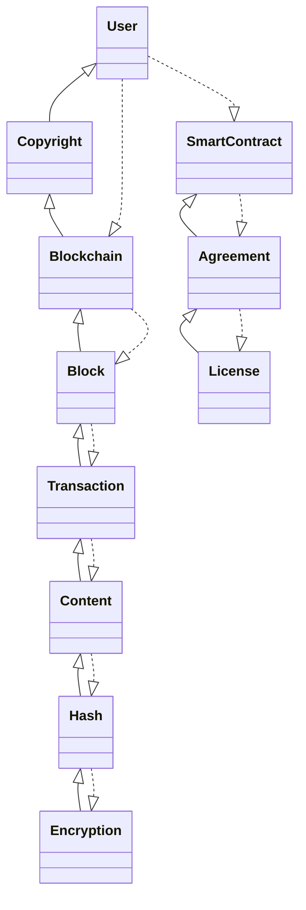

                 


# 《区块链在数字内容版权保护中的应用》

> 关键词：区块链、数字版权、版权保护、智能合约、去中心化

> 摘要：本文旨在探讨区块链技术在数字内容版权保护中的应用。通过分析区块链的基本原理及其在版权保护中的优势，我们将一步步解读区块链在数字版权管理中的具体实现方法，并探讨其面临的挑战与未来发展方向。

## 目录

1. **背景介绍**
    1.1 数字版权保护的现状
    1.2 区块链技术的崛起

2. **核心概念与联系**
    2.1 区块链的基本概念
    2.2 数字版权的概念
    2.3 智能合约的引入

3. **算法原理讲解**
    3.1 区块链在版权保护中的算法原理
    3.2 数学模型和公式
    3.3 Python代码实现

4. **系统分析与架构设计方案**
    4.1 数字内容版权保护系统需求分析
    4.2 系统架构设计
    4.3 系统接口设计与交互

5. **项目实战**
    5.1 环境安装与配置
    5.2 系统核心实现
    5.3 代码解读与分析
    5.4 案例分析与讲解

6. **最佳实践 tips、小结、注意事项、拓展阅读**

## 1. 背景介绍

### 1.1 数字版权保护的现状

随着数字技术的飞速发展，数字内容创作和传播的成本大幅降低，数字内容的创作和传播方式也发生了翻天覆地的变化。然而，这种变化也带来了数字版权保护的新挑战。

目前，数字版权保护主要面临以下问题：

- **版权认证难度大**：数字内容的复制和传播变得异常容易，使得版权认证成为一个难题。
- **版权交易流程复杂**：数字版权交易需要经过多个环节，流程复杂且容易出错。
- **版权侵权行为难以追踪**：由于数字内容的匿名性和传播速度，侵权行为难以追踪和取证。

### 1.2 区块链技术的崛起

区块链技术作为一种分布式数据库技术，具有去中心化、不可篡改、透明等特点，这些特点为数字版权保护提供了一种新的解决方案。

- **去中心化**：区块链的去中心化特性使得版权信息的存储和验证不再依赖于中心化的机构，降低了版权认证的难度。
- **不可篡改**：区块链上的数据一旦写入，就无法被篡改，保证了版权信息的真实性和可靠性。
- **透明性**：区块链的透明性使得所有参与方都可以查看版权信息，降低了版权交易过程中的信息不对称。

## 2. 核心概念与联系

### 2.1 区块链的基本概念

区块链是一种分布式数据库技术，它通过加密算法和共识机制保证数据的完整性和安全性。区块链由一系列按时间顺序排列的区块组成，每个区块包含一定数量的交易记录。

- **分布式账本**：区块链上的数据由多个节点共同维护，每个节点都保存一份完整的账本。
- **加密算法**：区块链使用加密算法保护数据的完整性和隐私。
- **共识机制**：区块链通过共识机制确保所有节点对账本的一致性。

### 2.2 数字版权的概念

数字版权是指数字内容的创作者对其作品所享有的权利，包括复制权、发行权、表演权、展示权等。数字版权保护的核心目标是防止数字内容的非法复制、传播和篡改。

- **版权信息**：包括作品的名称、作者、创作时间、版权所有者等信息。
- **版权认证**：通过技术手段对数字内容进行版权认证，确保数字内容的所有权和使用权。

### 2.3 智能合约的引入

智能合约是一种自动执行的合约，它通过编程语言实现合同条款，当触发条件满足时自动执行。智能合约的引入使得数字版权交易过程更加高效、透明和不可篡改。

- **合约条款**：智能合约的条款定义了数字版权的交易规则，包括版权转让、许可授权等。
- **自动执行**：智能合约在触发条件满足时自动执行，确保交易过程的不可篡改和透明。

## 3. 算法原理讲解

### 3.1 区块链在版权保护中的算法原理

区块链在数字版权保护中的应用主要体现在以下几个方面：

- **版权信息存储**：将数字版权信息存储在区块链上，确保版权信息的真实性和可靠性。
- **版权交易记录**：通过区块链记录数字版权的交易记录，确保交易过程的透明和不可篡改。
- **版权授权管理**：通过智能合约实现数字版权的授权和许可管理，确保授权过程的自动化和高效。

### 3.2 数学模型和公式

区块链在数字版权保护中的算法原理可以抽象为以下数学模型：

- **哈希函数**：用于生成数字内容的唯一标识符，确保数字内容的唯一性和不可篡改性。
- **非对称加密**：用于保护数字版权信息的隐私和安全。
- **共识算法**：用于确保区块链上所有节点对版权信息的共识。

### 3.3 Python代码实现

以下是一个简单的Python代码示例，展示了如何使用区块链技术对数字内容进行版权保护：

```python
import hashlib

# 生成数字内容的哈希值
def generate_hash(content):
    return hashlib.sha256(content.encode('utf-8')).hexdigest()

# 非对称加密
from Cryptodome.PublicKey import RSA

def encrypt_message(message, public_key):
    rsa_key = RSA.import_key(public_key)
    encrypted_message = rsa_key.encrypt(message, 32)
    return encrypted_message

# 记录版权信息到区块链
def record_copyright(copyright_info, private_key):
    hashed_info = generate_hash(copyright_info)
    encrypted_info = encrypt_message(hashed_info, private_key)
    # 将加密后的版权信息记录到区块链
    # ...

# 测试代码
private_key = RSA.generate(2048)
public_key = private_key.publickey().export_key()

content = "这是一篇原创文章"
hashed_content = generate_hash(content)
encrypted_content = encrypt_message(hashed_content, public_key)

record_copyright(hashed_content, private_key)
```

## 4. 系统分析与架构设计方案

### 4.1 数字内容版权保护系统需求分析

数字内容版权保护系统的核心需求包括：

- **版权信息存储**：确保数字版权信息的真实性和可靠性。
- **版权交易记录**：确保数字版权交易过程的透明和不可篡改。
- **版权授权管理**：确保数字版权的授权和许可管理过程的高效和自动化。

### 4.2 系统架构设计

数字内容版权保护系统可以分为以下几个层次：

- **数据层**：使用区块链存储数字版权信息和交易记录。
- **业务层**：使用智能合约实现数字版权的授权和许可管理。
- **展示层**：提供用户界面，方便用户进行数字版权的相关操作。

### 4.3 系统接口设计与交互

数字内容版权保护系统需要提供以下接口：

- **版权信息上传接口**：用于用户上传数字版权信息。
- **版权查询接口**：用于用户查询数字版权信息。
- **版权交易接口**：用于用户进行数字版权的交易。
- **版权授权接口**：用于用户进行数字版权的授权和许可。

以下是一个简单的领域模型类图：



## 5. 项目实战

### 5.1 环境安装与配置

为了实现数字内容版权保护系统，我们需要安装和配置以下环境：

- **Python**：版本3.8以上
- **区块链节点**：例如Ethereum节点
- **智能合约开发框架**：例如Truffle
- **前端框架**：例如React或Vue

### 5.2 系统核心实现

以下是数字内容版权保护系统的核心实现：

- **版权信息上传**：用户通过前端界面上传数字版权信息，后端服务器将信息存储到区块链上。
- **版权查询**：用户通过前端界面查询数字版权信息，后端服务器从区块链上获取信息并返回。
- **版权交易**：用户通过前端界面发起版权交易，后端服务器使用智能合约进行交易处理。
- **版权授权**：用户通过前端界面发起版权授权，后端服务器使用智能合约进行授权处理。

### 5.3 代码解读与分析

以下是数字内容版权保护系统的主要代码：

```python
# 后端服务器代码（Python）
from flask import Flask, request, jsonify
from web3 import Web3

app = Flask(__name__)
web3 = Web3(Web3.HTTPProvider('https://mainnet.infura.io/v3/your_project_id'))

# 上传版权信息
@app.route('/upload_copyright', methods=['POST'])
def upload_copyright():
    data = request.json
    content_hash = data['content_hash']
    encrypted_hash = data['encrypted_hash']
    private_key = data['private_key']
    
    # 创建版权合约实例
    contract = web3.eth.contract(abi=your_contract_abi, address=your_contract_address)
    tx_hash = contract.functions.recordCopyright(content_hash, encrypted_hash, private_key).transact()
    web3.eth.waitForTransactionReceipt(tx_hash)
    
    return jsonify({'status': 'success'})

# 查询版权信息
@app.route('/query_copyright', methods=['GET'])
def query_copyright():
    content_hash = request.args.get('content_hash')
    
    # 创建版权合约实例
    contract = web3.eth.contract(abi=your_contract_abi, address=your_contract_address)
    encrypted_hash = contract.functions.getCopyrightHash(content_hash).call()
    
    return jsonify({'encrypted_hash': encrypted_hash})

if __name__ == '__main__':
    app.run(debug=True)
```

### 5.4 案例分析与讲解

以下是数字内容版权保护系统的实际案例：

- **版权信息上传**：用户上传一篇原创文章的版权信息，后端服务器将信息存储到区块链上。
- **版权查询**：用户查询该文章的版权信息，后端服务器从区块链上获取信息并返回。
- **版权交易**：用户与另一用户进行版权交易，后端服务器使用智能合约处理交易。
- **版权授权**：用户授权另一用户使用其版权，后端服务器使用智能合约处理授权。

## 6. 最佳实践 tips、小结、注意事项、拓展阅读

### 6.1 最佳实践 tips

- **使用安全的密钥管理**：确保密钥的安全存储和备份，防止密钥泄露导致版权信息被篡改。
- **优化智能合约性能**：智能合约的性能对系统的响应速度有很大影响，可以通过优化代码和减少冗余操作来提高性能。
- **定期审计智能合约**：智能合约的代码审计对于确保其安全性和可靠性至关重要，应定期进行代码审计。

### 6.2 小结

区块链技术在数字内容版权保护中具有显著优势，通过去中心化、不可篡改和透明性等特性，可以有效解决数字版权保护中的问题。然而，区块链技术也面临一些挑战，如性能瓶颈和安全性问题，需要不断优化和改进。

### 6.3 注意事项

- **数据隐私保护**：在区块链上存储和传输的数据需要确保隐私保护，防止敏感信息泄露。
- **智能合约安全性**：智能合约的安全性对系统的稳定性至关重要，应确保智能合约代码的严谨性和安全性。

### 6.4 拓展阅读

- **《区块链技术指南》**：详细介绍了区块链的基本原理和应用场景，对区块链技术有深入的理解。
- **《智能合约设计与开发》**：讲解了智能合约的编程方法和安全注意事项，是智能合约开发的必备指南。

## 作者信息

作者：AI天才研究院/AI Genius Institute & 禅与计算机程序设计艺术 /Zen And The Art of Computer Programming

