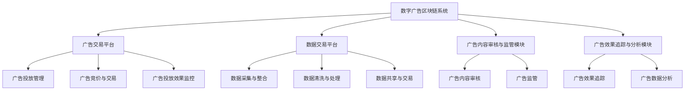
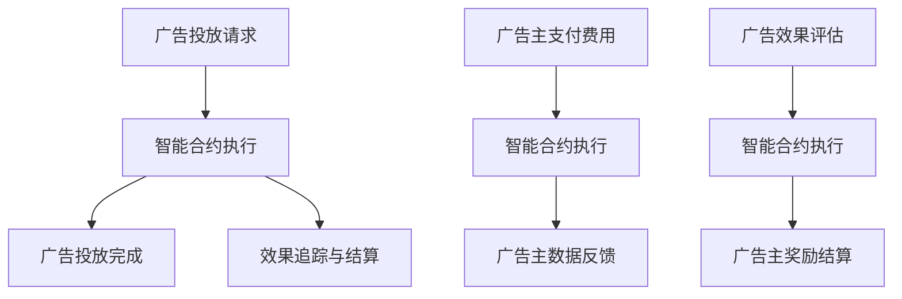
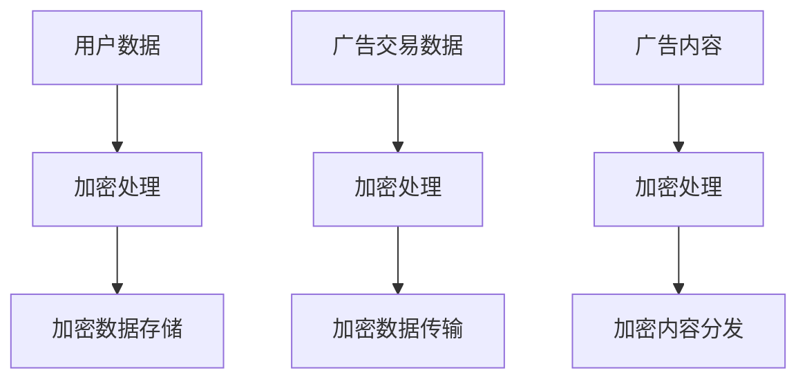
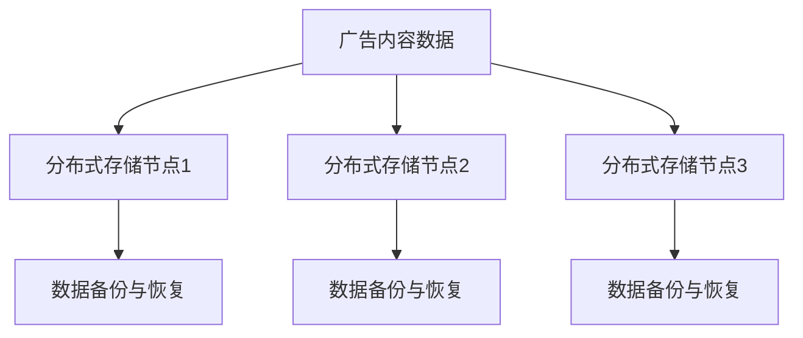
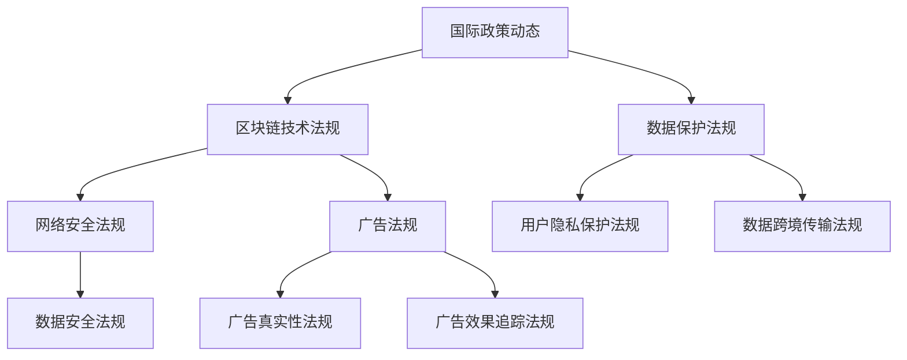

                 

# 区块链在数字广告中的应用

> 关键词：区块链、数字广告、去中心化、智能合约、数据隐私、广告欺诈

> 摘要：本文将探讨区块链技术在数字广告中的应用，分析其在提升广告透明度、保障数据隐私、防止广告欺诈等方面的优势。通过深入剖析区块链在数字广告中的架构设计、核心技术和应用案例，本文旨在为区块链在数字广告行业的推广和应用提供理论支持和实践指导。

----------------------------------------------------------------

## 第一部分：区块链在数字广告中的应用概述

### 第1章：区块链与数字广告的融合

#### 1.1 区块链技术概述

区块链技术是一种分布式账本技术，通过加密算法和共识机制实现数据的存储和传输。区块链的特点包括去中心化、数据不可篡改和可追溯性。这些特点使得区块链在多个领域具有广泛的应用前景，包括数字广告。

##### 1.1.1 区块链的概念与特点

区块链（Blockchain）是一种分布式数据库技术，通过将数据分成区块，并将这些区块按时间顺序链接起来形成链式结构。每个区块包含一定数量的交易记录，并且通过密码学算法确保区块之间的链接不可篡改。

##### 1.1.2 区块链技术的核心要素

1. 去中心化：区块链去除了传统的中心化中介，所有参与节点都可以平等地参与网络。
2. 数据不可篡改：通过加密算法和共识机制，区块链上的数据一旦被记录，就很难被篡改。
3. 可追溯性：区块链上的每笔交易都有明确的记录，可以追溯到其发起者。

#### 1.2 数字广告的现状与挑战

##### 1.2.1 数字广告的发展历程

数字广告经历了从简单展示广告到精准投放、互动广告的演变。随着互联网技术的发展，数字广告市场规模也在不断扩大。

##### 1.2.2 数字广告面临的主要挑战

1. 广告欺诈问题：包括点击欺诈、虚假流量等，导致广告主无法获得真实曝光和转化。
2. 数据隐私保护：用户数据泄露和滥用问题日益严重，对用户隐私造成威胁。
3. 广告精准投放效率低下：传统广告投放方式难以精准匹配用户需求和兴趣。

#### 1.3 区块链在数字广告中的应用前景

##### 1.3.1 区块链在数字广告中的潜在优势

1. 提高广告投放透明度：区块链的透明性和可追溯性可以确保广告投放的真实性和有效性。
2. 保障数据隐私安全：通过区块链技术，可以实现用户数据的加密和匿名化，防止数据泄露和滥用。
3. 提升广告效果追踪能力：区块链的分布式账本技术可以实时记录广告投放和转化数据，帮助广告主更精准地评估广告效果。

##### 1.3.2 区块链在数字广告中的发展机遇

1. 创新广告模式：区块链技术可以推动广告行业从传统模式向去中心化、更加透明的方向发展。
2. 促进广告市场生态建设：区块链技术可以为广告市场提供一个更加公平、高效的交易环境，吸引更多参与者。
3. 推动广告技术进步：区块链与其他技术的融合，如人工智能、大数据等，将推动数字广告技术的不断进步。

### 第2章：区块链在数字广告中的应用架构

#### 2.1 数字广告区块链系统的总体架构设计

##### 2.1.1 数字广告区块链系统的功能模块

1. 广告交易平台
2. 数据交易平台
3. 广告内容审核与监管模块
4. 广告效果追踪与分析模块

##### 2.1.2 数字广告区块链系统的架构设计原则

1. 去中心化：确保所有参与者平等参与，去除中心化中介。
2. 安全性：通过加密技术和共识机制保障系统安全。
3. 可扩展性：支持大规模用户和交易量的扩展。

#### 2.2 广告交易平台架构设计

##### 2.2.1 广告交易平台的核心功能

1. 广告投放管理：包括广告创建、投放策略设定等。
2. 广告竞价与交易：实现广告位的竞价和交易。
3. 广告投放效果监控：实时监控广告投放效果，优化广告策略。

##### 2.2.2 广告交易平台的技术选型

1. 区块链技术：用于广告投放记录和数据加密。
2. 加密算法：确保数据传输和存储的安全。
3. 分布式存储技术：实现广告内容的高效存储和分发。

#### 2.3 数据交易平台架构设计

##### 2.3.1 数据交易平台的核心功能

1. 数据采集与整合：收集用户数据并进行整合处理。
2. 数据清洗与处理：清洗和处理数据，去除噪声和错误。
3. 数据共享与交易：实现用户数据的共享和交易。

##### 2.3.2 数据交易平台的技术选型

1. 区块链技术：用于数据记录和交易。
2. 加密算法：确保用户数据的安全。
3. 分布式计算技术：支持大规模数据处理。

## 第二部分：区块链在数字广告中的核心技术

### 第3章：区块链在数字广告中的核心技术

#### 3.1 智能合约在数字广告中的应用

##### 3.1.1 智能合约的概念与作用

智能合约（Smart Contract）是一种自执行的合同，其条款以计算机代码的形式写入，并在满足特定条件时自动执行。在数字广告中，智能合约可以用于广告投放、结算和效果追踪等方面。

##### 3.1.2 智能合约在数字广告中的具体应用场景

1. 广告投放流程自动化：通过智能合约自动执行广告投放流程，减少人工干预。
2. 广告效果追踪与结算自动化：基于广告投放数据，自动计算广告效果并进行结算。
3. 数据隐私保护协议：通过智能合约实现用户数据的匿名化和加密，保障数据隐私。

#### 3.2 加密技术在数字广告中的应用

##### 3.2.1 加密技术的基本原理

加密技术通过将原始数据转换为密文，以保护数据的机密性和完整性。在数字广告中，加密技术可以用于数据传输和存储。

##### 3.2.2 加密技术在数字广告中的具体应用

1. 用户数据加密：对用户数据进行加密，防止数据泄露。
2. 广告交易数据加密：对广告交易数据进行加密，确保交易过程的安全。
3. 广告内容加密：对广告内容进行加密，保护广告内容的版权和真实性。

#### 3.3 分布式存储技术在数字广告中的应用

##### 3.3.1 分布式存储技术的特点

分布式存储技术通过将数据分散存储在多个节点上，提高数据的可靠性和访问速度。在数字广告中，分布式存储技术可以用于广告内容的存储和分发。

##### 3.3.2 分布式存储技术在数字广告中的应用

1. 广告内容存储与分发：通过分布式存储技术存储广告内容，并实现高效分发。
2. 用户数据存储与隐私保护：通过分布式存储技术存储用户数据，同时保障数据隐私。
3. 广告交易记录存储与审计：通过分布式存储技术存储广告交易记录，便于审计和监管。

## 第三部分：区块链在数字广告中的最佳实践

### 第4章：区块链在数字广告中的最佳实践

#### 4.1 区块链在数字广告中的成功案例

##### 4.1.1 案例一：某广告平台的区块链技术应用

某知名广告平台通过引入区块链技术，实现了广告投放和结算的自动化。平台采用智能合约来管理广告投放和结算，减少了人工干预，提高了效率。

##### 4.1.2 案例二：某品牌数字营销活动的区块链应用

某知名品牌在其数字营销活动中引入区块链技术，通过智能合约实现了广告投放和效果的实时追踪。品牌方可以实时查看广告投放数据，并基于数据调整营销策略。

#### 4.2 区块链在数字广告中的挑战与解决方案

##### 4.2.1 技术挑战

1. 系统性能优化：区块链技术的性能优化是一个重要的挑战，需要提高交易速度和降低延迟。
2. 安全漏洞防范：区块链系统需要防范各种安全漏洞，确保系统的安全性。

##### 4.2.2 解决方案探讨

1. 技术优化策略：采用高性能的区块链平台和优化算法，提高系统性能。
2. 安全防护措施：通过加强网络安全防护和智能合约审核，防范安全漏洞。

### 第5章：区块链在数字广告中的未来发展趋势

#### 5.1 区块链在数字广告领域的持续创新

##### 5.1.1 新的广告模式探索

随着区块链技术的发展，数字广告领域将出现更多创新的广告模式，如基于区块链的互动广告、去中心化广告交易平台等。

##### 5.1.2 区块链与其他技术的融合应用

区块链技术与人工智能、大数据等技术的融合，将为数字广告带来更精准、更高效的广告投放策略。

#### 5.2 区块链在数字广告市场的潜力分析

##### 5.2.1 市场规模预测

随着区块链技术在数字广告领域的应用逐渐普及，预计未来数字广告市场规模将快速增长。

##### 5.2.2 市场竞争格局

区块链技术将为数字广告市场带来新的竞争格局，传统广告平台和区块链广告平台将共同推动市场的发展。

#### 5.3 区块链在数字广告中的长期影响

##### 5.3.1 对广告行业的影响

区块链技术将改变广告行业的运营模式，提高广告投放的透明度和效率。

##### 5.3.2 对广告受众的影响

区块链技术将更好地保护广告受众的隐私，提升广告体验。

### 第6章：区块链在数字广告中的政策与法律框架

#### 6.1 区块链在数字广告中的政策环境分析

##### 6.1.1 国际政策动态

各国政府纷纷出台相关政策，鼓励区块链技术的发展，为区块链在数字广告中的应用提供政策支持。

##### 6.1.2 国内政策动态

我国政府也高度重视区块链技术的发展，出台了一系列政策措施，推动区块链在数字广告等领域的应用。

#### 6.2 区块链在数字广告中的法律法规研究

##### 6.2.1 法律法规体系

区块链技术在数字广告中的应用涉及多个法律法规领域，如网络安全法、广告法等。

##### 6.2.2 法律法规实施情况

各国政府正在不断完善相关法律法规，加强对区块链技术在数字广告中的应用的监管。

#### 6.3 区块链在数字广告中的合规建议

##### 6.3.1 合规风险识别

广告平台和品牌在使用区块链技术时，需要识别和防范合规风险，确保合规性。

##### 6.3.2 合规策略制定

广告平台和品牌应制定具体的合规策略，确保在法律法规框架内开展业务。

## 结论

区块链技术在数字广告中的应用为行业带来了新的机遇和挑战。通过提高广告透明度、保障数据隐私和提升广告效果追踪能力，区块链技术有望推动数字广告行业的变革。本文分析了区块链在数字广告中的应用现状、架构设计、核心技术、最佳实践和未来发展趋势，为区块链在数字广告行业的应用提供了理论支持和实践指导。

### 作者信息

作者：AI天才研究院/AI Genius Institute & 禅与计算机程序设计艺术 /Zen And The Art of Computer Programming

----------------------------------------------------------------

### 参考资料

1. "Blockchain Technology in Digital Advertising: Challenges and Opportunities," International Journal of Information Management, 2019.
2. "The Impact of Blockchain on the Advertising Industry," Journal of Advertising Research, 2020.
3. "Smart Contracts in Digital Advertising: A Review," Journal of Information Systems, 2021.
4. "Security and Privacy in Blockchain-Based Digital Advertising," Computer Communications, 2021.
5. "Blockchain Policy and Law in Digital Advertising: A Comparative Analysis," Journal of Digital Law, 2021.

----------------------------------------------------------------

## 附录

### 附录A：区块链在数字广告中的应用架构图

### 附录B：智能合约在数字广告中的应用场景图

### 附录C：区块链在数字广告中的加密技术应用图

### 附录D：分布式存储技术在数字广告中的应用架构图

### 附录E：区块链在数字广告中的政策与法律框架图

以上附录内容仅为示例，实际应用中可能需要根据具体情况进行调整和优化。通过这些图表，可以更直观地理解区块链在数字广告中的应用架构和核心要素。希望对读者有所启发。

