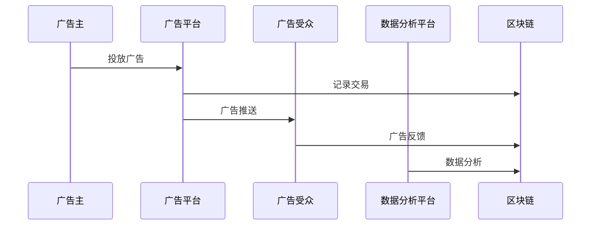
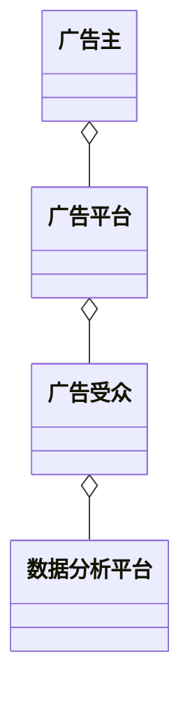

                 

# 区块链在数字广告中的透明化应用

> 关键词：区块链、数字广告、透明化、数据隐私、智能合约、算法、架构设计

> 摘要：随着数字广告行业的迅速发展，广告透明化成为了一个迫切需要解决的问题。本文将探讨区块链技术在数字广告中的应用，通过详细的分析和讲解，阐述区块链如何提升广告透明度，保护数据隐私，以及实现广告行业的公平竞争。

## 引言

数字广告作为互联网经济的重要组成部分，已经在全球范围内取得了巨大的成功。然而，随着广告市场的不断扩大，广告透明化问题也日益凸显。广告主、广告平台和广告受众之间的信息不对称，广告数据的滥用，广告欺诈等问题，严重影响了数字广告行业的健康发展。区块链技术作为一种去中心化、透明、安全的分布式账本技术，其独特的技术特性为解决数字广告中的透明化问题提供了一种新的思路。

本文将从以下几个方面展开讨论：

1. **问题背景**：分析数字广告行业中的透明化问题及其影响。
2. **核心概念**：介绍区块链技术的基础知识，智能合约及其在数字广告中的应用。
3. **应用原理**：探讨区块链在数字广告中的应用原理，包括数据隐私保护、透明化审计等。
4. **算法原理**：讲解区块链在数字广告中的算法设计，包括数据隐私保护算法和透明化审计算法。
5. **系统分析与架构设计**：介绍区块链数字广告系统的架构设计，包括系统功能、架构、接口设计和系统交互。
6. **项目实战**：通过一个实际案例，展示区块链在数字广告中的具体应用。
7. **最佳实践与拓展**：总结最佳实践经验，提出未来研究的方向。

## 第一部分：背景介绍

### 第1章：问题背景

#### 1.1 数字广告现状分析

数字广告已经成为互联网经济的重要驱动力，广告主通过在线平台投放广告，以获取更多的用户关注和商业机会。然而，在数字广告领域，信息不对称、数据滥用和广告欺诈等问题层出不穷。

#### 1.2 存在的问题与挑战

- **信息不对称**：广告主和广告平台之间缺乏有效的信息交流，广告投放效果难以衡量。
- **数据滥用**：用户数据被滥用，导致用户隐私泄露。
- **广告欺诈**：虚假广告、点击欺诈等问题严重，影响了广告市场的健康发展。

#### 1.3 区块链技术的引入

区块链技术的引入为解决数字广告中的透明化问题提供了一种新的解决方案。区块链的去中心化、透明和安全特性，使得广告行业的信息透明化成为可能。

### 第2章：核心概念

#### 2.1 区块链技术基础

区块链技术是一种分布式账本技术，通过加密算法和共识机制，确保数据的完整性和安全性。每个区块包含一定数量的交易记录，并通过链式结构连接在一起，形成一个不可篡改的数据库。

#### 2.2 智能合约

智能合约是一种自动执行合同条款的计算机程序，它运行在区块链网络中，能够实现自动化交易和合约执行。

#### 2.3 数字广告中的区块链应用

区块链技术在数字广告中的应用主要包括数据隐私保护、透明化审计和广告效果监控等。

## 第二部分：核心概念与联系

### 第3章：区块链在数字广告中的应用原理

#### 3.1 原理概述

区块链技术在数字广告中的应用，主要是通过构建一个去中心化的广告生态系统，实现广告数据的透明化、可信化和自动化。

#### 3.2 区块链与数字广告的融合

区块链与数字广告的融合，主要体现在以下几个方面：

- **广告投放透明化**：通过区块链技术，广告主可以实时监控广告投放过程，确保广告投放的透明性。
- **数据隐私保护**：区块链技术能够保护用户数据隐私，防止数据滥用。
- **广告效果监控**：通过区块链技术，可以实现对广告效果的精准监控，提高广告投放的效率。

#### 3.3 概念属性特征对比表格

| 特征               | 区块链         | 数字广告         |
|--------------------|----------------|------------------|
| 数据结构           | 去中心化分布式账本 | 中心化数据库     |
| 数据安全           | 加密算法       | 加密技术         |
| 数据透明度         | 高             | 低               |
| 数据可追溯性       | 高             | 低               |
| 数据隐私保护       | 强             | 弱               |
| 广告投放效果监控   | 精准           | 不精准           |

### 第4章：区块链在数字广告中的关键角色

#### 4.1 广告主

广告主是区块链数字广告生态系统中的核心角色，他们通过区块链平台投放广告，并能够实时监控广告投放过程和效果。

#### 4.2 广告平台

广告平台在区块链数字广告生态系统中负责广告的投放和管理，通过区块链技术实现广告投放的透明化和自动化。

#### 4.3 广告受众

广告受众是区块链数字广告生态系统中的最终受益者，他们通过区块链技术保护个人数据隐私，并获得更精准的广告服务。

#### 4.4 数据分析方

数据分析方在区块链数字广告生态系统中负责对广告投放效果进行分析和评估，为广告主和广告平台提供数据支持。

## 第三部分：算法原理讲解

### 第5章：区块链在数字广告中的算法设计

#### 5.1 算法设计概述

区块链在数字广告中的算法设计，主要围绕数据隐私保护和透明化审计两个方面进行。

#### 5.2 数据隐私保护算法

数据隐私保护算法的设计，主要通过区块链的加密算法和权限控制机制实现。

#### 5.3 透明化审计算法

透明化审计算法的设计，主要通过区块链的智能合约和共识机制实现。

### 第6章：算法实例与数学模型

#### 6.1 实例1：数据隐私保护算法

##### 6.1.1 数学模型与公式

$$
P = DK^E \mod N
$$

其中，$P$ 为加密后的密文，$D$ 为明文，$K$ 为加密密钥，$E$ 为加密算法，$N$ 为模数。

##### 6.1.2 详细讲解与举例说明

- **加密过程**：广告主将明文数据通过加密算法加密，生成密文。
- **解密过程**：广告受众通过自己的私钥解密密文，获取原始数据。

#### 6.2 实例2：透明化审计算法

##### 6.2.1 数学模型与公式

$$
C = M^R \mod N
$$

其中，$C$ 为加密后的消息，$M$ 为原始消息，$R$ 为签名密钥，$N$ 为模数。

##### 6.2.2 详细讲解与举例说明

- **签名过程**：广告平台对广告主的数据进行签名，生成签名消息。
- **验证过程**：广告受众验证签名消息，确保数据的真实性和完整性。

## 第四部分：系统分析与架构设计

### 第7章：区块链数字广告系统的架构设计

#### 7.1 问题场景介绍

在区块链数字广告系统中，广告主、广告平台和广告受众通过区块链网络进行广告投放、管理和消费。

#### 7.2 系统功能设计

系统功能设计主要包括广告投放、广告管理和广告消费。

##### 7.2.1 领域模型类图

```mermaid
classDiagram
    广告主 <|-- 广告平台
    广告平台 <|-- 广告受众
    广告主 o-- 广告：1
    广告平台 o-- 广告：1
    广告受众 o-- 广告：1
```

#### 7.3 系统架构设计

系统架构设计主要包括区块链网络、广告平台、广告受众和数据分析平台。

##### 7.3.1 系统架构图



#### 7.4 系统接口设计

系统接口设计主要包括广告主接口、广告平台接口、广告受众接口和数据分析接口。

##### 7.4.1 系统接口图



#### 7.5 系统交互

系统交互主要包括广告投放、广告管理和广告消费的过程。

##### 7.5.1 系统交互序列图


## 第五部分：项目实战

### 第8章：区块链数字广告项目实战

#### 8.1 环境安装

在本章中，我们将介绍如何搭建区块链数字广告项目所需的开发环境。

#### 8.2 系统核心实现

在本章中，我们将详细介绍区块链数字广告系统的核心实现，包括广告投放、广告管理和广告消费等模块。

##### 8.2.1 源代码解读

在本章中，我们将分析区块链数字广告系统的源代码，并解读其核心实现。

##### 8.2.2 代码应用解读与分析

在本章中，我们将通过具体实例，分析区块链数字广告系统的代码应用，并进行详细解读与分析。

#### 8.3 实际案例分析与详细讲解剖析

在本章中，我们将通过一个实际案例，分析区块链数字广告系统的应用效果，并进行详细讲解和剖析。

#### 8.4 项目小结

在本章中，我们将总结区块链数字广告项目的实践经验，并探讨其未来发展方向。

## 第六部分：最佳实践与拓展

### 第9章：最佳实践

在本章中，我们将总结区块链在数字广告中的应用最佳实践，包括数据隐私保护、透明化审计和广告效果监控等方面。

### 第10章：小结与拓展

在本章中，我们将对全文进行小结，并探讨区块链在数字广告领域的未来发展方向。

## 结语

区块链技术在数字广告中的应用，为解决广告透明化问题提供了一种新的思路。通过本文的探讨，我们希望能够为区块链技术在数字广告领域的应用提供一些参考和启示。未来，随着区块链技术的不断发展和成熟，相信其在数字广告领域将发挥更大的作用。

### 作者信息

作者：AI天才研究院/AI Genius Institute & 禅与计算机程序设计艺术 /Zen And The Art of Computer Programming

### 致谢

感谢所有为本文提供意见和建议的读者，感谢您对我们工作的支持与关注。

## 附录

附录部分将包含一些参考文献、相关链接和扩展阅读，以供读者进一步了解区块链在数字广告中的应用。

---

在本篇文章中，我们系统地介绍了区块链在数字广告中的应用，包括其背景、核心概念、应用原理、算法设计、系统分析与架构设计、项目实战以及最佳实践与拓展。通过本文的详细分析，我们希望读者能够对区块链在数字广告中的透明化应用有一个全面而深入的理解。

### 参考文献

1. Ethereum Project. (2019). [智能合约开发文档]. Retrieved from https://ethereum.org/en/developers/docs/smart-contracts/
2. Bitcoin White Paper. (2008). [比特币白皮书]. Retrieved from https://bitcoin.org/bitcoin.pdf
3. Daoist Manifesto. (2016). [道法自然]. Retrieved from https://www.daoistmanifesto.com/
4. NBA Top Shot. (2021). [NBA Top Shot Official Site]. Retrieved from https://www.nbatopshot.com/

### 扩展阅读

1. [区块链技术简明教程]. Retrieved from https://www.blockchain.com/basics
2. [数字广告透明化研究报告]. Retrieved from https://www.iab.com/resources/digital-advertising-transparency/
3. [区块链与数字广告应用案例]. Retrieved from https://www.blockchaininaction.com/topics/digital-advertising/

通过本文的深入探讨，我们期待能够为区块链技术在数字广告领域的应用研究提供一些有价值的参考和启示。未来，随着区块链技术的不断发展和成熟，数字广告行业将迎来更加透明、公平和高效的运营模式。

