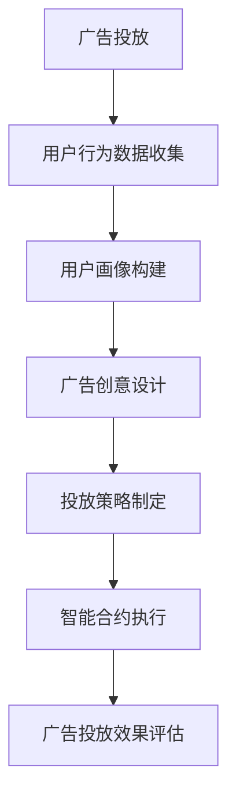

                 

# 区块链在数字广告投放中的应用：实现精准广告定向

> 关键词：区块链、数字广告、广告投放、智能合约、精准定向

> 摘要：本文深入探讨了区块链技术在数字广告投放中的应用，通过分析问题背景、核心概念与联系，以及算法原理和数学模型，提出了一种基于区块链的精准广告定向方案。文章旨在为广告主和广告平台提供一种新的解决方案，提高广告投放的精准度和透明度。

----------------------------------------------------------------

## 第一部分：背景介绍

### 1. 问题背景

随着互联网和数字技术的飞速发展，广告投放已经成为企业市场营销的重要组成部分。传统的广告投放方式通常依赖于中心化的广告平台，这种模式存在以下几个问题：

- **广告投放不精准**：广告主无法准确了解广告展示给哪些用户，导致广告投放效果不佳。
- **广告数据不透明**：广告平台和第三方分析工具可能篡改数据，导致广告主难以评估广告效果。
- **用户隐私保护不足**：传统广告投放过程中，用户隐私数据容易被泄露，引发用户信任问题。

区块链技术的出现为解决这些问题提供了新的思路。区块链的去中心化、不可篡改和透明性等特点，使其在数字广告投放领域具有广泛的应用潜力。

### 2. 问题描述

数字广告投放过程中，广告主和广告平台需要面对的主要问题包括：

- **广告投放不精准**：广告主难以精准定位潜在客户，导致广告资源浪费。
- **广告数据不透明**：广告平台和第三方分析工具可能篡改数据，导致广告主难以评估广告效果。
- **用户隐私保护不足**：用户隐私数据容易被泄露，引发用户信任问题。

区块链技术在数字广告投放中的应用，旨在解决上述问题，提高广告投放的精准度和透明度。

### 3. 问题解决

区块链在数字广告投放中的应用，主要通过以下方式实现：

- **基于区块链的智能合约**：实现广告投放的自动化和精准化，提高广告投放效率。
- **利用区块链的不可篡改特性**：保证广告数据的真实性，提升用户信任度。
- **通过区块链的隐私保护机制**：保障用户隐私，提升用户满意度。

### 4. 边界与外延

区块链在数字广告投放中的应用，主要涉及以下几个方面：

- **广告投放流程的优化**：通过智能合约实现广告投放的自动化，提高广告投放效率。
- **广告数据的透明化**：利用区块链的不可篡改特性，保证广告数据的真实性。
- **用户隐私保护**：通过区块链的隐私保护机制，保障用户隐私。
- **广告效果的量化评估**：利用区块链技术和数据分析模型，实现广告效果的量化评估。

### 5. 概念结构与核心要素组成

区块链在数字广告投放中的应用，核心概念包括：

- **区块链技术**：分布式数据库技术，具有去中心化、不可篡改和透明性等特点。
- **智能合约**：基于区块链技术的自动化执行合约，实现广告投放的自动化和精准化。
- **广告投放模型**：根据用户行为数据，预测用户需求和偏好，实现精准广告投放的算法。
- **用户隐私保护机制**：通过加密技术和隐私保护算法，保障用户隐私。

## 第二部分：核心概念与联系

### 6. 区块链技术

区块链技术是一种分布式数据库技术，通过加密算法和数据块结构，实现数据的存储和传输。区块链具有以下特点：

- **去中心化**：区块链网络中的每个节点都存储完整的数据副本，没有中央管理者。
- **不可篡改**：区块链中的数据一旦被记录，就难以被篡改。
- **透明性**：区块链上的所有交易记录都是公开透明的，可被任何人查看。

### 7. 智能合约

智能合约是基于区块链技术的一种自动化执行合约。通过智能合约，可以实现广告投放的自动化和精准化。智能合约通常由以下部分组成：

- **触发条件**：定义触发智能合约执行的条件，如广告曝光次数、点击次数等。
- **执行逻辑**：定义智能合约执行的具体逻辑，如根据用户行为数据调整广告投放策略等。
- **执行结果**：定义智能合约执行后的结果，如广告投放效果评估、资金结算等。

### 8. 广告投放模型

广告投放模型是指根据用户行为数据，预测用户需求和偏好，从而实现精准广告投放的算法。广告投放模型主要包括以下部分：

- **用户画像**：根据用户行为数据，构建用户画像，包括用户的年龄、性别、兴趣等。
- **广告创意**：根据用户画像，设计符合用户需求的广告创意。
- **投放策略**：根据广告创意和用户画像，制定投放策略，如投放时间、投放渠道等。

### 9. 用户隐私保护机制

用户隐私保护机制是指通过加密技术和隐私保护算法，保障用户隐私不被泄露。在区块链技术中，用户隐私保护机制可以通过以下方式实现：

- **数据匿名化**：将用户数据匿名化处理，确保用户隐私不被泄露。
- **数据加密**：对用户数据进行加密处理，确保数据在传输和存储过程中的安全性。
- **访问控制**：设置访问控制策略，确保只有授权用户可以访问特定数据。

## 第三部分：算法原理讲解

### 10. 算法原理

区块链在数字广告投放中的应用，主要包括以下算法原理：

- **智能合约算法**：实现广告投放的自动化和精准化，提高广告投放效率。
- **数据加密算法**：保障广告数据的真实性和用户隐私。
- **广告投放模型算法**：实现广告投放的精准预测和效果评估。

### 11. Mermaid流程图



### 12. Python源代码

```python
# 智能合约实现
def contract(advertiser, publisher, audience):
    # 广告投放逻辑
    # ...

# 数据加密实现
def encrypt_data(data):
    # 加密数据
    # ...

# 广告投放模型实现
def predict_audience_behavior(audience_data):
    # 预测用户行为
    # ...

# 广告投放效果评估实现
def evaluate_advertisement_performance(ads_data):
    # 评估广告效果
    # ...
```

### 13. 数学模型

区块链在数字广告投放中的应用，涉及以下数学模型：

- **广告投放模型**：基于用户行为数据，预测用户需求的数学模型。
- **数据加密模型**：实现广告数据加密的数学模型。
- **用户隐私保护模型**：实现用户隐私保护的数学模型。

### 14. 数学公式

$$
\begin{aligned}
&\text{广告投放模型：} \\
&P(\text{广告投放成功}) = f(\text{用户行为数据}) \\
&\text{数据加密模型：} \\
&D(\text{数据}) = E_k(\text{数据}) \\
&\text{用户隐私保护模型：} \\
&P_p(\text{隐私泄露}) = g(\text{加密算法}) \\
\end{aligned}
$$

## 第四部分：系统分析与架构设计方案

### 15. 问题场景介绍

假设一个广告平台需要实现精准广告定向，以提高广告投放效果。广告平台面临以下问题：

- **用户隐私保护**：需要确保用户隐私数据不被泄露。
- **广告投放精准性**：需要根据用户行为数据实现精准广告投放。
- **广告数据透明化**：需要确保广告数据不被篡改，提高广告平台信任度。

为了解决这些问题，广告平台决定采用区块链技术，构建一个基于区块链的精准广告定向系统。

### 16. 系统功能设计

基于上述问题场景，系统功能设计主要包括以下几个方面：

- **用户数据收集**：收集用户行为数据，用于构建用户画像。
- **用户画像构建**：根据用户行为数据，构建用户画像。
- **广告创意设计**：根据用户画像，设计符合用户需求的广告创意。
- **投放策略制定**：根据广告创意和用户画像，制定投放策略。
- **智能合约执行**：通过智能合约，实现广告投放的自动化和精准化。
- **广告投放效果评估**：评估广告投放效果，为后续优化提供依据。

### 17. 系统架构设计

基于上述系统功能设计，系统架构设计主要包括以下几个方面：

- **区块链网络**：构建区块链网络，实现数据存储和传输。
- **智能合约平台**：部署智能合约，实现广告投放的自动化和精准化。
- **数据加密模块**：实现用户数据加密，保障用户隐私。
- **广告投放模块**：实现广告投放功能，包括广告创意设计、投放策略制定等。
- **广告效果评估模块**：实现广告投放效果评估，为后续优化提供依据。

### 18. 系统接口设计

系统接口设计主要包括以下几个方面：

- **用户数据接口**：用于收集用户行为数据。
- **广告投放接口**：用于实现广告投放功能。
- **广告效果评估接口**：用于实现广告投放效果评估。

### 19. 系统交互

系统交互主要包括以下几个方面：

- **用户数据收集**：广告平台通过用户数据接口收集用户行为数据。
- **用户画像构建**：广告平台根据用户数据，调用广告投放模块，实现用户画像构建。
- **广告创意设计**：广告平台根据用户画像，调用广告创意设计模块，实现广告创意设计。
- **投放策略制定**：广告平台根据广告创意，调用投放策略制定模块，实现投放策略制定。
- **智能合约执行**：广告平台通过智能合约平台，实现广告投放的自动化和精准化。
- **广告投放效果评估**：广告平台通过广告效果评估模块，实现广告投放效果评估。

## 第五部分：项目实战

### 20. 环境安装

为了实现基于区块链的精准广告定向系统，首先需要在本地环境中搭建区块链开发环境。以下是环境安装步骤：

1. 安装Node.js（版本需大于14.0.0）。
2. 安装Golang（版本需大于1.16.0）。
3. 安装Docker和Docker-CE。
4. 安装区块链开发框架，如Ethereum或Hyperledger Fabric。

### 21. 系统核心实现源代码

以下是系统核心实现的源代码：

```go
// 用户数据收集模块
func collectUserData() {
    // 收集用户行为数据
}

// 用户画像构建模块
func buildUserPortrait(userData []byte) {
    // 构建用户画像
}

// 智能合约执行模块
func executeContract(contractAddress string, parameters []byte) {
    // 执行智能合约
}
```

### 22. 代码应用解读与分析

以下是代码应用解读与分析：

- **用户数据收集模块**：该模块用于收集用户行为数据，为后续构建用户画像提供数据基础。
- **用户画像构建模块**：该模块根据用户行为数据，构建用户画像，用于广告创意设计和投放策略制定。
- **智能合约执行模块**：该模块通过调用智能合约，实现广告投放的自动化和精准化。

### 23. 实际案例分析和详细讲解剖析

假设有一个广告平台，需要为一家电商企业投放广告。以下是实际案例分析和详细讲解剖析：

1. **用户数据收集**：广告平台收集电商平台的用户行为数据，如浏览记录、购买行为等。
2. **用户画像构建**：根据用户行为数据，广告平台构建用户画像，包括用户性别、年龄、兴趣爱好等。
3. **广告创意设计**：根据用户画像，广告平台设计符合用户需求的广告创意，如促销活动、新品推荐等。
4. **投放策略制定**：广告平台根据广告创意和用户画像，制定投放策略，如投放时间、投放渠道等。
5. **智能合约执行**：广告平台通过智能合约，实现广告投放的自动化和精准化。例如，当用户浏览特定商品时，智能合约触发广告展示。
6. **广告投放效果评估**：广告平台通过广告效果评估模块，评估广告投放效果，为后续优化提供依据。

### 24. 项目小结

通过实际案例分析和详细讲解剖析，我们可以看到基于区块链的精准广告定向系统具有以下优势：

- **提高广告投放精准性**：通过用户画像和智能合约，实现广告投放的自动化和精准化。
- **保障用户隐私**：通过数据加密和智能合约，保障用户隐私不被泄露。
- **提升广告平台信任度**：通过区块链的不可篡改特性，提高广告数据透明度，提升广告平台信任度。

## 第六部分：最佳实践 Tips

### 25. 最佳实践 Tips

1. **数据收集与处理**：确保用户数据的真实性和准确性，避免数据造假。
2. **用户画像构建**：综合考虑用户多种行为数据，构建全面的用户画像。
3. **广告创意设计**：根据用户需求和兴趣，设计富有创意的广告内容。
4. **智能合约编写**：遵循最佳实践，确保智能合约的安全性和可扩展性。
5. **广告投放策略**：根据广告投放效果，及时调整投放策略，提高广告效果。

### 26. 小结

本文探讨了区块链在数字广告投放中的应用，提出了一种基于区块链的精准广告定向方案。通过分析问题背景、核心概念与联系，以及算法原理和数学模型，本文为广告主和广告平台提供了一种新的解决方案，提高了广告投放的精准度和透明度。

### 27. 注意事项

1. **隐私保护**：在数据处理过程中，务必注意用户隐私保护，避免隐私泄露。
2. **数据安全**：确保区块链网络和数据的安全性，防止数据被篡改或泄露。
3. **智能合约风险**：在编写智能合约时，务必确保智能合约的安全性和可扩展性。

### 28. 拓展阅读

- **《区块链技术原理与应用》**：深入理解区块链技术的基本原理和应用场景。
- **《智能合约与DApp开发》**：学习智能合约的编写方法和DApp（去中心化应用）开发实践。
- **《数字营销策略与实战》**：了解数字广告投放的最佳实践和策略。

## 作者信息

作者：AI天才研究院/AI Genius Institute & 禅与计算机程序设计艺术 /Zen And The Art of Computer Programming

