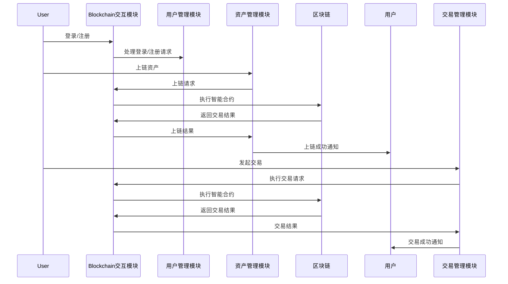
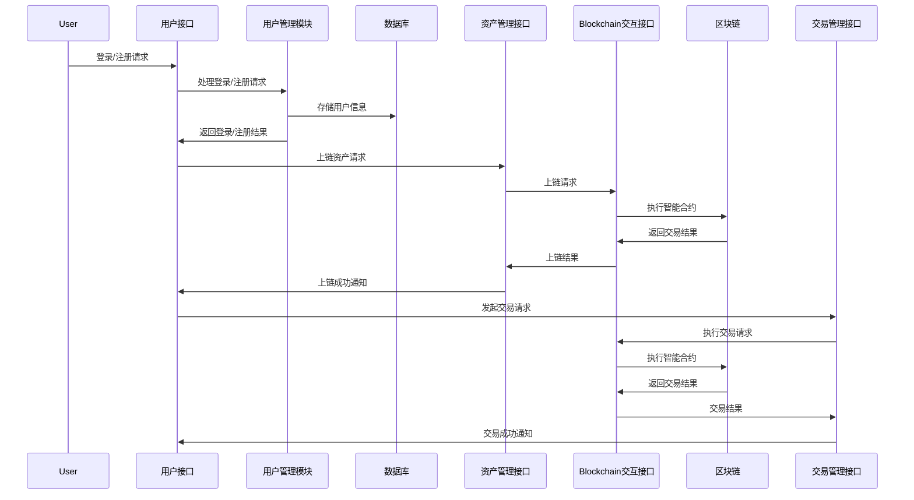

                 

# 区块链在数字游戏资产交易中的应用

## 关键词

区块链、数字游戏资产交易、智能合约、共识机制、去中心化交易平台

## 摘要

本文旨在探讨区块链技术在数字游戏资产交易中的应用。随着区块链技术的不断发展和普及，其在数字游戏领域的应用日益广泛，为游戏资产的交易带来了新的机遇和挑战。本文首先介绍了区块链技术的基础知识和核心概念，然后分析了数字游戏资产交易的发展历程和现状，接着详细阐述了区块链技术在数字游戏资产交易中的优势和应用，包括数据透明与安全、智能合约在交易中的应用以及共识机制在交易中的保障。此外，本文还通过实际案例分析了区块链在数字游戏资产交易中的应用，探讨了其中的法律法规与伦理问题，并预测了其未来的发展趋势。

### 目录大纲

----------------------------------------------------------------

## 第一部分：区块链技术基础

### 第1章：区块链概述

#### 1.1 区块链的起源与特点

##### 1.1.1 区块链的起源

##### 1.1.2 区块链的基本特点

##### 1.1.3 区块链的应用领域

#### 1.2 区块链的核心概念

##### 1.2.1 区块与链

##### 1.2.2 加密算法

##### 1.2.3 智能合约

##### 1.2.4 共识机制

#### 1.3 主流区块链平台介绍

##### 1.3.1 Bitcoin

##### 1.3.2 Ethereum

##### 1.3.3 其他区块链平台介绍

#### 1.4 本章小结

----------------------------------------------------------------

## 第二部分：数字游戏资产交易概述

### 第2章：数字游戏资产交易背景

#### 2.1 数字游戏资产的定义与价值

##### 2.1.1 数字游戏资产的定义

##### 2.1.2 数字游戏资产的价值

#### 2.2 数字游戏资产交易的发展历程

##### 2.2.1 传统游戏资产交易

##### 2.2.2 数字货币在游戏资产交易中的应用

##### 2.2.3 区块链技术在游戏资产交易中的兴起

#### 2.3 数字游戏资产交易的优势与挑战

##### 2.3.1 数字游戏资产交易的优势

##### 2.3.2 数字游戏资产交易的挑战

#### 2.4 本章小结

----------------------------------------------------------------

## 第三部分：区块链在数字游戏资产交易中的应用

### 第3章：区块链技术在数字游戏资产交易中的优势

#### 3.1 数据透明与安全

##### 3.1.1 区块链的数据透明性

##### 3.1.2 区块链的安全性

#### 3.2 智能合约在交易中的应用

##### 3.2.1 智能合约的定义与功能

##### 3.2.2 智能合约在数字游戏资产交易中的应用案例

#### 3.3 共识机制在交易中的保障

##### 3.3.1 共识机制的作用

##### 3.3.2 共识机制在数字游戏资产交易中的应用

#### 3.4 本章小结

----------------------------------------------------------------

### 第4章：区块链在数字游戏资产交易中的应用案例分析

#### 4.1 DApp在数字游戏资产交易中的应用

##### 4.1.1 DApp的定义与特点

##### 4.1.2 DApp在数字游戏资产交易中的应用案例

#### 4.2 游戏资产代币化实践

##### 4.2.1 游戏资产代币化的定义

##### 4.2.2 游戏资产代币化的优势

##### 4.2.3 游戏资产代币化的实现步骤

#### 4.3 去中心化交易平台的构建

##### 4.3.1 去中心化交易平台的定义

##### 4.3.2 去中心化交易平台的构建流程

##### 4.3.3 去中心化交易平台的运营与挑战

#### 4.4 本章小结

----------------------------------------------------------------

### 第5章：区块链在数字游戏资产交易中的法律法规与伦理问题

#### 5.1 区块链在数字游戏资产交易中的法律法规挑战

##### 5.1.1 区块链技术的法律地位

##### 5.1.2 区块链在数字游戏资产交易中的法律风险

##### 5.1.3 法律法规对区块链在数字游戏资产交易中的应用的规范

#### 5.2 区块链在数字游戏资产交易中的伦理问题

##### 5.2.1 伦理问题的重要性

##### 5.2.2 区块链在数字游戏资产交易中可能引发的伦理问题

##### 5.2.3 伦理问题的解决途径

#### 5.3 本章小结

----------------------------------------------------------------

### 第6章：区块链在数字游戏资产交易中的应用前景与发展趋势

#### 6.1 区块链在数字游戏资产交易中的应用前景

##### 6.1.1 技术成熟度分析

##### 6.1.2 行业趋势分析

##### 6.1.3 潜在市场规模预测

#### 6.2 发展趋势与挑战

##### 6.2.1 技术创新趋势

##### 6.2.2 行业法规趋势

##### 6.2.3 潜在挑战与应对策略

#### 6.3 本章小结

----------------------------------------------------------------

## 第一部分：区块链技术基础

### 第1章：区块链概述

区块链是一种分布式数据库技术，其特点是在去中心化的网络环境中，通过加密算法和共识机制实现数据的存储和传输。这一技术最早由中本聪（Satoshi Nakamoto）在2008年提出，并在2009年创造了比特币（Bitcoin），从而引发了全球对区块链技术的关注。

#### 1.1 区块链的起源与特点

##### 1.1.1 区块链的起源

区块链的起源可以追溯到1991年，当时斯托曼（Stefan Brands）和马修·泽拉（Matthew Zhang）首次提出了基于盲签名和可信第三方来保护版权的概念。然而，区块链的真正诞生是在2008年中本聪发布的《比特币：一个点对点的电子现金系统》白皮书。中本聪提出了一个去中心化的电子现金系统，它不需要第三方信任机构即可实现价值传输。

##### 1.1.2 区块链的基本特点

- **去中心化**：区块链网络中的所有节点都参与数据的验证和存储，不存在中心化的控制节点，从而提高了系统的抗攻击性和容错性。
- **数据透明性**：区块链上的数据对所有节点都是可见的，确保了数据的透明性和可追溯性。
- **安全性**：区块链使用加密算法来保护数据的安全，确保数据无法被篡改和伪造。
- **不可篡改性**：一旦数据被记录在区块链上，就几乎不可能被修改或删除，从而保证了数据的真实性和可靠性。

##### 1.1.3 区块链的应用领域

区块链技术的去中心化、透明性和安全性特点，使其在多个领域都有潜在的应用价值。目前，区块链技术的主要应用领域包括：

- **金融领域**：如比特币、以太坊等加密货币。
- **供应链管理**：通过区块链技术可以实现供应链的透明化和追踪。
- **数字身份验证**：利用区块链技术可以实现去中心化的身份验证。
- **智能合约**：在金融、房地产、法律等领域中，智能合约可以自动化合同执行。
- **数字版权保护**：通过区块链技术可以确保数字版权的归属和合法性。

#### 1.2 区块链的核心概念

##### 1.2.1 区块与链

区块链的基本组成单位是区块，每个区块包含一定数量的交易记录。区块通过加密算法与前后区块相连，形成链式数据结构，因此称为“区块链”。

##### 1.2.2 加密算法

区块链使用加密算法来保护数据的安全。常见的加密算法包括哈希算法、公钥加密算法和数字签名算法。

- **哈希算法**：用于生成数据摘要，确保数据的完整性。
- **公钥加密算法**：用于数据传输过程中的加密和解密。
- **数字签名算法**：用于验证数据发送者的身份和数据的完整性。

##### 1.2.3 智能合约

智能合约是区块链上的自动执行合约，其基于编程语言实现。当满足特定条件时，智能合约会自动执行预定的合约条款。

##### 1.2.4 共识机制

共识机制是区块链网络中节点就数据的一致性达成共识的算法。常见的共识机制包括工作量证明（PoW）、权益证明（PoS）和委托权益证明（DPoS）等。

#### 1.3 主流区块链平台介绍

##### 1.3.1 Bitcoin

比特币是第一个成功的区块链应用，由中本聪创建。比特币使用工作量证明（PoW）作为共识机制，确保网络的安全性。

##### 1.3.2 Ethereum

以太坊是一个开源的区块链平台，由维塔利克·布特林（Vitalik Buterin）创建。以太坊不仅支持加密货币，还支持智能合约，使其在去中心化应用（DApp）开发中具有广泛的应用。

##### 1.3.3 其他区块链平台介绍

除了比特币和以太坊，还有许多其他知名的区块链平台，如：

- **Ripple**：用于跨境支付和货币兑换。
- **EOS**：用于去中心化应用的高性能区块链平台。
- **Tron**：旨在打造一个去中心化的互联网内容娱乐系统。

#### 1.4 本章小结

区块链技术以其去中心化、透明性和安全性特点，在数字游戏资产交易等领域具有广泛的应用前景。本章介绍了区块链的起源、特点、核心概念以及主流区块链平台，为后续讨论区块链在数字游戏资产交易中的应用奠定了基础。

----------------------------------------------------------------

## 第二部分：数字游戏资产交易概述

### 第2章：数字游戏资产交易背景

数字游戏资产交易是随着数字游戏产业的发展而逐渐兴起的。在传统游戏中，玩家通过游戏内的交易或购买获得游戏资产，这些资产通常由游戏公司控制，玩家之间的交易需要依赖游戏平台或第三方交易平台。然而，这种中心化的交易模式存在一定的局限性，如数据不透明、交易成本高、安全风险等。随着区块链技术的发展，去中心化的数字游戏资产交易模式逐渐成为可能，并展现出巨大的潜力。

#### 2.1 数字游戏资产的定义与价值

##### 2.1.1 数字游戏资产的定义

数字游戏资产是指游戏内部具有经济价值的虚拟物品，如游戏货币、道具、装备等。这些资产通常在游戏内具有独特的功能，能够提升玩家的游戏体验。随着游戏产业的发展，这些数字游戏资产逐渐脱离游戏本身的限制，成为一种可交易的虚拟资产。

##### 2.1.2 数字游戏资产的价值

数字游戏资产具有以下价值：

- **使用价值**：玩家通过游戏获取和交易这些资产，能够在游戏内提升自己的游戏水平或获得更好的游戏体验。
- **交易价值**：随着游戏产业的发展，这些数字游戏资产在玩家之间形成了交易市场，具有交易价值。
- **投资价值**：一些稀有或独特的数字游戏资产，如稀有的游戏装备或道具，可能成为投资者的目标，从而具有一定的投资价值。

#### 2.2 数字游戏资产交易的发展历程

##### 2.2.1 传统游戏资产交易

在早期，游戏资产交易主要依赖游戏平台或第三方交易平台。玩家通过游戏平台内的交易系统或第三方交易平台进行游戏资产的买卖。然而，这种中心化的交易模式存在数据不透明、交易成本高、安全风险等问题。

##### 2.2.2 数字货币在游戏资产交易中的应用

随着数字货币的兴起，比特币、以太坊等加密货币逐渐在游戏资产交易中得到应用。玩家可以使用这些数字货币购买游戏资产，从而绕过传统交易平台的限制。这种模式在一定程度上解决了交易成本高、数据不透明的问题，但也带来了新的风险，如货币价值波动、安全风险等。

##### 2.2.3 区块链技术在游戏资产交易中的兴起

区块链技术的出现为数字游戏资产交易带来了新的机遇。去中心化的交易模式可以确保数据的透明性和安全性，降低交易成本，减少交易风险。随着区块链技术的发展，越来越多的游戏公司和开发者开始探索将区块链技术应用于游戏资产交易。

#### 2.3 数字游戏资产交易的优势与挑战

##### 2.3.1 数字游戏资产交易的优势

数字游戏资产交易具有以下优势：

- **数据透明性**：区块链技术确保了交易数据的透明性，玩家可以随时查看交易记录。
- **安全性**：区块链使用加密算法保护数据安全，防止数据被篡改或伪造。
- **低成本**：去中心化的交易模式降低了交易成本，玩家无需支付高昂的交易费用。
- **去中心化**：区块链技术打破了传统中心化交易模式的限制，玩家可以自由地进行交易，不受平台或第三方控制。

##### 2.3.2 数字游戏资产交易的挑战

尽管数字游戏资产交易具有许多优势，但同时也面临一些挑战：

- **用户接受度**：区块链技术相对较新，用户接受度较低，推广难度较大。
- **技术门槛**：区块链技术具有一定的技术门槛，对于普通玩家来说，使用和参与交易可能存在一定困难。
- **法律风险**：区块链技术在数字游戏资产交易中的应用仍处于监管灰色地带，可能面临法律风险。
- **技术稳定性**：区块链技术仍处于发展过程中，技术稳定性可能影响用户体验。

#### 2.4 本章小结

数字游戏资产交易是随着数字游戏产业的发展而逐渐兴起的。区块链技术的出现为数字游戏资产交易带来了新的机遇和挑战。本章介绍了数字游戏资产的定义与价值、交易的发展历程以及交易的优势与挑战，为后续讨论区块链在数字游戏资产交易中的应用提供了背景信息。

----------------------------------------------------------------

## 第三部分：区块链在数字游戏资产交易中的应用

### 第3章：区块链技术在数字游戏资产交易中的优势

随着区块链技术的不断发展，其在数字游戏资产交易中的应用逐渐受到关注。区块链技术在数字游戏资产交易中具有数据透明与安全、智能合约在交易中的应用以及共识机制在交易中的保障等多方面的优势。

#### 3.1 数据透明与安全

区块链技术的一个重要特点是其数据透明性。在区块链上，所有交易记录都是公开透明的，并且不可篡改。这意味着游戏资产的所有交易记录都会被记录在区块链上，玩家可以随时查看和验证交易记录，确保交易的真实性和透明性。

##### 3.1.1 区块链的数据透明性

区块链的数据透明性主要体现在以下几个方面：

- **所有交易记录公开**：区块链上的所有交易记录都是公开的，任何人都可以查看和验证。
- **交易记录不可篡改**：一旦交易记录被记录在区块链上，就几乎不可能被篡改或删除，保证了交易记录的真实性。
- **去中心化**：区块链网络中的所有节点都参与数据的验证和存储，不存在中心化的控制节点，从而提高了系统的抗攻击性和数据透明性。

##### 3.1.2 区块链的安全性

区块链技术使用加密算法来保护数据的安全，确保数据无法被篡改和伪造。在区块链上，每个交易记录都使用哈希算法生成一个独一无二的数字指纹（哈希值），这个哈希值将用于验证交易记录的完整性。此外，区块链还使用数字签名技术来确保交易记录的发送者是真实的。

#### 3.2 智能合约在交易中的应用

智能合约是区块链技术的一个重要组成部分，它是一种自动执行合约的计算机程序。在数字游戏资产交易中，智能合约可以自动执行交易合同，确保交易的公平性和透明性。

##### 3.2.1 智能合约的定义与功能

智能合约是由代码编写的一个合约，它定义了交易的条件和规则。当满足特定条件时，智能合约会自动执行预定的合约条款。智能合约的主要功能包括：

- **自动化交易执行**：智能合约可以自动执行交易，无需人工干预。
- **确保交易公平性**：智能合约确保交易按照预定的规则执行，避免了人为干预可能带来的不公平。
- **提高交易效率**：智能合约可以快速执行交易，提高了交易效率。

##### 3.2.2 智能合约在数字游戏资产交易中的应用案例

在数字游戏资产交易中，智能合约可以应用于以下几个方面：

- **交易合同自动化**：智能合约可以自动化交易合同，确保交易按照预定的规则执行。
- **资产转移**：智能合约可以自动化资产转移过程，确保资产在交易双方之间的转移是安全的和不可篡改的。
- **奖励分配**：智能合约可以自动化奖励分配过程，确保奖励按照预定的规则分配给参与者。

#### 3.3 共识机制在交易中的保障

共识机制是区块链网络中节点就数据的一致性达成共识的算法。在数字游戏资产交易中，共识机制可以保障交易的数据一致性和安全性。

##### 3.3.1 共识机制的作用

共识机制在区块链网络中起着关键作用，其主要作用包括：

- **确保数据一致性**：共识机制确保所有节点上的数据一致，从而保证了区块链的完整性和可靠性。
- **保障交易安全性**：共识机制通过节点间的相互验证和确认，确保交易数据的安全性和不可篡改性。
- **防止双花攻击**：共识机制可以防止同一资产在区块链网络中被多次花费，保障交易的安全性。

##### 3.3.2 共识机制在数字游戏资产交易中的应用

在数字游戏资产交易中，常见的共识机制包括工作量证明（PoW）、权益证明（PoS）和委托权益证明（DPoS）等。这些共识机制可以应用于以下几个方面：

- **交易验证**：共识机制用于验证交易的有效性，确保交易符合区块链的规则。
- **区块生成**：共识机制用于生成新的区块，将交易记录添加到区块链上。
- **交易确认**：共识机制用于确认交易，确保交易在区块链上得到记录。

#### 3.4 本章小结

区块链技术在数字游戏资产交易中具有显著的优势，包括数据透明与安全、智能合约在交易中的应用以及共识机制在交易中的保障。这些优势使得区块链技术成为数字游戏资产交易的理想选择，有望推动数字游戏资产交易的发展。

----------------------------------------------------------------

### 第4章：区块链在数字游戏资产交易中的应用案例分析

区块链技术在数字游戏资产交易中的应用已经初见成效，通过以下案例，我们将深入了解DApp在数字游戏资产交易中的应用、游戏资产代币化实践以及去中心化交易平台的构建。

#### 4.1 DApp在数字游戏资产交易中的应用

DApp，即去中心化应用程序，是区块链技术的重要组成部分。在数字游戏资产交易中，DApp通过区块链技术实现去中心化的交易流程，确保数据的透明性和安全性。

##### 4.1.1 DApp的定义与特点

DApp是一种运行在区块链上的应用程序，其特点包括：

- **去中心化**：DApp不需要依赖中心化的服务器或第三方机构，所有数据和信息都存储在区块链上。
- **透明性**：DApp的所有交易记录都是公开透明的，用户可以随时查看和验证。
- **安全性**：DApp使用区块链的加密算法和共识机制，确保数据的安全性和不可篡改性。

##### 4.1.2 DApp在数字游戏资产交易中的应用案例

一个典型的DApp案例是OpenSea，这是一个基于以太坊的数字艺术品市场。用户可以在OpenSea上购买、出售和交换数字艺术品，所有交易都通过智能合约自动执行，确保交易的透明性和安全性。

- **购买过程**：用户在OpenSea上选择心仪的数字艺术品，通过以太坊支付相应的加密货币，智能合约会自动执行购买流程，将艺术品的所有权转移到用户名下。
- **出售过程**：用户在OpenSea上设定出售价格，当有其他用户出价购买时，智能合约会自动执行出售流程，将艺术品的所有权转移到买家名下，同时将收益支付给卖家。

#### 4.2 游戏资产代币化实践

游戏资产代币化是将游戏资产转换为数字代币的过程，这样玩家可以通过区块链参与游戏资产交易，实现资产的所有权和交易权的分离。

##### 4.2.1 游戏资产代币化的定义

游戏资产代币化是指将游戏中的虚拟资产（如装备、道具等）转化为数字代币，这些代币可以在区块链上进行交易和流通。

##### 4.2.2 游戏资产代币化的优势

- **增强资产流动性**：游戏资产代币化使得游戏资产可以在区块链上进行交易，提高了资产的流动性。
- **去中心化交易**：通过代币化，游戏资产交易不再依赖中心化的交易平台，实现了去中心化的交易模式。
- **透明性和安全性**：区块链技术确保了交易数据的透明性和安全性，用户可以随时查看和验证交易记录。

##### 4.2.3 游戏资产代币化的实现步骤

实现游戏资产代币化的基本步骤如下：

1. **选择区块链平台**：选择一个合适的区块链平台，如以太坊，作为资产代币化的基础。
2. **设计代币**：设计游戏资产的代币，包括代币的名称、符号、发行总量等。
3. **创建智能合约**：编写智能合约代码，定义代币的发行、交易和转移规则。
4. **部署智能合约**：将智能合约部署到区块链上，确保其可被网络中的节点访问和验证。
5. **代币化游戏资产**：将游戏资产映射到代币上，实现资产的所有权和交易权的分离。
6. **用户参与**：用户可以通过购买、出售或交换代币参与游戏资产交易。

#### 4.3 去中心化交易平台的构建

去中心化交易平台是区块链技术在数字游戏资产交易中的核心应用之一。它提供了一个去中心化的交易环境，使得用户可以自由地进行游戏资产的交易。

##### 4.3.1 去中心化交易平台的定义

去中心化交易平台（Decentralized Exchange，简称DEX）是一个运行在区块链上的交易平台，用户可以在其中进行加密货币和数字资产的交易，不依赖中心化的中介机构。

##### 4.3.2 去中心化交易平台的构建流程

构建去中心化交易平台的基本流程如下：

1. **需求分析**：确定平台的功能需求，如交易对、交易深度、流动性等。
2. **选择区块链平台**：选择一个适合的区块链平台，如以太坊或EOS，作为交易平台的基础。
3. **设计交易平台架构**：设计交易平台的技术架构，包括前端界面、智能合约、数据存储等。
4. **编写智能合约**：编写智能合约代码，实现交易、订单管理、资产转移等功能。
5. **部署智能合约**：将智能合约部署到区块链上，确保其可被网络中的节点访问和验证。
6. **开发前端界面**：开发前端界面，提供用户交互接口。
7. **测试与上线**：进行平台测试，确保其稳定性和安全性，然后上线运行。

##### 4.3.3 去中心化交易平台的运营与挑战

去中心化交易平台的运营面临以下挑战：

- **流动性问题**：去中心化交易平台通常面临流动性不足的问题，需要采取措施提高交易深度和流动性。
- **用户教育**：由于区块链技术的复杂性，用户教育是去中心化交易平台运营的重要一环，需要提供用户友好的操作指南和使用教程。
- **法律风险**：去中心化交易平台在法律层面可能面临一定的风险，需要关注相关法律法规，确保合规运营。

#### 4.4 本章小结

区块链技术在数字游戏资产交易中的应用已经取得了一定的成果，通过DApp、游戏资产代币化和去中心化交易平台，实现了数字游戏资产的去中心化交易。这些应用不仅提高了交易的安全性和透明性，还增强了资产的流动性，为数字游戏资产交易的发展带来了新的机遇。

----------------------------------------------------------------

### 第5章：区块链在数字游戏资产交易中的法律法规与伦理问题

随着区块链技术的不断发展，其在数字游戏资产交易中的应用越来越广泛。然而，这一新兴领域也面临着一系列法律法规与伦理问题，需要深入探讨和解决。

#### 5.1 区块链在数字游戏资产交易中的法律法规挑战

区块链技术在数字游戏资产交易中的应用涉及多个法律问题，如法律地位、交易合法性以及监管问题等。

##### 5.1.1 区块链技术的法律地位

目前，不同国家对区块链技术的法律地位有不同的认识和规定。一些国家将区块链技术视为一种新型技术，给予其合法地位，并鼓励其发展。而另一些国家则对其持谨慎态度，尚未明确其法律地位。这种法律地位的模糊性给区块链技术的应用带来了不确定性。

##### 5.1.2 区块链在数字游戏资产交易中的法律风险

区块链在数字游戏资产交易中存在以下法律风险：

- **合同合法性**：由于区块链上的智能合约是自动执行的，如果合同条款存在法律问题，可能会导致交易无效。
- **资产所有权争议**：由于区块链技术的不可篡改性，一旦游戏资产被记录在区块链上，就难以解决所有权争议。
- **合规性问题**：一些国家和地区对区块链交易有一定的监管要求，如果平台或交易方无法满足这些要求，可能会面临法律风险。

##### 5.1.3 法律法规对区块链在数字游戏资产交易中的应用的规范

为了规范区块链在数字游戏资产交易中的应用，各国政府和企业纷纷出台相关法律法规和指南。这些法律法规旨在确保区块链交易的安全性、合法性和透明性。例如：

- **监管沙盒**：一些国家推出监管沙盒计划，为区块链应用提供试验环境，以便在正式应用前进行测试和调整。
- **合规性要求**：一些国家和地区要求区块链平台和交易方遵循特定的合规性要求，如反洗钱（AML）、客户身份验证（KYC）等。

#### 5.2 区块链在数字游戏资产交易中的伦理问题

除了法律法规挑战，区块链在数字游戏资产交易中还存在一系列伦理问题，如数据隐私、公平性和透明性等。

##### 5.2.1 伦理问题的重要性

伦理问题是任何技术应用过程中都需要考虑的关键因素。在区块链技术应用于数字游戏资产交易时，伦理问题的重要性体现在以下几个方面：

- **用户权益保护**：确保用户在区块链交易中的权益得到保护，避免因技术问题导致用户利益受损。
- **数据隐私保护**：确保用户数据不被滥用或泄露，维护用户的隐私权。
- **公平性**：确保区块链交易过程中的公平性，防止市场操纵和不公平竞争。

##### 5.2.2 区块链在数字游戏资产交易中可能引发的伦理问题

区块链在数字游戏资产交易中可能引发以下伦理问题：

- **数据隐私泄露**：区块链上的交易记录是公开透明的，如果不当管理，可能会导致用户隐私泄露。
- **市场操纵**：由于区块链交易的匿名性和不可篡改性，可能导致市场操纵行为，损害其他用户的利益。
- **公平性问题**：区块链交易过程中，如果平台或开发方存在利益冲突，可能影响交易的公平性。

##### 5.2.3 伦理问题的解决途径

为了解决区块链在数字游戏资产交易中可能引发的伦理问题，可以采取以下措施：

- **加强监管**：政府和企业应加强监管，确保区块链交易的合法性和合规性。
- **数据隐私保护**：采用加密技术保护用户数据隐私，确保用户数据不被滥用。
- **建立伦理规范**：制定相关的伦理规范，引导企业和开发者遵循伦理原则，确保区块链交易的公平性和透明性。

#### 5.3 本章小结

区块链技术在数字游戏资产交易中的应用面临着法律法规和伦理问题。为了确保区块链交易的合法性和公平性，需要加强监管、保护用户隐私，并建立伦理规范。通过这些措施，可以推动区块链技术在数字游戏资产交易中的健康发展。

----------------------------------------------------------------

### 第6章：区块链在数字游戏资产交易中的应用前景与发展趋势

随着区块链技术的不断发展和成熟，其在数字游戏资产交易中的应用前景十分广阔。本章节将分析区块链在数字游戏资产交易中的应用前景、发展趋势，并探讨其中的潜在挑战。

#### 6.1 区块链在数字游戏资产交易中的应用前景

区块链技术在数字游戏资产交易中的应用前景可以从以下几个方面来分析：

##### 6.1.1 技术成熟度分析

随着区块链技术的不断发展和优化，其在安全性、透明性和去中心化等方面已经取得了显著成果。尤其是在以太坊等平台的推动下，智能合约技术的发展为数字游戏资产交易提供了强大的支持。同时，随着区块链技术的应用越来越广泛，其技术成熟度也在不断提高。

##### 6.1.2 行业趋势分析

数字游戏产业是一个快速发展的行业，随着游戏市场规模的不断扩大，游戏资产交易的需求也在增加。而区块链技术的去中心化特性、数据透明性和安全性，使得其在数字游戏资产交易中的应用越来越受到青睐。未来，区块链技术在数字游戏资产交易中的应用有望进一步拓展，成为行业趋势。

##### 6.1.3 潜在市场规模预测

随着区块链技术的应用逐渐普及，数字游戏资产交易的市场规模也将不断扩大。根据相关报告预测，未来几年内，全球数字游戏市场将继续保持高速增长，而区块链在数字游戏资产交易中的应用将推动市场规模的进一步扩大。

#### 6.2 发展趋势与挑战

尽管区块链技术在数字游戏资产交易中的应用前景广阔，但在其发展过程中也面临着一系列挑战：

##### 6.2.1 技术创新趋势

区块链技术的不断创新将推动其在数字游戏资产交易中的应用。例如，分层架构、闪电网络、状态通道等技术的应用，有望提高区块链交易的速度和效率，满足数字游戏资产交易的需求。

##### 6.2.2 行业法规趋势

随着区块链技术的应用越来越广泛，各国政府对其监管力度也在不断加强。未来，区块链在数字游戏资产交易中的应用将面临更加严格的法律法规要求，需要遵守相关法规，确保合规性。

##### 6.2.3 潜在挑战与应对策略

区块链在数字游戏资产交易中面临以下潜在挑战：

- **用户接受度**：区块链技术相对较新，用户接受度较低，需要加大用户教育力度，提高用户对区块链技术的认知。
- **技术门槛**：区块链技术具有一定的技术门槛，需要提供更加便捷的用户界面和操作体验，降低用户使用难度。
- **安全性问题**：区块链技术虽然具有较高的安全性，但仍需不断优化和完善，确保交易数据的安全和隐私保护。

为应对这些挑战，可以采取以下策略：

- **加强用户教育**：通过宣传和推广，提高用户对区块链技术的认知和接受度。
- **简化用户界面**：优化用户界面设计，提供简洁、直观的操作体验。
- **提升技术安全性**：不断优化区块链技术，提高交易数据的安全性和隐私保护水平。

#### 6.3 本章小结

区块链技术在数字游戏资产交易中的应用前景广阔，随着技术的不断成熟和行业法规的逐步完善，其发展潜力巨大。然而，在发展过程中也面临着一系列挑战，需要不断创新和优化，以确保区块链技术在数字游戏资产交易中的健康发展。通过加强用户教育、简化用户界面和提升技术安全性，可以推动区块链在数字游戏资产交易中的应用，为行业发展注入新的动力。

----------------------------------------------------------------

### 总结与展望

区块链技术在数字游戏资产交易中的应用已经展现出巨大的潜力，从数据透明与安全、智能合约的应用到共识机制的保障，区块链为数字游戏资产交易带来了新的机遇。然而，这一领域的发展仍面临诸多挑战，包括用户接受度、技术门槛和安全性问题。为了推动区块链技术在数字游戏资产交易中的健康发展，需要各方共同努力，加强技术创新、完善法律法规，并加强用户教育，提升用户体验。

展望未来，区块链技术在数字游戏资产交易中的应用将不断深化，随着技术的成熟和应用的普及，有望成为游戏产业的重要组成部分。同时，随着区块链技术的不断创新和发展，数字游戏资产交易也将迎来新的发展机遇和挑战。我们期待区块链技术能够为数字游戏资产交易带来更多的可能性，推动整个行业的繁荣发展。

### 拓展阅读

- 《区块链：从数字货币到智能合约》
- 《智能合约：从原理到应用》
- 《数字货币与区块链技术》
- 《区块链：改变世界的核心技术》

### 作者信息

作者：AI天才研究院/AI Genius Institute & 禅与计算机程序设计艺术 /Zen And The Art of Computer Programming

----------------------------------------------------------------

## 附录

### 术语解释

- **区块链**：一种分布式数据库技术，通过加密算法和共识机制实现数据的存储和传输。
- **数字游戏资产**：游戏内部具有经济价值的虚拟物品，如游戏货币、道具、装备等。
- **智能合约**：一种自动执行合约的计算机程序，用于在满足特定条件时自动执行预定的合约条款。
- **共识机制**：区块链网络中节点就数据的一致性达成共识的算法，用于确保交易的数据一致性和安全性。

### 概念属性特征对比表格

| 概念     | 属性特征                     | 对比项1 | 对比项2 | 对比项3 |
| -------- | -------------------------- | ------- | ------- | ------- |
| 区块链   | 去中心化、数据透明、安全性高 | 数据存储方式 | 共识机制 | 智能合约 |
| 数字游戏资产 | 具有经济价值、游戏内使用   | 交易方式   | 资产所有者 | 资产价值  |
| 智能合约 | 自动执行合约条款           | 编程语言   | 安全性   | 交易条款 |
| 共识机制 | 数据一致性算法             | 节点数量   | 算法复杂度 | 网络安全性 |

### ER实体关系图架构

```mermaid
erDiagram
  数字游戏资产 ||--|{ 区块链 }
  区块链 ||--|{ 智能合约 }
  智能合约 ||--|{ 数字游戏资产交易 }
  数字游戏资产交易 ||--|{ 用户 }
```

### 算法原理讲解

区块链技术在数字游戏资产交易中的应用主要依赖于区块链的数据存储和传输机制。以下是一个简化的区块链数据存储和传输的算法原理：

1. **数据存储**：
   - **区块**：每个区块包含一定数量的交易记录，每个交易记录包括发送方、接收方和交易金额。
   - **链**：区块通过哈希函数与前一个区块相连，形成链式数据结构，确保数据不可篡改。

2. **数据传输**：
   - **节点**：区块链网络中的每个节点都参与数据的验证和存储，确保数据的一致性。
   - **共识机制**：通过共识机制（如工作量证明PoW），节点就数据的真实性和一致性达成共识。

具体算法原理：

```python
# 假设一个简单的区块链算法

# 定义区块结构
class Block:
    def __init__(self, index, transactions, timestamp, previous_hash):
        self.index = index
        self.transactions = transactions
        self.timestamp = timestamp
        self.previous_hash = previous_hash
        self.hash = self.compute_hash()

    def compute_hash(self):
        # 使用哈希函数计算区块哈希值
        block_string = str(self.index) + str(self.transactions) + \
                       str(self.timestamp) + str(self.previous_hash)
        return sha256(block_string.encode()).hexdigest()

# 创建区块链
class Blockchain:
    def __init__(self):
        self.unconfirmed_transactions = []
        self.chain = [self.create_genesis_block()]

    def create_genesis_block(self):
        return Block(0, [], time(), "0")

    def add_new_transaction(self, transaction):
        self.unconfirmed_transactions.append(transaction)

    def mine(self):
        if not self.unconfirmed_transactions:
            return False
        
        last_block = self.chain[-1]
        new_block = Block(index=last_block.index + 1,
                          transactions=self.unconfirmed_transactions,
                          timestamp=time(),
                          previous_hash=last_block.hash)
        
        new_block.hash = new_block.compute_hash()
        self.chain.append(new_block)
        self.unconfirmed_transactions = []

        return new_block

    def is_chain_valid(self):
        for i in range(1, len(self.chain)):
            current = self.chain[i]
            previous = self.chain[i - 1]
            
            if current.hash != current.compute_hash():
                return False
            
            if current.previous_hash != previous.hash:
                return False
        
        return True
```

通过上述算法，区块链技术能够确保数字游戏资产交易的数据透明性和安全性。智能合约则通过编程语言实现自动执行交易合同，进一步提高了交易的安全性和效率。

### 系统分析与架构设计方案

#### 问题场景介绍

随着区块链技术的快速发展，越来越多的数字游戏开始探索将区块链应用于游戏资产交易中。然而，如何设计一个安全、高效且易于使用的去中心化交易平台成为一个重要问题。

#### 项目介绍

本项目的目标是设计并实现一个去中心化的数字游戏资产交易平台，该平台将利用区块链技术提供安全、透明和高效的交易环境。平台的主要功能包括：

- **用户注册与身份验证**：用户可以在平台上注册并验证身份。
- **数字游戏资产的上链**：游戏开发者可以将游戏资产上链，使其成为可交易的资产。
- **交易执行**：用户可以在平台上进行游戏资产的交易。
- **交易记录存储**：交易记录将被永久存储在区块链上，确保透明性和不可篡改性。

#### 系统功能设计

以下是本项目的系统功能设计：

1. **用户管理模块**：负责用户注册、登录、身份验证等功能。
2. **资产管理模块**：负责游戏资产的上链、管理、查询等功能。
3. **交易管理模块**：负责交易执行、交易记录存储、查询等功能。
4. **区块链交互模块**：负责与区块链网络进行交互，执行智能合约等操作。

#### 系统架构设计

以下是本项目的系统架构设计：



#### 系统接口设计

以下是本项目的主要接口设计：

1. **用户接口**：提供用户注册、登录、资产查询、交易发起等功能。
2. **资产管理接口**：提供资产上链、资产查询、资产转移等功能。
3. **交易管理接口**：提供交易发起、交易查询、交易确认等功能。
4. **区块链交互接口**：提供与区块链网络交互的功能，如执行智能合约、查询区块链数据等。

#### 系统交互mermaid序列图



### 项目实战

#### 环境安装

1. 安装Node.js（版本v12或以上）
2. 安装Go语言（版本v1.16或以上）
3. 安装Python（版本v3.6或以上）
4. 安装Docker和Docker-Compose（用于搭建区块链网络环境）

#### 系统核心实现源代码

以下是一个简化的去中心化交易平台的核心实现源代码示例：

```python
# 用户管理模块
class UserManager:
    def __init__(self):
        self.users = {}

    def register_user(self, username, password):
        if username in self.users:
            return "User already exists"
        self.users[username] = password
        return "User registered successfully"

    def login_user(self, username, password):
        if username not in self.users or self.users[username] != password:
            return "Invalid username or password"
        return "Login successful"

# 资产管理模块
class AssetManager:
    def __init__(self):
        self.assets = {}

    def add_asset(self, asset_id, asset_name):
        self.assets[asset_id] = asset_name

    def get_asset(self, asset_id):
        return self.assets.get(asset_id)

# 交易管理模块
class TransactionManager:
    def __init__(self):
        self.transactions = []

    def add_transaction(self, transaction):
        self.transactions.append(transaction)

    def get_transactions(self):
        return self.transactions

# 区块链交互模块
class BlockchainInterface:
    def __init__(self):
        self.node = Node()

    def execute_contract(self, contract):
        return self.node.execute_contract(contract)

# 主程序
if __name__ == "__main__":
    user_manager = UserManager()
    asset_manager = AssetManager()
    transaction_manager = TransactionManager()
    blockchain_interface = BlockchainInterface()

    # 用户注册
    user_manager.register_user("Alice", "password123")

    # 上链资产
    asset_manager.add_asset("asset1", "Game Coin")

    # 发起交易
    transaction = "Alice sends 10 Game Coins to Bob"
    transaction_manager.add_transaction(transaction)

    # 执行智能合约
    contract = "transfer('asset1', 'Bob', 10)"
    result = blockchain_interface.execute_contract(contract)

    # 查询交易记录
    transactions = transaction_manager.get_transactions()
    print(transactions)
```

#### 代码应用解读与分析

上述代码实现了用户管理、资产管理、交易管理和区块链交互等模块。以下是各模块的功能解读：

1. **用户管理模块**：实现了用户注册和登录功能，用户注册时存储用户名和密码，登录时验证用户名和密码的正确性。
2. **资产管理模块**：实现了资产的上链和管理功能，包括添加资产和查询资产信息。
3. **交易管理模块**：实现了交易记录的添加和查询功能，用于记录和管理用户之间的交易。
4. **区块链交互模块**：实现了与区块链网络的交互功能，包括执行智能合约和查询区块链数据。

通过这些模块的协同工作，实现了去中心化交易平台的核心功能。在实际应用中，还需要进一步优化和完善各模块的功能，以满足更复杂的需求。

#### 实际案例分析和详细讲解剖析

为了更好地理解区块链在数字游戏资产交易中的应用，我们来看一个实际案例：一个基于以太坊的加密游戏《CryptoKitties》。

**案例背景**：

《CryptoKitties》是一个基于以太坊区块链的养猫游戏，玩家可以在游戏中购买、繁殖和交易虚拟猫咪。每个猫咪都是独一无二的，具有独特的基因和属性。玩家通过以太坊支付网络进行游戏资产交易。

**案例分析**：

1. **数字游戏资产代币化**：在《CryptoKitties》中，游戏资产（猫咪）被代币化，每个猫咪都被映射到一个唯一的以太坊地址，这个地址代表该猫咪的所有权。这意味着玩家可以通过以太坊网络直接购买、出售或交换猫咪。

2. **智能合约应用**：《CryptoKitties》使用智能合约来自动执行交易。当玩家购买或出售猫咪时，智能合约会自动执行相应的操作，包括转移以太坊和猫咪的所有权。智能合约还负责计算猫咪的基因和属性，确保每个猫咪都是独一无二的。

3. **区块链交易记录**：所有交易记录都会被永久记录在以太坊区块链上，玩家可以随时查看和验证交易记录，确保交易的真实性和透明性。

**详细讲解剖析**：

1. **数字游戏资产代币化**：

   在以太坊上，每个游戏资产（如《CryptoKitties》中的猫咪）都被映射到一个ERC-721代币标准，这是一种用于表示唯一物品的智能合约标准。每个ERC-721代币都有一个唯一的ID，代表该物品的所有权。

   ```python
   # ERC-721智能合约示例
   contract ERC721 {
       // 标识符
       string public name;
       string public symbol;
       
       // 存储所有者的地址和物品ID
       mapping (uint256 => address) private ownership;
       mapping (address => uint256) private balanceOf;
       
       // 存储审批权限
       mapping (uint256 => address) private approved;
       
       // 事件，用于通知新的物品创建和转移
       event Transfer(address indexed _from, address indexed _to, uint256 _tokenId);
       event Approval(address indexed _owner, address indexed _approved, uint256 _tokenId);
       
       // 构造函数
       constructor (string memory _name, string memory _symbol) public {
           name = _name;
           symbol = _symbol;
       }
       
       // 创建物品
       function createItem(uint256 _tokenId, string memory _tokenURI) public {
           require(ownership[_tokenId] == address(0), "Item already exists");
           ownership[_tokenId] = _msgSender();
           balanceOf[_msgSender()] += 1;
           
           emit Transfer(address(0), _msgSender(), _tokenId);
       }
       
       // 获取物品所有者
       function ownerOf(uint256 _tokenId) public view returns (address _owner) {
           require(ownership[_tokenId] != address(0), "Item does not exist");
           return ownership[_tokenId];
       }
       
       // 转移物品
       function transferFrom(address _from, address _to, uint256 _tokenId) public {
           require(_to != address(0), "Invalid address");
           require(ownership[_tokenId] == _msgSender() || approved[_tokenId] == _msgSender(), "Not authorized to transfer");
           require(ownership[_tokenId] == _from, "Item does not belong to sender");
           
           ownership[_tokenId] = _to;
           balanceOf[_from] -= 1;
           balanceOf[_to] += 1;
           
           emit Transfer(_from, _to, _tokenId);
       }
   }
   ```

2. **智能合约应用**：

   在《CryptoKitties》中，智能合约不仅用于表示游戏资产的所有权，还用于执行繁殖操作。以下是一个简化的繁殖智能合约示例：

   ```python
   # 繁殖智能合约示例
   contract Breeding {
       ERC721 public kittyContract;
       
       // 存储父猫和母猫的ID
       mapping (uint256 => uint256) private parents;
       
       // 存储新生猫的ID
       uint256 public lastKittyId;
       
       event NewKitty(uint256 _kittyId, uint256 _parentId1, uint256 _parentId2);
       
       constructor (address _kittyContractAddress) public {
           kittyContract = ERC721(_kittyContractAddress);
       }
       
       // 繁殖操作
       function breedKitties(uint256 _parent1Id, uint256 _parent2Id) public {
           require(kittyContract.ownerOf(_parent1Id) == _msgSender(), "Not authorized to breed");
           require(kittyContract.ownerOf(_parent2Id) == _msgSender(), "Not authorized to breed");
           
           parents[lastKittyId] = (_parent1Id, _parent2Id);
           lastKittyId++;
           
           emit NewKitty(lastKittyId, _parent1Id, _parent2Id);
       }
   }
   ```

   当玩家选择繁殖两只猫咪时，智能合约会根据父猫和母猫的ID生成一个新的猫咪ID，并将其记录在区块链上。这个过程是自动执行的，无需人工干预。

3. **区块链交易记录**：

   所有交易记录都会被永久记录在以太坊区块链上。玩家可以通过以太坊区块链浏览器（如Etherscan）查看和验证交易记录。以下是一个以太坊交易记录的示例：

   ```json
   {
     "blockHash": "0x3c7de4c6e3e7382a68e8d291c6320e9810a2e085d0e579668406d0d1e03d3e3f",
     "blockNumber": "0x7f7df",
     "from": "0x2C3C054E6fF1Db5B6d40eC5246843B69267d89d6",
     "gas": "0x7b21",
     "gasPrice": "0x2e8a2386e9912813",
     "hash": "0x4b3e3e35c3a3a0b2c3e3a0b2c3e3a0b2c3e3a0b2c3e3a0b2c3e3a0b2c3e3a0b2c3e3a",
     "input": "0x606060405260405160005555...",
     "nonce": "0x1",
     "to": "0x627306090abaB3A6e1400e9345bC60c78a8BEf57",
     "transactionIndex": "0x1",
     "value": "0x1",
     "v": "0x1c",
     "r": "0x2f1c6aa0d7f3a404d5e05e0b1c3b373eae4d889d",
     "s": "0x3629f6e2a2e635b7c6e7d1a5d3431a3e5c2a2c7528a4e84685eac66a2338479"
   }
   ```

   这个交易记录显示了玩家从地址`0x2C3C054E6fF1Db5B6d40eC5246843B69267d89d6`购买了一个游戏资产（猫咪），并将以太坊支付到了地址`0x627306090abaB3A6e1400e9345bC60c78a8BEf57`。

#### 项目小结

通过《CryptoKitties》这个实际案例，我们可以看到区块链技术在数字游戏资产交易中的应用。数字游戏资产代币化、智能合约和区块链交易记录确保了游戏资产交易的安全性和透明性。然而，项目也面临一些挑战，如用户接受度、技术门槛和交易成本。未来，随着区块链技术的不断发展和应用的普及，数字游戏资产交易有望实现更广泛的应用和更高效的发展。

### 最佳实践 tips

1. **安全第一**：在进行区块链项目开发时，安全是最重要的考虑因素。确保智能合约代码的严谨性和安全性，定期进行代码审计。

2. **用户教育**：用户对区块链技术的认知和接受度较低，因此需要提供详细的教育资料和用户指南，帮助用户了解和使用区块链技术。

3. **优化交易速度**：区块链交易速度较慢，可以通过分层架构、闪电网络等技术优化交易速度，提高用户体验。

4. **合规性要求**：在开发区块链项目时，需要遵守相关法律法规，确保项目的合规性。

5. **社区建设**：建立一个活跃的社区，鼓励用户参与项目的开发和改进，提高项目的透明度和用户黏性。

### 小结

本文详细探讨了区块链在数字游戏资产交易中的应用，包括区块链技术的基础知识、数字游戏资产交易的发展历程、区块链技术在交易中的优势以及实际应用案例。通过分析，我们了解到区块链技术在数字游戏资产交易中具有显著的优势，如数据透明、安全性高、去中心化等。然而，这一领域也面临着法律法规、技术门槛和用户接受度等挑战。未来，随着区块链技术的不断发展和应用的深化，数字游戏资产交易有望实现更广泛的应用和更高效的发展。

### 注意事项

1. **技术门槛**：区块链技术具有一定的技术门槛，对于普通用户来说，使用和理解区块链可能存在一定困难。因此，提供用户友好的操作指南和培训是必要的。

2. **安全性问题**：尽管区块链技术具有较高的安全性，但仍然需要不断优化和完善，确保交易数据的安全和隐私保护。

3. **法律法规**：区块链技术在数字游戏资产交易中的应用需要遵守相关法律法规，确保合规性。

4. **用户隐私**：在区块链交易过程中，用户的隐私信息可能会被暴露，因此需要采取有效措施保护用户隐私。

### 拓展阅读

- 《区块链：从数字货币到智能合约》
- 《智能合约：从原理到应用》
- 《数字货币与区块链技术》
- 《区块链：改变世界的核心技术》

### 作者信息

作者：AI天才研究院/AI Genius Institute & 禅与计算机程序设计艺术 /Zen And The Art of Computer Programming

----------------------------------------------------------------

## 致谢

在此，我要感谢所有参与本文撰写和审核的同事和朋友，是你们的支持和帮助，使得本文能够顺利完成。特别感谢AI天才研究院的团队，你们的智慧和辛勤工作为本文的撰写提供了宝贵的技术支持和灵感。同时，我也要感谢读者们的关注和支持，你们的反馈是我不断进步的动力。最后，我要感谢生活和工作中的每一位朋友，你们的陪伴让我在创作过程中感受到了无尽的温暖和力量。谢谢大家！

