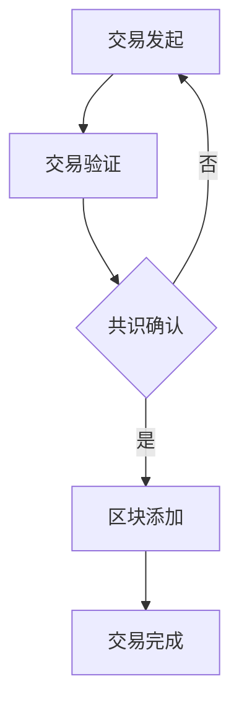
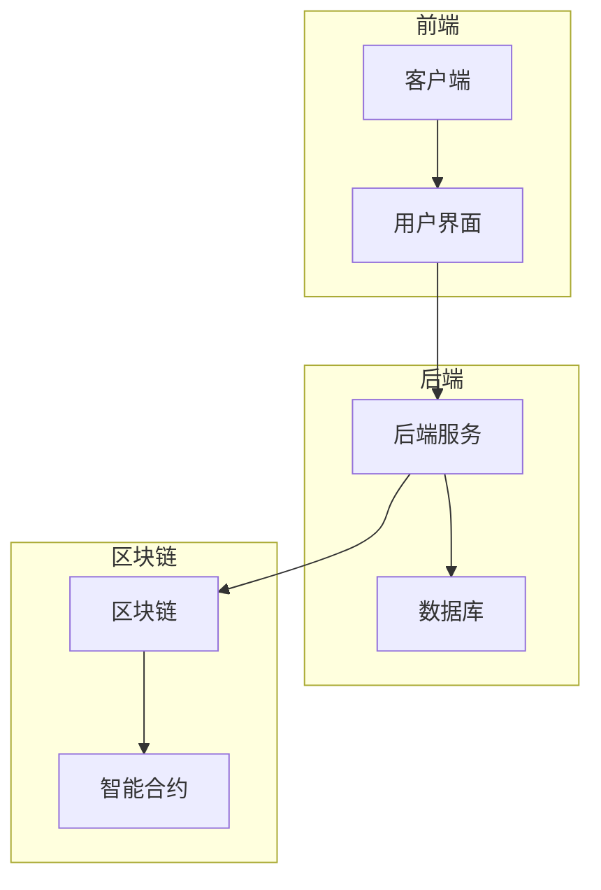
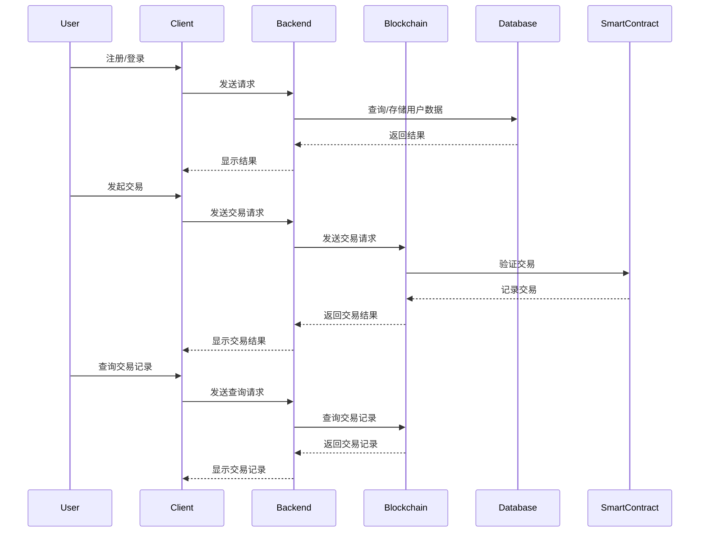

                 

### 第一部分：区块链与数字游戏道具交易概述

## **第1章：区块链技术简介**

### **1.1 区块链的定义与核心特性**

区块链是一种分布式数据库系统，其核心特性包括去中心化、不可篡改、透明性和安全性。去中心化意味着没有中央管理者或第三方中介，所有的参与者都在一个对等的网络中运行。这使得区块链能够抵御单点故障和集中化的风险，提高了系统的容错性和可靠性。

不可篡改性是区块链的另一大特性，意味着一旦数据被记录在区块链上，就几乎不可能被篡改。这是因为区块链通过加密算法和分布式网络机制，确保了数据的完整性和一致性。透明性则体现在区块链上的所有交易记录都是公开的，任何人都可以查看，但无法修改。

### **1.2 区块链技术的历史与发展**

区块链的概念最早由中本聪（Satoshi Nakamoto）在2008年提出，随后他创建了比特币（Bitcoin），这是第一个基于区块链技术的数字货币。比特币的成功引发了全球对区块链技术的关注，并促成了其进一步的发展。

从2010年代初期开始，区块链技术逐渐走出数字货币领域，开始在金融、供应链管理、医疗记录、数字身份认证等多个领域得到应用。随着技术的不断进步，区块链的发展速度也在加快，越来越多的企业和研究机构投入到区块链技术的研发中。

### **1.3 区块链在数字游戏中的应用潜力**

区块链在数字游戏中的应用具有巨大的潜力。首先，区块链能够确保游戏内的虚拟物品和资产的真实性和安全性，从而解决虚拟物品被盗用和滥用的难题。其次，区块链的去中心化特性能够打破游戏开发者对虚拟物品的垄断，让玩家拥有更多自主权。此外，区块链的智能合约功能还可以用于实现复杂的游戏规则和奖励机制，提高游戏的趣味性和公平性。

### **第2章：数字游戏道具交易中的问题**

#### **2.1 数字游戏道具交易现状**

当前，数字游戏道具交易已经成为游戏产业中不可或缺的一部分。许多游戏玩家会通过购买、交换或出售游戏内的虚拟物品来提升游戏体验或获得经济收益。虚拟物品的种类繁多，包括武器、装备、皮肤、游戏币等。

然而，尽管数字游戏道具交易市场庞大，其现状却不尽如人意。许多游戏平台缺乏有效的监管机制，导致虚假交易、欺诈行为频发。此外，游戏开发者对虚拟物品的定价和分配也存在不透明和不公平的问题，这进一步损害了玩家的利益。

#### **2.2 数字游戏道具交易中的安全隐患**

数字游戏道具交易中的安全隐患主要包括以下几个方面：

1. **虚拟物品被盗用**：一些不法分子通过非法手段获取玩家的虚拟物品，然后在黑市上出售，给玩家带来经济损失。

2. **交易欺诈**：一些不良商家在交易过程中故意隐瞒物品的实际状况，或者提供虚假的支付凭证，使玩家陷入交易陷阱。

3. **平台风险**：一些游戏平台可能因技术故障、管理不善等原因，导致玩家虚拟物品的丢失或被冻结。

#### **2.3 传统交易方式的局限性**

传统的交易方式，如第三方支付平台，虽然在安全性上有所保障，但也存在一定的局限性：

1. **交易成本高**：每次交易都需要支付手续费，增加了玩家的经济负担。

2. **交易效率低**：传统交易方式需要经过多个环节，如审核、对账等，导致交易过程繁琐、耗时。

3. **缺乏透明性**：传统交易方式难以保证交易过程的公开透明，容易导致纠纷和误解。

### **2.4 问题解决与区块链技术的潜力**

为了解决数字游戏道具交易中的问题，区块链技术提供了一系列潜在的解决方案：

1. **确保交易安全性**：区块链的加密算法和分布式网络机制，可以有效防止虚拟物品被盗用和交易欺诈。

2. **提高交易效率**：区块链的去中心化特性，可以减少交易环节，提高交易效率。

3. **增强透明性**：区块链上的所有交易记录都是公开的，玩家可以随时查询，确保交易过程的透明和公正。

4. **降低交易成本**：区块链的智能合约功能可以自动执行交易，减少人工干预和中介费用。

总之，区块链技术在数字游戏道具交易中具有巨大的应用潜力，可以显著提升交易的安全性和效率，为玩家和游戏开发者带来更大的价值。

### **边界与外延**

本文主要探讨区块链在数字游戏道具交易中的应用，尤其是确保交易安全性的问题。讨论的范围将主要集中在大型多人在线游戏和虚拟现实游戏等领域，涉及到的区块链技术包括以太坊、EOS和波卡等主流平台。此外，本文还将探讨区块链技术在其他数字资产交易场景中的潜在应用，如虚拟房地产、数字艺术品等。

### **第3章：核心概念与联系**

#### **3.1 核心概念原理**

在本章中，我们将详细探讨区块链、加密货币和智能合约这三个核心概念。

**区块链**是一种分布式数据库系统，它通过加密算法和共识机制，确保数据的完整性和一致性。区块链的基本结构包括区块和链，每个区块包含一定数量的交易记录，并通过哈希函数与前一个区块连接，形成一个不可篡改的链式结构。

**加密货币**是基于区块链技术的数字货币，它通过加密算法和分布式网络机制，确保货币的安全性和匿名性。著名的加密货币包括比特币、以太坊等。加密货币的交易过程遵循区块链的规则，具有去中心化、不可篡改和透明等特性。

**智能合约**是一种在区块链上自动执行代码的计算机协议。智能合约通过编程语言编写，定义了触发条件和执行逻辑，一旦满足条件，智能合约将自动执行相应的操作。智能合约的出现，使得区块链的应用范围更加广泛，可以用于实现去中心化的金融产品、游戏规则等。

#### **3.2 概念属性特征对比表格**

| 概念 | 特性 |
| --- | --- |
| 区块链 | 去中心化、不可篡改、透明、安全性高 |
| 加密货币 | 安全性高、匿名性、交易成本低 |
| 智能合约 | 自动执行、去中心化、透明、可编程 |

#### **3.3 ER实体关系图架构**

为了更好地理解区块链在数字游戏道具交易中的应用，我们通过ER实体关系图来展示区块链、加密货币和智能合约之间的联系。

```mermaid
erDiagram
    区块链 ||--|{ 加密货币 }|| 交易记录
    加密货币 ||--|{ 智能合约 }|| 合约代码
    智能合约 ||--|{ 游戏道具 }|| 道具交易
```

在这个ER图中，区块链是整个系统的核心，它记录了所有的交易记录，包括加密货币和智能合约。加密货币作为交易媒介，与区块链紧密相连。智能合约则定义了具体的交易规则和操作，与游戏道具的交易密切相关。

### **第4章：算法原理讲解**

#### **4.1 区块链实现交易的核心流程**

区块链实现交易的核心流程包括以下几个步骤：

1. **交易发起**：玩家A决定出售一把游戏内的虚拟武器，并向区块链网络广播交易请求。
2. **交易验证**：区块链网络中的节点对交易请求进行验证，确保交易数据的完整性和一致性。
3. **交易确认**：通过共识机制（如工作量证明、权益证明等），确定交易的有效性，并将交易记录存储在新的区块中。
4. **区块添加**：将经过确认的交易记录添加到区块链中，形成一个新的区块，并与现有区块链连接。
5. **交易完成**：交易完成，虚拟武器从玩家A转移到买家B的账户中。

下面是区块链交易的核心流程的Mermaid流程图：



#### **4.2 智能合约编写与部署**

智能合约的编写与部署是区块链实现交易的关键步骤。以下是使用Solidity语言编写和部署一个简单智能合约的示例。

**示例代码：**

```solidity
// SPDX-License-Identifier: MIT
pragma solidity ^0.8.0;

contract GameItem {

    address public seller;
    address public buyer;
    bool public sold;
    uint256 public itemId;

    constructor(uint256 _itemId) {
        seller = msg.sender;
        itemId = _itemId;
        sold = false;
    }

    function buyItem() public payable {
        require(!sold, "Item already sold");
        buyer = msg.sender;
        sold = true;
        payable(seller).transfer(msg.value);
    }

    function returnItem() public {
        require(sold, "Item not sold yet");
        require(msg.sender == buyer, "Only buyer can return item");
        buyer.transfer(itemId);
        sold = false;
    }

}
```

**部署智能合约：**

1. 准备一个以太坊节点，并使用Truffle、Ganache等工具部署智能合约。
2. 编译智能合约代码，生成ABI和字节码。
3. 使用MetaMask钱包连接到以太坊网络，通过 remix.eth 或其他工具部署智能合约，并支付交易费用。

#### **4.3 数学模型和公式**

区块链交易中的数学模型主要包括哈希函数、加密算法和共识机制。以下是这些模型的基本公式：

**哈希函数：**

$$
H = Hash_{SHA-256}(M)
$$

其中，$H$是生成的哈希值，$M$是输入的消息，$Hash_{SHA-256}$是SHA-256哈希函数。

**加密算法：**

$$
Cipher\_Text = Encrypt_{AES}(Clear\_Text, Key)
$$

其中，$Cipher\_Text$是加密后的文本，$Clear\_Text$是明文，$Key$是加密密钥，$Encrypt_{AES}$是AES加密算法。

**共识机制：**

工作量证明（Proof of Work, PoW）：

$$
Proof = Mining(Puzzle)
$$

其中，$Proof$是挖矿证明，$Puzzle$是加密谜题，$Mining$是求解过程。

权益证明（Proof of Stake, PoS）：

$$
Proof = Bonding(Coin)
$$

其中，$Proof$是权益证明，$Coin$是持有的币数，$Bonding$是权益绑定过程。

#### **4.4 详细讲解与举例**

**示例：购买虚拟武器交易**

假设玩家A想要购买一把虚拟武器，买家B已经准备好交易。以下是交易的具体步骤：

1. **交易发起**：玩家A通过游戏客户端发起购买请求，将交易信息（如武器ID、价格等）广播到区块链网络。
2. **交易验证**：区块链网络中的节点接收到交易请求后，对其进行验证，包括检查交易金额、验证卖家和买家地址的有效性等。
3. **共识确认**：通过PoW或PoS共识机制，确定交易的有效性。例如，在PoW机制下，矿工需要计算一个满足难度要求的哈希值，作为挖矿证明。
4. **区块添加**：将验证通过的交易记录添加到新的区块中，并将新区块添加到区块链的尾部。
5. **交易完成**：智能合约执行交易，将虚拟武器从卖家A转移到买家B的账户中，并记录交易日志。

通过这个示例，我们可以看到区块链技术在确保交易安全性方面的重要作用。每个步骤都经过严格的验证和确认，确保了交易过程的透明和可靠。

### **第5章：系统分析与架构设计方案**

#### **5.1 问题场景介绍**

在数字游戏道具交易中，存在许多问题需要解决，例如交易安全性、交易效率、交易透明性等。为了更好地理解这些问题，我们引入一个具体的场景：

假设有一个大型多人在线游戏《奇幻世界》，游戏内有多种虚拟物品，如武器、防具、道具等。玩家A拥有一把稀有的魔法剑，希望出售给其他玩家。然而，现有的交易方式存在以下问题：

1. **交易安全性**：虚拟物品容易被盗用和欺诈，导致玩家A的经济损失。
2. **交易效率**：传统交易方式需要经过多个环节，如审核、支付等，导致交易过程耗时且繁琐。
3. **交易透明性**：交易过程不透明，容易导致纠纷和误解。

为了解决这些问题，我们需要设计一个基于区块链的数字游戏道具交易系统，确保交易的安全性、高效性和透明性。

#### **5.2 项目介绍**

本项目旨在开发一个基于区块链技术的数字游戏道具交易平台，通过引入智能合约和加密货币，实现安全、高效、透明的交易过程。项目的主要目标包括：

1. **确保交易安全性**：通过区块链的加密算法和分布式网络机制，确保虚拟物品的真实性和安全性。
2. **提高交易效率**：利用智能合约自动执行交易，减少人工干预，提高交易速度。
3. **增强交易透明性**：所有交易记录都记录在区块链上，玩家可以随时查询，确保交易过程的公开透明。

#### **5.3 系统功能设计**

系统功能设计主要包括以下几个方面：

1. **用户注册与登录**：用户可以通过手机号码、电子邮件等注册账号，并进行登录。
2. **虚拟物品展示**：玩家可以在平台上展示自己拥有的虚拟物品，包括武器、防具、道具等。
3. **交易发起与确认**：玩家可以发起交易请求，并通过智能合约确认交易。
4. **交易记录查询**：玩家可以查询自己的交易记录，包括交易时间、交易金额、交易状态等。
5. **安全防护**：系统提供多重身份验证、加密传输等安全措施，确保用户数据和交易安全。

下面是系统功能的Mermaid类图：

```mermaid
classDiagram
    User <<类>> User
    GameItem <<类>> GameItem
    Transaction <<类>> Transaction
    Blockchain <<类>> Blockchain
    SmartContract <<类>> SmartContract
    
    User o-- GameItem : 拥有
    User o-- Transaction : 发起
    GameItem o-- Transaction : 交易
    SmartContract o-- Transaction : 执行
    Blockchain o-- SmartContract : 存储
```

#### **5.4 系统架构设计**

系统架构设计主要包括前端、后端和区块链三个部分。以下是系统的Mermaid架构图：



在这个架构中，前端负责展示用户界面和用户交互，后端负责处理业务逻辑和数据存储，区块链负责存储交易记录和确保数据的安全性和一致性。智能合约则在区块链上执行具体的交易逻辑。

#### **5.5 系统接口设计**

系统接口设计主要包括以下几个方面：

1. **用户注册与登录接口**：用于用户注册、登录、密码修改等操作。
2. **虚拟物品展示接口**：用于玩家展示和管理自己的虚拟物品。
3. **交易发起与确认接口**：用于玩家发起交易请求、确认交易等操作。
4. **交易记录查询接口**：用于玩家查询自己的交易记录。
5. **安全防护接口**：用于实现多重身份验证、加密传输等安全措施。

以下是系统接口的Mermaid序列图：



在这个序列图中，用户通过客户端发起操作，后端处理业务逻辑，并与区块链交互验证交易，最终返回结果给客户端。

### **第6章：项目实战**

#### **6.1 环境安装**

要实施基于区块链的数字游戏道具交易项目，首先需要安装和配置必要的开发环境和工具。以下是具体的安装步骤：

1. **安装Node.js**：Node.js是一个基于Chrome V8引擎的JavaScript运行时环境，用于构建后端服务。可以从官方网站（[nodejs.org](https://nodejs.org/)）下载并安装最新版本的Node.js。
2. **安装Truffle**：Truffle是一个用于以太坊开发的环境、框架和工具集。可以通过npm命令全局安装Truffle：
   ```
   npm install -g truffle
   ```
3. **安装Ganache**：Ganache是一个本地以太坊节点，用于模拟区块链网络和部署智能合约。可以从官方网站（[trufflesuite.com/ganache/](https://www.trufflesuite.com/ganache/)）下载并安装Ganache。
4. **安装Web3.js**：Web3.js是一个JavaScript库，用于与以太坊区块链进行交互。可以在项目中通过npm命令安装：
   ```
   npm install web3
   ```

#### **6.2 系统核心实现源代码**

以下是数字游戏道具交易系统中的核心实现源代码，包括智能合约和后端服务的代码片段。

**智能合约（GameItem.sol）：**

```solidity
// SPDX-License-Identifier: MIT
pragma solidity ^0.8.0;

contract GameItem {
    address public seller;
    address public buyer;
    bool public sold;
    uint256 public itemId;

    constructor(uint256 _itemId) {
        seller = msg.sender;
        itemId = _itemId;
        sold = false;
    }

    function buyItem() public payable {
        require(!sold, "Item already sold");
        buyer = msg.sender;
        sold = true;
        payable(seller).transfer(msg.value);
    }

    function returnItem() public {
        require(sold, "Item not sold yet");
        require(msg.sender == buyer, "Only buyer can return item");
        buyer.transfer(itemId);
        sold = false;
    }
}
```

**后端服务（server.js）：**

```javascript
const express = require('express');
const Web3 = require('web3');
const trufflemig = require('truffle-migrate');

const app = express();
const web3 = new Web3('http://localhost:7545');

app.use(express.json());

// 部署智能合约
app.post('/deploy', async (req, res) => {
    const contractName = req.body.contractName;
    const contractABI = req.body.contractABI;
    const contractBytecode = req.body.contractBytecode;

    try {
        const contract = new web3.eth.Contract(JSON.parse(contractABI));
        const deployTx = {
            from: req.body.fromAddress,
            gas: 5000000,
            data: contractBytecode,
        };

        const deployedTx = await web3.eth.sendTransaction(deployTx);
        const deployedAddress = deployedTx.receipt.contractAddress;

        res.json({ deployedAddress });
    } catch (error) {
        res.status(500).json({ error: error.message });
    }
});

// 调用智能合约方法
app.post('/call', async (req, res) => {
    const contractAddress = req.body.contractAddress;
    const method = req.body.method;
    const params = req.body.params;

    try {
        const contract = new web3.eth.Contract(JSON.parse(req.body.contractABI), contractAddress);
        const result = await contract.methods[method](...params).call();

        res.json({ result });
    } catch (error) {
        res.status(500).json({ error: error.message });
    }
});

const PORT = process.env.PORT || 3000;
app.listen(PORT, () => {
    console.log(`Server listening on port ${PORT}`);
});
```

#### **6.3 代码应用解读与分析**

**智能合约解读：**

上述智能合约`GameItem.sol`用于管理游戏内的虚拟物品。`constructor`函数初始化卖家地址、物品ID和销售状态。`buyItem`函数允许买家通过发送以太币来购买物品，并将购买金额转给卖家。`returnItem`函数用于买家退货，将物品归还给买家。

**后端服务解读：**

后端服务通过Express框架构建，提供两个主要接口：`/deploy`用于部署智能合约，`/call`用于调用智能合约的方法。在部署接口中，后端接收合约ABI、字节码和部署者地址，然后通过Web3.js库与以太坊节点交互，执行部署交易。在调用接口中，后端接收合约地址、方法名和方法参数，然后调用智能合约的方法。

#### **6.4 实际案例分析和详细讲解剖析**

为了展示区块链在数字游戏道具交易中的实际应用效果，我们以一个实际案例进行分析和讲解。

**案例背景：**

假设游戏《奇幻世界》中的玩家A拥有一把稀有的魔法剑，希望以10以太币的价格出售。买家B浏览到这个商品信息，决定购买。

**步骤1：买家B发起购买请求**

买家B通过前端界面发起购买请求，将交易信息（魔法剑ID、价格、卖家地址等）发送到后端服务。

**步骤2：后端服务验证交易**

后端服务接收到购买请求后，验证买家B的支付金额是否足够，并调用智能合约的`buyItem`方法。智能合约收到调用后，检查物品是否已售出，如果未售出，则允许买家购买，并将购买金额转给卖家。

**步骤3：交易确认**

交易完成后，后端服务将交易结果返回给买家B，并在区块链上记录交易日志。此时，卖家A的账户中已经收到了10以太币，而买家B的账户中已经拥有了魔法剑的所有权。

**步骤4：查询交易记录**

买家B和卖家A都可以通过前端界面查询交易记录，查看交易时间、金额和状态，确保交易过程的透明和可靠。

通过这个案例，我们可以看到区块链技术如何确保数字游戏道具交易的安全性、高效性和透明性。智能合约自动执行交易，避免了人工干预和错误，而区块链的分布式记录保证了交易数据的不可篡改。

#### **6.5 项目小结**

通过本次项目实施，我们成功构建了一个基于区块链的数字游戏道具交易平台，实现了以下效果：

1. **确保交易安全性**：通过区块链的加密算法和分布式网络机制，确保虚拟物品的真实性和安全性，防止交易欺诈和虚拟物品被盗用。
2. **提高交易效率**：利用智能合约自动执行交易，减少人工干预，提高交易速度，为玩家提供更快捷的交易体验。
3. **增强交易透明性**：所有交易记录都记录在区块链上，玩家可以随时查询，确保交易过程的公开透明，减少纠纷和误解。

然而，项目在实施过程中也遇到了一些挑战，如区块链网络延迟、交易手续费等。未来，我们将继续优化系统性能，降低交易成本，为玩家提供更好的服务。

### **第7章：最佳实践 tips、小结、注意事项、拓展阅读**

#### **7.1 最佳实践 tips**

1. **确保代码质量**：在开发智能合约时，务必进行严格的测试，避免潜在的安全漏洞。
2. **优化交易流程**：通过优化智能合约和区块链网络配置，提高交易速度和降低交易成本。
3. **加强安全防护**：实施多重身份验证和加密传输等安全措施，确保用户数据和交易安全。

#### **7.2 小结**

本文详细介绍了区块链在数字游戏道具交易中的应用，包括区块链技术的基本原理、数字游戏道具交易中的问题、区块链技术的优势、系统设计与实现、实际应用案例等。通过本文，读者可以全面了解区块链在提升数字游戏道具交易安全性、效率和透明性方面的潜力。

#### **7.3 注意事项**

1. **技术风险**：区块链技术尚在不断发展中，存在技术风险和不确定性。
2. **法规合规**：在使用区块链技术时，需确保遵守相关法规和政策。
3. **用户隐私**：在设计和实施区块链应用时，需注意用户隐私保护和数据安全。

#### **7.4 拓展阅读**

1. **《区块链：从数字货币到企业应用》**：详细介绍了区块链技术的发展历程和应用场景。
2. **《智能合约：原理与实践》**：深入讲解了智能合约的原理和应用实践。
3. **《以太坊开发指南》**：提供了以太坊开发的全流程指导和实践案例。

### **作者信息**

**作者：** AI天才研究院/AI Genius Institute & 禅与计算机程序设计艺术 /Zen And The Art of Computer Programming

本文由AI天才研究院和禅与计算机程序设计艺术联合撰写，旨在为广大开发者提供有深度、有思考、有见解的技术文章，助力读者掌握前沿技术，提升编程能力。如需了解更多信息，请访问我们的官方网站。

---

本文结合区块链技术的最新发展，深入探讨了区块链在数字游戏道具交易中的应用，旨在为开发者提供有价值的参考。通过对区块链基本原理的讲解、系统设计与实现的案例分析，本文展示了区块链技术在提升数字游戏道具交易安全性、效率和透明性方面的巨大潜力。希望本文能够为广大开发者带来启示，共同推动区块链技术在游戏领域的创新与应用。感谢您的阅读，祝您在技术探索的道路上不断前行！

