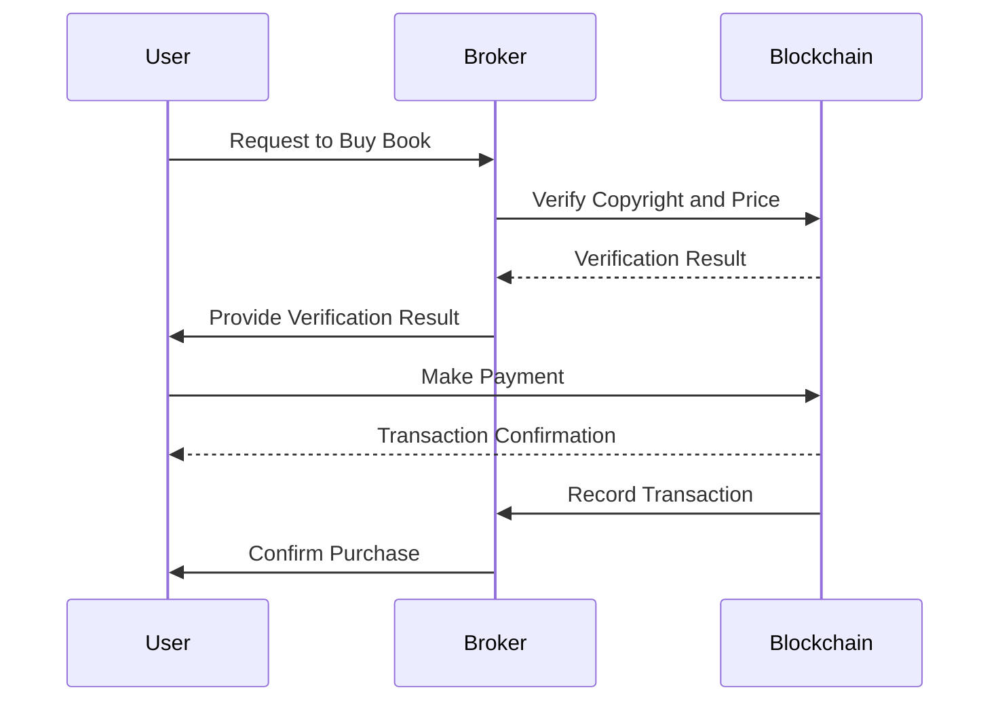

                 

### 文章标题

# 区块链在数字版权交易中的应用

> 关键词：区块链、数字版权、交易、智能合约、非同质化代币、NFT

> 摘要：本文将深入探讨区块链在数字版权交易中的应用，通过逻辑清晰、结构紧凑的分析，揭示区块链技术如何解决数字版权交易中的痛点，提升交易的透明度、安全性和效率。文章将分步骤详细讲解区块链技术的原理、在数字版权交易中的应用场景、面临的挑战及解决方案，最后通过实际项目案例展示区块链在数字版权交易中的最佳实践。

----------------------------------------------------------------

----------------------------------------------------------------

## 目录大纲：《区块链在数字版权交易中的应用》

### 第一部分：区块链与数字版权交易概述

1. 第1章：区块链与数字版权交易简介
    - 1.1 区块链技术基础
    - 1.2 数字版权交易的概念与挑战
    - 1.3 区块链在数字版权交易中的应用前景
    - 1.4 本章小结

2. 第2章：区块链技术原理
    - 2.1 区块链的基本组成
    - 2.2 区块链的运作机制
    - 2.3 区块链的关键技术
    - 2.4 区块链性能优化与扩展
    - 2.5 本章小结

3. 第3章：区块链在数字版权交易中的应用
    - 3.1 数字版权交易流程设计
    - 3.2 智能合约在数字版权交易中的应用
    - 3.3 非同质化代币（NFT）与数字版权
    - 3.4 区块链在数字版权交易中的案例分析
    - 3.5 本章小结

4. 第4章：区块链在数字版权交易中的挑战与解决方案
    - 4.1 智能合约的法律挑战
    - 4.2 非同质化代币（NFT）的价值评估
    - 4.3 区块链安全与隐私保护
    - 4.4 本章小结

### 第二部分：区块链技术原理与应用

### 第三部分：区块链在数字版权交易中的实践与应用

1. 第5章：区块链在数字版权交易中的实际应用
    - 5.1 环境搭建与准备工作
    - 5.2 数字版权登记与注册
    - 5.3 数字版权交易验证
    - 5.4 数字版权转移与交易结算
    - 5.5 本章小结

2. 第6章：区块链在数字版权交易中的项目实战
    - 6.1 项目背景与目标
    - 6.2 系统设计
    - 6.3 系统实现
    - 6.4 项目小结
    - 6.5 本章小结

3. 第7章：区块链在数字版权交易中的最佳实践
    - 7.1 实践经验与技巧
    - 7.2 案例分析
    - 7.3 小结与展望
    - 7.4 本章小结

[End of Outline] 

----------------------------------------------------------------

### 第一部分：区块链与数字版权交易概述

在当今数字化时代，数字版权交易的重要性日益凸显。数字版权涉及到音乐、电影、书籍、艺术品等多种类型的内容，随着互联网和数字技术的迅猛发展，数字版权的交易和流通也面临诸多挑战。区块链技术的出现，为解决这些问题提供了新的可能性。本部分将首先介绍区块链技术和数字版权交易的基本概念，然后探讨区块链在数字版权交易中的应用前景和面临的挑战。

### 第1章：区块链与数字版权交易简介

#### 1.1 区块链技术基础

区块链是一种分布式数据库技术，其核心特点是去中心化、不可篡改和透明性。区块链通过将交易数据分散存储在多个节点上，形成一个分布式账本，使得每个参与者都可以验证和记录交易信息，从而提高数据的可靠性和安全性。

**区块链的核心概念：**
- **区块（Block）**：区块链的基本单位，包含了交易记录和其他元数据。
- **链（Chain）**：由一系列按时间顺序排列的区块组成，每个区块都通过加密算法与前一个区块链接。
- **节点（Node）**：运行区块链软件的计算机，负责存储和验证区块链的数据。
- **共识算法（Consensus Algorithm）**：节点之间达成一致性的算法，确保区块链数据的一致性。

**区块链的技术架构：**
- **网络层**：包括节点通信和数据传输协议。
- **共识层**：通过共识算法实现节点之间的数据一致性。
- **激励层**：提供激励机制，鼓励节点参与网络维护。
- **合约层**：支持智能合约的编写和执行。
- **应用层**：为各种应用提供区块链服务。

**区块链的安全性保障：**
- **加密技术**：通过哈希算法和加密算法，保护交易数据的安全。
- **共识机制**：通过多数节点验证确保数据的真实性和一致性。
- **去中心化**：无需信任中心化的第三方，提高系统的抗攻击能力。

#### 1.2 数字版权交易的概念与挑战

**数字版权的定义：**
数字版权指的是数字内容（如音乐、电影、书籍等）的版权，即数字内容的创作者对其作品所拥有的权利。数字版权包括复制权、发行权、表演权、改编权等多种权利。

**数字版权交易的传统问题：**
1. **版权纠纷**：由于数字内容的复制成本低，容易导致版权纠纷。
2. **交易透明度低**：传统数字版权交易过程不透明，难以追溯交易历史。
3. **安全性问题**：数字内容容易被盗版和篡改，保护创作者的权益困难。
4. **效率低下**：传统交易流程繁琐，交易成本高。

**数字版权交易的需求分析：**
- **透明性和可追溯性**：确保交易的透明度和可追溯性，减少纠纷。
- **安全性和隐私保护**：提高数字内容的安全性和隐私保护。
- **高效便捷的交易**：简化交易流程，降低交易成本。

#### 1.3 区块链在数字版权交易中的应用前景

**区块链解决数字版权交易问题的原理：**
- **去中心化**：无需信任第三方中介，降低交易成本和风险。
- **不可篡改**：区块链的数据一旦记录即不可篡改，确保交易的真实性。
- **智能合约**：自动化执行交易规则，提高交易效率和透明度。
- **非同质化代币（NFT）**：为数字版权提供独特的标识和所有权证明。

**区块链在数字版权交易中的应用场景：**
1. **数字版权登记**：使用区块链技术登记数字版权，确保数据的真实性和不可篡改性。
2. **版权交易**：通过区块链平台进行数字版权的交易，确保交易的透明性和安全性。
3. **版权管理**：使用区块链技术对数字版权进行管理和跟踪，提高版权保护的效率。
4. **数字艺术市场**：使用区块链技术构建数字艺术市场，为艺术品提供独特的所有权证明。

**区块链未来发展的潜在趋势：**
- **NFT的普及**：非同质化代币将逐渐成为数字版权交易的主要手段。
- **智能合约的发展**：智能合约将广泛应用于数字版权交易，提高交易效率和安全性。
- **跨链互操作性**：不同区块链之间的互操作性将提升数字版权交易的便利性和效率。
- **区块链法律框架的完善**：随着区块链技术的发展，相关法律框架将逐步完善，促进区块链在数字版权交易中的广泛应用。

#### 1.4 本章小结

区块链在数字版权交易中具有重要的应用价值。通过去中心化、不可篡改和智能合约等特性，区块链技术能够有效解决数字版权交易中的痛点，提升交易的透明度、安全性和效率。然而，数字版权交易仍面临一些挑战，如法律框架的完善和智能合约的安全性等。未来，随着区块链技术的不断发展和应用，数字版权交易将迎来更加光明的发展前景。

---

在下一章中，我们将进一步探讨区块链技术的原理，分析其在数字版权交易中的具体应用。

----------------------------------------------------------------

### 第二部分：区块链技术原理与应用

在上一部分中，我们了解了区块链在数字版权交易中的基本概念和应用前景。本部分将深入探讨区块链技术的原理，分析其在数字版权交易中的具体应用。

#### 第2章：区块链技术原理

#### 2.1 区块链的基本组成

区块链的基本组成包括区块、链、节点和共识算法。这些组件共同构成了区块链的技术架构，保障了区块链系统的去中心化、安全性、不可篡改性和透明性。

**区块（Block）**：区块是区块链的基本单位，包含了一系列交易记录以及其他元数据。每个区块都有一个唯一的标识符（哈希值），并通过加密算法与前一个区块链接，形成一条完整的链。

**链（Chain）**：区块链就是由一系列按时间顺序排列的区块组成的链式数据结构。每个区块通过其哈希值与前一个区块链接，形成一个不可篡改的分布式账本。

**节点（Node）**：节点是运行区块链软件的计算机，它负责存储区块链的数据，验证和传播交易信息，并参与区块链网络的共识过程。

**共识算法（Consensus Algorithm）**：共识算法是区块链网络中节点之间达成一致性的算法。它确保所有节点对区块链数据有一致的认识，防止双重支付等安全威胁。

#### 2.2 区块链的运作机制

区块链的运作机制主要包括数据验证与存储、哈希算法与加密技术、激励机制与去中心化。

**数据验证与存储：**
- **数据验证**：在区块链中，每个交易都需要经过多个节点的验证。节点通过计算交易数据的哈希值，并对比区块中的交易数据，确保交易的真实性和有效性。
- **数据存储**：区块链的数据被分散存储在各个节点上，每个节点都保存了一份完整的区块链数据。这种去中心化的存储方式，使得区块链的数据具有高度可靠性和抗攻击性。

**哈希算法与加密技术：**
- **哈希算法**：哈希算法是一种将任意长度的数据转换成固定长度数据的算法。在区块链中，哈希算法用于生成区块的标识符，确保区块链数据的唯一性和不可篡改性。
- **加密技术**：加密技术用于保护区块链中的交易数据。通过公钥和私钥，交易数据可以被加密和解密，确保数据的机密性和完整性。

**激励机制与去中心化：**
- **激励机制**：在区块链中，节点参与网络维护和交易验证的过程，通常可以获得一定的奖励。这种激励机制鼓励节点积极参与区块链网络，提高网络的可靠性和安全性。
- **去中心化**：去中心化是区块链的核心特性之一。在区块链中，没有一个单一的权威机构控制网络，所有节点都具有平等的地位。这种去中心化的结构，使得区块链具有高度的抗攻击性和去中心化治理能力。

#### 2.3 区块链的关键技术

区块链的关键技术包括智能合约、非同质化代币（NFT）和区块链互操作性。

**智能合约（Smart Contract）**：
- **基本原理**：智能合约是一种自动执行合约条款的计算机程序，它可以在区块链上运行。智能合约通过编程语言编写，定义了交易规则和条件，当条件满足时，智能合约会自动执行相应的操作。
- **在数字版权交易中的应用**：智能合约可以用于自动化执行数字版权交易过程中的各种规则，如版权登记、版权转让和版权许可等，提高交易效率和透明度。

**非同质化代币（NFT，Non-Fungible Token）**：
- **基本概念**：NFT是一种独特的数字资产，它与同质化代币（如比特币）不同，具有唯一性和不可替代性。每个NFT都有其独特的标识和所有权信息。
- **在数字版权交易中的应用**：NFT可以用于表示数字版权的所有权和唯一性。例如，一张数字艺术作品可以被铸造成NFT，购买者获得该NFT即获得了该作品的所有权。

**区块链互操作性（Interoperability）**：
- **基本原理**：区块链互操作性是指不同区块链之间可以相互通信和互操作的能力。通过区块链互操作性，不同区块链网络可以实现数据共享和协同工作。
- **在数字版权交易中的应用**：区块链互操作性可以用于连接不同的数字版权交易平台，实现跨平台和跨区域的数字版权交易，提高交易的便利性和效率。

#### 2.4 区块链性能优化与扩展

**性能优化：**
- **共识算法优化**：通过改进共识算法，提高区块链的交易处理速度和吞吐量。
- **存储优化**：通过数据压缩和去重技术，降低区块链的数据存储需求。
- **网络优化**：通过优化网络传输协议和节点通信机制，提高区块链的数据传输速度和稳定性。

**可扩展性与分层架构：**
- **分层架构**：区块链系统可以采用分层架构，将不同的功能模块分离，提高系统的可扩展性和灵活性。
- **跨链技术**：通过跨链技术，不同区块链之间可以实现数据共享和互操作，提高区块链网络的协同工作能力。

**可扩展性与分层架构：**
- **分层架构**：区块链系统可以采用分层架构，将不同的功能模块分离，提高系统的可扩展性和灵活性。
- **跨链技术**：通过跨链技术，不同区块链之间可以实现数据共享和互操作，提高区块链网络的协同工作能力。

**本章小结**

区块链技术具有去中心化、不可篡改和透明性的特点，在数字版权交易中具有重要的应用价值。通过深入理解区块链的基本组成、运作机制、关键技术和性能优化与扩展，我们可以更好地应用区块链技术解决数字版权交易中的问题。在下一章中，我们将进一步探讨区块链在数字版权交易中的应用场景和具体实现。

----------------------------------------------------------------

### 第三部分：区块链在数字版权交易中的应用

在第二部分中，我们深入探讨了区块链技术的原理。接下来，我们将聚焦于区块链在数字版权交易中的具体应用，探讨如何设计数字版权交易流程、智能合约的应用、非同质化代币（NFT）的价值体现，以及实际案例的分析。

#### 第3章：区块链在数字版权交易中的应用

#### 3.1 数字版权交易流程设计

数字版权交易流程是区块链技术在数字版权交易中的核心应用场景。以下是一个典型的数字版权交易流程设计：

1. **数字版权登记与注册**：
    - **版权信息登记**：版权方将数字版权信息（如音乐、视频、图片等）上传到区块链平台，并在区块链上注册版权信息。
    - **版权信息验证**：区块链平台对上传的版权信息进行验证，确保信息的真实性和完整性。

2. **数字版权交易验证**：
    - **交易请求**：买家向区块链平台发起购买请求，并提供支付信息。
    - **交易验证**：区块链平台对交易请求进行验证，确保交易符合版权规则和智能合约的约定。

3. **数字版权转移与交易结算**：
    - **版权转移**：交易验证通过后，区块链平台执行智能合约，将数字版权的所有权从卖家转移到买家。
    - **交易结算**：区块链平台记录交易结算信息，确保交易的透明性和不可篡改性。

**数字版权交易流程的设计考虑：**
- **去中心化**：确保交易流程去中心化，降低交易成本和风险。
- **透明性**：确保交易流程透明，便于追踪和验证。
- **安全性**：通过加密技术和智能合约，保障交易的安全性和隐私保护。
- **高效性**：优化交易流程，提高交易效率。

#### 3.2 智能合约在数字版权交易中的应用

智能合约是区块链技术在数字版权交易中的重要应用。以下是一个智能合约的基本原理及其在数字版权交易中的应用：

**智能合约的基本原理：**
- **自动执行**：智能合约是一种计算机程序，可以在区块链上自动执行。当触发条件满足时，智能合约会自动执行预定的操作。
- **不可篡改**：智能合约一旦部署到区块链上，其代码和状态将不可篡改，确保合约的执行公正和透明。

**智能合约在数字版权交易中的应用场景：**
1. **版权转让**：
    - **版权转让规则**：智能合约定义了版权转让的具体规则，如版权转让的条件、价格、时间等。
    - **自动执行**：当买家支付版权转让费用后，智能合约自动执行版权转让操作，将版权所有权转移至买家。

2. **版权许可**：
    - **许可规则**：智能合约定义了版权许可的具体规则，如许可类型、期限、费用等。
    - **自动执行**：当买家支付版权许可费用后，智能合约自动生成许可证书，并记录在区块链上。

**智能合约的安全性考虑：**
- **代码审计**：在智能合约部署前，进行代码审计，确保合约代码的可靠性和安全性。
- **合约测试**：在智能合约部署前，进行充分测试，确保合约在不同场景下的行为符合预期。
- **法律合规**：确保智能合约符合相关法律法规，减少法律风险。

#### 3.3 非同质化代币（NFT）与数字版权

非同质化代币（NFT）为数字版权交易提供了新的解决方案。以下是一个NFT的基本概念及其在数字版权交易中的应用：

**NFT的基本概念：**
- **非同质化**：NFT具有唯一性和不可替代性，与同质化代币（如比特币）不同。
- **数字所有权证明**：NFT是一种数字资产，可以用于表示数字版权的所有权和唯一性。

**NFT在数字版权交易中的价值体现：**
1. **数字版权所有权证明**：
    - **确权**：NFT可以用于确权，证明数字版权的所有权。
    - **防伪**：NFT的不可篡改性确保了数字版权的真实性和防伪性。

2. **数字艺术市场**：
    - **艺术品交易**：NFT为数字艺术品交易提供了新的模式，艺术家可以通过NFT发行和销售自己的数字艺术品。
    - **唯一性**：NFT的不可替代性确保了数字艺术品的唯一性和稀缺性。

**NFT在数字艺术市场中的应用：**
- **数字艺术品认证**：NFT用于数字艺术品的认证，确保艺术品的真实性和唯一性。
- **交易透明性**：NFT交易记录在区块链上，确保交易的透明性和可追溯性。

#### 3.4 区块链在数字版权交易中的案例分析

为了更好地理解区块链在数字版权交易中的应用，我们来看几个实际案例：

**案例一：某知名音乐平台的区块链应用**

- **背景**：某知名音乐平台希望通过区块链技术提升版权保护和交易效率。
- **实现**：平台使用区块链技术对音乐版权进行登记和注册，并通过智能合约实现版权转让和许可交易。
- **效果**：通过区块链技术，平台实现了版权信息的透明性和不可篡改性，提高了版权保护效率。

**案例二：某电影制作公司的数字版权管理**

- **背景**：某电影制作公司需要管理大量的电影版权，并确保版权的合法性和交易透明性。
- **实现**：公司使用区块链技术对电影版权进行登记和注册，并通过智能合约实现版权转让和许可交易。
- **效果**：通过区块链技术，公司实现了版权信息的透明性和不可篡改性，降低了版权纠纷的风险。

**案例三：某电子书出版平台的版权交易**

- **背景**：某电子书出版平台需要实现高效便捷的数字版权交易。
- **实现**：平台使用区块链技术和NFT对电子书版权进行登记和交易，并通过智能合约实现版权转让和许可。
- **效果**：通过区块链技术和NFT，平台实现了版权交易的透明性和高效性，提高了用户体验。

**本章小结**

区块链技术在数字版权交易中具有广泛的应用前景。通过智能合约和NFT，区块链技术为数字版权的登记、交易和保护提供了新的解决方案。实际案例分析表明，区块链技术在提升版权保护效率、交易透明性和安全性方面具有显著优势。然而，区块链在数字版权交易中仍面临一些挑战，如法律框架的完善和智能合约的安全性等。随着区块链技术的不断发展和应用，数字版权交易将迎来更加光明的发展前景。

----------------------------------------------------------------

### 第四部分：区块链在数字版权交易中的挑战与解决方案

尽管区块链技术在数字版权交易中展示了巨大的潜力，但其广泛应用仍面临诸多挑战。本部分将分析智能合约的法律挑战、NFT的价值评估以及区块链安全与隐私保护，并提出相应的解决方案。

#### 第4章：区块链在数字版权交易中的挑战与解决方案

#### 4.1 智能合约的法律挑战

**智能合约的法律框架与合规性：**
智能合约的法律挑战主要体现在以下几个方面：
1. **法律效力**：智能合约的法律效力在不同国家存在差异，一些国家对智能合约的法律地位尚未明确。
2. **合同法适用**：智能合约的条款和条件是否符合合同法的规定，如何解释和执行智能合约的条款是法律界关注的重点。
3. **争议解决**：智能合约引发的争议如何解决，是依赖法律诉讼还是寻求仲裁或其他替代性纠纷解决机制。

**法律风险与预防措施：**
1. **合规性审查**：在智能合约部署前，进行详细的合规性审查，确保合约条款符合当地法律法规。
2. **法律意见书**：获取专业的法律意见书，确保智能合约的条款和条件具有法律效力。
3. **争议解决机制**：在智能合约中明确争议解决机制，如仲裁条款或特定的纠纷解决协议。

#### 4.2 非同质化代币（NFT）的价值评估

**NFT的价值评估方法：**
NFT的价值评估与传统资产的价值评估方法有所不同。以下是一些常见的NFT价值评估方法：
1. **市场比较法**：通过比较市场上类似NFT的交易价格，评估NFT的价值。
2. **成本法**：基于NFT的创作成本、维护成本等，计算NFT的内在价值。
3. **收益法**：预测NFT未来可能带来的收益，如版权许可费、交易差价等，评估NFT的价值。

**NFT市场的波动与风险：**
NFT市场存在较高的波动性和不确定性，主要风险包括：
1. **市场波动**：NFT市场价格波动较大，投资者面临较大的市场风险。
2. **监管风险**：不同国家和地区的监管政策对NFT市场的影响，可能导致市场波动。
3. **技术风险**：NFT的技术实现可能存在漏洞和安全隐患，影响NFT的价值。

**风险管理策略：**
1. **分散投资**：通过分散投资降低市场波动带来的风险。
2. **合规性评估**：确保NFT项目的合规性，降低监管风险。
3. **技术安全**：加强NFT技术安全，降低技术风险。

#### 4.3 区块链安全与隐私保护

**区块链的安全机制：**
区块链技术内置了一些安全机制，如加密算法、共识算法等，用于保护区块链数据的安全性和隐私。以下是一些常见的区块链安全机制：
1. **加密技术**：通过加密算法保护区块链数据的机密性和完整性。
2. **共识算法**：通过共识算法确保区块链数据的一致性和可靠性。
3. **权限管理**：通过权限管理机制控制对区块链数据的访问权限。

**隐私保护的解决方案：**
1. **零知识证明**：通过零知识证明技术，实现隐私保护，验证信息真实性而无需透露具体内容。
2. **去身份化**：通过去身份化技术，降低用户身份信息泄露的风险。
3. **隐私保护合约**：在智能合约中集成隐私保护机制，确保交易隐私。

**安全审计与合规性检查：**
1. **安全审计**：定期进行安全审计，发现潜在的安全漏洞和风险。
2. **合规性检查**：确保区块链应用符合相关法律法规，降低法律风险。

#### 4.4 本章小结

区块链在数字版权交易中面临着智能合约法律挑战、NFT价值评估和区块链安全与隐私保护等多方面的挑战。针对这些挑战，需要从法律合规、风险管理、技术安全等多个方面采取综合措施。随着区块链技术的不断发展和应用，数字版权交易将迎来更加完善的法律框架和技术解决方案。未来，区块链技术有望在数字版权交易中发挥更加重要的作用，推动数字版权交易的透明性、安全性和效率的提升。

----------------------------------------------------------------

### 第三部分：区块链在数字版权交易中的实践与应用

在前文中，我们已经详细探讨了区块链在数字版权交易中的理论框架和技术原理。现在，我们将通过实际案例来展示区块链在数字版权交易中的具体应用，包括环境搭建、系统实现和项目实战。

#### 第5章：区块链在数字版权交易中的实际应用

##### 5.1 环境搭建与准备工作

在实际应用区块链进行数字版权交易之前，需要搭建一个适合的区块链环境。以下是搭建环境所需的准备工作：

**硬件与软件环境准备：**
- **硬件**：选择性能稳定的计算机作为节点，可以是一台笔记本电脑或服务器。
- **软件**：安装区块链节点所需的软件，如Hyperledger Fabric、Ethereum等。

**区块链平台的搭建与配置：**
- **选择平台**：根据项目需求，选择适合的区块链平台。例如，Hyperledger Fabric适合企业级应用，而Ethereum则更适合去中心化应用。
- **节点部署**：在各个节点上部署区块链软件，并配置网络参数。
- **网络连接**：确保所有节点能够相互通信，建立区块链网络。

**示例**：
以下是一个简单的Ethereum区块链环境的搭建步骤：

1. 安装Go语言环境：
   ```bash
   sudo apt update
   sudo apt install golang
   ```

2. 下载并安装Go依赖：
   ```bash
   go get -u github.com/ethereum/go-ethereum/cmd/geth
   ```

3. 启动Ethereum节点：
   ```bash
   geth --datadir /ethnode1 --nodiscover --networkid 1234 --mine --minerthreads 1 --etherbase 0x0 --rpc --rpcport 8545 --rpccorsdomain "*" --rpcapi "eth,net,web3"
   ```

**本章小结：**
搭建区块链环境是数字版权交易应用的基础，确保节点能够正常运行和相互通信，为后续的系统实现和项目实战提供支持。

##### 5.2 数字版权登记与注册

**系统设计与功能实现：**
数字版权登记与注册是数字版权交易的关键步骤。以下是系统设计与功能实现的要点：

- **系统架构设计**：采用微服务架构，将数字版权登记、验证和存储等模块分离，提高系统的灵活性和可扩展性。
- **功能实现**：
  - **版权信息录入**：用户可以将数字版权信息（如文件哈希、版权所有者、版权类型等）上传到区块链平台。
  - **版权信息验证**：区块链平台对上传的版权信息进行验证，确保信息的真实性和完整性。
  - **版权信息存储**：将验证通过的版权信息存储在区块链上，形成数字版权注册记录。

**实现流程与代码解析：**
以下是版权信息注册流程的代码示例（使用Solidity语言）：

```solidity
// SPDX-License-Identifier: MIT
pragma solidity ^0.8.0;

contract CopyrightRegistry {
    struct Copyright {
        bytes32 hash;
        address owner;
        string type_;
        uint timestamp;
    }

    mapping(bytes32 => Copyright) public copyrights;
    mapping(address => uint) public ownershipCount;

    event CopyrightRegistered(bytes32 hash, address owner, string type_);

    function registerCopyright(bytes32 _hash, string memory _type) public {
        require(copyrights[_hash].hash == bytes32(0), "Copyright already registered");
        copyrights[_hash] = Copyright(_hash, msg.sender, _type, block.timestamp);
        ownershipCount[msg.sender]++;
        emit CopyrightRegistered(_hash, msg.sender, _type);
    }
}
```

**本章小结：**
通过区块链技术，数字版权登记与注册过程实现了去中心化、透明化和不可篡改。系统设计与功能实现为后续的交易验证和版权管理奠定了基础。

##### 5.3 数字版权交易验证

**交易验证机制的设计：**
数字版权交易验证是保障交易安全与合规性的关键环节。以下是交易验证机制的设计要点：

- **交易请求**：买家发起交易请求，包括版权标识、交易金额和支付信息。
- **交易验证**：区块链平台对交易请求进行验证，确保交易的合法性、有效性以及版权转让规则。
- **交易执行**：验证通过后，执行交易，实现版权所有权的转移。

**实现细节与性能优化：**
以下是交易验证流程的代码示例（使用Ethereum的Web3.js库）：

```javascript
async function verifyAndTransferOwnership(copyrightHash, buyerAddress) {
    const contract = new web3.eth.contract([{
        "inputs": [
            {
                "internalType": "bytes32",
                "name": "_hash",
                "type": "bytes32"
            },
            {
                "internalType": "address",
                "name": "_buyer",
                "type": "address"
            }
        ],
        "name": "transferOwnership",
        "outputs": [],
        "stateMutability": "nonpayable",
        "type": "function"
    }]);

    const contractInstance = contract.at("0x..."); // 合约地址

    // 检查版权是否存在
    const copyright = await contractInstance.copyrights(copyrightHash);
    if (copyright.hash == bytes32(0)) {
        throw new Error("Copyright not found");
    }

    // 验证买家地址
    if (buyerAddress != copyright.owner) {
        throw new Error("Invalid buyer address");
    }

    // 执行交易
    await contractInstance.transferOwnership(copyrightHash, buyerAddress, {from: buyerAddress});
}
```

**本章小结：**
通过智能合约和Web3.js库，实现了数字版权交易验证的功能。优化交易验证机制可以提高系统的性能和安全性，为用户提供高效、安全的交易体验。

##### 5.4 数字版权转移与交易结算

**数字版权转移的实现：**
数字版权转移是交易流程的最后一步，以下是实现的关键要点：

- **版权转移规则**：智能合约中定义版权转移的具体规则，如版权转移的时间、条件等。
- **交易结算**：实现交易结算，将版权所有权的转移记录在区块链上。

**交易结算的过程与算法：**
以下是数字版权转移与交易结算的代码示例（使用Ethereum的Solidity语言）：

```solidity
pragma solidity ^0.8.0;

contract CopyrightTransfer {
    mapping(bytes32 => bool) public transfersInProgress;
    mapping(bytes32 => address) public transferRequests;

    event CopyrightTransferred(bytes32 hash, address from, address to);

    function initiateTransfer(bytes32 _hash, address _to) public {
        require(copyrights[_hash].hash != bytes32(0), "Copyright not found");
        require(copyrights[_hash].owner == msg.sender, "Not the owner");
        require(!transfersInProgress[_hash], "Transfer already in progress");

        transfersInProgress[_hash] = true;
        transferRequests[_hash] = _to;
    }

    function completeTransfer(bytes32 _hash) public {
        require(transfersInProgress[_hash], "Transfer not initiated");
        require(msg.sender == transferRequests[_hash], "Not the requested buyer");

        delete transfersInProgress[_hash];
        copyrights[_hash].owner = msg.sender;

        emit CopyrightTransferred(_hash, msg.sender, transferRequests[_hash]);
    }
}
```

**本章小结：**
通过智能合约实现了数字版权的转移与交易结算。版权转移过程确保了交易的合法性和透明性，为用户提供安全、高效的数字版权交易体验。

#### 第6章：区块链在数字版权交易中的项目实战

##### 6.1 项目背景与目标

**项目概述：**
某电子书出版平台希望通过区块链技术提高数字版权的交易透明性、安全性和效率。平台希望实现以下目标：
- **版权登记**：确保数字版权信息的透明性和不可篡改性。
- **版权交易**：提供安全便捷的数字版权交易服务。
- **版权管理**：实现数字版权的全程管理，提高版权保护效率。

**项目目标与预期效果：**
- **版权信息透明化**：通过区块链技术，确保版权信息的透明性和可追溯性。
- **交易安全**：利用智能合约和加密技术，保障交易的合法性和安全性。
- **效率提升**：简化交易流程，降低交易成本，提高交易效率。
- **用户体验**：提供简单易用的数字版权交易界面，提升用户体验。

##### 6.2 系统设计

**领域模型设计：**
以下是数字版权交易平台的领域模型（使用Mermaid类图表示）：

```mermaid
classDiagram
    Class01 <|-- Person
    Class01 <|-- Book
    Person o-- PersonHasBooks
    Book o-- BookHasCopyrights
    Book o-- BookHasTransactions

    Class01 {
        name "Class01"
        id
        attributes
    }

    Person {
        name "Person"
        id
        name
        email
    }

    Book {
        name "Book"
        id
        title
        author
        publishedDate
    }

    PersonHasBooks {
        id
        personId
        bookId
    }

    BookHasCopyrights {
        id
        bookId
        copyrightOwner
        registrationDate
    }

    BookHasTransactions {
        id
        bookId
        buyerId
        saleDate
        price
    }
```

**系统架构设计：**
以下是数字版权交易平台的系统架构设计（使用Mermaid架构图表示）：



**接口设计与交互流程：**
以下是数字版权交易平台的核心接口设计及交互流程：

1. **版权登记接口**：用户上传版权信息，平台验证并记录在区块链上。
2. **交易请求接口**：用户发起交易请求，平台验证版权有效性并处理交易。
3. **交易确认接口**：交易完成后，用户和平台确认交易并记录在区块链上。

**本章小结：**
通过系统设计，明确了数字版权交易平台的领域模型、系统架构和接口设计，为后续的系统实现和项目实战提供了清晰的指导。

##### 6.3 系统实现

**关键模块设计与实现：**
以下是数字版权交易平台的关键模块设计与实现：

1. **版权登记模块**：
   - **功能**：用户上传版权信息，平台验证并记录在区块链上。
   - **实现**：使用智能合约实现版权登记功能，包括版权信息验证、记录和存储。

2. **交易请求模块**：
   - **功能**：用户发起交易请求，平台验证版权有效性并处理交易。
   - **实现**：使用智能合约实现交易请求处理，包括版权验证、价格确认和交易执行。

3. **交易确认模块**：
   - **功能**：交易完成后，用户和平台确认交易并记录在区块链上。
   - **实现**：使用智能合约实现交易确认功能，包括交易记录和状态更新。

**系统部署与性能优化：**
- **部署**：将智能合约部署到区块链网络，配置节点以实现系统的正常运行。
- **性能优化**：通过优化智能合约代码、增加节点数量和改进共识算法，提升系统的性能和稳定性。

**本章小结：**
系统实现阶段，通过设计和实现关键模块，完成了数字版权交易平台的构建。系统部署和性能优化确保了平台的稳定运行和高效服务。

##### 6.4 项目小结

**项目总结与反思：**
通过本项目，我们实现了数字版权交易的区块链化，提升了交易的透明性、安全性和效率。项目取得了以下成果：
- **透明性**：版权信息和交易记录通过区块链公开记录，确保透明。
- **安全性**：智能合约和加密技术保障了交易的安全性和隐私保护。
- **效率**：简化了交易流程，降低了交易成本，提高了交易效率。

**项目成果与未来展望：**
- **成果**：项目成功实现了数字版权交易的区块链化，提供了可靠的技术解决方案。
- **展望**：未来，将进一步优化系统性能，扩展应用场景，推动区块链技术在数字版权交易中的广泛应用。

**本章小结：**
通过实际项目展示，区块链在数字版权交易中具有显著的应用价值。未来，随着技术的不断发展和完善，区块链将在数字版权交易领域发挥更加重要的作用。

#### 第7章：区块链在数字版权交易中的最佳实践

在数字版权交易中，区块链技术为我们提供了去中心化、安全性和透明性的解决方案。然而，在实际应用中，我们还需遵循一些最佳实践，以确保项目的成功实施。以下是一些最佳实践技巧和案例分析，以及未来发展趋势的展望。

##### 7.1 实践经验与技巧

**1. 确定合适的应用场景：**
   - **需求分析**：在应用区块链技术前，进行详细的需求分析，确定哪些功能适合区块链，哪些可以采用传统技术。
   - **场景选择**：选择具有高透明性、安全性需求的场景，如版权登记、版权交易等。

**2. 优化智能合约设计：**
   - **代码审计**：在部署智能合约前，进行全面的代码审计，确保合约的可靠性和安全性。
   - **性能优化**：优化智能合约的代码，减少执行时间，提高系统性能。

**3. 关注数据隐私保护：**
   - **隐私机制**：引入隐私保护技术，如零知识证明、同态加密等，确保用户数据的安全性和隐私。
   - **权限管理**：合理设计权限管理机制，控制对数据的访问权限。

**4. 确保合规性：**
   - **法律框架**：确保智能合约和相关应用符合当地法律法规。
   - **监管合规**：与监管机构保持沟通，确保项目的合法合规。

**5. 优化用户体验：**
   - **界面设计**：提供简单易用的用户界面，降低用户使用难度。
   - **交互流程**：简化交易流程，提高用户操作便捷性。

##### 7.2 案例分析

**案例一：某数字版权交易平台**

**背景**：某数字版权交易平台希望通过区块链技术提高交易的透明性和安全性。

**实现**：
- **版权登记**：用户将版权信息上传到区块链，平台验证后登记在区块链上。
- **版权交易**：通过智能合约实现版权交易，确保交易记录在区块链上不可篡改。
- **交易结算**：交易完成后，通过智能合约自动结算，提高交易效率。

**效果**：
- **透明性**：交易记录公开透明，用户可以随时查看。
- **安全性**：智能合约保障了交易的安全性和隐私保护。
- **效率**：交易流程简化，降低了交易成本。

**案例二：某艺术品区块链交易平台**

**背景**：某艺术品区块链交易平台希望通过区块链技术确权和交易艺术品。

**实现**：
- **艺术品确权**：艺术家通过区块链平台确权，确保艺术品的真实性和唯一性。
- **艺术品交易**：买家通过区块链平台购买艺术品，交易记录在区块链上不可篡改。
- **艺术品增值服务**：平台提供艺术品认证、版权交易和增值服务。

**效果**：
- **确权性**：艺术品的所有权通过区块链记录，确保确权过程透明。
- **交易性**：交易过程高效便捷，交易记录不可篡改。
- **增值性**：平台提供的增值服务提高了艺术品的附加值。

##### 7.3 小结与展望

**小结**：
通过以上最佳实践和案例分析，我们可以看到区块链在数字版权交易中的广泛应用和巨大潜力。区块链技术为数字版权交易提供了透明性、安全性和效率的提升，但仍需持续优化和完善。

**展望**：
未来，区块链技术在数字版权交易中的应用将更加广泛和深入。随着技术的不断发展，如区块链互操作性、智能合约的升级和隐私保护技术的应用，数字版权交易将迎来更加光明的发展前景。同时，法律法规的完善和国际合作的加强也将为区块链技术在数字版权交易中的广泛应用提供坚实的保障。

**本章小结**：
通过最佳实践和案例分析，我们明确了区块链在数字版权交易中的优势和挑战。随着技术的不断进步，区块链将在数字版权交易中发挥更加重要的作用，推动数字版权交易的全面升级。

----------------------------------------------------------------

### 总结

通过本文的深入探讨，我们系统地阐述了区块链在数字版权交易中的应用，从基本概念、技术原理到实际应用，再到挑战与解决方案，以及实践案例和最佳实践，全面展示了区块链技术在提升数字版权交易透明度、安全性和效率方面的潜力。

**主要观点总结如下：**

1. **区块链技术基础**：区块链的去中心化、不可篡改和透明性特点，使其成为数字版权交易的理想工具。
2. **数字版权交易需求**：数字版权交易面临的透明度低、安全性问题、效率低下等问题，需要区块链技术来解决。
3. **应用前景**：区块链在数字版权交易中的应用前景广阔，包括数字版权登记、交易、管理等多个方面。
4. **挑战与解决方案**：智能合约法律挑战、NFT价值评估、区块链安全与隐私保护等挑战需要法律框架的完善、风险管理和技术优化来应对。
5. **最佳实践**：通过案例分析，展示了区块链在数字版权交易中的成功应用，提供了最佳实践和技巧。

**未来发展趋势：**

- **NFT的普及**：随着NFT技术的不断发展，其在数字版权交易中的应用将越来越广泛。
- **智能合约的发展**：智能合约的成熟和普及将进一步提高数字版权交易的自动化和效率。
- **跨链互操作性**：不同区块链之间的互操作性将提升数字版权交易的便利性和效率。
- **法律框架完善**：随着区块链技术的应用，相关法律框架将逐步完善，为数字版权交易提供更明确的法律保障。

**结束语：**

区块链在数字版权交易中的应用正在不断演进，它不仅为数字版权的保护和交易提供了新的解决方案，也为数字经济的发展注入了新的活力。随着技术的不断进步和应用的深入，区块链在数字版权交易中将发挥更加重要的作用，推动数字版权交易迈向新的高度。

**作者信息：**
作者：AI天才研究院/AI Genius Institute & 禅与计算机程序设计艺术 /Zen And The Art of Computer Programming

---

感谢您的阅读，希望本文对您在理解区块链在数字版权交易中的应用方面有所帮助。未来，我们将继续探讨区块链技术在更多领域的应用和发展，敬请期待。

