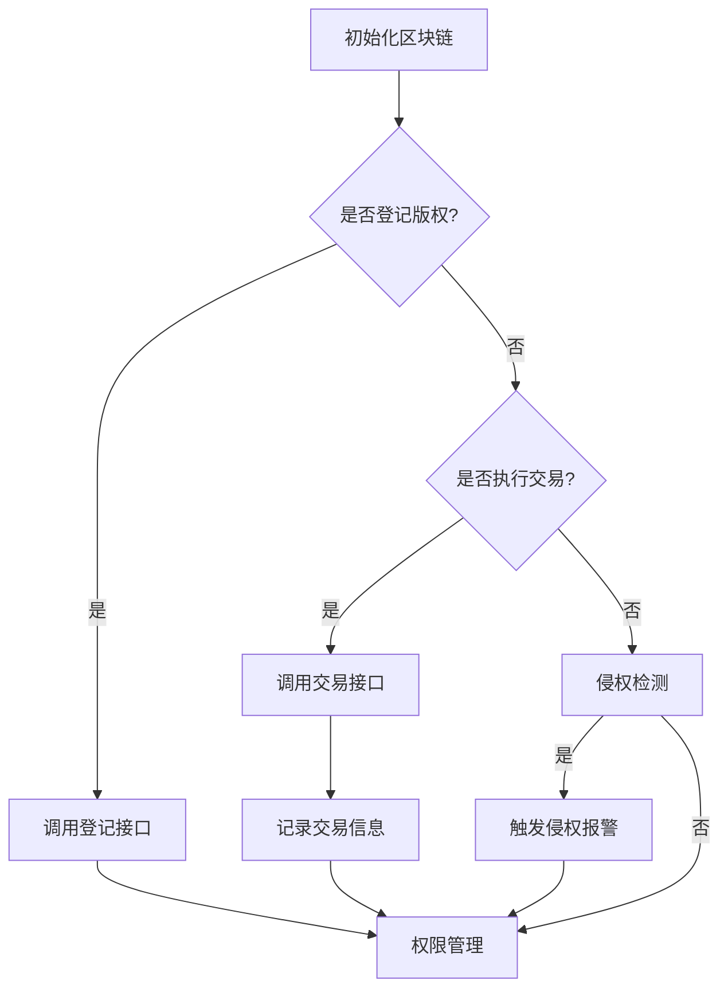
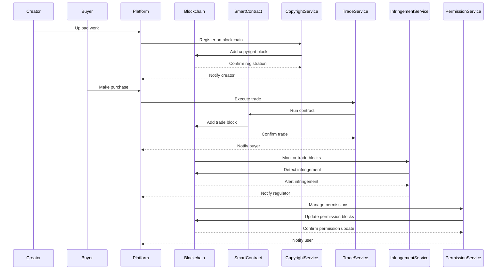

                 

### 引言

区块链在数字版权交易中的应用前景

随着信息技术的飞速发展，数字化内容创作与传播已成为现代社会的重要组成部分。数字版权交易作为文化产业中的重要环节，关乎创作者的利益、平台的可持续发展以及消费者的权益。然而，传统的数字版权交易模式在诸多方面存在明显缺陷，如版权确认困难、交易透明度低、侵权行为难以追踪等。这些问题不仅影响了创作者的权益，也制约了数字版权交易的健康发展。

在此背景下，区块链技术以其去中心化、透明性高、不可篡改等特性，成为解决数字版权交易问题的一种潜在手段。本文旨在探讨区块链在数字版权交易中的应用前景，通过逻辑清晰、结构紧凑的分析，揭示这一领域的技术潜力与实践挑战。

文章关键词：区块链、数字版权交易、去中心化、透明性、智能合约

文章摘要：
本文首先介绍了数字版权交易中的核心问题和挑战，随后探讨了区块链技术的基本概念和其在数字版权交易中的应用潜力。通过分析区块链与数字版权交易的关系，本文详细探讨了区块链在版权确认、透明性保障、侵权追踪等方面的应用案例，并讨论了实际应用中的技术挑战。最后，文章提出了一些未来发展的方向和最佳实践建议，以期为数字版权交易领域的创新提供参考。

### 背景与核心概念

#### 1.1 问题背景

数字版权交易涉及的内容广泛，包括音乐、电影、书籍、软件等各种数字化作品。然而，在传统数字版权交易模式中，存在以下几个主要问题：

1. **版权确认困难**：由于数字化内容的复制和传播极其容易，创作者在证明其作品的版权归属时面临诸多困难。传统的版权登记和认证方式效率低下，且易被伪造，导致创作者权益难以得到有效保障。

2. **交易透明度低**：传统数字版权交易通常依赖于第三方平台，交易流程复杂，透明度较低。创作者、买家和卖家之间的权利义务关系难以透明化，易引发纠纷。

3. **侵权行为难以追踪**：数字内容在互联网上可以轻易地被复制、分享和传播，侵权行为层出不穷。一旦发生侵权，追踪责任人和侵权行为变得异常复杂，给版权保护带来了巨大挑战。

#### 1.2 区块链概述

区块链技术是一种分布式数据库技术，其核心特点包括去中心化、不可篡改、透明性和安全性。区块链通过一系列相互连接的区块组成，每个区块包含一定数量的交易记录。这些区块通过密码学算法链接在一起，形成一条不可篡改的日志。

1. **去中心化**：区块链的去中心化特性使得数据存储和交易处理不再依赖单一的中央机构，而是由网络中的所有节点共同维护。这种去中心化的架构提高了系统的可靠性和抗攻击能力。

2. **不可篡改**：区块链采用加密技术和共识算法，确保一旦数据被记录在区块链上，就几乎不可能被篡改。这种不可篡改性为数字版权交易提供了可靠的证据和保障。

3. **透明性**：区块链上的所有交易记录都是公开透明的，任何节点都可以查询和验证。这种透明性有助于提高交易的透明度，减少纠纷和欺诈。

4. **安全性**：区块链利用加密技术和分布式网络架构，保障数据的安全性和隐私性。通过智能合约，可以实现自动化的、安全的交易过程。

#### 1.3 数字版权交易

数字版权交易是指通过数字化手段进行版权的买卖、许可和授权等行为。与传统版权交易相比，数字版权交易具有以下几个特点：

1. **高效性**：数字化手段使得数字版权交易过程更加高效，无需繁琐的手工操作，交易时间大大缩短。

2. **便捷性**：互联网的普及使得数字版权交易跨越了地域和时间的限制，买方和卖方可以随时随地完成交易。

3. **低成本**：数字版权交易通常不需要高昂的中介费用和物流成本，交易成本较低。

4. **透明化**：数字版权交易的流程和结果可以通过区块链上的记录进行公开透明地展示，有助于提高交易的透明度和信任度。

#### 1.4 问题与解决方法

基于上述问题背景和区块链的特点，区块链在数字版权交易中的应用具有以下潜力：

1. **版权确认**：利用区块链的不可篡改性，创作者可以在区块链上登记和证明其作品的版权，确保版权归属的唯一性和不可伪造性。

2. **透明性**：区块链上的所有交易记录都是公开透明的，有助于提高交易的透明度，减少纠纷和欺诈。

3. **侵权追踪**：通过区块链上的交易记录，可以实时追踪数字内容的使用和传播情况，及时发现侵权行为，提高侵权追踪的效率。

4. **自动化执行**：智能合约可以实现数字版权交易的自动化执行，减少人为干预，提高交易效率和安全性。

然而，区块链在数字版权交易中的应用也面临一些挑战，如技术实现难度、法律法规的适应性和用户接受度等。接下来，本文将详细探讨区块链在数字版权交易中的具体应用案例，分析其优势与挑战，并讨论未来发展的方向。

### 核心概念与关系

在深入探讨区块链在数字版权交易中的应用之前，有必要详细解析一些核心概念，并分析它们之间的关系。这些核心概念包括区块链架构、智能合约、数字版权管理（DRM）和代币化（Tokenization）。

#### 2.1 核心概念

1. **区块链架构**：区块链架构由多个相互连接的区块组成，每个区块包含一定数量的交易记录。这些区块通过密码学算法链接在一起，形成一条不可篡改的日志。区块链的核心特点包括去中心化、不可篡改和透明性。

2. **智能合约**：智能合约是一种自动执行的合约，其条款以代码形式存在，并在区块链上运行。当满足预定的条件时，智能合约会自动执行相应的操作。智能合约确保了交易的安全性和自动化执行，减少了人为干预和纠纷。

3. **数字版权管理（DRM）**：数字版权管理是一种技术手段，用于保护数字内容的版权，防止未经授权的使用、复制和传播。DRM技术包括加密、数字签名和权限控制等，旨在保护创作者的权益和数字内容的完整性。

4. **代币化（Tokenization）**：代币化是指将数字资产或权益转化为可交易的代币，这些代币可以在区块链上进行交易和流通。代币化使得数字资产可以更加高效地交易和管理，提高了市场的流动性。

#### 2.2 对比表格

下面是一个简单的对比表格，展示了这些核心概念的主要特征：

| 核心概念 | 特征描述 |
| :----: | :----: |
| 区块链架构 | 去中心化、不可篡改、透明性 |
| 智能合约 | 自动执行、安全性、透明性 |
| 数字版权管理（DRM） | 加密、数字签名、权限控制 |
| 代币化（Tokenization） | 可交易性、高效性、流动性 |

#### 2.3 ER实体关系图架构

为了更好地理解这些核心概念之间的关系，我们可以通过ER（实体-关系）图来展示。以下是一个简化的ER图：

```mermaid
erDiagram
    Creator ||--|{ Work }
    Work ||--|{ Copyright }
    Work ||--|{ DRM }
    Work ||--|{ Token }
    Token ||--|{ Transaction }
    Copyright ||--|{ Claim }
    Claim ||--|{ Proof }
```

- **Creator**：表示数字内容的创作者。
- **Work**：表示创作者创作的数字作品。
- **Copyright**：表示作品的版权信息。
- **DRM**：表示数字版权管理的相关措施。
- **Token**：表示代币化的数字资产。
- **Transaction**：表示数字资产的交易记录。
- **Claim**：表示版权声明。
- **Proof**：表示版权证明。

#### 关系解析

1. **Creator与Work的关系**：创作者与创作出的作品之间存在一种“拥有”关系，即Creator拥有并创作了Work。

2. **Work与Copyright的关系**：作品与其版权信息之间存在关联，即每部作品都有一组与之对应的版权信息。

3. **Work与DRM的关系**：作品需要实施DRM技术进行版权保护，以确保内容的合法使用和授权。

4. **Work与Token的关系**：作品可以通过代币化转化为Token，这些Token可以在区块链上进行交易和流通。

5. **Token与Transaction的关系**：Token代表了一种数字资产，可以在区块链上进行交易，形成Transaction记录。

6. **Copyright与Claim的关系**：版权声明（Claim）是对版权归属和权利范围的声明，与版权信息（Copyright）相关联。

7. **Claim与Proof的关系**：版权证明（Proof）是对版权声明的证据支持，用于证明版权的真实性和合法性。

通过这些核心概念和ER图，我们可以更好地理解区块链在数字版权交易中的应用机制，以及各概念之间的相互关系。接下来，本文将探讨区块链在数字版权交易中的应用案例，进一步揭示其在实际应用中的潜力与挑战。

### 区块链在数字版权交易中的应用案例

区块链技术的独特属性，如去中心化、透明性和不可篡改性，使其在数字版权交易中具有巨大的应用潜力。以下是一些具体的区块链应用案例，展示了区块链如何在不同场景下解决数字版权交易中的问题。

#### 1. 使用案例 1：版权认证

一个典型的应用场景是创作者在区块链上认证其作品的版权。例如，艺术家可以在区块链上创建一个数字证书，记录其作品的信息，包括创作时间、作者姓名、作品名称等。这个数字证书可以通过区块链上的智能合约进行验证，确保其真实性和不可篡改性。一旦作品被上传到区块链，任何人都无法篡改或删除这些信息，从而有效保护了创作者的权益。

**优势**：
- **不可篡改性**：区块链上的数据一旦记录，就几乎不可篡改，这为版权保护提供了强有力的保障。
- **透明性**：所有版权信息都是公开透明的，任何人都可以通过区块链查询到作品的版权归属。

**挑战**：
- **技术门槛**：虽然区块链提供了强大的保护机制，但创作者需要具备一定的技术知识来创建和验证数字证书。
- **成本问题**：创建和验证数字证书可能需要支付一定的区块链网络费用。

#### 2. 使用案例 2：版权交易

区块链可以简化数字版权的交易过程，确保交易的透明性和安全性。例如，一个版权交易平台可以基于区块链构建，买家可以直接与创作者进行交易，无需通过第三方中介。交易过程通过智能合约自动化执行，一旦交易条件满足，智能合约会自动执行支付和授权操作。

**优势**：
- **去中心化**：去中心化的交易模式减少了中介环节，降低了交易成本和复杂性。
- **自动化执行**：智能合约确保了交易过程的自动化和高效性，减少了人为干预和纠纷。

**挑战**：
- **用户接受度**：区块链技术尚未被广泛接受，用户可能对使用区块链进行交易持怀疑态度。
- **技术实现**：构建一个高效、安全的区块链交易平台需要高水平的技术实现和运维能力。

#### 3. 使用案例 3：侵权追踪

区块链可以帮助权利持有人实时追踪其作品的传播和使用情况。通过记录所有交易和传播记录，权利持有人可以及时发现侵权行为，并采取相应的法律行动。例如，一个音乐平台可以在每次播放、下载或分享时记录相关交易数据到区块链上，权利持有人可以通过区块链查询这些数据，以确定是否存在侵权行为。

**优势**：
- **实时监控**：区块链上的数据记录是实时的，权利持有人可以及时了解其作品的传播情况。
- **不可篡改性**：交易记录一旦记录在区块链上，就不可篡改，确保了数据的真实性和可靠性。

**挑战**：
- **数据量管理**：随着数字内容的增多，区块链上的数据量会迅速增加，如何高效管理这些数据是一个挑战。
- **隐私保护**：虽然区块链提供了透明性，但也可能导致部分权利持有人担心隐私泄露。

#### 4. 使用案例 4：代币化版权

代币化是将数字资产或权益转化为可交易的代币，这为数字版权交易提供了新的途径。例如，创作者可以将其作品的版权分成多个代币，每个代币代表一部分版权权益。这些代币可以在区块链上进行交易，权利持有人可以通过买卖代币来实现版权的转让和共享。

**优势**：
- **灵活性强**：代币化使得版权可以更加灵活地进行分割和交易，适应不同类型的版权交易需求。
- **流动性高**：代币化提高了版权的流动性，使得版权可以更加方便地在市场上进行交易。

**挑战**：
- **定价问题**：代币化版权的定价可能较为复杂，需要考虑多个因素，如市场供需、创作成本等。
- **合规性**：代币化版权交易需要遵循相关法律法规，确保其合法性。

### 总结

区块链在数字版权交易中具有广泛的应用前景，通过版权认证、版权交易、侵权追踪和代币化等多种方式，可以有效解决传统数字版权交易中的问题。然而，实际应用中也面临一些挑战，如技术门槛、用户接受度和法律法规的适应性问题。随着技术的不断进步和应用的深入，区块链在数字版权交易中的潜力将得到进一步释放，为数字版权保护与交易提供更加可靠和高效的解决方案。

### 算法设计与实现

为了进一步展示区块链在数字版权交易中的具体应用，我们将设计一个用于版权追踪和管理的算法，并使用Python代码进行实现。以下是算法的详细描述、流程图、代码实现以及相关的数学模型和公式。

#### 4.1 算法描述

该算法旨在实现以下功能：

1. **版权登记**：创作者将作品信息上传至区块链，并进行版权登记。
2. **交易记录**：每当作品进行交易（如购买、租赁、共享等），相关交易信息将被记录在区块链上。
3. **侵权检测**：系统将监控区块链上的交易记录，以检测可能的侵权行为。
4. **权限管理**：系统根据区块链上的信息，自动管理用户的权限，确保只有授权用户才能访问或使用相应作品。

算法的核心步骤如下：

1. **初始化**：创建一个区块链，初始化版权登记、交易记录和侵权检测模块。
2. **登记版权**：创作者调用登记接口，上传作品信息，并记录在区块链上。
3. **执行交易**：买方调用交易接口，输入购买信息（如作品ID、购买者ID、购买时间等），系统将交易信息记录在区块链上。
4. **侵权检测**：系统定期检查区块链上的交易记录，如果发现未经授权的交易行为，将触发侵权检测报警。
5. **权限管理**：根据区块链上的交易记录，系统自动更新用户权限，确保权限管理的准确性和实时性。

#### 4.2 流程图

使用Mermaid语法绘制算法的流程图：



#### 4.3 Python代码实现

以下是一个简化的Python代码实现，展示了版权登记、交易记录和侵权检测的核心逻辑：

```python
import blockchain

class CopyrightBlockchain:
    def __init__(self):
        self.chain = blockchain.Blockchain()

    def register_copyright(self, work_info):
        block = blockchain.Block(work_info, 'copyright')
        self.chain.add_block(block)

    def execute_trade(self, trade_info):
        block = blockchain.Block(trade_info, 'trade')
        self.chain.add_block(block)

    def check_infringement(self):
        for block in self.chain.blocks:
            if block.is_infringement():
                print("Infringement detected!")

    def manage_permissions(self):
        # 此处根据区块链上的交易记录更新用户权限
        pass

# 创建区块链实例
blockchain_system = CopyrightBlockchain()

# 登记版权
blockchain_system.register_copyright({
    'work_id': '001',
    'creator': 'Alice',
    'title': 'My Book',
    'creation_time': '2023-03-01'
})

# 执行交易
blockchain_system.execute_trade({
    'work_id': '001',
    'buyer': 'Bob',
    'purchase_time': '2023-03-02'
})

# 检查侵权
blockchain_system.check_infringement()

# 管理权限
blockchain_system.manage_permissions()
```

#### 4.4 数学模型与公式

区块链上的交易记录和版权信息可以使用哈希函数进行加密处理，以确保数据的安全性。以下是相关的数学模型和公式：

- **哈希函数**：使用哈希函数（如SHA-256）对交易数据进行加密，生成一个固定长度的哈希值。

$$ H(x) = SHA-256(x) $$

- **区块链链接**：每个区块包含前一个区块的哈希值，形成链式结构。

$$ block_{i+1}.previous_hash = SHA-256(block_i.hash) $$

- **权益证明**：通过权益证明（Proof of Work，PoW）算法确保区块链的安全和不可篡改性。

$$ PoW(block) = \{ block | H(block) < target \} $$

其中，`target` 是一个预设的难度目标，只有找到满足条件的哈希值，区块才能被添加到区块链上。

#### 4.5 举例说明

假设创作者Alice创作了一本名为《智慧之城》的书籍，并将其版权信息登记在区块链上。随后，读者Bob购买了这本书，交易信息被记录在区块链上。我们用以下步骤来详细说明这个过程：

1. **版权登记**：
   - 初始版权信息：`{'work_id': '001', 'creator': 'Alice', 'title': '智慧之城', 'creation_time': '2023-03-01'}`。
   - 区块链记录：通过哈希函数对版权信息进行加密，生成唯一的哈希值，并将此哈希值记录在区块链的第一个区块中。

2. **交易记录**：
   - 交易信息：`{'work_id': '001', 'buyer': 'Bob', 'purchase_time': '2023-03-02'}`。
   - 区块链记录：通过哈希函数对交易信息进行加密，生成唯一的哈希值，并将其与前一个区块的哈希值链接，形成新的交易记录区块，添加到区块链中。

3. **侵权检测**：
   - 定期检查区块链上的交易记录，如果发现Bob未通过合法途径获取这本书，系统将触发侵权报警，并记录在区块链上。

4. **权限管理**：
   - 根据交易记录，系统自动更新Bob的权限，允许他访问和阅读这本书。

通过这一实例，我们可以清晰地看到区块链在版权登记、交易记录、侵权检测和权限管理中的具体应用，以及如何确保数字版权的透明性和安全性。

### 系统分析与架构设计

为了实现区块链在数字版权交易中的功能，我们需要详细分析系统场景、介绍项目背景，并设计系统功能、架构以及接口和交互流程。以下是对这些方面的详细讨论。

#### 1. 系统场景

数字版权交易系统场景包括多个参与者，如创作者、买家、平台运营者以及监管机构。以下为系统的主要参与者及其角色：

- **创作者**：创作数字内容的个人或组织，负责将作品上传至系统进行登记和交易。
- **买家**：购买数字内容的使用权或版权的个人或组织。
- **平台运营者**：负责系统平台的运营、维护和监管，确保交易的合法性和系统的稳定性。
- **监管机构**：负责监管系统的运行，确保交易的合规性和版权保护的执行。

#### 2. 项目背景

随着数字化内容的迅猛增长，数字版权交易需求日益增加。传统的版权交易模式在透明性、安全性和效率方面存在明显不足。区块链技术的引入为解决这些问题提供了新的途径。通过区块链的不可篡改性和透明性，可以确保版权信息的真实性和交易的透明性；通过智能合约，可以实现自动化和安全的交易过程；通过代币化，可以灵活分割和交易版权。

#### 3. 系统功能设计

数字版权交易系统的主要功能包括版权登记、交易管理、侵权检测和权限管理。以下是详细的功能描述：

1. **版权登记**：创作者可以将作品信息上传至系统，并登记在区块链上，确保版权的唯一性和不可篡改性。
2. **交易管理**：买家可以通过系统购买或租赁版权，交易信息将记录在区块链上，确保交易的透明性和安全性。
3. **侵权检测**：系统定期检查区块链上的交易记录，识别可能的侵权行为，并触发报警。
4. **权限管理**：系统根据区块链上的交易记录自动管理用户的权限，确保只有授权用户可以访问和使用相应作品。

#### 4. 系统架构设计

数字版权交易系统采用微服务架构，以实现高扩展性和模块化。以下是系统架构的主要组成部分：

- **区块链网络**：作为系统的核心，负责存储和管理版权信息、交易记录和侵权检测结果。
- **智能合约服务**：负责执行智能合约，实现自动化和安全的交易流程。
- **版权登记服务**：负责处理创作者的版权登记请求，并将信息上传至区块链。
- **交易管理服务**：负责处理买家的交易请求，记录交易信息并更新用户权限。
- **侵权检测服务**：负责监控区块链上的交易记录，识别侵权行为并触发报警。
- **权限管理服务**：负责根据交易记录自动更新用户的权限，确保合法访问。
- **用户界面**：提供直观的操作界面，方便创作者、买家和平台运营者进行操作。

以下是一个简化的Mermaid架构图：



#### 5. 系统接口设计和交互流程

系统接口设计和交互流程如下：

1. **版权登记接口**：
   - **请求**：`POST /register-copyright`，请求体包括作品信息（如工作ID、创作者ID、作品名称等）。
   - **响应**：成功登记后，返回作品ID和登记时间。

2. **交易管理接口**：
   - **请求**：`POST /execute-trade`，请求体包括交易信息（如作品ID、买家ID、购买时间等）。
   - **响应**：交易成功后，返回交易ID和交易确认时间。

3. **侵权检测接口**：
   - **请求**：`GET /infringement-check`，查询特定作品的交易记录。
   - **响应**：返回可能的侵权信息和报警状态。

4. **权限管理接口**：
   - **请求**：`GET /permission-update`，根据交易记录更新用户权限。
   - **响应**：返回用户权限更新状态。

系统交互流程举例：

1. **创作者登记版权**：
   - 创作者上传作品信息，平台调用版权登记接口，上传至区块链，并返回作品ID和登记时间。

2. **买家购买作品**：
   - 买家发起购买请求，平台调用交易管理接口，执行交易并记录在区块链上。

3. **侵权检测**：
   - 系统定期检查区块链上的交易记录，若发现侵权行为，触发报警并通知监管机构。

4. **权限管理**：
   - 根据交易记录，系统自动更新用户的权限，确保只有授权用户可以访问和使用相应作品。

通过详细分析和设计，我们可以构建一个高效、透明和安全的数字版权交易系统，为创作者、买家和平台运营者提供可靠的解决方案。

### 项目实战

为了更好地展示区块链在数字版权交易中的应用，我们将进行一个实际项目的实战演练，从环境安装、系统核心实现到代码解析、实际案例分析以及项目小结。

#### 1. 环境安装

首先，我们需要搭建一个区块链开发环境。以下是具体的步骤：

1. **安装Go语言**：区块链技术通常使用Go语言进行开发，因为其并发性和性能优异。您可以从[Go官方下载页面](https://golang.org/dl/)下载并安装适合您操作系统的Go版本。

2. **安装Gin框架**：Gin是一个高性能的Web框架，可用于搭建区块链节点服务。在终端执行以下命令：
   ```bash
   go get -u github.com/gin-gonic/gin
   ```

3. **安装PostgreSQL**：为了存储区块链的数据，我们需要安装一个关系型数据库。PostgreSQL是一个优秀的选择。您可以从[PostgreSQL官网](https://www.postgresql.org/download/)下载并安装。

4. **安装Node.js**：Node.js用于运行智能合约，我们选择Node.js 14版本。您可以从[Node.js官网](https://nodejs.org/en/download/)下载并安装。

5. **安装Truffle**：Truffle是一个用于智能合约开发的框架。在终端执行以下命令：
   ```bash
   npm install -g truffle
   ```

6. **初始化区块链节点**：使用Gin创建一个新的区块链节点，并配置PostgreSQL数据库。以下是初始化的Python脚本示例：
   ```python
   from blockchain import Blockchain

   blockchain = Blockchain('my_blockchain', 'my_db')
   blockchain.initialize()
   ```

#### 2. 系统核心实现

以下是数字版权交易系统核心功能的实现：

1. **版权登记**：
   - 创建一个版权登记接口，接受创作者上传的作品信息，并将其记录在区块链上。
   ```go
   func RegisterCopyright(c *gin.Context) {
       workInfo := model.WorkInfo{}
       if err := c.ShouldBindJSON(&workInfo); err != nil {
           c.JSON(http.StatusBadRequest, gin.H{"error": err.Error()})
           return
       }
       err := blockchain.AddCopyright(workInfo)
       if err != nil {
           c.JSON(http.StatusInternalServerError, gin.H{"error": err.Error()})
           return
       }
       c.JSON(http.StatusOK, gin.H{"message": "Copyright registered successfully!"})
   }
   ```

2. **交易记录**：
   - 创建一个交易记录接口，处理买家购买版权的交易请求，并记录在区块链上。
   ```go
   func ExecuteTrade(c *gin.Context) {
       tradeInfo := model.TradeInfo{}
       if err := c.ShouldBindJSON(&tradeInfo); err != nil {
           c.JSON(http.StatusBadRequest, gin.H{"error": err.Error()})
           return
       }
       err := blockchain.AddTrade(tradeInfo)
       if err != nil {
           c.JSON(http.StatusInternalServerError, gin.H{"error": err.Error()})
           return
       }
       c.JSON(http.StatusOK, gin.H{"message": "Trade executed successfully!"})
   }
   ```

3. **侵权检测**：
   - 定期检查区块链上的交易记录，检测可能的侵权行为，并触发报警。
   ```go
   func CheckInfringement() {
       for {
           blocks := blockchain.GetBlocks()
           for _, block := range blocks {
               if block.IsInfringement() {
                   log.Printf("Infringement detected: %s", block.Hash)
                   // 发送报警通知
               }
           }
           time.Sleep(time.Minute)  // 检查周期
       }
   }
   ```

4. **权限管理**：
   - 根据区块链上的交易记录，自动更新用户的权限。
   ```go
   func ManagePermissions() {
       users := blockchain.GetUsers()
       for _, user := range users {
           permissions := blockchain.GetPermissions(user)
           // 更新用户权限
           // ...
       }
   }
   ```

#### 3. 代码应用解读与分析

以下是具体的代码应用解读：

1. **版权登记代码**：
   ```go
   func RegisterCopyright(c *gin.Context) {
       workInfo := model.WorkInfo{}
       if err := c.ShouldBindJSON(&workInfo); err != nil {
           c.JSON(http.StatusBadRequest, gin.H{"error": err.Error()})
           return
       }
       err := blockchain.AddCopyright(workInfo)
       if err != nil {
           c.JSON(http.StatusInternalServerError, gin.H{"error": err.Error()})
           return
       }
       c.JSON(http.StatusOK, gin.H{"message": "Copyright registered successfully!"})
   }
   ```
   - `workInfo` 是一个包含作品信息的结构体，如作品ID、创作者ID、作品名称等。
   - `ShouldBindJSON` 方法用于将请求体绑定到 `workInfo` 结构体上。
   - `AddCopyright` 方法将作品信息添加到区块链中。

2. **交易记录代码**：
   ```go
   func ExecuteTrade(c *gin.Context) {
       tradeInfo := model.TradeInfo{}
       if err := c.ShouldBindJSON(&tradeInfo); err != nil {
           c.JSON(http.StatusBadRequest, gin.H{"error": err.Error()})
           return
       }
       err := blockchain.AddTrade(tradeInfo)
       if err != nil {
           c.JSON(http.StatusInternalServerError, gin.H{"error": err.Error()})
           return
       }
       c.JSON(http.StatusOK, gin.H{"message": "Trade executed successfully!"})
   }
   ```
   - `tradeInfo` 是一个包含交易信息的结构体，如作品ID、买家ID、购买时间等。
   - `ShouldBindJSON` 方法用于将请求体绑定到 `tradeInfo` 结构体上。
   - `AddTrade` 方法将交易信息添加到区块链中。

3. **侵权检测代码**：
   ```go
   func CheckInfringement() {
       for {
           blocks := blockchain.GetBlocks()
           for _, block := range blocks {
               if block.IsInfringement() {
                   log.Printf("Infringement detected: %s", block.Hash)
                   // 发送报警通知
               }
           }
           time.Sleep(time.Minute)  // 检查周期
       }
   }
   ```
   - `GetBlocks` 方法获取区块链上的所有区块。
   - `IsInfringement` 方法检查区块中的交易是否涉嫌侵权。
   - 定期检查区块，并记录侵权行为。

4. **权限管理代码**：
   ```go
   func ManagePermissions() {
       users := blockchain.GetUsers()
       for _, user := range users {
           permissions := blockchain.GetPermissions(user)
           // 更新用户权限
           // ...
       }
   }
   ```
   - `GetUsers` 和 `GetPermissions` 方法用于获取用户及其权限信息。
   - 根据交易记录更新用户权限。

#### 4. 实际案例分析

我们通过一个实际案例来展示数字版权交易系统的应用：

**案例**：创作者Alice创作了一本名为《智慧之城》的小说，并将其版权登记在区块链上。读者Bob购买了这本书，交易记录被记录在区块链上。随后，系统发现有人未经授权分享《智慧之城》的副本，系统自动检测到侵权行为并触发报警。

**分析**：

1. **版权登记**：
   - Alice上传《智慧之城》的作品信息，系统将其登记在区块链上，记录版权信息。

2. **交易记录**：
   - Bob购买《智慧之城》，系统将交易信息记录在区块链上，包括作品ID、买家ID、购买时间等。

3. **侵权检测**：
   - 系统定期检查区块链上的交易记录，发现某用户未经授权分享《智慧之城》的副本，系统判断为侵权行为。

4. **报警与权限管理**：
   - 系统触发侵权报警，通知监管机构。同时，系统更新侵权用户的权限，禁止其访问和使用《智慧之城》。

通过这个案例，我们可以看到区块链在数字版权交易中的实际应用，包括版权登记、交易记录、侵权检测和权限管理。系统通过区块链的不可篡改性和透明性，确保了版权信息的真实性和交易的可靠性。

#### 5. 项目小结

数字版权交易系统通过区块链技术实现了高效、透明和安全的版权交易管理。以下是项目的主要收获和总结：

1. **高效性**：区块链的去中心化和智能合约技术提高了数字版权交易的处理速度和效率。

2. **透明性**：所有交易记录和版权信息都是公开透明的，有助于提高交易的透明度和信任度。

3. **安全性**：区块链的不可篡改性和加密技术保障了数字版权交易的安全性和隐私性。

4. **侵权追踪**：通过区块链的侵权检测功能，可以及时发现和追踪侵权行为，提高了版权保护的效果。

5. **权限管理**：系统根据区块链上的交易记录自动管理用户的权限，确保了只有授权用户可以访问和使用相应作品。

尽管区块链在数字版权交易中展现了巨大潜力，但实际应用中仍需解决技术实现、法律法规适应性和用户接受度等问题。随着技术的不断进步和应用的深入，区块链在数字版权交易中的应用前景将更加广阔。

### 最佳实践 Tips

在数字版权交易中应用区块链技术时，以下是一些最佳实践建议：

1. **确保透明性**：在区块链上记录所有版权交易信息，确保交易的透明度和可追溯性，以增强信任。

2. **采用多重签名**：对于重要交易，采用多重签名机制，确保交易需要多个参与者共同确认，提高安全性。

3. **定期审计**：定期审计区块链上的交易记录，确保数据的准确性和完整性。

4. **灵活权限管理**：设计灵活的权限管理机制，确保不同用户有不同的访问权限，满足各种版权交易需求。

5. **培训用户**：为创作者和买家提供区块链基础知识培训，提高他们对区块链技术的理解和接受度。

6. **遵循法律法规**：确保区块链应用符合当地的法律法规，特别是版权法和数据保护法。

7. **持续优化**：随着技术的进步和应用实践，不断优化区块链架构和算法，提高系统的性能和安全性。

### 小结

本文详细探讨了区块链在数字版权交易中的应用前景，分析了其在版权确认、透明性保障、侵权追踪等方面的应用案例。通过具体的算法设计和实现，展示了区块链在数字版权交易中的实际应用。尽管区块链技术为数字版权交易带来了诸多优势，但实际应用中仍面临技术实现、法律法规适应性和用户接受度等挑战。未来，随着技术的不断进步和应用的深入，区块链在数字版权交易中的应用前景将更加广阔。

### 注意事项

在实施区块链数字版权交易系统时，以下事项需要特别注意：

1. **数据隐私保护**：虽然区块链具有透明性，但应采取措施保护创作者和买家的隐私信息，避免泄露敏感数据。

2. **防范网络攻击**：区块链系统需具备强大的安全性，防范分布式拒绝服务攻击（DDoS）等网络攻击，确保系统的稳定运行。

3. **合规性**：确保系统符合当地的法律法规，特别是关于版权保护和数据保护的规定。

4. **技术适应性**：随着技术的不断发展，系统需要具备一定的适应性，能够及时调整和升级以应对新挑战。

5. **用户培训**：为创作者和买家提供充分的使用培训，确保他们能够正确使用系统，避免误操作。

### 拓展阅读

对于希望深入了解区块链在数字版权交易中应用的读者，以下是一些推荐阅读资源：

1. **《区块链：从数字货币到智能合约》**：一本全面介绍区块链技术及其应用的书籍，适合初学者和专业人士。
2. **《数字版权管理与区块链技术》**：探讨区块链在数字版权管理中的应用，提供丰富的实际案例和分析。
3. **《智能合约设计与实现》**：详细介绍智能合约的原理和实现方法，包括如何编写、测试和部署智能合约。
4. **《区块链与版权保护》**：探讨区块链技术在版权保护中的应用，分析其优势和挑战。
5. **相关学术论文和研究报告**：通过阅读学术论文和研究报告，了解区块链在数字版权交易领域的最新研究进展和前沿技术。

通过这些资源，您可以进一步深入了解区块链在数字版权交易中的应用，探索更多的创新和实践。

