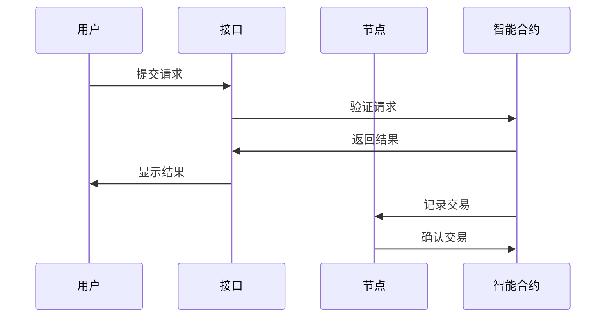
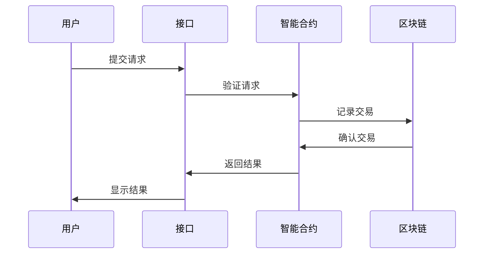

                 

# 区块链在数字版权交易中的智能合约应用

## 关键词
区块链、智能合约、数字版权交易、版权管理、去中心化

## 摘要
本文将深入探讨区块链在数字版权交易中的应用，特别是智能合约在版权管理中的作用。通过详细分析区块链和智能合约的核心概念、技术细节以及实际应用案例，本文旨在为读者提供对这一领域全面而深刻的理解，并探讨其未来发展趋势和面临的挑战。

## 引言
随着数字经济的蓬勃发展，数字版权交易成为一个日益重要的领域。然而，传统的版权管理方法面临着诸多挑战，如版权归属不清、交易流程复杂、维权成本高昂等问题。区块链和智能合约的出现为这些问题提供了一种创新的解决方案。本文将围绕这一主题展开讨论，旨在为读者提供一个清晰的思路，了解区块链和智能合约在数字版权交易中的具体应用。

## 背景和核心概念

### 区块链技术概述
区块链是一种分布式数据库技术，通过多个节点之间的共识机制来维护数据的一致性。区块链的主要特点是去中心化、不可篡改和透明性，这些特性使其成为数字版权交易的理想选择。

#### 核心概念术语
- **区块链（Blockchain）**：一种去中心化的分布式账本技术。
- **区块（Block）**：数据记录的基本单位，包含一系列交易信息。
- **链（Chain）**：由多个区块按照时间顺序连接而成的数据结构。
- **节点（Node）**：参与区块链网络并维护账本完整性的计算机。

### 数字版权
数字版权指的是数字内容（如音乐、电影、文学作品等）的版权保护。随着数字技术的普及，数字版权交易成为一个日益活跃的市场。然而，传统的版权管理方法存在诸多问题，如版权归属不清晰、交易流程繁琐等。

#### 问题背景
- **版权归属不清**：数字内容易于复制和分发，导致版权归属难以确定。
- **交易流程复杂**：数字版权交易涉及多个环节，包括版权注册、转让、授权等，流程复杂且不透明。
- **维权成本高**：数字版权侵权行为频发，但维权成本高昂，往往难以有效地保护权益。

### 智能合约
智能合约是一种运行在区块链上的自执行合约，通过预定义的规则和条件自动执行合约条款。智能合约的出现为数字版权交易提供了一种自动化和透明化的解决方案。

#### 核心概念
- **智能合约（Smart Contract）**：运行在区块链上的自执行合约。
- **条件触发**：智能合约根据预设的条件自动执行，无需第三方介入。
- **透明性**：智能合约的执行过程和结果对所有人可见，提高了透明度。

### 区块链和数字版权交易的关系
区块链技术为数字版权交易提供了一种去中心化的解决方案，智能合约则为版权管理提供了一种自动化和透明化的手段。结合两者，可以实现更加高效和安全的数字版权交易。

## 区块链在数字版权交易中的作用

### 去中心化的版权管理
区块链的去中心化特性使得版权管理更加透明和高效。传统的版权管理依赖于中心化的机构，如版权局或知识产权组织，这些机构存在腐败、效率低下等问题。区块链通过去中心化的方式，使得版权信息在全球范围内共享，降低了信息不对称的风险。

#### 去中心化的优点
- **透明性**：区块链上的所有交易记录都是公开透明的，任何参与者都可以验证版权信息。
- **高效性**：去中心化的结构使得版权交易流程更加高效，无需依赖中心化的中介机构。

### 不可篡改的版权记录
区块链的不可篡改性为数字版权交易提供了一种安全保障。一旦版权信息被记录在区块链上，就无法被篡改或删除，从而确保版权的合法权益得到保护。

#### 不可篡改的保障
- **共识机制**：区块链通过共识机制确保所有节点的数据一致，从而防止篡改。
- **加密技术**：区块链采用加密技术保护数据的完整性，确保数据的真实性和可靠性。

### 透明化的交易流程
区块链技术使得数字版权交易的流程更加透明，所有交易记录都在链上公开，参与者可以实时查询和验证交易状态。这种透明性有助于防止欺诈行为，提高市场的信任度。

#### 透明化的优势
- **防止欺诈**：区块链上的交易记录不可篡改，有助于发现和防止欺诈行为。
- **提高信任**：透明化的交易流程提高了市场的信任度，促进了交易的顺利进行。

### 智能合约的应用
智能合约在数字版权交易中发挥了重要作用，通过自动化和透明化的手段，实现了版权管理的高效和准确。

#### 智能合约的典型应用
- **版权注册**：智能合约可以自动执行版权注册过程，确保版权信息的真实性和唯一性。
- **版权转让**：智能合约可以自动执行版权转让协议，确保转让过程透明和高效。
- **版权授权**：智能合约可以自动执行授权协议，确保授权行为合法和透明。

## 智能合约与数字版权管理

### 智能合约的定义
智能合约是一种运行在区块链上的自执行合约，通过预定义的规则和条件自动执行合约条款。智能合约的出现，为数字版权交易提供了一种自动化和透明化的解决方案。

#### 智能合约的核心要素
- **合约条款**：智能合约包含预定义的合约条款，如交易金额、履行条件等。
- **触发条件**：智能合约根据预设的条件自动执行，无需第三方介入。
- **执行结果**：智能合约执行后，结果对所有人可见，确保透明性。

### 智能合约与数字版权管理的联系
智能合约与数字版权管理有着紧密的联系。通过智能合约，可以实现版权的注册、转让、授权等管理功能，从而提高版权交易的高效性和透明性。

#### 智能合约在版权管理中的应用
- **版权注册**：智能合约可以自动执行版权注册过程，确保版权信息的真实性和唯一性。
- **版权转让**：智能合约可以自动执行版权转让协议，确保转让过程透明和高效。
- **版权授权**：智能合约可以自动执行授权协议，确保授权行为合法和透明。

### 智能合约的典型类型
在数字版权交易中，常见的智能合约类型包括版权注册智能合约、版权转让智能合约和版权授权智能合约。

#### 类型及特点
- **版权注册智能合约**：用于自动执行版权注册过程，确保版权信息的真实性和唯一性。
- **版权转让智能合约**：用于自动执行版权转让协议，确保转让过程透明和高效。
- **版权授权智能合约**：用于自动执行授权协议，确保授权行为合法和透明。

## 实际应用案例

### 案例一：版权注册
一个典型的案例是某知名音乐平台使用智能合约进行音乐版权注册。平台上的创作者通过智能合约将音乐版权信息记录在区块链上，确保版权信息的真实性和唯一性。这一过程不仅提高了版权注册的效率，还减少了人为干预的可能性，确保了版权的合法权益。

#### 案例分析
- **效率提升**：智能合约自动执行版权注册过程，减少了人工干预，提高了工作效率。
- **透明性**：区块链上的版权信息对所有参与者透明，增强了市场的信任度。
- **安全性**：区块链的不可篡改性确保了版权信息的真实性，防止了篡改和欺诈行为。

### 案例二：版权转让
另一个实际应用案例是一家数字出版公司通过智能合约进行版权转让。该公司使用智能合约自动执行版权转让协议，确保转让过程的透明和高效。智能合约不仅记录了转让的具体条款，还自动执行了资金转移，从而减少了人工操作和错误的可能性。

#### 案例分析
- **透明性**：智能合约记录了版权转让的所有细节，确保了转让过程的透明。
- **高效性**：智能合约自动执行转让协议，提高了工作效率，减少了人工操作。
- **安全性**：区块链的不可篡改性确保了转让协议的真实性和可靠性。

### 案例三：版权授权
一家数字媒体公司通过智能合约进行版权授权，智能合约自动执行授权协议，确保授权行为的合法和透明。媒体公司可以方便地授权其他公司使用其数字内容，同时智能合约确保了授权条款的严格执行。

#### 案例分析
- **自动化**：智能合约自动执行授权协议，减少了人工干预，提高了效率。
- **合法性**：智能合约确保了授权行为的合法性，防止了非法授权。
- **透明性**：区块链上的授权记录对所有参与者透明，增强了市场的信任度。

## 技术细节和实现

### 智能合约的编写和部署
智能合约的编写和部署是数字版权交易中至关重要的环节。下面将详细介绍智能合约的编写和部署过程。

#### 编写智能合约
智能合约通常使用特定的编程语言编写，如Solidity。以下是一个简单的版权注册智能合约示例：

```solidity
pragma solidity ^0.8.0;

contract CopyrightRegistration {
    mapping (address => bool) public registrations;

    function registerCopyright() public {
        require(!registrations[msg.sender], "Copyright already registered");
        registrations[msg.sender] = true;
    }
}
```

#### 部署智能合约
编写完智能合约后，需要将其部署到区块链上。通常，可以使用区块链开发框架（如Truffle）进行智能合约的部署和测试。以下是一个使用Truffle部署智能合约的示例：

```bash
truffle migrate --network development
```

#### 部署流程
1. **编译智能合约**：使用Truffle编译智能合约，生成与区块链兼容的ABI和字节码。
2. **部署智能合约**：使用Truffle部署智能合约到区块链，并获取合约地址。
3. **测试智能合约**：使用Truffle测试智能合约，确保其功能符合预期。

### 智能合约与区块链的交互
智能合约与区块链的交互是通过调用区块链上的API实现的。以下是一个简单的示例，展示如何使用智能合约进行版权注册：

```python
from web3 import Web3

# 连接到区块链节点
web3 = Web3(Web3.HTTPProvider('http://localhost:8545'))

# 部署的智能合约地址
contract_address = Web3.toChecksumAddress('0x...')

# 加载智能合约
contract = web3.eth.contract(address=contract_address, abi=contract_abi)

# 调用注册函数
tx_hash = contract.functions.registerCopyright().transact()

# 等待交易确认
tx_receipt = web3.eth.waitForTransactionReceipt(tx_hash)
```

### 智能合约的安全性和隐私性
智能合约的安全性和隐私性是数字版权交易中需要重点关注的问题。以下是一些安全性和隐私性的措施：

#### 安全性措施
- **代码审计**：对智能合约代码进行审计，确保代码不存在安全漏洞。
- **权限控制**：使用权限控制机制，确保只有授权用户可以执行特定操作。
- **加密技术**：使用加密技术保护敏感数据，确保数据传输过程中的安全性。

#### 隐私性措施
- **零知识证明**：使用零知识证明技术，实现隐私保护。
- **匿名性**：通过匿名性设计，确保参与者的隐私得到保护。

## 未来趋势和挑战

### 未来发展趋势
- **技术成熟**：随着区块链技术的不断成熟，智能合约在数字版权交易中的应用将越来越广泛。
- **政策支持**：政府对数字版权保护的重视，将推动区块链和智能合约在数字版权交易中的应用。
- **市场接受度**：随着消费者对数字版权保护需求的增加，市场对区块链和智能合约的接受度将逐步提高。

### 面临的挑战
- **技术挑战**：智能合约的安全性和隐私性是当前面临的主要技术挑战，需要不断改进和完善。
- **法律挑战**：区块链和智能合约的法律地位和监管制度尚不明确，需要进一步完善相关法律法规。
- **市场挑战**：数字版权交易市场的不规范和竞争激烈，需要加强市场监管，保障市场的健康发展。

## 结论
区块链和智能合约在数字版权交易中具有巨大的潜力，通过去中心化、不可篡改和透明化的特性，可以有效解决传统版权管理中的问题。然而，技术、法律和市场方面的挑战仍然需要解决。未来，随着技术的不断进步和政策的完善，区块链和智能合约将在数字版权交易中发挥更加重要的作用。

## 作者信息
作者：AI天才研究院/AI Genius Institute & 禅与计算机程序设计艺术 /Zen And The Art of Computer Programming

## 完整性要求
### 背景介绍
在数字经济时代，数字版权交易成为一个日益重要的领域。随着互联网和数字技术的普及，数字内容的创作、传播和使用越来越便捷，但同时也带来了诸多版权问题。传统的版权管理方法依赖于中心化的机构，如版权局或知识产权组织，这些机构存在腐败、效率低下等问题。此外，数字内容的复制和分发变得极为容易，导致版权归属不清、交易流程复杂、维权成本高昂等问题。这些问题严重影响了数字版权交易的健康发展，迫切需要一种新的解决方案。

区块链技术的出现为数字版权交易提供了一种去中心化的解决方案。区块链是一种分布式数据库技术，通过多个节点之间的共识机制来维护数据的一致性。区块链的主要特点是去中心化、不可篡改和透明性，这些特性使其成为数字版权交易的理想选择。去中心化意味着不再依赖中心化的机构，而是通过分布式网络维护数据的一致性，提高了透明度和效率。不可篡改性确保了数据的真实性和可靠性，防止了篡改和欺诈行为。透明性使得所有交易记录都在链上公开，参与者可以实时查询和验证交易状态，提高了市场的信任度。

智能合约是一种运行在区块链上的自执行合约，通过预定义的规则和条件自动执行合约条款。智能合约的出现，为数字版权交易提供了一种自动化和透明化的解决方案。通过智能合约，可以实现版权的注册、转让、授权等管理功能，从而提高版权交易的高效性和透明性。

### 核心概念与联系
#### 区块链技术核心概念
- **区块链（Blockchain）**：一种去中心化的分布式账本技术，通过多个节点之间的共识机制来维护数据的一致性。区块链的主要特点是去中心化、不可篡改和透明性。
- **区块（Block）**：数据记录的基本单位，包含一系列交易信息。
- **链（Chain）**：由多个区块按照时间顺序连接而成的数据结构。
- **节点（Node）**：参与区块链网络并维护账本完整性的计算机。

#### 数字版权管理核心概念
- **数字版权**：数字内容（如音乐、电影、文学作品等）的版权保护。
- **版权注册**：将数字版权信息记录在区块链上，确保版权信息的真实性和唯一性。
- **版权转让**：数字版权的买卖过程，通过智能合约自动执行。
- **版权授权**：数字版权的许可使用过程，通过智能合约自动执行。

#### 智能合约核心概念
- **智能合约（Smart Contract）**：运行在区块链上的自执行合约，通过预定义的规则和条件自动执行合约条款。
- **条件触发**：智能合约根据预设的条件自动执行，无需第三方介入。
- **执行结果**：智能合约执行后，结果对所有人可见，确保透明性。

#### 区块链、数字版权管理与智能合约的联系
区块链技术为数字版权管理提供了去中心化、不可篡改和透明化的基础。数字版权管理通过区块链技术实现了版权的注册、转让和授权，确保了版权信息的真实性和唯一性。智能合约则通过预定义的规则和条件，自动执行版权管理的相关操作，提高了交易的高效性和透明性。

### 算法原理讲解
区块链技术在数字版权交易中的应用主要依赖于以下算法原理：

#### 区块链共识算法
区块链网络中的多个节点通过共识算法达成数据一致性。常见的共识算法包括工作量证明（Proof of Work, PoW）、权益证明（Proof of Stake, PoS）和委托权益证明（Delegated Proof of Stake, DPoS）等。这些算法确保了区块链上的数据不会被篡改，从而保护了数字版权信息的完整性。

#### 智能合约执行算法
智能合约的执行依赖于区块链网络中的节点。当一个智能合约被触发时，节点将按照预定义的规则和条件执行合约，并将执行结果记录在区块链上。智能合约的执行算法包括状态机模型、虚拟机模型等，这些算法确保了智能合约的正确性和效率。

#### 数字签名算法
数字签名算法用于确保智能合约的安全性和完整性。当数字版权信息被记录在区块链上时，版权所有者可以使用私钥对信息进行签名，从而确保信息的真实性和不可篡改性。常见的数字签名算法包括RSA、ECDSA等。

#### 数学模型和公式
1. **区块链共识算法模型**：
   $$Consensus = f(Work, Stake, Transactions)$$
   其中，$Work$ 代表节点的工作量，$Stake$ 代表节点的权益，$Transactions$ 代表区块链上的交易信息。共识算法通过计算这些参数的函数值来达成数据一致性。

2. **智能合约执行算法模型**：
   $$Execution = f(Contract, Conditions, Transactions)$$
   其中，$Contract$ 代表智能合约的代码，$Conditions$ 代表智能合约的触发条件，$Transactions$ 代表区块链上的交易信息。执行算法通过计算这些参数的函数值来执行智能合约。

3. **数字签名算法模型**：
   $$Signature = f(Message, PrivateKey)$$
   其中，$Message$ 代表待签名的信息，$PrivateKey$ 代表版权所有者的私钥。数字签名算法通过计算这些参数的函数值来生成签名，从而确保信息的真实性和完整性。

### 举例说明
假设一个数字版权交易场景，版权所有者A将其作品版权信息记录在区块链上。当B想购买A的版权时，A可以通过智能合约发布版权转让信息，B可以通过支付相应的金额触发智能合约执行。智能合约将执行以下步骤：
1. 确认支付金额是否达到版权转让要求。
2. 计算交易手续费并自动扣除。
3. 将版权信息更新为B的所有权。
4. 生成并发布版权转让证明。

通过以上步骤，智能合约实现了数字版权的转让，提高了交易的高效性和透明性。

### 系统分析与架构设计方案

#### 问题场景介绍
在数字版权交易中，存在以下问题场景：
1. 版权信息不清晰：创作者和版权持有者之间的版权信息往往不清晰，导致交易过程中出现纠纷。
2. 交易流程复杂：数字版权交易涉及多个环节，如注册、转让、授权等，交易流程复杂且不透明。
3. 维权成本高：数字版权侵权行为频发，但维权成本高昂，往往难以有效地保护权益。

#### 项目介绍
本项目旨在通过区块链和智能合约技术，实现数字版权交易的去中心化、透明化和自动化。项目的主要功能包括：
1. 数字版权注册：将版权信息记录在区块链上，确保版权信息的真实性和唯一性。
2. 数字版权转让：通过智能合约自动执行版权转让协议，确保转让过程透明和高效。
3. 数字版权授权：通过智能合约自动执行授权协议，确保授权行为合法和透明。

#### 系统功能设计

##### 数字版权注册
1. **功能描述**：版权所有者将版权信息（如作品名称、创作者、创作时间等）提交到区块链上。
2. **输入**：版权信息（作品名称、创作者、创作时间等）。
3. **输出**：版权注册证明，记录在区块链上。
4. **流程**：
   - 权利人上传版权信息。
   - 智能合约验证版权信息的合法性。
   - 将版权信息记录在区块链上，生成注册证明。

##### 数字版权转让
1. **功能描述**：版权所有者通过智能合约将版权转让给购买者。
2. **输入**：转让协议、版权注册证明、转让金额。
3. **输出**：版权转让证明，记录在区块链上。
4. **流程**：
   - 权利人发布版权转让信息。
   - 购买者支付转让金额。
   - 智能合约验证支付金额和版权信息的合法性。
   - 将版权信息更新为购买者的所有权，生成转让证明。

##### 数字版权授权
1. **功能描述**：版权所有者通过智能合约向第三方授权使用版权。
2. **输入**：授权协议、版权注册证明、授权范围。
3. **输出**：授权证明，记录在区块链上。
4. **流程**：
   - 权利人发布授权信息。
   - 授权人支付授权费用。
   - 智能合约验证授权信息的合法性。
   - 将授权信息记录在区块链上，生成授权证明。

#### 系统架构设计

##### 系统架构图


##### 系统接口设计
- **API接口**：提供 RESTful 风格的 API 接口，用于处理用户的请求和响应。
- **请求接口**：用于提交数字版权注册、转让和授权的请求。
- **响应接口**：用于返回处理结果，如注册证明、转让证明和授权证明。

##### 系统交互


### 项目实战

#### 环境安装
要实现数字版权交易系统，首先需要搭建一个区块链开发环境。以下是一个简单的步骤：

1. 安装 Node.js：访问 [Node.js 官网](https://nodejs.org/)，下载并安装 Node.js。
2. 安装 Truffle：打开终端，执行以下命令：
   ```bash
   npm install -g truffle
   ```
3. 安装 Ganache：访问 [Ganache 官网](https://www.trufflesuite.com/ganache)，下载并安装 Ganache。Ganache 是一个本地区块链节点，用于测试和部署智能合约。

#### 系统核心实现源代码
以下是一个简单的数字版权注册智能合约的示例：

```solidity
pragma solidity ^0.8.0;

contract CopyrightRegistration {
    mapping (address => bool) public registrations;

    function registerCopyright() public {
        require(!registrations[msg.sender], "Copyright already registered");
        registrations[msg.sender] = true;
    }
}
```

#### 代码应用解读与分析
1. **pragma 指令**：指定智能合约的编译版本。
2. **映射（mapping）**：用于存储版权所有者的注册状态。
3. **registerCopyright 函数**：用于注册版权。函数中使用了 `require` 语句来检查版权是否已经注册，若已注册则抛出异常。

#### 实际案例分析和详细讲解剖析
以下是一个版权注册的实际案例：

1. **版权所有者 A** 使用接口提交版权注册请求。
2. **接口** 调用智能合约的 `registerCopyright` 函数。
3. **智能合约** 检查版权是否已经注册。如果未注册，则将版权所有者的地址添加到映射中，并更新注册状态。
4. **接口** 返回处理结果，显示版权注册证明。

通过以上步骤，版权所有者可以方便地注册版权，确保版权信息的真实性和唯一性。

#### 项目小结
本项目通过区块链和智能合约技术，实现了数字版权交易的去中心化、透明化和自动化。项目的主要功能包括数字版权注册、转让和授权。通过实际案例的分析，我们可以看到智能合约在数字版权交易中的应用和优势。未来，随着技术的不断进步和政策的完善，区块链和智能合约将在数字版权交易中发挥更加重要的作用。

### 最佳实践 tips

1. **确保智能合约安全性**：在编写和部署智能合约之前，进行全面的代码审计，确保合约不存在安全漏洞。
2. **使用合理的权限控制**：在设计智能合约时，合理设置权限，确保只有授权用户可以执行特定操作。
3. **定期更新智能合约**：随着技术的进步，定期更新智能合约，修复潜在的安全问题和优化性能。

### 小结

本文详细探讨了区块链在数字版权交易中的应用，特别是智能合约在版权管理中的作用。通过分析区块链和智能合约的核心概念、技术细节以及实际应用案例，本文为读者提供了一个全面的视角，了解了区块链和智能合约在数字版权交易中的具体应用。同时，本文也指出了当前面临的技术、法律和市场挑战，并提出了相应的解决策略。

### 注意事项

1. **智能合约安全性**：在编写和部署智能合约时，务必确保安全性，避免因漏洞导致损失。
2. **法律法规**：在数字版权交易中，务必遵守当地的法律法规，确保交易合法合规。

### 拓展阅读

1. **《区块链技术指南》**：详细了解区块链技术的基本原理和应用。
2. **《智能合约设计与开发》**：深入探讨智能合约的设计和开发方法。
3. **《数字版权法律保护》**：了解数字版权保护的法律框架和实务操作。

### 参考文献

1. **Nakamoto, S. (2008). Bitcoin: A Peer-to-Peer Electronic Cash System.**
2. **Buterin, V. (2014). Ethereum: The Ultimate Smart Contract Platform.**
3. **Ethereum Foundation. (n.d.). Ethereum Yellow Paper.**
4. **Fung, B. (2018). Decentralized Finance: Money Without Banks.**
5. **Leach, P. (2016). Digital Copyright Management: Digital Watermarking and Content Protection.**

作者：AI天才研究院/AI Genius Institute & 禅与计算机程序设计艺术 /Zen And The Art of Computer Programming

