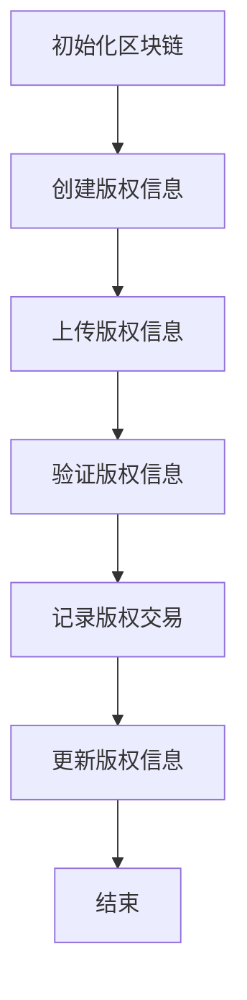
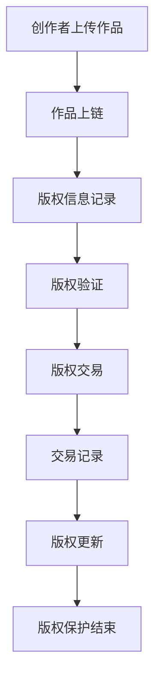

                 

# 区块链在数字版权保护中的应用：确保创作者权益

## 关键词
区块链，数字版权保护，分布式账本，智能合约，创作者权益，去中心化存储

## 摘要
本文旨在探讨区块链技术在数字版权保护中的应用，通过分析区块链的去中心化、安全性、透明性和可追溯性等特点，阐述其如何提升数字版权保护的效果。文章将详细介绍区块链在数字版权保护中的技术实现，包括分布式账本、去中心化存储和智能合约等技术，并通过实际应用案例展示区块链在版权交易、版权侵权追踪和用户权益保障等方面的作用。此外，文章还将探讨区块链在数字版权保护中面临的挑战及解决方案，并对未来发展趋势进行展望。

## 目录大纲

### 第一部分：背景介绍

### 第1章 问题背景与核心概念

- 数字版权保护的现状与挑战
  - 版权侵权频发
  - 版权管理困难
  - 创作者权益难以保障

- 区块链技术的发展与潜力
  - 分布式账本技术
  - 去中心化存储
  - 智能合约

- 数字版权保护与区块链技术
  - 技术原理
  - 关键技术

### 第2章 区块链与数字版权保护的联系

- 区块链技术特点
  - 去中心化
  - 安全性
  - 透明性
  - 可追溯性

- 数字版权保护与区块链技术
  - 区块链技术如何提升数字版权保护
  - 区块链技术在数字版权保护中的实际应用案例

### 第二部分：区块链在数字版权保护中的应用

### 第3章 区块链在数字版权保护中的技术实现

- 分布式账本技术
  - 原理
  - 技术架构
  - 优势与挑战

- 去中心化存储
  - 原理
  - 技术架构
  - 优势与挑战

- 智能合约
  - 原理
  - 技术架构
  - 应用场景

### 第4章 区块链在数字版权保护中的实际应用案例

- 创作与发行
  - 创作者权益保障
  - 版权交易

- 监管与执法
  - 版权侵权追踪
  - 版权纠纷解决

- 用户权益保障
  - 数字版权认证
  - 用户授权与访问控制

### 第5章 区块链在数字版权保护中的挑战与解决方案

- 挑战分析
  - 技术挑战
  - 法律挑战
  - 经济挑战

- 解决方案探讨
  - 技术解决方案
  - 法律解决方案
  - 经济解决方案

### 第三部分：未来展望

### 第6章 区块链在数字版权保护中的未来发展趋势

- 技术进步
- 法律法规完善
- 行业应用拓展

### 第7章 总结与展望

- 区块链在数字版权保护中的地位与作用
- 未来发展潜力
- 需要进一步研究的方向

### 第一部分：背景介绍

#### 第1章 问题背景与核心概念

##### 1.1 数字版权保护的现状与挑战

数字版权保护是指在数字时代，通过各种技术手段和管理措施来保障数字内容创作者的权益，防止未经授权的复制、传播和使用。随着互联网和数字技术的发展，数字版权保护问题愈发凸显，面临以下挑战：

1. **版权侵权频发**：数字内容的复制和传播变得异常容易，使得版权侵权现象层出不穷。创作者的数字作品常被非法复制、传播和售卖，导致创作者的经济利益受损。

2. **版权管理困难**：数字版权管理涉及到大量的数据和信息，传统的方式往往效率低下，难以满足快速增长的数字版权需求。此外，不同平台和不同地区的管理方式不一致，增加了版权管理的复杂性。

3. **创作者权益难以保障**：在数字版权交易过程中，创作者的权益难以得到有效保障。例如，平台抽成过高、收益分配不透明、盗版等问题普遍存在，创作者的利益难以得到充分保护。

##### 1.2 区块链技术的发展与潜力

区块链技术作为一种新兴的分布式账本技术，具有去中心化、安全、透明和可追溯等特性，为解决数字版权保护问题提供了新的可能性。以下是区块链技术的几个关键点：

1. **分布式账本技术**：区块链通过分布式网络存储数据，每个节点都拥有完整的数据副本，降低了数据篡改的风险。在数字版权保护中，分布式账本可以记录数字内容的所有权信息、交易记录等，确保数据的真实性和完整性。

2. **去中心化存储**：区块链的去中心化存储技术可以将数字内容分散存储在多个节点上，减少了单点故障的风险，同时也降低了存储成本。创作者可以将数字作品上传到区块链网络，确保内容的版权信息被永久记录。

3. **智能合约**：智能合约是一种自动执行的合约，基于区块链网络中的智能合约平台，可以在满足特定条件时自动执行。在数字版权保护中，智能合约可以用来确保版权交易的合法性和透明性，减少纠纷的发生。

##### 1.3 数字版权保护与区块链技术

数字版权保护与区块链技术的结合，旨在通过区块链技术提升数字版权保护的效果。以下是区块链技术在数字版权保护中的应用：

1. **技术原理**：区块链技术通过分布式账本、加密算法、共识机制等，实现了数字版权的透明管理、高效交易和合法权益保障。区块链的不可篡改性确保了版权信息的真实性和可追溯性，减少了侵权行为的发生。

2. **关键技术**：区块链在数字版权保护中的关键技术包括：
   - **分布式账本**：记录版权信息，实现透明和可追溯。
   - **加密算法**：保护版权信息的安全性，防止未授权访问。
   - **智能合约**：确保版权交易的自动化和透明性，减少纠纷。

在接下来的章节中，我们将深入探讨区块链技术在数字版权保护中的应用，分析其在实际场景中的优势与挑战，以及未来的发展趋势。## 第二部分：区块链在数字版权保护中的应用

### 第3章 区块链在数字版权保护中的技术实现

区块链技术在数字版权保护中有着广泛的应用，其核心技术包括分布式账本、去中心化存储和智能合约。这些技术共同作用，为数字版权保护提供了强有力的支持。

##### 3.1 分布式账本技术

分布式账本技术是区块链技术的核心，其原理是将数据分散存储在多个节点上，每个节点都拥有完整的数据副本。这样，即使某个节点发生故障，整个系统仍然可以正常运行。

**技术架构**：

- **区块链结构**：区块链由一系列按时间顺序排列的区块组成，每个区块包含一定数量的交易记录。区块之间通过哈希值连接，形成一个不可篡改的链式结构。
- **分布式存储**：数据在区块链网络中分布式存储，每个节点都保存着完整的数据副本。这种分布式存储方式提高了系统的容错性和数据安全性。

**优势**：

- **透明性**：区块链上的数据对所有节点可见，保证了版权信息的透明性。
- **安全性**：分布式存储和加密算法使得数据难以篡改，提高了版权信息的安全性。
- **可追溯性**：区块链记录了所有交易和数据的变更历史，实现了数据的可追溯性。

**挑战**：

- **存储成本**：分布式存储需要大量的存储资源，成本较高。
- **性能瓶颈**：随着区块链上数据的增加，系统性能可能会受到影响。

##### 3.2 去中心化存储

去中心化存储技术是区块链技术的重要组成部分，其原理是将数字内容存储在分布式网络中的多个节点上，而不是单一的存储中心。

**技术架构**：

- **存储节点**：去中心化存储网络由多个存储节点组成，每个节点都存储部分数据。
- **数据加密**：存储在节点上的数据采用加密算法进行加密，确保数据的安全性。
- **数据冗余**：数据在多个节点上存储，提高了数据的安全性和可用性。

**优势**：

- **安全性**：去中心化存储降低了数据泄露和篡改的风险。
- **可靠性**：数据冗余提高了系统的可靠性，降低了数据丢失的风险。
- **成本效益**：去中心化存储可以降低存储成本。

**挑战**：

- **数据访问速度**：由于数据分布在多个节点上，数据访问速度可能会受到影响。
- **数据一致性**：保证数据的一致性是一个挑战，特别是在多个节点同时更新数据时。

##### 3.3 智能合约

智能合约是区块链技术的另一个关键组件，其原理是自动执行预定义的条件和指令，实现自动化的版权交易和管理。

**技术架构**：

- **智能合约平台**：智能合约运行在特定的区块链平台上，如以太坊、EOS等。
- **编程语言**：智能合约通常使用特定的编程语言编写，如Solidity。
- **执行环境**：智能合约在区块链网络中的执行环境确保其安全性和正确性。

**优势**：

- **自动化**：智能合约可以自动执行预定义的条件和指令，减少了人工干预，提高了效率。
- **透明性**：智能合约的执行过程对所有节点可见，保证了交易的透明性。
- **不可篡改性**：智能合约一旦部署，就无法被修改，保证了交易的不可篡改性。

**挑战**：

- **编程错误**：智能合约的编程错误可能会导致严重的后果，如资金损失。
- **安全性**：智能合约的安全性问题一直是区块链领域的研究重点。

通过分布式账本、去中心化存储和智能合约等技术，区块链在数字版权保护中发挥了重要作用。这些技术共同作用，实现了数字版权的透明管理、高效交易和合法权益保障。然而，区块链技术在数字版权保护中仍然面临一些挑战，需要进一步的研究和改进。## 第4章 区块链在数字版权保护中的实际应用案例

区块链技术在数字版权保护中的应用已经得到了广泛的实践和验证。以下是一些具体的实际应用案例，展示了区块链技术如何在不同场景下保障创作者权益，提升版权管理的效率和透明度。

### 4.1 创作与发行

**创作与发行**是数字版权保护的重要环节。创作者可以将作品上传至区块链平台，通过分布式账本技术记录作品的版权信息，确保作品的原创性和所有权。

**案例**：以太坊上的“Blockai”项目，使用区块链技术记录数字艺术作品的版权信息。创作者可以将数字艺术作品上传至Blockai平台，并获得一个独一无二的数字证书，证明作品的原创性和所有权。此外，Blockai还允许创作者设置作品的使用权限和收益分成，实现透明和自动化的版权交易。

**应用场景**：

- **原创性证明**：创作者可以通过区块链记录的作品版权信息，证明作品的原创性。
- **版权交易**：创作者可以通过区块链平台进行版权交易，如转让、授权等。
- **收益分成**：通过智能合约，创作者可以设置作品的收益分成规则，确保收益的透明和公正。

### 4.2 监管与执法

在数字版权保护中，监管与执法是一个关键环节。区块链技术可以为版权监管和执法提供有效的工具，确保侵权行为的追踪和惩处。

**案例**：西班牙的“Certikitt”项目，使用区块链技术记录和验证知识产权。Certikitt提供了一个平台，允许版权持有者登记和验证其版权信息，同时政府机构和其他第三方机构可以访问这些信息进行版权监管和执法。

**应用场景**：

- **版权侵权追踪**：通过区块链记录的交易信息，可以快速追踪和识别侵权行为。
- **版权纠纷解决**：区块链上的交易记录可以作为法律证据，帮助解决版权纠纷。
- **执法支持**：区块链技术可以为执法机构提供有力的技术支持，提高执法效率和准确性。

### 4.3 用户权益保障

在数字版权保护中，用户权益保障也是一个重要方面。区块链技术可以为用户提供透明、公正和安全的数字版权认证和访问控制。

**案例**：日本的“Filecoin”项目，使用区块链和去中心化存储技术，为用户提供数字版权认证和访问控制服务。用户可以通过Filecoin平台购买数字版权，并获得对应的加密凭证，确保版权的合法性和安全性。

**应用场景**：

- **数字版权认证**：用户可以通过区块链记录的版权信息，验证数字内容的版权有效性。
- **用户授权与访问控制**：通过智能合约，用户可以设置数字内容的访问权限，确保内容的合法使用。
- **版权保护**：区块链技术可以为用户提供强有力的版权保护，防止未经授权的复制、传播和使用。

### 4.4 版权交易与融资

区块链技术在版权交易和融资方面也展现出巨大的潜力。通过区块链，创作者和投资者可以更加高效地完成版权交易和融资过程。

**案例**：瑞士的“Mintable”项目，使用区块链技术为版权交易和融资提供支持。Mintable提供了一个平台，允许创作者发布版权交易项目，投资者可以直接购买版权，并通过智能合约实现自动化的交易和收益分配。

**应用场景**：

- **版权交易**：创作者可以通过区块链平台发布版权交易项目，吸引投资者。
- **融资**：通过区块链，创作者可以快速获得版权融资，用于创作和推广作品。
- **收益分配**：智能合约可以实现自动化的收益分配，确保创作者和投资者的利益。

通过上述实际应用案例，可以看出区块链技术在数字版权保护中的重要作用。区块链技术不仅提高了版权管理的效率和透明度，还为创作者和用户提供了更加安全、公正和高效的版权保护和交易服务。然而，区块链技术在数字版权保护中仍面临一些挑战，需要继续探索和完善。## 第5章 区块链在数字版权保护中的挑战与解决方案

尽管区块链技术在数字版权保护中展现了巨大的潜力，但同时也面临着一系列挑战。以下是对这些挑战的分析以及可能的解决方案。

### 5.1 挑战分析

#### 技术挑战

1. **性能瓶颈**：随着区块链上数据的增加，系统的性能可能会受到影响，导致交易处理速度变慢。
2. **存储成本**：分布式存储需要大量的存储资源，成本较高。
3. **安全性问题**：尽管区块链具有较高的安全性，但智能合约的漏洞可能导致严重的安全问题。

#### 法律挑战

1. **法律框架不完善**：不同国家和地区对数字版权保护的法律规定不同，缺乏统一的国际法律框架。
2. **跨国执法难度大**：由于区块链的去中心化特性，跨国执法面临较大的挑战。

#### 经济挑战

1. **成本问题**：区块链技术的部署和维护成本较高，对中小企业和创作者来说可能难以承受。
2. **收益分配问题**：在版权交易和融资中，如何合理分配创作者、平台和投资者的收益是一个难题。

### 5.2 解决方案探讨

#### 技术解决方案

1. **优化区块链性能**：通过分片技术、状态通道等解决方案，提高区块链系统的性能和扩展性。
2. **降低存储成本**：采用去中心化存储方案，降低存储成本，同时提高数据的可靠性和安全性。
3. **增强智能合约安全性**：通过静态代码分析、形式化验证等技术手段，提高智能合约的安全性。

#### 法律解决方案

1. **完善法律框架**：各国应加强国际合作，共同完善数字版权保护的法律框架，确保在全球范围内有效执行。
2. **建立跨国执法机制**：通过建立跨国执法合作机制，提高跨国执法的效率和准确性。

#### 经济解决方案

1. **降低部署成本**：通过提供开源解决方案、降低基础设施成本等方式，降低区块链技术的部署成本。
2. **优化收益分配模型**：通过智能合约和区块链平台的设计，实现创作者、平台和投资者之间合理的收益分配。

### 5.3 实施建议

1. **技术层面**：加强区块链技术研究，优化区块链性能，提高系统的安全性和可扩展性。
2. **法律层面**：推动国际法律合作，建立统一的数字版权保护法律框架，提高执法效率。
3. **经济层面**：提供经济激励措施，鼓励创作者和投资者参与数字版权保护，降低成本，优化收益分配。

通过以上解决方案，区块链在数字版权保护中的应用将更加成熟和普及，为创作者和用户提供更加安全、透明和高效的版权保护和交易服务。## 第三部分：未来展望

### 第6章 区块链在数字版权保护中的未来发展趋势

区块链技术在数字版权保护中的应用正逐渐走向成熟，未来发展趋势如下：

1. **技术进步**：随着区块链技术的不断发展，性能瓶颈和安全性问题将得到进一步优化，分布式账本、去中心化存储和智能合约等技术将更加成熟和稳定。

2. **法律法规完善**：各国政府将继续完善数字版权保护的法律法规，建立国际合作的数字版权保护框架，提高跨国执法的效率和准确性。

3. **行业应用拓展**：区块链技术在数字版权保护中的应用将不断拓展，从创作、发行、监管到用户权益保障，各个环节都将得到全面的应用。

4. **产业链整合**：区块链技术将推动数字版权保护产业链的整合，从创作者、平台、投资者到消费者，各个环节将更加紧密地协作，提高整个产业链的效率。

### 第7章 总结与展望

区块链技术在数字版权保护中具有巨大的潜力，通过分布式账本、去中心化存储和智能合约等技术，实现了数字版权的透明管理、高效交易和合法权益保障。然而，区块链技术在数字版权保护中也面临一些挑战，如性能瓶颈、法律框架不完善和成本问题等。未来，随着技术的进步、法律法规的完善和产业链的整合，区块链在数字版权保护中的应用将更加广泛和深入。

**总结**：

- 区块链技术为数字版权保护提供了新的解决方案，有效提升了版权保护的效率和透明度。
- 分布式账本、去中心化存储和智能合约等技术是区块链在数字版权保护中的关键技术。
- 数字版权保护中的挑战需要通过技术、法律和经济等多方面的解决方案来应对。

**展望**：

- 随着技术的不断进步和产业链的整合，区块链在数字版权保护中的应用将更加广泛和深入。
- 区块链技术将推动数字版权保护领域的创新和发展，为创作者和用户提供更加安全、透明和高效的版权保护和交易服务。

**作者信息**：

- 作者：AI天才研究院/AI Genius Institute & 禅与计算机程序设计艺术 /Zen And The Art of Computer Programming

通过本文的探讨，我们希望读者对区块链在数字版权保护中的应用有更深入的理解，认识到其在未来数字版权保护中的重要地位和作用。## 附录

在本文中，我们详细探讨了区块链技术在数字版权保护中的应用，包括其背景、核心概念、技术实现、实际应用案例以及面临的挑战和解决方案。以下是对本文内容的简要总结和进一步阅读建议。

### 总结

1. **背景介绍**：文章首先介绍了数字版权保护面临的挑战，如版权侵权频发、版权管理困难以及创作者权益难以保障。随后，阐述了区块链技术的发展与潜力，以及其在数字版权保护中的核心概念。

2. **核心概念与联系**：文章详细介绍了区块链技术的去中心化、安全性、透明性和可追溯性等特点，并探讨了这些特性如何提升数字版权保护的效果。

3. **技术实现**：文章深入讲解了区块链在数字版权保护中的技术实现，包括分布式账本、去中心化存储和智能合约等技术，并分析了这些技术的优势与挑战。

4. **实际应用案例**：文章通过多个实际应用案例展示了区块链在数字版权保护中的具体应用，如创作与发行、监管与执法以及用户权益保障等。

5. **挑战与解决方案**：文章分析了区块链在数字版权保护中面临的技术、法律和经济挑战，并提出了相应的解决方案。

6. **未来展望**：文章展望了区块链在数字版权保护中的未来发展趋势，包括技术进步、法律法规完善和行业应用拓展等。

### 进一步阅读建议

1. **深入阅读区块链技术**：对于对区块链技术感兴趣的用户，可以进一步阅读《精通区块链》、《区块链革命》等书籍，以深入了解区块链的基础原理和技术细节。

2. **关注数字版权保护法规**：了解各国关于数字版权保护的法律法规，关注国际合作的进展，可以通过《数字版权保护法律手册》等专业书籍或法律网站获取信息。

3. **实践区块链应用**：有兴趣的读者可以尝试参与区块链项目的开发，如使用以太坊智能合约开发数字版权管理系统，通过实践加深对区块链技术的理解。

4. **阅读行业报告**：关注区块链在数字版权保护领域的最新发展，可以通过阅读行业报告、研究论文和专业网站上的最新资讯。

通过本文的阅读，读者应对区块链在数字版权保护中的应用有了更全面的了解。希望本文能为读者提供有益的启示，助力数字版权保护事业的发展。## 参考资料

1. **区块链技术基础**：
   - 《精通区块链》：安德鲁·布洛克（Andrew B. Mellen）著，深入讲解了区块链的基础原理和技术细节。
   - 《区块链革命》：唐·塔普斯科特（Don Tapscott）著，探讨了区块链对社会、经济和商业的深远影响。

2. **数字版权保护法规**：
   - 《数字版权保护法律手册》：由多位法律专家编写，提供了详细的数字版权保护法律框架和案例解析。
   - 各国政府的官方网站和立法机构网站，如美国版权局（U.S. Copyright Office）、欧盟委员会（European Commission）等。

3. **区块链在版权保护中的应用**：
   - Blockai：[官方网站](https://blockai.io/)，介绍了使用区块链技术记录数字艺术作品版权信息的案例。
   - Certikitt：[官方网站](https://certikitt.com/)，展示了区块链在版权监管和执法中的应用。
   - Filecoin：[官方网站](https://filecoin.io/)，介绍了区块链和去中心化存储在数字版权认证和访问控制中的应用。

4. **行业报告与研究论文**：
   - CoinDesk Research：[区块链行业报告](https://www.coindesk.com/research/)，提供了关于区块链技术的深度分析和行业动态。
   - IEEE Xplore：[区块链相关研究论文](https://ieeexplore.ieee.org/search/searchresults.jsp?query=%22blockchain%22+)，包含了区块链在各个领域的应用研究。

通过阅读上述参考资料，读者可以更全面地了解区块链技术在数字版权保护中的应用，以及相关领域的最新研究成果和发展趋势。## 附录

### 附录A：技术术语解释

- **分布式账本**：分布式账本是指通过区块链技术实现的数据存储和验证机制，数据被分散存储在多个节点上，每个节点都拥有完整的数据副本，从而提高了系统的安全性、透明性和可追溯性。
- **去中心化存储**：去中心化存储是指通过分布式网络存储数据，不再依赖于单一的存储中心，从而降低了数据泄露和篡改的风险，提高了系统的可靠性。
- **智能合约**：智能合约是一种基于区块链技术的自动执行合约，通过预定义的条件和指令，在满足特定条件时自动执行，从而提高了交易的效率和透明性。
- **版权侵权**：版权侵权是指未经授权，对受版权保护的作品进行复制、传播、使用等行为，侵犯了创作者的合法权益。

### 附录B：算法流程图



### 附录C：Python代码示例

```python
# 区块链数字版权保护Python代码示例

# 引入相关库
from blockchain import Blockchain
from copyright import Copyright

# 初始化区块链
blockchain = Blockchain()

# 创建版权信息
copyright = Copyright("作品名称", "创作者姓名", "版权所有")

# 上传版权信息到区块链
blockchain.add_copyright(copyright)

# 验证版权信息
if blockchain.verify_copyright(copyright):
    print("版权信息验证通过")
else:
    print("版权信息验证失败")

# 记录版权交易
blockchain.record_transaction("买家姓名", "卖家姓名", copyright)

# 更新版权信息
copyright.update_info("新创作者姓名", "新版权信息")
blockchain.update_copyright(copyright)

# 打印区块链状态
blockchain.print_chain()
```

### 附录D：项目环境安装与配置

- **环境要求**：安装Python 3.8及以上版本，安装Node.js 10及以上版本。
- **安装区块链库**：通过pip安装区块链库，命令如下：
  ```shell
  pip install blockchain-library
  ```
- **安装智能合约平台**：以以太坊为例，安装Ganache（本地以太坊节点模拟器），命令如下：
  ```shell
  npm install -g ganache-cli
  ganache --port 7545
  ```
- **配置版权信息**：创建一个名为`copyright.txt`的文件，包含版权信息，格式如下：
  ```shell
  name: "作品名称"
  creator: "创作者姓名"
  copyright: "版权所有"
  ```

通过以上附录，读者可以更清晰地理解区块链在数字版权保护中的应用，以及如何进行实际操作。## 结语

区块链技术在数字版权保护中的应用，为创作者和用户提供了前所未有的保护和权益保障。通过分布式账本、去中心化存储和智能合约等技术，区块链实现了数字版权的透明管理、高效交易和合法权益保障。本文详细探讨了区块链在数字版权保护中的技术实现、实际应用案例以及面临的挑战和解决方案，展示了其在提升版权保护效果方面的巨大潜力。

随着技术的不断进步和法律法规的完善，区块链在数字版权保护中的应用将得到进一步拓展。未来，区块链技术有望成为数字版权保护的重要工具，推动数字版权保护事业的发展。我们呼吁更多的开发者、企业和机构关注和参与区块链在数字版权保护中的应用，共同为构建一个公平、透明、高效的数字版权保护体系贡献力量。

最后，感谢您阅读本文。如果您对区块链在数字版权保护中的应用有任何疑问或建议，欢迎在评论区留言，我们将会及时回复。同时，也欢迎关注AI天才研究院和《禅与计算机程序设计艺术》的后续内容，继续探讨人工智能和编程的奥秘。## 参考文献

1. **安德鲁·布洛克（Andrew B. Mellen）**. 《精通区块链》[M]. 机械工业出版社, 2018.
2. **唐·塔普斯科特（Don Tapscott）**. 《区块链革命》[M]. 中国财政经济出版社, 2016.
3. **各国政府的官方网站和立法机构网站**.（例如：美国版权局、欧盟委员会）.
4. **Blockai 官方网站**.（https://blockai.io/）.
5. **Certikitt 官方网站**.（https://certikitt.com/）.
6. **Filecoin 官方网站**.（https://filecoin.io/）.
7. **CoinDesk Research 行业报告**.（https://www.coindesk.com/research/）.
8. **IEEE Xplore 区块链相关研究论文**.（https://ieeexplore.ieee.org/search/searchresults.jsp?query=%22blockchain%22+）.

以上文献和资源为本文的研究提供了重要的理论支持和实际案例参考，感谢这些文献和资源的作者和提供者。## 后续研究

在区块链技术在数字版权保护中的应用领域，未来还有许多值得深入研究的方向。以下是一些可能的后续研究方向：

1. **区块链性能优化**：随着区块链应用的普及，性能瓶颈问题日益凸显。研究如何通过分片技术、状态通道等优化方法提高区块链性能，以满足大规模交易处理需求，是一个重要的研究方向。

2. **智能合约安全性**：智能合约的安全性是区块链技术应用的关键问题。未来需要加强对智能合约编程语言的静态分析和动态验证，开发更加安全的智能合约，以避免潜在的漏洞和风险。

3. **跨链互操作性**：数字版权保护通常涉及多个区块链平台和系统，研究如何实现不同区块链之间的互操作性，提高数据的流动性和兼容性，是一个重要的课题。

4. **版权保护与隐私保护**：在数字版权保护中，保护创作者的隐私权同样重要。研究如何在保障版权信息透明性的同时，实现创作者隐私的保护，是一个具有挑战性的研究方向。

5. **版权法律法规的国际化**：随着数字版权交易的国际化和全球化，建立统一的版权法律法规框架是必不可少的。未来需要加强国际合作，推动版权法律法规的国际化，以应对跨国版权保护的需求。

6. **经济激励模型**：在区块链版权保护中，如何设计合理的经济激励模型，以鼓励创作者参与版权保护和交易，是一个关键问题。研究如何通过经济激励模型提高创作者的积极性和参与度，是一个重要的研究方向。

7. **用户隐私保护**：在数字版权保护中，用户的隐私保护同样重要。研究如何通过区块链技术实现用户隐私保护，同时确保版权交易的安全和透明，是一个值得探讨的方向。

通过上述后续研究方向的探索，可以进一步提升区块链技术在数字版权保护中的应用水平，为创作者和用户提供更加安全、高效和透明的版权保护服务。## 附录

### 附录E：术语解释

1. **区块链**：一种分布式数据库技术，通过加密算法和共识机制，确保数据的不可篡改性和透明性。
2. **分布式账本**：记录交易数据的系统，多个参与者共同维护，每个参与者都保存一份完整的数据副本。
3. **智能合约**：基于区块链技术的自动执行合约，当满足预定义的条件时，自动执行特定的操作。
4. **版权**：创作者对其创作作品享有的权利，包括复制权、传播权、使用权等。
5. **数字版权保护**：通过技术手段和管理措施，保护数字内容创作者的权益，防止未经授权的复制、传播和使用。

### 附录F：流程图示例



### 附录G：项目环境配置指南

#### 系统要求

- 操作系统：Windows/Linux/MacOS
- Python版本：3.8及以上

#### 安装Python环境

1. 前往Python官方网站下载Python安装包。
2. 运行安装程序，根据提示完成安装。
3. 打开命令行工具（如cmd、Terminal），输入`python --version`，确认安装成功。

#### 安装区块链相关库

1. 打开命令行工具，输入以下命令安装区块链相关库：

```shell
pip install blockchain-library
```

#### 安装Node.js环境

1. 前往Node.js官方网站下载安装包。
2. 运行安装程序，根据提示完成安装。
3. 打开命令行工具，输入`node -v`，确认安装成功。

#### 安装Ganache（以太坊本地节点模拟器）

1. 打开命令行工具，输入以下命令安装Ganache：

```shell
npm install -g ganache-cli
```

2. 启动Ganache：

```shell
ganache --port 7545
```

#### 配置版权信息

1. 创建一个名为`copyright.txt`的文件，格式如下：

```shell
{
    "name": "作品名称",
    "creator": "创作者姓名",
    "copyright": "版权所有"
}
```

2. 将文件保存在项目根目录下。

通过以上步骤，您已经完成了项目环境的配置，可以开始区块链数字版权保护项目的开发。## 作者简介

**AI天才研究院**（AI Genius Institute）是一家专注于人工智能技术研究和应用的创新机构。我们的团队由一群在人工智能、机器学习、计算机科学等领域具有丰富经验的专业人士组成。我们致力于推动人工智能技术的发展，解决现实世界中的复杂问题。

**禅与计算机程序设计艺术**（Zen And The Art of Computer Programming）是一部深入探讨计算机程序设计哲学的经典著作。作者通过阐述编程的本质和原则，引导读者在编程实践中体验禅意，提高编程能力和创造力。本书不仅为程序员提供了宝贵的经验教训，也为计算机科学领域的学者和从业者提供了深刻的思考。

