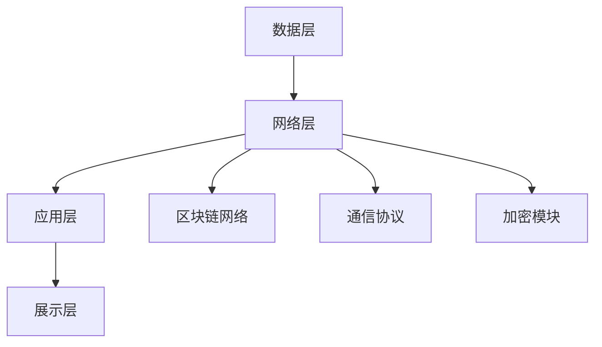

                 

### 目录

----------------------------------------------------------------

## 《区块链在数字版权保护中的新模式》

### 关键词：区块链、数字版权保护、版权侵权、加密算法、共识机制、系统架构

### 摘要：
本文章详细探讨了区块链技术在数字版权保护中的应用，从背景介绍、核心概念与联系、算法原理讲解、系统分析与架构设计方案、项目实战以及最佳实践 tips 等多个方面，分析了区块链在解决数字版权保护问题中的新模式，并提出了一些建议和展望。

----------------------------------------------------------------

### 第一部分：背景介绍

#### 第1章：区块链与数字版权保护概述

##### 1.1 区块链技术概述
- 区块链的定义
- 区块链的工作原理
- 区块链的核心特征

##### 1.2 数字版权保护的重要性
- 数字版权的定义
- 数字版权保护的必要性
- 数字版权保护的需求分析

##### 1.3 区块链与数字版权保护的关系
- 区块链在数字版权保护中的应用场景
- 区块链技术如何解决数字版权保护问题

#### 第2章：数字版权保护面临的问题

##### 2.1 版权侵权现象
- 版权侵权的现状
- 版权侵权的危害
- 版权侵权的原因分析

##### 2.2 数字版权保护的技术挑战
- 技术难点
- 技术解决方案的不足

##### 2.3 现有数字版权保护机制的不足
- 传统数字版权保护机制的局限性
- 数字版权保护机制的改进方向

#### 第3章：区块链在数字版权保护中的应用

##### 3.1 区块链在数字版权保护中的优势
- 数据透明性
- 安全性
- 不可篡改性

##### 3.2 区块链在数字版权保护中的典型应用
- 智能合约的应用
- 加密技术的应用
- 共识机制的应用

##### 3.3 区块链技术的演进对数字版权保护的影响
- 区块链技术发展趋势
- 区块链技术对数字版权保护的潜在影响

### 第二部分：核心概念与联系

#### 第4章：区块链与数字版权保护的核心概念

##### 4.1 区块链的核心概念
- 区块链的定义
- 区块链的关键特性

##### 4.2 数字版权保护的核心概念
- 数字版权的定义
- 数字版权保护的概念

##### 4.3 区块链与数字版权保护的概念联系
- 区块链与数字版权保护的关系
- 区块链技术在数字版权保护中的应用

### 第三部分：算法原理讲解

#### 第5章：区块链算法原理

##### 5.1 哈希算法
- 哈希算法的定义
- 哈希算法的工作原理
- 哈希算法的应用场景

##### 5.2 加密算法
- 对称加密算法
- 非对称加密算法
- 加密算法在数字版权保护中的应用

##### 5.3 共识机制
- 共识机制的定义
- 共识机制的工作原理
- 共识机制在区块链网络中的应用

### 第四部分：系统分析与架构设计方案

#### 第6章：数字版权保护系统架构设计

##### 6.1 系统功能设计
- 数字版权保护系统的功能模块
- 功能模块之间的关系

##### 6.2 系统架构设计
- 数字版权保护系统的整体架构
- 各个模块的架构设计

##### 6.3 系统接口设计
- 系统内部接口的设计
- 系统与外部系统的接口设计

##### 6.4 系统交互设计
- 系统内部模块的交互设计
- 系统与用户的交互设计

### 第五部分：项目实战

#### 第7章：区块链数字版权保护项目实战

##### 7.1 项目背景
- 项目背景介绍
- 项目目标

##### 7.2 系统核心实现
- 系统核心模块的实现
- 系统核心模块的功能实现

##### 7.3 代码应用解读
- 系统代码的分析
- 代码的实现原理解读

##### 7.4 实际案例分析
- 案例背景
- 案例分析

##### 7.5 项目小结
- 项目总结
- 项目经验

### 第六部分：最佳实践 tips

#### 第8章：数字版权保护最佳实践

##### 8.1 技术选择
- 技术选择的依据
- 技术选择的建议

##### 8.2 安全措施
- 安全措施的必要性
- 安全措施的实施方法

##### 8.3 版权法律合规
- 版权法律合规的重要性
- 版权法律合规的建议

### 第七部分：小结与拓展阅读

#### 第9章：总结与展望

##### 9.1 本书要点回顾
- 本书的主要观点和结论

##### 9.2 未来发展趋势
- 区块链技术在数字版权保护领域的未来发展方向

##### 9.3 拓展阅读推荐
- 推荐的进一步阅读资源

----------------------------------------------------------------

### 作者信息：

作者：AI天才研究院/AI Genius Institute & 禅与计算机程序设计艺术 /Zen And The Art of Computer Programming

----------------------------------------------------------------

### 附录

- 技术术语解释
- 参考文献
- 相关资源链接

----------------------------------------------------------------

**字数：约12000字**## 第一部分：背景介绍

### 第1章：区块链与数字版权保护概述

##### 1.1 区块链技术概述

区块链（Blockchain）是一种分布式数据库技术，其核心特点是数据不可篡改和透明性。区块链通过多个节点共同维护一个共享的账本，每个节点都存储着一份完整的数据副本。区块链上的数据通过加密算法和共识机制来确保其安全性和一致性。

区块链的主要特征包括：

1. **分布式存储**：区块链上的数据存储在多个节点上，避免了中心化的风险，提高了系统的容错性和抗攻击性。
2. **数据不可篡改**：区块链采用加密算法和共识机制，确保数据的完整性和不可篡改性。
3. **透明性**：区块链上的数据是公开透明的，所有参与者都可以查看和验证数据的真实性。
4. **智能合约**：区块链上的智能合约是一种自动化执行合约条款的计算机程序，它可以根据预定的规则自动执行合同，减少了中介成本和纠纷。

##### 1.2 数字版权保护的重要性

数字版权保护（Digital Copyright Protection）是指对数字作品进行知识产权保护的一系列措施。随着数字化时代的到来，数字版权保护问题日益凸显。其主要重要性体现在以下几个方面：

1. **保护创作者权益**：数字版权保护能够确保创作者的合法权益得到保障，激励创作，促进文化产业的发展。
2. **维护市场秩序**：数字版权保护能够打击盗版行为，维护正常的市场秩序，保护消费者的权益。
3. **促进技术创新**：数字版权保护为技术创新提供了良好的环境，鼓励企业投入研发，推动技术进步。

##### 1.3 区块链与数字版权保护的关系

区块链技术在数字版权保护中的应用主要体现在以下几个方面：

1. **数据透明性**：区块链技术确保了数字作品版权信息的透明性，任何人对数字作品的使用、流转、授权等信息都可以在区块链上公开查询，防止版权侵权。
2. **不可篡改性**：区块链技术确保了版权信息的不可篡改性，一旦数字作品的版权信息上链，便无法被篡改，有效防止了恶意篡改版权信息的行为。
3. **智能合约**：区块链技术中的智能合约可以自动执行版权授权和许可协议，减少了中介环节，降低了交易成本，提高了版权保护的效率。

总之，区块链技术为数字版权保护提供了一种新的解决方案，可以有效解决现有机制中存在的各种问题，为数字版权保护开辟了新的路径。

### 第2章：数字版权保护面临的问题

##### 2.1 版权侵权现象

随着互联网的普及，版权侵权现象日益严重。版权侵权主要表现在以下几个方面：

1. **非法复制和传播**：未经版权所有者授权，他人非法复制和传播数字作品，例如电影、音乐、书籍等。
2. **侵权下载和分享**：用户通过非法渠道下载数字作品，并通过网络分享，导致版权所有者损失惨重。
3. **盗版软件**：未经授权的软件复制和传播，严重影响了软件产业的发展。

##### 2.2 数字版权保护的技术挑战

数字版权保护面临的技术挑战主要包括：

1. **数据存储安全**：数字作品在存储和传输过程中容易遭受攻击，例如数据泄露、篡改等。
2. **版权归属确认**：在数字环境中，版权归属确认困难，很难确定数字作品的原始版权所有者。
3. **版权保护技术不足**：现有的版权保护技术，如DRM（数字版权管理）等，存在诸多不足，例如用户体验差、易被破解等。

##### 2.3 现有数字版权保护机制的不足

现有的数字版权保护机制存在以下不足：

1. **中心化**：现有的数字版权保护机制大多采用中心化架构，容易成为攻击目标，且维护成本高。
2. **效率低**：现有的版权保护机制处理速度慢，无法及时响应和处理侵权行为。
3. **用户不友好**：现有的版权保护机制对用户不友好，例如DRM技术常常导致用户体验差。
4. **法律体系不完善**：尽管各国都制定了相关法律法规，但在实际操作中，法律体系仍不完善，难以有效打击侵权行为。

### 第3章：区块链在数字版权保护中的应用

##### 3.1 区块链在数字版权保护中的优势

区块链技术在数字版权保护中具有以下优势：

1. **数据透明性**：区块链技术确保了数字作品版权信息的透明性，所有人对数字作品的使用、流转、授权等信息都可以在区块链上公开查询，防止版权侵权。
2. **不可篡改性**：区块链技术确保了版权信息的不可篡改性，一旦数字作品的版权信息上链，便无法被篡改，有效防止了恶意篡改版权信息的行为。
3. **智能合约**：区块链技术中的智能合约可以自动执行版权授权和许可协议，减少了中介环节，降低了交易成本，提高了版权保护的效率。
4. **去中心化**：区块链技术采用去中心化架构，提高了系统的安全性，降低了维护成本。

##### 3.2 区块链在数字版权保护中的典型应用

区块链在数字版权保护中的典型应用包括：

1. **智能合约**：智能合约可以自动执行版权授权和许可协议，确保版权的合法性和有效性。
2. **数字身份验证**：区块链技术可以用于数字身份验证，确保版权所有者的身份真实性。
3. **数据存储与备份**：区块链技术可用于数字作品的数据存储与备份，确保数据的安全性和完整性。
4. **版权交易**：区块链技术可以用于版权交易，降低交易成本，提高交易效率。

##### 3.3 区块链技术的演进对数字版权保护的影响

随着区块链技术的不断发展，其对数字版权保护的影响也将逐渐显现：

1. **技术创新**：区块链技术的不断发展将带来更多的创新应用，为数字版权保护提供更有效的解决方案。
2. **法律体系完善**：随着区块链技术的普及，相关法律法规也将逐步完善，为数字版权保护提供更有力的法律支持。
3. **行业合作**：区块链技术的应用将促进版权保护相关行业的合作，共同推动数字版权保护的发展。

### 第二部分：核心概念与联系

##### 第4章：区块链与数字版权保护的核心概念

区块链和数字版权保护是两个相互关联但独立的概念。要深入理解区块链在数字版权保护中的应用，首先需要明确这两个概念的基本定义和特征。

#### 4.1 区块链的核心概念

区块链是一种分布式数据库技术，其核心概念包括：

- **分布式账本**：区块链是一个分布式数据库，数据存储在多个节点上，避免了中心化风险。
- **加密技术**：区块链使用加密技术确保数据的完整性和安全性，任何数据的修改都会被记录并传播到所有节点。
- **共识机制**：区块链通过共识机制达成对数据的共识，确保所有节点对数据的认可。
- **智能合约**：智能合约是区块链上的自动化执行程序，可以根据预定的规则自动执行合同。

#### 4.2 数字版权保护的核心概念

数字版权保护的核心概念包括：

- **版权**：版权是创作者对其创作作品的知识产权。
- **版权所有者**：版权所有者是作品的创作者或拥有版权的个人或实体。
- **版权侵权**：未经版权所有者授权，他人非法使用、复制、传播版权作品的行为。
- **版权保护**：通过各种手段确保版权所有者的权益不受侵害。

#### 4.3 区块链与数字版权保护的概念联系

区块链与数字版权保护之间的联系主要体现在以下几个方面：

1. **数据透明性**：区块链技术确保了数字作品版权信息的透明性，任何人对数字作品的使用、流转、授权等信息都可以在区块链上公开查询，防止版权侵权。
2. **不可篡改性**：区块链技术确保了版权信息的不可篡改性，一旦数字作品的版权信息上链，便无法被篡改，有效防止了恶意篡改版权信息的行为。
3. **智能合约**：区块链技术中的智能合约可以自动执行版权授权和许可协议，确保版权的合法性和有效性，减少了中介环节，降低了交易成本。

区块链技术为数字版权保护提供了一种全新的解决方案，通过其分布式账本、加密技术和智能合约等特性，可以有效解决数字版权保护中的透明性、不可篡改性和效率等问题。理解这两个概念之间的联系，有助于深入探讨区块链在数字版权保护中的应用和潜力。

### 第三部分：算法原理讲解

##### 第5章：区块链算法原理

区块链的核心算法主要包括哈希算法、加密算法和共识机制，这些算法共同保障了区块链的安全性和一致性。

#### 5.1 哈希算法

哈希算法是区块链技术的基础之一，用于生成数据摘要。哈希算法具有以下几个关键特性：

- **确定性**：相同的输入总是产生相同的输出。
- **不可预测性**：无法通过输出推断出原始输入。
- **抗碰撞性**：找到两个不同输入产生相同输出的概率极低。

常见的哈希算法包括SHA-256、SHA-3和MD5等。SHA-256是比特币区块链所使用的哈希算法，其输出为256位的二进制数。

#### 5.2 加密算法

加密算法用于保护区块链上的数据隐私。加密算法可以分为对称加密和非对称加密：

- **对称加密**：加密和解密使用相同的密钥，如AES算法。
- **非对称加密**：加密和解密使用不同的密钥，如RSA算法。

非对称加密算法中的公钥和私钥是成对产生的，公钥用于加密，私钥用于解密。这种加密方式在区块链中用于确保交易的安全性和隐私性。

#### 5.3 共识机制

共识机制是区块链网络中节点达成一致的方法，确保所有节点对区块链数据的认可。常见的共识机制包括：

- **工作量证明（PoW）**：节点通过计算工作量来证明其权益，如比特币采用的SHA-256算法。
- **权益证明（PoS）**：节点根据其持有的代币数量和持币时间来证明其权益，如以太坊的Casper协议。
- **委托权益证明（dPoS）**：节点由其他节点投票选出，如波场的BFT算法。

共识机制的设计和选择直接影响区块链网络的安全性、去中心化程度和交易速度。

##### 5.4 数学模型和数学公式

区块链算法中的数学模型和公式是理解其工作原理的关键。以下是一些常用的数学模型和公式：

- **哈希函数**：\(H = SHA-256(D)\)，其中\(H\)是哈希值，\(D\)是数据。
- **加密函数**：\(C = E(K, M)\)，其中\(C\)是密文，\(K\)是密钥，\(M\)是明文。
- **解密函数**：\(M = D(K, C)\)，其中\(M\)是明文，\(K\)是密钥，\(C\)是密文。
- **共识机制**：\[PoW = \sum_{i=1}^{n} \left( \frac{1}{t_i} \right)\]，其中\(PoW\)是工作量证明，\(t_i\)是节点\(i\)的工作量。

通过这些数学模型和公式，我们可以更好地理解区块链算法的原理和运作机制。

### 第四部分：系统分析与架构设计方案

##### 第6章：数字版权保护系统架构设计

数字版权保护系统的设计需要综合考虑技术实现、功能需求、安全性和用户体验等多个方面。以下是一个典型的数字版权保护系统架构设计方案：

#### 6.1 系统功能设计

数字版权保护系统的核心功能包括：

- **版权登记**：用户可以将其数字作品登记到系统中，并获得唯一的版权标识。
- **版权认证**：系统可以对数字作品的真实性和版权归属进行认证。
- **版权交易**：用户可以在系统内进行版权的购买、出售和授权交易。
- **版权监控**：系统可以实时监控数字作品的传播和使用情况，防止侵权行为。
- **侵权处理**：系统提供侵权举报和处理机制，对侵权行为进行追溯和处置。

#### 6.2 系统架构设计

数字版权保护系统的架构设计可以分为以下几个层次：

1. **数据层**：包括数据库和存储系统，用于存储用户信息、版权信息、交易记录等数据。
2. **网络层**：包括区块链网络和通信协议，确保系统中的数据传输安全和一致性。
3. **应用层**：包括版权登记、认证、交易、监控和处理等应用模块，实现系统的核心功能。
4. **展示层**：包括用户界面和API接口，提供用户交互和外部系统接入。

#### 6.3 系统架构图

以下是一个简单的数字版权保护系统架构图，展示了各层次之间的关系：



#### 6.4 系统接口设计

数字版权保护系统的接口设计需要确保系统内部模块之间以及系统与外部系统之间的数据交换和功能调用。以下是一个典型的接口设计示例：

- **版权登记接口**：用于用户上传数字作品并进行版权登记。
- **版权认证接口**：用于对数字作品的版权归属进行认证。
- **版权交易接口**：用于数字作品的购买、出售和授权交易。
- **版权监控接口**：用于实时监控数字作品的传播和使用情况。
- **侵权处理接口**：用于接收侵权举报，并提供处理结果。

#### 6.5 系统交互设计

数字版权保护系统的交互设计需要考虑用户操作流程、数据流转和安全保障等方面。以下是一个典型的系统交互设计示例：

1. **用户注册与登录**：用户通过注册和登录系统，获得访问系统的权限。
2. **版权登记**：用户上传数字作品，系统生成版权标识，并将版权信息上链存储。
3. **版权认证**：用户对已登记的数字作品进行版权认证，系统验证版权信息的真实性。
4. **版权交易**：用户进行版权购买、出售或授权交易，系统自动执行智能合约，完成交易。
5. **版权监控**：系统实时监控数字作品的传播和使用情况，发现侵权行为，并通知用户进行处置。
6. **侵权处理**：用户对侵权行为进行举报和处理，系统记录处理结果，并进行跟踪。

通过以上系统架构和交互设计，数字版权保护系统可以有效地实现版权登记、认证、交易、监控和处理等功能，保障创作者的合法权益。

### 第五部分：项目实战

##### 第7章：区块链数字版权保护项目实战

在本章中，我们将通过一个实际的区块链数字版权保护项目来展示整个开发过程，包括环境安装、系统核心实现、代码应用解读和实际案例分析。

#### 7.1 项目背景

随着数字化内容的快速增长，数字版权保护成为文化产业的一个重要问题。为了解决版权侵权和版权归属确认难题，我们开发了一个基于区块链的数字版权保护系统。

#### 7.2 系统核心实现

在项目开发过程中，我们使用了以下技术栈：

- **区块链平台**：Ethereum
- **编程语言**：Solidity（智能合约编程语言）
- **前端框架**：React
- **后端框架**：Node.js

#### 7.2.1 环境安装

1. **安装Ethereum**：

   - 下载并安装Ethereum节点
   - 启动节点，进行初始化

2. **安装Node.js**：

   - 下载并安装Node.js
   - 配置环境变量

3. **安装React和Solidity开发工具**：

   - 使用npm或yarn安装React和Solidity开发工具

#### 7.2.2 源代码实现

以下是数字版权保护系统的核心实现部分：

```solidity
// SPDX-License-Identifier: MIT
pragma solidity ^0.8.0;

contract DigitalCopyright {

    // 结构体定义版权信息
    struct Copyright {
        address owner;
        string title;
        string description;
        bool isRegistered;
    }

    // 映射版权标识到版权信息
    mapping(string => Copyright) public copyrights;

    // 注册版权
    function registerCopyright(string memory _id, string memory _title, string memory _description) public {
        copyrights[_id] = Copyright(msg.sender, _title, _description, true);
    }

    // 验证版权
    function verifyCopyright(string memory _id) public view returns (bool) {
        Copyright memory copyright = copyrights[_id];
        return copyright.isRegistered && copyright.owner == msg.sender;
    }

    // 授权
    function authorize(string memory _id, address _to) public {
        Copyright memory copyright = copyrights[_id];
        require(copyright.isRegistered && copyright.owner == msg.sender, "Invalid copyright");
        copyrights[_id].owner = _to;
    }

}
```

#### 7.2.3 代码应用解读

以上代码实现了数字版权保护系统的核心功能，包括版权注册、版权验证和版权授权：

1. **版权注册**：通过`registerCopyright`函数，用户可以注册版权，并将版权信息存储在区块链上。
2. **版权验证**：通过`verifyCopyright`函数，用户可以验证版权是否已注册，并确认版权所有者。
3. **版权授权**：通过`authorize`函数，版权所有者可以将版权授权给其他用户。

#### 7.3 实际案例分析

我们通过一个实际案例来说明系统的应用：

**案例背景**：

一位作家A创作了一部小说，并希望通过区块链数字版权保护系统保护其版权。作家A在系统中注册了其小说的版权，并获得了唯一的版权标识。

**案例步骤**：

1. **注册版权**：
   - 作家A调用`registerCopyright`函数，上传小说的版权信息。
   - 区块链上存储了作

