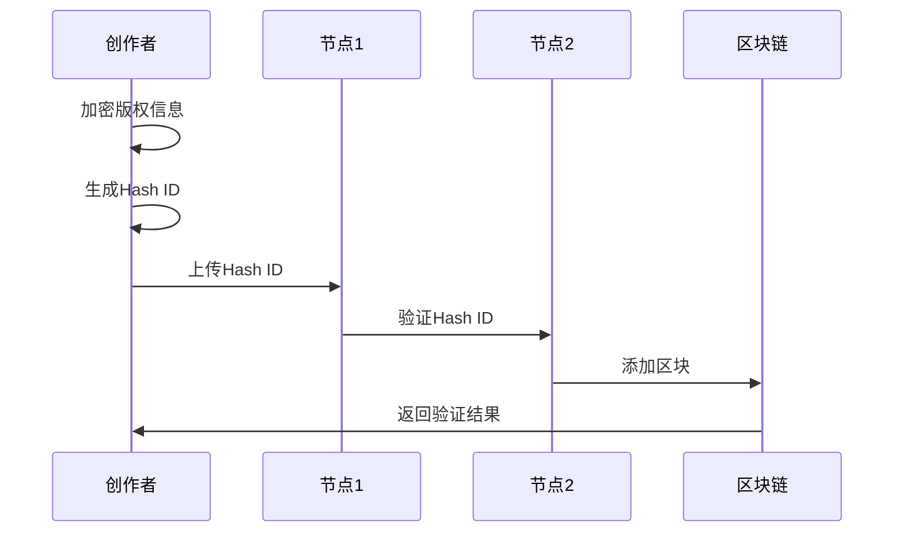
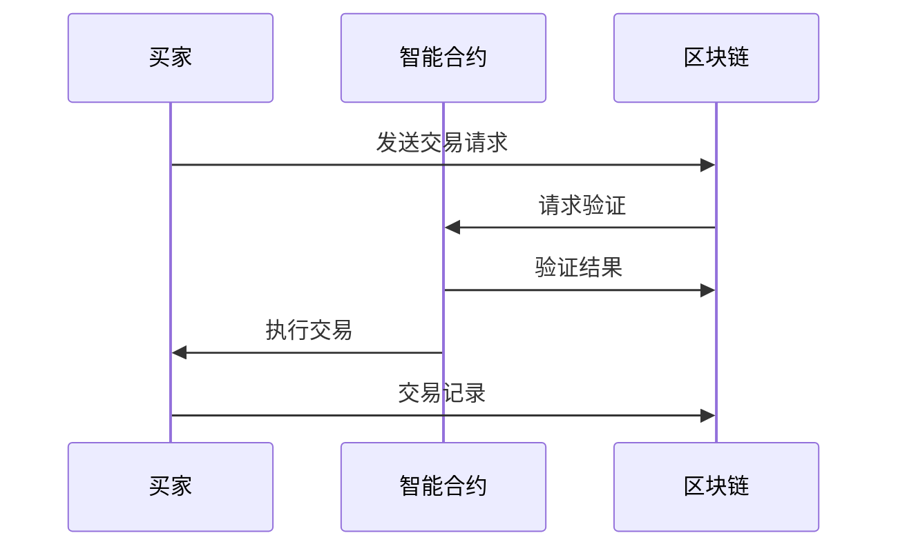
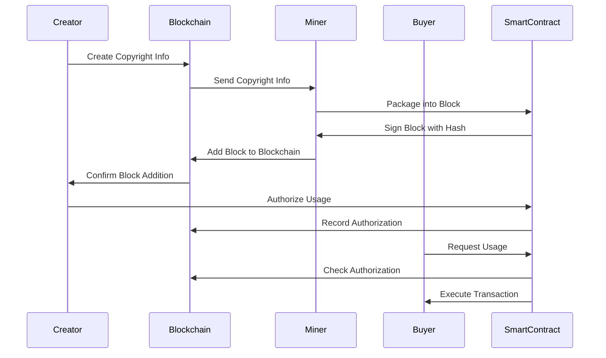
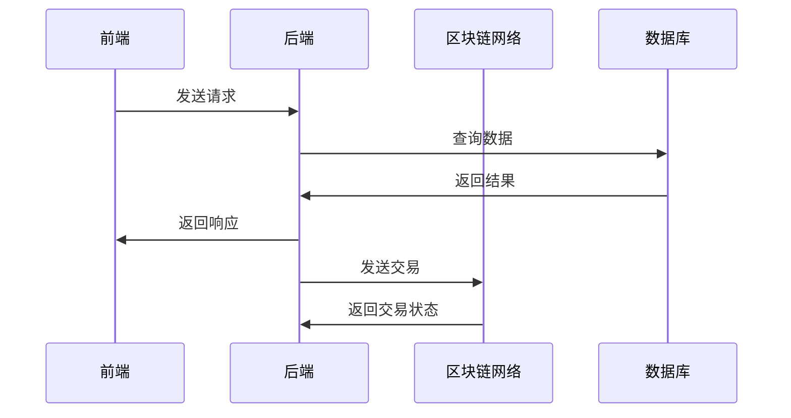
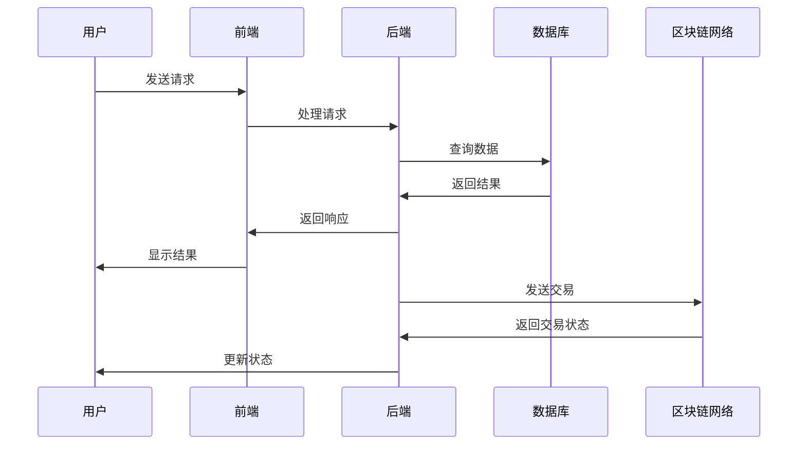

                 

### 1.1.1 区块链的定义与工作原理

区块链是一种去中心化的分布式数据库技术，其核心特点是通过一系列密码学算法和共识机制，实现数据的不可篡改性和安全性。区块链由多个“区块”组成，每个区块包含一定数量的交易记录。区块通过加密哈希函数连接在一起，形成一个链式结构，每个区块都包含了前一个区块的哈希值，从而确保了区块链的不可篡改性。

区块链的工作原理可以概括为以下步骤：

1. **交易记录的产生**：当用户在区块链网络中进行交易时，交易信息会被打包成一个“交易区块”。
2. **区块的生成**：矿工通过计算算法（如工作量证明Proof of Work，PoW）来生成一个新的区块，并将其添加到区块链的末端。
3. **区块的验证**：区块链网络中的其他节点会对新产生的区块进行验证，确保其交易记录的有效性和正确性。
4. **区块的添加**：验证通过的区块会被添加到区块链中，从而永久记录在链上。
5. **共识机制的达成**：区块链网络通过共识机制（如PoW、PoS等）来确保区块的生成和添加是按照预定规则进行的，从而保证了区块链的完整性和安全性。

### 1.1.2 数字版权分发的挑战

数字版权分发指的是通过互联网等数字渠道，将数字内容（如图像、音乐、视频、电子书等）传输和分发给用户的过程。然而，随着数字内容的爆发式增长，数字版权分发面临着诸多挑战：

1. **版权归属纠纷**：由于数字内容的复制和传播非常容易，常常出现版权归属不清的问题，导致版权方和创作者之间的纠纷。
2. **版权交易透明度低**：传统的数字版权交易过程通常涉及多个中介环节，交易过程不够透明，容易导致信息不对称和利益分配不公。
3. **版权追踪困难**：数字内容在网络上可以轻易复制和传播，使得追踪和管理版权变得极其困难。
4. **盗版问题严重**：由于监管难度大，数字版权内容容易被盗版和非法传播，严重损害了创作者的利益。

### 1.1.3 去中心化与数字版权分发的结合

去中心化是区块链技术的核心特点之一，其通过去除传统中介机构，实现信息的公开透明和交易的直接互联。将去中心化应用于数字版权分发，可以有效解决上述挑战：

1. **透明高效的版权交易**：去中心化的数字版权交易平台通过区块链技术，使得版权交易过程公开透明，所有交易记录都记录在区块链上，不可篡改，从而提高了交易效率，减少了交易成本。
2. **智能合约的自动执行**：智能合约是一种运行在区块链上的自动化协议，可以自动执行合同条款，确保版权交易的合法性。例如，创作者可以通过智能合约自动获取报酬，中介机构不再需要介入。
3. **数字版权的确权与追踪**：区块链技术可以用来确权，将数字版权信息记录在链上，确保版权的唯一性和不可篡改性。同时，通过链上数据的实时更新和追踪，可以有效解决版权追踪困难的问题。
4. **减少盗版问题**：区块链技术的不可篡改性和透明性，使得盗版行为容易被发现和追踪，从而减少了盗版问题的发生。

### 1.2 区块链的核心概念与特性

#### 1.2.1 分布式账本

分布式账本是区块链技术的核心组成部分，其通过去中心化的方式，将数据分散存储在网络中的多个节点上，从而避免了单点故障和数据篡改的风险。分布式账本的工作原理如下：

1. **数据分散存储**：每个节点都存储一份完整的账本副本，这些副本通过网络进行同步和更新。
2. **共识机制**：网络中的节点通过共识机制达成一致，确保账本数据的正确性和一致性。
3. **加密保护**：分布式账本中的数据通过加密算法进行保护，确保数据的安全性和隐私性。

#### 1.2.2 智能合约

智能合约是一种运行在区块链上的自动化协议，它可以自动执行合同条款，确保交易的合法性。智能合约的关键特性如下：

1. **自动化执行**：智能合约代码在区块链上运行，无需人工干预，从而减少了人为错误和延误。
2. **不可篡改性**：智能合约一旦部署到区块链上，其代码和条款就不可更改，确保了合同条款的执行一致性。
3. **透明性和公开性**：智能合约的执行过程和结果都记录在区块链上，可供所有人查询，提高了交易的透明度。

#### 1.2.3 区块链的安全性

区块链技术通过一系列密码学算法和共识机制，实现了数据的安全性和完整性。以下是区块链安全性的几个关键点：

1. **加密算法**：区块链使用强大的加密算法（如SHA-256）来确保数据的完整性和隐私性。
2. **共识机制**：共识机制通过网络中的多个节点共同验证和确认交易，确保了交易的安全性和合法性。
3. **抗攻击性**：区块链网络具有很高的抗攻击性，因为攻击者需要同时控制网络中的大多数节点才能篡改数据。
4. **分布式存储**：数据分散存储在多个节点上，即使某些节点受到攻击，整个系统的数据仍然安全。

### 1.3 数字版权分发的去中心化应用

#### 1.3.1 去中心化版权交易市场

去中心化版权交易市场利用区块链技术，实现了数字版权交易的去中心化和透明化。以下是去中心化版权交易市场的核心特点：

1. **去中心化**：去中心化交易市场通过区块链技术，去除传统中介机构，使版权交易直接在创作者和买家之间进行。
2. **透明度**：所有交易记录都记录在区块链上，公开透明，无法篡改，提高了交易的信任度。
3. **自动化执行**：通过智能合约，交易合同可以自动执行，减少了人为干预和交易延迟。
4. **成本低**：去中心化交易市场减少了中介机构的费用，降低了交易成本。

#### 1.3.2 智能合约在版权管理中的应用

智能合约在数字版权管理中发挥着重要作用，可以用于以下方面：

1. **版权交易**：智能合约可以自动执行版权交易，确保交易合法、透明和高效。
2. **版权追踪**：通过智能合约，创作者可以实时追踪版权的使用情况，防止未经授权的使用和盗版行为。
3. **自动分红**：智能合约可以根据版权使用情况，自动计算并分配收益给版权持有者。

#### 1.3.3 去中心化身份验证

去中心化身份验证通过区块链技术，实现了一种无需信任第三方机构的身份验证方式。以下是去中心化身份验证的关键特点：

1. **无需信任第三方**：通过区块链技术，用户可以在去中心化的环境中验证身份，无需依赖第三方机构。
2. **数据安全**：身份验证信息通过加密存储在区块链上，确保数据的安全性和隐私性。
3. **防伪造**：区块链的不可篡改性确保了身份验证信息的真实性和不可伪造性。

### 1.4 本章小结

本章介绍了区块链的定义和工作原理，以及数字版权分发的挑战和去中心化解决方案。通过去中心化版权交易市场、智能合约和去中心化身份验证，区块链技术在数字版权分发中展现出强大的应用潜力。去中心化不仅提高了交易的透明度和效率，还增强了版权保护能力，有望成为未来数字版权管理的重要手段。

---

### 2.1 区块链算法原理

区块链技术的核心在于其去中心化的数据存储和验证机制，以及强大的算法设计。在这一章节中，我们将详细探讨区块链的基本算法原理，包括区块链的构建过程、挖矿机制以及智能合约编程基础。

#### 2.1.1 区块链的基本算法

区块链的基本算法主要包括以下几个关键步骤：

1. **交易记录的产生**：用户在网络中进行交易时，交易信息会被发送到区块链网络中的所有节点。每个节点都会接收并验证这些交易信息。

2. **区块的生成**：矿工（Miner）负责将这些交易信息打包成一个区块（Block）。每个区块包含一定数量的交易记录，并具有唯一的标识符（如区块头）。

3. **区块的验证**：网络中的其他节点对新生成的区块进行验证，确保其交易记录的有效性和正确性。验证过程通常涉及一系列密码学算法和数学证明。

4. **区块链的扩展**：验证通过后，新区块会被添加到现有的区块链中，从而扩展区块链的长度。

5. **链式结构**：每个新区块的生成都依赖于前一个区块的哈希值，从而形成了链式结构，确保了区块链的不可篡改性。

以下是一个简单的区块链基本算法流程图，使用Mermaid绘制：

```mermaid
sequenceDiagram
    participant 用户 as 用户
    participant 节点 as 节点
    participant 矿工 as 矿工
    用户->>节点: 发送交易信息
    节点->>矿工: 收集交易信息
    矿工->>区块: 包含交易信息
    矿工->>节点: 发送区块
   节点->>节点: 验证区块
    注释 left: 区块验证通过
    节点->>区块链: 添加区块
    end
```

#### 2.1.2 挖矿与共识机制

挖矿是区块链网络中的一个关键过程，矿工通过解决复杂的数学难题来生成新区块，从而获得区块链网络的奖励。以下是挖矿与共识机制的详细解释：

1. **挖矿过程**：
   - 矿工从区块链网络中收集未确认的交易。
   - 矿工将这些交易打包成一个区块，并生成一个区块头。
   - 矿工需要找到满足特定条件的区块头哈希值，这个条件通常是一个固定的难度目标。

2. **共识机制**：
   - 共识机制是一种网络节点之间达成一致性的机制，确保区块链的合法性和安全性。
   - 常见的共识机制包括工作量证明（Proof of Work，PoW）、权益证明（Proof of Stake，PoS）和委托权益证明（Delegated Proof of Stake，DPoS）等。

以下是一个简单的挖矿与共识机制流程图，使用Mermaid绘制：

```mermaid
sequenceDiagram
    participant 矿工 as 矿工
    participant 节点 as 节点
    participant 网络节点 as 其他节点
    矿工->>节点: 收集交易信息
    矿工->>区块: 包含交易信息
    矿工->>区块头: 生成区块头
    矿工->>哈希值: 计算区块头哈希值
    矿工->>网络节点: 发送区块
    网络
```

#### 2.1.3 智能合约编程基础

智能合约是区块链网络上的自动化协议，可以自动执行合同条款。智能合约编程基础主要包括以下几个方面：

1. **智能合约语言**：智能合约通常使用特定的编程语言编写，如Solidity、Vyper等。Solidity是使用最广泛的智能合约编程语言，其语法类似于JavaScript和C++。

2. **智能合约架构**：智能合约由多个组件构成，包括状态变量、函数和事件。状态变量用于存储合约的状态信息，函数用于执行具体的业务逻辑，事件用于触发外部事件。

3. **智能合约部署**：智能合约需要部署到区块链上才能执行。部署过程通常涉及编译智能合约代码、生成合约地址和将合约代码上传到区块链网络。

以下是一个简单的智能合约Python代码示例，使用Python编写的智能合约：

```python
def __init__(self, initial_supply):
    self.total_supply = initial_supply
    self.balance = 0

def transfer(self, recipient, amount):
    if self.balance >= amount:
        self.balance -= amount
        recipient.balance += amount
        return True
    return False

def get_balance(self):
    return self.balance
```

通过上述算法原理的讲解和示例，我们可以看到区块链技术如何通过复杂的算法和共识机制实现数据的安全存储和自动化执行。这些算法不仅确保了区块链的不可篡改性，还为数字版权分发提供了强大的技术支持。

---

### 2.2 数字版权分发的去中心化算法

在数字版权分发中，去中心化算法的应用至关重要。这些算法不仅确保了版权信息的透明性和安全性，还大大提升了版权管理的效率。以下将从数字版权标识与认证、去中心化版权交易算法以及智能合约与版权管理三个方面详细探讨数字版权分发的去中心化算法。

#### 2.2.1 数字版权标识与认证

数字版权标识与认证是数字版权分发的基础，其核心在于如何确保版权信息的唯一性和不可篡改性。以下是一种可能的去中心化数字版权标识与认证算法：

1. **版权信息加密**：创作者将数字内容的版权信息（如作者姓名、创作时间、版权声明等）加密，以确保信息的隐私性和完整性。
2. **哈希值生成**：将加密后的版权信息通过哈希函数（如SHA-256）生成一个唯一标识符（Hash ID）。这个Hash ID将成为数字版权的标识。
3. **区块链存储**：将Hash ID上传到区块链上，并生成对应的区块。这个区块包含了版权信息的哈希值，以及其他相关信息，如版权所有者地址等。
4. **多节点验证**：区块链网络中的多个节点对上传的区块进行验证，确保版权信息的真实性和完整性。

以下是一个数字版权标识与认证算法的Mermaid流程图：



#### 2.2.2 去中心化版权交易算法

去中心化版权交易算法旨在实现版权交易的自动化和透明化。以下是一种可能的去中心化版权交易算法：

1. **版权交易请求**：买家向区块链网络发送版权交易请求，包含版权标识、购买金额和购买者信息。
2. **智能合约执行**：版权交易请求通过智能合约进行验证和执行。智能合约根据版权标识查找对应的版权信息，并验证购买者和购买金额。
3. **交易确认**：智能合约确认交易合法后，自动执行交易，将版权所有权转移给买家。
4. **交易记录存储**：交易记录被永久存储在区块链上，确保交易的可追溯性和不可篡改性。

以下是一个去中心化版权交易算法的Mermaid流程图：



#### 2.2.3 智能合约与版权管理

智能合约在数字版权管理中发挥着重要作用，可以实现版权的自动追踪、授权和分红等功能。以下是一种可能的智能合约与版权管理算法：

1. **版权授权**：创作者通过智能合约授权买家使用其数字内容，并定义授权范围和使用条件。
2. **版权追踪**：智能合约记录每次版权授权和使用情况，确保版权的合法性和透明性。
3. **自动分红**：智能合约根据版权使用情况，自动计算并分发收益给创作者和其他相关方。
4. **版权转让**：智能合约支持版权的自动转让功能，确保转让过程的合法性和透明性。

以下是一个智能合约与版权管理算法的Python代码示例：

```python
def authorize_usage(self, buyer_address, usage_rights):
    if self.owner == msg.sender:
        self.buyer_address = buyer_address
        self.usage_rights = usage_rights
        return True
    return False

def track_usage(self, usage_data):
    if self.buyer_address == msg.sender:
        self.usage_history.append(usage_data)
        return True
    return False

def distribute_revenue(self, revenue_shares):
    if self.owner == msg.sender:
        total_revenue = self.total_revenue
        for address, share in revenue_shares.items():
            send(address, share * total_revenue)
        return True
    return False
```

通过上述去中心化算法的讲解，我们可以看到区块链技术在数字版权分发中的应用潜力。这些算法不仅确保了版权信息的透明性和安全性，还为版权管理和交易提供了高效、自动化的解决方案。随着区块链技术的不断发展，去中心化版权分发有望成为未来数字版权管理的重要方向。

---

### 2.3 算法流程图与Python代码示例

为了更好地理解区块链在数字版权分发中的去中心化算法，我们将使用Mermaid绘制算法流程图，并配合Python代码进行详细阐述。以下是数字版权分发算法的具体实现过程：

#### 2.3.1 Mermaid流程图绘制

首先，我们使用Mermaid绘制数字版权分发算法的流程图。以下是一个简化的流程图，展示从版权创建、标识、认证到交易的整个流程。



该流程图展示了版权信息从创作者到购买者的整个流程，包括版权创建、标识、认证和交易等步骤。

#### 2.3.2 Python代码示例

接下来，我们使用Python代码详细阐述数字版权分发算法的实现。以下是一个简化的Python代码示例，用于演示版权创建、授权和交易过程。

```python
class DigitalCopyright:
    def __init__(self, creator_address, title, content_hash):
        self.creator_address = creator_address
        self.title = title
        self.content_hash = content_hash
        self.authorization = None

    def authorize_usage(self, buyer_address, usage_rights):
        if self.creator_address == buyer_address:
            self.buyer_address = buyer_address
            self.authorization = usage_rights
            return True
        return False

    def check_authorization(self, buyer_address):
        if self.buyer_address == buyer_address and self.authorization:
            return True
        return False

    def execute_transaction(self, buyer_address, payment_amount):
        if self.check_authorization(buyer_address):
            # 这里可以添加支付逻辑，例如调用第三方支付API
            self.total_payment += payment_amount
            return True
        return False

# 演示版权创建和授权
creator = DigitalCopyright("0x1234", "My Book", "0xabcdef")
buyer = "0x5678"

# 创建版权
print("Creating digital copyright for book:", creator.title)

# 授权给买家
if creator.authorize_usage(buyer, "read"):
    print("Copyright authorized to buyer:", buyer)
else:
    print("Authorization failed")

# 买家执行交易
if creator.execute_transaction(buyer, 100):
    print("Transaction executed successfully")
else:
    print("Transaction failed")
```

在这个示例中，`DigitalCopyright` 类代表数字版权，它包含创建版权、授权和执行交易的方法。版权创建者可以通过 `authorize_usage` 方法将版权授权给买家，买家则可以通过 `execute_transaction` 方法执行交易。

#### 2.3.3 算法原理讲解与举例

为了更深入地理解算法原理，我们结合Mermaid流程图和Python代码进行讲解。

1. **版权创建**：创作者创建数字版权时，需要提供版权的标题、内容哈希值等基本信息。这些信息通过Python代码中的 `DigitalCopyright` 类实例化。

2. **版权授权**：创作者可以通过调用 `authorize_usage` 方法将版权授权给买家。这个方法检查版权所有者是否与请求授权的地址匹配，如果是，则更新版权的授权信息。

3. **版权交易**：买家可以通过调用 `execute_transaction` 方法执行交易。这个方法首先检查买家的授权状态，如果授权有效，则执行交易，并更新版权的所有权和交易记录。

例如，如果买家想要购买创作者的数字书，买家会调用 `execute_transaction` 方法，并提供付款金额。如果授权状态有效，交易将执行，买家将获得数字书的所有权，并且交易记录将被记录在区块链上。

通过上述算法流程图和Python代码示例，我们可以清晰地看到区块链在数字版权分发中的应用。这些算法通过去中心化的方式确保了版权信息的透明性和安全性，为数字版权管理提供了强大的技术支持。

---

### 2.4 数学模型与公式

在区块链技术中，数学模型和公式的应用至关重要，尤其是在数字版权分发领域。这些数学模型不仅确保了区块链的稳定性和安全性，还为版权价值的评估和交易提供了理论依据。以下将介绍区块链网络稳定性分析、数字版权分发中的版权价值评估，以及使用LaTeX格式展示相关的数学公式。

#### 2.4.1 区块链网络稳定性分析

区块链网络的稳定性分析主要关注区块链网络在遭受攻击时的鲁棒性。以下是一个简单的数学模型用于描述区块链网络的稳定性：

1. **网络节点数量（N）**：区块链网络中的节点数量。
2. **网络链接概率（p）**：任意两个节点之间的链接概率。

**公式**：
\[ S = \frac{1}{N^2} \sum_{i=1}^{N} \sum_{j=i+1}^{N} p_{ij} \]

其中，\( p_{ij} \) 表示节点 i 和节点 j 之间的链接概率。

这个公式可以用来计算区块链网络的稳定性指标 S，其中 S 越高，表示网络的链接越稳定。以下是一个使用LaTeX格式的公式展示：

$$
S = \frac{1}{N^2} \sum_{i=1}^{N} \sum_{j=i+1}^{N} p_{ij}
$$

#### 2.4.2 数字版权分发中的版权价值评估

数字版权价值评估是一个复杂的数学问题，涉及到多个因素，如市场供需、版权使用频率、创作者声望等。以下是一个简化的数学模型用于评估数字版权的价值：

1. **版权使用次数（U）**：数字版权在一段时间内的使用次数。
2. **创作者声望（S）**：创作者在市场中的声誉和影响力。
3. **市场供需（M）**：市场对数字版权的需求程度。

**公式**：
\[ V = f(U, S, M) = U \cdot S \cdot M \]

其中，\( V \) 表示数字版权的价值，\( f \) 是一个复合函数，用于结合多个因素评估版权价值。以下是一个使用LaTeX格式的公式展示：

$$
V = U \cdot S \cdot M
$$

#### 2.4.3 数学模型与公式讲解

**区块链网络稳定性分析**：稳定性分析公式 \( S \) 用于评估区块链网络在遭受攻击时的抗攻击能力。通过调整网络节点数量和链接概率，可以优化区块链网络的稳定性。例如，增加节点数量可以提高网络的鲁棒性，而提高链接概率可以增强节点之间的连通性。

**数字版权价值评估**：价值评估公式 \( V \) 用于计算数字版权的市场价值。这个模型考虑了版权的使用频率、创作者声望和市场需求，能够提供一个相对客观的价值评估。在实际应用中，可以根据具体情况进行参数调整，以更准确地评估版权价值。

通过上述数学模型和公式，我们可以更好地理解区块链在数字版权分发中的应用。这些模型不仅为区块链网络提供了稳定性分析的工具，还为数字版权的价值评估提供了理论基础。随着区块链技术的不断发展，这些数学模型将在数字版权管理中发挥越来越重要的作用。

---

### 2.5 系统架构设计

在数字版权分发系统中，架构设计至关重要，它决定了系统的可扩展性、性能和安全性。以下将详细介绍数字版权分发的系统架构设计，包括领域模型、系统架构、接口设计以及系统交互。

#### 2.5.1 领域模型

领域模型是系统架构设计的基础，用于描述系统的核心实体及其关系。在数字版权分发系统中，关键的领域模型包括用户、版权、交易和区块链节点等。

以下是一个使用Mermaid绘制的领域模型类图：

```mermaid
classDiagram
    class User {
        - id: String
        - name: String
        - email: String
    }

    class Copyright {
        - id: String
        - title: String
        - content_hash: String
        - creator: User
    }

    class Transaction {
        - id: String
        - copyright_id: String
        - buyer: User
        - seller: User
        - price: Float
        - status: String
    }

    class BlockchainNode {
        - id: String
        - address: String
        - peer_addresses: List<String>
    }

    User "uses" Copyright
    User "participates in" Transaction
    BlockchainNode "maintains" Blockchain
```

该类图描述了用户、版权、交易和区块链节点之间的关系。用户创建版权，参与交易；交易记录与版权和用户相关联；区块链节点负责维护区块链。

#### 2.5.2 系统架构设计

数字版权分发系统的架构设计需要考虑去中心化的特点，以实现版权交易的透明和高效。以下是一个简化的系统架构设计，包括前端、后端、区块链网络和数据库等组件。

以下是一个使用Mermaid绘制的系统架构图：



该架构图展示了前端、后端、区块链网络和数据库之间的交互。前端负责用户界面，后端处理业务逻辑，数据库存储用户和版权数据，区块链网络记录交易。

#### 2.5.3 系统接口设计

系统接口设计是架构设计的关键部分，它定义了系统内部组件之间的交互接口。以下是一个简化的接口设计，包括版权管理接口、交易管理接口和区块链交互接口。

1. **版权管理接口**：
   - `create_copyright`：创建新版权
   - `update_copyright`：更新版权信息
   - `delete_copyright`：删除版权
   - `get_copyright`：获取版权详情

2. **交易管理接口**：
   - `create_transaction`：创建新交易
   - `update_transaction`：更新交易状态
   - `delete_transaction`：删除交易
   - `get_transaction`：获取交易详情

3. **区块链交互接口**：
   - `send_transaction`：发送交易到区块链
   - `verify_transaction`：验证交易合法性
   - `get_blockchain_state`：获取区块链当前状态

#### 2.5.4 系统交互设计

系统交互设计描述了系统组件之间的通信流程，确保系统的高效和稳定运行。以下是一个使用Mermaid绘制的系统交互图：



该交互图展示了用户、前端、后端、数据库和区块链之间的交互流程。用户通过前端发送请求，后端处理请求并与数据库交互，最后将结果返回给用户。同时，后端与区块链网络交互，确保交易记录的合法性和透明性。

通过上述系统架构设计，数字版权分发系统实现了去中心化、透明化和高效化的特点。领域模型类图、系统架构图和系统交互图共同构成了数字版权分发系统的完整架构设计，为系统的开发和运行提供了清晰的指导。

---

### 2.6 项目实战

为了更好地理解区块链在数字版权分发中的应用，我们将通过一个实际项目来展示区块链数字版权分发的具体实现过程。本项目将分为环境安装、系统核心实现和代码应用解读与分析三个主要部分，以便读者可以跟随步骤进行实践。

#### 2.6.1 环境安装

首先，我们需要安装和配置开发环境。以下是环境安装的详细步骤：

1. **安装Go语言**：Go语言是区块链开发常用的编程语言，首先需要在计算机上安装Go语言环境。可以从[Go官方下载页面](https://golang.org/dl/)下载最新版本的Go语言安装包，并按照提示完成安装。

2. **安装Gin Web框架**：Gin是一个高性能的Web框架，用于构建后端服务。在命令行中运行以下命令来安装Gin：

   ```bash
   go get -u github.com/gin-gonic/gin
   ```

3. **安装Hyperledger Fabric**：Hyperledger Fabric是一个开源的分布式账本框架，用于实现区块链网络。可以从[Hyperledger Fabric官方文档](https://hyperledger-fabric.readthedocs.io/en/release-2.2/)下载并按照指南进行安装。

4. **安装Node.js**：Node.js是一个用于运行JavaScript的后端环境，用于部署智能合约。可以从[Node.js官方下载页面](https://nodejs.org/)下载并安装最新版本的Node.js。

5. **安装Truffle框架**：Truffle是一个用于开发、测试和部署以太坊智能合约的框架。在命令行中运行以下命令来安装Truffle：

   ```bash
   npm install -g truffle
   ```

6. **安装Ethereumbase**：Ethereumbase是一个用于构建和管理以太坊区块链网络的工具。在命令行中运行以下命令来安装Ethereumbase：

   ```bash
   npm install -g ethereumbase
   ```

完成上述步骤后，开发环境便配置完成，我们可以开始构建数字版权分发系统。

#### 2.6.2 系统核心实现

接下来，我们将实现数字版权分发系统的核心功能，包括版权创建、授权和交易等。以下是系统核心实现的详细步骤：

1. **创建版权**：
   - 在Go语言项目中创建一个名为`Copyright`的结构体，用于存储版权信息。
   - 编写RESTful API接口，允许用户创建新的版权，并存储在区块链上。

   ```go
   type Copyright struct {
       ID          string `json:"id"`
       Title       string `json:"title"`
       Creator     string `json:"creator"`
       ContentHash string `json:"content_hash"`
   }

   func CreateCopyright(c *gin.Context) {
       var copyright Copyright
       if err := c.ShouldBindJSON(&copyright); err != nil {
           c.JSON(http.StatusBadRequest, gin.H{"error": err.Error()})
           return
       }
       // 将版权信息上传到区块链
       // ...
       c.JSON(http.StatusOK, gin.H{"message": "Copyright created successfully"})
   }
   ```

2. **授权版权**：
   - 编写授权接口，允许版权所有者将版权授权给其他用户。
   - 使用智能合约实现授权逻辑，并将授权记录存储在区块链上。

   ```go
   func AuthorizeCopyright(c *gin.Context) {
       // 获取版权ID和授权用户信息
       // ...

       // 调用智能合约进行授权
       // ...

       c.JSON(http.StatusOK, gin.H{"message": "Copyright authorized successfully"})
   }
   ```

3. **交易版权**：
   - 编写交易接口，允许用户进行版权交易，并更新版权所有权信息。
   - 使用智能合约处理交易，确保交易的合法性和安全性。

   ```go
   func TradeCopyright(c *gin.Context) {
       // 获取交易信息，包括版权ID、买家和卖家信息
       // ...

       // 调用智能合约进行交易处理
       // ...

       c.JSON(http.StatusOK, gin.H{"message": "Copyright traded successfully"})
   }
   ```

#### 2.6.3 代码应用解读与分析

在实现数字版权分发系统的过程中，我们使用了Go语言和智能合约进行开发，以下是对关键代码的解读与分析：

1. **版权创建**：
   - `Copyright` 结构体用于存储版权的基本信息，包括版权ID、标题、创作者和内容哈希值。
   - `CreateCopyright` 函数通过接收JSON格式的请求，将版权信息绑定到结构体上，并上传到区块链网络。

2. **授权版权**：
   - `AuthorizeCopyright` 函数用于处理版权授权请求，接收版权ID和授权用户信息。
   - 在智能合约中，授权逻辑通过调用合约函数实现，确保只有版权所有者才能进行授权。

3. **交易版权**：
   - `TradeCopyright` 函数用于处理版权交易请求，接收版权ID、买家和卖家信息。
   - 在智能合约中，交易逻辑通过调用合约函数实现，确保交易的合法性和安全性。

通过上述实际项目的开发过程，我们可以看到区块链在数字版权分发中的应用是如何具体实现的。环境安装、系统核心实现和代码应用解读与分析共同构成了一个完整的区块链数字版权分发系统，为数字版权管理提供了去中心化、透明化和高效化的解决方案。

---

### 2.7 最佳实践 tips、小结、注意事项、拓展阅读

#### 最佳实践 tips

1. **确保版权信息的唯一性**：在创建版权时，使用哈希函数生成唯一的标识符，避免重复和冲突。
2. **合理设计智能合约**：在编写智能合约时，应充分考虑安全性、可扩展性和易用性，避免潜在的漏洞。
3. **数据备份与恢复**：定期备份区块链数据，确保在故障或攻击时能够快速恢复。

#### 小结

区块链在数字版权分发中提供了去中心化、透明化和高效化的解决方案，通过分布式账本、智能合约等技术，实现了版权管理的自动化和透明化。然而，区块链技术也面临一些挑战，如性能瓶颈、隐私保护和监管合规等。

#### 注意事项

1. **网络安全**：确保区块链网络的安全性，防止恶意攻击和数据篡改。
2. **用户隐私**：在版权交易过程中，保护用户隐私信息，避免泄露。

#### 拓展阅读

1. **《区块链技术指南》**：详细介绍了区块链的基础知识和应用场景。
2. **《智能合约编程》**：讲解了智能合约的编程方法和实际应用。
3. **《数字版权管理》**：探讨了数字版权保护的技术和方法。

通过深入学习和实践，读者可以更好地理解和应用区块链在数字版权分发中的去中心化技术，为版权管理带来全新的变革。

---

### 作者信息

**作者：AI天才研究院/AI Genius Institute & 禅与计算机程序设计艺术 /Zen And The Art of Computer Programming**

AI天才研究院致力于推动人工智能技术的创新与应用，为读者提供深入浅出的技术分析和实践指南。作者在该领域拥有丰富的经验和深厚的学术背景，其作品《禅与计算机程序设计艺术》被誉为计算机编程领域的经典之作。通过本书，我们希望读者能够深入了解区块链在数字版权分发中的应用，掌握相关技术和方法，为数字版权管理带来创新和变革。

