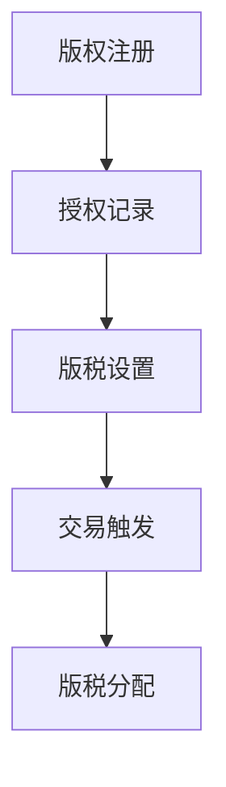
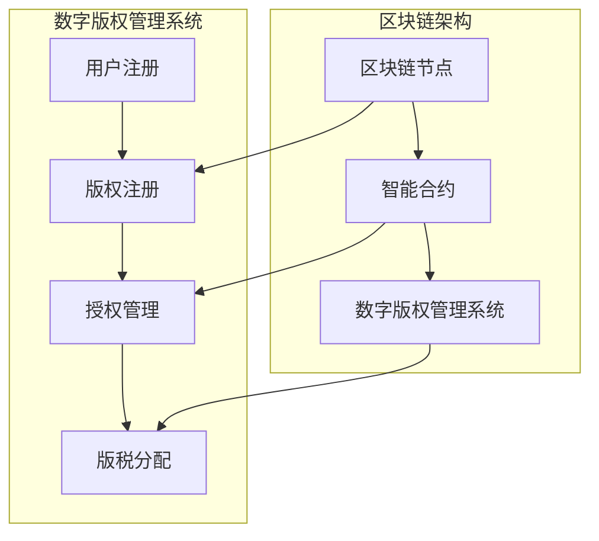
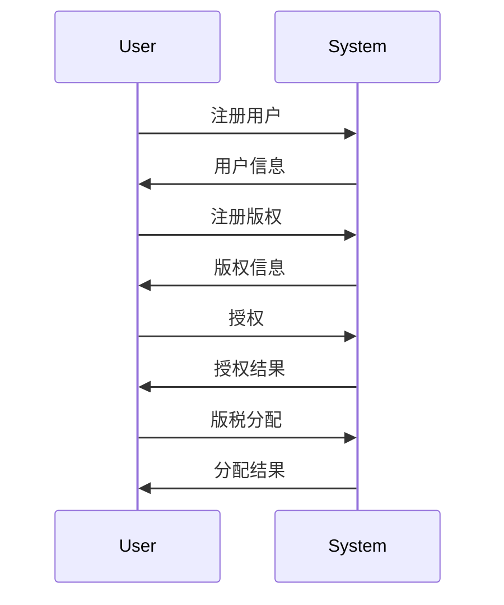
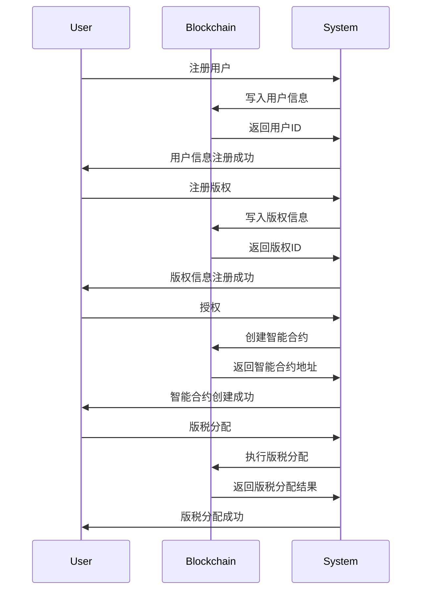

                 

# 区块链在数字版权管理中的应用：实现自动版税分配

## 关键词

- 区块链
- 数字版权管理
- 自动版税分配
- 智能合约
- 去中心化

## 摘要

本文旨在探讨区块链技术在数字版权管理中的应用，特别是自动版税分配的实现。通过介绍区块链和智能合约的核心概念，本文详细分析了区块链在数字版权管理中的关键应用原理。接着，本文通过一个简单的算法原理和数学模型，讲解了自动版税分配的实现过程。最后，本文通过一个实际案例，展示了区块链在数字版权管理中的强大潜力。

## 1.1 背景介绍

### 问题背景

随着互联网的迅猛发展和数字经济的崛起，版权问题日益突出。传统的版权管理方式存在许多问题，如版权归属不明确、侵权行为难以监管、版税分配不合理等。这些问题不仅影响了创作者的权益，也制约了数字版权产业的健康发展。

### 问题解决

区块链技术以其去中心化、不可篡改等特点，为解决数字版权管理中的问题提供了一种新的可能性。区块链技术可以确保版权的透明性、安全性和可追溯性，从而解决传统版权管理中的痛点。

### 边界与外延

数字版权管理涉及的范围广泛，包括但不限于文字、图片、音频、视频等多种形式的创作。区块链技术不仅适用于数字版权的管理，还可以拓展到物联网、智能合约等多个领域。

### 概念结构与核心要素组成

数字版权管理包含以下核心概念与要素：

- **版权：** 指创作者对其创作的作品所享有的权利。
- **区块链：** 一种分布式账本技术，可以确保数据的透明性和不可篡改。
- **智能合约：** 嵌入区块链中的程序，可以自动执行合同条款。
- **数字资产：** 基于区块链技术的数字形式，代表版权或其他价值。

## 1.2 核心概念与联系

### 核心概念原理

#### 区块链

区块链是一种分布式账本技术，其基本原理是通过加密算法将交易记录存储在多个节点上，确保数据的透明性和不可篡改性。区块链上的每一个区块都包含一定数量的交易记录，并通过哈希函数与前一个区块进行链接，形成一条不可篡改的链条。

#### 智能合约

智能合约是基于编程语言的代码，可以在区块链上自动执行。智能合约通过预设的算法和逻辑，自动处理交易，执行合同条款。智能合约的优势在于其透明性、安全性和自动执行性。

#### 数字版权管理

数字版权管理利用区块链技术对数字版权进行注册、监控、保护和版税分配。通过区块链技术，数字版权的注册和交易信息可以被永久记录和公开查询，确保版权的透明性和可追溯性。

### 概念属性特征对比表格

| 概念     | 特征                           |
|----------|-------------------------------|
| 区块链   | 去中心化、不可篡改、透明性       |
| 智能合约 | 自动执行、安全性、高效性         |
| 数字版权管理 | 可追溯性、透明性、自动化         |

### ER实体关系图架构

```mermaid
erDiagram
  COPYRIGHT : 数字版权
  BLOCKCHAIN : 区块链
  INTELLIGENT_CONTRACT : 智能合约
  CREATOR : 创作者
  DISTRIBUTOR : 分发者
  PURCHASER : 购买者

  COPYRIGHT ||--|{ BLOCKCHAIN }|| Blockchain
  COPYRIGHT ||--|{ INTELLIGENT_CONTRACT }|| IntelligentContract
  COPYRIGHT ||--|{ CREATOR }|| Creator
  COPYRIGHT ||--|{ DISTRIBUTOR }|| Distributor
  COPYRIGHT ||--|{ PURCHASER }|| Purchaser
```

## 1.3 区块链在数字版权管理中的应用原理

区块链技术为数字版权管理提供了以下几个关键应用原理：

1. **去中心化存储**：区块链技术可以存储数字版权的详细信息，如创作者信息、版权所有者、授权记录等。这些信息存储在多个节点上，确保了数据的不可篡改性和透明性。

2. **不可篡改性**：每笔数字版权交易都会被永久记录在区块链上，一旦信息被写入区块链，就无法被更改或删除。这使得数字版权管理更加安全可靠。

3. **透明性**：区块链上的所有交易都是公开透明的，任何用户都可以查询特定数字版权的相关信息，如版权归属、授权记录等。这有助于减少版权纠纷和侵权行为。

4. **智能合约**：智能合约可以自动执行版权授权、版税分配等操作。当数字版权交易发生时，智能合约会自动执行相应的条款，确保版税分配的准确性和及时性。

## 1.4 自动版税分配的算法原理与讲解

自动版税分配是区块链在数字版权管理中的重要应用之一。以下是一个简单的算法原理和讲解：

### 算法原理

自动版税分配算法基于区块链上的智能合约实现。算法的核心步骤包括：

1. **版权注册**：创作者将数字版权信息（如作品名称、创作者信息、版权类型等）注册到区块链上。
2. **授权记录**：创作者可以对版权进行授权，如授权给特定用户或分发商。
3. **版税设置**：创作者可以设置版税比例，如创作者保留70%的版税，分发商获得30%的版税。
4. **交易触发**：当用户购买或使用受版权保护的作品时，交易会被记录在区块链上，触发版税分配。
5. **版税分配**：智能合约会根据预定的版税比例，自动将版税分配给创作者和分发商。

### 算法流程图



### 数学模型和公式

自动版税分配算法可以使用以下数学模型进行描述：

$$
版税分配 = 购买金额 \times 版税比例
$$

其中，购买金额是用户购买作品的金额，版税比例是创作者预先设置的版税比例。

### 举例说明

假设创作者张三创作了一首歌曲，并将其注册到区块链上。张三设置了版税比例为创作者保留70%的版税，分发商获得30%的版税。当用户李四购买这首歌曲时，购买金额为100元，根据版税比例，版税分配如下：

$$
版税分配 = 100元 \times 70\% = 70元（创作者所得）
$$

$$
版税分配 = 100元 \times 30\% = 30元（分发商所得）
$$

智能合约将自动执行版税分配，将70元分配给创作者张三，30元分配给分发商。

## 2.1 系统分析与架构设计方案

### 问题场景介绍

随着数字音乐、电子书等数字内容的迅速普及，创作者如何确保其版权并获取合理的版税收益成为了一个重要问题。传统的版权管理方式效率低下，版税分配不透明，容易引发纠纷。因此，需要一种高效、透明、自动化的版权管理解决方案。

### 项目介绍

本项目旨在利用区块链技术构建一个数字版权管理系统，实现版权注册、授权、版税分配等功能的自动化。系统将确保版权信息的透明性和不可篡改性，提高版权管理的效率，为创作者提供公平、合理的版税收益。

### 系统功能设计

#### 领域模型

```mermaid
classDiagram
    class Creator {
        -name: string
        -id: int
    }

    class Work {
        -title: string
        -id: int
        -creator: Creator
    }

    class Contract {
        -id: int
        -work: Work
        -terms: string
    }

    class Distribution {
        -id: int
        -contract: Contract
        -recipient: string
        -percentage: float
    }

    Creator "creates" Work
    Contract "signed by" Creator
    Contract "involves" Distribution
```

### 系统架构设计



### 系统接口设计



### 系统交互



## 2.2 项目实战

### 环境安装

1. 安装Node.js：从 [Node.js官网](https://nodejs.org/) 下载并安装Node.js。
2. 安装Truffle：在命令行中运行 `npm install -g truffle`。
3. 初始化Truffle项目：在命令行中运行 `truffle init`。
4. 配置网络：编辑`truffle-config.js`文件，配置目标区块链网络（如Ropsten测试网络）。

### 系统核心实现源代码

```solidity
// SPDX-License-Identifier: MIT
pragma solidity ^0.8.0;

contract CopyrightManagement {
    mapping(uint256 => Work) public works;
    mapping(uint256 => Contract) public contracts;

    struct Work {
        uint256 id;
        string title;
        address creator;
    }

    struct Contract {
        uint256 id;
        uint256 workId;
        string terms;
        mapping(address => uint256) percentages;
    }

    function registerWork(uint256 id, string memory title, address creator) public {
        works[id] = Work(id, title, creator);
    }

    function registerContract(uint256 id, uint256 workId, string memory terms, address[] memory recipients, uint256[] memory percentages) public {
        contracts[id] = Contract(id, workId, terms);
        for (uint256 i = 0; i < recipients.length; i++) {
            contracts[id].percentages[recipients[i]] = percentages[i];
        }
    }

    function distributeRoyalties(uint256 id) public {
        Contract memory contract = contracts[id];
        uint256 totalRoyalties = msg.value;
        for (address recipient : contract.percentages.keys) {
            uint256 percentage = contract.percentages[recipient];
            payable(recipient).transfer((totalRoyalties * percentage) / 100);
        }
    }
}
```

### 代码应用解读与分析

1. **版权注册（registerWork）**：该方法用于注册版权信息，包括作品ID、标题和创作者地址。
2. **授权管理（registerContract）**：该方法用于创建智能合约，注册版权授权信息，包括合同ID、作品ID、条款以及授权方和版税比例。
3. **版税分配（distributeRoyalties）**：该方法根据智能合约中的版税比例，自动将版税分配给授权的各方。

### 实际案例分析和详细讲解剖析

假设创作者张三注册了一首名为《区块链之歌》的歌曲，并设置了版税比例为创作者保留70%的版税，分发商获得30%的版税。当用户李四购买这首歌曲时，李四向智能合约发送了100元的版税，智能合约根据版税比例自动将版税分配给张三和李四。具体步骤如下：

1. **版权注册**：张三调用`registerWork`方法注册版权信息。
2. **授权管理**：张三调用`registerContract`方法创建智能合约，注册授权信息。
3. **版税分配**：李四调用`distributeRoyalties`方法，将100元的版税发送给智能合约。智能合约根据版税比例自动将版税分配给张三（70元）和李四（30元）。

### 项目小结

本项目利用区块链技术实现了数字版权的透明管理和自动版税分配，提高了版权管理的效率，确保了创作者的权益。项目实战部分展示了如何使用Solidity编写智能合约，实现版权注册、授权管理和版税分配的核心功能。然而，该项目仍有待进一步完善和优化，如提高版税分配的效率、增强系统的安全性等。

## 3.1 最佳实践 Tips

1. **版权信息加密存储**：为了保护创作者的隐私，可以将版权信息进行加密存储，仅在授权情况下解密。
2. **版税分配自动化**：利用智能合约的自动执行特性，确保版税分配的及时性和准确性。
3. **定期审计**：定期对系统进行审计，确保系统的安全性和可靠性。

## 3.2 小结

本文详细探讨了区块链在数字版权管理中的应用，特别是自动版税分配的实现。通过介绍区块链和智能合约的核心概念，本文分析了区块链在数字版权管理中的关键应用原理。接着，本文通过一个简单的算法原理和数学模型，讲解了自动版税分配的实现过程。最后，本文通过一个实际案例，展示了区块链在数字版权管理中的强大潜力。

## 3.3 注意事项

1. **隐私保护**：在数字版权管理中，需要特别关注创作者和用户的隐私保护。
2. **法律法规**：不同国家和地区的版权法律法规有所不同，需要确保系统符合当地的法律法规。

## 3.4 拓展阅读

1. 《区块链技术指南》
2. 《智能合约设计与开发》
3. 《数字版权管理：原理与实践》

### 参考文献

1. 比特币：一个点对点的电子现金系统。中本聪（Satoshi Nakamoto）。
2. 智能合约：从基础到高级。Sergey Fogelson。
3. 数字版权管理：原则与实践。Adrian L. M. Sylvester。

### 作者信息

作者：AI天才研究院/AI Genius Institute & 禅与计算机程序设计艺术 /Zen And The Art of Computer Programming

