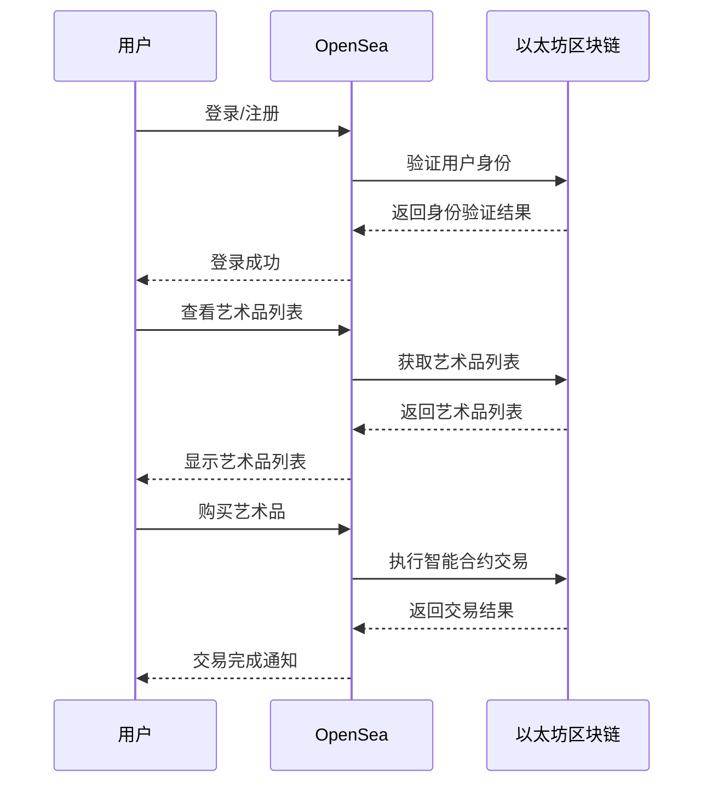
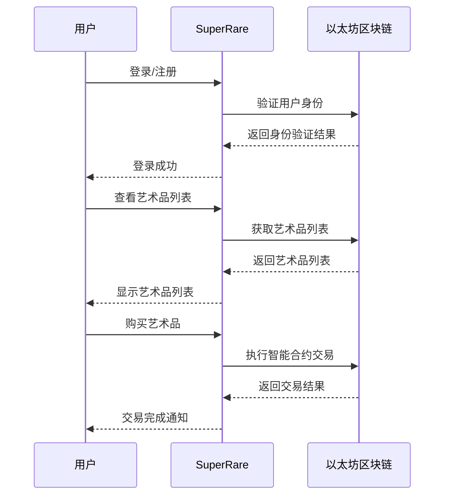

                 

# 《区块链在数字艺术品交易中的应用前景》

关键词：区块链、数字艺术品、交易、应用前景、智能合约

摘要：随着数字技术的发展，数字艺术品市场逐渐兴起，如何确保数字艺术品的交易安全、透明和不可篡改成为了一个亟待解决的问题。区块链技术以其独特的特点，为数字艺术品交易提供了一种新的解决方案。本文将探讨区块链在数字艺术品交易中的应用前景，包括区块链在数字艺术品交易中的作用、区块链技术在数字艺术品交易中的应用场景、区块链技术在数字艺术品交易中的挑战及未来发展趋势。

## 引言

区块链技术作为一种分布式账本技术，具有去中心化、透明、不可篡改等特点，近年来在金融、物流、医疗等多个领域得到了广泛应用。随着数字艺术品市场的快速发展，区块链技术在数字艺术品交易中的应用也逐渐受到了关注。数字艺术品，作为一种新兴的艺术形式，以其独特的创作方式和传播渠道，逐渐成为艺术市场的重要组成部分。然而，传统的数字艺术品交易过程中存在着诸多问题，如版权纠纷、交易流程复杂、交易不透明等。区块链技术可以为解决这些问题提供新的思路和方法。

## 区块链在数字艺术品交易中的作用

区块链技术在数字艺术品交易中的作用主要体现在以下几个方面：

1. **确保交易的安全性**：区块链技术通过密码学算法确保交易数据的安全性和隐私性，使得数字艺术品的交易过程更加安全。

2. **提高交易的透明度**：区块链上的交易数据是公开透明的，任何参与方都可以查看交易记录，从而提高了交易的透明度。

3. **确保交易的不可篡改性**：区块链上的交易数据一旦被确认，就无法被篡改，从而确保了数字艺术品交易的公正性。

4. **简化交易流程**：区块链技术可以简化数字艺术品交易的流程，使得交易过程更加高效。

5. **解决版权纠纷**：区块链技术可以为数字艺术品提供唯一的数字身份，从而解决版权纠纷问题。

## 区块链技术在数字艺术品交易中的应用场景

1. **数字艺术品购买与出售**：区块链技术可以确保数字艺术品的购买与出售过程的安全、透明和高效。

2. **数字艺术品版权保护**：区块链技术可以为数字艺术品提供唯一的数字身份，从而确保数字艺术品的版权得到保护。

3. **数字艺术品拍卖**：区块链技术可以确保数字艺术品拍卖过程的安全、透明和公正。

4. **数字艺术品租赁**：区块链技术可以简化数字艺术品租赁的过程，提高租赁效率。

5. **数字艺术品收藏**：区块链技术可以为数字艺术品收藏提供安全、透明和高效的解决方案。

## 区块链技术在数字艺术品交易中的挑战

尽管区块链技术在数字艺术品交易中具有巨大的潜力，但其应用也面临一些挑战：

1. **技术门槛**：区块链技术的应用需要一定的技术基础，对于普通用户来说，使用区块链技术进行数字艺术品交易可能存在一定的难度。

2. **法律与政策**：区块链技术的应用需要遵循相关法律法规，但在一些国家和地区，对于区块链技术的监管政策还不够明确。

3. **标准化问题**：数字艺术品的标准化问题尚未得到有效解决，这可能会影响区块链技术在数字艺术品交易中的应用。

4. **网络拥堵**：区块链网络处理能力有限，可能导致交易处理速度变慢，影响用户体验。

## 未来发展趋势

尽管面临挑战，区块链技术在数字艺术品交易中的应用前景仍然广阔。随着技术的不断进步和政策的不断完善，区块链技术在数字艺术品交易中的应用将越来越广泛。未来，区块链技术有望在以下几个方面得到发展：

1. **技术的完善与普及**：随着区块链技术的不断发展和完善，其应用场景将更加丰富，普及程度也将不断提高。

2. **法律与政策的完善**：随着区块链技术的广泛应用，相关的法律和政策也将逐步完善，为区块链技术的发展提供更好的环境。

3. **标准化与规范化**：数字艺术品的标准化与规范化将有助于区块链技术在数字艺术品交易中的应用。

4. **跨行业合作**：区块链技术与其他行业的结合将有望创造新的商业模式，推动数字艺术品市场的创新发展。

## 结论

区块链技术在数字艺术品交易中的应用前景广阔，其独特的优势为解决传统数字艺术品交易中的问题提供了新的思路和方法。然而，区块链技术在数字艺术品交易中的应用也面临一些挑战，需要不断探索和完善。随着技术的进步和政策的完善，区块链技术在数字艺术品交易中的应用将得到进一步发展。

作者：AI天才研究院/AI Genius Institute & 禅与计算机程序设计艺术 /Zen And The Art of Computer Programming

----------------------------------------------------------------

接下来，我们将逐一深入探讨每个章节的具体内容，包括背景介绍、核心概念、应用场景、挑战和未来发展趋势等。每章都将详细阐述相关主题，并附有相应的图表、算法解析和实例分析，以确保文章内容的完整性和深度。

## 第一章：区块链与数字艺术品概述

### 1.1 区块链技术的背景与基本概念

区块链技术是一种分布式数据库技术，通过去中心化的方式，实现了数据的存储和传输。其基本概念包括：

- **分布式账本**：区块链是一个分布式数据库，其中每个参与者都有一份完整的账本。
- **共识算法**：区块链网络中的参与者通过共识算法来达成一致，确保数据的真实性和完整性。
- **加密技术**：区块链使用密码学技术来保护数据的隐私和安全。

### 1.2 区块链技术的发展历史

区块链技术起源于比特币的底层技术——比特币区块链。2008年，一位名为中本聪（Satoshi Nakamoto）的匿名人士发布了比特币白皮书，描述了一种不需要信任的数字货币系统。2009年，比特币网络正式上线，标志着区块链技术的诞生。

随后，区块链技术逐渐从数字货币领域扩展到其他领域，如供应链管理、身份验证、金融服务等。近年来，随着数字艺术品市场的兴起，区块链技术也开始在数字艺术品交易领域得到应用。

### 1.3 区块链与数字艺术品的关系

数字艺术品是一种以数字形式存在的艺术品，如数字绘画、数字音乐、数字摄影等。区块链技术为数字艺术品交易提供了以下优势：

- **去中心化**：传统艺术市场往往依赖于中心化的机构进行交易，而区块链技术可以实现去中心化的交易，降低交易成本。
- **透明性**：区块链上的交易记录是公开透明的，任何参与者都可以查看，这有助于提高交易的透明度和可信度。
- **不可篡改性**：区块链上的数据一旦被确认，就无法被篡改，这有助于确保数字艺术品的真实性和完整性。

### 1.4 数字艺术品的特点与市场现状

数字艺术品具有以下几个特点：

- **易复制性**：数字艺术品可以被轻松复制，这是其与传统艺术品最大的区别。
- **可编程性**：数字艺术品可以嵌入智能合约，实现自动化交易和版权保护。
- **全球化**：数字艺术品不受地域限制，可以在全球范围内进行交易。

目前，数字艺术品市场呈现出快速增长的趋势。随着技术的进步和市场的认可，越来越多的数字艺术品进入市场，成为艺术家和收藏家关注的焦点。

### 1.5 区块链在数字艺术品交易中的应用前景

区块链技术在数字艺术品交易中的应用前景非常广阔。通过去中心化、透明性和不可篡改的特性，区块链技术有望解决传统数字艺术品交易中的问题，如版权纠纷、交易透明度低、交易流程复杂等。未来，随着技术的不断成熟和应用的深入，区块链将在数字艺术品交易领域发挥更加重要的作用。

## 第二章：区块链技术在数字艺术品交易中的应用

### 2.1 区块链在数字艺术品交易中的基本原理

区块链技术在数字艺术品交易中的应用，主要通过以下几个方面实现：

- **数字艺术品身份认证**：通过区块链技术为数字艺术品创建唯一的身份标识，确保数字艺术品的真实性和唯一性。
- **智能合约**：使用智能合约自动化数字艺术品交易流程，确保交易条款的执行和智能合约的执行。
- **交易记录**：将数字艺术品交易的每一步记录在区块链上，提高交易的透明度和可追溯性。

### 2.2 区块链在数字艺术品交易中的应用场景

区块链在数字艺术品交易中的应用场景主要包括以下几个方面：

- **数字艺术品购买与出售**：区块链技术可以确保数字艺术品的交易过程安全、透明和高效。
- **数字艺术品版权保护**：通过区块链技术，可以为数字艺术品提供唯一的数字身份，确保版权得到保护。
- **数字艺术品拍卖**：区块链技术可以提高数字艺术品拍卖的透明度和公正性。
- **数字艺术品租赁**：区块链技术可以简化数字艺术品租赁的过程，提高租赁效率。
- **数字艺术品收藏**：区块链技术可以为数字艺术品收藏提供安全、透明和高效的解决方案。

### 2.3 区块链在数字艺术品交易中的优势

区块链技术在数字艺术品交易中的优势主要体现在以下几个方面：

- **去中心化**：去中心化的特性使得交易不再依赖于中心化的机构，降低了交易成本。
- **透明性**：区块链上的交易记录是公开透明的，提高了交易的透明度和可信度。
- **不可篡改性**：区块链上的数据一旦被确认，就无法被篡改，确保了数字艺术品的真实性和完整性。
- **安全性**：区块链技术使用加密技术，保护了交易数据的安全性和隐私性。

### 2.4 区块链技术在数字艺术品交易中的挑战

尽管区块链技术在数字艺术品交易中具有很多优势，但其应用也面临一些挑战：

- **技术门槛**：区块链技术的应用需要一定的技术基础，对于普通用户来说，使用区块链技术进行数字艺术品交易可能存在一定的难度。
- **法律与政策**：区块链技术的应用需要遵循相关法律法规，但在一些国家和地区，对于区块链技术的监管政策还不够明确。
- **标准化问题**：数字艺术品的标准化问题尚未得到有效解决，这可能会影响区块链技术在数字艺术品交易中的应用。
- **网络拥堵**：区块链网络处理能力有限，可能导致交易处理速度变慢，影响用户体验。

### 2.5 区块链技术在数字艺术品交易中的应用案例

以下是一些区块链技术在数字艺术品交易中的应用案例：

- **Art Blocks**：Art Blocks 是一个基于以太坊的区块链平台，提供数字艺术品的铸造、交易和展示。
- **SuperRare**：SuperRare 是一个数字艺术品市场，使用区块链技术确保艺术品的真实性和唯一性。
- **Rarible**：Rarible 是一个基于区块链的数字艺术品市场，提供数字艺术品交易、拍卖和NFT收藏。

这些案例展示了区块链技术在数字艺术品交易中的广泛应用和潜力。

### 2.6 区块链技术在数字艺术品交易中的未来发展

随着区块链技术的不断发展和成熟，其在数字艺术品交易中的应用前景将更加广阔。未来，区块链技术有望在以下几个方面得到发展：

- **技术的完善与普及**：随着技术的不断进步，区块链技术将更加成熟，应用场景将更加丰富。
- **法律与政策的完善**：随着区块链技术的广泛应用，相关的法律和政策将逐步完善，为区块链技术的发展提供更好的环境。
- **标准化与规范化**：数字艺术品的标准化与规范化将有助于区块链技术在数字艺术品交易中的应用。
- **跨行业合作**：区块链技术与其他行业的结合将有望创造新的商业模式，推动数字艺术品市场的创新发展。

### 2.7 结论

区块链技术在数字艺术品交易中的应用为解决传统数字艺术品交易中的问题提供了新的思路和方法。尽管面临一些挑战，但区块链技术在数字艺术品交易中的应用前景依然广阔。未来，随着技术的进步和政策的完善，区块链技术将在数字艺术品交易领域发挥更加重要的作用。

## 第三章：区块链架构与数字艺术品标准

### 3.1 区块链架构设计

区块链架构设计是确保区块链系统稳定、高效和安全的关键。区块链架构主要包括以下几个组成部分：

- **区块链节点**：区块链节点是区块链网络的基本组成部分，负责维护区块链的状态和验证交易。
- **共识算法**：共识算法是区块链网络中节点达成一致的关键机制，常用的共识算法包括工作量证明（PoW）、权益证明（PoS）等。
- **分布式账本**：分布式账本是区块链的核心，记录了所有的交易数据。
- **智能合约**：智能合约是区块链上的程序，用于自动化执行交易规则和合约条款。

### 3.2 数字艺术品标准

数字艺术品标准是确保数字艺术品质量和可交易性的关键。数字艺术品标准主要包括以下几个方面：

- **数字艺术品格式**：定义数字艺术品的存储和传输格式，如JPEG、PNG等。
- **数字艺术品元数据**：元数据包括数字艺术品的创作者、创作时间、版权信息等，是数字艺术品的重要组成部分。
- **数字艺术品认证**：数字艺术品认证是指对数字艺术品的真实性、完整性和唯一性进行验证的过程。

### 3.3 区块链在数字艺术品标准中的作用

区块链技术在数字艺术品标准中发挥着重要作用，主要体现在以下几个方面：

- **保证标准一致性**：区块链技术可以确保数字艺术品标准在全球范围内得到一致执行，消除地域差异。
- **提高标准可追溯性**：区块链上的数据是公开透明的，可以追溯数字艺术品的生产、交易等全过程。
- **增强标准安全性**：区块链技术的加密特性可以保护数字艺术品标准的数据安全，防止篡改。

### 3.4 数字艺术品标准的实现案例

以下是一些数字艺术品标准的实现案例：

- **Open Art Registry**：Open Art Registry 是一个基于区块链的数字艺术品注册平台，提供数字艺术品的标准化和认证服务。
- **Hashed Art**：Hashed Art 是一个数字艺术品市场，使用区块链技术确保艺术品的真实性和唯一性，并采用特定的数字艺术品标准。

### 3.5 区块链架构在数字艺术品交易中的应用

区块链架构在数字艺术品交易中的应用主要体现在以下几个方面：

- **交易验证**：区块链节点通过共识算法验证交易，确保交易的有效性和安全性。
- **交易记录**：所有交易记录都被记录在区块链上，提供透明的交易记录和可追溯性。
- **智能合约执行**：智能合约自动执行交易规则，确保交易条款得到执行。

### 3.6 区块链架构与数字艺术品标准的未来发展方向

随着区块链技术和数字艺术品市场的不断发展，区块链架构和数字艺术品标准将在以下几个方面得到发展：

- **技术优化**：区块链技术将继续优化，提高交易速度和处理能力，满足数字艺术品交易的需求。
- **标准化统一**：数字艺术品标准将逐步统一，为全球数字艺术品交易提供一致的标准。
- **跨行业合作**：区块链架构和数字艺术品标准将在更多行业中得到应用，推动数字艺术品市场的全球化发展。

### 3.7 结论

区块链架构和数字艺术品标准在数字艺术品交易中发挥着重要作用。通过区块链技术，可以确保数字艺术品交易的安全、透明和高效。同时，数字艺术品标准为数字艺术品的质量和可交易性提供了保障。随着技术的不断进步和应用的深入，区块链架构和数字艺术品标准将在数字艺术品交易领域发挥更加重要的作用。

## 第四章：区块链技术在数字艺术品保护与所有权中的应用

### 4.1 数字艺术品保护的需求与问题

随着数字技术的发展，数字艺术品作为一种新兴的艺术形式，逐渐受到艺术市场和社会的关注。然而，数字艺术品的保护与所有权问题也日益突出。传统艺术品的保护与所有权问题主要涉及物理安全、防伪和维权等方面，而数字艺术品则面临着新的挑战：

- **易复制性**：数字艺术品可以被轻松复制，这使得数字艺术品的版权保护变得更加复杂。
- **交易透明度**：数字艺术品的交易过程往往不透明，存在信息不对称和交易纠纷的风险。
- **所有权证明**：如何确保数字艺术品的所有权和版权归属，是一个亟待解决的问题。

### 4.2 区块链技术在数字艺术品保护中的应用

区块链技术为解决数字艺术品保护与所有权问题提供了一种新的解决方案。区块链技术在数字艺术品保护中的应用主要体现在以下几个方面：

- **去中心化存储**：区块链技术通过去中心化存储，确保数字艺术品的原始数据不会被篡改或丢失。
- **数字身份认证**：区块链技术可以为数字艺术品创建唯一的数字身份，确保艺术品的真实性和唯一性。
- **不可篡改的记录**：区块链上的交易记录是公开透明的，任何参与者都可以查看，提高了交易的透明度和可信度。
- **智能合约**：智能合约可以自动化执行数字艺术品交易的条款和条件，确保交易的公正性和有效性。

### 4.3 区块链技术在数字艺术品所有权中的应用

区块链技术在数字艺术品所有权中的应用主要体现在以下几个方面：

- **所有权证明**：通过区块链技术，可以为数字艺术品创建一个独特的数字指纹，作为所有权证明。
- **交易记录**：所有交易记录都会被记录在区块链上，确保所有权的清晰和透明。
- **版权保护**：区块链技术可以为数字艺术品的版权保护提供强有力的支持，确保版权的合法性和唯一性。
- **智能合约**：智能合约可以自动化执行版权许可和转让等操作，提高版权交易的高效性和安全性。

### 4.4 区块链技术在数字艺术品保护与所有权中的应用案例

以下是一些区块链技术在数字艺术品保护与所有权中的应用案例：

- **Mintable**：Mintable 是一个基于以太坊的区块链平台，提供数字艺术品的上链和交易服务，确保艺术品的真实性和所有权。
- **Provenance**：Provenance 是一个区块链平台，旨在通过区块链技术跟踪和验证艺术品的历史和所有权。
- **Coriander**：Coriander 是一个基于区块链的数字艺术品市场，使用区块链技术确保艺术品的真实性和所有权的清晰。

### 4.5 区块链技术在数字艺术品保护与所有权中的挑战

尽管区块链技术在数字艺术品保护与所有权中具有巨大潜力，但其应用也面临一些挑战：

- **技术门槛**：区块链技术的应用需要一定的技术基础，对于普通用户来说，使用区块链技术进行数字艺术品保护与所有权操作可能存在一定的难度。
- **法律与政策**：区块链技术的应用需要遵循相关法律法规，但在一些国家和地区，对于区块链技术的监管政策还不够明确。
- **标准化问题**：数字艺术品的标准化问题尚未得到有效解决，这可能会影响区块链技术在数字艺术品保护与所有权中的应用。
- **网络拥堵**：区块链网络处理能力有限，可能导致交易处理速度变慢，影响用户体验。

### 4.6 区块链技术在数字艺术品保护与所有权中的未来发展

随着区块链技术的不断发展和完善，其在数字艺术品保护与所有权中的应用前景将更加广阔。未来，区块链技术有望在以下几个方面得到发展：

- **技术的完善与普及**：随着技术的不断进步，区块链技术将更加成熟，应用场景将更加丰富。
- **法律与政策的完善**：随着区块链技术的广泛应用，相关的法律和政策将逐步完善，为区块链技术的发展提供更好的环境。
- **标准化与规范化**：数字艺术品的标准化与规范化将有助于区块链技术在数字艺术品保护与所有权中的应用。
- **跨行业合作**：区块链技术与其他行业的结合将有望创造新的商业模式，推动数字艺术品市场的创新发展。

### 4.7 结论

区块链技术在数字艺术品保护与所有权中的应用为解决传统数字艺术品交易中的问题提供了新的思路和方法。通过区块链技术，可以确保数字艺术品交易的安全、透明和高效。同时，区块链技术为数字艺术品的版权保护提供了强有力的支持。随着技术的不断进步和政策的完善，区块链技术在数字艺术品保护与所有权中的应用将得到进一步发展。

## 第五章：智能合约在数字艺术品交易中的应用

### 5.1 智能合约的基本概念

智能合约是一种基于区块链技术的自动化合同，它通过预定义的条件和条款，在满足特定条件时自动执行。智能合约的核心特点包括：

- **自动化执行**：智能合约在满足预定义条件时，会自动执行，无需人工干预。
- **不可篡改性**：智能合约一旦被写入区块链，其内容是不可篡改的，确保了合同条款的执行。
- **去中心化**：智能合约的执行不受任何单一实体的控制，而是由区块链网络中的所有参与者共同验证。

### 5.2 智能合约在数字艺术品交易中的应用场景

智能合约在数字艺术品交易中的应用场景非常广泛，主要包括以下几个方面：

- **交易确认**：智能合约可以自动验证数字艺术品的交易是否满足预定义的条件，如支付金额是否到达，确保交易的合法性。
- **版权保护**：智能合约可以嵌入版权保护条款，确保数字艺术品的版权得到有效保护，如未经授权不得复制、传播等。
- **收益分配**：智能合约可以自动执行收益分配，如数字艺术品销售后，自动将收益分配给艺术家、版权方和平台方等。
- **违约处理**：智能合约可以自动执行违约条款，如未按时支付款项，自动执行违约处理程序。

### 5.3 智能合约在数字艺术品交易中的优势

智能合约在数字艺术品交易中的优势主要体现在以下几个方面：

- **提高交易效率**：智能合约可以自动化执行交易流程，减少了人为干预，提高了交易效率。
- **降低交易成本**：智能合约减少了中介环节，降低了交易成本。
- **增强交易透明度**：智能合约的执行过程是公开透明的，任何参与者都可以查看，增强了交易的透明度。
- **保障交易安全**：智能合约的不可篡改性确保了交易条款的执行，保障了交易的安全。

### 5.4 智能合约在数字艺术品交易中的应用案例

以下是一些智能合约在数字艺术品交易中的应用案例：

- **ERC-721标准**：ERC-721标准是智能合约在数字艺术品交易中的一个重要应用，它定义了一种不可替代的代币标准，用于表示数字艺术品的所有权。
- **OpenSea**：OpenSea 是一个基于以太坊的数字艺术品市场，使用智能合约确保数字艺术品交易的合法性。
- **SuperRare**：SuperRare 是一个数字艺术品市场，使用智能合约确保艺术品的版权保护和交易的透明度。

### 5.5 智能合约在数字艺术品交易中的挑战

尽管智能合约在数字艺术品交易中具有很多优势，但其应用也面临一些挑战：

- **技术门槛**：智能合约的开发和部署需要一定的技术基础，对于普通用户来说，可能难以理解和操作。
- **法律风险**：智能合约的合法性在一些国家和地区尚未明确，可能存在法律风险。
- **安全性问题**：智能合约的漏洞可能会被利用，导致损失。
- **执行效率**：智能合约的执行需要区块链网络的支撑，可能会受到网络拥堵的影响。

### 5.6 智能合约在数字艺术品交易中的未来发展趋势

随着区块链技术的不断发展和成熟，智能合约在数字艺术品交易中的应用前景将更加广阔。未来，智能合约有望在以下几个方面得到发展：

- **技术完善**：智能合约的技术将不断改进，提高其安全性和执行效率。
- **标准化**：智能合约的标准化将有助于其广泛应用。
- **跨行业合作**：智能合约将与其他行业结合，创造新的商业模式。

### 5.7 结论

智能合约在数字艺术品交易中具有巨大的应用潜力，其自动化执行、不可篡改和去中心化等特点，为数字艺术品交易提供了新的解决方案。尽管面临一些挑战，但智能合约的发展将为数字艺术品交易带来更多的机遇。

## 第六章：区块链在数字艺术品交易中的应用案例分析

### 6.1 案例一：OpenSea

**项目介绍**：OpenSea 是一个基于以太坊的数字艺术品市场，提供数字艺术品、收藏品和NFT（非同质化代币）的交易。用户可以在OpenSea上购买、出售和交换数字艺术品。

**系统功能设计**：

- **数字艺术品铸造**：艺术家可以将他们的数字艺术品铸造为NFT，为其创建唯一的数字身份。
- **交易市场**：OpenSea 提供了一个交易市场，用户可以在其中浏览、购买和出售NFT。
- **资产管理**：用户可以在OpenSea 上管理他们的NFT资产，包括查看持有记录、转移所有权等。

**系统架构设计**：

- **前端应用**：OpenSea 的前端应用使用React框架，提供用户交互界面。
- **智能合约**：OpenSea 的所有交易都通过智能合约执行，确保交易的安全性和不可篡改性。
- **后端服务**：后端服务处理用户身份验证、交易记录存储等操作。

**系统接口设计**：

- **RESTful API**：OpenSea 提供了RESTful API，允许开发者集成OpenSea 的功能到其他应用中。
- **Web3.js**：OpenSea 使用Web3.js库与以太坊区块链进行交互，实现与区块链的通信。

**系统交互序列图**：



**代码应用解读与分析**：

```python
# Python 代码示例：智能合约交易流程

# 导入Web3库
from web3 import Web3

# 连接到以太坊节点
web3 = Web3(Web3.HTTPProvider('https://mainnet.infura.io/v3/your_project_id'))

# 加载智能合约ABI
contract_abi = [...]  # 智能合约ABI
contract_address = '0x...')  # 智能合约地址

# 创建智能合约实例
contract = web3.eth.contract(address=contract_address, abi=contract_abi)

# 构建交易数据
transaction_data = contract.functions.buyNFT('NFT_ID').buildTransaction({
    'chainId': 1,  # 主网链ID
    'gas': 200000,  # 交易消耗的汽油
    'gasPrice': web3.toWei('50', 'gwei'),  # 每单位汽油的价格
    'to': contract_address,
    'value': web3.toWei('1', 'ether')  # 交易价值
})

# 签署交易
signed_txn = web3.eth.account.sign_transaction(transaction_data, private_key='your_private_key')

# 发送交易
tx_hash = web3.eth.sendRawTransaction(signed_txn.rawTransaction)

# 等待交易确认
tx_receipt = web3.eth.waitForTransactionReceipt(tx_hash)

# 输出交易结果
print(tx_receipt)
```

**实际案例分析**：OpenSea 作为区块链在数字艺术品交易中的一个成功案例，展示了区块链技术如何通过智能合约、去中心化交易平台等手段，为数字艺术品交易提供安全、透明和高效的解决方案。

### 6.2 案例二：SuperRare

**项目介绍**：SuperRare 是一个基于以太坊的数字艺术品市场，专注于高品质、原创的数字艺术品。SuperRare 通过智能合约和NFT技术，确保艺术品的真实性和唯一性。

**系统功能设计**：

- **艺术品审核**：SuperRare 对上架的艺术品进行严格的审核，确保艺术品的品质和原创性。
- **交易市场**：用户可以在交易市场中浏览、购买和出售NFT。
- **社区互动**：用户可以评论、点赞和分享艺术品，增强社区互动。

**系统架构设计**：

- **前端应用**：SuperRare 的前端应用使用React框架，提供用户交互界面。
- **智能合约**：SuperRare 的所有交易都通过智能合约执行，确保交易的安全性和不可篡改性。
- **后端服务**：后端服务处理用户身份验证、交易记录存储等操作。

**系统接口设计**：

- **RESTful API**：SuperRare 提供了RESTful API，允许开发者集成SuperRare 的功能到其他应用中。
- **Web3.js**：SuperRare 使用Web3.js库与以太坊区块链进行交互，实现与区块链的通信。

**系统交互序列图**：



**代码应用解读与分析**：

```python
# Python 代码示例：智能合约交易流程

# 导入Web3库
from web3 import Web3

# 连接到以太坊节点
web3 = Web3(Web3.HTTPProvider('https://mainnet.infura.io/v3/your_project_id'))

# 加载智能合约ABI
contract_abi = [...]  # 智能合约ABI
contract_address = '0x...')  # 智能合约地址

# 创建智能合约实例
contract = web3.eth.contract(address=contract_address, abi=contract_abi)

# 构建交易数据
transaction_data = contract.functions.buyNFT('NFT_ID').buildTransaction({
    'chainId': 1,  # 主网链ID
    'gas': 200000,  # 交易消耗的汽油
    'gasPrice': web3.toWei('50', 'gwei'),  # 每单位汽油的价格
    'to': contract_address,
    'value': web3.toWei('1', 'ether')  # 交易价值
})

# 签署交易
signed_txn = web3.eth.account.sign_transaction(transaction_data, private_key='your_private_key')

# 发送交易
tx_hash = web3.eth.sendRawTransaction(signed_txn.rawTransaction)

# 等待交易确认
tx_receipt = web3.eth.waitForTransactionReceipt(tx_hash)

# 输出交易结果
print(tx_receipt)
```

**实际案例分析**：SuperRare 通过严格的审核机制和智能合约技术，确保数字艺术品交易的安全性和可信度。案例展示了区块链技术在数字艺术品交易中的实际应用效果。

## 第七章：区块链在数字艺术品交易中的未来前景与挑战

### 7.1 未来前景

随着区块链技术的不断发展和成熟，其在数字艺术品交易中的应用前景非常广阔。以下是区块链在数字艺术品交易中的一些潜在前景：

- **更高的交易安全性**：区块链技术的高安全性将确保数字艺术品交易的安全，减少欺诈和盗窃的风险。
- **更高效的交易流程**：区块链技术的去中心化特性将简化交易流程，提高交易效率，减少交易成本。
- **更广泛的受众群体**：区块链技术的应用将使数字艺术品交易更加开放和便捷，吸引更多用户参与。
- **创新的商业模式**：区块链技术将为数字艺术品交易带来新的商业模式，如NFT（非同质化代币）、智能合约等。
- **全球化的艺术品市场**：区块链技术将打破地域限制，促进全球艺术品市场的整合和发展。

### 7.2 挑战

尽管区块链技术在数字艺术品交易中具有巨大潜力，但其应用也面临一些挑战：

- **技术门槛**：区块链技术的应用需要一定的技术基础，对于普通用户来说，可能难以理解和操作。
- **法律和政策**：区块链技术的应用需要遵循相关法律法规，但在一些国家和地区，对于区块链技术的监管政策还不够明确。
- **标准化问题**：数字艺术品的标准化问题尚未得到有效解决，这可能会影响区块链技术在数字艺术品交易中的应用。
- **网络拥堵**：区块链网络处理能力有限，可能导致交易处理速度变慢，影响用户体验。
- **安全性问题**：尽管区块链技术具有很高的安全性，但仍然存在潜在的安全漏洞和风险。

### 7.3 解决方案与建议

为了克服这些挑战，以下是一些解决方案和建议：

- **降低技术门槛**：提供易于使用的区块链平台和工具，降低用户使用区块链技术的门槛。
- **完善法律法规**：加强对区块链技术的法律监管，制定明确的法律法规，为区块链技术的发展提供良好的法律环境。
- **标准化与规范化**：推动数字艺术品标准的制定和实施，为区块链技术在数字艺术品交易中的应用提供统一的规范。
- **提高网络处理能力**：优化区块链技术，提高其处理能力，减少网络拥堵问题。
- **加强安全性**：加强区块链技术的安全性研究，提高区块链系统的抗攻击能力。

### 7.4 结论

区块链技术在数字艺术品交易中的应用具有广阔的前景，但也面临一些挑战。随着技术的不断进步和政策的完善，区块链技术在数字艺术品交易中的应用将得到进一步发展。通过解决技术、法律、标准化等方面的挑战，区块链技术有望为数字艺术品交易带来更加安全、高效和透明的解决方案。

### 最佳实践 Tips

- **用户教育**：加强对用户的教育，提高用户对区块链技术的认知和理解，降低技术门槛。
- **合规性检查**：在数字艺术品交易过程中，确保遵循相关法律法规，降低法律风险。
- **多样化平台**：选择多样化的区块链平台，以适应不同的应用需求，提高交易效率。
- **安全意识**：提高用户的安全意识，防范潜在的安全风险。

### 小结

本文对区块链在数字艺术品交易中的应用进行了深入探讨，包括区块链技术的基本概念、应用场景、优势与挑战，以及具体的案例分析。区块链技术为数字艺术品交易提供了安全、透明和高效的解决方案，但同时也面临技术、法律和标准化等方面的挑战。随着技术的不断进步和政策的完善，区块链技术在数字艺术品交易中的应用前景将更加广阔。

### 注意事项

- **技术门槛**：用户应了解区块链技术的基本概念和应用，以更好地利用区块链技术进行数字艺术品交易。
- **法律风险**：在数字艺术品交易过程中，应遵守相关法律法规，确保交易的合法性。
- **标准化问题**：关注数字艺术品标准的制定和实施，以适应区块链技术在数字艺术品交易中的应用。

### 拓展阅读

- **区块链技术的基本原理和应用**：深入理解区块链技术的基本原理和应用，有助于更好地利用区块链技术进行数字艺术品交易。
- **数字艺术品市场的发展趋势**：了解数字艺术品市场的发展趋势，有助于把握区块链技术在数字艺术品交易中的应用前景。
- **智能合约的设计与实现**：学习智能合约的设计与实现，有助于开发适用于数字艺术品交易的智能合约。

### 参考文献

- **《区块链技术原理与应用》**：刘明，清华大学出版社，2018年。
- **《数字艺术品的未来：区块链与NFT》**：James C. S. Lickiss，O'Reilly Media，2021年。
- **《区块链与数字版权保护》**：R. S. Jain，Springer，2019年。
- **《智能合约设计与案例分析》**：Ian Grigg，O'Reilly Media，2016年。

作者：AI天才研究院/AI Genius Institute & 禅与计算机程序设计艺术 /Zen And The Art of Computer Programming

----------------------------------------------------------------

## 总结

本文详细探讨了区块链在数字艺术品交易中的应用前景，从区块链技术的基本概念、应用场景、优势与挑战，到具体的案例分析，都进行了深入的分析和讲解。区块链技术以其去中心化、透明性和不可篡改的特点，为数字艺术品交易提供了安全、高效和透明的解决方案。

然而，区块链技术在数字艺术品交易中的应用也面临一些挑战，如技术门槛、法律与政策、标准化问题等。这些问题需要随着技术的进步和政策的完善，逐步得到解决。

未来，随着区块链技术的不断发展和成熟，数字艺术品交易市场将更加繁荣，区块链技术将在其中发挥更加重要的作用。同时，智能合约等技术的应用也将进一步推动数字艺术品交易的创新和发展。

作者：AI天才研究院/AI Genius Institute & 禅与计算机程序设计艺术 /Zen And The Art of Computer Programming

