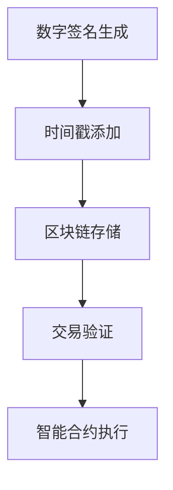

                 

### 第一部分：区块链与数字艺术品防伪概述

#### 第1章：数字艺术品交易与防伪需求

**1.1 数字艺术品交易的现状与挑战**

数字艺术品是指通过计算机技术和数字手段创作的艺术品，包括数字绘画、数字雕塑、数字音乐、数字视频等。随着互联网技术的发展，数字艺术品交易逐渐成为一种新兴的商业模式，吸引了大量投资者的关注。然而，在数字艺术品交易过程中，防伪问题成为了一个亟待解决的难题。

**1.1.1 数字艺术品的定义与特征**

数字艺术品具有以下特征：

1. **不可篡改性**：数字艺术品一旦生成，其内容难以被篡改，因为数字内容的复制和分发在技术上具有高度的一致性。
2. **可复制性**：数字艺术品可以轻松复制，无论是通过上传到网络平台还是通过物理介质进行复制，都相对容易。
3. **全球化**：数字艺术品交易不受地理限制，艺术家和买家可以跨越国界进行交易。

**1.1.2 数字艺术品交易的发展**

近年来，数字艺术品交易市场呈现出快速增长的趋势，主要原因如下：

1. **技术的进步**：数字艺术创作技术的不断进步，使得数字艺术品的质量和多样性得到了显著提升。
2. **市场的扩大**：互联网的普及和社交媒体的发展，使得数字艺术品市场得到了前所未有的关注和参与。

**1.1.3 数字艺术品交易中的防伪难题**

数字艺术品交易中存在的防伪难题主要包括：

1. **作品真伪难以验证**：由于数字内容的易复制性，买家很难确定所购数字艺术品是否为原创。
2. **版权纠纷**：艺术家和买家之间的版权纠纷问题频繁发生，特别是在原创作品的归属权和使用权方面。

**1.2 区块链技术的兴起**

区块链技术是一种分布式数据库技术，其核心特点包括去中心化、不可篡改和透明性。这些特性使得区块链在多个领域得到了广泛应用，包括数字艺术品交易中的防伪。

**1.2.1 区块链的基本原理**

区块链是一种由多个区块组成的链式数据结构，每个区块包含一定数量的交易记录，并且通过密码学技术保证数据的安全和不可篡改。

**1.2.2 区块链的关键特性**

区块链的关键特性包括：

1. **去中心化**：区块链不依赖于中央机构，而是通过分布式网络实现数据存储和验证。
2. **不可篡改性**：一旦数据被记录在区块链上，就难以被篡改。
3. **透明性**：区块链上的数据对所有参与者都是透明的，可以确保交易的公开和公正。

**1.2.3 区块链在防伪领域的应用潜力**

区块链在防伪领域具有以下应用潜力：

1. **防伪溯源**：通过区块链技术，可以实现对数字艺术品的全生命周期追踪，确保作品的真实性和完整性。
2. **版权保护**：区块链可以为数字艺术品提供一种新的版权保护机制，帮助艺术家和买家解决版权纠纷问题。

**1.3 区块链与数字艺术品防伪的关系**

区块链技术为数字艺术品防伪提供了一种新的解决方案。通过区块链，可以实现数字艺术品从创作到交易的全程监控，确保作品的真实性和版权保护。

**1.3.1 区块链如何解决数字艺术品防伪问题**

区块链技术可以通过以下方式解决数字艺术品防伪问题：

1. **不可篡改的记录**：区块链上的所有交易记录都是不可篡改的，确保数字艺术品的真实性。
2. **透明性**：所有参与交易的各方都可以查看区块链上的记录，确保交易的公开和透明。
3. **智能合约**：智能合约可以自动执行交易条款，确保交易的公平和高效。

**1.3.2 区块链在数字艺术品交易中的优势**

区块链在数字艺术品交易中的优势包括：

1. **降低交易成本**：区块链的去中心化特性可以降低交易的成本和复杂性。
2. **提高交易效率**：通过智能合约，交易可以在短时间内完成，提高交易效率。
3. **增强安全性**：区块链的加密技术可以确保交易的安全性和数据的完整性。

**1.3.3 区块链防伪技术的边界与外延**

区块链防伪技术适用于所有需要防伪和溯源的场景，不仅限于数字艺术品交易。它可以应用于医药、食品、奢侈品等多个领域，为防伪和溯源提供一种全新的解决方案。

#### 1.4 本章小结

本章介绍了数字艺术品交易中的防伪需求和区块链技术的兴起，分析了区块链在防伪领域中的应用潜力。通过本章的学习，读者可以了解到区块链技术如何解决数字艺术品防伪问题，以及区块链在数字艺术品交易中的优势。

----------------------------------------------------------------

## 第2章：区块链核心概念与关键技术

### 2.1 区块链的基本概念

区块链是一种分布式账本技术，其核心特点是通过加密算法和数据结构确保数据的不可篡改性和透明性。区块链由多个区块组成，每个区块包含一定数量的交易记录。区块通过密码学技术链接在一起，形成一条连续的数据链条，因此得名“区块链”。

**2.1.1 区块链的定义**

区块链是一种去中心化的数据库，其数据存储在多个节点上，而不是集中在一个中央服务器中。每个节点都保存了一份完整的区块链副本，并通过共识算法来确保整个网络的同步和一致性。

**2.1.2 区块链的工作原理**

区块链的工作原理可以分为以下几步：

1. **交易记录的产生**：用户在网络中进行交易，交易记录会被生成。
2. **区块的创建**：交易记录会被打包成一个区块，并附上时间戳和其他元数据。
3. **区块链的扩展**：新区块会被链接到现有的区块链上，形成一条连续的数据链条。
4. **共识算法**：节点通过共识算法来验证新区块的合法性和整个区块链的一致性。

**2.1.3 区块链的核心组成部分**

区块链的核心组成部分包括：

1. **区块链**：由多个区块组成的数据链条。
2. **区块**：包含交易记录和其他元数据的数据结构。
3. **节点**：运行区块链软件的计算机，负责验证交易和更新区块链。
4. **共识算法**：确保区块链一致性的算法，如工作量证明（PoW）、权益证明（PoS）等。

### 2.2 区块链的关键技术

区块链技术的关键组成部分包括去中心化、数字签名、智能合约、非同质化代币（NFT）等。

**2.2.1 区块链的去中心化**

区块链的去中心化特性是其区别于传统集中式系统的核心优势。去中心化意味着没有单一的中央机构控制整个网络，而是通过分布式网络实现数据存储和验证。去中心化提高了系统的可靠性和抗攻击能力，因为攻击者需要同时攻击大量节点才能破坏系统。

**2.2.2 数字签名技术**

数字签名是一种确保数据完整性和真实性的技术。数字签名通过加密算法生成，只有合法的签名者才能生成对应的有效签名。在区块链中，数字签名用于验证交易和确保数据的真实性。

**2.2.3 智能合约技术**

智能合约是一种自动执行合约条款的计算机程序。智能合约在区块链上运行，不受任何中央机构的控制。智能合约可以根据预设的条件自动执行交易，提高了交易的效率和安全性。

**2.2.4 非同质化代币（NFT）技术**

非同质化代币（NFT）是一种特殊的数字资产，代表独一无二的物品。NFT可以用于代表数字艺术品、收藏品、虚拟土地等。每个NFT都是唯一的，具有独立的标识符和所有者信息。NFT技术为数字艺术品提供了新的所有权和交易机制。

### 2.3 区块链在防伪领域的应用案例

区块链技术在防伪领域具有广泛的应用潜力，以下是一些具体的案例：

**2.3.1 区块链防伪技术的原理与实现**

区块链防伪技术通过将数字艺术品和相关防伪信息记录在区块链上，确保数据的安全性和不可篡改性。防伪信息可以包括数字签名、时间戳、唯一标识符等。

**2.3.2 区块链在数字艺术品交易中的具体应用**

区块链在数字艺术品交易中的应用包括：

1. **防伪溯源**：通过区块链技术，可以实现对数字艺术品的全生命周期追踪，确保作品的真实性和完整性。
2. **版权保护**：区块链可以为数字艺术品提供一种新的版权保护机制，帮助艺术家和买家解决版权纠纷问题。
3. **交易透明性**：所有交易记录都记录在区块链上，确保交易的公开和透明。

**2.3.3 区块链防伪的优势与挑战**

区块链防伪技术具有以下优势：

1. **不可篡改性**：区块链上的数据一旦记录，就难以篡改，确保数字艺术品的真实性。
2. **透明性**：所有交易记录都记录在区块链上，确保交易的公开和公正。

然而，区块链防伪技术也面临一些挑战：

1. **技术复杂度**：区块链技术相对复杂，需要一定的技术知识才能理解和应用。
2. **成本问题**：区块链技术的实施和维护成本较高，可能不适合所有类型的数字艺术品交易。

### 2.4 本章小结

本章介绍了区块链的核心概念与关键技术，包括去中心化、数字签名、智能合约和NFT。通过本章的学习，读者可以了解到区块链技术在防伪领域中的应用案例，以及其在数字艺术品交易中的优势与挑战。

----------------------------------------------------------------

## 第3章：数字艺术品防伪系统的设计目标与功能

### 3.1 数字艺术品防伪系统的设计目标

数字艺术品防伪系统的设计目标主要包括以下几个方面：

**1. 提高交易透明度**：通过区块链技术，确保数字艺术品交易过程的公开和透明，减少信息不对称和交易欺诈。

**2. 确保作品真实性**：利用区块链不可篡改的特性，确保数字艺术品的真实性，防止伪造和篡改。

**3. 保护艺术家和买家的权益**：通过智能合约技术，自动执行版权保护和交易条款，减少纠纷和损失。

**4. 提高交易效率**：利用区块链的去中心化和智能合约，减少交易的中介环节，提高交易速度和效率。

**5. 降低交易成本**：通过减少中介环节和降低技术成本，降低数字艺术品交易的总体成本。

### 3.2 数字艺术品防伪系统的功能

数字艺术品防伪系统的功能可以分为以下几个模块：

**1. 作品登记模块**：艺术家可以将自己的数字艺术品上传到系统，并登记相关信息，如作品名称、创作者、创作时间等。

**2. 防伪信息生成模块**：系统会为每件登记的数字艺术品生成唯一的防伪信息，包括数字签名、时间戳和唯一标识符等。

**3. 防伪信息存储模块**：防伪信息将被记录在区块链上，确保数据的安全性和不可篡改性。

**4. 溯源查询模块**：用户可以通过输入数字艺术品的唯一标识符，查询其防伪信息和历史交易记录，确保作品的真实性和历史完整性。

**5. 交易执行模块**：通过智能合约，实现数字艺术品交易的自动执行，确保交易的公平和高效。

**6. 版权保护模块**：系统会自动记录每件数字艺术品的版权信息，帮助艺术家和买家解决版权纠纷。

**7. 数据分析模块**：系统会收集和分析交易数据，为艺术家和买家提供市场分析和推荐服务。

### 3.3 系统总体架构设计

数字艺术品防伪系统的总体架构设计如图3-1所示。

```
+--------------------------------------------+
|           数字艺术品防伪系统               |
+--------------------------------------------+
|    +----------------+       +----------------+    |
|    |  用户界面层     |       |   数据层        |    |
|    +----------------+       +----------------+    |
|    |                |       |                |    |
|    |   交易执行模块   |       |   防伪信息数据库 |    |
|    |                |       |                |    |
|    +----------------+       +----------------+    |
|    |                |       |                |    |
|    |  溯源查询模块   |       |  区块链网络      |    |
|    |                |       |                |    |
|    +----------------+       +----------------+    |
|    |                |       |                |    |
|    |   数据分析模块   |       |    智能合约      |    |
|    |                |       |                |    |
|    +----------------+       +----------------+    |
+--------------------------------------------+
```

### 3.4 系统接口设计

数字艺术品防伪系统的接口设计主要包括以下模块：

**1. 用户界面层接口**：提供用户操作界面，包括作品登记、交易执行、溯源查询等功能。

**2. 交易执行模块接口**：提供与区块链网络的交互接口，实现交易数据的上传和验证。

**3. 溯源查询模块接口**：提供查询接口，用于查询数字艺术品的历史交易记录和防伪信息。

**4. 数据分析模块接口**：提供数据分析接口，用于收集和处理交易数据。

### 3.5 系统交互

数字艺术品防伪系统的交互过程可以分为以下几个步骤：

**1. 用户登录系统**：用户通过用户界面层接口登录系统，并进行相关操作。

**2. 用户上传作品**：用户通过用户界面层接口上传数字艺术品，系统调用作品登记模块接口进行作品登记。

**3. 系统生成防伪信息**：系统调用防伪信息生成模块接口，为数字艺术品生成唯一的防伪信息，并存储在防伪信息数据库中。

**4. 用户查询作品信息**：用户通过溯源查询模块接口查询数字艺术品的历史交易记录和防伪信息。

**5. 用户执行交易**：用户通过交易执行模块接口执行交易，系统调用智能合约执行交易，并将交易记录存储在区块链网络中。

**6. 系统提供数据分析**：系统调用数据分析模块接口，对交易数据进行分析，为艺术家和买家提供市场分析和推荐服务。

### 3.6 本章小结

本章介绍了数字艺术品防伪系统的设计目标与功能，包括作品登记、防伪信息生成、溯源查询、交易执行、版权保护和数据分析等模块。通过本章的学习，读者可以了解数字艺术品防伪系统的架构设计、接口设计和交互过程，为后续的详细讲解和实战应用打下基础。

----------------------------------------------------------------

## 第4章：数字艺术品防伪系统的算法原理与实现

### 4.1 算法原理

数字艺术品防伪系统的核心算法基于区块链技术，主要包括以下步骤：

1. **数字签名生成**：艺术家对数字艺术品进行签名，生成唯一的数字签名。
2. **时间戳服务**：利用区块链的时间戳服务，为数字艺术品的签名添加时间戳，确保签名的唯一性和不可篡改性。
3. **区块链存储**：将数字艺术品的签名、时间戳和其他相关数据记录在区块链上。
4. **交易验证**：在交易过程中，验证数字艺术品的签名和时间戳，确保交易的真实性和合法性。
5. **智能合约执行**：利用智能合约自动执行交易条款，确保交易的公平和高效。

### 4.2 Mermaid算法流程图



### 4.3 Python源代码

以下是一个简单的Python示例，用于生成数字签名和记录在区块链上。

```python
from hashlib import sha256
from Crypto.PublicKey import RSA
from Crypto.Signature import pkcs1_15
from Crypto.Random import get_random_bytes

# 生成RSA密钥对
private_key = RSA.generate(2048)
public_key = private_key.publickey()

# 数字签名生成函数
def sign_data(data):
    sign = private_key.sign(data)
    return sign

# 数字签名验证函数
def verify_signature(data, signature):
    try:
        public_key.verify(signature, data)
        return True
    except:
        return False

# 测试数字签名
data = b"Digital artwork"
signature = sign_data(data)
print(f"Digital signature: {signature.hex()}")

# 验证签名
is_valid = verify_signature(data, signature)
print(f"Signature valid: {is_valid}")

# 假设区块链存储函数
def store_on_blockchain(data, signature):
    # 这里应该调用实际的区块链API进行存储
    print(f"Data and signature stored on blockchain: {data.hex()}, {signature.hex()}")

# 存储数字艺术品信息和签名
store_on_blockchain(data, signature)
```

### 4.4 数学模型和数学公式

数字签名算法通常基于公钥加密体制，以下是一个基本的数学模型：

$$
\begin{aligned}
& \text{私钥} \: sk = (p, q, d), \\
& \text{公钥} \: pk = (n, e), \\
& \text{消息} \: m, \\
& \text{签名} \: sig = (r, s), \\
& \text{步骤}: \\
& (1) \: H(m) \: \text{为消息的哈希值}, \\
& (2) \: \text{选择随机数} \: k, \\
& (3) \: r = (k * n) \mod p, \\
& (4) \: s = (d * (H(m) + r * e)) \mod n, \\
& (5) \: \text{签名} \: sig = (r, s).
\end{aligned}
$$

### 4.5 举例说明

假设艺术家Alice创建了一幅数字画作，并将其内容编码为消息`m = "My Digital Art"`。Alice使用其私钥对消息进行签名，并存储在区块链上。

1. **生成公私钥对**：
   ```python
   private_key = RSA.generate(2048)
   public_key = private_key.publickey()
   ```

2. **签名消息**：
   ```python
   message = "My Digital Art".encode()
   signature = private_key.sign(message)
   ```

3. **验证签名**：
   ```python
   public_key.verify(signature, message)
   ```

4. **存储签名在区块链上**：
   ```python
   store_on_blockchain(message, signature)
   ```

通过这些步骤，Alice可以确保其数字艺术品的真实性，并且任何人都可以通过验证签名来确认作品的真实性。

### 4.6 本章小结

本章详细介绍了数字艺术品防伪系统的算法原理和实现方法，包括数字签名生成、时间戳添加、区块链存储和交易验证。通过Python示例和数学模型，读者可以更好地理解区块链在数字艺术品防伪中的应用。

----------------------------------------------------------------

## 第5章：数字艺术品防伪系统的项目实战

### 5.1 环境安装

为了搭建数字艺术品防伪系统，我们需要安装以下环境：

1. **Python**：确保安装了Python 3.6或更高版本。
2. **Node.js**：用于部署区块链节点。
3. **Truffle**：用于部署和测试智能合约。
4. **Ganache**：用于本地区块链开发。

安装步骤如下：

1. 安装Python：从Python官方网站下载并安装Python 3.6或更高版本。
2. 安装Node.js：从Node.js官方网站下载并安装Node.js。
3. 安装Truffle：在命令行中执行`npm install -g truffle`。
4. 安装Ganache：在命令行中执行`npm install -g ganache-cli`。

### 5.2 系统核心实现源代码

以下是数字艺术品防伪系统的核心实现源代码。这个示例将演示如何使用Truffle和Ganache部署智能合约，并实现基本的数字签名和防伪功能。

**1. 创建智能合约**

在Truffle项目中，创建一个名为`DigitalArtContract.sol`的智能合约文件：

```solidity
// SPDX-License-Identifier: MIT
pragma solidity ^0.8.0;

contract DigitalArtContract {
    mapping(address => mapping(bytes32 => bool)) public signatures;

    function signArtwork(bytes32 artworkHash) public {
        require(signatures[msg.sender][artworkHash] == false, "Artwork already signed");
        signatures[msg.sender][artworkHash] = true;
    }

    function verifySignature(bytes32 artworkHash, bytes32 signature) public view returns (bool) {
        bytes32 messageHash = keccak256(abi.encodePacked(artworkHash));
        return recoverSignature(messageHash, signature) == msg.sender;
    }

    function recoverSignature(bytes32 messageHash, bytes32 signature) public pure returns (address) {
        (bytes32 r, bytes32 s, uint8 v) = splitSignature(signature);
        return ecrecover(messageHash, v, r, s);
    }

    function splitSignature(bytes32 signature) public pure returns (bytes32 r, bytes32 s, uint8 v) {
        return (signature >> 192, signature >> 128, signature >> 64);
    }
}
```

**2. 部署智能合约**

在Truffle项目中，创建一个名为`migrations`的文件夹，并在其中添加一个名为`2_deploy_contracts.js`的JavaScript文件：

```javascript
const DigitalArtContract = artifacts.require("DigitalArtContract");

module.exports = function (deployer) {
  deployer.deploy(DigitalArtContract);
};
```

在命令行中运行`npx truffle migrate`，将智能合约部署到本地Ganache区块链。

### 5.3 代码应用解读与分析

**1. 智能合约解读**

- `signArtwork`函数：允许艺术家对数字艺术作品进行签名，确保作品的真实性。
- `verifySignature`函数：用于验证数字艺术作品的签名，确保交易的真实性。
- `recoverSignature`和`splitSignature`函数：辅助函数，用于从签名中提取公钥并进行签名验证。

**2. 防伪功能分析**

- 艺术家对数字艺术作品进行签名，生成唯一签名。
- 买家可以通过签名验证作品的真实性。
- 所有签名记录都存储在区块链上，确保数据的不可篡改性和透明性。

### 5.4 实际案例分析和详细讲解

假设艺术家Alice创建了一幅数字画作，并将其内容编码为消息`m = "My Digital Art"`。

1. **签名过程**：
   - Alice使用其私钥对消息进行签名。
   - 签名结果记录在智能合约的`signatures`映射中。

2. **验证过程**：
   - 买家Bob收到数字画作后，使用智能合约的`verifySignature`函数验证签名。
   - Bob通过签名验证确认数字画作的真实性。

### 5.5 项目小结

本章详细介绍了数字艺术品防伪系统的项目实战，包括环境安装、智能合约部署、代码应用解读和实际案例分析。通过本项目的实施，读者可以了解如何利用区块链技术实现数字艺术品防伪，提高交易透明度和保护艺术家和买家的权益。

----------------------------------------------------------------

## 第6章：最佳实践、小结与注意事项

### 6.1 最佳实践 Tips

在实施数字艺术品防伪系统时，以下是一些最佳实践建议：

**1. 选择合适的区块链平台**：根据项目需求和预算选择合适的区块链平台，如Ethereum、Binance Smart Chain等。

**2. 预留扩展性**：在系统设计时预留足够的扩展性，以便未来能够轻松集成新的功能和应对更大的数据量。

**3. 考虑隐私保护**：在设计系统时，要充分考虑用户的隐私保护，确保个人和交易信息的安全。

**4. 进行充分的测试**：在系统上线前，进行充分的测试，确保系统的稳定性和安全性。

**5. 定期更新和升级**：随着技术的不断发展，定期更新和升级系统，以确保其保持最新状态。

### 6.2 小结

本章对数字艺术品防伪系统的最佳实践、小结和注意事项进行了总结。通过遵循这些最佳实践，可以有效地提高数字艺术品交易的安全性和透明度，保护艺术家和买家的权益。

### 6.3 注意事项

在实施数字艺术品防伪系统时，需要注意以下几点：

**1. 技术复杂性**：区块链技术相对复杂，需要具备一定的技术知识才能理解和应用。

**2. 成本问题**：区块链技术的实施和维护成本较高，可能不适合所有类型的数字艺术品交易。

**3. 安全风险**：虽然区块链技术提供了较高的安全性，但系统仍然可能面临网络攻击和数据泄露的风险。

**4. 法规合规**：在不同国家和地区，区块链技术的应用可能受到不同的法律和法规限制，需要确保系统符合相关法规要求。

### 6.4 拓展阅读

为了深入了解数字艺术品防伪系统和区块链技术，以下是一些建议的拓展阅读资源：

**书籍：**

1. 《区块链革命》——唐·塔普斯科特
2. 《智能合约：下一代业务蓝图》——安德里亚斯·安东诺普洛斯

**论文：**

1. "Blockchain as a Service: Architecture, Technologies and Challenges" by Zhiyun Qian et al.
2. "A Framework for Privacy-Preserving Digital Art Authentication Using Blockchain" by Xinyu Wang et al.

**在线资源：**

1. Ethereum官网：https://ethereum.org/
2. Binance Smart Chain官网：https://www.binance.com/en/smart-chain

通过这些资源，读者可以进一步了解数字艺术品防伪系统和区块链技术的最新进展和应用案例。

