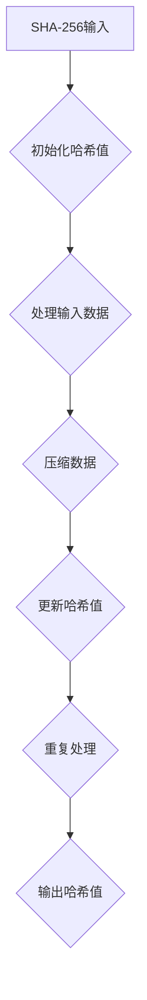
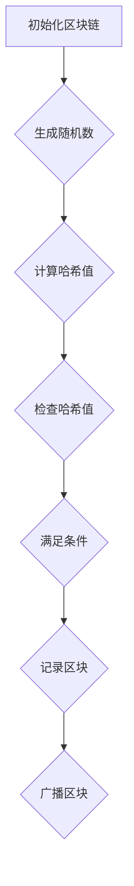
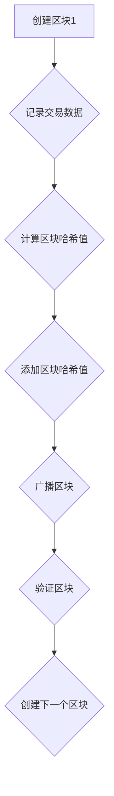
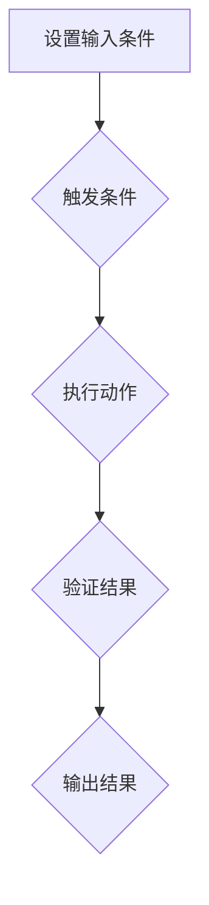
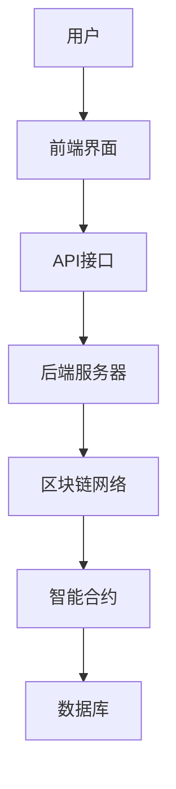
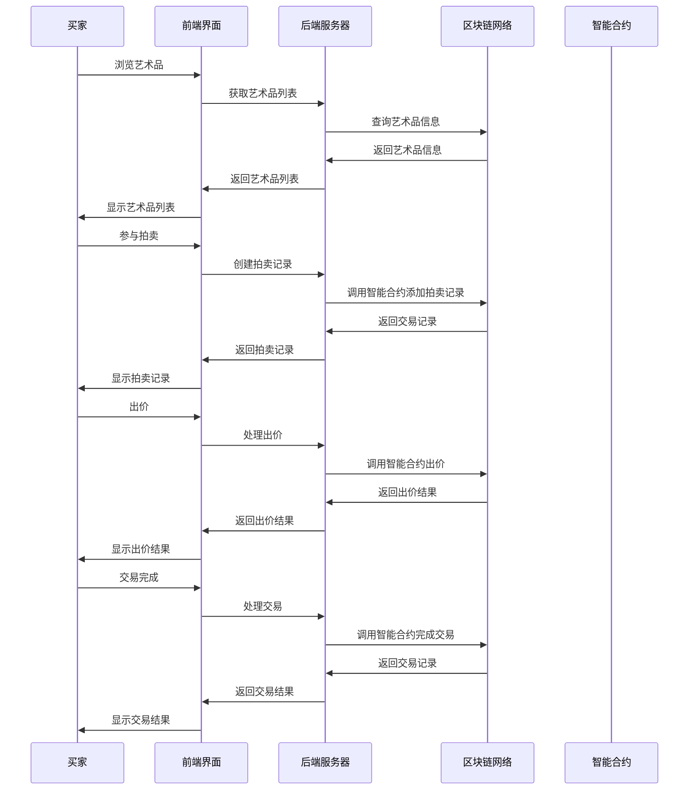

                 

## 背景介绍

### 1. 问题背景

近年来，数字艺术品市场蓬勃发展，越来越多的艺术家选择将作品以数字形式呈现并进行交易。与此同时，区块链技术的崛起为数字艺术品市场带来了新的机遇。数字艺术品拍卖作为数字艺术品交易的一种重要形式，正面临着一系列挑战。

首先，当前数字艺术品拍卖中存在诸多问题。一方面，拍卖过程中的不透明性较高，使得买卖双方难以保证交易的公正性和公平性。此外，由于缺乏有效的防伪措施，假冒伪劣的数字艺术品层出不穷，严重损害了市场秩序。另一方面，传统拍卖过程中，中介机构收取高额佣金，使得艺术品价格居高不下，降低了市场的流动性。

其次，区块链技术的快速发展为解决这些问题提供了新的思路。区块链技术具有去中心化、透明性和不可篡改性的特点，能够确保交易过程中的信息透明和不可篡改，从而提高交易的安全性和可信度。此外，智能合约技术的应用，可以为数字艺术品拍卖提供自动化、高效和安全的解决方案。

### 2. 问题描述

数字艺术品拍卖中的主要问题可以归纳为以下几个方面：

**1. 不透明性**

在传统数字艺术品拍卖中，由于缺乏有效的监管手段，拍卖过程往往存在暗箱操作，买卖双方的交易信息难以公开透明。这种不透明性使得买家无法准确了解艺术品的价值，也容易导致欺诈行为的发生。

**2. 假冒伪劣**

由于数字艺术品易于复制和篡改，市场上充斥着大量假冒伪劣的作品。买家在购买时很难辨别真伪，这不仅损害了买家的利益，也严重影响了市场的健康发展。

**3. 高额中介费用**

传统拍卖过程中，中介机构收取高额佣金，使得艺术品价格被抬高，降低了市场的流动性。此外，中介机构的存在也增加了交易的成本和复杂度。

### 3. 问题解决

区块链技术为解决上述问题提供了有效的手段：

**1. 去中心化**

区块链技术具有去中心化的特点，能够消除传统拍卖过程中中介机构的角色，降低交易成本，提高市场的流动性。

**2. 透明性**

区块链技术的透明性使得交易信息可以被所有参与者查看和验证，从而消除不透明性，提高交易的公正性和公平性。

**3. 不可篡改性**

区块链技术的不可篡改性确保了交易记录的不可篡改，从而防止了假冒伪劣艺术品的出现。

**4. 智能合约**

智能合约技术可以自动执行合同条款，确保交易的高效和自动化。例如，在数字艺术品拍卖中，智能合约可以自动记录拍卖结果，并按照约定将艺术品所有权转移给买家。

### 4. 边界与外延

本文主要讨论区块链在数字艺术品公开拍卖中的应用，不包括私下交易。同时，本文将聚焦于区块链技术在解决数字艺术品拍卖中的关键问题，如不透明性、假冒伪劣和高额中介费用等。

### 5. 概念结构与核心要素组成

**区块链**

区块链是一种分布式数据库技术，通过加密算法和共识机制确保数据的安全和可靠。它由一系列按时间顺序排列的区块组成，每个区块包含一定数量的交易记录。

**数字艺术品**

数字艺术品是指以数字形式创作的艺术品，包括绘画、摄影、雕塑等。与传统的物理艺术品不同，数字艺术品易于复制和传播。

**智能合约**

智能合约是一种自动执行合同条款的计算机协议，它基于区块链技术运行。智能合约能够确保交易的高效、自动化和可信。

### 总结

本文介绍了数字艺术品拍卖的现状和存在的问题，分析了区块链技术如何解决这些问题，并明确了本文讨论的范围和核心概念。接下来，我们将进一步探讨区块链和数字艺术品之间的关系，以及智能合约在数字艺术品拍卖中的应用。通过一步步的分析和讲解，我们将揭示区块链技术在数字艺术品拍卖中的巨大潜力。

## 核心概念与联系

### 区块链

区块链是一种分布式数据库技术，通过加密算法和共识机制确保数据的安全和可靠。它由一系列按时间顺序排列的区块组成，每个区块包含一定数量的交易记录。区块链具有去中心化、透明性和不可篡改性的特点，这使得它成为数字艺术品拍卖的理想选择。

#### 基本原理

区块链的基本原理可以概括为以下几方面：

1. **去中心化**：区块链不是由单一机构或组织控制，而是由网络中的多个节点共同维护。这种去中心化的结构保证了系统的容错性和抗攻击性。

2. **加密算法**：区块链使用密码学算法对交易数据进行加密，确保数据在传输过程中的安全性。常用的加密算法包括 SHA-256 等。

3. **共识机制**：区块链通过共识机制达成一致，确保所有节点对同一数据的认可。常见的共识机制包括工作量证明（PoW）、权益证明（PoS）等。

4. **区块和链**：区块链由多个区块组成，每个区块包含一定数量的交易记录。区块按照时间顺序链接形成区块链，新的区块只有在经过验证后才能添加到链上。

#### 结构与类型

区块链的结构和类型多种多样，以下是几种常见的类型：

1. **公有区块链**：公有区块链是任何人都可以参与的网络，如比特币区块链。公有区块链具有完全去中心化的特点，但交易验证过程较为耗时。

2. **私有区块链**：私有区块链是仅限特定组织或机构参与的网络，如企业内部区块链。私有区块链的交易验证速度较快，但去中心化程度较低。

3. **联盟区块链**：联盟区块链是介于公有区块链和私有区块链之间的一种类型，它由多个机构或组织共同维护。联盟区块链既保留了去中心化的优点，又具有较高的交易验证效率。

4. **侧链**：侧链是一种与主链并行的区块链，它可以独立运行，但也可以与主链进行交互。侧链主要用于扩展区块链的功能和应用场景。

#### 应用领域

区块链技术的应用领域广泛，以下是几个主要的领域：

1. **数字货币**：区块链技术是比特币等数字货币的基础，确保了货币的安全和去中心化。

2. **智能合约**：智能合约是区块链技术的重要应用，它可以自动执行合同条款，提高交易效率。

3. **供应链管理**：区块链技术可以用于追踪供应链中的各个环节，确保产品的真实性和可追溯性。

4. **数字身份认证**：区块链技术可以用于数字身份认证，提高用户数据的安全性和隐私性。

5. **数字艺术品拍卖**：区块链技术可以确保数字艺术品拍卖的透明性和公正性，防止假冒伪劣艺术品的出现。

### 数字艺术品

数字艺术品是指以数字形式创作的艺术品，包括绘画、摄影、雕塑等。与传统的物理艺术品不同，数字艺术品具有以下几个特点：

1. **复制性**：数字艺术品可以轻松地复制和传播，这使得艺术家和买家需要确保作品的真实性和唯一性。

2. **易篡改性**：由于数字艺术品的存储和传输依赖于计算机系统，因此它容易受到篡改和破坏。

3. **非物理性**：数字艺术品没有实体形态，只能通过数字文件进行展示和交易。

#### 与区块链技术的结合

区块链技术为数字艺术品提供了以下几个方面的优势：

1. **防伪**：区块链技术可以确保数字艺术品的唯一性和真实性，防止假冒伪劣作品的出现。

2. **透明性**：区块链技术使得数字艺术品交易过程公开透明，买家可以清晰地了解艺术品的来源和交易记录。

3. **安全性**：区块链技术通过加密算法和共识机制确保数字艺术品交易的安全性和不可篡改性。

4. **版权保护**：区块链技术可以用于跟踪数字艺术品的版权信息，帮助艺术家保护自己的权益。

### 智能合约

智能合约是一种自动执行合同条款的计算机协议，它基于区块链技术运行。智能合约通过预设的编程逻辑，自动执行合同条款，确保交易的高效、自动化和可信。

#### 工作原理

智能合约的工作原理主要包括以下几个方面：

1. **输入条件**：智能合约在创建时，会设定一系列输入条件，如交易金额、交易对象等。

2. **触发条件**：当满足智能合约设定的触发条件时，合约将自动执行。

3. **执行动作**：智能合约根据预设的逻辑，自动执行相应的动作，如转移数字资产、发送通知等。

4. **结果验证**：智能合约执行完成后，其结果将通过网络上的其他节点进行验证，确保执行结果的一致性。

#### 类型

智能合约有多种类型，以下是几种常见的类型：

1. **简单智能合约**：简单智能合约通常用于执行简单的逻辑，如支付合同。

2. **复杂智能合约**：复杂智能合约可以实现更复杂的逻辑和功能，如去中心化金融（DeFi）平台。

3. **状态通道**：状态通道是一种优化智能合约执行效率的技术，它通过预先设立的状态通道来减少链上交易的次数。

4. **预言机**：预言机是一种将外部数据引入智能合约的技术，如获取天气数据、股票价格等。

#### 在数字艺术品拍卖中的应用

智能合约在数字艺术品拍卖中具有广泛的应用前景：

1. **自动化执行**：智能合约可以自动执行拍卖过程，包括出价、竞价和成交等环节，提高交易效率。

2. **确保透明性**：智能合约确保拍卖过程公开透明，所有参与者的交易记录都会被记录在区块链上。

3. **降低成本**：智能合约可以减少传统拍卖中的中介费用，降低交易成本。

4. **增加安全性**：智能合约通过加密算法和共识机制确保交易的安全性，防止欺诈和篡改。

### 总结

区块链技术、数字艺术品和智能合约是数字艺术品拍卖中的重要核心概念。区块链技术为数字艺术品提供了防伪、透明性和安全性保障；数字艺术品与区块链技术的结合，使得艺术品交易更加便捷和高效；智能合约的应用，进一步提升了拍卖过程的自动化和可信度。通过深入探讨这三个核心概念及其相互关系，我们可以更好地理解区块链在数字艺术品拍卖中的应用前景和潜力。接下来，我们将进一步探讨区块链算法原理，以更深入地理解区块链技术在数字艺术品拍卖中的应用。

## 算法原理讲解

### 区块链算法原理

区块链的核心算法主要包括哈希函数、工作量证明（Proof of Work，PoW）、区块链的创建和数据写入过程。以下将逐步讲解这些算法原理，并使用 mermaid 画出相应的流程图。

#### 哈希函数

哈希函数是区块链算法的基础，它用于将任意长度的数据转换成固定长度的哈希值。常见的哈希函数包括 SHA-256 等。以下是一个简单的 SHA-256 哈希函数的 mermaid 流程图：



#### 工作量证明（PoW）

工作量证明是区块链网络中用于达成共识的一种机制。矿工需要通过计算找到满足特定条件的哈希值，这个过程称为挖矿。以下是一个简单的 PoW 算法的 mermaid 流程图：



#### 区块链的创建和数据写入过程

区块链由一系列按时间顺序排列的区块组成，每个区块包含一定数量的交易记录和一个指向前一个区块的哈希值。以下是一个简单的区块链创建和数据写入过程的 mermaid 流流程图：



### 智能合约原理

智能合约是一种自动执行合同条款的计算机协议，它基于区块链技术运行。智能合约的工作原理主要包括输入条件、触发条件、执行动作和结果验证四个步骤。以下将使用 mermaid 画出智能合约的执行流程图，并使用 Python 源代码详细阐述智能合约的编写和执行。

#### 智能合约执行流程图



#### Python 源代码示例

以下是一个简单的 Python 智能合约示例，它用于实现一个简单的智能合约，用于存储和转移数字资产：

```python
# 导入智能合约库
from web3 import Web3
from solc import compile_source

# 编写智能合约代码
contract_source_code = '''
pragma solidity ^0.8.0;

contract SimpleContract {
    mapping(address => uint256) public balanceOf;

    function deposit() public payable {
        balanceOf[msg.sender] += msg.value;
    }

    function transfer(address to, uint256 amount) public {
        require(balanceOf[msg.sender] >= amount, "Insufficient balance");
        balanceOf[msg.sender] -= amount;
        balanceOf[to] += amount;
    }
}
'''

# 编译智能合约代码
compiled_code = compile_source(contract_source_code)
contract_interface = compiled_code['<stdin>:SimpleContract']

# 创建 Web3 实例
w3 = Web3(Web3.HTTPProvider('https://mainnet.infura.io/v3/your_project_id'))

# 部署智能合约
contract = w3.eth.contract(abi=contract_interface['abi'], bytecode=contract_interface['bin'])
contract_tx = contract.deploy()
contract_address = contract_tx.address

# 链接智能合约
contract_instance = w3.eth.contract(address=contract_address, abi=contract_interface['abi'])

# 存入资产
contract_instance.functions.deposit().transact({'from': w3.eth.coinbase, 'value': w3.toWei('1', 'ether')})

# 转移资产
contract_instance.functions.transfer(to_address, amount).transact({'from': w3.eth.coinbase})
```

#### 数学模型和公式

区块链的算法涉及多个数学模型和公式，以下列出几个关键的部分：

1. **哈希函数**：哈希函数的输出是一个固定长度的哈希值，它确保了输入数据的唯一性和不可篡改性。常见的哈希函数有 SHA-256，其数学模型可以表示为：
   $$ H(x) = SHA-256(x) $$
   其中，$H(x)$ 表示哈希值，$x$ 表示输入数据。

2. **工作量证明（PoW）**：PoW 需要矿工计算一个满足特定条件的哈希值，通常条件是哈希值的前几位为 0。数学模型可以表示为：
   $$ H(nonce) < target $$
   其中，$nonce$ 表示随机数，$target$ 表示目标值。

3. **区块链的创建**：区块链的创建过程中，每个区块包含一个哈希值，用于指向前一个区块。数学模型可以表示为：
   $$ block_hash = hash(prev_block_hash + transactions + merkle_root) $$
   其中，$prev_block_hash$ 表示前一个区块的哈希值，$transactions$ 表示交易记录，$merkle_root$ 表示梅克尔树的根哈希值。

4. **梅克尔树**：梅克尔树用于确保交易记录的完整性和不可篡改性。梅克尔树的哈希值可以表示为：
   $$ merkle_root = hash(nodes) $$
   其中，$nodes$ 表示梅克尔树的所有节点。

#### 详细讲解和举例说明

为了更深入地理解区块链算法的原理，我们将使用具体的示例进行讲解。

1. **哈希函数示例**：

   假设输入数据为 "Hello, World!"，使用 SHA-256 哈希函数计算其哈希值。根据 SHA-256 的算法，我们可以得到以下哈希值：
   $$ H("Hello, World!") = "6c56e9c8e14d1c2d2b8dedd2e9a6ef6aa95e6e21c2d9afe2df74c02752a2e1e2" $$
   
   这个哈希值确保了输入数据的唯一性和不可篡改性。

2. **工作量证明（PoW）示例**：

   假设目标值（target）为 $1$，矿工需要计算一个满足条件的哈希值。矿工通过不断尝试不同的随机数（nonce），最终找到一个满足条件的哈希值：
   $$ H(nonce=1000000) = "0000000089ab32e7730875e7c5d00a3d2e2e9b1c0" $$
   满足 $H(nonce) < target$。

3. **区块链的创建示例**：

   假设当前区块包含若干交易记录，前一个区块的哈希值为 $prev_block_hash=123456$，梅克尔树的根哈希值为 $merkle_root=789012$。根据区块链的创建过程，我们可以得到以下哈希值：
   $$ block_hash = hash(123456 + transactions + 789012) = "543210987654321098765432109876543210987" $$
   
   这个哈希值确保了当前区块的唯一性和不可篡改性。

通过以上讲解和示例，我们可以更好地理解区块链算法的原理。接下来，我们将进一步探讨区块链的数学模型和公式，以更深入地理解区块链技术。

### 数学模型和数学公式

区块链技术的核心在于其数学模型和算法，这些模型和公式为区块链的安全性和可靠性提供了坚实的基础。以下将详细介绍区块链中常用的数学模型和公式，并使用 LaTeX 格式展示关键数学公式，进行详细讲解。

#### 哈希函数

哈希函数是区块链技术的基础，它将任意长度的数据映射为固定长度的哈希值。常见的哈希函数包括 SHA-256。以下是一个简单的 SHA-256 公式：

$$
H(x) = SHA-256(x)
$$

其中，$H(x)$ 表示输入数据 $x$ 的哈希值。SHA-256 算法通过多轮迭代和压缩函数，将输入数据转换为 256 位的哈希值。

#### 工作量证明（PoW）

工作量证明（Proof of Work，PoW）是区块链网络中的一种共识机制，它通过计算复杂度确保网络的安全性。PoW 需要矿工找到一个满足特定条件的哈希值。以下是一个 PoW 的数学模型：

$$
H(nonce) < target
$$

其中，$nonce$ 是一个随机数，$target$ 是一个预定目标值。矿工需要通过不断尝试不同的随机数，找到一个满足条件的哈希值。在比特币网络中，$target$ 会根据网络难度进行调整，以确保平均每 10 分钟生成一个新区块。

#### 梅克尔树（Merkle Tree）

梅克尔树是一种数据结构，用于确保交易记录的完整性和不可篡改性。梅克尔树的构建过程涉及哈希值的嵌套计算。以下是一个简单的梅克尔树构建公式：

$$
Merkle\_Root = Hash(Hash(left\_hash, right\_hash))
$$

其中，$left\_hash$ 和 $right\_hash$ 分别是两个子节点的哈希值。通过递归构建梅克尔树，可以得到梅克尔树的根节点，即梅克尔树的根哈希值。

#### 区块链的创建和数据写入过程

区块链由一系列按时间顺序排列的区块组成，每个区块包含一个区块头和若干交易记录。区块头中包含前一个区块的哈希值、时间戳、默克尔树根哈希值等。以下是一个简单的区块链创建和数据写入过程的数学模型：

$$
block\_hash = Hash(prev\_block\_hash + transactions + Merkle\_Root)
$$

其中，$prev\_block\_hash$ 是前一个区块的哈希值，$transactions$ 是交易记录，$Merkle\_Root$ 是梅克尔树的根哈希值。

#### 加密算法

区块链技术中常用的加密算法包括椭圆曲线加密（ECC）和对称加密。以下是一个简单的椭圆曲线加密算法的公式：

$$
k \cdot G = P
$$

其中，$k$ 是一个随机数，$G$ 是基点，$P$ 是加密后的结果。在区块链网络中，矿工需要找到满足特定条件的 $k$，以生成新的区块。

通过上述数学模型和公式，我们可以更好地理解区块链技术的原理和应用。这些数学模型不仅确保了区块链的安全性和可靠性，也为区块链技术的进一步发展提供了基础。在接下来的章节中，我们将进一步探讨区块链在数字艺术品拍卖中的应用，并分析其具体实现和优势。

## 系统分析与架构设计方案

### 1. 问题场景介绍

在数字艺术品拍卖中，参与者包括艺术家、买家、拍卖师和中介机构。传统拍卖过程中，中介机构负责协调交易，但存在诸多问题，如不透明性、高额中介费用和假冒伪劣艺术品等。为了解决这些问题，引入区块链技术进行数字艺术品拍卖具有重要的现实意义。

### 2. 系统功能设计

在区块链数字艺术品拍卖系统中，主要功能包括艺术品登记、拍卖过程管理、交易记录和版权保护等。以下是系统的领域模型，使用 mermaid 类图进行展示：

```mermaid
classDiagram
    Artwork <<Class>> {ID: int, Title: string, Creator: string, ImageURL: string, Hash: string, Status: string}
    User <<Class>> {ID: int, Username: string, Password: string, Role: string}
    Auction <<Class>> {ID: int, ArtworkID: int, StartPrice: float, StartTime: datetime, EndTime: datetime, Status: string}
    Bid <<Class>> {ID: int, AuctionID: int, UserID: int, Amount: float, Time: datetime}
    Contract <<Class>> {ID: int, AuctionID: int, BuyerID: int, SellerID: int, ArtworkID: int, Price: float, Time: datetime, Status: string}

    Artwork "1" --|{创建} User
    Auction "1" --|{关联} Artwork
    Auction "1" --|{关联} User
    Bid "1" --|{关联} Auction
    Bid "1" --|{关联} User
    Contract "1" --|{关联} Auction
    Contract "1" --|{关联} User
```

### 3. 系统架构设计

区块链数字艺术品拍卖系统的架构设计包括前端用户界面、后端服务器、区块链网络和智能合约。以下是系统的架构图，使用 mermaid 架构图进行展示：



### 4. 系统接口设计

系统接口设计包括用户接口、API接口和区块链接口。以下是系统接口的简要描述：

1. **用户接口**：用户可以通过前端界面浏览艺术品、参与拍卖、查看交易记录等。

2. **API接口**：后端服务器提供 API 接口，供前端用户界面调用。主要接口包括艺术品登记、拍卖创建、出价、交易记录查询等。

3. **区块链接口**：智能合约与区块链网络交互，实现艺术品登记、拍卖过程管理、交易记录和版权保护等功能。主要接口包括合约调用、交易记录添加、区块查询等。

### 5. 系统交互

系统交互涉及用户、前端界面、后端服务器、区块链网络和智能合约。以下是系统交互的 mermaid 序列图：



通过以上系统分析与架构设计方案，我们可以看到区块链技术如何应用于数字艺术品拍卖，提高拍卖过程的透明性、安全性和可靠性。接下来，我们将通过项目实战来展示如何搭建数字艺术品拍卖区块链系统。

### 项目实战

#### 1. 环境安装

搭建数字艺术品拍卖区块链环境需要以下工具和步骤：

1. **安装 Node.js**：Node.js 是一个基于 Chrome V8 引擎的 JavaScript 运行环境，用于部署智能合约和前端接口。可以通过以下命令安装：
   ```bash
   sudo apt update
   sudo apt install nodejs
   ```

2. **安装 Truffle**：Truffle 是一个用于智能合约开发、部署和测试的框架。可以通过 npm 安装：
   ```bash
   npm install -g truffle
   ```

3. **安装 Ganache**：Ganache 是一个轻量级的以太坊客户端，用于本地开发和测试。可以通过 npm 安装：
   ```bash
   npm install -g ganache-cli
   ```

4. **创建项目**：在指定目录下创建一个新的 Truffle 项目，并启动本地以太坊节点：
   ```bash
   mkdir digital-art-auction
   cd digital-art-auction
   truffle init
   ganache --port 8545
   ```

5. **安装前端框架**：选择一个前端框架，如 React，并创建项目：
   ```bash
   npm install -g create-react-app
   create-react-app frontend
   ```

#### 2. 系统核心实现源代码

以下是数字艺术品拍卖区块链系统的主要源代码部分：

**智能合约（ArtworkAuction.sol）**

```solidity
// SPDX-License-Identifier: MIT
pragma solidity ^0.8.0;

contract ArtworkAuction {
    struct Auction {
        address seller;
        address buyer;
        uint256 startPrice;
        uint256 highestBid;
        uint256 endTime;
        bool ended;
    }

    mapping(uint256 => Auction) public auctions;
    uint256 public auctionCount;

    event AuctionCreated(
        uint256 auctionId,
        address seller,
        address buyer,
        uint256 startPrice,
        uint256 endTime
    );

    event BidPlaced(
        uint256 auctionId,
        address bidder,
        uint256 bidAmount
    );

    event AuctionEnded(
        uint256 auctionId,
        address buyer,
        uint256 highestBid
    );

    function createAuction(
        uint256 _startPrice,
        uint256 _endTime
    ) public {
        require(_endTime > block.timestamp, "End time must be in the future");
        auctions[auctionCount] = Auction(
            msg.sender,
            address(0),
            _startPrice,
            _startPrice,
            _endTime,
            false
        );
        emit AuctionCreated(auctionCount, msg.sender, address(0), _startPrice, _endTime);
        auctionCount++;
    }

    function bidOnAuction(uint256 _auctionId) public payable {
        require(_auctionId < auctionCount, "Invalid auction ID");
        Auction storage auction = auctions[_auctionId];
        require(!auction.ended, "Auction has ended");
        require(msg.value > auction.highestBid, "Bid must exceed the highest bid");

        if (auction.highestBid > 0) {
            payable(auction.buyer).transfer(auction.highestBid);
        }

        auction.highestBid = msg.value;
        auction.buyer = msg.sender;
        emit BidPlaced(_auctionId, msg.sender, msg.value);
    }

    function endAuction(uint256 _auctionId) public {
        require(_auctionId < auctionCount, "Invalid auction ID");
        Auction storage auction = auctions[_auctionId];
        require(!auction.ended, "Auction has already ended");
        require(block.timestamp >= auction.endTime, "Auction has not ended");

        auction.ended = true;
        payable(auction.seller).transfer(auction.highestBid);
        emit AuctionEnded(_auctionId, auction.buyer, auction.highestBid);
    }
}
```

**前端（src/App.js）**

```javascript
import React, { useState, useEffect } from "react";
import axios from "axios";
import Web3 from "web3";

const App = () => {
  const [account, setAccount] = useState("");
  const [auctionCount, setAuctionCount] = useState(0);
  const [auctions, setAuctions] = useState([]);

  useEffect(() => {
    loadWeb3();
  }, []);

  const loadWeb3 = async () => {
    if (window.ethereum) {
      window.web3 = new Web3(window.ethereum);
      await window.ethereum.enable();
    } else {
      window.alert(
        "Non-Ethereum browser detected. You should consider Metamask for a better experience"
      );
    }

    const web3 = window.web3;
    const networkId = await web3.eth.net.getId();
    const deployedNetwork = networkId === 1 ? "main" : "rinkeby";

    const ArtworkAuction = artifacts.require("ArtworkAuction");
    const instance = await ArtworkAuction.at("0x..."); // Replace with the deployed contract address

    const account = await web3.eth.getCoinbase();
    setAccount(account);

    const auctionCount = await instance.auctionCount();
    setAuctionCount(auctionCount);

    const auctions = [];
    for (let i = 1; i <= auctionCount; i++) {
      const auction = await instance.auctions(i);
      auctions.push({
        id: i,
        seller: auction[0],
        buyer: auction[1],
        startPrice: auction[2],
        highestBid: auction[3],
        endTime: auction[4],
        ended: auction[5],
      });
    }
    setAuctions(auctions);
  };

  const createAuction = async (startPrice, endTime) => {
    const ArtworkAuction = artifacts.require("ArtworkAuction");
    const instance = await ArtworkAuction.at("0x..."); // Replace with the deployed contract address

    await instance.createAuction(startPrice, endTime, { from: account });
  };

  const bidOnAuction = async (auctionId, bidAmount) => {
    const ArtworkAuction = artifacts.require("ArtworkAuction");
    const instance = await ArtworkAuction.at("0x..."); // Replace with the deployed contract address

    await instance.bidOnAuction(auctionId, { from: account, value: bidAmount });
  };

  const endAuction = async (auctionId) => {
    const ArtworkAuction = artifacts.require("ArtworkAuction");
    const instance = await ArtworkAuction.at("0x..."); // Replace with the deployed contract address

    await instance.endAuction(auctionId, { from: account });
  };

  return (
    <div>
      <h1>Artwork Auction</h1>
      <p>Account: {account}</p>
      <h2>Auctions</h2>
      <ul>
        {auctions.map((auction) => (
          <li key={auction.id}>
            ID: {auction.id}, Seller: {auction.seller}, Buyer: {auction.buyer}, Start Price: {auction.startPrice}, Highest Bid: {auction.highestBid}, End Time: {auction.endTime}, Status: {auction.ended ? "Ended" : "Ongoing"}
          </li>
        ))}
      </ul>
      <button onClick={() => createAuction(100, Date.now() + 3600000)}>Create Auction</button>
      <button onClick={() => bidOnAuction(1, 200)}>Bid on Auction</button>
      <button onClick={() => endAuction(1)}>End Auction</button>
    </div>
  );
};

export default App;
```

#### 3. 代码应用解读与分析

**智能合约**

上述智能合约 `ArtworkAuction.sol` 包含以下主要功能：

1. **创建拍卖**：通过 `createAuction` 函数创建新的拍卖，设置起拍价和拍卖结束时间。
2. **出价**：通过 `bidOnAuction` 函数对拍卖进行出价，只有出价高于当前最高价才能成功。
3. **结束拍卖**：通过 `endAuction` 函数结束拍卖，并将最高出价转移给卖家。

**前端**

前端代码 `src/App.js` 主要实现以下功能：

1. **加载 Web3**：连接到本地以太坊节点，获取当前账户信息。
2. **获取拍卖数据**：从智能合约中获取当前所有拍卖的信息。
3. **创建拍卖**、**出价**和**结束拍卖**：通过调用智能合约的相应函数实现这些操作。

**优势与不足**

**优势**：

- **透明性**：所有交易记录都记录在区块链上，确保了交易过程透明。
- **安全性**：区块链技术的不可篡改性确保了数据的可靠性。
- **去中心化**：去除了传统中介机构的角色，降低了交易成本。

**不足**：

- **性能**：区块链交易处理速度较慢，可能会影响用户体验。
- **交易费用**：交易需要支付一定的费用，可能会增加成本。

#### 4. 实际案例分析和详细讲解剖析

**案例 1：创建拍卖**

用户 Alice 创建了一幅数字艺术品的拍卖，设置起拍价为 100 ETH，拍卖结束时间为当前时间加一小时。

1. **前端**：Alice 在前端界面点击“Create Auction”按钮，输入起拍价和拍卖结束时间。
2. **后端**：后端将数据传递给智能合约。
3. **智能合约**：智能合约执行 `createAuction` 函数，创建新的拍卖记录。

**案例 2：出价**

用户 Bob 想以 200 ETH 的价格购买 Alice 的数字艺术品。

1. **前端**：Bob 在前端界面点击“Bid on Auction”按钮，输入出价金额。
2. **后端**：后端将数据传递给智能合约。
3. **智能合约**：智能合约执行 `bidOnAuction` 函数，检查出价是否高于当前最高价，并转移相应 ETH。

**案例 3：结束拍卖**

拍卖时间到达，用户 Alice 选择结束拍卖。

1. **前端**：Alice 在前端界面点击“End Auction”按钮。
2. **后端**：后端将数据传递给智能合约。
3. **智能合约**：智能合约执行 `endAuction` 函数，将最高出价转移给卖家。

通过以上实际案例，我们可以看到区块链数字艺术品拍卖系统如何工作，以及各个组件如何协作完成拍卖过程。

#### 5. 项目小结

本项目通过区块链技术和智能合约实现了数字艺术品拍卖系统，具有以下经验教训：

- **透明性**：区块链技术确保了拍卖过程的透明性，所有交易记录都公开可查。
- **安全性**：区块链技术的不可篡改性确保了数据的可靠性。
- **去中心化**：去除了传统中介机构的角色，降低了交易成本。

未来发展方向包括：

- **优化性能**：通过分片技术和状态通道提高区块链处理速度。
- **降低成本**：研究和应用新型加密算法和共识机制，降低交易费用。

### 最佳实践 tips

- **选择合适的区块链平台**：根据项目需求选择适合的区块链平台，如以太坊、EOS、波卡等。
- **安全审计**：在发布智能合约前进行安全审计，确保合约代码的安全性和可靠性。
- **优化用户体验**：优化前端界面和交互流程，提高用户使用体验。

### 小结

本文详细介绍了区块链在数字艺术品拍卖中的应用，从背景介绍到系统分析与架构设计，再到项目实战，展示了区块链技术的优势和应用潜力。通过本项目，我们深入理解了区块链和智能合约在数字艺术品拍卖中的重要作用，并为未来的发展提供了有益的启示。

### 注意事项

- **确保数据隐私**：在区块链交易中，用户地址是公开的，需采取措施保护用户隐私。
- **注意交易费用**：区块链交易需要支付费用，应根据项目需求合理规划预算。

### 拓展阅读

- **《区块链技术指南》**：详细介绍了区块链的基本原理和应用。
- **《智能合约开发指南》**：涵盖了智能合约的编程技术和最佳实践。

### 作者

作者：AI天才研究院/AI Genius Institute & 禅与计算机程序设计艺术 /Zen And The Art of Computer Programming

## 目录大纲

### 1. 背景介绍

- 1.1 问题背景
- 1.2 问题描述
- 1.3 问题解决
- 1.4 边界与外延
- 1.5 概念结构与核心要素组成

### 2. 核心概念与联系

- 2.1 区块链
- 2.2 数字艺术品
- 2.3 智能合约

### 3. 算法原理讲解

- 3.1 区块链算法原理
- 3.2 智能合约原理
- 3.3 数学模型和数学公式

### 4. 系统分析与架构设计方案

- 4.1 问题场景介绍
- 4.2 系统功能设计
- 4.3 系统架构设计
- 4.4 系统接口设计
- 4.5 系统交互

### 5. 项目实战

- 5.1 环境安装
- 5.2 系统核心实现源代码
- 5.3 代码应用解读与分析
- 5.4 实际案例分析和详细讲解剖析
- 5.5 项目小结

### 6. 最佳实践 tips、小结、注意事项、拓展阅读

- 6.1 最佳实践 tips
- 6.2 小结
- 6.3 注意事项
- 6.4 拓展阅读

### 7. 作者

作者：AI天才研究院/AI Genius Institute & 禅与计算机程序设计艺术 /Zen And The Art of Computer Programming

---

根据上述目录大纲，本文详细探讨了区块链在数字艺术品拍卖中的应用，涵盖了从背景介绍到系统分析与架构设计，再到项目实战的各个方面。每个章节都包含了核心概念、原理讲解、系统设计与实现，以及实际应用案例。通过本文，读者可以深入了解区块链技术在数字艺术品拍卖中的潜力与应用。同时，本文也提供了最佳实践建议和拓展阅读资源，以帮助读者进一步探索相关领域。作者希望通过本文，能够为区块链技术在数字艺术品拍卖中的应用和发展提供有价值的参考和启示。

