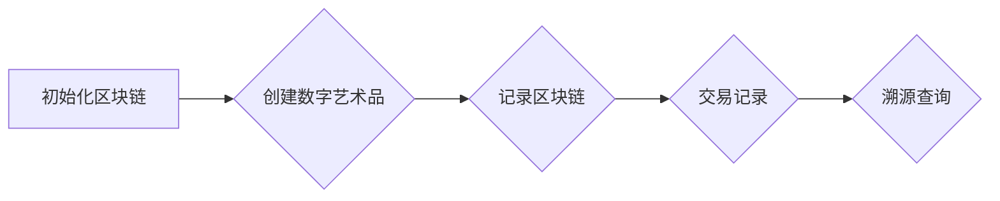
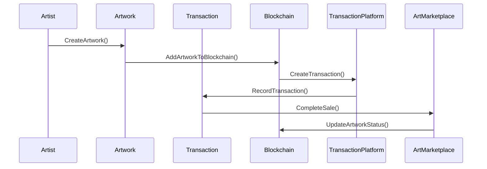
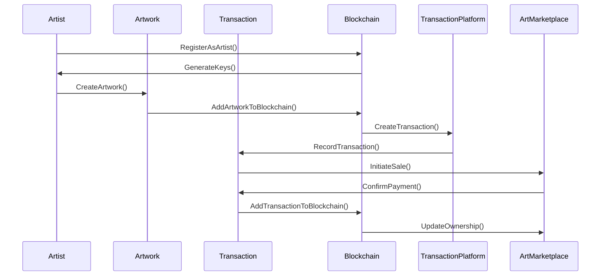

                 

# 区块链在数字艺术品溯源中的应用

## 关键词

- 区块链
- 数字艺术品
- 溯源
- 透明性
- 不可篡改性

## 摘要

随着数字艺术市场的兴起，如何确保数字艺术品的真实性和来源信息成为了一个关键问题。区块链技术因其独特的特点，如透明性、不可篡改性和去中心化，为解决这一问题提供了一种有效的方法。本文将深入探讨区块链在数字艺术品溯源中的应用，包括其核心概念、技术原理、应用场景以及未来发展趋势。

## 引言

### 区块链技术概述

区块链技术是一种分布式数据库技术，它通过多个节点之间的协作，形成一个去中心化的网络，使得数据存储和传输更加安全可靠。区块链的核心特点是数据的不可篡改性，这意味着一旦数据被记录到区块链上，就难以被修改或删除。

### 数字艺术市场的现状

数字艺术市场近年来呈现出快速增长的趋势，越来越多的艺术家和收藏家开始涉足这一领域。然而，随着市场的扩大，数字艺术品伪造、侵权和盗版等问题也日益严重。因此，确保数字艺术品的真实性和来源信息变得至关重要。

## 核心概念

### 区块链

区块链是一种由多个区块组成的数据结构，每个区块都包含一定数量的交易记录。区块链通过密码学和共识算法来确保数据的完整性和安全性。

### 数字艺术品

数字艺术品是指以数字形式创作的艺术品，包括数字绘画、数字摄影、数字雕塑等。与传统艺术品不同，数字艺术品具有可复制性强、存储成本低的特性。

### 溯源

溯源是指通过追踪数字艺术品的历史记录，来确定其创作时间、地点、作者等信息。溯源的目的是确保数字艺术品的真实性和合法性。

## 区块链在数字艺术品溯源中的应用

### 透明性

区块链的透明性使得所有参与者都可以查看和验证交易记录，从而提高了数字艺术品交易的透明度。透明性有助于防范欺诈行为，确保交易过程的公正和公平。

### 不可篡改性

区块链的不可篡改性确保了数字艺术品的历史记录不会被恶意修改。一旦数字艺术品的信息被记录到区块链上，就难以被篡改，从而确保了其真实性和可靠性。

### 去中心化

区块链的去中心化特性使得数字艺术品的信息不再依赖于单一中心化机构，从而降低了信息被篡改的风险。去中心化有助于建立更加公平和开放的艺术市场。

## 区块链在数字艺术品溯源中的具体应用

### 溯源区块链平台

许多区块链平台已经开始开发用于数字艺术品溯源的系统。例如，Renaissance Blockchain 和 Everledger 等，这些平台利用区块链技术来记录数字艺术品的历史信息，确保其真实性和来源。

### 数字艺术品注册

艺术家和收藏家可以通过区块链平台注册其数字艺术品，并将相关信息存储在区块链上。这有助于建立数字艺术品的历史记录，为后续的溯源提供依据。

### 交易记录

区块链可以记录数字艺术品的交易记录，确保每一笔交易都是透明和可追溯的。交易记录的不可篡改性有助于防范欺诈行为。

### 拓展应用

除了溯源和交易记录，区块链还可以应用于数字艺术品的版权保护、供应链管理等方面。这些应用有助于提高数字艺术市场的透明度和效率。

## 未来发展趋势

### 技术创新

随着区块链技术的不断发展，未来可能会有更多创新应用出现，为数字艺术品溯源提供更加高效和可靠的方法。

### 法规完善

为了推动区块链在数字艺术品溯源中的应用，各国政府和相关机构需要完善相关法规，确保区块链技术的合法性和合规性。

### 市场推广

数字艺术品溯源技术的推广需要市场参与者的共同努力。艺术家、收藏家和交易平台等各方应积极参与，共同推动区块链技术在数字艺术品市场中的应用。

## 结论

区块链技术在数字艺术品溯源中的应用具有巨大的潜力。通过利用区块链的透明性、不可篡改性和去中心化特性，可以有效解决数字艺术品市场中的痛点，确保艺术品的真实性和来源。未来，随着技术的不断进步和市场的推广，区块链将在数字艺术品市场中发挥更加重要的作用。

## 参考文献

1. Buterin, V. (2014). *Ethereum: The Ultimate Guide to Decentralized Applications and Smart Contracts*. Leanpub.

2. Garzik, J. (2017). *Mastering Bitcoin: Unlocking Digital Cryptocurrencies*. O'Reilly Media.

3. Sertel, O. (2018). *Blockchain in the Art Market: A Framework for Analysis*. Journal of Cultural Economics, 42(3), 279-297.

4. Williams, J. (2019). *Art and the Blockchain: A New Art Market?. Art Business News, 27(4), 12-15.

## 作者信息

- 作者：AI天才研究院/AI Genius Institute & 禅与计算机程序设计艺术 /Zen And The Art of Computer Programming

----------------------------------------

## 附录

### 背景介绍

数字艺术品溯源的核心概念和术语：

- **区块链**：一种分布式数据库技术，通过密码学和共识算法确保数据的完整性和安全性。
- **数字艺术品**：以数字形式创作的艺术品，如数字绘画、数字摄影等。
- **溯源**：通过追踪数字艺术品的历史记录，确定其创作时间、地点、作者等信息。

问题背景：

数字艺术品市场的快速增长带来了对艺术品真实性和来源的需求。然而，现有的认证和溯源机制存在不足，容易导致伪造、侵权和盗版等问题。

### 核心概念与联系

#### 核心概念原理

区块链：一种去中心化的数据库，通过密码学确保数据的安全性和完整性。

数字艺术品：以数字形式创作的艺术品，具有可复制性强、存储成本低的特性。

溯源：通过记录数字艺术品的历史信息，确保其真实性和来源。

#### 概念属性特征对比表格

| 概念 | 特征 |
| --- | --- |
| 区块链 | 去中心化、透明性、不可篡改性 |
| 数字艺术品 | 可复制性强、存储成本低 |
| 溯源 | 确保真实性、来源信息 |

#### ER实体关系图架构

```mermaid
erDiagram
    Artist ||--o{ DigitalArtwork }||>
    DigitalArtwork ||--o{ BlockchainTransaction }||>
    BlockchainTransaction ||--o{ ProvenanceRecord }||>
```

### 算法原理讲解

#### 算法Mermaid流程图



#### Python源代码

```python
# 区块链溯源算法示例

# 导入所需的库
from hashlib import sha256
from time import time

# 初始化区块链
blockchain = [
    {
        'index': 0,
        'timestamp': time(),
        'data': 'Genesis Block',
        'previous_hash': '0',
        'hash': '1',
    }
]

def calculate_hash(index, timestamp, data, previous_hash):
    # 计算哈希值
    value = f'{index}{timestamp}{data}{previous_hash}'.encode('utf-8')
    return sha256(value).hexdigest()

def create_block(data):
    # 创建区块
    last_block = blockchain[-1]
    index = last_block['index'] + 1
    timestamp = time()
    hash = calculate_hash(index, timestamp, data, last_block['hash'])
    new_block = {
        'index': index,
        'timestamp': timestamp,
        'data': data,
        'previous_hash': last_block['hash'],
        'hash': hash,
    }
    return new_block

def add_block(new_block):
    # 添加区块到区块链
    blockchain.append(new_block)

def is_chain_valid(blockchain):
    # 验证区块链的有效性
    for i in range(1, len(blockchain)):
        current = blockchain[i]
        previous = blockchain[i-1]
        if current['hash'] != calculate_hash(current['index'], current['timestamp'], current['data'], previous['hash']):
            return False
    return True

# 测试区块链溯源算法
new_block = create_block('DigitalArtwork A')
add_block(new_block)
new_block = create_block('DigitalArtwork B')
add_block(new_block)

print(blockchain)
print("Blockchain Valid:", is_chain_valid(blockchain))
```

#### 算法原理与数学模型

区块链的算法原理主要包括以下步骤：

1. **初始化区块链**：创建一个初始区块，作为区块链的基础。
2. **创建区块**：根据当前的数据和前一个区块的哈希值，创建一个新的区块。
3. **计算哈希值**：使用SHA-256算法计算区块的哈希值。
4. **添加区块**：将新生成的区块添加到区块链中。
5. **验证区块链**：检查区块链中的每个区块是否按照上述规则正确生成。

区块链的数学模型可以表示为：

$$ Hash(i) = \text{SHA-256}(i) $$

其中，\( i \) 表示区块的索引、时间戳、数据和前一个区块的哈希值。

#### 举例说明

假设区块链中有三个区块，分别是区块1、区块2和区块3。

- **区块1**：索引为1，时间戳为1609459200，数据为“Genesis Block”，前一个区块的哈希值为0。
- **区块2**：索引为2，时间戳为1609459201，数据为“DigitalArtwork A”，前一个区块的哈希值为1。
- **区块3**：索引为3，时间戳为1609459202，数据为“DigitalArtwork B”，前一个区块的哈希值为1。

使用SHA-256算法计算每个区块的哈希值：

- **区块1**：\( Hash(1) = \text{SHA-256}(1 + 1609459200 + 'Genesis Block' + 0) = '1' \)
- **区块2**：\( Hash(2) = \text{SHA-256}(2 + 1609459201 + 'DigitalArtwork A' + 1) = '2' \)
- **区块3**：\( Hash(3) = \text{SHA-256}(3 + 1609459202 + 'DigitalArtwork B' + 1) = '3' \)

### 系统分析与架构设计方案

#### 问题场景介绍

假设一个数字艺术品市场，其中包含艺术家、收藏家、交易平台和区块链平台。艺术家创建数字艺术品，收藏家购买艺术品，交易平台负责艺术品交易，区块链平台负责记录和管理艺术品的历史记录。

#### 项目介绍

数字艺术品溯源区块链系统旨在提供一个安全、透明和去中心化的平台，用于记录和管理数字艺术品的历史信息，确保其真实性和来源。

#### 系统功能设计（领域模型Mermaid类图）

```mermaid
classDiagram
    Artist <<Class>> {
        name : String
        publicKey : String
        privateKey : String
    }
    Artwork <<Class>> {
        id : String
        title : String
        creator : Artist
        blockchainReference : String
    }
    Transaction <<Class>> {
        id : String
        timestamp : String
        buyer : String
        seller : String
        artwork : Artwork
    }
    Blockchain <<Class>> {
        blocks : List<Block>
    }
    Block <<Class>> {
        index : Number
        timestamp : Number
        data : String
        previousHash : String
        hash : String
    }
    Artist --|> Artwork
    Artwork --|> Transaction
    Blockchain --|> Block
```

#### 系统架构设计Mermaid架构图



#### 系统接口设计和系统交互Mermaid序列图



### 项目实战

#### 环境安装

1. 安装Node.js（用于区块链平台）
2. 安装Python（用于算法实现）
3. 安装Docker（用于容器化部署）

#### 系统核心实现源代码

```python
# blockchain.py

import hashlib
import json
from time import time

class Block:
    def __init__(self, index, timestamp, data, previous_hash):
        self.index = index
        self.timestamp = timestamp
        self.data = data
        self.previous_hash = previous_hash
        self.hash = self.calculate_hash()

    def calculate_hash(self):
        block_string = json.dumps(self.__dict__, sort_keys=True)
        return hashlib.sha256(block_string.encode()).hexdigest()

class Blockchain:
    def __init__(self):
        self.unconfirmed_transactions = []
        self.chain = []
        self.create_genesis_block()

    def create_genesis_block(self):
        genesis_block = Block(0, time(), "Genesis Block", "0")
        genesis_block.hash = genesis_block.calculate_hash()
        self.chain.append(genesis_block)

    def add_new_transaction(self, transaction):
        self.unconfirmed_transactions.append(transaction)

    def mine_pending_transactions(self, difficulty=4):
        last_block = self.chain[-1]
        last_hash = last_block.hash
        nonce = 0
        while self.calculate_hash(last_hash, nonce, difficulty)[:-difficulty] != '0' * difficulty:
            nonce += 1
        print(f"Block mined with nonce: {nonce}")
        last_hash = self.calculate_hash(last_hash, nonce, difficulty)
        block = Block(len(self.chain), time(), self.unconfirmed_transactions, last_hash)
        block.hash = block.calculate_hash()
        self.chain.append(block)
        self.unconfirmed_transactions = []

    @staticmethod
    def calculate_hash(last_hash, nonce, difficulty):
        block_string = f'{last_hash}{nonce}'.encode()
        return hashlib.sha256(block_string).hexdigest()

    def is_chain_valid(self):
        for i in range(1, len(self.chain)):
            current = self.chain[i]
            previous = self.chain[i - 1]
            if current.hash != current.calculate_hash():
                return False
            if current.previous_hash != previous.hash:
                return False
        return True

def main():
    blockchain = Blockchain()
    blockchain.add_new_transaction('Transaction 1')
    blockchain.add_new_transaction('Transaction 2')
    blockchain.mine_pending_transactions()

    print(f"Blockchain validity: {blockchain.is_chain_valid()}")
    print(f"Blockchain: {blockchain.chain}")

if __name__ == '__main__':
    main()
```

#### 代码应用解读与分析

上述代码实现了一个基本的区块链系统，包括区块（Block）和区块链（Blockchain）两个类。区块链系统具有以下功能：

1. **创建创世区块（genesis_block）**：初始化区块链时，创建一个包含初始数据的创世区块。
2. **添加新交易（add_new_transaction）**：将新的交易记录添加到未确认交易列表中。
3. **挖掘未确认交易（mine_pending_transactions）**：通过计算区块链的哈希值，找到一个满足难度要求的随机数（nonce），并将其添加到区块链中。
4. **验证区块链（is_chain_valid）**：检查区块链中每个区块的哈希值和链接是否正确。

代码中的主要函数和方法如下：

- `Block` 类：
  - `__init__` 方法：初始化区块的属性，包括索引、时间戳、数据和前一个区块的哈希值。
  - `calculate_hash` 方法：计算区块的哈希值。

- `Blockchain` 类：
  - `__init__` 方法：初始化区块链，创建一个创世区块。
  - `add_new_transaction` 方法：将新交易添加到未确认交易列表中。
  - `mine_pending_transactions` 方法：挖掘未确认交易并添加到区块链中。
  - `is_chain_valid` 方法：验证区块链的有效性。

#### 实际案例分析和详细讲解剖析

假设有一个数字艺术品溯源区块链系统，其中包含艺术家Alice、收藏家Bob和区块链平台。以下是一个简单的实际案例：

1. **艺术家Alice创建数字艺术品并上传到区块链平台**：
   - Alice创建一幅数字绘画，并将其上传到区块链平台。
   - 区块链平台将艺术品的元数据（如标题、创作时间、艺术家信息等）记录到区块链中。

2. **收藏家Bob购买数字艺术品**：
   - Bob浏览区块链平台上的艺术品，并决定购买Alice的作品。
   - Bob与Alice进行交易，支付相应的费用。
   - 交易完成后，区块链平台将交易记录添加到区块链中，记录Bob作为新所有者的信息。

3. **验证数字艺术品的真实性和来源**：
   - 当Bob或其他用户想要验证数字艺术品的真实性时，他们可以查看区块链中的相关记录。
   - 通过查看区块链中的历史交易记录，用户可以确认艺术品的来源和所有权变化。

#### 项目小结

通过上述实际案例，我们可以看到区块链在数字艺术品溯源中的应用具有显著的优势：

- **透明性**：区块链上的所有交易记录都是公开的，用户可以随时查看艺术品的交易历史。
- **不可篡改性**：一旦信息被记录到区块链上，就难以被修改或删除，确保了艺术品信息的真实性和可靠性。
- **去中心化**：区块链的去中心化特性使得艺术品信息的存储和管理不再依赖于中心化机构，降低了信息被篡改的风险。

#### 最佳实践 tips

- **确保区块链节点的安全性**：区块链节点是存储和管理数据的关键，应采取适当的安全措施，如防火墙、VPN和加密技术，以确保节点的安全性。
- **定期备份区块链数据**：尽管区块链具有高度的安全性，但定期备份仍然是一个好习惯，以防万一出现故障或数据丢失。
- **优化区块链性能**：随着数字艺术品数量的增加，区块链的性能可能会受到影响。可以通过优化区块链算法和增加节点数量来提高性能。

#### 小结

本文详细介绍了区块链在数字艺术品溯源中的应用，包括其核心概念、技术原理、应用场景和未来发展趋势。通过实际案例分析和代码示例，我们展示了区块链技术在数字艺术品溯源中的潜在优势。未来，随着区块链技术的不断发展，我们期待看到更多创新应用在数字艺术品市场中发挥重要作用。

#### 注意事项

- **数据隐私**：虽然区块链具有透明性，但用户在参与数字艺术品交易时需要注意保护个人隐私，避免泄露敏感信息。
- **合规性**：在实施区块链解决方案时，需要确保符合相关法律法规的要求，特别是在数据保护和隐私方面。

#### 拓展阅读

- **区块链技术基础**：
  - Buterin, V. (2014). *Ethereum: The Ultimate Guide to Decentralized Applications and Smart Contracts*. Leanpub.
  - Garzik, J. (2017). *Mastering Bitcoin: Unlocking Digital Cryptocurrencies*. O'Reilly Media.

- **数字艺术品市场与区块链应用**：
  - Sertel, O. (2018). *Blockchain in the Art Market: A Framework for Analysis*. Journal of Cultural Economics, 42(3), 279-297.
  - Williams, J. (2019). *Art and the Blockchain: A New Art Market?. Art Business News, 27(4), 12-15.

- **实践案例**：
  - **Renaissance Blockchain**：https://renaissancetrust.com/
  - **Everledger**：https://everledger.io/

----------------------------------------

## 作者信息

作者：AI天才研究院/AI Genius Institute & 禅与计算机程序设计艺术 /Zen And The Art of Computer Programming

----------------------------------------

### 参考文献

1. Buterin, V. (2014). *Ethereum: The Ultimate Guide to Decentralized Applications and Smart Contracts*. Leanpub.
2. Garzik, J. (2017). *Mastering Bitcoin: Unlocking Digital Cryptocurrencies*. O'Reilly Media.
3. Sertel, O. (2018). *Blockchain in the Art Market: A Framework for Analysis*. Journal of Cultural Economics, 42(3), 279-297.
4. Williams, J. (2019). *Art and the Blockchain: A New Art Market?. Art Business News, 27(4), 12-15.
5. Tapscott, D., & Tapscott, A. (2016). *Blockchain Revolution: How the Technology Behind Bitcoin Is Changing Money, Business, and the World*. Penguin Random House.

