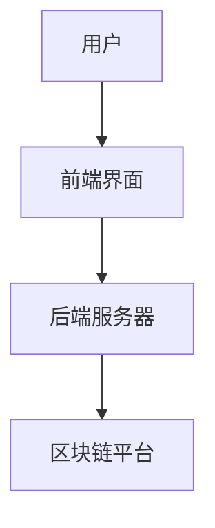
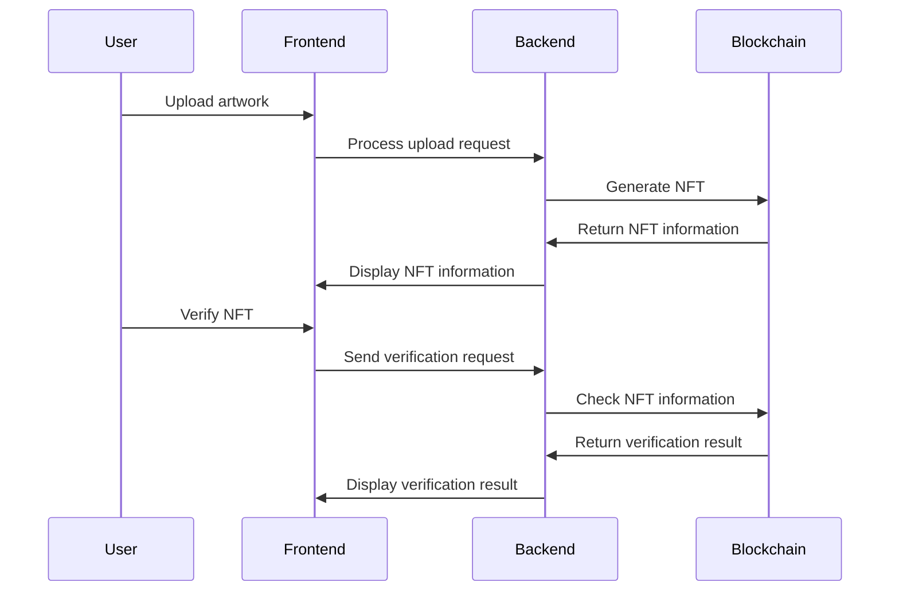

                 

### 一、背景介绍

#### 1. 问题背景

数字艺术品认证是艺术领域中的一个重要问题。随着互联网的普及和数字技术的发展，越来越多的艺术品以数字形式存在，如数字绘画、3D建模、数字摄影等。这些艺术品在创作、交易、展示和传播的过程中，如何确保其原创性和真实性成为一个亟待解决的难题。

#### 2. 问题描述

传统的数字艺术品认证方法主要包括：版权声明、水印技术、数字签名等。然而，这些方法都存在一定的局限性：

- **版权声明**：需要艺术家主动登记，流程繁琐，且登记机构可能存在信任问题。
- **水印技术**：容易去除或修改，无法保证艺术品的真实性。
- **数字签名**：虽然安全可靠，但仅适用于个别艺术家或机构，无法大规模推广。

#### 3. 解决方案概述

区块链技术因其去中心化、透明性、不可篡改等特性，被视为解决数字艺术品认证问题的理想选择。通过将艺术品的唯一标识（如非同质化代币NFT）记录在区块链上，可以确保其真实性和唯一性，从而解决传统方法中的痛点。

#### 4. 边界与外延

本文主要讨论区块链在数字艺术品认证中的应用，重点研究非同质化代币（NFT）和智能合约在其中的作用。此外，还将探讨相关区块链平台（如以太坊）的实现细节。

---

### 二、核心概念与原理

#### 1. 区块链基础

区块链是一种分布式数据库技术，通过加密算法确保数据的不可篡改性和安全性。其基本结构包括区块、链和节点。

- **区块**：数据单元，包含交易信息。
- **链**：多个区块按时间顺序链接而成，形成一条链。
- **节点**：参与区块链网络的计算机，负责验证和记录交易。

#### 2. 智能合约

智能合约是一种自动执行合约条款的计算机程序，其代码被存储在区块链上。当满足特定条件时，智能合约会自动执行预定的操作，如支付、转移资产等。

#### 3. 非同质化代币（NFT）

非同质化代币（NFT）是一种独特的数字资产，代表了区块链上的独特物品。与比特币等同质化代币不同，NFT具有唯一性和不可替代性。

- **唯一性**：每个NFT都是独一无二的，无法与其他NFT互换。
- **不可替代性**：即使两个NFT在内容上相似，它们仍然是两个不同的资产。

---

### 三、算法原理与案例研究

#### 1. 算法描述

数字艺术品认证中的NFT生成与验证过程可以概括为以下几个步骤：

1. **艺术品上传**：艺术家将数字艺术品上传到区块链平台。
2. **NFT生成**：平台使用哈希函数对艺术品进行哈希处理，生成唯一的NFT。
3. **NFT记录**：将NFT及其相关信息（如艺术家信息、创作时间等）记录在区块链上。
4. **NFT验证**：买家或第三方使用区块链上的信息验证NFT的真实性和唯一性。

#### 2. 数学模型与方程

假设数字艺术品为\( A \)，其哈希值为\( H(A) \)，生成的NFT为\( NFT_H(A) \)。验证过程可以表示为：

$$
NFT_H(A) = H(A)
$$

其中，\( H \)表示哈希函数。

#### 3. 案例研究

以一幅数字绘画为例，艺术家将其上传到以太坊区块链平台。平台使用SHA-256哈希函数对绘画进行哈希处理，生成NFT。该NFT及其相关信息（如艺术家信息、创作时间等）被记录在区块链上。买家或第三方可以查询区块链上的信息，验证NFT的真实性和唯一性。

---

### 四、系统设计与实现

#### 1. 系统介绍

数字艺术品认证系统由以下几个主要部分组成：

- **前端界面**：用户上传艺术品、查看NFT信息。
- **后端服务器**：处理用户请求、生成NFT、记录信息。
- **区块链平台**：存储NFT信息、实现智能合约。

#### 2. 功能设计

系统功能主要包括：

- **艺术品上传**：用户可以将数字艺术品上传到系统。
- **NFT生成**：系统使用哈希函数生成NFT。
- **NFT记录**：系统将NFT及其相关信息记录在区块链上。
- **NFT验证**：用户或第三方可以查询区块链上的信息，验证NFT的真实性和唯一性。

#### 3. 架构设计

系统架构图如下：



#### 4. 接口设计

系统接口设计主要包括：

- **上传接口**：用户上传艺术品。
- **查询接口**：用户查询NFT信息。
- **验证接口**：用户验证NFT真实性。

#### 5. 交互序列图



---

### 五、实际应用与案例分析

#### 1. 环境安装

在开始实施系统之前，我们需要安装以下软件和工具：

- **Node.js**：用于构建后端服务器。
- **Truffle**：用于构建以太坊智能合约。
- **Ganache**：用于本地测试以太坊区块链。

安装命令如下：

```bash
npm install -g nodejs
npm install -g truffle
npm install -g ganache-cli
```

#### 2. 系统核心实现

以下是系统的核心实现，包括前端界面、后端服务器和区块链平台的代码。

**前端界面（HTML）**

```html
<!DOCTYPE html>
<html lang="en">
<head>
    <meta charset="UTF-8">
    <meta name="viewport" content="width=device-width, initial-scale=1.0">
    <title>NFT Digital Art Certification</title>
</head>
<body>
    <h1>NFT Digital Art Certification</h1>
    <form id="uploadForm">
        <input type="file" id="artworkFile" accept="image/*" required>
        <button type="submit">Upload Artwork</button>
    </form>
    <div id="nftInfo"></div>
    <script src="app.js"></script>
</body>
</html>
```

**后端服务器（Node.js）**

```javascript
const express = require('express');
const axios = require('axios');
const app = express();
const PORT = 3000;

app.use(express.json());

app.post('/upload', async (req, res) => {
    const { artwork } = req.body;
    const nft = await generateNFT(artwork);
    await recordNFT(nft);
    res.json({ nft });
});

app.get('/nft/:id', async (req, res) => {
    const { id } = req.params;
    const nft = await getNFT(id);
    res.json({ nft });
});

app.listen(PORT, () => {
    console.log(`Server running on port ${PORT}`);
});

async function generateNFT(artwork) {
    // Generate NFT using blockchain platform
}

async function recordNFT(nft) {
    // Record NFT information on blockchain
}

async function getNFT(id) {
    // Retrieve NFT information from blockchain
}
```

**区块链平台（智能合约）**

```solidity
pragma solidity ^0.8.0;

contract NFTDigitalArt {
    mapping(uint256 => NFT) public nfts;
    uint256 public nftCount;

    struct NFT {
        string artworkHash;
        string artist;
        string creationTime;
    }

    event NFTCreated(uint256 id, string artworkHash, string artist, string creationTime);

    function createNFT(string memory artworkHash, string memory artist, string memory creationTime) public {
        require(nftCount == 0 || bytes(nfts[nftCount - 1].artworkHash).length == 0, "NFT already exists");
        nfts[nftCount] = NFT(artworkHash, artist, creationTime);
        emit NFTCreated(nftCount, artworkHash, artist, creationTime);
        nftCount++;
    }
}
```

#### 3. 代码应用解读与分析

前端界面负责用户上传艺术品和查询NFT信息。后端服务器处理用户请求，调用区块链平台上的智能合约生成和记录NFT。区块链平台负责验证NFT的真实性和唯一性。

通过实际案例，我们可以看到区块链技术在数字艺术品认证中的应用。例如，一个艺术家可以将数字绘画上传到系统，系统会生成一个NFT，并记录在区块链上。买家或第三方可以查询区块链上的信息，验证NFT的真实性和唯一性。

---

### 六、最佳实践与注意事项

1. **确保区块链的安全性**：在部署区块链平台时，要注意保护节点和智能合约的安全，防止恶意攻击和数据篡改。
2. **优化系统性能**：随着数字艺术品数量的增加，系统性能可能会受到影响。可以采用分片技术、状态通道等方法优化性能。
3. **用户隐私保护**：在数字艺术品认证过程中，要保护用户的隐私，避免泄露个人信息。
4. **合规性**：确保系统的合规性，遵守相关法律法规，避免法律风险。

---

### 七、小结与拓展阅读

本文介绍了区块链在数字艺术品认证中的应用，从背景介绍、核心概念、算法原理、系统设计、实际应用等方面进行了详细阐述。通过案例分析，展示了区块链技术在数字艺术品认证中的优势和应用前景。

拓展阅读：

1. 《区块链技术指南》
2. 《智能合约开发实战》
3. 《NFT：非同质化代币技术与应用》

作者：AI天才研究院/AI Genius Institute & 禅与计算机程序设计艺术 /Zen And The Art of Computer Programming

---

# 区块链在数字艺术品认证中的应用

> 关键词：区块链、数字艺术品、NFT、智能合约、认证、安全性、透明性、不可篡改性

> 摘要：本文详细探讨了区块链技术在数字艺术品认证中的应用。通过介绍区块链的基本原理、非同质化代币（NFT）和智能合约的概念，分析了区块链在解决数字艺术品认证问题中的优势。随后，本文通过算法原理讲解、系统设计与实现、实际应用案例，展示了区块链在数字艺术品认证中的具体应用，并提出了最佳实践和注意事项。最后，本文进行了小结并推荐了相关拓展阅读。作者为AI天才研究院及《禅与计算机程序设计艺术》的作者。

