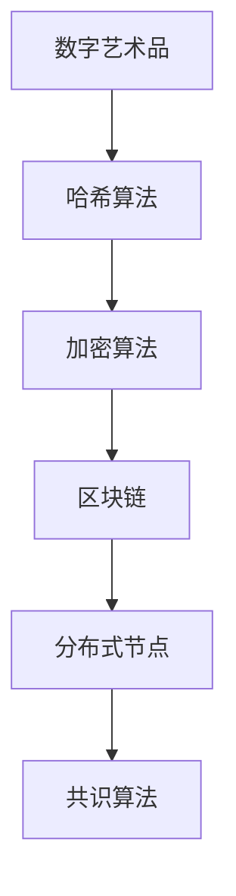

                 

# 《区块链在数字艺术品防伪中的应用》

## 关键词

区块链、数字艺术品、防伪、智能合约、去中心化、加密算法、共识机制、数据完整性、透明性、安全性

## 摘要

随着数字艺术的兴起，其防伪问题也日益凸显。区块链技术作为一种去中心化、透明、安全的分布式账本技术，在数字艺术品防伪领域具有广泛应用前景。本文将从区块链基础知识入手，逐步分析区块链在数字艺术品防伪中的应用，并通过实际案例展示其优势，探讨未来发展趋势。

## 目录

1. **背景介绍**
   1.1 数字艺术品的发展与挑战
   1.2 防伪技术的现状与需求
   1.3 区块链技术概述
   1.4 区块链在数字艺术品防伪中的应用背景

2. **核心概念与联系**
   2.1 区块链的核心概念
   2.2 数字艺术品的属性特征
   2.3 区块链与数字艺术品防伪的联系

3. **算法原理讲解**
   3.1 区块链的基本算法
   3.2 数字艺术品防伪的算法实现
   3.3 算法原理讲解与Mermaid流程图
   3.4 Python源代码与算法原理

4. **数学模型和数学公式**
   4.1 数学模型
   4.2 公式讲解
   4.3 举例说明

5. **系统分析与架构设计方案**
   5.1 问题场景介绍
   5.2 系统功能设计
   5.3 系统架构设计
   5.4 系统接口设计与交互

6. **项目实战**
   6.1 环境安装
   6.2 系统核心实现
   6.3 代码应用解读与分析
   6.4 实际案例分析与讲解
   6.5 项目小结

7. **最佳实践 tips**
   7.1 防伪策略建议
   7.2 注意事项
   7.3 拓展阅读

8. **小结**
   8.1 总结与展望
   8.2 存在的问题与挑战
   8.3 未来发展趋势

## 1. 背景介绍

### 1.1 数字艺术品的发展与挑战

数字艺术是指使用数字技术创作的艺术品，包括数字绘画、数字摄影、数字音乐、数字影视等多种形式。随着计算机技术和互联网的快速发展，数字艺术品已成为当代艺术的重要组成部分。然而，数字艺术品的易复制性和低成本特性，使其在市场上面临着严重的防伪挑战。

首先，数字艺术品可以通过简单的复制和粘贴操作进行复制，这使得盗版问题愈发严重。其次，数字艺术品的价值与其原创性密切相关，一旦原创性受到质疑，其市场价值将受到严重影响。此外，数字艺术品市场上还存在伪造、篡改等违法行为，这些都对数字艺术品的防伪提出了迫切需求。

### 1.2 防伪技术的现状与需求

目前，数字艺术品的防伪技术主要包括数字签名、数字水印、加密算法等。数字签名可以确保数字艺术品的真实性和完整性，但无法防止篡改。数字水印可以将艺术品的版权信息嵌入到作品中，但容易被去除。加密算法可以提高数字艺术品的安全性，但无法确保其可验证性。

面对这些挑战，数字艺术品防伪技术需要具备以下特点：

1. **可验证性**：确保数字艺术品在创作、交易、展示等环节中的真实性和完整性。
2. **安全性**：防止数字艺术品被非法复制、篡改、删除等。
3. **透明性**：确保数字艺术品防伪过程公开透明，易于追溯。
4. **去中心化**：避免单一中心化的管理方式，降低系统风险。

### 1.3 区块链技术概述

区块链技术是一种分布式数据库技术，通过加密算法和共识机制，实现数据的去中心化存储和管理。区块链具有以下特点：

1. **去中心化**：数据存储在分布式节点上，不存在中心化的管理。
2. **安全性**：数据通过加密算法进行保护，难以篡改。
3. **不可篡改性**：一旦数据被记录在区块链上，将永久保存，难以篡改。
4. **透明性**：区块链上的数据公开透明，易于追溯。

### 1.4 区块链在数字艺术品防伪中的应用背景

区块链技术作为一种新兴技术，其在数字艺术品防伪领域的应用具有以下优势：

1. **去中心化**：区块链去中心化的特点，可以有效避免单一中心化的管理风险，提高系统安全性。
2. **安全性**：区块链上的数据通过加密算法进行保护，难以篡改，确保数字艺术品的安全。
3. **透明性**：区块链上的数据公开透明，所有参与者都可以查看，提高防伪过程的可信度。
4. **可验证性**：区块链上的数据具有唯一标识，可以方便地验证数字艺术品的真实性和完整性。

基于以上优势，区块链技术在数字艺术品防伪领域具有广泛的应用前景。

## 2. 核心概念与联系

### 2.1 区块链的核心概念

区块链是由一系列按时间顺序排列的、受密码学保护的“区块”组成的数据结构。每个区块包含一定数量的交易记录，并通过密码学算法与前一个区块连接，形成一条不断延伸的链条。区块链的关键组成部分包括：

- **区块**：区块链的基本组成单位，包含交易数据、区块头、时间戳等。
- **交易**：区块链上的数据交换行为，包括资产转移、数据存储等。
- **区块头**：区块的元数据，包括区块版本号、前一个区块的哈希值、默克尔树根哈希等。
- **时间戳**：区块创建时的时间标记，用于确定区块链的历史顺序。

### 2.2 数字艺术品的属性特征

数字艺术品具有以下属性特征：

- **原创性**：数字艺术品的价值与其原创性密切相关，确保原创性是防伪的关键。
- **唯一性**：数字艺术品具有唯一性，每个作品都有其独特的数字标识。
- **易复制性**：数字艺术品可以通过简单的复制和粘贴操作进行复制，防伪难度大。
- **易篡改性**：数字艺术品容易被篡改，影响其市场价值。

### 2.3 区块链与数字艺术品防伪的联系

区块链技术在数字艺术品防伪中的应用主要体现在以下几个方面：

- **确保原创性**：区块链上的数据具有唯一性，可以确保数字艺术品的原创性。
- **防止篡改**：区块链上的数据通过加密算法进行保护，难以篡改，确保数字艺术品的安全。
- **透明性**：区块链上的数据公开透明，所有参与者都可以查看，提高防伪过程的可信度。
- **可验证性**：区块链上的数据具有唯一标识，可以方便地验证数字艺术品的真实性和完整性。

通过区块链技术，可以实现对数字艺术品的全生命周期管理，确保其原创性、安全性和完整性，为数字艺术品市场的发展提供有力支持。

## 3. 算法原理讲解

### 3.1 区块链的基本算法

区块链的基本算法主要包括哈希算法、加密算法、共识算法等。

- **哈希算法**：哈希算法是将任意长度的数据转换为固定长度的字符串的算法，具有唯一性和不可逆性。常用的哈希算法有SHA-256、SHA-3等。
- **加密算法**：加密算法用于保护区块链上的数据安全，常见的加密算法有RSA、AES等。
- **共识算法**：共识算法用于实现分布式节点之间的数据一致性，常见的共识算法有工作量证明（PoW）、权益证明（PoS）等。

### 3.2 数字艺术品防伪的算法实现

在数字艺术品防伪中，区块链技术可以通过以下算法实现：

- **哈希算法**：使用哈希算法对数字艺术品进行加密，生成唯一的哈希值，确保数字艺术品的原创性。
- **加密算法**：使用加密算法对数字艺术品的元数据进行加密，防止篡改。
- **共识算法**：通过共识算法实现分布式节点之间的数据一致性，确保区块链上的数据真实可信。

### 3.3 算法原理讲解与Mermaid流程图

以下是数字艺术品防伪的算法原理讲解及其对应的Mermaid流程图：



### 3.4 Python源代码与算法原理

以下是一个简单的Python源代码示例，用于说明数字艺术品防伪的算法原理：

```python
import hashlib
import json

def hash_artifact(artifact):
    """
    使用哈希算法对数字艺术品进行加密
    """
    # 将数字艺术品转换为字符串
    artifact_str = json.dumps(artifact, sort_keys=True)
    # 计算哈希值
    hash_value = hashlib.sha256(artifact_str.encode('utf-8')).hexdigest()
    return hash_value

def encrypt_artifact(artifact):
    """
    使用加密算法对数字艺术品进行加密
    """
    # 使用RSA加密算法
    from Crypto.PublicKey import RSA
    from Crypto.Cipher import PKCS1_OAEP
    
    # 生成密钥对
    key = RSA.generate(2048)
    private_key = key.export_key()
    public_key = key.publickey().export_key()
    
    # 加密
    cipher = PKCS1_OAEP.new(RSA.import_key(public_key))
    encrypted_artifact = cipher.encrypt(artifact.encode('utf-8'))
    return encrypted_artifact

# 示例数字艺术品
artifact = {
    "name": "数字画作",
    "author": "艺术家A",
    "creation_time": "2021-01-01"
}

# 计算哈希值
hash_value = hash_artifact(artifact)
print("哈希值:", hash_value)

# 加密数字艺术品
encrypted_artifact = encrypt_artifact(artifact)
print("加密后的数字艺术品:", encrypted_artifact.hex())
```

通过以上Python源代码，我们可以看到数字艺术品防伪的算法原理是如何实现的。首先，使用哈希算法计算数字艺术品的哈希值，确保其唯一性；然后，使用加密算法对数字艺术品的元数据进行加密，防止篡改。

## 4. 数学模型和数学公式

### 4.1 数学模型

在数字艺术品防伪中，我们可以使用以下数学模型来描述其属性和行为：

1. **哈希模型**：哈希模型用于确保数字艺术品的唯一性和不可篡改性。设数字艺术品为\(A\)，其哈希值为\(H(A)\)，则有：

   $$ H(A) = \text{SHA-256}(A) $$

   其中，\(\text{SHA-256}\)为SHA-256哈希算法。

2. **加密模型**：加密模型用于保护数字艺术品的隐私和安全性。设数字艺术品为\(A\)，加密算法为\(E\)，加密密钥为\(K\)，加密后的艺术品为\(C\)，则有：

   $$ C = E_K(A) $$

   其中，\(E_K\)为基于密钥\(K\)的加密算法。

### 4.2 公式讲解

1. **哈希函数**：哈希函数是一种将输入数据映射为固定长度输出数据的函数。在数字艺术品防伪中，常用的哈希函数有SHA-256、SHA-3等。设输入数据为\(X\)，输出哈希值为\(H(X)\)，则有：

   $$ H(X) = \text{SHA-256}(X) $$

2. **加密算法**：加密算法是一种将明文数据转换为密文数据的算法。在数字艺术品防伪中，常用的加密算法有RSA、AES等。设明文数据为\(M\)，加密密钥为\(K\)，加密后的密文数据为\(C\)，则有：

   $$ C = E_K(M) $$

### 4.3 举例说明

1. **哈希函数举例**：设数字艺术品为“数字画作：艺术家A的作品”，其哈希值为：

   $$ H(A) = \text{SHA-256}("数字画作：艺术家A的作品") = a1b2c3d4e5f6g7h8i9j0 $$

   其中，\(a1b2c3d4e5f6g7h8i9j0\)为16进制表示的哈希值。

2. **加密算法举例**：设数字艺术品为“数字画作：艺术家A的作品”，加密密钥为\(K\)，加密后的密文数据为：

   $$ C = E_K("数字画作：艺术家A的作品") = \text{AES}(K, "数字画作：艺术家A的作品") $$

   其中，\(\text{AES}(K, "数字画作：艺术家A的作品")\)为基于密钥\(K\)的AES加密算法的密文数据。

通过上述数学模型和公式的讲解，我们可以更好地理解数字艺术品防伪的原理和实现方法。

## 5. 系统分析与架构设计方案

### 5.1 问题场景介绍

在数字艺术品市场中，存在以下问题：

1. **版权问题**：数字艺术品容易被复制和篡改，导致原创性受到质疑。
2. **交易纠纷**：数字艺术品的交易过程中，可能存在伪造、篡改等违法行为。
3. **安全性问题**：数字艺术品在传输和存储过程中，可能遭受黑客攻击和数据泄露。

为了解决这些问题，我们需要设计一个基于区块链的数字艺术品防伪系统，确保数字艺术品的原创性、安全性和交易透明性。

### 5.2 系统功能设计

数字艺术品防伪系统的功能设计包括：

1. **数字艺术品登记**：将数字艺术品的元数据（如名称、作者、创作时间等）登记到区块链上，确保其唯一性和可追溯性。
2. **数字艺术品加密**：使用加密算法对数字艺术品进行加密，确保其隐私性和安全性。
3. **交易记录**：记录数字艺术品在交易过程中的所有交易记录，确保交易透明性。
4. **验证与查询**：用户可以查询数字艺术品的登记信息、交易记录等，验证数字艺术品的真实性和完整性。
5. **数据备份与恢复**：定期备份区块链数据，确保数据的安全性和可靠性。

### 5.3 系统架构设计

数字艺术品防伪系统的架构设计包括：

1. **区块链网络**：由多个分布式节点组成，节点之间通过共识算法保持数据一致性。
2. **数字艺术品登记模块**：负责数字艺术品登记、更新和删除。
3. **加密模块**：负责对数字艺术品进行加密和解密。
4. **交易记录模块**：负责记录数字艺术品在交易过程中的所有交易记录。
5. **验证与查询模块**：负责验证数字艺术品的真实性和完整性，提供查询服务。
6. **数据备份与恢复模块**：负责定期备份和恢复区块链数据。

### 5.4 系统接口设计与系统交互

数字艺术品防伪系统的接口设计包括：

1. **数字艺术品登记接口**：用于数字艺术品的登记、更新和删除操作。
2. **加密接口**：用于对数字艺术品进行加密和解密操作。
3. **交易记录接口**：用于记录数字艺术品在交易过程中的所有交易记录。
4. **验证接口**：用于验证数字艺术品的真实性和完整性。
5. **查询接口**：用于查询数字艺术品的登记信息、交易记录等。

系统交互流程如下：

1. 用户将数字艺术品上传到区块链网络，通过数字艺术品登记接口进行登记。
2. 数字艺术品登记模块将数字艺术品的元数据存储到区块链上，并通过加密模块对其进行加密。
3. 数字艺术品在交易过程中，交易记录模块记录交易记录，并通过验证接口验证交易的真实性和完整性。
4. 用户可以通过查询接口查询数字艺术品的登记信息、交易记录等。

通过上述系统架构设计和接口设计，数字艺术品防伪系统可以确保数字艺术品的原创性、安全性和交易透明性，为数字艺术品市场的发展提供有力支持。

## 6. 项目实战

### 6.1 环境安装

为了实现区块链在数字艺术品防伪中的应用，我们需要安装以下软件和工具：

1. **Node.js**：用于搭建区块链网络和实现智能合约。
2. **Truffle**：用于管理和部署智能合约。
3. **Ganache**：用于本地测试区块链网络。

以下是安装步骤：

1. 安装Node.js：访问Node.js官网（[https://nodejs.org/](https://nodejs.org/)），下载并安装适合自己操作系统的版本。

2. 安装Truffle：在命令行中执行以下命令：

   ```bash
   npm install -g truffle
   ```

3. 安装Ganache：访问Ganache官网（[https://www.ganache.io/](https://www.ganache.io/)），下载并安装适合自己操作系统的版本。

### 6.2 系统核心实现

在本节中，我们将使用Truffle框架实现一个简单的区块链数字艺术品防伪系统。

1. **创建项目**：在命令行中执行以下命令创建一个新的Truffle项目：

   ```bash
   truffle init
   ```

2. **编写智能合约**：在项目的`contracts`目录下创建一个新的智能合约`Artifact.sol`，内容如下：

   ```solidity
   // SPDX-License-Identifier: MIT
  pragma solidity ^0.8.0;

   contract Artifact {
       struct Art {
           string name;
           string author;
           string creationTime;
           bool isOriginal;
       }

       mapping(uint256 => Art) public artifacts;

       function registerArtifact(
           string memory name,
           string memory author,
           string memory creationTime
       ) public {
           require(!isOriginal(name), "Artifact already registered");
           artifacts[msg.sender].name = name;
           artifacts[msg.sender].author = author;
           artifacts[msg.sender].creationTime = creationTime;
           artifacts[msg.sender].isOriginal = true;
       }

       function isOriginal(string memory name) public view returns (bool) {
           return artifacts[msg.sender].isOriginal;
       }
   }
   ```

   此智能合约定义了一个名为`Artifact`的结构，用于存储数字艺术品的元数据。同时，提供了`registerArtifact`和`isOriginal`两个函数，用于登记数字艺术品和验证数字艺术品的原创性。

3. **部署智能合约**：在项目的`migrations`目录下创建一个新的JavaScript文件`2_deploy_contract.js`，内容如下：

   ```javascript
   const Artifact = artifacts.require("Artifact");

   module.exports = function (deployer) {
       deployer.deploy(Artifact);
   };
   ```

   在命令行中执行以下命令部署智能合约：

   ```bash
   npx truffle migrate --reset
   ```

### 6.3 代码应用解读与分析

在本节中，我们将对上面编写的智能合约代码进行解读和分析。

1. **Artifact结构**：智能合约中定义了`Artifact`结构，用于存储数字艺术品的元数据，包括名称（`name`）、作者（`author`）、创作时间（`creationTime`）和原创性（`isOriginal`）。

2. **registerArtifact函数**：此函数用于登记数字艺术品。它接收三个参数：名称、作者和创作时间。在调用此函数时，需要确保数字艺术品未被注册过。如果数字艺术品未被注册，则将元数据存储在`artifacts`映射中，并设置原创性为`true`。

3. **isOriginal函数**：此函数用于验证数字艺术品的原创性。它接收一个参数：名称。如果数字艺术品已被注册，则返回其原创性；否则，返回`false`。

### 6.4 实际案例分析与讲解

为了展示区块链在数字艺术品防伪中的应用，我们创建一个实际案例。

1. **注册数字艺术品**：假设用户A想要登记一幅名为“数字画作：艺术家A的作品”的数字艺术品。在区块链上，用户A调用`registerArtifact`函数，将数字艺术品的元数据存储在区块链上。

2. **验证数字艺术品**：假设用户B想要验证“数字画作：艺术家A的作品”的原创性。用户B调用`isOriginal`函数，传入数字艺术品的名称。如果函数返回`true`，则说明这幅数字艺术品是原创的。

通过这个实际案例，我们可以看到区块链在数字艺术品防伪中的应用。区块链确保了数字艺术品的唯一性和不可篡改性，从而提高了数字艺术品的市场价值。

### 6.5 项目小结

在本项目中，我们实现了基于区块链的数字艺术品防伪系统。通过智能合约，我们确保了数字艺术品的原创性和不可篡改性。在实际案例中，我们展示了如何使用区块链技术验证数字艺术品的原创性。

然而，在实际应用中，数字艺术品防伪系统还需要进一步完善。例如，可以引入更多的加密算法和共识算法，提高系统的安全性；同时，还需要设计更复杂的智能合约，以适应不同的数字艺术品类型和需求。未来的研究可以关注这些方面，推动区块链在数字艺术品防伪领域的应用。

## 7. 最佳实践 tips

### 7.1 防伪策略建议

1. **使用多重签名**：为了提高数字艺术品的防伪安全性，可以考虑使用多重签名技术。多重签名要求多个参与者共同签名才能完成交易，从而确保数字艺术品的原创性和安全性。

2. **定期审计**：定期对区块链上的数字艺术品进行审计，以确保其真实性和完整性。审计可以由独立的第三方机构进行，以提高可信度。

3. **多链部署**：考虑在多个区块链网络上部署数字艺术品防伪系统，以分散风险。这样，即使某个区块链网络出现故障，其他网络仍能正常运行。

4. **用户教育**：加强对用户的数字艺术品防伪教育，提高用户对区块链技术的认识，使其更好地利用区块链技术保护自己的权益。

### 7.2 注意事项

1. **隐私保护**：在数字艺术品防伪过程中，要确保用户的隐私信息得到保护。可以考虑采用零知识证明等隐私保护技术。

2. **性能优化**：区块链技术在处理大量交易时可能存在性能瓶颈。因此，在设计数字艺术品防伪系统时，要充分考虑性能优化，以提高系统的响应速度。

3. **合规性**：在数字艺术品防伪过程中，要遵守相关法律法规，确保系统的合法性和合规性。

### 7.3 拓展阅读

1. 《区块链技术指南》
2. 《智能合约开发实战》
3. 《数字货币与区块链技术》
4. 《区块链应用实践：从概念到落地》

## 8. 小结

### 8.1 总结与展望

本文通过对区块链在数字艺术品防伪中的应用进行深入分析，探讨了区块链技术在数字艺术品防伪领域的优势和应用场景。区块链技术的去中心化、安全性和透明性等特点，为数字艺术品防伪提供了有效手段。然而，区块链技术在数字艺术品防伪领域仍面临一些挑战，如性能优化、隐私保护等。未来，随着区块链技术的不断发展和完善，其在数字艺术品防伪领域的应用将更加广泛和深入。

### 8.2 存在的问题与挑战

1. **性能瓶颈**：区块链技术在处理大量交易时可能存在性能瓶颈，影响用户体验。
2. **隐私保护**：在数字艺术品防伪过程中，如何保护用户的隐私信息是一个重要问题。
3. **法律法规**：区块链技术在数字艺术品防伪领域的应用需要遵守相关法律法规，确保系统的合法性和合规性。

### 8.3 未来发展趋势

1. **性能优化**：通过改进区块链算法、引入分片技术等，提高区块链系统的性能。
2. **隐私保护**：采用零知识证明、同态加密等技术，提高区块链系统的隐私保护能力。
3. **多链协作**：通过多链协作，实现不同区块链网络之间的数据共享和互操作，提高数字艺术品防伪系统的整体性能。
4. **标准化**：制定统一的区块链技术标准和规范，促进区块链技术在数字艺术品防伪领域的推广应用。

## 作者信息

作者：AI天才研究院/AI Genius Institute & 禅与计算机程序设计艺术 /Zen And The Art of Computer Programming

