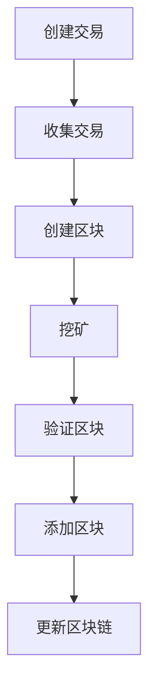
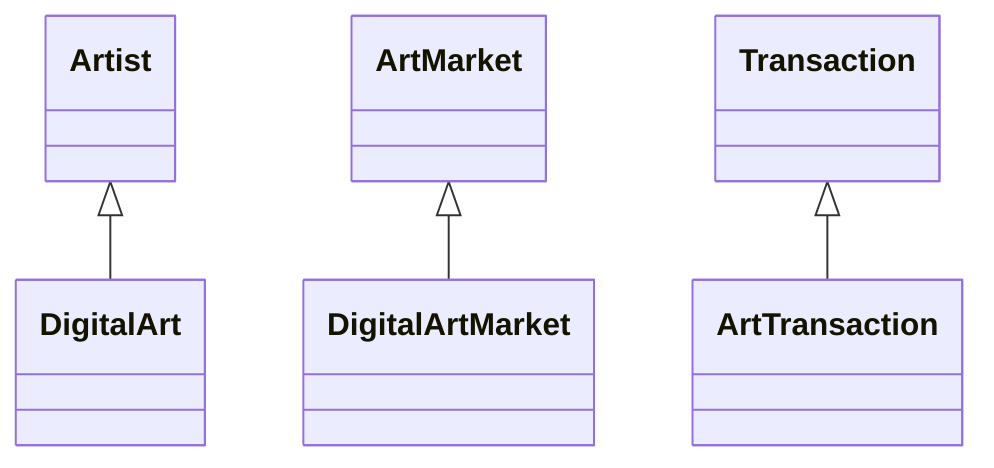

                 

# 《区块链在数字艺术市场中的应用》

## 关键词
区块链，数字艺术市场，非同质化代币（NFT），智能合约，版权保护，交易透明度

## 摘要
本文旨在探讨区块链技术在数字艺术市场中的应用。随着数字艺术市场的快速崛起，传统艺术市场的诸多问题如版权保护、交易透明度和安全性等愈发突出。区块链技术以其去中心化、不可篡改和透明性等特性，为解决这些问题提供了可能。本文将从区块链技术基础、数字艺术市场现状、NFT的应用、区块链在数字艺术认证中的作用、面临的挑战和未来发展趋势等方面，详细分析区块链在数字艺术市场中的潜在应用和价值。

## 引言

### 1.1 研究背景

#### 1.1.1 数字艺术市场的崛起

数字艺术，顾名思义，是指使用数字技术创作的艺术作品。随着互联网和数字技术的快速发展，数字艺术市场逐渐崛起。数字艺术的创作、展示和传播都依赖于计算机技术，这为创作者提供了更多的创作自由和更大的市场空间。从最初的静态图片、动画，到现在的动态视频、虚拟现实和增强现实艺术作品，数字艺术的形式和内容都在不断丰富和拓展。

#### 1.1.2 区块链技术的应用潜力

区块链技术作为一种新兴的分布式数据库技术，以其去中心化、透明性、不可篡改等特性，在多个领域展现出了巨大的应用潜力。特别是在金融领域，区块链技术的应用已经非常广泛，如比特币、以太坊等数字货币。除了金融领域，区块链技术在供应链管理、版权保护、智能合约等方面也有广泛应用。随着数字艺术市场的崛起，区块链技术在数字艺术市场的应用也受到了广泛关注。

### 1.2 研究目的与内容结构

本文的研究目的是探讨区块链技术在数字艺术市场中的应用，分析其面临的挑战和未来发展的趋势。文章结构如下：

- 第1章：区块链技术基础，介绍区块链的基本概念、原理和应用。
- 第2章：数字艺术市场，分析数字艺术市场的现状、问题和挑战。
- 第3章：NFT的应用，探讨NFT在数字艺术市场中的重要作用。
- 第4章：区块链在数字艺术认证中的作用，分析区块链技术在数字艺术认证中的应用。
- 第5章：面临的挑战，讨论区块链技术在数字艺术市场中面临的挑战。
- 第6章：未来发展趋势，预测区块链技术在数字艺术市场中的未来发展趋势。

## 第1章 区块链技术基础

### 1.1 区块链的起源与发展

#### 1.1.1 区块链的概念

区块链是一种分布式数据库技术，其核心思想是去中心化。在传统的中心化系统中，所有数据都存储在一个中央服务器上，一旦服务器出现问题，整个系统都会瘫痪。而区块链技术通过将数据分散存储在多个节点上，实现了去中心化。每个节点都保存着完整的区块链数据，任何一条数据只有在所有节点上都得到确认后才能被添加到区块链上。

#### 1.1.2 区块链的工作原理

区块链的工作原理可以概括为以下步骤：

1. **交易**：当一个用户向另一个用户转账时，会生成一个交易。
2. **区块**：交易被多个节点收集起来，形成一个区块。
3. **挖矿**：节点通过计算生成一个新的区块，这个过程称为挖矿。
4. **共识机制**：其他节点验证新产生的区块是否有效，如果验证通过，新区块就会被添加到区块链上。
5. **分布式存储**：每个节点都保存着完整的区块链数据。

### 1.2 区块链的核心原理

#### 1.2.1 哈希函数

哈希函数是一种将任意长度的输入数据映射为固定长度的输出数据的函数。区块链技术中的哈希函数用于确保数据的唯一性和不可篡改性。例如，在比特币中，每个交易都会生成一个唯一的哈希值，这个哈希值就是交易的身份标识。

#### 1.2.2 加密技术

加密技术用于确保区块链数据的隐私性和安全性。在区块链中，每个交易都使用公钥和私钥进行加密。公钥可以公开，私钥只有用户本人知道。通过这种方式，用户可以确保自己的交易不会被未经授权的人看到。

#### 1.2.3 分布式账本技术

分布式账本技术是区块链技术的核心。它通过将数据分散存储在多个节点上，实现了去中心化。每个节点都保存着完整的区块链数据，确保了数据的可靠性和安全性。

### 1.3 区块链技术的应用领域

区块链技术在多个领域都有广泛应用，以下是其中几个主要的领域：

#### 1.3.1 金融市场

区块链技术在金融市场中的应用最为广泛，如比特币、以太坊等数字货币。区块链技术为金融市场提供了去中心化的交易平台，降低了交易成本，提高了交易效率。

#### 1.3.2 物流与供应链

区块链技术可以用于跟踪和验证商品的真实性，确保供应链的透明性和安全性。例如，沃尔玛和IBM合作开发的区块链平台“IBM Food Trust”就用于跟踪食品供应链。

#### 1.3.3 数字艺术市场

区块链技术在数字艺术市场中的应用主要体现在版权保护和交易透明度上。通过区块链技术，数字艺术作品的版权信息可以永久记录和验证，确保了版权的归属和交易的透明度。

## 第2章 数字艺术市场

### 2.1 数字艺术市场的概述

#### 2.1.1 数字艺术的定义

数字艺术是指使用数字技术创作的艺术作品，包括静态图片、动画、视频、虚拟现实和增强现实等。与传统艺术相比，数字艺术具有更高的创作自由度和更广阔的表现形式。

#### 2.1.2 数字艺术市场的特点

数字艺术市场具有以下几个特点：

1. **多样性**：数字艺术的形式和内容非常丰富，满足了不同受众的需求。
2. **全球化**：数字艺术市场的参与者来自世界各地，市场具有全球化特征。
3. **去中心化**：数字艺术市场的交易和传播不依赖于中心化的平台，具有去中心化特征。
4. **互动性**：数字艺术作品可以通过互联网与观众进行互动，增强了观众的参与感。

### 2.2 数字艺术市场的问题与挑战

尽管数字艺术市场具有很多优势，但同时也面临一些问题与挑战：

#### 2.2.1 版权保护

数字艺术作品的版权保护是一个重要问题。由于数字艺术的复制和传播非常容易，艺术家的版权很难得到有效保护。

#### 2.2.2 交易透明度

在传统的数字艺术市场中，交易的透明度较低，交易的中间环节较多，增加了交易的成本和风险。

#### 2.2.3 安全性问题

数字艺术市场的安全性问题主要体现在数据安全和交易安全上。由于区块链技术的应用，这些问题有望得到缓解。

### 2.3 区块链技术在数字艺术市场中的应用前景

区块链技术在数字艺术市场中的应用前景非常广阔：

#### 2.3.1 提高交易透明度

区块链技术的应用可以确保交易的透明度，减少交易的中间环节，降低交易的成本和风险。

#### 2.3.2 实现版权保护

通过区块链技术，数字艺术作品的版权信息可以永久记录和验证，确保了版权的归属和交易的透明度。

#### 2.3.3 降低交易成本

区块链技术的应用可以降低数字艺术市场的交易成本，提高市场的效率。

## 第3章 智能合约与数字艺术

### 3.1 智能合约的定义与原理

智能合约是一种运行在区块链上的程序，它能够在满足特定条件时自动执行预定的合约条款。智能合约的出现，使得数字艺术市场的交易更加高效和透明。

#### 3.1.1 智能合约的定义

智能合约是一种计算机程序，它在满足特定条件时自动执行预定的合约条款。智能合约的关键特性是自动化和不可篡改性。这意味着一旦合约条件满足，合约条款将自动执行，而不需要人工干预。

#### 3.1.2 智能合约的原理

智能合约的原理主要基于区块链技术。在区块链上，每个智能合约都有一份对应的代码，这份代码会被分布式存储在所有节点上。当满足特定的触发条件时，智能合约将自动执行。

### 3.2 智能合约在数字艺术市场的应用

智能合约在数字艺术市场的应用非常广泛，以下是一些典型的应用场景：

#### 3.2.1 艺术品买卖

在数字艺术市场中，智能合约可以用于艺术品买卖。艺术家可以通过智能合约将艺术品出售给买家，一旦买家支付了艺术品的价款，智能合约将自动转移艺术品的所有权。

#### 3.2.2 艺术品租赁

智能合约还可以用于艺术品租赁。艺术家可以通过智能合约将艺术品出租给租赁者，租赁者支付租金后，智能合约将自动允许租赁者访问和使用艺术品。

#### 3.2.3 艺术品分润

智能合约还可以用于艺术品分润。例如，当一件数字艺术品被转售时，智能合约可以根据预先设定的比例自动将分润分配给艺术家和平台。

### 3.3 智能合约的优势与挑战

#### 3.3.1 智能合约的优势

智能合约在数字艺术市场中有以下优势：

1. **提高交易效率**：智能合约可以自动执行合约条款，减少人工干预，提高交易效率。
2. **提高交易透明度**：智能合约的执行过程是透明的，所有参与者都可以查看和验证。
3. **降低交易成本**：智能合约可以降低交易的成本，减少交易的中介环节。

#### 3.3.2 智能合约的挑战

尽管智能合约在数字艺术市场中有很大的应用潜力，但也面临一些挑战：

1. **技术门槛**：智能合约的开发和部署需要一定的技术门槛，这对非技术人员来说可能是一个挑战。
2. **安全性问题**：智能合约的安全性是一个重要问题，一旦智能合约出现问题，可能会导致严重的经济损失。
3. **法律问题**：智能合约的法律地位和适用性在一些国家可能还没有明确规定，这可能会影响智能合约的普及和应用。

## 第4章 NFTs（非同质化代币）在数字艺术市场中的应用

### 4.1 NFTs的基本概念

NFTs，即非同质化代币，是一种基于区块链技术的数字资产，它代表了一件独特的数字艺术品的所有权和唯一性。与同质化代币（如比特币、以太坊等）不同，NFTs具有独特性和不可替代性，每个NFT都是独一无二的。

#### 4.1.1 NFTs的定义

NFTs（Non-Fungible Tokens）是一种数字资产，它代表了数字艺术品或其他实体资产的所有权和唯一性。与比特币、以太坊等同质化代币不同，NFTs是不可替代的，每个NFT都有其独特的属性和价值。

#### 4.1.2 NFTs的特性

NFTs具有以下几个特性：

1. **唯一性**：每个NFT都是独一无二的，不可替代。
2. **稀缺性**：由于NFTs的唯一性，它们通常具有稀缺性，这增加了其价值。
3. **不可篡改性**：NFTs的所有权和转移都是不可篡改的，确保了数字艺术品的真实性和合法性。
4. **可验证性**：NFTs的所有权和属性可以通过区块链技术进行验证，确保了数字艺术品的透明度和可信度。

### 4.2 NFTs在数字艺术市场中的应用

NFTs在数字艺术市场中的应用非常广泛，以下是一些典型的应用场景：

#### 4.2.1 艺术品认证与所有权转移

NFTs可以用于艺术品的认证和所有权转移。艺术家可以通过将艺术品作为NFT发行，确保艺术品的真实性和唯一性。当艺术品被转让时，NFT也随之一同转移，确保了艺术品的合法所有权。

#### 4.2.2 艺术品交易

NFTs可以用于艺术品的交易。艺术家可以通过将艺术品作为NFT发行，并在市场上进行交易。NFT的交易过程是透明的，所有交易记录都记录在区块链上，确保了交易的合法性和公正性。

#### 4.2.3 艺术品授权与分润

NFTs可以用于艺术品的授权和分润。艺术家可以通过将艺术品作为NFT发行，并将部分所有权出售给其他人。当艺术品被转售时，NFT的所有者可以根据预先设定的比例获得分润。

### 4.3 NFTs的优势与挑战

#### 4.3.1 NFTs的优势

NFTs在数字艺术市场中有以下优势：

1. **版权保护**：NFTs可以确保数字艺术品的版权，防止侵权和盗版。
2. **透明性**：NFTs的所有权和交易记录都是透明的，确保了交易的公正性和可追溯性。
3. **独特性**：NFTs的独一无二增加了数字艺术品的价值。
4. **流动性**：NFTs可以方便地在线上进行交易，提高了市场的流动性。

#### 4.3.2 NFTs的挑战

尽管NFTs在数字艺术市场中有很大的应用潜力，但也面临一些挑战：

1. **技术门槛**：NFTs的开发和交易需要一定的技术知识，这可能会阻碍非技术人员的使用。
2. **安全性问题**：NFTs的安全性是一个重要问题，一旦发生安全漏洞，可能会导致严重的经济损失。
3. **法律问题**：NFTs的法律地位和适用性在一些国家可能还没有明确规定，这可能会影响NFTs的普及和应用。

## 第5章 区块链在数字艺术认证中的作用

### 5.1 区块链在数字艺术认证中的重要性

区块链技术在数字艺术认证中具有重要作用。数字艺术作品的认证是一个复杂的过程，涉及到艺术品的真伪、版权、所有权等多个方面。区块链技术以其去中心化、透明性和不可篡改等特性，为数字艺术认证提供了一种可靠的方式。

#### 5.1.1 区块链的不可篡改性

区块链技术的一个重要特性是数据的不可篡改性。在区块链上，一旦数据被记录，就无法被修改或删除。这意味着数字艺术作品的认证信息可以永久记录在区块链上，确保了艺术品的真实性和合法性。

#### 5.1.2 区块链的透明性

区块链技术的另一个重要特性是透明性。在区块链上，所有交易记录和认证信息都是公开透明的，任何人都可以查看和验证。这意味着数字艺术作品的认证过程和交易记录都是公开透明的，增加了市场的透明度和可信度。

### 5.2 区块链在数字艺术认证中的应用

区块链技术在数字艺术认证中的应用非常广泛，以下是一些典型的应用场景：

#### 5.2.1 艺术品真伪认证

区块链技术可以用于艺术品真伪认证。艺术家可以通过将艺术品作为NFT发行，并在区块链上记录艺术品的详细信息，如创作时间、创作材料、创作者身份等。这些信息一旦被记录在区块链上，就难以被篡改，确保了艺术品的真伪。

#### 5.2.2 艺术品版权认证

区块链技术可以用于艺术品版权认证。艺术家可以通过将艺术品的版权信息作为NFT发行，并在区块链上记录版权的归属和授权信息。这些信息一旦被记录在区块链上，就难以被篡改，确保了艺术品的版权归属。

#### 5.2.3 艺术品所有权认证

区块链技术可以用于艺术品所有权认证。当艺术品进行交易时，可以通过区块链记录交易的所有权转移信息。这些信息一旦被记录在区块链上，就难以被篡改，确保了艺术品的所有权转移的合法性和透明性。

### 5.3 区块链在数字艺术认证中的优势与挑战

#### 5.3.1 区块链在数字艺术认证中的优势

区块链技术在数字艺术认证中有以下优势：

1. **提高认证效率**：区块链技术的应用可以简化艺术品的认证过程，提高认证效率。
2. **确保真实性**：区块链技术的不可篡改性和透明性确保了艺术品认证的真实性和可信度。
3. **降低认证成本**：区块链技术的应用可以降低艺术品认证的成本，减少人工干预。

#### 5.3.2 区块链在数字艺术认证中的挑战

尽管区块链技术在数字艺术认证中有很大的应用潜力，但也面临一些挑战：

1. **技术门槛**：区块链技术的应用需要一定的技术知识，这可能会阻碍非技术人员的使用。
2. **安全性问题**：区块链技术的安全性是一个重要问题，一旦发生安全漏洞，可能会导致严重的经济损失。
3. **法律问题**：区块链技术的法律地位和适用性在一些国家可能还没有明确规定，这可能会影响其普及和应用。

## 第6章 面临的挑战与未来发展趋势

### 6.1 面临的挑战

尽管区块链技术在数字艺术市场中的应用前景广阔，但也面临一些挑战：

#### 6.1.1 技术门槛

区块链技术的应用需要一定的技术知识，这可能会阻碍非技术人员的使用。对于非技术人员来说，理解和使用区块链技术可能存在一定的困难。

#### 6.1.2 安全性问题

区块链技术的安全性是一个重要问题。一旦发生安全漏洞，可能会导致严重的经济损失。虽然区块链技术本身具有较高的安全性，但仍然需要不断改进和完善。

#### 6.1.3 法律问题

区块链技术的法律地位和适用性在一些国家可能还没有明确规定，这可能会影响其普及和应用。法律问题涉及到区块链技术的知识产权、交易合规性等多个方面。

### 6.2 未来发展趋势

未来，区块链技术在数字艺术市场中的应用有望继续发展，以下是一些可能的发展趋势：

#### 6.2.1 技术创新

随着区块链技术的不断发展，新的区块链平台和协议将不断涌现，为数字艺术市场提供更多的应用场景和解决方案。

#### 6.2.2 政策支持

随着区块链技术的普及和应用，各国政府可能会出台相关的政策和法规，为区块链技术在数字艺术市场中的应用提供支持。

#### 6.2.3 市场推广

随着区块链技术的普及，更多的数字艺术家和平台将开始采用区块链技术，推动数字艺术市场的发展。

## 总结

区块链技术在数字艺术市场中的应用具有重要意义。它不仅为数字艺术市场的交易、认证和版权保护提供了新的解决方案，也为数字艺术家和投资者提供了新的机会。然而，区块链技术在数字艺术市场中的应用也面临一些挑战，如技术门槛、安全性和法律问题等。未来，随着区块链技术的不断发展和完善，相信其在数字艺术市场中的应用将会更加广泛和深入。对于数字艺术家和投资者来说，了解和掌握区块链技术，将有助于他们在数字艺术市场中取得更大的成功。

## 参考文献

1. Nakamoto, S. (2008). Bitcoin: A peer-to-peer electronic cash system. https://bitcoin.org/bitcoin.pdf
2. Buterin, V. (2014). Ethereum: A next-generation smart contract and decentralized application platform. https://ethereum.org/en/whitepaper/
3. Kim, D., & Song, J. (2018). On the feasibility of non-fungible tokens. https://arxiv.org/abs/1806.0722
4. Microsoft. (2021). Understanding blockchain. https://learn.microsoft.com/en-us/azure/blockchain/service-understanding-blockchain
5. Cornell University. (2021). Digital art market report. https://digitalartmarket.com/research-report/

## 附录

### 附录A：区块链技术流程图



### 附录B：数字艺术市场类图



### 附录C：智能合约Python代码示例

```python
# 智能合约：艺术品买卖

# 引入Web3.py库
from web3 import Web3

# 连接以太坊节点
w3 = Web3(Web3.HTTPProvider('https://mainnet.infura.io/v3/your_project_id'))

# 定义智能合约接口
contract_address = Web3.toChecksumAddress('your_contract_address')
contract_abi = [...]  # 智能合约ABI
contract = w3.eth.contract(address=contract_address, abi=contract_abi)

# 创建买卖交易
def create_sell_order(art_id, price):
    # 构建交易数据
    tx_data = contract.functions.createSellOrder(art_id, price).buildTransaction({
        'chainId': 1,
        'gas': 2000000,
        'gasPrice': w3.toWei('50', 'gwei'),
        'nonce': w3.eth.getTransactionCount(contract_address)
    })
    
    # 签名交易
    signed_tx = w3.eth.account.sign_transaction(tx_data, private_key='your_private_key')
    
    # 发送交易
    tx_hash = w3.eth.sendRawTransaction(signed_tx.rawTransaction)
    receipt = w3.eth.waitForTransactionReceipt(tx_hash)
    
    return receipt

# 购买艺术品
def buy_art(art_id, buyer_address):
    # 构建交易数据
    tx_data = contract.functions.buyArt(art_id, buyer_address).buildTransaction({
        'chainId': 1,
        'gas': 2000000,
        'gasPrice': w3.toWei('50', 'gwei'),
        'nonce': w3.eth.getTransactionCount(w3.eth.coinbase)
    })
    
    # 签名交易
    signed_tx = w3.eth.account.sign_transaction(tx_data, private_key='your_buyer_private_key')
    
    # 发送交易
    tx_hash = w3.eth.sendRawTransaction(signed_tx.rawTransaction)
    receipt = w3.eth.waitForTransactionReceipt(tx_hash)
    
    return receipt
```

### 附录D：区块链在数字艺术认证中应用的实际案例

#### 案例一：CryptoKitties

CryptoKitties是一个基于以太坊区块链的数字宠物游戏。玩家可以通过购买、繁殖和交易NFT来收集和交易数字猫咪。CryptoKitties的成功证明了NFT在数字艺术市场中的应用潜力。

#### 案例二：OpenSea

OpenSea是一个基于以太坊区块链的数字艺术品市场。艺术家可以将自己的数字艺术品作为NFT发行并在OpenSea上销售。OpenSea提供了透明、安全的交易环境，促进了数字艺术市场的发展。

#### 案例三：Rarible

Rarible是一个基于以太坊区块链的数字艺术品和收藏品市场。与OpenSea类似，Rarible也允许艺术家将数字艺术品作为NFT发行和销售。Rarible还引入了创作者奖励机制，鼓励艺术家创作更多优质的作品。

### 附录E：最佳实践与注意事项

- **确保安全性**：在区块链应用中，安全性是至关重要的。在部署智能合约之前，应进行充分的测试和审核，确保其安全性。
- **遵循法律要求**：在区块链应用中，应遵循相关的法律法规，确保其合法性和合规性。
- **提高透明度**：在区块链应用中，应提高交易的透明度，确保所有参与者都能查看和验证交易记录。
- **降低成本**：在区块链应用中，应降低交易成本，提高市场的效率和竞争力。
- **注重用户体验**：在区块链应用中，应注重用户体验，提供简单易用的界面和操作流程，降低用户的学习成本。

## 结语

区块链技术在数字艺术市场中的应用前景广阔，它为数字艺术市场的交易、认证和版权保护提供了新的解决方案。然而，区块链技术在数字艺术市场中的应用也面临一些挑战，如技术门槛、安全性和法律问题等。未来，随着区块链技术的不断发展和完善，相信其在数字艺术市场中的应用将会更加广泛和深入。对于数字艺术家和投资者来说，了解和掌握区块链技术，将有助于他们在数字艺术市场中取得更大的成功。

### 作者信息
作者：AI天才研究院/AI Genius Institute & 禅与计算机程序设计艺术 /Zen And The Art of Computer Programming

