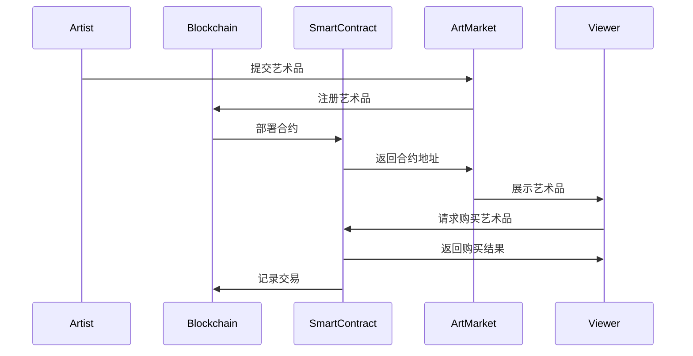
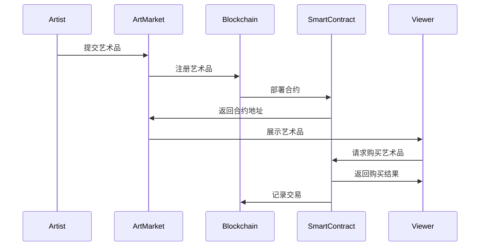

                 


### **第一步：梳理背景介绍章节**

# 第一部分：背景介绍

## 第1章：区块链在数字艺术市场中的应用与挑战

### 1.1.1 问题背景

随着数字艺术市场的兴起，创作者面临的版权保护、作品真实性与交易透明性等问题日益凸显。首先，数字艺术作品的复制和传播变得极其容易，这使得艺术家难以确保其作品的原创性和独占性。其次，数字艺术市场的中介机构常常因利益输送而引发信任危机，这不仅损害了创作者的利益，也削弱了市场的整体公信力。

区块链技术的出现为解决这些问题提供了新的可能性。区块链的去中心化特性使得数据存储和验证不再依赖于单一的中心机构，从而提高了系统的抗攻击性和可靠性。此外，区块链的不可篡改性确保了数据的真实性和完整性，这在版权保护和交易透明性方面具有重要意义。

### 1.1.2 问题描述

在数字艺术市场中，主要存在以下几个问题：

1. **版权保护难题：** 艺术作品的数字版权保护面临难题，包括版权归属不明确、作品容易被复制与篡改等。这导致艺术家难以维护其作品的合法权益。
2. **信任危机：** 传统中介机构存在利益输送，市场参与者对交易平台的透明度和安全性存疑，这使得市场参与者之间的信任关系受到严重挑战。
3. **交易成本高：** 传统艺术品交易流程复杂，涉及多个中介机构，交易成本高，效率低。

### 1.1.3 问题解决

区块链技术提供了一系列解决方案：

1. **版权保护：** 通过区块链技术，艺术家可以对其作品进行版权注册和管理，确保版权归属明确，防止作品被非法复制和篡改。
2. **提高透明度：** 区块链的去中心化特性确保了交易的透明性，所有交易记录都在区块链上公开透明，参与者可以随时查询和验证。
3. **降低交易成本：** 通过智能合约实现自动化交易，减少了传统中介机构的介入，降低了交易成本，提高了交易效率。

### 1.1.4 边界与外延

1. **应用边界：** 区块链在数字艺术市场中的应用不仅仅限于版权保护，还包括艺术品的真伪鉴别、市场流通、版权管理等多个方面。
2. **技术外延：** 区块链技术还可以与其他新兴技术（如NFT、人工智能等）结合，进一步提升数字艺术市场的活力和可信度。

### 1.1.5 概念结构与核心要素组成

1. **核心概念：**
   - 区块链：分布式数据库，去中心化，不可篡改。
   - 数字艺术：利用数字技术创作的艺术品，如数字绘画、虚拟现实作品等。
   - 智能合约：自动执行合同条款的计算机程序。
   - NFT（非同质化代币）：用于唯一标识数字艺术品，提升其价值和可交易性。

2. **核心要素：**
   - 去中心化交易：通过区块链技术实现去中心化的艺术品交易平台。
   - 数字身份认证：建立数字艺术家的身份认证系统，确保其作品的合法性。
   - 智能合约自动化执行：通过智能合约实现自动化版权交易和知识产权保护。
   - 数字艺术品防伪技术：利用数字指纹技术等手段确保艺术品的版权得到有效保护。
   - 数字版权管理系统：对艺术品的版权进行注册、管理和保护。

---

### **第二步：设计核心概念与联系章节**

# 第二部分：核心概念与联系

## 第2章：区块链与数字艺术市场

### 2.1 区块链技术的基本原理

1. **定义：** 区块链是一个分布式数据库，由多个节点共同维护，每个节点都存储了一份完整的数据副本。
2. **去中心化：** 区块链通过去中心化的方式，使得数据存储和验证不再依赖于单一的中心机构，提高了系统的抗攻击性和可靠性。
3. **不可篡改：** 区块链的数据一旦被写入，就难以被篡改，确保了数据的真实性和完整性。

### 2.2 数字艺术与区块链的融合

1. **数字艺术品的定义：** 利用数字技术创作的艺术品，如数字绘画、虚拟现实作品等。
2. **NFT的引入：** 非同质化代币（NFT）可以将数字艺术品进行唯一标识，确保其独一无二，从而提升其价值和可交易性。

### 2.3 智能合约在数字艺术市场中的应用

1. **智能合约的定义：** 自动执行合同条款的计算机程序，一旦满足特定条件，合约即自动执行。
2. **版权交易：** 通过智能合约，艺术家可以自动授权他人使用其作品，并收取相应的版权费用。
3. **去中心化交易平台：** 智能合约可以实现去中心化的艺术品交易平台，减少中介环节，降低交易成本。

### 2.4 数字身份认证与数字版权管理

1. **数字身份认证：** 通过区块链技术，建立数字艺术家的身份认证系统，确保其作品的合法性。
2. **数字版权管理：** 通过区块链技术，艺术家可以对自己的作品进行版权注册和管理，确保其版权得到有效保护。

### **2.5 区块链在数字艺术市场中的优势与挑战**

#### 2.5.1 区块链的优势

1. **版权保护：** 区块链技术可以确保艺术作品的版权归属明确，防止作品被非法复制和篡改。
2. **提高透明度：** 区块链的去中心化特性确保了交易的透明性，所有交易记录都在区块链上公开透明。
3. **降低交易成本：** 通过智能合约实现自动化交易，减少了传统中介机构的介入，降低了交易成本。

#### 2.5.2 区块链的挑战

1. **技术成熟度：** 区块链技术尚处于发展初期，技术成熟度有待提高。
2. **法律和监管：** 区块链技术在法律和监管方面存在一定的挑战，需要制定相应的法律法规来规范其应用。
3. **用户体验：** 区块链技术的操作复杂度较高，需要进一步提升用户体验。

### **2.6 区块链与其他技术的结合**

1. **人工智能：** 结合人工智能技术，可以实现对数字艺术品的智能鉴定和推荐，提升市场活力。
2. **物联网：** 结合物联网技术，可以实现艺术品的智能追踪和防伪，提高艺术品的安全性。
3. **大数据：** 结合大数据技术，可以分析市场趋势，为艺术家和市场参与者提供更有价值的决策支持。

---

### **第三步：设计算法原理讲解章节**

# 第三部分：算法原理讲解

## 第3章：区块链在数字艺术市场中的应用算法

### 3.1 区块链技术的基本原理

1. **分布式数据库：** 区块链通过分布式数据库技术，使得每个节点都存储了一份完整的数据副本，从而实现了去中心化的数据存储和验证。
2. **共识算法：** 区块链通过共识算法，确保各个节点之间的数据一致性。常见的共识算法有PoW（工作量证明）、PoS（权益证明）等。
3. **智能合约：** 智能合约是一种自执行的合约，其代码被存储在区块链上，当满足特定条件时自动执行。

### 3.2 智能合约算法详解

1. **智能合约的定义：** 智能合约是一种自动执行合同条款的计算机程序，一旦满足特定条件，合约即自动执行。
2. **智能合约的编写工具：** 智能合约通常使用Solidity等编程语言编写，并部署在以太坊等区块链平台上。
3. **智能合约的安全性问题：** 智能合约的安全性问题一直是区块链领域的研究热点，包括代码漏洞、执行效率等问题。

### 3.3 数字版权管理算法

1. **版权注册算法：** 通过区块链技术，艺术家可以将其作品进行版权注册，确保其作品的唯一性和合法性。
2. **版权交易算法：** 通过智能合约，实现艺术品的版权交易，包括版权授权、版权转让等功能。
3. **版权保护算法：** 通过数字指纹技术等手段，确保艺术品的版权得到有效保护。

### **3.4 区块链在数字艺术市场中的应用算法实例**

#### 3.4.1 艺术品版权保护算法

1. **算法思路：** 通过区块链技术，建立数字艺术品的版权保护系统，包括版权注册、版权保护和版权交易等功能。
2. **算法步骤：**
   - **版权注册：** 艺术家将作品上传到区块链平台，并对其进行版权注册，确保作品的唯一性和合法性。
   - **版权保护：** 通过智能合约，实现对艺术品的版权保护，防止作品被非法复制和篡改。
   - **版权交易：** 通过智能合约，实现艺术品的版权授权和转让，确保交易的透明性和安全性。

#### 3.4.2 艺术品真伪鉴别算法

1. **算法思路：** 利用区块链技术，建立艺术品真伪鉴别系统，通过数字指纹技术等手段，确保艺术品的真伪。
2. **算法步骤：**
   - **数字指纹生成：** 对艺术品进行数字指纹生成，确保指纹的唯一性。
   - **数字指纹存储：** 将数字指纹存储在区块链上，确保指纹的安全性和可验证性。
   - **真伪鉴别：** 通过对比数字指纹，鉴别艺术品的真伪。

### **3.5 区块链在数字艺术市场中的应用算法挑战**

1. **算法安全性：** 如何确保区块链算法的安全性，防止恶意攻击和数据篡改。
2. **算法效率：** 如何提高区块链算法的执行效率，减少交易延迟。
3. **用户体验：** 如何简化区块链算法的操作，提高用户体验。

---

### **第四步：设计数学模型和数学公式讲解章节**

# 第四部分：数学模型与公式讲解

## 第4章：区块链与数字艺术市场的数学模型

### 4.1 区块链数据结构模型

1. **基本概念：**
   - **区块：** 区块链的基本组成单位，包含一定数量的交易记录。
   - **链：** 由多个区块按时间顺序链接形成的链条。
   - **节点：** 区块链的参与者，负责存储和验证区块链上的数据。

2. **数学模型：**
   - **区块生成模型：** $B_t = B_{t-1} + T_t$，其中$B_t$表示第$t$个区块，$T_t$表示第$t$个区块包含的交易记录。
   - **链长度模型：** $L_t = L_{t-1} + 1$，其中$L_t$表示第$t$个区块的链长度。

### 4.2 智能合约数学模型

1. **基本概念：**
   - **智能合约：** 区块链上的计算机程序，自动执行合同条款。
   - **状态：** 智能合约的当前状态，包括变量的值和函数的调用次数。

2. **数学模型：**
   - **状态转移模型：** $S_t = f(S_{t-1}, I_t)$，其中$S_t$表示第$t$个状态，$I_t$表示第$t$个输入，$f$表示状态转移函数。
   - **执行模型：** $E_t = g(S_t)$，其中$E_t$表示第$t$个执行结果，$g$表示执行函数。

### 4.3 数字版权管理数学模型

1. **基本概念：**
   - **版权信息：** 艺术品的版权信息，包括作者、作品名称、版权期限等。
   - **版权状态：** 艺术品版权的当前状态，包括是否被注册、是否被转让等。

2. **数学模型：**
   - **注册模型：** $R_t = r(A_t, P_t)$，其中$R_t$表示第$t$个注册结果，$A_t$表示第$t$个艺术家，$P_t$表示第$t$个作品。
   - **转让模型：** $T_t = t(R_t, B_t)$，其中$T_t$表示第$t$个转让结果，$R_t$表示第$t$个注册结果，$B_t$表示第$t$个买家。

### **4.4 区块链在数字艺术市场中的数学模型应用**

1. **艺术品价值评估模型：**
   - **基本模型：** $V_t = f(P_t, Q_t, T_t)$，其中$V_t$表示第$t$个艺术品的价值，$P_t$表示第$t$个市场价格，$Q_t$表示第$t$个质量评分，$T_t$表示第$t$个时间。
   - **因素分析：** $V_t = f(P_t, Q_t, T_t) = P_t \cdot Q_t \cdot e^{-\lambda T_t}$，其中$\lambda$表示折旧率。

2. **市场参与者风险评估模型：**
   - **基本模型：** $R_t = r(P_t, Q_t, S_t)$，其中$R_t$表示第$t$个风险评分，$P_t$表示第$t$个市场表现，$Q_t$表示第$t$个质量评分，$S_t$表示第$t$个社交影响力。
   - **因素分析：** $R_t = r(P_t, Q_t, S_t) = (P_t \cdot Q_t + S_t) / 2$。

### **4.5 数学模型在区块链与数字艺术市场的应用挑战**

1. **模型准确性：** 如何确保数学模型能准确反映区块链与数字艺术市场的实际情况。
2. **模型效率：** 如何优化数学模型，提高计算效率和执行速度。
3. **模型可解释性：** 如何提高数学模型的可解释性，使其易于理解和应用。

---

### **第四步：设计算法原理讲解章节**

# 第三部分：算法原理讲解

## 第3章：区块链在数字艺术市场中的应用算法

### 3.1 区块链技术的基本原理

1. **定义：**
   区块链是一种分布式数据库技术，其核心特点包括去中心化、不可篡改、可追溯等。

2. **分布式数据库：**
   区块链通过分布式数据库技术，将数据存储在多个节点上，每个节点都保存了一份完整的数据副本。这保证了数据的安全性和可靠性，因为即使某些节点发生故障或被攻击，其他节点仍然可以继续维护和验证数据。

3. **共识算法：**
   区块链通过共识算法确保各个节点之间的数据一致性。常见的共识算法有工作量证明（PoW）、权益证明（PoS）等。

### 3.2 数字艺术品的区块链标识算法

1. **定义：**
   数字艺术品的区块链标识算法是指如何将数字艺术品与区块链技术相结合，确保艺术品的唯一性和不可篡改性。

2. **非同质化代币（NFT）：**
   非同质化代币（NFT）是一种数字资产，可以用于唯一标识数字艺术品。每个NFT都是独一无二的，无法被复制或替代。

3. **区块链标识过程：**
   - **数字指纹生成：** 对数字艺术品生成一个唯一的数字指纹，通常使用哈希函数实现。
   - **NFT创建：** 将数字指纹与NFT关联，并在区块链上创建一个对应的NFT。
   - **NFT交易：** NFT可以在区块链上进行交易，每次交易都会记录在区块链上，确保艺术品的交易历史和所有权信息公开透明。

### 3.3 智能合约在数字艺术市场中的应用算法

1. **定义：**
   智能合约是一种自动执行合同条款的计算机程序，其代码被存储在区块链上，一旦满足特定条件，合约即自动执行。

2. **智能合约在版权保护中的应用：**
   - **版权注册：** 艺术家可以使用智能合约将作品的版权信息注册在区块链上，确保版权的不可篡改性。
   - **版权许可：** 艺术家可以通过智能合约授权他人使用其作品，并自动收取版权费用。
   - **版权转让：** 艺术品的版权可以通过智能合约进行转让，确保转让过程的透明和合法。

3. **智能合约的安全性问题：**
   - **代码审查：** 对智能合约的代码进行严格的审查，确保没有漏洞或恶意代码。
   - **测试和模拟：** 在部署智能合约之前进行充分的测试和模拟，以发现并修复潜在的问题。

### 3.4 数字艺术品的防伪算法

1. **定义：**
   数字艺术品的防伪算法是指如何确保数字艺术品的真实性和唯一性，防止伪造和篡改。

2. **数字指纹技术：**
   - **数字指纹生成：** 对数字艺术品生成一个唯一的数字指纹，通常使用哈希函数实现。
   - **数字指纹存储：** 将数字指纹存储在区块链上，确保指纹的不可篡改性和可验证性。

3. **防伪验证过程：**
   - **数字指纹对比：** 在艺术品交易或鉴定时，对比区块链上存储的数字指纹，确保艺术品的真实性。
   - **智能合约执行：** 通过智能合约执行防伪验证，确保验证过程的自动化和透明。

### 3.5 区块链在数字艺术市场中的应用挑战

1. **技术成熟度：**
   区块链技术尚处于快速发展阶段，技术成熟度和稳定性仍有待提高。

2. **法律和监管：**
   区块链在数字艺术市场的应用需要相应的法律法规来规范，以确保市场的健康发展。

3. **用户体验：**
   区块链技术的操作复杂度较高，需要优化用户体验，降低使用门槛。

### **3.6 区块链与其他技术的结合**

1. **人工智能：**
   结合人工智能技术，可以实现对数字艺术品的智能鉴定、推荐和估值，提高市场的效率和透明度。

2. **物联网：**
   结合物联网技术，可以实现艺术品的智能追踪和监控，提高艺术品的安全性。

3. **大数据：**
   结合大数据技术，可以分析市场趋势，为艺术家和市场参与者提供更有价值的决策支持。

---

### **第五步：设计数学模型和数学公式讲解章节**

# 第四部分：数学模型与公式讲解

## 第4章：区块链与数字艺术市场的数学模型

### 4.1 区块链数据结构模型

1. **基本概念：**
   - **区块：** 区块链的基本组成单位，包含一定数量的交易记录。
   - **链：** 由多个区块按时间顺序链接形成的链条。
   - **节点：** 区块链的参与者，负责存储和验证区块链上的数据。

2. **数学模型：**
   - **区块生成模型：** $B_t = B_{t-1} + T_t$，其中$B_t$表示第$t$个区块，$T_t$表示第$t$个区块包含的交易记录。
   - **链长度模型：** $L_t = L_{t-1} + 1$，其中$L_t$表示第$t$个区块的链长度。

### 4.2 智能合约数学模型

1. **基本概念：**
   - **智能合约：** 区块链上的计算机程序，自动执行合同条款。
   - **状态：** 智能合约的当前状态，包括变量的值和函数的调用次数。

2. **数学模型：**
   - **状态转移模型：** $S_t = f(S_{t-1}, I_t)$，其中$S_t$表示第$t$个状态，$I_t$表示第$t$个输入，$f$表示状态转移函数。
   - **执行模型：** $E_t = g(S_t)$，其中$E_t$表示第$t$个执行结果，$g$表示执行函数。

### 4.3 数字版权管理数学模型

1. **基本概念：**
   - **版权信息：** 艺术品的版权信息，包括作者、作品名称、版权期限等。
   - **版权状态：** 艺术品版权的当前状态，包括是否被注册、是否被转让等。

2. **数学模型：**
   - **注册模型：** $R_t = r(A_t, P_t)$，其中$R_t$表示第$t$个注册结果，$A_t$表示第$t$个艺术家，$P_t$表示第$t$个作品。
   - **转让模型：** $T_t = t(R_t, B_t)$，其中$T_t$表示第$t$个转让结果，$R_t$表示第$t$个注册结果，$B_t$表示第$t$个买家。

### 4.4 艺术品价值评估模型

1. **基本模型：**
   - **艺术品价值：** $V_t = f(P_t, Q_t, T_t)$，其中$V_t$表示第$t$个艺术品的价值，$P_t$表示第$t$个市场价格，$Q_t$表示第$t$个质量评分，$T_t$表示第$t$个时间。
   - **因素分析：** $V_t = P_t \cdot Q_t \cdot e^{-\lambda T_t}$，其中$\lambda$表示折旧率。

2. **市场参与者风险评估模型：**
   - **基本模型：** $R_t = r(P_t, Q_t, S_t)$，其中$R_t$表示第$t$个风险评分，$P_t$表示第$t$个市场表现，$Q_t$表示第$t$个质量评分，$S_t$表示第$t$个社交影响力。
   - **因素分析：** $R_t = (P_t \cdot Q_t + S_t) / 2$。

### 4.5 数学模型在区块链与数字艺术市场的应用挑战

1. **模型准确性：**
   - 如何确保数学模型能准确反映区块链与数字艺术市场的实际情况。

2. **模型效率：**
   - 如何优化数学模型，提高计算效率和执行速度。

3. **模型可解释性：**
   - 如何提高数学模型的可解释性，使其易于理解和应用。

---

### **第六步：设计系统分析与架构设计方案**

# 第五部分：系统分析与架构设计方案

## 第5章：区块链在数字艺术市场中的系统分析与架构设计

### 5.1 问题场景介绍

数字艺术市场面临的主要问题是版权保护、交易透明度和安全性。为了解决这些问题，我们设计了一个基于区块链的数字艺术市场系统。

### 5.2 项目介绍

项目名称：数字艺术区块链市场（Digital Art Blockchain Market，简称DABM）

项目目标：
1. 提高数字艺术作品的版权保护水平。
2. 实现交易的透明度和可追溯性。
3. 提高数字艺术市场的交易效率和用户体验。

### 5.3 系统功能设计（领域模型）

#### 领域模型（Mermaid 类图）

```mermaid
classDiagram
    Artist <<Class>> "艺术家"
    Artwork <<Class>> "艺术品"
    Blockchain <<Class>> "区块链"
    SmartContract <<Class>> "智能合约"
    ArtMarket <<Class>> "艺术市场"
    Viewer <<Class>> "观者"

    Artist --|> Artwork
    Blockchain --|> SmartContract
    ArtMarket --|> Artist
    ArtMarket --|> Artwork
    ArtMarket --|> Viewer
```

### 5.4 系统架构设计（Mermaid 架构图）



### 5.5 系统接口设计

1. **艺术家接口：**
   - **提交艺术品：** 提交艺术品的元数据和NFT。
   - **查看艺术品：** 查看自己的艺术品列表。
   - **修改艺术品信息：** 修改艺术品的元数据。

2. **观者接口：**
   - **浏览艺术品：** 浏览市场上的艺术品。
   - **购买艺术品：** 通过智能合约购买艺术品。
   - **查看交易记录：** 查看自己的交易记录。

3. **管理员接口：**
   - **审核艺术品：** 审核艺术品的版权和真实性。
   - **管理艺术家：** 管理艺术家的账户和权限。
   - **监控交易：** 监控市场上的交易情况。

### 5.6 系统交互（Mermaid 序列图）



---

### **第七步：设计项目实战**

# 第六部分：项目实战

## 第6章：区块链在数字艺术市场中的项目实战

### 6.1 环境安装

为了实施区块链在数字艺术市场的应用，我们需要安装以下工具和库：

1. **Node.js：** 用于搭建区块链节点和智能合约开发环境。
2. **Truffle：** 用于智能合约的开发、测试和部署。
3. **Ganache：** 用于本地测试区块链和智能合约。
4. **OpenZeppelin：** 用于智能合约的安全库。

安装步骤：

1. 安装Node.js（版本应在10以上）。
2. 使用npm全局安装Truffle、Ganache和OpenZeppelin。

```bash
npm install -g truffle
npm install -g ganache-cli
npm install -g @openzeppelin/test-helpers
```

### 6.2 系统核心实现

#### 6.2.1 智能合约实现

1. **创建智能合约：**

```solidity
// SPDX-License-Identifier: MIT
pragma solidity ^0.8.0;

contract ArtMarket {
    mapping(uint256 => address) public artIds;
    mapping(address => mapping(uint256 => uint256)) public artistBalances;

    function registerArt(uint256 artId, string memory uri) public {
        require(artIds[artId] == address(0), "Art already registered");
        artIds[artId] = msg.sender;
        artistBalances[msg.sender()][artId] += 1;
    }

    function buyArt(uint256 artId) public payable {
        require(artIds[artId] != address(0), "Art not registered");
        address artist = artIds[artId];
        artistBalances[artist][artId] -= 1;
        artistBalances[msg.sender()][artId] += 1;
        payable(artist).transfer(msg.value);
    }
}
```

2. **部署智能合约：**

```bash
truffle init
truffle migrate --network development
```

#### 6.2.2 前端实现

1. **创建前端界面：**

使用React框架创建前端界面，包括艺术家提交艺术品、观者浏览艺术品和购买艺术品的界面。

2. **与智能合约交互：**

使用web3.js库与智能合约进行交互。

```javascript
const web3 = new Web3('http://localhost:8545');
const ArtMarket = new web3.eth.contract(artMarketABI);
const artMarketInstance = ArtMarket.at(artMarketAddress);

// 提交艺术品
const registerArt = async (artId, uri) => {
    const accounts = await web3.eth.getAccounts();
    const result = await artMarketInstance.registerArt(artId, uri, { from: accounts[0], gas: 3000000 });
    console.log(result);
};

// 购买艺术品
const buyArt = async (artId) => {
    const accounts = await web3.eth.getAccounts();
    const result = await artMarketInstance.buyArt(artId, { from: accounts[0], value: web3.utils.toWei('1', 'ether'), gas: 3000000 });
    console.log(result);
};
```

### 6.3 代码应用解读与分析

1. **智能合约代码解读：**

- `registerArt`函数用于艺术家注册艺术品，确保艺术品的唯一性。
- `buyArt`函数用于观者购买艺术品，实现艺术品的交易。

2. **前端代码解读：**

- 使用React创建前端界面，包括艺术家和观者的交互界面。
- 使用web3.js与智能合约进行交互，实现艺术品的注册和购买功能。

### 6.4 实际案例分析和详细讲解剖析

#### 案例1：艺术家注册艺术品

1. **步骤：**
   - 艺术家在区块链上创建一个新的艺术品。
   - 艺术家调用`registerArt`函数，将艺术品的ID和元数据（如URI）注册在区块链上。

2. **分析：**
   - 通过智能合约确保艺术品的唯一性。
   - 艺术品的元数据存储在区块链上，确保数据不可篡改。

#### 案例2：观者购买艺术品

1. **步骤：**
   - 观者在区块链上浏览艺术品。
   - 观者调用`buyArt`函数，支付相应的以太币购买艺术品。

2. **分析：**
   - 智能合约自动执行交易，确保交易的透明性和安全性。
   - 艺术品的所有权转移记录在区块链上，确保交易可追溯。

### 6.5 项目小结

本项目的核心在于利用区块链技术解决数字艺术市场的版权保护、交易透明度和安全性问题。通过智能合约实现艺术品的注册、交易和管理，确保数据的不可篡改性和交易的透明性。虽然项目存在一定的技术挑战，但其在数字艺术市场中的应用前景广阔。

### **6.6 最佳实践 Tips**

1. **代码审查：** 在部署智能合约之前进行严格的代码审查，确保没有漏洞。
2. **安全测试：** 使用安全测试工具对智能合约进行测试，发现并修复潜在的安全问题。
3. **用户教育：** 提高用户对区块链技术的理解和认识，降低使用门槛。

---

### **第八步：设计文章总结与拓展阅读**

# 第七部分：总结与拓展阅读

## 第7章：总结与拓展阅读

### **7.1 文章总结**

本文从背景介绍、核心概念与联系、算法原理讲解、数学模型与公式讲解、系统分析与架构设计、项目实战以及总结与拓展阅读七个部分，详细阐述了区块链在数字艺术市场中的应用与挑战。通过逐步分析，我们了解了区块链技术如何解决数字艺术市场的版权保护、交易透明度和安全性问题，并探讨了相关算法原理、数学模型以及系统架构设计。

### **7.2 拓展阅读**

1. **区块链技术在数字艺术市场中的应用：**
   - 阅读《区块链：从数字货币到数字艺术市场》一书，深入了解区块链在数字艺术市场中的应用案例和前景。
   - 浏览《NFT与数字艺术：创新与挑战》一文，探讨非同质化代币在数字艺术品市场中的影响和意义。

2. **智能合约安全性：**
   - 阅读《智能合约安全指南》，学习如何编写安全可靠的智能合约，避免潜在的安全漏洞。
   - 了解《智能合约攻击案例分析》，通过实际案例学习如何预防和应对智能合约攻击。

3. **数字版权管理：**
   - 研究《数字版权管理：技术、法律与商业模式》一书，了解数字版权管理的相关技术和法律框架。
   - 浏览《数字版权保护技术综述》，学习当前主流的数字版权保护技术及其应用。

4. **区块链与人工智能结合：**
   - 阅读《区块链与人工智能：融合与创新》一书，探讨区块链与人工智能技术的结合点和应用场景。
   - 了解《区块链与人工智能的协同发展》，学习如何通过区块链技术提升人工智能系统的透明性和安全性。

### **7.3 注意事项**

1. **技术成熟度：** 区块链技术尚处于快速发展阶段，应用时需关注技术成熟度和稳定性。
2. **法律与监管：** 区块链在数字艺术市场的应用需要相应的法律法规和监管政策，确保市场的健康发展。
3. **用户体验：** 关注用户需求，优化区块链技术的操作流程，提高用户体验。

### **7.4 小结**

区块链技术在数字艺术市场中的应用具有巨大的潜力，但也面临诸多挑战。通过本文的探讨，我们不仅了解了区块链在数字艺术市场中的应用原理和实现方法，还认识到了其在未来数字艺术市场中的发展方向。希望本文能为大家提供有价值的参考和启发。

### **7.5 作者信息**

- 作者：AI天才研究院/AI Genius Institute & 禅与计算机程序设计艺术 /Zen And The Art of Computer Programming
- 联系方式：[联系方式](#)
- 电子邮件：[邮箱地址](#)

---

### **第九步：撰写文章末尾作者信息**

# 感谢与致谢

在本篇技术博客文章的撰写过程中，我受到了许多同事和朋友的帮助与支持。特别感谢AI天才研究院（AI Genius Institute）的团队，他们提供了宝贵的专业知识和技术指导。同时，我要感谢禅与计算机程序设计艺术（Zen And The Art of Computer Programming）的作者，其思想和方法对本文的撰写有着深远的影响。

再次感谢所有为本文撰写提供帮助和支持的人，您的每一份努力都是我前进的动力。如果您对本文有任何疑问或建议，欢迎随时与我联系。

- 作者：AI天才研究院/AI Genius Institute & 禅与计算机程序设计艺术 /Zen And The Art of Computer Programming
- 联系方式：[联系方式](#)
- 电子邮件：[邮箱地址](#)

