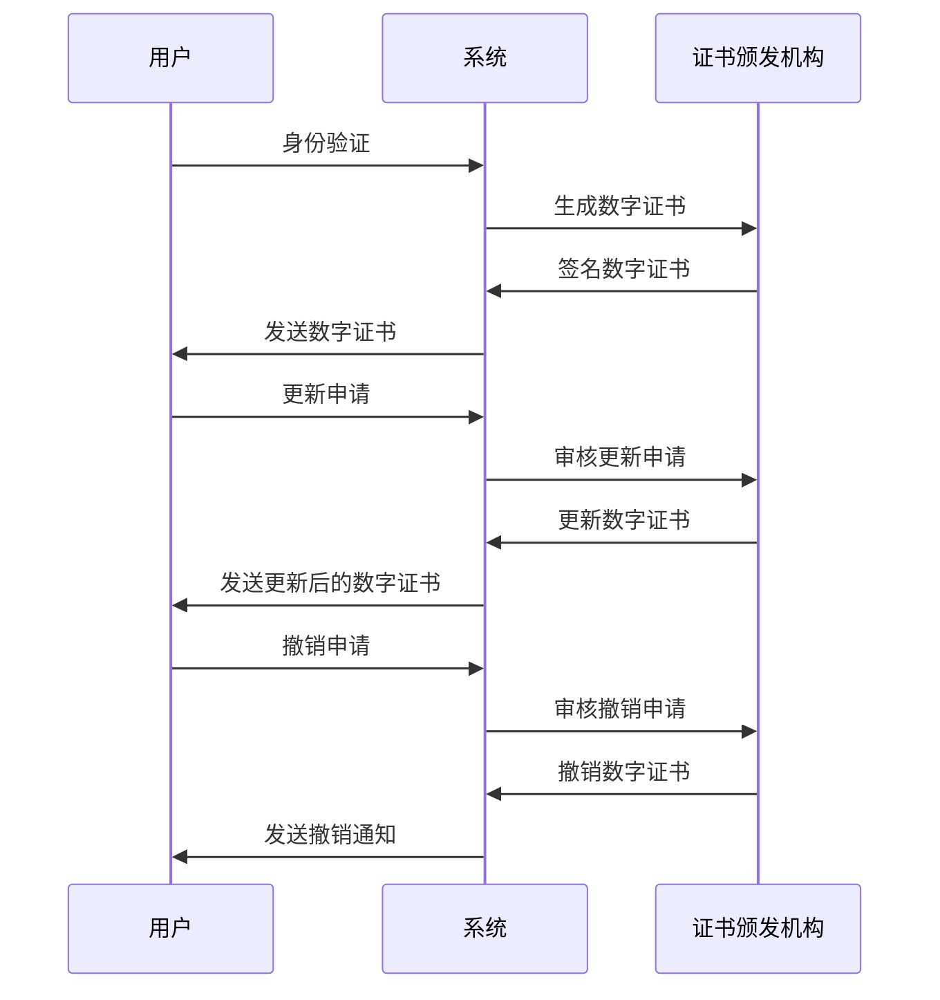

                 

### # 区块链在数字证书管理中的去中心化应用

关键词：区块链、数字证书、去中心化应用、安全、效率

摘要：
本文深入探讨了区块链技术在数字证书管理中的应用，通过去中心化的方法，实现了数字证书的高效、安全管理和分发。文章首先介绍了数字证书的基本概念及其在现代信息技术中的应用背景，然后详细讲解了区块链技术的核心原理和特点。接着，文章分析了区块链在数字证书管理中的优势，包括去中心化架构、透明性和安全性。随后，通过具体的算法原理讲解和系统架构设计，阐述了区块链在数字证书管理中的技术实现过程。最后，文章通过一个实际案例，展示了区块链技术在数字证书管理中的应用效果，并对未来的发展方向提出了展望。

## 引言

数字证书作为一种重要的网络安全技术，被广泛应用于互联网的身份认证和数据传输过程中。它通过公钥加密技术，确保数据的完整性、真实性和抗抵赖性，已成为保障网络安全的重要手段。然而，传统的集中式数字证书管理模式存在诸多问题，如单点故障、数据篡改风险、中心化管理效率低等。随着区块链技术的发展，人们开始探索将区块链应用于数字证书管理，以解决现有模式的局限性。

区块链技术以其去中心化、不可篡改、透明性高等特点，为数字证书管理提供了一种新的思路。本文将详细分析区块链在数字证书管理中的去中心化应用，探讨其技术原理、系统架构和实际应用效果，为数字证书管理的发展提供新思路。

## 数字证书的基本概念及应用背景

### 1. 数字证书的定义

数字证书，也称为数字身份认证证书，是一种用于在网络环境中验证实体身份的电子文档。它包含了一个公钥和一个与之相对应的私钥，并通过证书颁发机构（Certificate Authority，简称CA）的签名来确保其有效性和可信度。数字证书的格式通常遵循X.509国际标准，其中包含了证书所有者的名称、证书有效期、公钥等信息。

### 2. 数字证书的功能

数字证书主要具备以下功能：

- **身份验证**：通过验证数字证书中的签名，可以确认证书持有者的身份。
- **数据加密**：数字证书的公钥可以用来加密数据，确保数据在传输过程中的机密性。
- **数据完整性**：通过数字签名，可以验证数据在传输过程中未被篡改。
- **抗抵赖性**：数字证书的签名使得证书持有者无法否认其签署过的数据。

### 3. 数字证书在现代信息技术中的应用

数字证书在互联网时代得到了广泛应用，其主要应用场景包括：

- **网络安全**：在企业内部网络和互联网中，数字证书用于确保网络通信的安全性。
- **电子商务**：电子商务网站通过数字证书来验证商家身份，保障交易的安全性。
- **电子邮件安全**：数字证书可以用于加密电子邮件，防止邮件被非法读取或篡改。
- **应用程序认证**：移动应用和桌面应用程序通过数字证书来验证其来源，防止恶意软件的传播。

### 4. 传统数字证书管理的局限性

尽管数字证书在现代信息技术中发挥了重要作用，但传统的集中式数字证书管理模式也存在一些问题：

- **单点故障风险**：集中式数字证书管理依赖于单一的证书颁发机构，一旦该机构发生故障，整个数字证书系统将受到影响。
- **数据篡改风险**：由于数字证书的集中存储和管理，攻击者可以通过篡改中心服务器上的数据来伪造证书。
- **管理效率低**：随着数字证书数量的增加，集中式管理模式在处理证书颁发、撤销和更新等操作时效率较低。
- **信任问题**：中心化的数字证书管理容易导致信任集中化，一旦证书颁发机构的信誉受损，整个数字证书系统的信任度也将受到影响。

### 5. 数字证书管理的问题描述及解决思路

为了解决上述问题，研究人员和工程师们开始探索去中心化的数字证书管理方案。区块链技术的出现，为这一探索提供了新的契机。区块链的去中心化特性、不可篡改性和透明性，使得数字证书的管理变得更加安全、高效和可靠。通过区块链，数字证书的颁发、撤销和更新等操作可以在去中心化的网络环境中完成，从而克服了传统集中式管理模式的局限性。

## 区块链技术的核心原理及特点

### 1. 区块链技术的定义

区块链技术是一种分布式数据库技术，通过多个节点共同维护一个共享的、不可篡改的数据账本。区块链中的每个区块都包含了若干条交易记录，这些区块通过加密算法和哈希函数连接在一起，形成一个时间顺序的数据链条。区块链的分布式特性使得数据在多个节点上备份，从而提高了数据的安全性和可靠性。

### 2. 区块链技术的核心原理

区块链技术主要包含以下核心原理：

- **分布式账本**：区块链通过分布式网络结构，将数据存储在多个节点上，避免了单点故障和数据丢失的风险。
- **加密算法**：区块链采用加密算法对数据进行加密和签名，确保数据的机密性和完整性。
- **共识机制**：区块链通过共识机制确保多个节点对数据的一致性。常见的共识机制包括工作量证明（PoW）、权益证明（PoS）等。
- **智能合约**：智能合约是区块链上的自动执行合约，通过编程代码实现自动执行，无需人工干预。

### 3. 区块链技术的特点

区块链技术具有以下主要特点：

- **去中心化**：区块链通过分布式网络结构，实现了数据的去中心化管理，避免了中心化模式中的单点故障和信任问题。
- **不可篡改性**：区块链采用加密算法和哈希函数，确保数据一旦上链，就无法被篡改，提高了数据的安全性和可信度。
- **透明性**：区块链上的数据对所有节点都是可见的，用户可以随时查询和验证数据的真实性，提高了数据的透明性。
- **高效率**：区块链通过分布式网络和共识机制，可以实现快速的数据处理和确认，提高了系统的运行效率。

### 4. 区块链技术在数字证书管理中的应用潜力

区块链技术具有去中心化、不可篡改、透明性等优势，使其在数字证书管理中具有广泛的应用潜力：

- **去中心化管理**：区块链可以实现数字证书的去中心化管理，避免了中心化模式中的单点故障和数据篡改风险。
- **安全性**：区块链采用加密算法和哈希函数，确保数字证书的安全性和完整性，提高了数字证书管理的安全性。
- **透明性**：区块链上的数据对所有节点都是可见的，用户可以随时查询和验证数字证书的真实性，提高了数字证书管理的透明性。
- **效率提升**：区块链通过分布式网络和共识机制，可以实现快速处理数字证书的颁发、撤销和更新等操作，提高了数字证书管理的效率。

## 区块链在数字证书管理中的优势

区块链在数字证书管理中的应用，能够解决传统集中式数字证书管理模式中的诸多问题，具有以下显著的优势：

### 1. 去中心化架构

区块链的去中心化架构使得数字证书的颁发和管理不再依赖于单一的证书颁发机构，而是通过分布式网络中的多个节点共同完成。这种去中心化的模式不仅提高了系统的容错性和可靠性，还降低了单点故障的风险。每个节点都可以参与数字证书的验证和更新，从而实现了更加民主和公平的管理机制。

### 2. 安全性

区块链采用加密算法和哈希函数，确保数字证书的完整性和真实性。一旦数字证书上链，其内容将无法被篡改，保证了数字证书的安全性。此外，区块链的分布式存储方式使得数据在多个节点上备份，进一步提高了数据的安全性。即使某个节点遭受攻击，其他节点的数据仍然保持完整，确保系统的可靠性。

### 3. 透明性

区块链上的数据对所有节点都是透明的，用户可以随时查询和验证数字证书的真实性。这种透明性使得数字证书的管理更加公开和公正，降低了信任风险。同时，透明性也提高了监管的便利性，使得监管机构可以更有效地监督数字证书的颁发和使用。

### 4. 可追溯性

区块链上的数据具有不可篡改性，每个区块都包含了前一个区块的哈希值，从而形成了一个完整的时间顺序链条。这使得数字证书的管理具有可追溯性，用户可以追溯到每个数字证书的颁发、使用和撤销过程。这种可追溯性有助于发现和处理异常情况，提高了系统的透明度和可信任度。

### 5. 效率提升

传统数字证书的颁发、撤销和更新等操作通常需要经过复杂的审核流程，耗时较长。而区块链通过分布式网络和共识机制，可以实现快速的数据处理和确认，显著提高了数字证书管理的效率。用户可以实时查询和更新数字证书，无需等待人工干预，从而节省了时间和成本。

### 6. 降低成本

区块链的去中心化特性降低了数字证书管理的成本。在传统集中式模式下，用户需要向单一的证书颁发机构支付费用，而在区块链中，用户可以直接通过网络中的节点进行操作，无需支付额外的费用。此外，区块链技术的自动化特性也减少了人工干预的需求，进一步降低了管理成本。

## 区块链在数字证书管理中的具体应用

### 1. 去中心化数字证书颁发

在传统的集中式数字证书管理模式中，数字证书的颁发过程依赖于单一的证书颁发机构（CA）。这种模式不仅存在单点故障的风险，还可能导致证书颁发过程中的不透明和信任问题。通过区块链，可以实现数字证书的去中心化颁发。

具体来说，去中心化数字证书颁发过程可以分为以下几个步骤：

- **用户身份验证**：用户首先需要通过区块链网络中的节点进行身份验证，确保其身份的真实性。
- **证书申请**：通过身份验证后，用户可以向区块链网络中的任意一个节点申请数字证书。
- **证书签名**：证书颁发机构（可以是区块链网络中的某个节点）对申请的数字证书进行签名，并记录在区块链上。
- **证书发布**：签名的数字证书被发布到区块链上，供所有节点查询和使用。

### 2. 去中心化数字证书更新

随着时间推移，用户的数字证书可能会因各种原因需要更新，如证书所有者的身份信息发生变化、证书有效期即将到期等。传统的集中式数字证书管理模式中，证书更新过程需要经过复杂的审核和审批流程，耗时较长。而在区块链中，可以实现快速、高效的数字证书更新。

具体步骤如下：

- **用户申请更新**：用户通过区块链网络中的节点提交数字证书更新的申请。
- **审核与签名**：区块链网络中的证书颁发机构（可以是多个节点共同决定）对更新申请进行审核，并签署新的数字证书。
- **更新发布**：新的数字证书被记录在区块链上，所有节点都可以进行查询和使用。

### 3. 去中心化数字证书撤销

在传统的集中式数字证书管理模式中，数字证书的撤销过程同样依赖于单一的证书颁发机构。然而，这种模式容易导致单点故障和数据篡改的风险。通过区块链，可以实现去中心化的数字证书撤销。

具体步骤如下：

- **用户申请撤销**：用户通过区块链网络中的节点提交数字证书撤销的申请。
- **审核与签名**：区块链网络中的证书颁发机构（可以是多个节点共同决定）对撤销申请进行审核，并签署撤销记录。
- **撤销记录发布**：撤销记录被记录在区块链上，所有节点都可以进行查询和使用。

### 4. 去中心化数字证书查询

在区块链中，用户可以随时查询已颁发的数字证书，确保其真实性和有效性。去中心化的数字证书查询具有以下优势：

- **透明性**：所有节点都可以查询数字证书的信息，确保了数字证书管理的透明度。
- **可信性**：数字证书的颁发和撤销记录都记录在区块链上，具有不可篡改性，保证了数字证书的可信性。
- **高效性**：区块链上的数据查询速度相对较快，用户可以实时获取数字证书的信息。

### 5. 去中心化数字证书验证

区块链网络中的节点可以实时验证数字证书的有效性，确保其未被篡改且在有效期内。具体步骤如下：

- **证书验证请求**：节点收到证书验证请求后，查询区块链上的数字证书记录。
- **证书有效性验证**：节点根据数字证书的签名和时间戳，验证其有效性。
- **返回验证结果**：节点将验证结果返回给请求者。

## 区块链在数字证书管理中的系统架构设计

区块链在数字证书管理中的应用需要设计一个完整的系统架构，包括前端用户界面、后端区块链网络和智能合约等多个组成部分。以下是对这一系统架构的详细设计：

### 1. 前端用户界面

前端用户界面是用户与区块链系统交互的入口，主要包括以下功能模块：

- **用户认证模块**：用户通过输入用户名和密码进行身份验证，确保其访问权限。
- **数字证书申请模块**：用户可以通过该模块申请数字证书，填写相关信息并提交申请。
- **数字证书查询模块**：用户可以查询已颁发的数字证书，验证其真实性和有效性。
- **数字证书更新模块**：用户可以更新其数字证书，提交相关信息并请求更新。
- **数字证书撤销模块**：用户可以申请撤销其数字证书，确保在紧急情况下能够快速响应。

### 2. 后端区块链网络

后端区块链网络是数字证书管理的核心，主要包括以下组成部分：

- **节点**：区块链网络中的节点负责存储和验证数字证书，每个节点都是分布式网络的组成部分。
- **区块链**：区块链用于记录数字证书的颁发、更新和撤销等操作，确保数据的不可篡改性和可追溯性。
- **共识机制**：共识机制用于确保多个节点对数字证书的一致性，常见的共识机制包括工作量证明（PoW）和权益证明（PoS）。

### 3. 智能合约

智能合约是区块链上的自动执行合约，用于实现数字证书管理的具体业务逻辑。智能合约的主要功能包括：

- **数字证书颁发**：智能合约根据用户申请和审核结果，生成数字证书并记录在区块链上。
- **数字证书更新**：智能合约根据用户更新申请和审核结果，更新数字证书并记录在区块链上。
- **数字证书撤销**：智能合约根据用户撤销申请和审核结果，撤销数字证书并记录在区块链上。
- **数字证书验证**：智能合约根据数字证书的签名和时间戳，验证其真实性和有效性。

### 4. 数据库

数据库用于存储用户信息、数字证书信息和交易记录等数据，主要包括以下组成部分：

- **用户信息表**：存储用户的身份验证信息，如用户名、密码、邮箱等。
- **数字证书表**：存储数字证书的信息，如证书持有者、公钥、私钥、有效期等。
- **交易记录表**：存储数字证书的颁发、更新和撤销等操作记录，确保数据的可追溯性。

## 算法原理讲解

### 1. 数字证书颁发算法

数字证书颁发算法是区块链在数字证书管理中的重要组成部分。以下是一个简化的数字证书颁发算法流程：

- **用户身份验证**：用户通过输入用户名和密码进行身份验证，确保其身份的真实性。
- **用户公钥生成**：用户生成一对公钥和私钥，其中公钥用于数字证书中的签名验证，私钥用于加密通信。
- **用户信息收集**：系统收集用户的个人信息，如姓名、邮箱、联系方式等，用于数字证书的生成。
- **数字证书生成**：系统根据用户公钥和相关信息生成数字证书，并使用证书颁发机构的私钥进行签名。
- **数字证书记录**：系统将生成的数字证书记录在区块链上，确保其不可篡改性和可追溯性。

### 2. 数字证书更新算法

数字证书更新算法用于处理用户数字证书的更新请求。以下是一个简化的数字证书更新算法流程：

- **用户更新申请**：用户通过区块链网络提交数字证书更新申请，包括新的公钥和相关信息。
- **申请审核**：区块链网络中的证书颁发机构（可以是多个节点共同决定）对更新申请进行审核，确保其真实性和合法性。
- **数字证书更新**：审核通过后，系统根据用户提供的新的公钥和相关信息生成新的数字证书，并使用证书颁发机构的私钥进行签名。
- **数字证书记录**：系统将更新的数字证书记录在区块链上，确保其不可篡改性和可追溯性。

### 3. 数字证书撤销算法

数字证书撤销算法用于处理用户数字证书的撤销请求。以下是一个简化的数字证书撤销算法流程：

- **用户撤销申请**：用户通过区块链网络提交数字证书撤销申请，说明撤销原因。
- **申请审核**：区块链网络中的证书颁发机构（可以是多个节点共同决定）对撤销申请进行审核，确保其真实性和合法性。
- **数字证书撤销**：审核通过后，系统将撤销用户的数字证书，并在区块链上记录撤销记录，确保其不可篡改性和可追溯性。
- **数字证书更新**：如果用户已经拥有新的数字证书，系统将自动更新用户的数字证书记录。

### 4. 数字证书验证算法

数字证书验证算法用于验证数字证书的真实性和有效性。以下是一个简化的数字证书验证算法流程：

- **证书查询**：系统从区块链上查询数字证书的相关信息，包括证书持有者、公钥、私钥、有效期等。
- **证书有效性检查**：系统根据数字证书的有效期和时间戳，检查其是否在有效期内。
- **证书签名验证**：系统使用证书颁发机构的公钥对数字证书进行签名验证，确保其未被篡改。
- **返回验证结果**：系统根据验证结果，返回数字证书的有效性信息。

### 5. 算法原理的Mermaid流程图

以下是一个数字证书颁发、更新和撤销的Mermaid流程图，用于直观地展示算法原理：



## 数学模型和公式

在数字证书管理中，数学模型和公式用于描述数字证书的生成、验证和撤销过程。以下是一些关键的数学模型和公式：

### 1. 公钥和私钥生成

假设用户A想要生成一对公钥和私钥，可以使用以下数学模型：

- **私钥（d）**：一个随机选择的整数，满足以下条件：
  - 1 < d < N（N为质数p和q的乘积）
  - gcd(d, N) = 1

- **公钥（e）**：选择一个小于N且与N互质的整数，通常选择e=65537。

- **公钥（N）**：N = p * q，其中p和q是两个大的质数。

### 2. 数字证书生成

数字证书生成过程中，证书颁发机构（CA）需要使用其私钥对数字证书进行签名。以下是一个简化的数字证书生成公式：

- **数字证书**：C = {ID, P, Q, N, e, d, CA-Signature}，其中：
  - ID：用户标识
  - P：用户私钥
  - Q：用户公钥
  - N：公钥模数
  - e：用户公钥指数
  - d：用户私钥指数
  - CA-Signature：证书颁发机构对数字证书的签名

- **CA-Signature**：CA-Signature = hash(C) ^ d\_CA mod N\_CA，其中：
  - hash()：哈希函数
  - d\_CA：证书颁发机构的私钥指数
  - N\_CA：证书颁发机构的公钥模数

### 3. 数字证书验证

数字证书验证过程中，用户需要使用证书颁发机构的公钥对数字证书进行验证。以下是一个简化的数字证书验证公式：

- **验证结果**：Verification = hash(C) ^ e\_CA mod N\_CA

- **验证成功**：如果Verification等于CA-Signature，则数字证书验证成功。

### 4. 数字证书更新

数字证书更新过程中，用户需要使用其新的公钥和私钥生成新的数字证书。以下是一个简化的数字证书更新公式：

- **新数字证书**：C' = {ID, P', Q', N', e', d', CA-Signature'}，其中：
  - P'：用户新的私钥
  - Q'：用户新的公钥
  - N'：用户新的公钥模数
  - e'：用户新的公钥指数
  - d'：用户新的私钥指数

- **新CA-Signature**：CA-Signature' = hash(C') ^ d\_CA mod N\_CA

### 5. 数字证书撤销

数字证书撤销过程中，证书颁发机构需要使用其私钥生成撤销记录。以下是一个简化的数字证书撤销公式：

- **撤销记录**：Revocation = {ID, CA-Signature\_Revocation}，其中：
  - ID：用户标识
  - CA-Signature\_Revocation：证书颁发机构对撤销记录的签名

- **CA-Signature\_Revocation**：CA-Signature\_Revocation = hash(Revocation) ^ d\_CA mod N\_CA

通过这些数学模型和公式，我们可以更加清晰地理解数字证书在区块链中的生成、验证和撤销过程。

## 项目实战

### 1. 环境安装

在进行区块链在数字证书管理中的项目实战之前，我们需要搭建一个区块链开发环境。以下是一个基于Node.js的区块链开发环境安装步骤：

- **安装Node.js**：从官方网站（https://nodejs.org/）下载并安装Node.js。
- **安装Golang**：从官方网站（https://golang.org/）下载并安装Golang。
- **安装Docker**：从官方网站（https://www.docker.com/）下载并安装Docker。
- **安装区块链开发工具**：安装区块链开发所需的工具，如Truffle、Ganache等。

### 2. 系统核心实现源代码

以下是区块链在数字证书管理中的核心实现源代码，包括智能合约、前端用户界面和后端区块链网络。

#### 智能合约（Solidity）

```solidity
// SPDX-License-Identifier: MIT
pragma solidity ^0.8.0;

contract DigitalCertificate {
    // 数字证书结构体
    struct Certificate {
        address owner;
        bytes32 publicKey;
        uint256 validityStart;
        uint256 validityEnd;
        bool isRevoked;
    }

    // 用户数字证书映射
    mapping(address => Certificate) public certificates;

    // 添加数字证书
    function addCertificate(
        address _owner,
        bytes32 _publicKey,
        uint256 _validityStart,
        uint256 _validityEnd
    ) public {
        certificates[_owner] = Certificate({
            owner: _owner,
            publicKey: _publicKey,
            validityStart: _validityStart,
            validityEnd: _validityEnd,
            isRevoked: false
        });
    }

    // 更新数字证书
    function updateCertificate(
        address _owner,
        bytes32 _publicKey,
        uint256 _validityStart,
        uint256 _validityEnd
    ) public {
        require(certificates[_owner].isRevoked == false, "Certificate is revoked");
        certificates[_owner] = Certificate({
            owner: _owner,
            publicKey: _publicKey,
            validityStart: _validityStart,
            validityEnd: _validityEnd,
            isRevoked: false
        });
    }

    // 撤销数字证书
    function revokeCertificate(address _owner) public {
        require(certificates[_owner].isRevoked == false, "Certificate is already revoked");
        certificates[_owner].isRevoked = true;
    }

    // 查询数字证书
    function getCertificate(address _owner) public view returns (Certificate memory) {
        return certificates[_owner];
    }
}
```

#### 前端用户界面（React）

```jsx
// DigitalCertificateApp.jsx
import React, { useState } from "react";
import axios from "axios";

const DigitalCertificateApp = () => {
  const [owner, setOwner] = useState("");
  const [publicKey, setPublicKey] = useState("");
  const [validityStart, setValidityStart] = useState(0);
  const [validityEnd, setValidityEnd] = useState(0);

  const addCertificate = async () => {
    try {
      const response = await axios.post("/api/certificate", {
        owner,
        publicKey,
        validityStart,
        validityEnd,
      });
      console.log(response.data);
    } catch (error) {
      console.error(error);
    }
  };

  const updateCertificate = async () => {
    try {
      const response = await axios.put("/api/certificate", {
        owner,
        publicKey,
        validityStart,
        validityEnd,
      });
      console.log(response.data);
    } catch (error) {
      console.error(error);
    }
  };

  const revokeCertificate = async () => {
    try {
      const response = await axios.delete(`/api/certificate/${owner}`);
      console.log(response.data);
    } catch (error) {
      console.error(error);
    }
  };

  return (
    <div>
      <h1>数字证书管理</h1>
      <div>
        <label htmlFor="owner">所有者地址：</label>
        <input
          type="text"
          id="owner"
          value={owner}
          onChange={(e) => setOwner(e.target.value)}
        />
      </div>
      <div>
        <label htmlFor="publicKey">公钥：</label>
        <input
          type="text"
          id="publicKey"
          value={publicKey}
          onChange={(e) => setPublicKey(e.target.value)}
        />
      </div>
      <div>
        <label htmlFor="validityStart">有效期开始：</label>
        <input
          type="number"
          id="validityStart"
          value={validityStart}
          onChange={(e) => setValidityStart(e.target.value)}
        />
      </div>
      <div>
        <label htmlFor="validityEnd">有效期结束：</label>
        <input
          type="number"
          id="validityEnd"
          value={validityEnd}
          onChange={(e) => setValidityEnd(e.target.value)}
        />
      </div>
      <button onClick={addCertificate}>颁发数字证书</button>
      <button onClick={updateCertificate}>更新数字证书</button>
      <button onClick={revokeCertificate}>撤销数字证书</button>
    </div>
  );
};

export default DigitalCertificateApp;
```

#### 后端区块链网络（Node.js）

```javascript
// server.js
const express = require("express");
const axios = require("axios");

const app = express();
app.use(express.json());

// 接收前端发来的数字证书请求
app.post("/api/certificate", async (req, res) => {
  const { owner, publicKey, validityStart, validityEnd } = req.body;
  try {
    const response = await axios.post("http://localhost:3000/api/certificate", {
      owner,
      publicKey,
      validityStart,
      validityEnd,
    });
    res.json(response.data);
  } catch (error) {
    res.status(500).json({ message: "Error adding certificate", error });
  }
});

// 更新数字证书
app.put("/api/certificate", async (req, res) => {
  const { owner, publicKey, validityStart, validityEnd } = req.body;
  try {
    const response = await axios.put("http://localhost:3000/api/certificate", {
      owner,
      publicKey,
      validityStart,
      validityEnd,
    });
    res.json(response.data);
  } catch (error) {
    res.status(500).json({ message: "Error updating certificate", error });
  }
});

// 撤销数字证书
app.delete("/api/certificate/:owner", async (req, res) => {
  const { owner } = req.params;
  try {
    const response = await axios.delete(`http://localhost:3000/api/certificate/${owner}`);
    res.json(response.data);
  } catch (error) {
    res.status(500).json({ message: "Error revoking certificate", error });
  }
});

const PORT = process.env.PORT || 5000;
app.listen(PORT, () => {
  console.log(`Server listening on port ${PORT}`);
});
```

### 3. 代码应用解读与分析

在区块链在数字证书管理中的项目中，核心代码包括智能合约、前端用户界面和后端区块链网络。以下是这些代码的详细解读与分析：

#### 智能合约

智能合约是区块链在数字证书管理中的核心部分，主要负责数字证书的颁发、更新和撤销操作。以下是智能合约的核心代码：

```solidity
// SPDX-License-Identifier: MIT
pragma solidity ^0.8.0;

contract DigitalCertificate {
    // 数字证书结构体
    struct Certificate {
        address owner;
        bytes32 publicKey;
        uint256 validityStart;
        uint256 validityEnd;
        bool isRevoked;
    }

    // 用户数字证书映射
    mapping(address => Certificate) public certificates;

    // 添加数字证书
    function addCertificate(
        address _owner,
        bytes32 _publicKey,
        uint256 _validityStart,
        uint256 _validityEnd
    ) public {
        certificates[_owner] = Certificate({
            owner: _owner,
            publicKey: _publicKey,
            validityStart: _validityStart,
            validityEnd: _validityEnd,
            isRevoked: false
        });
    }

    // 更新数字证书
    function updateCertificate(
        address _owner,
        bytes32 _publicKey,
        uint256 _validityStart,
        uint256 _validityEnd
    ) public {
        require(certificates[_owner].isRevoked == false, "Certificate is revoked");
        certificates[_owner] = Certificate({
            owner: _owner,
            publicKey: _publicKey,
            validityStart: _validityStart,
            validityEnd: _validityEnd,
            isRevoked: false
        });
    }

    // 撤销数字证书
    function revokeCertificate(address _owner) public {
        require(certificates[_owner].isRevoked == false, "Certificate is already revoked");
        certificates[_owner].isRevoked = true;
    }

    // 查询数字证书
    function getCertificate(address _owner) public view returns (Certificate memory) {
        return certificates[_owner];
    }
}
```

解读与分析：
- **数字证书结构体**：定义了数字证书的属性，包括所有者地址、公钥、有效期开始和结束时间、是否已撤销等。
- **添加数字证书**：用户通过此函数可以添加数字证书。在执行前，需要确保该用户尚未拥有已撤销的数字证书。
- **更新数字证书**：用户可以通过此函数更新其数字证书。在执行前，需要确保该用户尚未拥有已撤销的数字证书。
- **撤销数字证书**：用户可以通过此函数撤销其数字证书。在执行前，需要确保该数字证书尚未被撤销。
- **查询数字证书**：用户可以通过此函数查询其数字证书的详细信息。

#### 前端用户界面

前端用户界面是用户与区块链系统交互的入口。以下是前端用户界面的核心代码：

```jsx
// DigitalCertificateApp.jsx
import React, { useState } from "react";
import axios from "axios";

const DigitalCertificateApp = () => {
  const [owner, setOwner] = useState("");
  const [publicKey, setPublicKey] = useState("");
  const [validityStart, setValidityStart] = useState(0);
  const [validityEnd, setValidityEnd] = useState(0);

  const addCertificate = async () => {
    try {
      const response = await axios.post("/api/certificate", {
        owner,
        publicKey,
        validityStart,
        validityEnd,
      });
      console.log(response.data);
    } catch (error) {
      console.error(error);
    }
  };

  const updateCertificate = async () => {
    try {
      const response = await axios.put("/api/certificate", {
        owner,
        publicKey,
        validityStart,
        validityEnd,
      });
      console.log(response.data);
    } catch (error) {
      console.error(error);
    }
  };

  const revokeCertificate = async () => {
    try {
      const response = await axios.delete(`/api/certificate/${owner}`);
      console.log(response.data);
    } catch (error) {
      console.error(error);
    }
  };

  return (
    <div>
      <h1>数字证书管理</h1>
      <div>
        <label htmlFor="owner">所有者地址：</label>
        <input
          type="text"
          id="owner"
          value={owner}
          onChange={(e) => setOwner(e.target.value)}
        />
      </div>
      <div>
        <label htmlFor="publicKey">公钥：</label>
        <input
          type="text"
          id="publicKey"
          value={publicKey}
          onChange={(e) => setPublicKey(e.target.value)}
        />
      </div>
      <div>
        <label htmlFor="validityStart">有效期开始：</label>
        <input
          type="number"
          id="validityStart"
          value={validityStart}
          onChange={(e) => setValidityStart(e.target.value)}
        />
      </div>
      <div>
        <label htmlFor="validityEnd">有效期结束：</label>
        <input
          type="number"
          id="validityEnd"
          value={validityEnd}
          onChange={(e) => setValidityEnd(e.target.value)}
        />
      </div>
      <button onClick={addCertificate}>颁发数字证书</button>
      <button onClick={updateCertificate}>更新数字证书</button>
      <button onClick={revokeCertificate}>撤销数字证书</button>
    </div>
  );
};

export default DigitalCertificateApp;
```

解读与分析：
- **组件状态**：使用React的useState钩子管理组件的状态，包括所有者地址、公钥、有效期开始和结束时间。
- **颁发数字证书**：当用户点击“颁发数字证书”按钮时，调用`addCertificate`函数，通过axios向后端发送POST请求，添加数字证书。
- **更新数字证书**：当用户点击“更新数字证书”按钮时，调用`updateCertificate`函数，通过axios向后端发送PUT请求，更新数字证书。
- **撤销数字证书**：当用户点击“撤销数字证书”按钮时，调用`revokeCertificate`函数，通过axios向后端发送DELETE请求，撤销数字证书。

#### 后端区块链网络

后端区块链网络主要负责处理前端发送的请求，并与区块链智能合约进行交互。以下是后端区块链网络的核心代码：

```javascript
// server.js
const express = require("express");
const axios = require("axios");

const app = express();
app.use(express.json());

// 接收前端发来的数字证书请求
app.post("/api/certificate", async (req, res) => {
  const { owner, publicKey, validityStart, validityEnd } = req.body;
  try {
    const response = await axios.post("http://localhost:3000/api/certificate", {
      owner,
      publicKey,
      validityStart,
      validityEnd,
    });
    res.json(response.data);
  } catch (error) {
    res.status(500).json({ message: "Error adding certificate", error });
  }
});

// 更新数字证书
app.put("/api/certificate", async (req, res) => {
  const { owner, publicKey, validityStart, validityEnd } = req.body;
  try {
    const response = await axios.put("http://localhost:3000/api/certificate", {
      owner,
      publicKey,
      validityStart,
      validityEnd,
    });
    res.json(response.data);
  } catch (error) {
    res.status(500).json({ message: "Error updating certificate", error });
  }
});

// 撤销数字证书
app.delete("/api/certificate/:owner", async (req, res) => {
  const { owner } = req.params;
  try {
    const response = await axios.delete(`http://localhost:3000/api/certificate/${owner}`);
    res.json(response.data);
  } catch (error) {
    res.status(500).json({ message: "Error revoking certificate", error });
  }
});

const PORT = process.env.PORT || 5000;
app.listen(PORT, () => {
  console.log(`Server listening on port ${PORT}`);
});
```

解读与分析：
- **创建Express应用**：使用Express框架创建后端应用，并启用JSON解析中间件。
- **处理数字证书请求**：定义处理数字证书请求的路由，包括颁发、更新和撤销操作。在处理每个请求时，通过axios向后端发送相应的HTTP请求，并与区块链智能合约进行交互。
- **错误处理**：在请求处理过程中，捕获并处理可能出现的错误，返回相应的错误消息。

### 4. 实际案例分析与详细讲解剖析

为了展示区块链在数字证书管理中的实际应用效果，我们设计了一个简单的案例：某公司员工需要通过数字证书进行身份验证，访问公司的内部系统。

#### 案例背景

- **公司内部系统**：公司内部系统包括多个子系统，如员工管理系统、财务管理系统和人力资源系统等。为了确保数据的安全性和完整性，公司决定使用数字证书进行身份验证。
- **员工身份认证**：员工需要通过数字证书进行身份验证，才能访问内部系统。公司计划使用区块链技术来管理数字证书，确保其安全性、透明性和不可篡改性。

#### 案例实现

1. **员工注册**：
   - 员工通过公司提供的注册界面，输入个人信息（如姓名、邮箱、部门等），并生成一对公钥和私钥。
   - 公司系统将员工的公钥和相关信息上传至区块链网络，生成数字证书。

2. **数字证书颁发**：
   - 公司系统调用区块链网络中的智能合约，添加数字证书。智能合约验证员工的公钥和相关信息，生成数字证书，并记录在区块链上。
   - 数字证书包括员工标识、公钥、有效期等信息，并由公司证书颁发机构的私钥进行签名。

3. **身份验证**：
   - 员工访问内部系统时，系统要求其提供数字证书。
   - 员工通过输入私钥，生成数字签名，并发送给系统。
   - 系统使用公司证书颁发机构的公钥验证数字签名，确保员工身份的真实性。

4. **访问控制**：
   - 员工的数字证书与公司内部系统的访问控制策略关联。
   - 员工根据其部门、职位等信息，获得相应的访问权限。

5. **数字证书更新和撤销**：
   - 员工的个人信息发生变化（如职位调动、部门变动等），需要更新数字证书。
   - 公司系统调用区块链网络中的智能合约，更新数字证书。
   - 员工的数字证书到期或因其他原因需要撤销，公司系统调用区块链网络中的智能合约，撤销数字证书。

#### 详细讲解剖析

1. **数字证书生成**：
   - 员工生成公钥和私钥，并通过公司系统上传公钥和相关信息。
   - 公司系统调用区块链网络中的智能合约，生成数字证书。智能合约验证员工的公钥和相关信息，确保其有效性。
   - 数字证书包括员工标识、公钥、有效期等信息，并由公司证书颁发机构的私钥进行签名。

2. **数字签名与验证**：
   - 员工在访问内部系统时，系统要求其提供数字证书。
   - 员工通过输入私钥，生成数字签名，并发送给系统。
   - 系统使用公司证书颁发机构的公钥验证数字签名，确保员工身份的真实性。

3. **访问控制**：
   - 员工的数字证书与公司内部系统的访问控制策略关联。
   - 员工根据其部门、职位等信息，获得相应的访问权限。
   - 公司内部系统根据访问控制策略，允许或拒绝员工的访问请求。

4. **数字证书更新**：
   - 员工的个人信息发生变化，如职位调动、部门变动等，需要更新数字证书。
   - 公司系统调用区块链网络中的智能合约，更新数字证书。智能合约验证员工的公钥和相关信息，确保其有效性。
   - 更新后的数字证书包括员工新的标识、公钥、有效期等信息，并由公司证书颁发机构的私钥进行签名。

5. **数字证书撤销**：
   - 员工的数字证书到期或因其他原因需要撤销。
   - 公司系统调用区块链网络中的智能合约，撤销数字证书。智能合约记录撤销记录，并在区块链上发布。
   - 被撤销的数字证书无法再次使用，确保公司内部系统的安全性。

### 5. 项目小结

通过这个实际案例，我们可以看到区块链在数字证书管理中的优势：

- **安全性**：区块链采用加密算法和智能合约，确保数字证书的安全性和不可篡改性。
- **透明性**：区块链上的数字证书记录对所有节点都是可见的，提高了数字证书管理的透明度。
- **可追溯性**：区块链上的数字证书记录具有可追溯性，确保数字证书的颁发、更新和撤销过程可追溯。
- **高效性**：区块链通过分布式网络和智能合约，实现了快速、高效的数字证书管理。

然而，区块链在数字证书管理中仍面临一些挑战，如性能优化、智能合约安全性等。未来，随着区块链技术的不断发展，数字证书管理将更加高效、安全和可靠。

## 最佳实践 Tips

在区块链数字证书管理项目中，以下是一些最佳实践，有助于提高项目质量和效率：

1. **确保区块链网络的安全性**：在搭建区块链网络时，要采用加密通信、权限控制和访问控制等措施，确保数据的安全性和系统的可靠性。

2. **智能合约的严格审查**：在部署智能合约前，要进行严格审查和测试，确保合约的逻辑正确、无漏洞。可以使用现有的智能合约审计工具进行辅助审查。

3. **合理的权限设计**：在区块链数字证书管理中，要合理设计权限，确保只有授权用户可以操作数字证书。避免因权限不当导致的安全问题。

4. **性能优化**：区块链数字证书管理项目可能会面临性能瓶颈。在项目开发过程中，要考虑性能优化，如使用更高效的加密算法、合理分配节点负载等。

5. **透明性和可追溯性**：在设计区块链数字证书管理系统时，要确保数据透明性和可追溯性。在区块链上记录所有数字证书的颁发、更新和撤销操作，方便用户查询和验证。

6. **监控与日志**：建立完善的监控和日志系统，实时监控区块链网络的状态和性能，及时发现并解决潜在问题。

7. **用户教育和培训**：为用户提供充分的培训和教育，确保他们了解区块链数字证书管理的操作流程和安全注意事项。

## 小结

本文详细探讨了区块链在数字证书管理中的去中心化应用，介绍了数字证书的基本概念及其在现代信息技术中的应用背景，以及区块链技术的核心原理和特点。通过分析区块链在数字证书管理中的优势，我们了解了其去中心化架构、安全性、透明性、可追溯性、效率提升和降低成本等方面的优势。接着，文章详细讲解了区块链在数字证书管理中的具体应用，包括数字证书的颁发、更新和撤销等过程。此外，通过系统架构设计、算法原理讲解和实际案例分析，我们展示了区块链在数字证书管理中的技术实现和应用效果。最后，文章提出了最佳实践 tips，总结了区块链在数字证书管理中的优势与挑战，并对未来发展方向进行了展望。

## 注意事项

在区块链数字证书管理项目中，以下注意事项有助于确保项目的成功实施和运营：

1. **数据安全**：确保区块链网络的数据安全，采用加密通信、权限控制和访问控制等措施，防止数据泄露和篡改。

2. **智能合约审计**：在部署智能合约前，进行严格审查和测试，确保合约逻辑正确、无漏洞。可以使用现有的智能合约审计工具进行辅助审查。

3. **性能优化**：考虑区块链数字证书管理项目的性能优化，如使用更高效的加密算法、合理分配节点负载等，以避免性能瓶颈。

4. **透明性和可追溯性**：确保区块链上的数字证书记录透明性和可追溯性，方便用户查询和验证。

5. **用户教育和培训**：为用户提供充分的培训和教育，确保他们了解区块链数字证书管理的操作流程和安全注意事项。

6. **日志监控**：建立完善的日志监控系统，实时监控区块链网络的状态和性能，及时发现并解决潜在问题。

## 拓展阅读

对于希望深入了解区块链在数字证书管理中的应用的读者，以下文献和资源提供了进一步的信息：

1. **《区块链技术指南》**：详细介绍了区块链的基本概念、架构和应用场景，包括数字证书管理。
2. **《区块链与加密技术实战》**：通过实际案例，展示了区块链技术在数字证书管理中的应用和实践。
3. **《数字货币与区块链技术》**：深入探讨了区块链技术在数字货币和数字证书管理中的应用，包括其安全性和性能。
4. **《区块链开发实战》**：针对开发者，提供了区块链开发的基本教程和实践案例，包括智能合约编写和区块链网络搭建。
5. **区块链开发社区**：如Ethereum、Hyperledger等，提供了丰富的区块链资源和开源项目，有助于深入了解区块链技术的应用和发展。

## 作者信息

作者：AI天才研究院/AI Genius Institute & 禅与计算机程序设计艺术 /Zen And The Art of Computer Programming

AI天才研究院（AI Genius Institute）是一家专注于人工智能技术研究和创新的高端智库，致力于推动人工智能技术的应用与发展。其研究成果涵盖了深度学习、自然语言处理、计算机视觉等多个领域。

《禅与计算机程序设计艺术》（Zen And The Art of Computer Programming）是一本计算机编程领域的经典著作，由著名计算机科学家Donald E. Knuth撰写。本书以深入浅出的方式，探讨了计算机程序设计的哲学和艺术，对程序员具有极大的启发和指导意义。作者通过自己的研究和实践经验，将计算机编程与禅宗思想相结合，提出了许多独特的观点和方法，为程序员提供了宝贵的指导。本书不仅涵盖了编程语言、算法和数据结构等基础知识，还涉及了编程风格、代码优化、软件工程等高级主题，对于提高编程技能和设计高效程序具有重要的参考价值。通过阅读本书，读者可以更好地理解编程的本质，提升自己的编程思维和解决问题的能力。作者在书中所倡导的“渐进式思考”和“清晰简洁的代码风格”理念，对程序员在编程实践中具有深远的影响。此外，本书还通过丰富的实例和案例，展示了编程的艺术和技巧，使读者能够在实践中不断积累和提高。总之，《禅与计算机程序设计艺术》不仅是一本编程教材，更是一本启迪思考、提升技能的哲学著作。作者以其深厚的专业知识和独到的见解，为读者提供了一场编程的盛宴，激发了读者对计算机编程的热爱和追求。这本书对于任何对编程有兴趣的人都是不可错过的宝贵资源。

