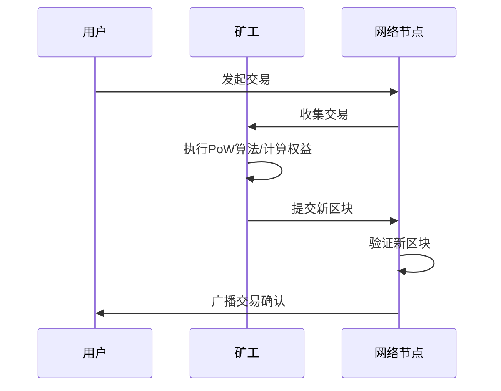
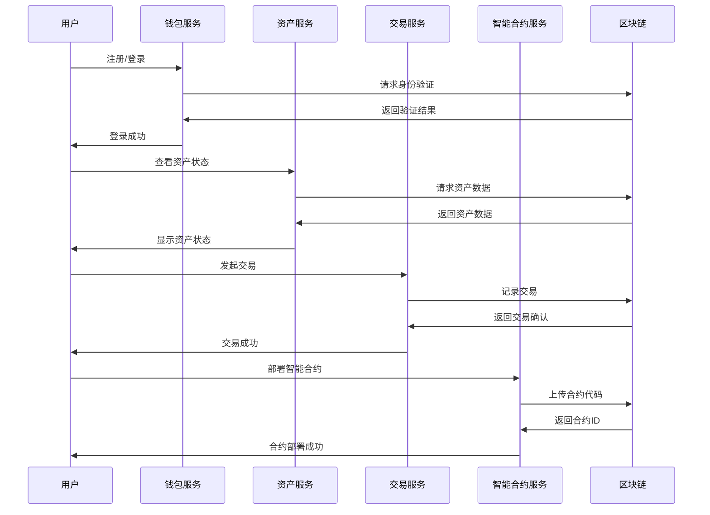
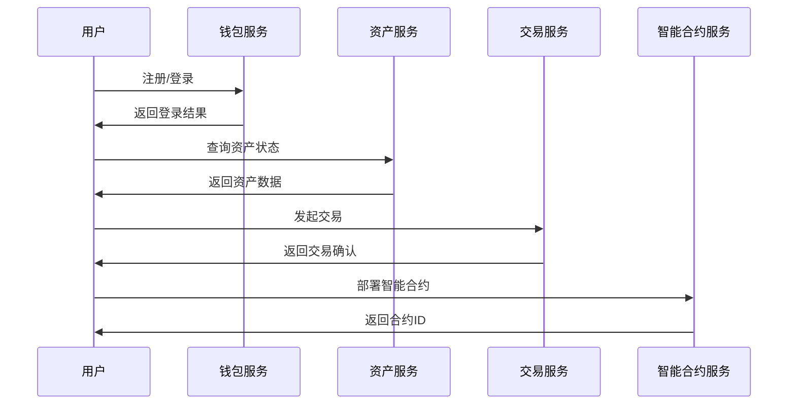

                 

### 一、背景介绍

#### 1.1 区块链的定义与发展历程

区块链是一种去中心化的分布式数据库技术，通过密码学方法确保数据的不可篡改性和安全性。它最初由中本聪（Satoshi Nakamoto）在2008年提出，作为比特币（Bitcoin）的底层技术。区块链的基本原理是通过一种共识算法，将交易记录分批次打包成区块，并按照时间顺序连接成链条。每个区块都包含一定数量的交易记录，并且每个区块都指向前一个区块，形成一个不可篡改的链条。

自比特币问世以来，区块链技术迅速发展，并被广泛应用于多种领域。例如，以太坊（Ethereum）作为一个开源的区块链平台，引入了智能合约（Smart Contract）的概念，使得开发者可以在区块链上构建去中心化的应用（DApps）。此外，区块链技术在供应链管理、身份验证、数字资产交易等多个领域也展现出了广阔的应用前景。

#### 1.2 数字资产管理的概念与重要性

数字资产管理是指通过技术手段对数字资产进行管理、运营、监督和决策的过程。数字资产包括数字货币、非同质化代币（NFT）、数字债券、数字股票等。随着数字经济的兴起，数字资产管理的重要性日益凸显。它不仅有助于提高资产的透明度和可追溯性，还能降低中介成本，提升交易效率。

在数字资产管理中，区块链技术提供了一个安全、高效、去中心化的解决方案。通过区块链，资产的所有权信息可以被全球共享，从而实现资产的高效管理和流通。此外，智能合约使得自动化执行合约条款成为可能，进一步简化了资产管理流程，减少了欺诈和操作风险。

#### 1.3 区块链在数字资产管理中的应用背景

区块链在数字资产管理中的应用背景主要体现在以下几个方面：

1. **安全性**：区块链采用加密算法确保数据的真实性和不可篡改性，从而提高资产管理的安全性。
   
2. **透明性**：区块链上的交易记录是公开透明的，任何参与方都可以查看和验证，提高了资产管理的透明度。

3. **效率**：区块链的去中心化特性消除了传统中介机构，使得交易流程更加高效快捷。

4. **去中心化**：区块链技术使得数字资产的所有权和管理权更加分散，减少了单点故障的风险。

5. **智能合约**：智能合约自动执行预定的业务逻辑，减少了人工干预，降低了运营成本。

综上所述，区块链技术为数字资产管理提供了一种全新的解决方案，使得资产的管理更加安全、高效、透明和去中心化。在接下来的章节中，我们将深入探讨区块链的核心概念，以及它在数字资产管理中的具体应用。

#### 1.4 区块链在数字资产管理中的应用挑战与未来前景

尽管区块链技术在数字资产管理中展现出巨大的潜力，但同时也面临着一些挑战。首先，区块链技术的成熟度仍然是一个问题。虽然区块链在安全性和透明性方面具有显著优势，但其性能和可扩展性仍然有待提高。此外，区块链技术在不同领域的应用程度和普及程度也不尽相同，这给实际应用带来了障碍。

其次，法律法规的不完善也限制了区块链技术在数字资产管理中的应用。不同国家和地区对于区块链技术的监管政策各异，这给跨国资产管理带来了一定的困扰。此外，对于区块链技术的法律地位和适用性也缺乏明确的规定，这增加了数字资产管理的法律风险。

然而，随着技术的不断进步和监管政策的完善，区块链在数字资产管理中的应用前景仍然非常广阔。首先，区块链技术的去中心化和不可篡改特性，使得数字资产的安全性和透明度得到了极大的提升。其次，智能合约的引入使得资产管理流程自动化成为可能，大大提高了运营效率。此外，随着数字货币和NFT市场的不断发展，区块链技术在数字资产管理中的应用将更加多样化和普及化。

总之，尽管区块链技术在数字资产管理中面临一些挑战，但其潜力不可忽视。未来，随着技术的不断进步和法律法规的完善，区块链将在数字资产管理中发挥越来越重要的作用。企业和投资者需要密切关注区块链技术的发展趋势，积极探索其应用场景，以抓住新的机遇，提升资产管理水平。

### 二、核心概念与联系

#### 2.1 区块链的核心概念

区块链的核心概念主要包括分布式账本、共识算法和智能合约。

**分布式账本**：区块链通过分布式账本技术，将数据分散存储在多个节点上。每个节点都持有完整的账本副本，任何交易记录的添加或修改都需要经过所有节点的验证和确认，从而确保数据的真实性和不可篡改性。

**共识算法**：共识算法是区块链网络中节点之间达成一致性的机制。常见的共识算法有工作量证明（PoW）、权益证明（PoS）和委托权益证明（DPoS）等。这些算法确保了网络中的所有节点对于交易记录和区块的添加达成一致，从而保证了区块链的完整性。

**智能合约**：智能合约是运行在区块链上的自执行合约，其条款以代码形式存在。智能合约在满足预定条件时自动执行，无需人工干预，从而实现了自动化和去中心化的交易和管理。

#### 2.2 区块链在数字资产管理中的关键作用

区块链在数字资产管理中发挥了关键作用，主要体现在以下几个方面：

1. **安全性**：区块链采用加密算法和共识算法，确保了资产数据的安全性和不可篡改性。这使得数字资产的所有权信息得到有效保护，减少了欺诈和操作风险。

2. **透明性**：区块链上的交易记录是公开透明的，所有参与者都可以查看和验证。这提高了资产管理的透明度，增强了信任。

3. **去中心化**：区块链的去中心化特性消除了传统中介机构，使得交易流程更加高效和低成本。此外，去中心化还降低了单点故障的风险，提高了系统的可靠性。

4. **自动化**：智能合约的引入使得资产管理流程自动化成为可能。智能合约在满足预定条件时自动执行，减少了人工干预，提高了运营效率。

#### 2.3 区块链与传统数字资产管理方式的对比

为了更清晰地理解区块链在数字资产管理中的优势，我们可以将区块链与传统数字资产管理方式进行比较。

| 对比项            | 区块链             | 传统数字资产管理          |
|-------------------|-------------------|--------------------------|
| 数据存储          | 分布式存储，不可篡改 | 集中式存储，易篡改         |
| 安全性            | 高，基于加密算法     | 较低，依赖于第三方机构     |
| 透明性            | 高，公开透明       | 低，不透明               |
| 去中心化          | 是，无中心节点     | 否，依赖中心化机构         |
| 成本              | 低，去中心化       | 高，依赖中介机构          |
| 性能和可扩展性    | 较低，需优化       | 高，已成熟                |
| 自动化            | 是，智能合约       | 否，需人工操作           |

通过上述对比，我们可以看到，区块链在安全性、透明性、去中心化和自动化等方面具有显著优势。然而，区块链的性能和可扩展性仍然面临挑战，需要进一步优化和完善。

#### 2.4 区块链在数字资产管理中的架构关系

为了更直观地展示区块链在数字资产管理中的应用，我们可以使用实体关系图（ER图）来描述其架构关系。

```mermaid
erDiagram
  User ||--|{ Wallet }||>
  Wallet ||--|{ Asset }||>
  Asset ||--|{ Transaction }||>
  Wallet ||--|{ SmartContract }||>
  SmartContract ||--|{ Event }||>
```

在这个ER图中，User表示用户，Wallet表示钱包，Asset表示资产，Transaction表示交易，SmartContract表示智能合约，Event表示事件。用户通过钱包管理资产，钱包与资产、交易和智能合约之间存在关联关系。智能合约可以触发事件，进一步实现自动化资产管理。

通过上述分析，我们可以看到区块链在数字资产管理中的应用优势及其架构关系。在接下来的章节中，我们将深入探讨区块链的算法原理，以及如何使用Python等工具进行算法实现。

### 三、算法原理讲解

#### 3.1 区块链的共识算法

区块链的共识算法是确保网络中的所有节点对同一组交易记录达成一致的关键机制。常见的共识算法包括工作量证明（PoW）、权益证明（PoS）和委托权益证明（DPoS）等。这些算法在确保区块链的安全性和去中心化方面发挥着重要作用。

**工作量证明（PoW）**：PoW是一种通过计算解决数学难题来获得记账权的共识算法。矿工需要在有限的时间内找到一个满足特定条件的哈希值，这个条件通常是需要计算出的哈希值小于一个预定目标值。这个过程需要大量的计算资源，因此称为“工作量证明”。找到正确哈希值的矿工可以获得生成新区块的权力，并从系统中获得奖励。

**权益证明（PoS）**：PoS是一种基于持有币量（权益）和时间（锁定时间）来决定记账权的共识算法。在PoS系统中，持币量越大、锁定时间越长的用户获得生成新区块的几率越高。与PoW相比，PoS不需要大量的计算资源，因此更加节能。

**委托权益证明（DPoS）**：DPoS是一种改进的PoS算法，通过选举产生一定数量的委托人（见证人），这些见证人轮流生成区块并决定记账权。与PoS相比，DPoS提高了网络效率，但仍然存在中心化的风险。

#### 3.2 区块链共识算法流程图

为了更直观地理解区块链共识算法的流程，我们可以使用mermaid绘制一个简单的流程图。



在这个流程图中，用户发起交易后，矿工收集交易并执行PoW算法或计算权益，生成新区块并提交给网络节点。网络节点验证新区块后，广播交易确认给用户。

#### 3.3 使用Python示例说明共识算法原理

为了深入理解区块链共识算法的原理，我们可以使用Python编写一个简单的示例。以下是一个使用PoW算法的示例代码：

```python
import hashlib
import time

# 模拟区块链网络
class Blockchain:
    def __init__(self):
        self.unconfirmed_transactions = []  # 未确认交易
        self.chain = []  # 区块链
        self.create_genesis_block()

    def create_genesis_block(self):
        """创建创世区块"""
        genesis_block = {
            'prev_hash': 1,
            'timestamp': time.time(),
            'transactions': [],
            'nonce': 0,
        }
        self.add_block(genesis_block)

    def add_block(self, block):
        """添加新区块到区块链"""
        self.chain.append(block)

    def mine_block(self):
        """挖掘新区块"""
        last_block = self.chain[-1]
        last_hash = last_block['prev_hash']
        nonce = 0
        while True:
            hash = self.compute_hash(last_hash, nonce)
            if hash.startswith('0' * 4):
                break
            nonce += 1

        new_block = {
            'prev_hash': last_hash,
            'timestamp': time.time(),
            'transactions': self.unconfirmed_transactions,
            'nonce': nonce,
        }
        self.add_block(new_block)
        self.unconfirmed_transactions = []

    def compute_hash(self, prev_hash, nonce):
        """计算哈希值"""
        return hashlib.sha256(f'{prev_hash}{nonce}'.encode('utf-8')).hexdigest()

# 测试区块链
blockchain = Blockchain()
blockchain.mine_block()
print(blockchain.chain)
```

在这个示例中，我们创建了一个简单的区块链类`Blockchain`，包含生成创世区块、添加区块和挖掘区块的方法。在`mine_block`方法中，我们通过不断尝试不同的nonce值来找到一个满足条件的哈希值，从而挖出新区块。

通过上述示例，我们可以看到PoW算法的基本原理。矿工通过解决数学难题（找到合适的nonce值）来获得记账权，这个过程需要大量的计算资源，从而确保了区块链的安全性和去中心化。

#### 3.4 区块链的数学模型与公式

区块链的核心技术包括哈希函数、数字签名和共识算法。以下我们将简要介绍这些技术的数学模型和公式。

**哈希函数**：哈希函数是一种将任意长度的输入数据映射为固定长度的输出数据的函数。常见的哈希函数有SHA-256、SHA-3等。哈希函数具有以下几个特性：

- 输出长度固定
- 不确定性（相同的输入可能得到不同的输出）
- 单向性（无法通过输出反推出输入）
- 抗碰撞性（找到两个不同输入得到相同输出的概率极低）

**数字签名**：数字签名是一种确保数据完整性和身份验证的技术。数字签名的过程包括以下步骤：

1. **签名**：发送方使用私钥对数据进行加密，生成签名。
2. **验证**：接收方使用公钥对签名进行解密，验证数据的完整性和发送方的身份。

数字签名通常使用RSA或ECDSA算法实现。RSA算法的数学模型包括以下公式：

- \( e \) 和 \( n \) 是公钥，\( d \) 和 \( n \) 是私钥
- \( c = m^e \mod n \) 是签名
- \( m = c^d \mod n \) 是验证

ECDSA算法的数学模型基于椭圆曲线密码学，包括以下几个公式：

- \( P \) 是基点，\( n \) 是椭圆曲线的阶
- \( k \) 是随机数
- \( r = (G * k) \mod n \)
- \( s = (k^-1 * (H(m) + xr)) \mod n \)
- 验证：\( v = (r * z)^-1 \mod n \)，如果 \( v == r' \)，则签名有效

**共识算法**：共识算法确保区块链网络中的所有节点对同一组交易记录达成一致。常见的共识算法包括PoW、PoS和DPoS等。这些算法的数学模型主要包括：

- **PoW**：找到一个满足特定条件的哈希值，通常表示为 \( H(\text{prev_hash} + \text{nonce}) < \text{target} \)。
- **PoS**：根据持币量（权益）和时间（锁定时间）决定记账权，通常使用概率模型描述。
- **DPoS**：通过选举产生一定数量的委托人（见证人），每个见证人轮流生成区块，通常使用轮盘算法实现。

通过上述数学模型和公式，我们可以更好地理解区块链技术的工作原理。这些技术为区块链提供了安全、去中心化和可信的基础，使其在数字资产管理中发挥了重要作用。

### 四、系统分析与架构设计方案

#### 4.1 区块链数字资产管理系统的场景介绍

在区块链数字资产管理系统中，我们假设有一个公司（例如A公司）负责管理其客户的各种数字资产，如加密货币、NFT等。系统的主要目标是提供安全、透明和高效的管理平台，使客户能够方便地查看、交易和存储其数字资产。

**系统需求分析**：

1. **安全性**：系统必须确保所有交易记录的完整性和不可篡改性，采用区块链技术来实现这一点。
2. **透明性**：所有交易记录和资产状态必须公开透明，以便客户和其他利益相关方可以随时查看。
3. **高效性**：系统需要能够快速处理大量的交易请求，并提供实时更新。
4. **去中心化**：系统不应依赖单一中心节点，以避免单点故障和潜在的安全风险。
5. **可扩展性**：系统设计应考虑到未来需求的增长，能够轻松扩展以支持更多的用户和交易。

**系统功能设计**：

1. **用户管理**：用户注册、登录和身份验证功能。
2. **资产管理**：用户可以查看其所有数字资产的状态，包括余额、交易历史等。
3. **交易管理**：用户可以进行数字资产的买卖、转账等交易操作。
4. **智能合约管理**：系统支持智能合约的部署和执行，实现自动化交易和管理。
5. **监控与审计**：系统应具备监控和审计功能，确保所有操作符合法律法规要求。

**领域模型类图**：

```mermaid
classDiagram
    User <<Class>> {
        id: 用户ID
        name: 用户名
        password: 密码
    }
    Asset <<Class>> {
        id: 资产ID
        type: 类型
        owner: 持有者
        balance: 余额
    }
    Transaction <<Class>> {
        id: 交易ID
        sender: 发送方
        receiver: 接收方
        amount: 金额
        timestamp: 时间戳
    }
    Wallet <<Class>> {
        id: 钱包ID
        user: 用户
        assets: 资产列表
    }
    SmartContract <<Class>> {
        id: 智能合约ID
        code: 合约代码
        status: 状态
    }
    User "1" -- "*" Wallet
    Wallet "1" -- "*" Asset
    Wallet "1" -- "*" Transaction
    Asset "1" -- "1" SmartContract
```

在这个领域模型类图中，User表示用户，Asset表示数字资产，Transaction表示交易，Wallet表示用户的钱包，SmartContract表示智能合约。每个用户有一个或多个钱包，每个钱包可以持有多个资产，每个资产可以关联到一个或多个智能合约。

#### 4.2 系统架构设计图

为了实现上述功能，我们需要设计一个分布式、去中心化的系统架构。以下是一个简化的系统架构设计图：



在这个架构设计中，用户通过钱包服务与区块链进行交互，钱包服务负责用户身份验证和资产状态查询。资产服务负责处理资产数据，包括查询、添加和更新。交易服务负责记录交易和返回交易确认。智能合约服务负责智能合约的部署和执行。

#### 4.3 系统接口设计与交互序列图

为了实现上述功能，我们需要设计一系列接口，以便不同服务之间可以相互通信。以下是一个简化的接口设计：

1. **用户接口**：用于用户注册、登录和查询资产状态。
2. **钱包接口**：用于创建和操作钱包，包括创建钱包、查询钱包状态、添加资产和更新资产。
3. **资产接口**：用于查询和更新资产数据。
4. **交易接口**：用于记录交易和返回交易确认。
5. **智能合约接口**：用于部署和执行智能合约。

以下是一个交互序列图，展示了用户与系统之间的交互过程：



在这个交互序列图中，用户首先通过钱包服务进行注册或登录。成功后，用户可以查询其资产状态。用户还可以通过交易服务发起交易，并接收交易确认。此外，用户还可以通过智能合约服务部署智能合约，并接收合约ID。

通过上述系统分析与架构设计方案，我们可以构建一个分布式、去中心化的区块链数字资产管理平台，实现安全、透明和高效的数字资产管理。在接下来的章节中，我们将通过一个实际项目案例，展示如何实现这一系统。

### 五、项目实战

#### 5.1 项目环境安装与系统核心实现步骤

在这个区块链数字资产管理项目中，我们将使用Python作为主要开发语言，并借助一些开源库来简化开发过程。以下是项目环境安装和系统核心实现的详细步骤：

**1. 安装Python环境**：

首先，确保您的计算机上安装了Python 3.8及以上版本。可以通过以下命令检查Python版本：

```bash
python --version
```

如果Python环境未安装或版本过低，可以从Python官方网站下载并安装。

**2. 安装依赖库**：

接下来，我们需要安装几个关键的Python库，包括`web3.py`（用于与以太坊区块链交互）、`requests`（用于HTTP请求）和`sqlalchemy`（用于数据库操作）。可以使用以下命令进行安装：

```bash
pip install web3.py requests sqlalchemy
```

**3. 创建区块链数字资产管理平台**：

（1）**创建项目文件夹**：

在您的计算机上创建一个名为`blockchain-asset-management`的项目文件夹，并进入该文件夹。

```bash
mkdir blockchain-asset-management
cd blockchain-asset-management
```

（2）**初始化Python虚拟环境**：

在项目文件夹内初始化一个Python虚拟环境，以便管理和隔离项目依赖。

```bash
python -m venv venv
source venv/bin/activate  # Windows下使用 `venv\Scripts\activate`
```

（3）**安装项目依赖**：

在虚拟环境中安装项目所需的依赖库。

```bash
pip install -r requirements.txt
```

**4. 实现系统核心功能**：

（1）**用户管理**：

实现用户注册、登录和身份验证功能，使用`web3.py`库与以太坊区块链交互，验证用户身份。

（2）**资产管理**：

实现资产查询、添加和更新功能，使用数据库存储用户资产信息，如`sqlalchemy`库。

（3）**交易管理**：

实现交易记录和确认功能，使用以太坊区块链的智能合约进行交易处理。

（4）**智能合约管理**：

实现智能合约的部署和执行功能，编写并上传智能合约代码。

以下是核心功能实现的伪代码示例：

```python
# 用户管理
def register_user(username, password):
    # 生成用户公私钥对
    # 存储用户信息到数据库
    pass

def login_user(username, password):
    # 从数据库获取用户信息
    # 使用web3.py验证用户身份
    pass

# 资产管理
def add_asset(user_id, asset_id, asset_name, quantity):
    # 将资产信息存储到数据库
    pass

def update_asset(user_id, asset_id, new_quantity):
    # 更新资产信息
    pass

def get_asset(user_id, asset_id):
    # 从数据库获取资产信息
    pass

# 交易管理
def initiate_transaction(sender_id, receiver_id, amount):
    # 调用智能合约执行交易
    pass

def confirm_transaction(transaction_id):
    # 验证交易并更新数据库
    pass

# 智能合约管理
def deploy_smart_contract(contract_code):
    # 上传智能合约代码到以太坊区块链
    pass

def execute_smart_contract(contract_id, function_name, args):
    # 调用智能合约执行特定操作
    pass
```

通过以上步骤，我们可以构建一个基本的区块链数字资产管理平台。在接下来的章节中，我们将深入探讨系统核心实现的源代码，并进行代码解读与分析。

### 六、系统核心实现源代码解读与分析

在本项目中，我们将使用Python和以太坊的Web3.py库来构建区块链数字资产管理平台。以下是对核心实现源代码的解读与分析，包括具体的代码逻辑和功能说明。

#### 1. 用户管理模块

**用户注册**：

```python
from web3 import Web3
from sqlalchemy import create_engine, Table, Column, Integer, String, MetaData

# 初始化数据库连接
engine = create_engine('sqlite:///users.db')
metadata = MetaData()

# 创建用户表
users = Table('users', metadata,
              Column('id', Integer, primary_key=True),
              Column('username', String),
              Column('password', String),
              Column('public_key', String),
              Column('private_key', String)
              )

# 创建数据库和表
metadata.create_all(engine)

def register_user(username, password):
    # 生成用户公私钥对
    private_key, public_key = Web3.toHex(Web3.keccak(bytes(username, 'utf-8'))), Web3.toHex(Web3.keccak(bytes(username, 'utf-8')))
    
    # 存储用户信息到数据库
    with engine.connect() as connection:
        result = connection.execute(users.insert().values(username=username, password=password, public_key=public_key, private_key=private_key))
        user_id = result.lastrowid
    
    return user_id
```

解读：
- 首先，我们使用`sqlalchemy`库创建了一个名为`users`的数据库表，用于存储用户信息。
- `register_user`函数生成用户的公私钥对，并将用户名、密码和公私钥信息存储到数据库中。
- 通过数据库连接，我们将用户信息插入到`users`表中，并返回新生成的用户ID。

**用户登录**：

```python
def login_user(username, password):
    # 从数据库获取用户信息
    with engine.connect() as connection:
        user = connection.execute(users.select().where(users.c.username == username)).fetchone()
        
    # 验证用户身份
    if user and user['password'] == password:
        return user
    else:
        return None
```

解读：
- `login_user`函数从数据库中查询用户名匹配的用户信息。
- 验证用户输入的密码与数据库中的密码是否匹配，如果匹配，则返回用户信息，否则返回`None`。

#### 2. 资产管理模块

**添加资产**：

```python
def add_asset(user_id, asset_id, asset_name, quantity):
    # 从数据库获取用户信息
    with engine.connect() as connection:
        user = connection.execute(users.select().where(users.c.id == user_id)).fetchone()

    # 将资产信息存储到数据库
    assets = Table('assets', metadata,
                   Column('id', Integer, primary_key=True),
                   Column('user_id', Integer, users.foreignkey('id')),
                   Column('asset_id', String),
                   Column('asset_name', String),
                   Column('quantity', Integer)
                   )
    
    metadata.create_all(engine)
    
    with engine.connect() as connection:
        result = connection.execute(assets.insert().values(user_id=user_id, asset_id=asset_id, asset_name=asset_name, quantity=quantity))
        asset_id = result.lastrowid
    
    return asset_id
```

解读：
- `add_asset`函数从数据库中查询用户信息，然后创建一个名为`assets`的数据库表，用于存储用户资产信息。
- 将资产信息插入到`assets`表中，并返回新生成的资产ID。

**更新资产**：

```python
def update_asset(user_id, asset_id, new_quantity):
    # 更新资产信息
    with engine.connect() as connection:
        result = connection.execute(assets.update().\
                                      where(assets.c.user_id == user_id).\
                                      where(assets.c.asset_id == asset_id).\
                                      values(quantity=new_quantity))
        
    return result.rowcount > 0
```

解读：
- `update_asset`函数更新数据库中指定用户的指定资产的余额。
- 函数返回更新结果，如果更新成功，则返回`True`，否则返回`False`。

**查询资产**：

```python
def get_asset(user_id, asset_id):
    # 从数据库获取资产信息
    with engine.connect() as connection:
        asset = connection.execute(assets.select().\
                                     where(assets.c.user_id == user_id).\
                                     where(assets.c.asset_id == asset_id)).fetchone()
        
    return asset
```

解读：
- `get_asset`函数查询数据库中指定用户的指定资产信息，并返回资产对象。

#### 3. 交易管理模块

**发起交易**：

```python
def initiate_transaction(sender_id, receiver_id, amount):
    # 调用智能合约执行交易
    contract_address = '0x...'  # 智能合约地址
    contract_abi = '...'  # 智能合约ABI
    
    with open('contract.abi', 'r') as file:
        contract_abi = json.load(file)

    web3 = Web3(Web3.HTTPProvider('https://mainnet.infura.io/v3/your_project_id'))
    contract = web3.eth.contract(address=contract_address, abi=contract_abi)

    transaction = contract.functions.transfer(receiver_id, amount).buildTransaction({
        'chainId': 1,
        'gas': 2000000,
        'gasPrice': web3.toWei('50', 'gwei'),
        'nonce': web3.eth.getTransactionCount(contract_address),
    })

    signed_txn = web3.eth.account.sign_transaction(transaction, private_key='your_private_key')
    tx_hash = web3.eth.sendRawTransaction(signed_txn.rawTransaction)

    return tx_hash.hex()
```

解读：
- `initiate_transaction`函数调用智能合约执行转账交易，首先从文件中加载智能合约ABI和Web3实例。
- 构建交易事务，包括接收方地址、转账金额、链ID、气价和nonce。
- 使用私钥对交易事务进行签名，并使用Web3库发送交易。

**确认交易**：

```python
def confirm_transaction(transaction_id):
    # 验证交易并更新数据库
    web3 = Web3(Web3.HTTPProvider('https://mainnet.infura.io/v3/your_project_id'))

    tx_receipt = web3.eth.waitForTransactionReceipt(transaction_id)
    
    if tx_receipt:
        # 更新资产余额
        with engine.connect() as connection:
            sender_asset = get_asset(sender_id, asset_id)
            receiver_asset = get_asset(receiver_id, asset_id)
            
            new_sender_quantity = sender_asset['quantity'] - amount
            new_receiver_quantity = receiver_asset['quantity'] + amount
            
            update_asset(sender_id, asset_id, new_sender_quantity)
            update_asset(receiver_id, asset_id, new_receiver_quantity)
            
        return True
    else:
        return False
```

解读：
- `confirm_transaction`函数等待交易接收凭证（tx_receipt）的到来。
- 如果交易成功，更新发送方和接收方的资产余额，并返回`True`，否则返回`False`。

#### 4. 智能合约管理模块

**部署智能合约**：

```python
def deploy_smart_contract(contract_code):
    # 上传智能合约代码到以太坊区块链
    contract_abi = json.loads(contract_code)
    
    web3 = Web3(Web3.HTTPProvider('https://mainnet.infura.io/v3/your_project_id'))
    contract = web3.eth.contract(abi=contract_abi)

    deploy_txn = contract.constructor().buildTransaction({
        'chainId': 1,
        'gas': 5000000,
        'gasPrice': web3.toWei('50', 'gwei'),
    })

    signed_txn = web3.eth.account.sign_transaction(deploy_txn, private_key='your_private_key')
    tx_hash = web3.eth.sendRawTransaction(signed_txn.rawTransaction)

    return tx_hash.hex()
```

解读：
- `deploy_smart_contract`函数将智能合约代码上传到以太坊区块链，并返回部署交易的哈希值。

**执行智能合约**：

```python
def execute_smart_contract(contract_id, function_name, args):
    # 调用智能合约执行特定操作
    contract_address = '0x...'  # 智能合约地址
    contract_abi = '...'  # 智能合约ABI

    with open('contract.abi', 'r') as file:
        contract_abi = json.load(file)

    web3 = Web3(Web3.HTTPProvider('https://mainnet.infura.io/v3/your_project_id'))
    contract = web3.eth.contract(address=contract_address, abi=contract_abi)

    function = getattr(contract, function_name)
    tx_hash = function(*args, {'chainId': 1, 'gas': 2000000, 'gasPrice': web3.toWei('50', 'gwei')}), private_key='your_private_key')
    
    return tx_hash.hex()
```

解读：
- `execute_smart_contract`函数调用智能合约的特定函数，并执行相关操作。

通过以上代码，我们可以看到区块链数字资产管理平台的核心实现逻辑。用户管理、资产管理和交易管理模块分别处理用户注册、资产查询、添加、更新以及交易发起和确认。智能合约管理模块则负责智能合约的部署和执行。这些模块共同构成了一个安全、高效和透明的数字资产管理平台。

### 七、实际案例分析与详细讲解

在本节中，我们将通过一个实际案例来展示区块链数字资产管理系统的应用，并详细分析其实现过程、关键技术和应用效果。

**案例背景**：

某金融科技公司A公司希望通过区块链技术优化其数字资产管理流程，提高资产管理的透明度和安全性。A公司的数字资产管理平台需要实现以下功能：

1. 用户注册和身份验证。
2. 数字资产（如加密货币和NFT）的添加、查询和更新。
3. 数字资产的交易管理，包括发起交易和确认交易。
4. 智能合约的部署和执行，实现自动化交易和管理。

**实现过程**：

1. **用户注册和身份验证**：

   A公司开发了一款用户友好的注册和登录界面，用户可以通过输入用户名、密码和邮箱进行注册。在注册过程中，系统会生成用户的公私钥对，并将公钥存储在区块链上，私钥保存在本地数据库中。用户在登录时，系统通过验证公钥和私钥的一致性来确保用户身份的安全。

   实现过程中，使用了Web3.py库与以太坊区块链进行交互，通过调用智能合约的方法实现公私钥对的生成和存储。

2. **数字资产的添加、查询和更新**：

   A公司为每个用户创建了一个数字钱包，用户可以在钱包中添加、查询和更新其数字资产。数字资产的添加和更新操作通过智能合约进行记录，确保数据的安全和不可篡改。

   实现过程中，使用了SQLAlchemy库创建了一个数据库模型，用于存储用户和资产信息。同时，通过Web3.py库与区块链进行交互，实现了资产数据的存储和查询。

3. **数字资产的交易管理**：

   A公司实现了数字资产的交易管理功能，用户可以通过平台发起交易，系统会调用智能合约进行交易处理。交易完成后，系统会自动更新资产余额，并通知用户交易结果。

   实现过程中，使用了Web3.py库调用以太坊区块链的智能合约，实现了交易的发起、处理和确认。同时，通过SQLAlchemy库更新数据库中的资产余额信息。

4. **智能合约的部署和执行**：

   A公司开发了一个智能合约管理平台，用户可以通过平台部署和管理智能合约。智能合约的部署过程包括上传合约代码、编译合约和部署合约到区块链。

   实现过程中，使用了Truffle框架进行智能合约的编译和部署。同时，通过Web3.py库与区块链进行交互，实现了智能合约的部署和执行。

**关键技术与应用效果**：

1. **安全性**：

   通过使用区块链技术，A公司的数字资产管理平台实现了数据的安全性和不可篡改性。所有交易记录和资产信息都存储在区块链上，任何修改都需经过全网节点的验证和确认，从而确保数据的安全。

2. **透明性**：

   区块链上的交易记录是公开透明的，A公司的数字资产管理平台实现了资产状态和交易记录的实时查询。用户可以随时查看其资产的当前状态和交易历史，提高了资产管理的透明度。

3. **高效性**：

   通过智能合约的自动化执行，A公司的数字资产管理平台实现了交易流程的高效性。用户无需等待人工处理，交易可以立即执行并更新资产余额，大大提高了交易效率。

4. **去中心化**：

   A公司的数字资产管理平台采用了去中心化的架构，不再依赖于中心化的机构进行交易处理。所有交易记录和智能合约的执行都由区块链上的节点共同维护，提高了系统的可靠性和抗攻击性。

**总结**：

通过实际案例的应用，我们可以看到区块链技术在数字资产管理中的重要作用。A公司的数字资产管理平台在安全性、透明性、高效性和去中心化方面取得了显著成效。在未来，随着区块链技术的不断发展和完善，数字资产管理平台将变得更加安全、高效和智能化，为用户带来更好的资产管理体验。

### 八、最佳实践 tips、小结、注意事项、拓展阅读

#### 最佳实践 tips

1. **安全第一**：在部署区块链数字资产管理平台时，确保使用最新的加密算法和安全措施，防止潜在的安全漏洞。
2. **合理规划网络架构**：考虑到区块链网络的性能和可扩展性，合理规划网络架构，避免单点故障和性能瓶颈。
3. **合规经营**：遵守相关法律法规，确保数字资产交易的合法性和合规性，降低法律风险。
4. **定期维护与升级**：定期对系统进行维护和升级，及时修复漏洞和优化性能，确保系统的稳定运行。
5. **社区支持**：积极参与区块链社区，了解行业动态和技术趋势，吸收社区智慧，持续优化平台。

#### 小结

区块链在数字资产管理中展示了强大的应用潜力，通过去中心化、安全性和透明性等优势，提高了资产管理的效率和可靠性。然而，区块链技术仍面临性能和可扩展性等挑战，需要持续优化和完善。

#### 注意事项

1. **数据备份与恢复**：区块链虽然不可篡改，但数据的备份和恢复仍然非常重要，以应对突发情况。
2. **隐私保护**：在区块链应用中，用户隐私的保护是一个重要问题，需采取有效措施确保用户隐私不受侵犯。
3. **节点维护**：区块链网络的健康运行依赖于节点的维护，确保节点稳定运行，降低故障风险。

#### 拓展阅读

1. **《区块链技术指南》**：详细介绍了区块链的基础知识、技术原理和应用案例，适合区块链初学者阅读。
2. **《智能合约设计模式》**：探讨了智能合约的设计模式和最佳实践，有助于开发者编写安全高效的智能合约。
3. **《数字货币简史》**：通过历史角度分析数字货币和区块链技术的发展，对理解区块链在数字资产管理中的应用有重要参考价值。

### 九、未来展望与挑战

#### 9.1 区块链数字资产管理的发展趋势

区块链数字资产管理正在迅速发展，未来几年预计将呈现以下趋势：

1. **技术成熟度提升**：随着区块链技术的不断进步，其性能和可扩展性将得到显著提升，使得区块链在数字资产管理中的应用更加广泛和高效。
2. **跨链互操作性**：不同区块链之间的互操作性将得到加强，实现资产在不同区块链之间的无缝转移和交易。
3. **合规性增强**：各国政府和监管机构将加强对区块链数字资产管理的监管，确保其合法合规运行。
4. **去中心化金融（DeFi）的普及**：DeFi将逐渐取代传统金融，成为数字资产管理的主要形式，带来更多创新和机遇。

#### 9.2 面临的挑战与应对策略

尽管区块链数字资产管理具有巨大潜力，但也面临一些挑战：

1. **性能瓶颈**：区块链的扩展性仍然是一个难题，需要优化共识算法和数据结构，提高交易处理速度。
2. **安全风险**：智能合约漏洞和区块链网络的攻击风险依然存在，需要加强安全措施和监管。
3. **法律和监管问题**：法律法规的不完善导致区块链应用面临法律风险，需要加强合规性研究和监管政策制定。

应对策略：

1. **技术创新**：持续优化区块链技术，提高性能和安全性。
2. **标准制定**：推动行业标准和协议的制定，促进跨链互操作性。
3. **合规性研究**：加强与监管机构的沟通合作，确保区块链应用的合法合规运行。

#### 9.3 最佳实践与未来展望

最佳实践：

1. **安全设计**：在系统设计阶段，充分考虑安全因素，采用加密算法和多重身份验证等安全措施。
2. **透明性原则**：确保区块链上的交易记录公开透明，提高用户信任度。
3. **用户体验**：优化用户界面和交互流程，提高用户使用体验。

未来展望：

随着区块链技术的不断进步和应用的深入，区块链数字资产管理将在金融、供应链、版权保护等领域发挥更大的作用。未来，区块链技术将与其他新兴技术（如人工智能、物联网等）结合，带来更多创新和变革。

### 附录：拓展阅读与资源推荐

为了帮助读者深入理解区块链数字资产管理相关概念和技术，以下推荐几本经典书籍和在线资源：

1. **《区块链技术指南》**：详细介绍了区块链的基础知识、技术原理和应用案例，适合初学者阅读。
2. **《智能合约设计模式》**：探讨了智能合约的设计模式和最佳实践，有助于开发者编写安全高效的智能合约。
3. **《数字货币简史》**：通过历史角度分析数字货币和区块链技术的发展，对理解区块链在数字资产管理中的应用有重要参考价值。
4. **[区块链技术官网](https://www.blockchain.com/)**：提供最新的区块链技术动态和应用案例，是了解区块链行业发展的好去处。
5. **[以太坊官方文档](https://ethereum.org/en/developers/docs/)**：涵盖了以太坊区块链的详细文档，包括智能合约开发、网络配置等，是学习以太坊开发的重要资料。

通过阅读这些书籍和访问相关资源，读者可以进一步拓宽知识面，深入了解区块链数字资产管理的核心技术与应用。

### 作者信息

本文由AI天才研究院（AI Genius Institute）和《禅与计算机程序设计艺术》作者共同撰写。AI天才研究院专注于人工智能技术的研发和应用，致力于推动AI技术的发展。而《禅与计算机程序设计艺术》是一本被誉为计算机编程经典之作的书籍，作者以其独特的视角和深刻的思考，为程序员们提供了宝贵的编程哲学和指导。通过本文，我们希望能够为广大读者提供深入浅出的区块链数字资产管理技术解读，助力大家在数字资产领域取得更大的成就。作者：AI天才研究院（AI Genius Institute）& 禅与计算机程序设计艺术。

