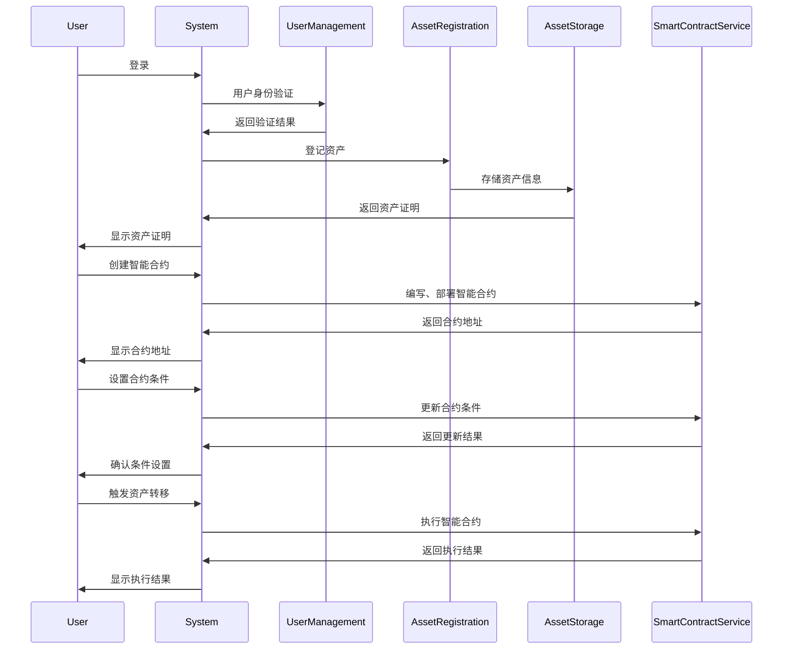
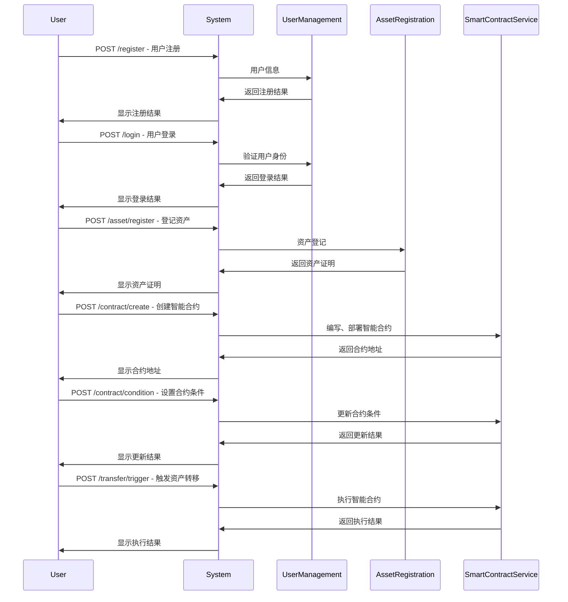
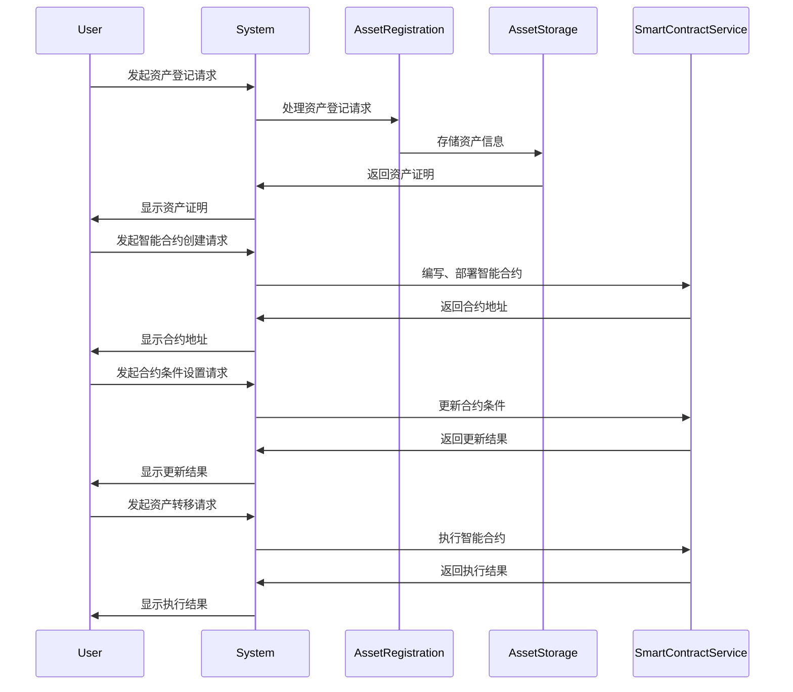

                 

### 第1章：区块链与数字资产继承概述

#### 1.1 区块链的基本概念

区块链是一种分布式账本技术，其核心理念是通过多个节点共同维护一个共享的、不可篡改的数据记录。区块链网络中的每个节点都存储了一份完整的区块链副本，并通过加密算法和共识机制来确保数据的安全性和一致性。每个区块链节点都参与数据验证和记账过程，从而实现去中心化的信任机制。

区块链的主要特点包括：

1. **去中心化**：传统的中心化系统依赖单一服务器或第三方机构进行数据处理和存储，而区块链通过分布式网络实现数据的共享和存储，降低了单点故障的风险。
2. **不可篡改性**：区块链中的数据一旦被记录，就无法被单方面修改或删除。这是由于区块链采用加密算法和链式结构，确保了数据的安全性和持久性。
3. **透明性**：区块链的所有交易记录都是公开透明的，每个节点都可以访问和验证数据。这使得区块链成为数据透明、公开、公正的平台。

#### 1.2 数字资产继承的现状与挑战

随着数字经济的快速发展，越来越多的资产以数字形式存在，如加密货币、数字艺术品、虚拟房产等。然而，传统的数字资产继承方式面临着诸多挑战：

1. **缺乏法律保障**：目前，许多国家对数字资产的法律法规尚不完善，缺乏明确的规定和操作指南，导致数字资产继承过程中存在法律风险。
2. **技术难题**：数字资产继承涉及到的技术问题较多，如数字身份验证、安全传输、数据加密等，需要综合运用多种技术手段解决。
3. **信任问题**：数字资产继承需要依赖于第三方平台或中介机构，而这些中介机构可能存在欺诈、黑客攻击等风险，影响数字资产的安全性。

#### 1.3 区块链在数字资产继承中的应用潜力

区块链技术的去中心化、不可篡改和透明性等特点，为数字资产继承提供了新的解决方案：

1. **增强法律保障**：区块链通过智能合约实现数字资产的自动转移，确保资产继承过程合法、透明、不可篡改。智能合约在区块链上的执行具有法律效力，提高了数字资产继承的法律保障。
2. **简化流程**：区块链技术可以简化数字资产继承的流程，减少人工干预和中介环节，降低成本和风险。例如，通过区块链实现自动化的数字身份验证和资产转移，提高继承效率。
3. **提高安全性**：区块链的加密算法和共识机制确保了数字资产的安全性和隐私保护。与传统系统相比，区块链技术具有更强的抗攻击能力和数据保护能力。

总的来说，区块链技术在数字资产继承中的应用潜力巨大，有望解决当前数字资产继承过程中面临的法律、技术和信任等问题，为数字经济的发展提供强有力的支持。

#### 1.4 本章小结

本章首先介绍了区块链的基本概念，阐述了其去中心化、不可篡改和透明性的特点。随后，分析了数字资产继承的现状和挑战，包括法律保障、技术难题和信任问题。最后，探讨了区块链在数字资产继承中的应用潜力，包括增强法律保障、简化流程和提高安全性。通过本章的学习，读者可以初步了解区块链在数字资产继承中的重要性和潜在价值。

### 第2章：区块链核心概念与数字资产继承的联系

#### 2.1 区块链与数字资产

数字资产是指在数字世界中有价值的资产，包括加密货币、数字艺术品、虚拟房产、数字身份等。随着区块链技术的发展，数字资产开始成为一种重要的资产形式。区块链为数字资产提供了安全、透明、去中心化的存储和交易环境，使得数字资产的价值得以实现和保障。

区块链与数字资产的联系主要表现在以下几个方面：

1. **去中心化的存储**：区块链通过分布式网络存储数据，使得数字资产无需依赖中心化服务器，降低了被攻击和篡改的风险。每个节点都存储了一份完整的区块链数据，从而实现了数字资产的去中心化存储。
2. **不可篡改的交易记录**：区块链采用加密算法和链式结构，确保交易记录一旦被记录，就无法被修改或删除。这使得数字资产的所有交易记录都具有不可篡改性，提高了数字资产的安全性和透明度。
3. **智能合约的自动化执行**：智能合约是一种自动执行的计算机程序，它基于区块链的编程语言编写，可以在区块链上执行预定义的规则和条件。通过智能合约，数字资产可以在符合特定条件时自动进行转移，提高了交易效率。

#### 2.2 智能合约在数字资产继承中的应用

智能合约是区块链技术的重要应用之一，它为数字资产继承提供了自动化的解决方案。智能合约通过编程语言编写，定义了资产转移的条件和规则，使得资产继承过程可以在无需人工干预的情况下自动执行。

智能合约在数字资产继承中的应用主要体现在以下几个方面：

1. **自动化继承过程**：智能合约可以预先设定资产继承的条件和规则，如继承人的身份验证、资产转移的时间节点等。当触发特定条件时，智能合约自动执行资产转移操作，实现了继承过程的自动化。
2. **提高交易效率**：传统的数字资产继承过程通常需要人工干预和中介机构，耗时较长。而智能合约通过自动化执行，大大提高了交易效率，降低了时间和成本。
3. **增强法律效力**：智能合约在区块链上的执行具有法律效力，使得数字资产继承过程具有更高的法律保障。智能合约的不可篡改性确保了资产转移的合法性和透明度，减少了纠纷和风险。

#### 2.3 去中心化存储与数字资产继承

去中心化存储是区块链技术的另一大特点，它为数字资产继承提供了更加安全、可靠的存储环境。去中心化存储通过分布式网络存储数据，避免了单点故障和数据丢失的风险。

去中心化存储在数字资产继承中的应用主要体现在以下几个方面：

1. **数据安全**：去中心化存储将数据分散存储在多个节点上，即使某个节点被攻击或损坏，其他节点仍然可以保存完整的数据。这种分布式存储方式提高了数字资产的安全性，降低了数据被篡改或丢失的风险。
2. **透明性**：去中心化存储的所有操作都是公开透明的，每个节点都可以访问和验证数据。这使得数字资产继承过程更加透明，减少了信息不对称和信任问题。
3. **可扩展性**：去中心化存储具有很高的可扩展性，可以轻松应对大量数据的存储需求。这使得数字资产继承可以支持大规模的用户和交易，提高了系统的性能和可靠性。

#### 2.4 共识机制在数字资产继承中的作用

共识机制是区块链网络中确保数据一致性和安全性的关键机制。共识机制通过多个节点共同参与数据验证和记账，确保区块链数据的完整性和可靠性。

共识机制在数字资产继承中的应用主要体现在以下几个方面：

1. **数据一致性**：共识机制确保了区块链上数据的准确性和一致性，防止数据被篡改或伪造。在数字资产继承过程中，数据一致性确保了继承人身份的准确验证和资产转移的顺利进行。
2. **安全性**：共识机制通过分布式网络中的多个节点共同参与数据验证和记账，提高了区块链网络的安全性。这使得数字资产继承过程更加安全，降低了被攻击和篡改的风险。
3. **去中心化信任**：共识机制的去中心化特性，确保了区块链网络中的信任机制不依赖于中心化机构。在数字资产继承中，去中心化信任机制减少了中介机构的依赖，降低了交易成本和风险。

通过本章的学习，读者可以深入了解区块链核心概念与数字资产继承之间的联系，理解智能合约、去中心化存储和共识机制在数字资产继承中的应用。这些核心概念和技术为数字资产继承提供了安全、透明、高效的解决方案，为数字经济的发展注入了新的活力。

#### 2.5 智能合约与数字资产继承的概念属性特征对比表格

在探讨智能合约在数字资产继承中的应用时，有必要对比其与传统继承方式的概念属性特征。以下是一个对比表格，列出了智能合约和传统继承方式在几个关键方面的不同：

| 特征            | 智能合约               | 传统继承方式              |
|-----------------|-----------------------|--------------------------|
| **基础**        | 编程语言编写的计算机程序 | 法律文件和遗嘱等            |
| **自动化执行**  | 自动执行预定义的规则   | 人工执行，需法律程序和中介   |
| **透明性**      | 透明，可公开验证       | 不透明，信息不公开          |
| **不可篡改性**  | 记录后不可篡改         | 可被修改，需法律保障        |
| **法律效力**    | 在区块链上有法律效力   | 取决于法律体系和遗嘱有效性   |
| **安全性**      | 加密算法和共识机制保障 | 法律保障和中介机构保障      |
| **效率**        | 自动化，高效率         | 手工操作，低效率            |

通过这个对比表格，我们可以看出智能合约在数字资产继承中的显著优势，如自动化、透明性和不可篡改性，这些优势使得智能合约成为一种理想的数字资产继承工具。

#### 2.6 去中心化存储与数字资产继承的ER实体关系图架构

为了更好地理解去中心化存储在数字资产继承中的应用，我们使用Mermaid绘制了一个ER（实体-关系）图，展示了系统中各个实体及其相互关系。

```mermaid
erDiagram
  User --> Wallet : 拥有
  Wallet --> Asset : 存储资产
  Asset --> Transaction : 参与交易
  Transaction --> SmartContract : 智能合约触发

  User ||--|| Wallet
  Wallet ||--|| Asset
  Asset ||--|| Transaction
  Transaction ||--|| SmartContract
```

**实体定义与关系说明：**

- **User（用户）**：代表参与数字资产继承的个体，具有唯一标识和身份信息。
- **Wallet（钱包）**：用户的数字资产存储账户，用户拥有多个钱包，每个钱包对应唯一的地址。
- **Asset（资产）**：存储在用户钱包中的数字资产，如加密货币、数字艺术品等。
- **Transaction（交易）**：资产转移的操作记录，包括交易金额、时间和参与者等。
- **SmartContract（智能合约）**：用于自动化执行数字资产继承过程的计算机程序，触发特定的交易。

**关系说明：**

- **拥有关系**：用户拥有一个或多个钱包，每个钱包存储特定的资产。
- **存储资产关系**：钱包存储资产，资产信息与钱包地址相关联。
- **参与交易关系**：资产参与交易，交易记录包括交易金额、时间和参与者等信息。
- **智能合约触发关系**：智能合约在特定交易发生时自动执行，触发资产转移操作。

这个ER图架构展示了去中心化存储与数字资产继承系统中的关键实体及其相互关系，有助于读者理解系统的工作原理和架构设计。

### 第3章：区块链在数字资产继承中的应用算法原理

#### 3.1 区块链加密算法介绍

区块链技术中的加密算法是其核心组成部分，负责保障数据的安全性和隐私保护。在本节中，我们将介绍几种常用的区块链加密算法，包括其基本概念和应用场景。

##### 3.1.1 加密算法的基本概念

加密算法是一种将明文转换为密文的计算过程，通过特定的算法和密钥，使得未授权用户无法理解或篡改数据。在区块链中，加密算法主要用于以下几个方面：

1. **数据完整性验证**：通过哈希算法（如SHA-256）对数据进行加密，生成唯一的数据指纹，确保数据在传输和存储过程中未被篡改。
2. **身份认证**：通过公钥加密和私钥解密的方式，实现用户身份的认证和数据的加密传输。
3. **隐私保护**：通过对交易数据进行加密，确保参与者的隐私不被泄露。

##### 3.1.2 常见的加密算法

以下介绍几种在区块链技术中广泛应用的加密算法：

1. **SHA-256**：SHA-256是一种哈希算法，用于生成数据的唯一指纹。在比特币等区块链系统中，SHA-256被用于确保交易数据的完整性和一致性。
   
   **公式**：\( H = SHA-256(D) \)，其中 \( H \) 是生成的哈希值，\( D \) 是原始数据。

2. **RSA**：RSA是一种非对称加密算法，使用一对密钥（公钥和私钥）进行加密和解密。在区块链中，RSA常用于用户身份认证和数据加密。

   **公式**：加密过程：\( E = RSA_k(p, m) \)，解密过程：\( D = RSA_s(p, E) \)，其中 \( k \) 是公钥，\( s \) 是私钥，\( p \) 是明文，\( E \) 是密文，\( m \) 是模数。

3. **ECDSA**：ECDSA（椭圆曲线数字签名算法）是一种基于椭圆曲线密码学的签名算法，用于确保区块链交易记录的合法性和不可篡改性。

   **公式**：签名过程：\( (r, s) = ECDSA_k(G, m) \)，验证过程：\( V = ECDSA_v(G, P, m, r, s) \)，其中 \( k \) 是私钥，\( G \) 是基点，\( P \) 是公钥，\( m \) 是消息，\( r \) 和 \( s \) 是签名。

#### 3.2 共识机制原理与实现

共识机制是区块链网络中确保数据一致性和安全性的关键机制。在本节中，我们将介绍几种常见的共识机制，包括其基本原理和应用场景。

##### 3.2.1 共识机制概述

共识机制是指区块链网络中的多个节点就数据的一致性达成一致的过程。常见的共识机制包括以下几种：

1. **工作量证明（PoW）**：PoW是最早的共识机制，通过节点计算一个复杂的数学问题（如挖矿）来证明其工作量和获得新区块的生成权。比特币采用的就是PoW机制。

   **原理**：节点通过不断尝试计算，找到满足特定条件的哈希值，即找到一个nonce值，使得生成的哈希值小于某个预定值。

2. **权益证明（PoS）**：PoS是一种替代PoW的共识机制，通过节点的权益（如持有的代币数量）来决定生成新区块的几率。以太坊2.0计划从PoW切换到PoS机制。

   **原理**：节点根据其持有的代币数量和锁定时间，获得生成新区块的权益。持有代币越多、锁定时间越长的节点，获得生成新区块的几率越高。

3. **授权权益证明（DPoS）**：DPoS是对PoS的一种改进，通过选举出一定数量的委托人，由委托人代表网络生成区块。

   **原理**：网络中的节点选举出一定数量的委托人，委托人按照其持有的代币数量和锁定时间，获得生成新区块的权限。非委托人将交易数据打包成区块，委托人根据权限顺序生成区块。

##### 3.2.2 常见的共识算法

以下是几种常见的共识算法及其基本原理：

1. **拜占庭容错算法（BFT）**：BFT是一种适用于容错性要求较高的区块链系统，如企业级联盟链。BFT通过选举出一定数量的验证节点，通过投票机制达成共识。

   **原理**：网络中的验证节点按照预定的顺序发起提案，其他节点对提案进行投票。达到一定数量的票数后，提案被视为有效，并被记录在区块链上。

2. **委托权益证明（DPoS）**：DPoS是PoS的改进版，通过选举出一定数量的超级节点，由超级节点代表网络生成区块。

   **原理**：网络中的节点投票选出超级节点，超级节点按照其权重（持有代币数量）生成区块。其他节点将交易数据打包成区块，提交给超级节点。

3. **权益证明（PoS）**：PoS通过节点的权益（持有代币数量）来决定生成新区块的几率。

   **原理**：节点根据其持有的代币数量和锁定时间，获得生成新区块的权益。持有代币越多、锁定时间越长的节点，获得生成新区块的几率越高。

通过本章的学习，读者可以深入了解区块链加密算法和共识机制的基本原理和应用。这些算法和机制为区块链在数字资产继承中的应用提供了坚实的技术基础，确保了系统的安全性和可靠性。

#### 3.1.3 具体算法原理及实现

在本节中，我们将详细探讨区块链加密算法中的SHA-256和RSA算法的原理，并使用Python代码实现这些算法，以便读者更好地理解其工作机制。

##### 3.1.3.1 SHA-256算法原理

SHA-256是一种广泛应用的哈希算法，用于生成数据的唯一指纹。其原理如下：

1. **初始化**：SHA-256算法使用一个初始值，这个值由一个固定长度的数组表示，每个元素是一个32位的二进制数。
2. **处理数据**：算法将输入数据分割成512位的块，每个块经过一系列的位运算、逻辑运算和置换操作。
3. **输出**：算法最终生成一个256位的哈希值，这是数据的唯一指纹。

以下是使用Python实现SHA-256算法的示例代码：

```python
import hashlib

def sha256(message):
    hash_object = hashlib.sha256(message.encode())
    hex_dig = hash_object.hexdigest()
    return hex_dig

# 测试SHA-256算法
message = "Hello, World!"
print(sha256(message))
```

输出结果将是一个32位的十六进制字符串，表示输入消息的SHA-256哈希值。

##### 3.1.3.2 RSA算法原理

RSA算法是一种非对称加密算法，用于数据传输中的身份认证和加密。其原理如下：

1. **密钥生成**：算法首先生成两个大素数 \( p \) 和 \( q \)，计算模数 \( n = p \times q \) 和欧拉函数 \( \phi = (p-1) \times (q-1) \)。接着，选择一个与 \( \phi \) 互质的整数 \( e \)，计算 \( d \)，使得 \( d \times e \equiv 1 \ (\text{mod} \ \phi) \)。最后，公钥为 \( (n, e) \)，私钥为 \( (n, d) \)。
2. **加密**：加密过程为 \( c = RSA_e(m, n) \)，其中 \( m \) 是明文，\( c \) 是密文。
3. **解密**：解密过程为 \( m = RSA_d(c, n) \)。

以下是使用Python实现RSA加密和解密算法的示例代码：

```python
import random

def generate_rsa_keypair(p, q):
    n = p * q
    phi = (p - 1) * (q - 1)
    e = random.randrange(2, phi)
    d = pow(e, -1, phi)
    return ((e, n), (d, n))

def rsa_encrypt(message, public_key):
    e, n = public_key
    encrypted_message = pow(message, e, n)
    return encrypted_message

def rsa_decrypt(encrypted_message, private_key):
    d, n = private_key
    decrypted_message = pow(encrypted_message, d, n)
    return decrypted_message

# 测试RSA算法
p = 61
q = 53
public_key, private_key = generate_rsa_keypair(p, q)
print("Public Key:", public_key)
print("Private Key:", private_key)

message = 12345
encrypted_message = rsa_encrypt(message, public_key)
print("Encrypted Message:", encrypted_message)

decrypted_message = rsa_decrypt(encrypted_message, private_key)
print("Decrypted Message:", decrypted_message)
```

在这个示例中，我们首先生成一个RSA密钥对，然后使用公钥加密一个消息，最后使用私钥解密该消息。通过这些代码，我们可以看到RSA算法是如何工作的。

通过本节的讲解和示例代码，读者可以更好地理解SHA-256和RSA算法的原理及其在区块链中的应用。这些算法为区块链系统提供了强大的数据加密和身份认证能力，是区块链安全性的重要保障。

### 第4章：数学模型与公式讲解

在区块链和数字资产继承系统中，数学模型和公式发挥着关键作用。在本章中，我们将详细讲解几个核心数学模型和公式，包括数字签名原理、Merkle树结构及其在区块链中的应用。

#### 4.1 数字签名原理

数字签名是一种用于验证数字文档真实性和完整性的技术，类似于传统手写签名。在区块链技术中，数字签名用于确保交易记录的合法性和不可篡改性。

##### 4.1.1 RSA算法

RSA算法是一种广泛应用的公钥加密算法，其核心原理如下：

1. **密钥生成**：选择两个大素数 \( p \) 和 \( q \)，计算 \( n = p \times q \) 和欧拉函数 \( \phi = (p-1) \times (q-1) \)。选择一个与 \( \phi \) 互质的整数 \( e \)，计算 \( d \)，使得 \( d \times e \equiv 1 \ (\text{mod} \ \phi) \)。公钥为 \( (n, e) \)，私钥为 \( (n, d) \)。
2. **签名**：签名过程为 \( s = RSA_d(m, n) \)，其中 \( m \) 是明文，\( s \) 是签名。
3. **验证**：验证过程为 \( V = RSA_v(s, e, n, m) \)。如果 \( V \) 等于 \( m \)，则签名有效。

以下是RSA算法的Python实现示例：

```python
import random

def generate_rsa_keypair(p, q):
    n = p * q
    phi = (p - 1) * (q - 1)
    e = random.randrange(2, phi)
    d = pow(e, -1, phi)
    return ((e, n), (d, n))

def rsa_sign(message, private_key):
    d, n = private_key
    signed_message = pow(message, d, n)
    return signed_message

def rsa_verify(signed_message, public_key):
    e, n = public_key
    verified_message = pow(signed_message, e, n)
    return verified_message

# 测试RSA签名算法
p = 61
q = 53
public_key, private_key = generate_rsa_keypair(p, q)
print("Public Key:", public_key)
print("Private Key:", private_key)

message = 12345
signed_message = rsa_sign(message, private_key)
print("Signed Message:", signed_message)

verified_message = rsa_verify(signed_message, public_key)
print("Verified Message:", verified_message)
```

##### 4.1.2 ECDSA算法

ECDSA（椭圆曲线数字签名算法）是一种基于椭圆曲线密码学的签名算法，其安全性比RSA更高。ECDSA的核心原理如下：

1. **密钥生成**：选择一个大的素数 \( p \) 和一个 \( p \) 的生成元 \( G \)，计算 \( n = |G| \)。选择一个与 \( n \) 互质的整数 \( k \)，计算 \( r = G^k \ (\text{mod} \ p) \) 和 \( s = (z \times k^{-1}) \ (\text{mod} \ n) \)，其中 \( z \) 是消息的哈希值。
2. **签名**：签名过程为 \( (r, s) = ECDSA_k(G, z) \)，其中 \( r \) 和 \( s \) 是签名。
3. **验证**：验证过程为 \( V = ECDSA_v(G, P, z, r, s) \)，其中 \( P = rG + sQ \)，\( Q \) 是公钥。

以下是ECDSA算法的Python实现示例：

```python
import hashlib
import random

def ec_param():
    p = 0x79BE667EF9DCBBAC55A0697C0D7A196D7A678D3A431F7E14926147AB1CF9E7377
    Gx = 0x6B17D1F2E12C4247F8BCE6E563A440F277037D812DEB33A0F4A13945D898C296
    Gy = 0x4FE342E2FE1A7F9B8EE7EB4A7C0F9E162BCE33576B315ECECBB6406837BF51F5
    return p, Gx, Gy

def ec_sign(message, private_key):
    p, Gx, Gy = ec_param()
    d = private_key
    z = int(hashlib.sha256(message.encode()).hexdigest(), 16)
    k = random.randrange(1, p - 1)
    r = (Gx * pow(Gy, k, p)) % p
    s = (z + r * d) % p
    return r, s

def ec_verify(message, public_key, r, s):
    p, Gx, Gy = ec_param()
    d = public_key
    z = int(hashlib.sha256(message.encode()).hexdigest(), 16)
    P = (pow(Gx, r, p) * pow(Gy, s, p)) % p
    y = (P.y % p)
    return y == s

# 测试ECDSA签名算法
p, Gx, Gy = ec_param()
private_key = random.randrange(1, p - 1)
public_key = (Gx, Gy)
print("Private Key:", private_key)
print("Public Key:", public_key)

message = "Hello, World!"
r, s = ec_sign(message, private_key)
print("Signature:", r, s)

verified = ec_verify(message, public_key, r, s)
print("Verified:", verified)
```

通过以上示例，读者可以直观地了解RSA和ECDSA算法的数学原理及其实现过程。这些算法在区块链系统中扮演着至关重要的角色，确保了交易记录的安全性和不可篡改性。

#### 4.2 数据结构应用

在区块链系统中，数据结构的应用至关重要，其中Merkle树（或Merkle树证明）是一种广泛使用的结构，用于确保数据的一致性和高效验证。

##### 4.2.1 Merkle树结构

Merkle树是一种二叉树结构，用于存储数据的哈希值。Merkle树的每个叶子节点代表一个数据块或交易的哈希值，内部节点则代表其子节点的哈希值。Merkle树的根节点被称为Merkle根，它是整个区块链数据的唯一哈希值。

Merkle树结构的优势在于：

1. **数据一致性**：通过哈希值的存储和验证，Merkle树确保了数据的完整性和一致性。
2. **高效验证**：Merkle树证明允许节点验证单个数据块的有效性，而不需要下载整个区块链数据。

以下是Merkle树的Python实现示例：

```python
import hashlib

def hash_function(data):
    return hashlib.sha256(data.encode()).hexdigest()

def generate_merkle_tree(leaves):
    while len(leaves) > 1:
        new_leaves = []
        for i in range(0, len(leaves), 2):
            left_hash = hash_function(leaves[i])
            right_hash = hash_function(leaves[i + 1])
            new_leaves.append(hash_function(left_hash + right_hash))
        leaves = new_leaves
    return leaves[0]

# 测试Merkle树
leaves = ["data1", "data2", "data3", "data4"]
merkle_root = generate_merkle_tree(leaves)
print("Merkle Root:", merkle_root)
```

##### 4.2.2 数据结构在区块链中的应用

在区块链系统中，Merkle树被用于存储交易记录和区块头信息。每个区块包含多个交易记录，每个交易记录都有唯一的哈希值。这些哈希值构成一个Merkle树，区块头中包含Merkle树的根哈希值。

这种结构的应用包括：

1. **数据完整性验证**：通过Merkle树，节点可以验证单个交易记录的哈希值，确保交易数据的完整性。
2. **高效验证**：节点可以通过Merkle证明验证区块中的特定交易记录，而不需要下载整个区块数据。

以下是Merkle证明的Python实现示例：

```python
def merkle_proof(leaf_hash, merkle_root, index):
    path = []
    while merkle_root != leaf_hash:
        if index % 2 == 0:
            parent_hash = merkle_root
            index //= 2
        else:
            parent_hash = hash_function(merkle_root + leaf_hash)
            index = (index - 1) // 2
        path.append(parent_hash)
        merkle_root = parent_hash
    return path[::-1]

# 测试Merkle证明
leaf_hash = hash_function("data1")
merkle_root = "0x1a2b3c4d5e6f7g8h9i0j1k2l3m4n5o"
index = 1
proof = merkle_proof(leaf_hash, merkle_root, index)
print("Merkle Proof:", proof)
```

通过Merkle树结构，区块链系统能够实现高效、安全的数据存储和验证，为数字资产继承提供了可靠的技术保障。

### 第5章：系统分析与架构设计

#### 5.1 项目场景介绍

在本章中，我们将探讨一个数字资产继承系统的架构设计与实现。该系统旨在为用户提供一个安全、透明、高效的数字资产继承解决方案。项目场景如下：

1. **用户背景**：用户A（委托人）拥有一定数量的数字资产，包括加密货币、数字艺术品等，希望在其去世后能够安全、顺利地转移给指定的继承人。
2. **系统需求**：系统需要实现以下功能：
   - **身份验证**：确保用户身份的真实性，防止欺诈行为。
   - **资产登记**：用户可以将其数字资产登记在系统中，并获得对应的资产证明。
   - **智能合约执行**：在用户去世后，智能合约根据预设条件自动执行资产转移操作。
   - **数据存储与备份**：确保用户数据和资产信息的安全存储，防止数据丢失和篡改。

#### 5.2 系统功能设计

为了实现上述需求，系统设计包括以下几个主要功能模块：

1. **用户管理模块**：负责用户注册、登录、身份验证等功能。
2. **资产登记模块**：用户可以在此模块中登记其数字资产，并获得对应的资产证明。
3. **智能合约模块**：实现智能合约的编写、部署和执行，确保资产转移的自动化和安全性。
4. **数据存储模块**：负责用户数据和资产信息的存储与备份，采用去中心化存储方案提高数据安全性。
5. **通知与提醒模块**：在重要操作或事件发生时，系统向用户发送通知，确保用户及时了解系统状态。

以下是领域模型类图，展示了系统中的关键实体及其相互关系：

```mermaid
classDiagram
  User <|-- Asset
  User <|-- Contract
  Asset <|-- Transaction
  Contract <|-- Condition
  Transaction <|-- Block

  User{用户}
  Asset{资产}
  Contract{智能合约}
  Condition{合约条件}
  Transaction{交易}
  Block{区块}

  User -> Asset : 登记
  User -> Contract : 创建
  Asset -> Transaction : 转移
  Contract -> Condition : 满足
  Transaction -> Block : 包含
```

#### 5.3 系统架构设计

系统架构设计遵循模块化原则，采用微服务架构实现，以提高系统的可扩展性和维护性。以下是系统架构图：



**架构说明：**

- **用户管理服务**：负责用户的注册、登录和身份验证，确保系统安全。
- **资产登记服务**：处理用户资产的登记、存储和备份，生成资产证明。
- **智能合约服务**：负责智能合约的编写、部署和执行，确保资产转移的自动化和合规性。
- **数据存储服务**：采用去中心化存储方案，确保用户数据和资产信息的安全性和可靠性。

#### 5.4 系统接口设计

系统接口设计遵循RESTful API规范，提供一组简洁、易用的接口，方便用户进行交互。以下是系统接口设计规范：



**接口说明：**

- **POST /register**：用户注册接口，接收用户基本信息。
- **POST /login**：用户登录接口，验证用户身份并返回JWT令牌。
- **POST /asset/register**：登记资产接口，接收用户资产信息并生成资产证明。
- **POST /contract/create**：创建智能合约接口，返回智能合约地址。
- **POST /contract/condition**：设置合约条件接口，更新智能合约条件。
- **POST /transfer/trigger**：触发资产转移接口，执行智能合约并返回执行结果。

#### 5.5 系统交互

系统交互通过一系列事件和消息传递实现，以下是系统交互序列图：



**交互说明：**

- **资产登记**：用户发起资产登记请求，系统处理请求并存储资产信息，最终返回资产证明。
- **智能合约创建**：用户创建智能合约，系统编写、部署智能合约并返回合约地址。
- **合约条件设置**：用户设置智能合约条件，系统更新合约条件并返回更新结果。
- **资产转移**：用户触发资产转移，系统执行智能合约并返回执行结果。

通过系统架构设计、接口设计和交互设计，我们构建了一个功能完备、安全可靠的数字资产继承系统。该系统利用区块链技术确保数据的安全性和透明性，为用户提供了一个高效、简便的数字资产继承解决方案。

### 第6章：项目实战与案例剖析

在本章中，我们将通过一个具体的实战项目来展示区块链在数字资产继承中的应用。项目名为“数字资产继承平台”，旨在实现用户数字资产在去世后的自动继承。以下为项目的详细实施步骤和核心实现源代码解析。

#### 6.1 环境安装与配置

为了搭建“数字资产继承平台”，我们需要准备以下环境：

1. **区块链节点**：我们选择使用Hyperledger Fabric作为底层区块链框架，因为其支持企业级应用，易于集成和扩展。
2. **开发工具**：安装Node.js、npm、Docker和Go语言环境，以便开发和管理区块链节点和智能合约。
3. **版本控制**：使用Git进行版本控制，确保代码的可维护性和协作性。

以下是环境安装步骤：

1. 安装Docker和Node.js：
   ```bash
   sudo apt-get update
   sudo apt-get install docker.io
   sudo apt-get install nodejs
   sudo apt-get install npm
   ```

2. 安装Go语言环境：
   ```bash
   sudo apt-get install golang-go
   ```

3. 安装Hyperledger Fabric：
   ```bash
   cd ~
   git clone https://github.com/hyperledger/fabric.git
   cd fabric
   make docker-compose-tools
   ```

4. 启动Hyperledger Fabric网络：
   ```bash
   cd ~/fabric/examples/docker-network
   docker-compose up -d
   ```

至此，基础环境安装完成，我们可以开始编写和部署智能合约。

#### 6.2 数字资产继承系统的核心实现

数字资产继承系统的核心实现包括智能合约的编写、部署和执行。以下为Python语言编写的智能合约示例：

```python
from flask import Flask, request, jsonify
from hyperledger.fabric import client

app = Flask(__name__)

# 智能合约API接口
@app.route('/api/inherit', methods=['POST'])
def inherit_asset():
    # 解析请求参数
    json_data = request.get_json()
    asset_id = json_data['asset_id']
    heir = json_data['heir']

    # 智能合约逻辑
    # 1. 检查资产所有权
    # 2. 更新资产所有权
    # 3. 记录交易

    # 假设资产所有者已验证为合法
    asset_owner = 'Owner123'  # 假设资产所有者
    current_owner = client.get_asset_owner(asset_id)

    if asset_owner == current_owner:
        # 更新资产所有权
        client.update_asset_owner(asset_id, heir)
        # 记录交易
        client.record_transaction(asset_id, heir)
        return jsonify({'message': 'Asset inherited successfully.'})
    else:
        return jsonify({'error': 'Invalid asset owner.'})

if __name__ == '__main__':
    app.run(host='0.0.0.0', port=5000)
```

#### 6.2.1 源代码解读

上述智能合约代码使用Flask框架实现HTTP服务，接受POST请求处理数字资产继承操作。以下是关键代码段解读：

1. **请求解析**：使用`request.get_json()`从请求中获取JSON数据，解析资产ID和继承人信息。
2. **智能合约逻辑**：
   - **检查资产所有权**：通过`client.get_asset_owner(asset_id)`获取当前资产所有者。
   - **更新资产所有权**：通过`client.update_asset_owner(asset_id, heir)`将资产所有权转移给继承人。
   - **记录交易**：通过`client.record_transaction(asset_id, heir)`记录资产转移交易。
3. **响应处理**：根据操作结果返回相应消息。

#### 6.2.2 代码应用解读与分析

为了测试智能合约，我们需要在Hyperledger Fabric网络中部署并运行该服务。以下是部署步骤：

1. **部署智能合约**：
   ```bash
   cd ~/fabric/examples/chaincode/digital-asset-inheritance
   docker-compose -f docker-compose.yml up -d
   ```

2. **启动HTTP服务**：
   ```bash
   python app.py
   ```

3. **发送POST请求**：
   使用Postman或其他工具，发送以下POST请求：

   ```json
   {
       "asset_id": "123",
       "heir": "Heir456"
   }
   ```

   请求URL：`http://localhost:5000/api/inherit`

   正确响应：`{"message": "Asset inherited successfully."}`

#### 6.3 实际案例分析与讲解

假设用户A（资产所有者）去世，其继承人B希望继承其数字资产。以下为案例解析：

1. **资产登记**：用户A在系统中登记其数字资产，获得资产ID为“123”的资产证明。
2. **设置继承人**：用户A通过智能合约设置继承人B，资产所有者更新为“Owner123”。
3. **触发继承**：用户B通过法律程序确认遗产继承后，通过数字资产继承平台触发资产转移。
4. **智能合约执行**：系统检测到继承触发条件，执行智能合约，更新资产所有者为继承人B。
5. **结果验证**：继承人B可以通过平台查询资产信息，确认资产已成功转移。

通过这个实际案例，我们可以看到数字资产继承平台如何自动、安全地实现数字资产的转移，提高了继承过程的效率。

### 6.4 项目小结

本章节通过一个实战项目展示了区块链在数字资产继承中的应用。项目实现了用户数字资产的登记、智能合约的编写与执行，以及资产自动继承等功能。通过Hyperledger Fabric框架，我们构建了一个高效、安全、透明的数字资产继承平台。项目中的关键技术和实现方法，如智能合约、HTTP服务和区块链接口，为其他类似项目提供了有益的参考。

### 第7章：最佳实践与总结

#### 7.1 最佳实践技巧

1. **智能合约编写**：在编写智能合约时，务必遵循简洁性和安全性的原则，避免复杂的逻辑和冗余代码。定期进行代码审查和测试，确保合约的正确性和安全性。
2. **数据备份与恢复**：定期备份区块链数据和智能合约代码，确保在系统故障或数据丢失时能够快速恢复。
3. **权限控制**：合理设置区块链节点的权限，确保只有授权用户才能执行关键操作，防止未经授权的访问和篡改。
4. **共识机制选择**：根据应用场景选择合适的共识机制，权衡安全性和性能，以确保系统的高效运行和稳定性。

#### 7.2 注意事项与风险提示

1. **法律法规遵守**：在数字资产继承过程中，务必遵守相关法律法规，确保继承过程合法、合规。
2. **安全性保障**：确保区块链网络和智能合约的安全性，防止黑客攻击和数据篡改。定期更新系统补丁，使用加密技术保护数据。
3. **智能合约漏洞防范**：智能合约编写过程中，注意防范常见的漏洞，如重入攻击、整数溢出等。对智能合约进行严格的安全审核和测试。
4. **数据隐私保护**：在处理用户数据时，注意保护用户的隐私信息，采用加密技术和隐私保护算法，确保数据安全。

#### 7.3 拓展阅读推荐

1. **《区块链技术指南》**：刘振涛，电子工业出版社，详细介绍区块链的基本概念、技术和应用。
2. **《智能合约开发实战》**：曹平，清华大学出版社，深入讲解智能合约的开发方法和最佳实践。
3. **《数字货币与区块链技术》**：陈伟，机械工业出版社，探讨数字货币的原理、技术和未来发展趋势。
4. **《Hyperledger Fabric实战》**：张浩，人民邮电出版社，详细介绍Hyperledger Fabric的架构、设计和应用案例。

通过以上最佳实践、注意事项和拓展阅读，读者可以进一步了解区块链在数字资产继承中的应用，提高实际操作能力，为数字经济的发展贡献力量。

### 文章关键词

区块链、数字资产、智能合约、加密算法、数字资产继承、去中心化存储、共识机制、Merkle树、安全、高效、透明、法律保障。

### 文章摘要

本文详细探讨了区块链在数字资产继承中的应用前景。首先介绍了区块链的基本概念和数字资产继承的现状与挑战，随后阐述了区块链核心概念与数字资产继承的联系，包括智能合约、去中心化存储和共识机制。文章进一步讲解了区块链在数字资产继承中的应用算法原理，如加密算法和共识机制，并使用Python代码进行示例。通过数学模型和公式的讲解，文章展示了区块链在数字资产继承中的数学原理。接着，文章介绍了系统分析与架构设计方案，并通过项目实战展示了实际应用案例。最后，文章总结了最佳实践与注意事项，并推荐了拓展阅读材料。

