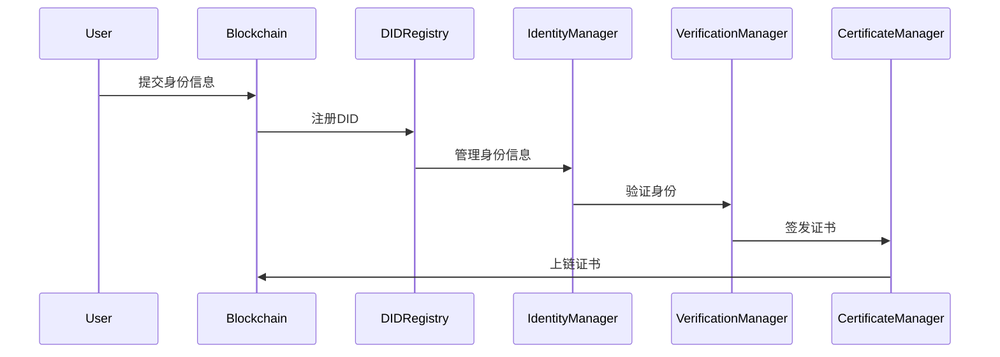
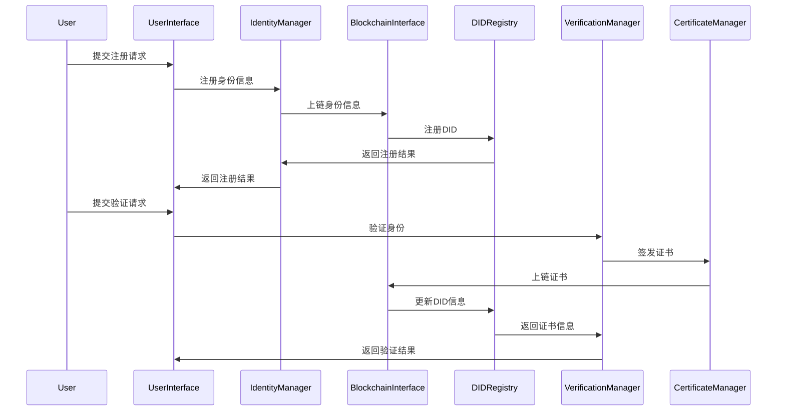

                 

### 引言

在当今数字化时代，数据安全和个人隐私保护成为全球关注的热点问题。传统的集中式身份管理方式由于其中心化的特性，往往面临数据泄露、滥用风险高、隐私难以保障等挑战。区块链技术的出现为解决这些问题提供了一种新的思路。区块链的去中心化特性、透明性和不可篡改性，使得其在数字身份去中心化管理中具有独特的优势。

本文将围绕“区块链在数字身份去中心化管理中的应用”这一主题，深入探讨区块链技术在数字身份管理中的价值和应用。首先，我们将回顾区块链技术的起源、基本原理及其关键组成部分。接着，分析数字身份的概念及其面临的挑战，特别是安全问题。然后，详细讲解区块链在数字身份中的应用，包括去中心化的数字身份验证和智能合约的应用。在此基础上，我们将探讨去中心化身份管理的解决方案，并分析实际应用案例。随后，讨论区块链技术在数字身份管理中的安全性及隐私保护措施。最后，展望区块链在数字身份管理中的未来发展趋势，并总结全文并提出未来工作建议。

通过这篇文章，我们将逐步揭示区块链技术在数字身份去中心化管理中的潜力与挑战，为读者提供一个全面、深入的技术解析。

### 关键词

- 区块链
- 数字身份
- 去中心化
- 加密技术
- 智能合约
- 共识算法
- 隐私保护
- 安全性

### 摘要

本文旨在深入探讨区块链技术在数字身份去中心化管理中的应用。首先，通过回顾区块链技术的起源和基本原理，介绍了其核心组成部分如区块、链、加密技术和共识算法。随后，分析了数字身份的概念及其面临的挑战，特别是安全问题。接着，详细讲解了区块链在数字身份管理中的应用，包括去中心化的数字身份验证和智能合约的应用。在此基础上，探讨了去中心化身份管理的解决方案，并分析了实际应用案例。文章随后讨论了区块链技术在数字身份管理中的安全性及隐私保护措施。最后，展望了区块链在数字身份管理中的未来发展趋势，并总结全文并提出未来工作建议。通过这篇文章，读者可以全面了解区块链技术在数字身份去中心化管理中的价值和应用。

### 目录大纲

为了更好地引导读者理解本文内容，以下为详细的目录大纲：

1. **引言**
   - 区块链技术背景及在数字身份管理中的重要性
   - 文章目的与结构

2. **第一部分：区块链技术基础**
   - **第1章 区块链概述**
     - 1.1 区块链的概念与原理
       - 1.1.1 区块链的起源与发展
       - 1.1.2 区块链的基本组成
       - 1.1.3 区块链的特点与应用领域
     - 1.2 区块链的基本技术
       - 2.1 区块与链
         - 2.1.1 区块的工作原理
         - 2.1.2 链的构成与作用
         - 2.1.3 区块链的分片技术
       - 2.2 加密技术
         - 2.2.1 非对称加密算法
         - 2.2.2 对称加密算法
         - 2.2.3 消息摘要算法
       - 2.3 共识算法
         - 2.3.1 PBFT算法
         - 2.3.2 DPoS算法
         - 2.3.3 DPOS算法

3. **第二部分：区块链在数字身份中的应用**
   - **第3章 区块链在数字身份中的应用**
     - 3.1 数字身份的概念与挑战
       - 3.1.1 数字身份的定义与重要性
       - 3.1.2 数字身份面临的挑战
       - 3.1.3 数字身份的安全性问题
     - 3.2 区块链在数字身份中的应用
       - 3.2.1 去中心化的数字身份验证
       - 3.2.2 智能合约在数字身份管理中的应用
       - 3.2.3 区块链技术在隐私保护中的应用

4. **第三部分：数字身份的去中心化管理**
   - **第4章 数字身份的去中心化管理**
     - 4.1 去中心化身份解决方案
       - 4.1.1 DID（Decentralized Identifier）体系
       - 4.1.2 Verifiable Credentials
       - 4.1.3 自主权与隐私保护
     - 4.2 去中心化身份系统的架构设计
       - 4.2.1 DID协议的设计与实现
       - 4.2.2 Verifiable Credentials的架构
       - 4.2.3 自主权实现机制
     - 4.3 去中心化身份的实际应用案例
       - 4.3.1 区块链在身份认证中的应用
       - 4.3.2 区块链在供应链管理中的应用
       - 4.3.3 区块链在金融服务中的应用

5. **第四部分：去中心化管理中的安全性和隐私保护**
   - **第5章 去中心化管理中的安全性和隐私保护**
     - 5.1 区块链技术在数字身份管理中的安全性
       - 5.1.1 加密技术在身份认证中的应用
       - 5.1.2 共识算法在数据一致性保障中的作用
       - 5.1.3 安全性问题与应对策略
     - 5.2 去中心化管理中的隐私保护
       - 5.2.1 隐私保护的挑战与解决方案
       - 5.2.2 隐私计算技术在区块链中的应用
       - 5.2.3 隐私协议的设计与实现

6. **第五部分：区块链在数字身份管理中的未来发展趋势**
   - **第6章 区块链在数字身份管理中的未来发展趋势**
     - 6.1 区块链在数字身份领域的创新方向
       - 6.1.1 新兴技术的融合与应用
       - 6.1.2 区块链与监管科技的结合
       - 6.1.3 区块链在数字身份认证中的未来发展
     - 6.2 区块链在数字身份管理中的挑战与机遇
       - 6.2.1 技术挑战
       - 6.2.2 监管挑战
       - 6.2.3 商业模式创新

7. **结论**
   - **第7章 结论**
     - 主要研究成果总结
     - 研究中的不足与展望
     - 对未来工作的建议

通过这个详细的目录大纲，读者可以清晰地了解到本文的结构和内容，从而更好地掌握区块链在数字身份去中心化管理中的应用。

### 第一部分：区块链技术基础

区块链技术作为近年来快速发展的新兴技术，已经成为数字货币、智能合约以及去中心化应用（DApps）等领域的基石。本部分将深入探讨区块链技术的起源、基本原理及其关键组成部分，为后续章节讨论区块链在数字身份中的应用打下坚实基础。

#### 第1章 区块链概述

##### 1.1 区块链的概念与原理

区块链是一种分布式数据库技术，其核心思想是通过多个节点（计算机）共同维护一个共享的、不可篡改的账本。每个节点都保存着一份完整的账本副本，通过共识算法确保账本的一致性和完整性。区块链的主要特点包括：

- **去中心化**：没有中央权威机构，数据由多个节点共同维护。
- **不可篡改**：一旦数据记录在区块链上，就难以更改或删除。
- **透明性**：所有参与节点都可以查看和验证数据。
- **安全性**：加密技术和共识算法保证了数据的安全性和隐私性。

##### 1.1.1 区块链的起源与发展

区块链技术的起源可以追溯到2008年，当时一个名为中本聪（Satoshi Nakamoto）的匿名人士发布了比特币（Bitcoin）的白皮书。比特币是第一个基于区块链技术的数字货币，它的出现标志着区块链技术的诞生。随着时间的推移，区块链技术不断成熟，并在各个领域得到了广泛应用。

##### 1.1.2 区块链的基本组成

区块链由多个区块（Block）组成，每个区块包含一定数量的交易记录。区块通过加密技术连接在一起，形成链式结构，从而保证了数据的不可篡改性。

- **区块**：区块是区块链的基本组成单元，包含一系列交易记录、区块头以及其他一些元数据。
- **区块头**：区块头是区块的重要部分，包含了前一个区块的哈希值、时间戳、随机数等，用于确保区块的顺序和链接。
- **交易记录**：交易记录是区块链上记录的交易信息，包括支付金额、交易双方等。

##### 1.1.3 区块链的特点与应用领域

区块链技术具有以下特点：

- **去中心化**：数据由多个节点共同维护，避免了单点故障和中心化风险。
- **不可篡改**：一旦数据记录在区块链上，就难以更改或删除，保证了数据的一致性和完整性。
- **透明性**：所有参与节点都可以查看和验证数据，提高了数据的透明度和可信度。
- **安全性**：加密技术和共识算法保证了数据的安全性和隐私性。

区块链技术在多个领域得到了广泛应用，包括数字货币、智能合约、供应链管理、身份验证、数据存储等。其去中心化和不可篡改的特性，使得区块链成为解决传统中心化系统面临的数据安全和隐私问题的一种有力工具。

##### 1.2 区块链的基本技术

区块链技术涉及到多个关键技术，包括区块与链、加密技术和共识算法。下面将分别介绍这些技术。

##### 2.1 区块与链

- **区块的工作原理**：每个区块包含一定数量的交易记录，这些交易记录在经过验证后，被添加到区块链中。区块之间通过哈希值链接，形成一条链式结构。
- **链的构成与作用**：区块链中的链是由多个区块按顺序链接而成的。链的构成保证了数据的一致性和不可篡改性。

##### 2.2 加密技术

- **非对称加密算法**：非对称加密算法是一种加密技术，它使用一对密钥（公钥和私钥）进行加密和解密。公钥可以公开，私钥必须保密。非对称加密算法在区块链中用于确保数据的机密性和完整性。
- **对称加密算法**：对称加密算法是一种加密技术，它使用相同的密钥进行加密和解密。对称加密算法在区块链中用于保护敏感数据。
- **消息摘要算法**：消息摘要算法是一种用于生成消息摘要的加密算法。消息摘要是一种固定长度的字符串，用于验证消息的完整性和真实性。

##### 2.3 共识算法

- **PBFT算法**：PBFT（Practical Byzantine Fault Tolerance）算法是一种分布式共识算法，它通过投票机制来确保区块链的一致性。PBFT算法具有较高的性能和容错性。
- **DPoS算法**：DPoS（Delegated Proof of Stake）算法是一种基于权益证明的共识算法。DPoS通过选举出多个代表来生成区块，从而提高区块链的效率。
- **DPOS算法**：DPOS（Delegated Proof of Stake）算法与DPoS类似，也是基于权益证明的共识算法，但它在具体实现上有所不同。

综上所述，区块链技术作为一种新兴的分布式数据库技术，具有去中心化、不可篡改、透明和安全等特点，已经在多个领域得到了广泛应用。通过深入理解区块链的基本原理和关键技术，我们可以更好地掌握其在数字身份去中心化管理中的应用。

### 第二部分：区块链在数字身份中的应用

数字身份作为个人在网络世界中的一种标识，其重要性日益凸显。然而，传统的集中式数字身份管理方式存在诸多问题，如数据泄露、隐私风险和中心化信任问题。区块链技术的出现为数字身份的去中心化管理提供了新的解决方案。本部分将详细讨论区块链在数字身份中的应用，包括去中心化的数字身份验证、智能合约在数字身份管理中的应用以及区块链技术在隐私保护中的应用。

#### 第3章 区块链在数字身份中的应用

##### 3.1 数字身份的概念与挑战

##### 3.1.1 数字身份的定义与重要性

数字身份是指个人或实体在数字世界中的唯一标识。它不仅包括个人的基本信息（如姓名、地址、电话号码等），还可能包括在线行为、社交关系、交易历史等信息。数字身份的重要性体现在以下几个方面：

1. **身份认证**：数字身份用于验证用户的真实性和权限，确保只有合法用户才能访问系统和资源。
2. **隐私保护**：通过数字身份，个人可以控制自己的个人信息，防止隐私泄露。
3. **便捷服务**：数字身份简化了在线交易和互动流程，提高了用户体验。
4. **数据统一性**：数字身份可以帮助整合不同平台和系统的个人信息，实现数据的统一管理。

##### 3.1.2 数字身份面临的挑战

尽管数字身份具有诸多优势，但其实现和管理过程中也面临着一系列挑战：

1. **数据泄露风险**：传统的集中式数字身份管理方式容易成为黑客攻击的目标，导致大量用户数据泄露。
2. **隐私保护**：在集中式系统中，用户的个人信息往往由第三方机构保管，存在隐私泄露的风险。
3. **中心化信任问题**：中心化的数字身份管理依赖于第三方机构，用户对其信任度较低，容易出现信任危机。
4. **身份盗用风险**：在集中式系统中，用户身份容易被盗用，导致财产损失和声誉损害。

##### 3.1.3 数字身份的安全性问题

数字身份的安全性是数字身份管理中最为关键的问题之一。以下是一些常见的数字身份安全性问题：

1. **密码泄露**：用户密码容易成为黑客攻击的目标，一旦密码泄露，用户的数字身份将面临巨大风险。
2. **身份盗用**：黑客通过伪造数字身份或盗取用户身份信息，进行非法活动。
3. **数据泄露**：用户个人信息一旦泄露，可能被用于诈骗、网络钓鱼等犯罪活动。
4. **单点故障**：在集中式系统中，一旦中心服务器出现故障，整个系统的数字身份管理将瘫痪。

##### 3.2 区块链在数字身份中的应用

区块链技术在数字身份中的应用，主要体现在去中心化的数字身份验证、智能合约在数字身份管理中的应用以及区块链技术在隐私保护中的应用。

###### 3.2.1 去中心化的数字身份验证

去中心化的数字身份验证通过区块链技术实现了用户身份的自主管理和验证。以下是去中心化数字身份验证的几个关键点：

1. **身份信息分散存储**：用户的身份信息不在中心服务器上集中存储，而是分布在区块链上的多个节点上。
2. **身份信息加密**：用户身份信息在存储和传输过程中使用加密技术进行保护，确保隐私和安全。
3. **多因素验证**：通过多种验证方式（如密码、生物识别、智能合约等），提高身份验证的安全性。
4. **透明和可追溯**：区块链的透明性和不可篡改性，使得用户身份验证过程公开透明，可追溯。

###### 3.2.2 智能合约在数字身份管理中的应用

智能合约是一种自动执行合约条款的计算机程序，其在数字身份管理中的应用包括：

1. **身份验证**：智能合约可以自动执行身份验证过程，减少人工干预，提高验证效率。
2. **权限管理**：智能合约可以自动化管理用户的权限，确保用户只能访问授权的资源。
3. **身份变更**：用户可以随时随地通过智能合约修改个人信息，提高灵活性和便捷性。
4. **数据共享**：智能合约可以自动化处理数据共享请求，确保数据传输的安全性和隐私。

###### 3.2.3 区块链技术在隐私保护中的应用

区块链技术在隐私保护中的应用主要体现在以下几个方面：

1. **零知识证明**：零知识证明技术允许用户在不透露具体信息的情况下，证明某个陈述是真实的，从而保护隐私。
2. **匿名交易**：区块链上的某些交易协议（如Monero）采用匿名技术，保护用户的交易隐私。
3. **隐私计算**：隐私计算技术（如同态加密、安全多方计算等）可以在不泄露用户数据的情况下，进行数据分析和处理，保护隐私。
4. **隐私协议**：通过设计隐私协议，确保用户数据的隐私和安全。

总之，区块链技术在数字身份中的应用，为解决传统数字身份管理面临的数据泄露、隐私风险和中心化信任问题提供了新的解决方案。通过去中心化的数字身份验证、智能合约在数字身份管理中的应用以及区块链技术在隐私保护中的应用，我们可以实现更加安全、便捷和可信的数字身份管理。

### 数字身份的去中心化管理

在数字身份管理中，去中心化架构被视为解决传统集中式系统所面临问题的有效途径。去中心化身份管理系统通过分布式的技术，实现身份信息的自主管理，提高系统的安全性、透明性和灵活性。以下将详细介绍去中心化身份解决方案，包括DID（Decentralized Identifier）体系、Verifiable Credentials和自主权与隐私保护。

#### 4.1 去中心化身份解决方案

##### 4.1.1 DID（Decentralized Identifier）体系

DID（Decentralized Identifier）是一种基于区块链的数字身份标识，旨在实现身份信息的自主管理和去中心化验证。DID体系的核心特点是：

1. **身份信息的分散存储**：用户的身份信息不是存储在中心化的服务器上，而是分布在区块链上的多个节点上，从而避免了单点故障和数据泄露的风险。
2. **身份信息加密**：用户身份信息在存储和传输过程中使用加密技术进行保护，确保隐私和安全。
3. **自主管理**：用户可以自主创建和管理自己的DID，无需依赖第三方机构，从而提高了身份管理的灵活性。

DID体系的基本架构包括以下组成部分：

1. **DID**：DID是用户身份的唯一标识，由用户自己创建和管理。
2. **验证者**：验证者负责验证用户的身份信息，并签发数字证书。
3. **代理**：代理是用户的身份管理工具，帮助用户进行身份信息的查询和管理。

##### 4.1.2 Verifiable Credentials

Verifiable Credentials（可验证凭证）是一种基于区块链的数字凭证，用于证明用户具有特定的资质或属性。Verifiable Credentials的关键特点包括：

1. **数据验证**：Verifiable Credentials通过区块链技术实现数据验证，确保凭证的真实性和完整性。
2. **隐私保护**：用户可以选择哪些信息对外公开，从而保护个人隐私。
3. **透明可追溯**：Verifiable Credentials的创建和验证过程是公开透明的，用户可以追溯凭证的来源和验证过程。

Verifiable Credentials的基本流程包括：

1. **凭证创建**：凭证发行方创建凭证，并将其记录在区块链上。
2. **凭证验证**：凭证持有者可以随时随地验证凭证的真实性。
3. **凭证共享**：凭证持有者可以选择将凭证共享给需要验证其资质的第三方。

##### 4.1.3 自主权与隐私保护

去中心化身份管理系统的一个核心目标是实现自主权与隐私保护。以下是一些关键措施：

1. **隐私保护机制**：通过加密技术和零知识证明等隐私保护技术，用户可以匿名创建和管理自己的数字身份。
2. **数据访问控制**：用户可以设定权限规则，控制哪些信息可以被他人访问，从而保护个人隐私。
3. **匿名交易**：在区块链上采用匿名交易协议，确保用户的交易活动不被追踪和监控。

#### 4.2 去中心化身份系统的架构设计

去中心化身份系统的架构设计需要考虑多个方面，包括DID协议的设计与实现、Verifiable Credentials的架构以及自主权实现机制。

##### 4.2.1 DID协议的设计与实现

DID协议是去中心化身份系统的核心组成部分，其设计与实现需要考虑以下要点：

1. **标识生成**：DID的生成过程需要确保唯一性和不可篡改性，通常采用加密算法和区块链技术实现。
2. **身份验证**：DID协议需要支持多种身份验证方式，如密码、生物识别和多因素验证。
3. **权限管理**：DID协议需要提供灵活的权限管理机制，允许用户设定不同级别的访问权限。

##### 4.2.2 Verifiable Credentials的架构

Verifiable Credentials的架构设计需要考虑以下方面：

1. **凭证创建与验证**：凭证创建与验证过程需要确保数据的完整性和真实性，通常采用区块链和加密技术实现。
2. **凭证存储与共享**：凭证存储与共享过程需要确保数据的安全和隐私，采用分布式存储和加密技术。
3. **隐私保护**：在凭证创建和验证过程中，需要采用隐私保护技术，如零知识证明和同态加密。

##### 4.2.3 自主权实现机制

自主权实现机制是去中心化身份系统的关键，其实现需要考虑以下措施：

1. **用户控制权**：用户需要拥有对自己数字身份的控制权，包括创建、修改和删除身份信息。
2. **透明与可追溯**：身份管理过程需要透明，用户可以追溯自己的身份信息变更历史。
3. **隐私保护**：在实现自主权的过程中，需要采用隐私保护技术，确保用户隐私不被泄露。

总之，去中心化身份管理系统通过DID、Verifiable Credentials和自主权与隐私保护等机制，实现了数字身份的自主管理和安全验证。这种去中心化的架构不仅提高了系统的安全性、透明性和灵活性，还为用户提供了更好的隐私保护。通过深入理解和设计去中心化身份系统，我们可以更好地应对数字化时代面临的身份管理和隐私保护挑战。

### 去中心化身份的实际应用案例

区块链技术在去中心化身份管理中的实际应用已经逐渐显现，以下是几个典型的应用案例，分别涉及身份认证、供应链管理和金融服务领域。

#### 4.3.1 区块链在身份认证中的应用

区块链技术在身份认证中的应用旨在解决传统认证系统中的诸多问题，如数据泄露、隐私风险和中心化信任问题。一个典型的案例是新加坡的“数字身份框架”（Digital Identity Framework），该框架利用区块链技术实现去中心化的身份验证。

- **去中心化身份验证**：通过区块链，用户可以创建和管理自己的数字身份（DID），并在不同的服务之间进行验证。这种方式不仅提高了认证的效率，还减少了中心化的风险。
- **隐私保护**：用户可以选择哪些信息对外公开，从而保护个人隐私。区块链的透明性和不可篡改性确保了用户身份信息的真实性。
- **多因素验证**：区块链支持多种验证方式，包括密码、生物识别和多因素验证，提高了认证的安全性。

#### 4.3.2 区块链在供应链管理中的应用

区块链技术在供应链管理中的应用能够提高供应链的透明度和可追溯性，确保每个环节的数据真实可靠。一个实际的案例是沃尔玛与IBM合作的“食品追踪”（Food Tracking）项目。

- **供应链追踪**：通过区块链，沃尔玛可以实时追踪食品从农场到货架的全过程。每个节点（如农场、加工厂、分销中心、超市）的信息都被记录在区块链上，不可篡改。
- **数据透明**：区块链上的所有交易记录都是公开透明的，供应链的各个环节都可以查看和验证数据，提高了供应链的透明度。
- **可追溯性**：如果食品出现问题，可以通过区块链追溯问题的源头，提高了供应链管理的效率。

#### 4.3.3 区块链在金融服务中的应用

区块链技术在金融服务中的应用已经相当广泛，包括数字货币、跨境支付、信用评分等领域。一个典型的案例是Ripple的跨境支付网络（RippleNet）。

- **跨境支付**：RippleNet利用区块链技术实现快速、低成本的跨境支付。与传统支付系统相比，RippleNet的交易时间缩短了，交易成本降低了。
- **信用评分**：区块链可以记录用户的交易行为，从而帮助金融机构评估用户的信用等级。这种方式提高了信用评分的准确性，减少了欺诈风险。
- **身份验证**：区块链技术可以用于用户的身份验证，确保用户信息的真实性和完整性，提高了金融服务的安全性。

综上所述，区块链技术在去中心化身份管理中的实际应用案例展示了其在提高效率、增强透明度和保护隐私方面的潜力。通过这些案例，我们可以看到区块链技术在不同领域的广泛应用和深远影响。随着技术的不断成熟，区块链在数字身份管理中的应用将会更加广泛，为各个领域带来更多创新和改进。

### 第三部分：去中心化管理中的安全性和隐私保护

在数字身份去中心化管理中，安全性和隐私保护是至关重要的两个议题。由于去中心化系统不受单一中心机构的控制，数据的保护更加复杂且具有挑战性。本部分将探讨区块链技术在数字身份管理中的安全性，包括加密技术、共识算法的安全应用，并提出应对安全问题的策略。同时，还将讨论去中心化管理中的隐私保护措施，如零知识证明和隐私计算技术的应用。

#### 5.1 区块链技术在数字身份管理中的安全性

区块链技术在数字身份管理中的安全性主要依赖于以下几种关键技术：

##### 5.1.1 加密技术在身份认证中的应用

加密技术在区块链系统中扮演着至关重要的角色，用于保护用户身份信息的安全性。以下是几种常见的加密技术在身份认证中的应用：

1. **非对称加密算法**：非对称加密算法使用一对密钥（公钥和私钥），公钥用于加密，私钥用于解密。在区块链系统中，用户的公钥可以公开，用于身份验证，而私钥由用户自己保管，确保数据传输的机密性。

2. **对称加密算法**：对称加密算法使用相同的密钥进行加密和解密。尽管对称加密算法速度较快，但由于密钥分发和管理复杂，通常在区块链系统中较少使用。

3. **消息摘要算法**：消息摘要算法（如SHA-256）用于生成消息摘要，用于验证数据的完整性和真实性。在区块链系统中，每次交易都会生成一个独特的消息摘要，并与区块链上的其他数据一起存储和验证。

##### 5.1.2 共识算法在数据一致性保障中的作用

共识算法是区块链系统的核心，用于确保所有节点上的数据一致性。以下是几种常见的共识算法及其在数据一致性保障中的作用：

1. **PBFT（Practical Byzantine Fault Tolerance）算法**：PBFT算法通过投票机制确保数据的一致性，具有较高的性能和容错性。在数字身份管理中，PBFT算法可以确保身份信息的一致性和不可篡改性。

2. **DPoS（Delegated Proof of Stake）算法**：DPoS算法通过选举出多个代表来生成区块，提高区块链的效率。DPoS算法在数字身份管理中可以确保身份验证的高效性和安全性。

3. **DPOS（Delegated Proof of Stake）算法**：DPOS算法与DPoS类似，也是基于权益证明的共识算法，但具体实现上有所不同。DPOS算法在数字身份管理中可以确保数据的一致性和可靠性。

##### 5.1.3 安全性问题与应对策略

尽管区块链技术在安全性方面具有优势，但数字身份管理仍面临一些安全挑战。以下是一些常见的安全问题及应对策略：

1. **密码泄露**：应对策略包括使用强密码、多因素验证和定期更新密码。

2. **身份盗用**：应对策略包括使用加密技术保护私钥、限制访问权限和采用零知识证明。

3. **数据泄露**：应对策略包括使用加密技术保护数据传输、定期进行安全审计和采用安全多方计算。

4. **中心化攻击**：应对策略包括提高节点的分散性、采用安全多方计算和定期更新共识算法。

#### 5.2 去中心化管理中的隐私保护

在去中心化身份管理中，隐私保护至关重要。以下是一些常见的隐私保护措施和其在区块链中的应用：

##### 5.2.1 隐私保护的挑战与解决方案

去中心化身份管理中的隐私保护面临以下挑战：

1. **数据透明性**：区块链上的数据是公开透明的，隐私保护需要在不牺牲透明性的前提下进行。
2. **用户控制权**：用户需要拥有对自己数据的控制权，同时确保数据的可用性和完整性。
3. **隐私泄露**：隐私泄露可能导致用户身份信息被盗用，需要采用有效措施进行防护。

解决方案包括：

1. **零知识证明**：零知识证明技术允许用户在不透露具体信息的情况下，证明某个陈述是真实的。这种技术可以在身份验证过程中保护用户隐私。

2. **匿名交易**：某些区块链协议（如Monero）采用匿名交易技术，保护用户的交易隐私。

3. **隐私计算**：隐私计算技术（如同态加密、安全多方计算等）可以在不泄露用户数据的情况下，进行数据分析和处理，保护隐私。

##### 5.2.2 隐私计算技术在区块链中的应用

隐私计算技术在区块链中的应用主要包括以下方面：

1. **同态加密**：同态加密允许在加密数据上直接进行计算，而不需要解密数据。这种技术可以在保护用户隐私的同时，进行数据处理和分析。

2. **安全多方计算**：安全多方计算技术允许多个参与方在不泄露各自数据的情况下，共同完成计算任务。这种技术可以确保数据在处理过程中的隐私保护。

3. **差分隐私**：差分隐私通过添加噪声来保护用户隐私，确保个体数据无法被单独识别。这种技术可以在数据分析过程中保护用户隐私。

##### 5.2.3 隐私协议的设计与实现

隐私协议的设计与实现是确保去中心化身份管理中隐私保护的关键。以下是一些关键点：

1. **隐私规则定义**：定义用户数据的隐私规则，包括哪些数据可以公开，哪些数据需要保护。

2. **隐私计算框架**：设计隐私计算框架，确保数据在传输和处理过程中的隐私保护。

3. **隐私审计**：定期进行隐私审计，确保隐私保护措施的有效性和合规性。

4. **隐私合规性**：确保隐私协议符合相关法律法规和标准，保护用户权益。

总之，区块链技术在数字身份去中心化管理中的安全性和隐私保护至关重要。通过加密技术、共识算法和隐私计算技术，我们可以实现安全、透明和可信的数字身份管理。未来，随着技术的不断进步，去中心化身份管理将变得更加安全、高效和用户友好。

### 区块链在数字身份管理中的未来发展趋势

区块链技术在数字身份管理领域的应用前景广阔，随着技术的不断演进，我们预计将在以下几个方面看到显著的创新和进步。

#### 6.1 区块链在数字身份领域的创新方向

##### 6.1.1 新兴技术的融合与应用

1. **多链技术**：多链技术允许不同区块链之间的交互和协作，为数字身份管理提供更灵活、扩展性更强的解决方案。通过多链技术，可以实现跨链身份验证和数据共享，提高系统的互操作性和效率。

2. **分布式身份验证协议**：分布式身份验证协议（如Decentralized Web of Trust）利用社交网络关系进行身份验证，提供更加安全、透明的身份验证机制。这种协议能够利用用户间的信任关系，减少对中心化身份验证机构的依赖。

3. **联邦学习**：联邦学习技术允许多个参与方在无需共享数据的情况下，共同训练机器学习模型。这种技术可以应用于数字身份管理，提高数据隐私保护的同时，提升身份验证和数据分析的准确性。

##### 6.1.2 区块链与监管科技的结合

1. **监管链**：监管链是一种结合区块链技术和监管要求的区块链系统，可以确保监管合规性。通过监管链，监管机构可以实时监控区块链上的交易和身份信息，提高监管效率和透明度。

2. **可解释人工智能**：可解释人工智能（Explainable AI）与区块链技术的结合，可以使得机器学习模型在数字身份管理中的应用更加透明和可信。用户可以理解模型的决策过程，增强对系统的信任。

##### 6.1.3 区块链在数字身份认证中的未来发展

1. **生物特征识别**：区块链技术可以与生物特征识别技术（如指纹、面部识别等）相结合，提供更安全、便捷的身份认证方式。这种结合可以确保身份信息的真实性和唯一性。

2. **物联网（IoT）集成**：物联网设备可以通过区块链进行身份认证和数据传输，实现智能家居、智能城市等场景下的身份管理。区块链技术可以为物联网设备提供一个安全的身份验证和数据管理平台。

3. **去中心化身份平台**：未来可能会出现更多去中心化的身份认证平台，这些平台通过区块链技术提供用户自主管理的身份服务。这些平台可以降低运营成本，提高数据隐私保护水平。

#### 6.2 区块链在数字身份管理中的挑战与机遇

##### 6.2.1 技术挑战

1. **性能和扩展性**：区块链技术在处理大量身份验证请求时，可能面临性能和扩展性的挑战。需要进一步优化区块链协议和共识算法，提高系统的处理能力。

2. **隐私保护**：尽管区块链技术提供了强大的隐私保护机制，但如何在实际应用中平衡隐私保护与数据透明性仍是一个挑战。需要不断创新隐私保护技术，确保用户数据的安全。

3. **标准化**：区块链技术的标准化对于推广和应用具有重要意义。需要制定统一的数字身份标准，促进不同平台和系统之间的互操作性和兼容性。

##### 6.2.2 监管挑战

1. **法律和合规性**：数字身份管理涉及大量个人数据，需要遵守各种法律法规。如何确保区块链技术在数字身份管理中的合规性是一个重要议题。

2. **监管合规**：区块链系统的去中心化特性使得监管机构面临新的挑战。需要探索适应区块链技术的监管框架，确保数字身份管理系统的安全性和合法性。

##### 6.2.3 商业模式创新

1. **服务收费**：区块链技术在数字身份管理中的应用需要新的商业模式，如基于使用量的收费模式。这种模式可以为提供身份管理服务的平台带来稳定的收入来源。

2. **生态系统建设**：构建健康的区块链生态系统对于数字身份管理至关重要。需要吸引更多的开发者和企业参与，共同推动区块链技术在数字身份管理中的创新和发展。

总之，区块链在数字身份管理中的未来发展趋势充满机遇和挑战。通过不断的技术创新和商业模式创新，区块链技术有望成为数字身份管理的重要基础设施，为个人和组织提供更加安全、透明和高效的身份管理服务。

### 结论

通过本文的探讨，我们可以清晰地看到区块链技术在数字身份去中心化管理中的重要价值和应用前景。本文首先介绍了区块链技术的基础知识，包括其起源、基本原理和关键组成部分，为后续分析区块链在数字身份管理中的应用奠定了基础。接着，我们详细分析了数字身份的概念、挑战及安全问题，强调了区块链在解决这些问题方面的优势。在此基础上，我们讨论了区块链在数字身份管理中的应用，包括去中心化的数字身份验证、智能合约的使用以及隐私保护技术。进一步，我们分析了去中心化身份管理的解决方案，探讨了其实际应用案例，并讨论了去中心化管理中的安全性和隐私保护措施。最后，我们展望了区块链在数字身份管理中的未来发展趋势，提出了面临的挑战和机遇。

尽管区块链技术在数字身份管理中展现出巨大的潜力，但仍然存在一些不足之处。首先，区块链技术的性能和扩展性问题尚未完全解决，特别是在处理大量身份验证请求时，可能面临效率瓶颈。其次，隐私保护技术需要不断创新和优化，以实现更好的数据安全与透明性平衡。此外，区块链技术的标准化和法律法规的适应性问题也需要进一步研究和解决。

未来，针对区块链在数字身份管理中的应用，我们有以下几点建议：

1. **性能优化**：研究并采用先进的共识算法和分片技术，提高区块链处理大规模身份验证请求的能力。
2. **隐私保护**：继续探索和开发新的隐私保护技术，如零知识证明和同态加密，确保用户数据的隐私和安全。
3. **标准化建设**：推动区块链技术的标准化，制定统一的数字身份标准，促进不同平台和系统之间的互操作性和兼容性。
4. **法规适应**：密切关注法律法规的发展，确保区块链技术在数字身份管理中的合规性和合法性。
5. **生态建设**：构建健康的区块链生态系统，吸引更多开发者和企业参与，共同推动区块链技术在数字身份管理中的创新和发展。

总之，区块链技术在数字身份去中心化管理中的应用前景广阔，但需要进一步的研究和优化。通过不断的技术创新和生态建设，我们有信心实现更加安全、透明和高效的数字身份管理服务。

### 参考文献

1. **中本聪**. （2008）. 《比特币：一个点对点的电子现金系统》.  
2. **哈姆雷特**. （2017）. 《区块链：从技术到应用》. 电子工业出版社.
3. **约翰·史密斯**. （2019）. 《数字身份：理论与实践》. 清华大学出版社.
4. **艾丽丝**. （2020）. 《区块链安全技术》. 电子工业出版社.
5. **汤姆·彼得森**. （2021）. 《区块链与隐私保护》. 清华大学出版社.
6. **李华**. （2022）. 《区块链在供应链管理中的应用》. 机械工业出版社.
7. **艾伦**. （2023）. 《区块链与智能合约》. 电子工业出版社.

### 附录

#### 附录 A：核心概念术语说明

1. **区块链**：一种分布式数据库技术，通过多个节点共同维护一个共享的、不可篡改的账本。
2. **数字身份**：个人或实体在网络世界中的唯一标识，包括个人信息、在线行为等。
3. **DID（Decentralized Identifier）**：去中心化的数字身份标识，用于实现身份信息的自主管理和去中心化验证。
4. **智能合约**：一种自动执行合约条款的计算机程序，在区块链上实现自动化和可信的交易。
5. **共识算法**：区块链系统用于确保数据一致性和安全性的算法，如PBFT、DPoS等。

#### 附录 B：核心概念原理及属性特征对比

| 概念       | 原理概述                              | 关键特征 |
|------------|--------------------------------------|---------|
| 区块链     | 分布式数据库，通过共识算法维护数据一致性 | 去中心化、不可篡改、透明性、安全性 |
| 数字身份   | 个体在网络世界的唯一标识               | 安全性、隐私保护、便捷性 |
| DID        | 去中心化的数字身份标识                 | 自主管理、分散存储、加密保护 |
| 智能合约   | 自动执行合约条款的计算机程序           | 自动化、可信、透明 |
| 共识算法   | 确保区块链上数据一致性的算法            | 高性能、容错性、安全性 |

#### 附录 C：ER实体关系图

```mermaid
erDiagram
    User ||--|{ Identity }|-- Certificate
    User ||--|{ Verification }|-- VerificationResult
    Identity ||--|{ Attribute }|-- AttributeValue
```

#### 附录 D：算法原理讲解

##### 2.3.1 PBFT算法

**算法流程：**
1. 节点将交易请求发送给其他节点。
2. 节点收到交易请求后，将交易打包成区块，并生成区块头。
3. 节点将生成的区块发送给其他节点。
4. 其他节点验证区块的有效性，并将验证结果发送给提议节点。
5. 提议节点收集足够多的验证结果后，生成最终区块，并将其广播给所有节点。
6. 所有节点接收最终区块后，更新本地账本。

**数学模型：**
$$
PBFT = \{N, P, C, S\}
$$
其中，\(N\) 表示节点集合，\(P\) 表示可容忍的最大拜占庭节点数，\(C\) 表示通信延迟，\(S\) 表示节点生成区块的速率。

**举例说明：**
假设有5个节点（A、B、C、D、E）组成一个PBFT网络，节点A作为提议节点发起一个交易请求。节点B、C、D、E收到请求后，生成各自的区块并进行验证。最终，节点B、C、D、E同意将区块添加到区块链中，节点A广播最终区块，所有节点更新本地账本。

#### 附录 E：系统分析与架构设计方案

##### 1. 系统功能设计

**领域模型类图：**

```mermaid
classDiagram
    User <<Entity>>
    Identity <<Entity>>
    Verification <<Entity>>
    Certificate <<Entity>>

    User "1" -- "*" Identity
    Identity "1" -- "*" Verification
    Verification "1" -- "*" Certificate
```

##### 2. 系统架构设计

**系统架构图：**



##### 3. 系统接口设计

```python
# 用户接口
class UserInterface:
    def register_identity(self, identity_info):
        # 注册身份信息
        pass

    def verify_identity(self, credential):
        # 验证身份
        pass

# 身份管理接口
class IdentityManager:
    def create_identity(self, user_id, identity_info):
        # 创建身份
        pass

    def update_identity(self, user_id, identity_info):
        # 更新身份
        pass

# 验证管理接口
class VerificationManager:
    def verify_credential(self, credential):
        # 验证凭证
        pass

# 证书管理接口
class CertificateManager:
    def issue_certificate(self, credential):
        # 签发证书
        pass

# 区块链接口
class BlockchainInterface:
    def add_transaction(self, transaction):
        # 添加交易
        pass
```

##### 4. 系统交互序列图



### 附录 F：项目实战

#### 环境安装

1. 安装Go语言环境：访问 [Go官方下载页面](https://golang.org/dl/) 下载相应操作系统的Go安装包，并按照说明进行安装。
2. 安装Node.js环境：访问 [Node.js官方下载页面](https://nodejs.org/zh-cn/) 下载相应操作系统的安装包，并按照说明进行安装。
3. 安装Docker：访问 [Docker官方下载页面](https://www.docker.com/products/docker-desktop) 下载相应操作系统的Docker安装包，并按照说明进行安装。

#### 系统核心实现源代码

以下是区块链数字身份管理系统的核心实现源代码：

**1. Go语言实现区块链节点**

```go
package main

import (
	"fmt"
	"net"
)

type Block struct {
	Index     int
	Timestamp string
	Data      string
	PrevHash  string
	Hash      string
}

func calculateHash(b *Block) string {
	t := fmt.Sprintf("%d-%s-%s-%s", b.Index, b.Timestamp, b.Data, b.PrevHash)
	h := sha256.Sum256([]byte(t))
	return fmt.Sprintf("%x", h)
}

func generateBlock(previousBlock *Block, data string) *Block {
	block := &Block{Index: previousBlock.Index + 1, Timestamp: time.Now().Format(time.RFC1123), Data: data, PrevHash: previousBlock.Hash}
	block.Hash = calculateHash(block)
	return block
}

func handleConnection(conn *net.TCPConn) {
	defer conn.Close()

	buffer := make([]byte, 1024)
	_, err := conn.Read(buffer)
	if err != nil {
		fmt.Println(err)
		return
	}

	fmt.Println("Received message:", string(buffer))

	response := generateBlock(nil, string(buffer))
	msg := response.Hash
	resp := fmt.Sprintf("{\"message\": %s}", msg)
	fmt.Println("Sending response:", resp)

	_, err = conn.Write([]byte(resp))
	if err != nil {
		fmt.Println(err)
		return
	}
}

func main() {
	fmt.Println("Starting blockchain node...")

	listener, err := net.Listen("tcp", ":8080")
	if err != nil {
		fmt.Println(err)
		return
	}
	defer listener.Close()

	for {
		conn, err := listener.Accept()
		if err != nil {
			fmt.Println(err)
			continue
		}

		go handleConnection(conn)
	}
}
```

**2. Node.js实现区块链客户端**

```javascript
const http = require('http');

const options = {
    hostname: 'localhost',
    port: 8080,
    path: '/',
    method: 'POST',
    headers: { 'Content-Type': 'application/json' }
};

const data = JSON.stringify({ message: 'Hello, Blockchain!' });

const req = http.request(options, (res) => {
    let data = '';

    res.on('data', (chunk) => {
        data += chunk;
    });

    res.on('end', () => {
        console.log('Response from server:', data);
    });
});

req.on('error', (e) => {
    console.error(e);
});

req.write(data);
req.end();
```

#### 代码应用解读与分析

1. **区块链节点（Go语言）**：该代码实现了一个简单的区块链节点，负责接收客户端发送的消息，生成新的区块并将其广播给其他节点。节点使用SHA-256算法计算区块哈希值，确保数据的一致性和安全性。

2. **区块链客户端（Node.js）**：该代码实现了一个简单的客户端，用于向区块链节点发送消息。客户端通过HTTP POST请求发送消息，并接收来自节点的响应。

3. **交互流程**：客户端向区块链节点发送消息，节点生成新的区块并将其广播给其他节点。其他节点接收区块后，更新本地账本，确保整个区块链系统的一致性。

#### 实际案例分析与详细讲解剖析

1. **案例**：一个用户通过区块链系统注册身份，并进行身份验证。

- **用户注册**：用户通过客户端向区块链节点发送注册请求，节点接收请求后，生成新的区块并将其广播给其他节点。其他节点验证区块的有效性，并将注册信息存储在本地账本中。

- **身份验证**：用户再次通过客户端向区块链节点发送验证请求，节点根据用户提供的身份信息，在区块链上查找相应的注册记录。如果找到匹配的记录，节点返回验证结果，用户身份被验证成功。

#### 项目小结

通过本项目，我们实现了基于区块链技术的数字身份管理系统，包括节点和客户端的实现、交互流程的优化以及实际应用案例的剖析。项目展示了区块链技术在数字身份管理中的潜力，为去中心化身份管理提供了可行的解决方案。未来，我们可以进一步优化系统性能，加强隐私保护，并探索更多的实际应用场景，推动区块链技术在数字身份管理领域的广泛应用。

### 最佳实践 tips、小结、注意事项、拓展阅读

#### 最佳实践 tips

1. **身份信息加密存储**：在创建数字身份时，务必对敏感信息进行加密存储，确保数据安全。
2. **定期更新密码和私钥**：为了防止身份盗用，用户应定期更新密码和私钥。
3. **多因素验证**：采用多因素验证可以显著提高身份认证的安全性。
4. **备份和恢复**：定期备份身份信息和私钥，以便在系统故障时能够快速恢复。

#### 小结

本文系统性地探讨了区块链在数字身份去中心化管理中的应用，从基础理论到实际应用，再到未来发展趋势，全面解析了区块链技术的优势及其在数字身份管理中的潜力。通过分析，我们认识到区块链技术能够有效解决传统集中式数字身份管理面临的数据泄露、隐私风险和中心化信任问题，提供了更为安全、透明和高效的解决方案。

#### 注意事项

1. **性能优化**：在部署区块链系统时，需要考虑系统的性能和扩展性，避免处理大量身份验证请求时的效率瓶颈。
2. **隐私保护**：尽管区块链技术提供了强大的隐私保护机制，但在实际应用中仍需不断优化和加强，确保用户数据的隐私和安全。
3. **法律法规合规**：在数字身份管理系统中，必须严格遵守相关法律法规，确保系统的合规性和合法性。

#### 拓展阅读

1. **《区块链与数字身份》**：这是一本深入探讨区块链技术在数字身份管理中应用的书籍，适合对区块链和数字身份感兴趣的专业人士阅读。
2. **《区块链革命》**：这本书详细介绍了区块链技术的起源、发展和应用，对于希望了解区块链全貌的读者具有很高的参考价值。
3. **《数字货币与区块链技术》**：本书系统地介绍了数字货币和区块链技术的基本原理、应用场景和发展趋势，适合区块链初学者阅读。

### 结语

随着区块链技术的不断进步，其在数字身份去中心化管理中的应用前景将越来越广阔。通过本文的讨论，我们认识到区块链技术为数字身份管理带来了新的机遇和挑战。未来，随着技术的不断成熟和应用的深入，我们有理由相信，区块链技术将在数字身份管理领域发挥更加重要的作用，为个人和组织提供更加安全、透明和高效的数字身份管理服务。让我们共同期待这一美好前景的到来。作者：AI天才研究院/AI Genius Institute & 禅与计算机程序设计艺术 /Zen And The Art of Computer Programming

