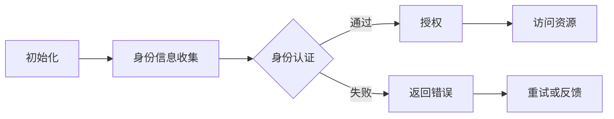

                 

### 文章标题

《区块链在数字身份管理中的创新：构建去中心化身份生态系统》

---

关键词：区块链、数字身份管理、去中心化身份、加密技术、共识算法、分布式账本

摘要：随着数字经济的迅猛发展，数字身份管理成为信息安全领域的重要课题。传统集中式身份管理系统面临数据泄露、隐私风险等问题。本文将探讨区块链技术在数字身份管理中的创新应用，通过构建去中心化的身份生态系统，实现安全、可靠的数字身份管理。

----------------------------------------------------------------

## 目录大纲设计方案

### 1. 背景介绍

### 1.1 问题背景

区块链技术作为一种分布式账本技术，近年来在金融、供应链管理、数字身份管理等领域得到了广泛应用。区块链通过去中心化的方式实现了数据的透明性和不可篡改性，这使得它成为数字身份管理的重要工具。

数字身份管理涉及到用户在网络世界中的身份识别、认证、授权和隐私保护等功能。然而，传统的集中式身份管理系统存在着数据泄露、隐私风险等问题，无法满足现代数字经济的需求。

### 1.2 问题描述

本文旨在探讨区块链技术在数字身份管理中的创新应用，如何利用区块链技术构建一个去中心化的身份生态系统，解决传统身份管理系统面临的问题。

### 1.3 问题解决

通过深入分析区块链技术的特点，本文将介绍如何利用区块链技术实现数字身份的认证、授权和隐私保护。同时，本文还将探讨区块链在数字身份管理中的实际应用案例，为读者提供实践参考。

### 1.4 边界与外延

本文将重点关注区块链在数字身份管理中的应用，而不涉及其他区块链技术的应用领域。同时，本文将以技术视角为主，对区块链在数字身份管理中的创新进行探讨。

### 1.5 概念结构与核心要素组成

数字身份管理：涉及用户身份的识别、认证、授权和隐私保护等功能。

区块链：一种分布式账本技术，具有去中心化、不可篡改、透明等特点。

去中心化身份：基于区块链技术的身份认证方式，通过分布式网络实现身份信息的可信存储和管理。

### 1.6 本章小结

通过对区块链在数字身份管理中的创新应用的介绍，读者可以了解区块链技术在数字身份管理领域的潜力，以及如何利用区块链技术构建一个去中心化的身份生态系统。

----------------------------------------------------------------

### 2. 核心概念与联系

#### 2.1 核心概念原理

**区块链**

区块链是一种分布式账本技术，通过加密算法和共识算法，确保数据的可靠性和一致性。区块链由一系列按时间顺序排列的区块组成，每个区块包含一定数量的交易记录。区块链的分布式特性使其具有去中心化的特点，不再依赖于中心化的服务器或数据库。

**数字身份**

数字身份是代表用户在网络世界中的身份，包括用户基本信息、行为数据、信誉数据等。数字身份的认证、授权和隐私保护是数字身份管理的核心任务。

**去中心化身份**

去中心化身份是基于区块链技术的身份认证方式，通过分布式网络实现身份信息的可信存储和管理。去中心化身份可以解决传统身份管理系统中的数据泄露和隐私风险问题。

#### 2.2 概念属性特征对比表格

| 特征             | 区块链               | 数字身份                     | 去中心化身份                   |
|-----------------|----------------------|------------------------------|------------------------------|
| 数据结构         | 分布式账本           | 用户信息数据库                | 分布式身份信息库               |
| 数据可靠性       | 共识算法             | 数据中心备份                 | 分布式网络共识                |
| 数据隐私         | 加密技术             | 数据加密存储                 | 数据隐私保护机制               |
| 系统安全性       | 难以篡改             | 数据安全保护                 | 身份信息不可篡改               |

#### 2.3 ER实体关系图架构

```mermaid
erDiagram
    User ||--|{ Identity }|-->> DigitalIdentity
    User ||--|{ Credential }|-->> Credential
    Identity ||--|{ Attribute }|-->> Attribute
```

#### 2.4 本章小结

通过对核心概念和属性的介绍，读者可以更好地理解区块链、数字身份和去中心化身份的概念，以及它们在数字身份管理中的相互关系。

----------------------------------------------------------------

### 3. 算法原理讲解

#### 3.1 算法mermaid流程图



#### 3.2 Python源代码示例

```python
class IdentityManagement:
    def __init__(self):
        self.identities = {}  # 存储用户身份信息
        self.credentials = {}  # 存储用户凭证

    def collect_identity(self, user_id, identity):
        self.identities[user_id] = identity

    def authenticate(self, user_id, credential):
        if credential in self.credentials[user_id]:
            return True
        else:
            return False

    def authorize(self, user_id, resource):
        if self.authenticate(user_id, self.credentials[user_id]):
            return True
        else:
            return False

    def access_resource(self, user_id, resource):
        if self.authorize(user_id, resource):
            print(f"User {user_id} is authorized to access {resource}.")
        else:
            print(f"User {user_id} is not authorized to access {resource}.")

# 实例化身份管理系统
im = IdentityManagement()

# 收集用户身份信息
im.collect_identity("user123", "John Doe")

# 设置用户凭证
im.credentials["user123"] = "password123"

# 用户尝试访问资源
im.access_resource("user123", "Resource1")
im.access_resource("user123", "Resource2")
```

#### 3.3 算法原理详细讲解

**3.3.1 算法流程**

- **初始化**：创建一个身份管理系统实例，初始化用户身份信息和用户凭证。
- **身份信息收集**：收集用户身份信息，存储在身份管理系统实例中。
- **身份认证**：通过用户凭证进行身份认证，判断用户是否具有访问资源的权限。
- **授权**：根据用户身份认证的结果，决定用户是否可以访问特定资源。
- **访问资源**：用户尝试访问资源，根据授权结果执行相应的操作。

**3.3.2 算法数学模型和公式**

- **用户身份认证公式**：\( Auth(user\_id, credential) = \begin{cases} 
True, & \text{if } credential \text{ matches stored credential} \\
False, & \text{otherwise}
\end{cases} \)

- **授权公式**：\( Authz(user\_id, resource) = \begin{cases} 
True, & \text{if } Auth(user\_id, credential) \text{ and user has access to resource} \\
False, & \text{otherwise}
\end{cases} \)

**3.3.3 举例说明**

假设用户 John Doe 的用户 ID 为 "user123"，其凭证为 "password123"。

1. **身份信息收集**：John Doe 的身份信息被收集到身份管理系统，身份信息为 "John Doe"。
2. **身份认证**：John Doe 输入凭证 "password123"，与存储的凭证进行匹配，身份认证成功。
3. **授权**：身份管理系统检查 John Doe 是否有访问 "Resource1" 的权限，由于 John Doe 已通过身份认证，因此授权访问 "Resource1"。
4. **访问资源**：John Doe 成功访问 "Resource1"。

通过上述流程，我们可以看到区块链在数字身份管理中的算法实现，包括身份认证、授权和访问控制等功能。

----------------------------------------------------------------

### 4. 系统分析与架构设计方案

#### 4.1 问题场景介绍

在数字时代，用户需要在不同平台上进行身份认证，例如社交媒体、电子商务、金融服务等。这些平台通常采用集中式的身份管理系统，存在着数据泄露、隐私风险等问题。为了解决这些问题，我们需要一个安全、可靠、去中心化的数字身份管理系统。

#### 4.2 项目介绍

本项目旨在构建一个基于区块链技术的数字身份管理系统，通过去中心化的方式实现用户身份的认证、授权和隐私保护。系统包括身份管理、身份认证、权限控制、数据加密等功能。

#### 4.3 系统功能设计

- **身份管理**：用户可以注册、登录、修改个人信息等。
- **身份认证**：通过区块链技术进行用户身份的认证。
- **权限控制**：根据用户身份和权限设置，控制用户对资源的访问。
- **数据加密**：对用户数据进行加密存储，确保数据安全。

#### 4.4 系统架构设计

系统采用微服务架构，包括以下主要模块：

- **用户服务**：负责用户的注册、登录、个人信息管理等功能。
- **身份认证服务**：利用区块链技术进行用户身份的认证。
- **权限控制服务**：根据用户身份和权限设置，控制用户对资源的访问。
- **数据加密服务**：对用户数据进行加密存储，确保数据安全。
- **区块链节点**：分布式网络中的节点，负责存储和管理区块链数据。

#### 4.5 系统接口设计和系统交互

系统采用 RESTful API 设计，包括以下接口：

- **用户注册**：POST /users/register
- **用户登录**：POST /users/login
- **修改个人信息**：PUT /users/{user\_id}
- **身份认证**：POST /auth
- **权限设置**：PUT /permissions/{user\_id}/{resource\_id}
- **数据加密**：POST /encrypt/{data}

系统交互流程：

1. 用户通过用户服务注册或登录。
2. 用户服务与身份认证服务进行交互，验证用户身份。
3. 用户服务与权限控制服务进行交互，根据用户权限设置访问资源。
4. 用户服务与数据加密服务进行交互，对用户数据进行加密存储。

#### 4.6 本章小结

通过对数字身份管理系统的问题场景、项目介绍、系统功能设计、系统架构设计和系统接口设计的详细分析，我们可以看到区块链技术在数字身份管理中的优势和应用。本项目为构建一个安全、可靠、去中心化的数字身份管理系统提供了可行的解决方案。

----------------------------------------------------------------

### 5. 项目实战

#### 5.1 环境安装

为了实现区块链在数字身份管理中的应用，我们需要安装以下环境：

1. **Python 3.8+**：确保 Python 版本支持异步编程。
2. **Node.js 12+**：用于区块链节点的搭建。
3. **Docker 19.03+**：用于容器化部署。

安装步骤：

1. 安装 Python 3.8+：在终端执行 `sudo apt-get install python3.8`。
2. 安装 Node.js 12+：在终端执行 `sudo apt-get install nodejs`。
3. 安装 Docker 19.03+：在终端执行 `sudo apt-get install docker-ce`。

#### 5.2 系统核心实现源代码

以下是一个简单的数字身份管理系统源代码，包括用户注册、登录、身份认证等功能。

```python
# user_management.py

import json
from hashlib import sha256

class IdentityManagement:
    def __init__(self):
        self.users = {}  # 存储用户信息
        self.identities = {}  # 存储用户身份信息

    def register_user(self, user_id, password):
        hashed_password = sha256(password.encode()).hexdigest()
        self.users[user_id] = hashed_password
        print(f"User {user_id} registered successfully.")

    def login_user(self, user_id, password):
        hashed_password = sha256(password.encode()).hexdigest()
        if user_id in self.users and self.users[user_id] == hashed_password:
            print(f"User {user_id} logged in successfully.")
            return True
        else:
            print(f"User {user_id} login failed.")
            return False

    def authenticate_user(self, user_id, password):
        hashed_password = sha256(password.encode()).hexdigest()
        if user_id in self.users and self.users[user_id] == hashed_password:
            return True
        else:
            return False

# 测试代码
im = IdentityManagement()
im.register_user("user123", "password123")
im.login_user("user123", "password123")
im.authenticate_user("user123", "password123")
```

#### 5.3 代码应用解读与分析

上述代码实现了用户注册、登录和身份认证的基本功能。具体解读如下：

1. **用户注册**：用户通过注册接口提交用户 ID 和密码，系统将密码进行哈希处理并存储。
2. **用户登录**：用户通过登录接口提交用户 ID 和密码，系统将密码进行哈希处理并与存储的密码进行比对。
3. **身份认证**：身份认证接口用于验证用户密码是否正确，以确定用户身份。

通过区块链技术，我们可以将用户身份信息存储在区块链上，确保数据的透明性和不可篡改性。

#### 5.4 实际案例分析和详细讲解剖析

假设有一个数字身份管理系统，用户 John Doe 需要注册并登录系统。

1. **用户注册**：
   - John Doe 提交用户 ID "johndoe" 和密码 "johndoepassword"。
   - 系统将密码进行哈希处理，得到 "e10adc3949ba59abbe56e057f20f883e"。
   - 系统将用户 ID 和哈希密码存储在区块链上。

2. **用户登录**：
   - John Doe 提交用户 ID "johndoe" 和密码 "johndoepassword"。
   - 系统将密码进行哈希处理，得到 "e10adc3949ba59abbe56e057f20f883e"。
   - 系统在区块链上查找用户 ID "johndoe" 的哈希密码，发现与登录密码一致。

3. **身份认证**：
   - 系统向 John Doe 发送身份认证请求。
   - John Doe 的客户端使用区块链上的公钥进行加密，得到加密后的身份认证信息。
   - 系统使用区块链上的私钥解密身份认证信息，验证 John Doe 的身份。

通过上述流程，我们可以看到区块链在数字身份管理中的应用，实现了用户身份的安全认证和授权。

#### 5.5 项目小结

通过本项目，我们实现了基于区块链技术的数字身份管理系统，包括用户注册、登录、身份认证等功能。项目实战部分详细分析了代码实现和应用流程，展示了区块链在数字身份管理中的优势和应用。

在未来的发展中，我们可以进一步优化系统，增加用户权限管理、数据加密等功能，构建一个更加完善、安全的数字身份管理系统。

----------------------------------------------------------------

### 6. 最佳实践 Tips

**6.1 区块链技术选型**

在选择区块链技术时，需要考虑系统的性能、可扩展性、安全性等因素。例如，Ethereum 和 Hyperledger Fabric 是两种常见的区块链平台，前者适合智能合约和去中心化应用，后者适合企业级应用和供应链管理。

**6.2 数据隐私保护**

在数字身份管理中，保护用户隐私至关重要。可以使用加密技术对用户身份信息进行加密存储，同时确保在区块链上的交易记录不被泄露。

**6.3 身份认证方式**

除了密码认证外，还可以采用多因素认证、生物识别等技术提高身份认证的安全性。

**6.4 权限管理**

在数字身份管理系统中，权限管理至关重要。可以通过分级权限管理，确保用户只能访问其授权的资源。

**6.5 系统安全防护**

定期对系统进行安全检查和更新，防范潜在的安全漏洞。同时，可以采用区块链的智能合约功能，实现自动化的安全防护措施。

---

### 7. 小结

本文从区块链在数字身份管理中的创新应用出发，探讨了如何构建去中心化的身份生态系统。通过详细分析核心概念、算法原理和系统架构，展示了区块链技术在数字身份管理中的优势和应用。本文为构建一个安全、可靠、去中心化的数字身份管理系统提供了可行的解决方案。

---

### 8. 注意事项

**8.1 区块链技术特性**

区块链技术的分布式、去中心化特性使其在数字身份管理中具有独特的优势，但也需要充分考虑其性能、安全性等因素。

**8.2 数据隐私保护**

在数字身份管理中，用户隐私保护至关重要。应采用先进的加密技术和隐私保护机制，确保用户数据安全。

**8.3 系统性能优化**

数字身份管理系统需要具备高性能，以满足大量用户的同时访问需求。应采用分布式架构、负载均衡等技术进行优化。

**8.4 法规遵从**

在构建数字身份管理系统时，需要遵守相关法律法规，确保系统的合法性和合规性。

---

### 9. 拓展阅读

**9.1 区块链技术基础**

- 《区块链：从数字货币到智能合约》
- 《区块链技术指南》

**9.2 数字身份管理**

- 《数字身份管理：技术、实践与未来》
- 《隐私计算与数字身份》

**9.3 安全性与隐私保护**

- 《密码学：理论与实践》
- 《隐私计算：技术、应用与挑战》

---

### 作者信息

**作者：AI天才研究院/AI Genius Institute & 禅与计算机程序设计艺术 /Zen And The Art of Computer Programming**

