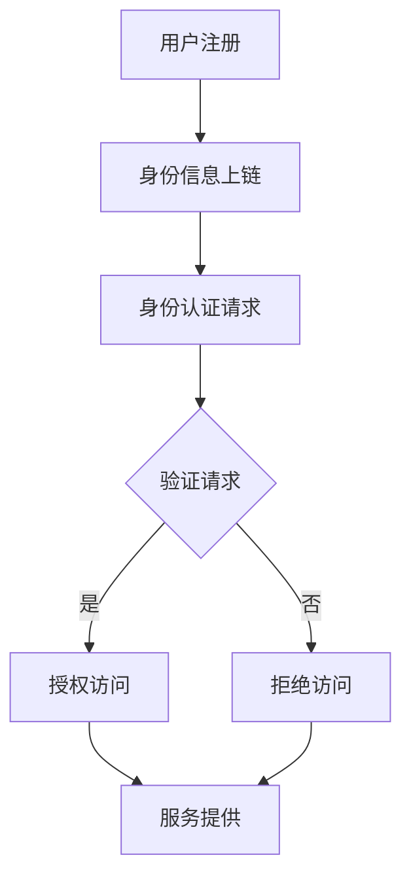
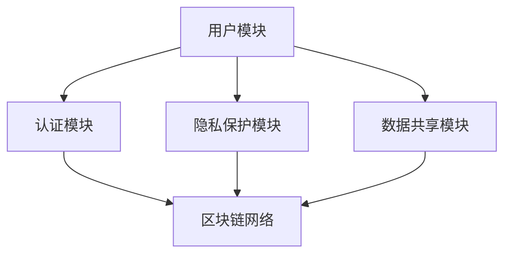
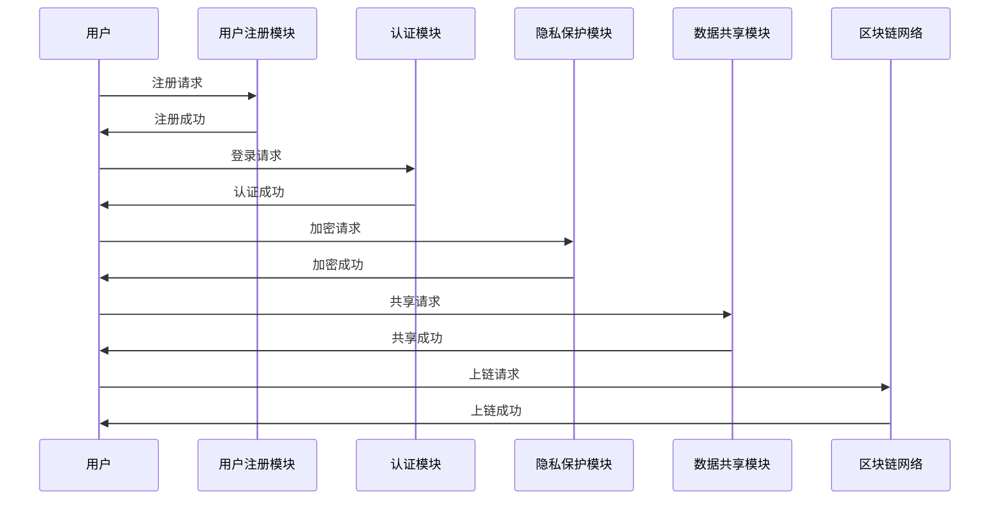

                 


### 第1章：区块链在数字身份管理中的应用背景

#### 1.1 问题背景

在互联网时代，数字身份管理变得尤为重要。随着数字经济和互联网应用的迅速发展，个人和企业的数字身份信息变得越来越丰富，如何安全、有效地管理这些信息成为了一个亟待解决的问题。

首先，传统的数字身份管理系统存在一些明显的不足。一方面，这些系统往往是中心化的，依赖于单一的中介机构进行身份验证和信息存储。这意味着，一旦中心化系统遭受攻击或出现故障，大量用户信息可能泄露或丢失。另一方面，中心化的身份管理系统往往难以实现数据的可追溯性和透明性，用户难以掌握自身信息的流向和用途。

此外，随着大数据和人工智能技术的发展，隐私泄露的风险日益增加。用户在互联网上的行为数据、个人身份信息等被大量收集和分析，这些数据一旦被滥用，可能会对用户造成严重伤害。因此，如何保护用户的隐私，防止数据泄露成为数字身份管理的重要课题。

#### 1.2 问题描述

区块链技术的出现为数字身份管理带来了一种新的思路。区块链的去中心化特性、安全性和透明性使得它在数字身份管理中具有巨大的潜力。然而，区块链在数字身份管理中也面临着一些挑战。

首先，区块链上的数据存储和处理能力相对有限，如何高效地在区块链上存储和管理大量的身份信息是一个亟待解决的问题。其次，如何确保区块链上的身份信息真实可靠，防止伪造和篡改，也是一个重要的挑战。此外，区块链的分布式特性可能会影响用户身份的统一性和便捷性。

#### 1.3 问题解决

区块链技术通过以下方式解决数字身份管理中的问题：

1. **去中心化身份认证**：区块链的去中心化特性使得身份认证不再依赖于单一的中心化机构，从而降低了信息泄露和系统故障的风险。

2. **安全性和透明性**：区块链的安全机制，如密码学和共识算法，确保了身份信息的真实性和不可篡改性。同时，区块链的透明性使得用户可以随时查询和验证自身身份信息。

3. **隐私保护**：区块链的匿名性特性可以保护用户的隐私，避免个人身份信息被滥用。

4. **高效的数据存储和处理**：通过分层存储和去中心化计算等技术，区块链可以提高数据存储和处理能力，满足大量身份信息的管理需求。

#### 1.4 边界与外延

本文的研究范围主要聚焦于区块链在数字身份管理中的应用，包括身份认证、身份隐私保护和身份信息共享等方面。此外，本文还将探讨区块链在数字身份管理中的优势和挑战，以及相关的技术解决方案。

本文不涉及区块链在其他领域（如金融、供应链等）的应用，以及区块链底层技术的深入探讨。读者若对此感兴趣，可以进一步阅读相关文献。

#### 1.5 概念结构与核心要素组成

数字身份管理涉及多个核心概念和要素，包括：

1. **数字身份**：指用户在数字世界中的唯一标识，通常包括用户名、密码、电子邮箱等。
2. **身份认证**：指验证用户身份的过程，包括单点登录、双因素认证等。
3. **隐私保护**：指保护用户身份信息和行为数据的安全措施，包括数据加密、匿名化等。
4. **数据共享**：指用户在授权的情况下，与其他实体共享身份信息。

区块链在数字身份管理中的应用主要包括以下核心要素：

1. **去中心化网络**：区块链上的身份信息分布存储在多个节点上，不存在中心化机构。
2. **加密技术**：使用密码学确保身份信息的隐私和安全。
3. **智能合约**：用于自动化身份认证和授权过程。
4. **共识算法**：确保区块链上的身份信息一致性和可靠性。

通过以上概念和要素的有机结合，区块链可以构建一个去中心化的数字身份生态系统，为用户提供安全、透明和便捷的身份管理服务。接下来，我们将深入探讨这些核心概念和要素，并分析区块链在数字身份管理中的应用场景。

### 第2章：区块链技术基础

#### 2.1 区块链的基本概念

区块链是一种分布式数据库技术，它通过加密算法和共识机制，实现了去中心化的数据存储和传输。区块链的基本概念包括区块、链、节点、挖矿、智能合约等。

**区块**：区块是区块链的基本组成单元，它包含一定数量的交易记录。每个区块都有一个唯一的标识，称为“区块头”。区块头中包含前一个区块的哈希值，从而形成了一个链接关系。

**链**：区块链是一个由多个区块按时间顺序链接而成的数据结构。每个区块都包含了它之前所有区块的信息，从而保证了区块链的不可篡改性。

**节点**：节点是区块链网络中的参与方，它负责存储和验证区块链上的数据。节点通过共识算法达成一致，确保区块链的完整性。

**挖矿**：挖矿是指节点通过解决数学难题来创建新的区块，并将新的区块添加到区块链上。挖矿过程是区块链网络共识机制的一部分，它确保了区块链的分布式特性。

**智能合约**：智能合约是区块链上的可编程代码，它可以自动执行合同条款。智能合约通过加密算法和共识机制保证其执行过程的透明性和不可篡改性。

#### 2.2 区块链的关键技术

区块链的关键技术包括密码学、分布式存储、共识算法等。

**密码学**：密码学是区块链技术的基础，它用于确保区块链上的数据隐私和安全。密码学技术包括哈希函数、数字签名、加密算法等。哈希函数用于生成数据摘要，确保数据的唯一性和完整性；数字签名用于验证数据来源和真实性；加密算法用于保护数据的机密性。

**分布式存储**：分布式存储技术将数据分散存储在多个节点上，提高了数据的可靠性和可用性。分布式存储通过共识算法确保数据的同步和一致性。

**共识算法**：共识算法是区块链网络中节点达成一致的重要机制。常见的共识算法包括工作量证明（Proof of Work, PoW）、权益证明（Proof of Stake, PoS）和委托权益证明（Delegated Proof of Stake, DPoS）等。共识算法确保了区块链的分布式特性，防止了数据篡改和双花攻击。

#### 2.3 区块链的安全机制

区块链的安全机制包括以下方面：

**防篡改性**：区块链采用链式结构，每个区块都包含前一个区块的哈希值。一旦一个区块被篡改，后续的所有区块都会受到影响。这种链式结构确保了区块链数据的不可篡改性。

**隐私保护**：区块链上的数据可以通过加密算法进行加密，从而保护数据的隐私。此外，区块链的匿名性特性也降低了用户身份被泄露的风险。

**共识机制**：共识机制通过节点之间的协作确保区块链的一致性和安全性。共识机制可以防止恶意节点篡改数据，从而保障区块链的安全。

**去中心化**：区块链的去中心化特性使得数据不再依赖于单一的中心化机构，从而降低了信息泄露和系统故障的风险。

通过以上安全技术，区块链为数字身份管理提供了一种安全、透明和去中心化的解决方案。接下来，我们将探讨数字身份管理的核心概念和原理，以及区块链在其中的应用。

### 第3章：数字身份管理核心概念

#### 3.1 数字身份管理概述

数字身份管理（Digital Identity Management）是指通过技术手段，对用户在数字世界中的身份进行创建、验证、管理和维护的过程。数字身份管理的目的是确保用户在数字环境中的身份真实、唯一，并为其提供安全、便捷的服务。

在数字身份管理中，核心概念包括数字身份、身份认证、身份隐私保护、身份信息共享等。

**数字身份**：数字身份是用户在数字世界中的唯一标识，通常包括用户名、密码、电子邮箱、手机号等。数字身份可以是实体身份的电子化表现，也可以是虚拟身份。

**身份认证**：身份认证是验证用户身份的过程，确保用户是合法的、可信的。常见的身份认证方式包括密码认证、双因素认证、生物识别认证等。

**身份隐私保护**：身份隐私保护是指采取措施保护用户的身份信息和行为数据，防止数据泄露和滥用。常见的隐私保护措施包括数据加密、匿名化、访问控制等。

**身份信息共享**：身份信息共享是指在用户授权的情况下，将身份信息与其他实体（如政府、企业、社会组织等）进行共享。身份信息共享有助于提高数字服务的便捷性和个性化。

#### 3.2 数字身份的属性特征

数字身份具有以下属性特征：

**唯一性**：数字身份应确保每个用户只有一个唯一的身份标识，避免身份冲突。

**真实性**：数字身份必须是真实的，确保用户身份的合法性和可信度。

**持久性**：数字身份应具有持久性，确保用户在长时间内保持相同的身份标识。

**灵活性**：数字身份管理系统应具备灵活性，能够适应不同场景和用户需求的变化。

**安全性**：数字身份管理系统应具备安全性，防止用户身份信息被窃取、篡改或滥用。

**透明性**：数字身份管理系统的操作过程应具备透明性，用户可以随时查询和验证自身身份信息。

#### 3.3 数字身份管理的关键挑战

数字身份管理面临着以下关键挑战：

**隐私保护**：在数字身份管理中，用户身份信息的安全性至关重要。如何保护用户的隐私，防止数据泄露和滥用，是一个重要的挑战。

**数据一致性**：在分布式环境中，如何确保身份信息的准确性和一致性，是一个技术难题。

**用户便捷性**：数字身份管理系统应具备便捷性，用户可以轻松地创建、管理和使用数字身份。

**技术适应性**：随着技术的发展，数字身份管理系统需要不断更新和优化，以适应新的需求和技术挑战。

**法律法规**：数字身份管理涉及用户隐私和数据安全，需要遵守相关法律法规，确保合规性。

通过解决这些挑战，数字身份管理可以为用户提供安全、便捷和高效的数字服务。接下来，我们将探讨区块链在数字身份管理中的应用，以及如何利用区块链技术解决上述挑战。

### 第4章：区块链在数字身份管理中的应用

#### 4.1 区块链在数字身份认证中的应用

区块链在数字身份认证中具有独特的优势，能够提高认证过程的可靠性、安全性和透明性。

**身份认证流程优化**：

在传统的身份认证过程中，用户通常需要通过中心化的身份验证机构（如银行、政府机构等）进行身份验证。这个过程往往涉及大量的纸质文件、身份证明以及繁琐的手续，既耗时又耗力。区块链通过去中心化的身份认证方式，简化了这一流程。

首先，用户可以在区块链上创建一个数字身份，该身份包含用户的基本信息和认证记录。在创建数字身份时，用户可以选择与多个可信第三方（如金融机构、医疗机构等）合作，获取数字身份认证。这些认证记录将被存储在区块链上，形成一个不可篡改的身份认证链。

当用户需要通过身份认证时，系统可以直接从区块链上查询用户的身份认证记录，而不需要通过中心化的身份验证机构。这种方式不仅提高了认证效率，还降低了认证成本。

**多重身份认证**：

区块链技术支持多重身份认证，即用户可以同时拥有多个数字身份，每个身份对应不同的场景和用途。例如，用户在社交媒体上使用一个身份，在电子商务平台上使用另一个身份，在金融交易中使用第三个身份。这些身份之间可以通过区块链实现互联和认证，确保用户在不同场景下都能使用便捷的身份认证服务。

**安全性和隐私保护**：

区块链的加密技术可以确保用户身份信息的隐私和安全。在区块链上，用户身份信息通过加密算法进行加密存储，只有拥有相应私钥的用户才能访问和验证这些信息。此外，区块链的分布式特性使得身份信息无法被单一点破坏，从而提高了系统的安全性。

**透明性和可追溯性**：

区块链的透明性使得用户可以随时查询和验证自身身份信息的真实性和完整性。每个身份认证记录都会被存储在区块链上，形成一个公开透明的记录链条。用户和第三方都可以通过区块链查询身份认证记录，确保认证过程的透明性和公正性。

**可定制化认证**：

区块链技术允许用户自定义身份认证规则，满足不同场景下的认证需求。例如，在医疗场景中，用户可以设置只有医生和医疗机构才能查询和验证其医疗记录；在金融场景中，用户可以设置只有特定的金融机构才能访问其金融交易记录。这种可定制化的认证规则提高了认证的安全性和针对性。

**实际应用案例**：

许多企业和机构已经开始探索区块链在数字身份认证中的应用。例如，美国的一些银行和金融机构正在利用区块链技术进行客户身份验证，以简化开户流程和提高安全性。中国的区块链服务网络（BSN）也推出了基于区块链的身份认证服务，为企业和个人提供便捷的身份认证解决方案。

#### 4.2 区块链在数字身份隐私保护中的应用

在数字身份管理中，隐私保护是一个至关重要的方面。区块链技术通过其特有的特性，为数字身份隐私保护提供了一种有效的方法。

**数据加密**：

区块链的加密技术可以确保用户身份信息的隐私和安全。在区块链上，用户身份信息通过加密算法进行加密存储，只有拥有相应私钥的用户才能访问和验证这些信息。这种加密技术可以防止身份信息在传输和存储过程中被窃取或篡改。

**零知识证明**：

零知识证明是一种密码学技术，它允许一方（证明者）向另一方（验证者）证明某个陈述是正确的，而无需透露任何额外信息。在数字身份管理中，零知识证明可以用于证明用户身份信息的真实性，同时保护用户的隐私。例如，用户可以证明自己拥有某个医疗记录，而不需要透露具体的医疗信息。

**匿名性**：

区块链的匿名性特性使得用户在区块链上可以保持匿名。这意味着用户可以在不透露真实身份的情况下进行交易和互动，从而保护了用户的隐私。例如，比特币（Bitcoin）等加密货币的匿名性特性使其成为了一种保护用户隐私的有效工具。

**分布式存储**：

区块链的分布式存储技术将用户身份信息分散存储在多个节点上，从而降低了数据泄露和滥用的风险。在分布式存储中，即使某个节点被攻击或损坏，其他节点的数据仍然可以保持完整和安全。这种分布式存储方式提高了系统的可靠性，同时也保护了用户的隐私。

**智能合约**：

区块链上的智能合约可以自动化执行身份信息的访问和授权过程，从而提高了隐私保护的效果。智能合约通过预先设定的规则，确保只有授权的用户和实体才能访问和操作用户身份信息。这种自动化授权机制不仅提高了隐私保护的水平，还减少了人工干预，提高了系统的效率和安全性。

**实际应用案例**：

区块链在数字身份隐私保护中的应用已经取得了一些进展。例如，身份验证平台KYC链（Know Your Customer Chain）利用区块链技术提供了一种安全的身份验证解决方案，实现了用户身份信息的隐私保护和高效管理。此外，区块链公司Vera和Nym等也在探索如何利用区块链技术提供匿名交易和隐私保护服务。

#### 4.3 区块链在数字身份数据共享中的应用

在数字身份管理中，数据共享是一个重要的环节。传统的中心化数据共享方式往往存在数据孤岛、数据不一致和数据泄露等问题。区块链技术通过其特有的特性，为数字身份数据共享提供了一种高效、安全和可信的解决方案。

**分布式数据共享**：

区块链的分布式数据共享方式将数据分散存储在多个节点上，从而避免了数据孤岛问题。在分布式数据共享中，每个节点都可以独立存储和访问数据，从而实现了数据的分布式管理和高效共享。此外，分布式数据共享还提高了数据的可靠性和可用性，即使某个节点出现故障，其他节点的数据仍然可以保持完整和安全。

**数据可追溯性**：

区块链的数据可追溯性特性使得用户可以随时查询和验证数据的来源和流转过程。在区块链上，每个数据记录都包含一个唯一的标识和创建时间，从而实现了数据的全程可追溯性。这种可追溯性不仅提高了数据的透明度和可信度，还为数据争议和纠纷提供了有效的证据。

**数据一致性和可靠性**：

区块链的共识算法和数据验证机制确保了数据的正确性和一致性。在区块链上，每个数据记录都需要经过多个节点的验证和确认，从而确保了数据的正确性和一致性。此外，区块链的分布式存储机制还提高了数据的可靠性，即使某个节点被攻击或损坏，其他节点的数据仍然可以保持完整和安全。

**智能合约**：

区块链上的智能合约可以自动化执行数据共享过程，从而提高了数据共享的效率和安全性。智能合约通过预先设定的规则，确保只有授权的用户和实体才能访问和操作数据。这种自动化授权机制不仅提高了数据共享的效率，还减少了人工干预，提高了系统的效率和安全性。

**实际应用案例**：

区块链在数字身份数据共享中的应用已经取得了一些进展。例如，身份验证平台Veridium和ID2020等利用区块链技术提供了一种可信的身份数据共享解决方案，实现了用户身份信息的分布式管理和高效共享。此外，区块链公司Rippling和Hashed Health等也在探索如何利用区块链技术提供高效、安全和可信的数据共享服务。

通过以上应用，区块链在数字身份管理中发挥了重要作用，为用户提供了安全、透明和便捷的数字身份服务。接下来，我们将探讨区块链在数字身份管理中的算法原理，以及如何通过具体的算法实现数字身份管理的功能。

### 第5章：算法原理讲解

#### 5.1 数字身份管理的区块链算法

区块链在数字身份管理中的应用，主要通过一系列特定的算法来实现身份的认证、隐私保护和数据共享等功能。以下将详细讲解这些算法的工作原理。

**算法mermaid流程图**：

首先，我们可以使用mermaid绘制一个简单的区块链在数字身份管理中的算法流程图，以便直观地展示其工作流程。



在上面的流程图中，A表示用户注册，将身份信息上链；B表示将用户的身份信息存储在区块链上；C表示身份认证请求，即用户需要访问某项服务时，系统会请求验证用户的身份；D表示验证请求，系统会检查用户请求的合法性；E表示授权访问，若验证通过，则用户可以访问所需服务；F表示拒绝访问，若验证未通过，则用户无法访问服务；G表示服务提供，用户访问服务后的操作。

**Python源代码实现**：

为了更好地理解算法原理，我们提供一个简单的Python示例代码，用于实现上述流程中的身份认证部分。

```python
import hashlib
import json
from multiprocessing import Process

class Blockchain:
    def __init__(self):
        self.chain = []
        self.current_transactions = []
        self.create_block(previous_hash='1', proof=100)

    def create_block(self, proof, previous_hash):
        block = {
            'index': len(self.chain) + 1,
            'timestamp': time(),
            'transactions': self.current_transactions,
            'proof': proof,
            'previous_hash': previous_hash,
        }
        self.current_transactions = []
        self.chain.append(block)
        return block

    def add_transaction(self, transaction):
        self.current_transactions.append(transaction)

    def get_previous_block(self):
        return self.chain[-1]

    @staticmethod
    def hash(block):
        return hashlib.sha256(json.dumps(block, sort_keys=True).encode()).hexdigest()

    @staticmethod
    def proof_of_work(last_proof):
        proof = 0
        while not self.valid_proof(last_proof, proof):
            proof += 1
        return proof

    @staticmethod
    def valid_proof(last_proof, proof):
        guess = f'{last_proof}{proof}'.encode()
        guess_hash = hashlib.sha256(guess).hexdigest()
        return guess_hash[:4] == '0000'

def mine_block(blockchain):
    last_block = blockchain.get_previous_block()
    last_proof = last_block['proof']
    proof = blockchain.proof_of_work(last_proof)
    blockchain.add_transaction({'sender': '0', 'recipient': '1', 'amount': 10})
    previous_hash = blockchain.hash(last_block)
    block = blockchain.create_block(proof, previous_hash)

if __name__ == '__main__':
    blockchain = Blockchain()
    processes = []
    for i in range(10):
        p = Process(target=mine_block, args=(blockchain,))
        processes.append(p)
        p.start()
    for p in processes:
        p.join()
    print(blockchain.chain)
```

在上面的代码中，我们首先定义了一个`Blockchain`类，用于实现区块链的基本功能。`create_block`方法用于创建一个新的区块，`add_transaction`方法用于添加交易记录，`get_previous_block`方法用于获取上一个区块的信息，`hash`方法用于计算区块的哈希值，`proof_of_work`方法用于找到新的证明，`valid_proof`方法用于验证证明的正确性。

`mine_block`函数是一个工作线程，用于挖掘新的区块。在挖掘过程中，它会调用`proof_of_work`方法找到正确的证明，并将交易记录添加到区块中。

**数学模型和公式**：

区块链在数字身份管理中的算法涉及到密码学中的哈希函数和数字签名。以下是一个简单的数学模型和公式，用于解释这些算法的基本原理。

**哈希函数**：

哈希函数是一种将任意长度的输入数据映射为固定长度的输出数据的函数。在区块链中，常用的哈希函数是SHA-256。

$$
H(x) = SHA-256(x)
$$

其中，$H(x)$表示输入$x$的哈希值。

**数字签名**：

数字签名是一种用于验证消息真实性和完整性的密码学技术。在区块链中，常用的数字签名算法是ECDSA（椭圆曲线数字签名算法）。

$$
S = r^2 + ks^g
$$

$$
R = rs^g
$$

其中，$S$和$R$分别为签名者的签名，$r$、$s$、$g$分别为椭圆曲线上的点。

**举例说明**：

假设有一个用户Alice想要向另一个用户Bob发送一条消息，并确保消息的真实性和完整性。以下是数字签名的基本步骤：

1. **生成密钥对**：Alice生成一个公钥和一个私钥。
2. **哈希消息**：将消息使用SHA-256哈希函数进行哈希处理，得到哈希值$H(m)$。
3. **计算签名**：使用私钥和哈希值计算数字签名$S$和$R$。
4. **发送消息和签名**：Alice将消息和签名发送给Bob。
5. **验证签名**：Bob使用Alice的公钥和哈希值验证签名。

通过数字签名，Alice可以确保消息是来自她的，并且消息在传输过程中未被篡改。区块链技术通过这些密码学算法，确保了数字身份管理的安全性和可信性。

以上是区块链在数字身份管理中的算法原理讲解。通过这些算法，区块链可以实现身份认证、隐私保护和数据共享等功能，为数字身份管理提供了一种高效、安全和去中心化的解决方案。

### 第6章：系统分析与架构设计方案

#### 6.1 数字身份管理区块链项目案例

为了更好地展示区块链在数字身份管理中的应用，我们以一个实际的数字身份管理区块链项目为例，来分析其系统架构和功能设计。

**项目介绍**：

该数字身份管理区块链项目名为“身份链（IDChain）”，旨在构建一个去中心化的数字身份管理系统，为用户提供安全、透明和便捷的身份认证、隐私保护和数据共享服务。

**系统功能设计**：

身份链的主要功能包括：

1. **用户身份注册**：用户可以通过身份链注册一个数字身份，并将身份信息上链存储。
2. **身份认证**：用户在访问服务时，系统会请求验证用户的身份，确保用户是合法的、可信的。
3. **隐私保护**：身份链通过加密技术和匿名性特性，保护用户的隐私，防止数据泄露和滥用。
4. **数据共享**：用户在授权的情况下，可以将身份信息与其他实体（如金融机构、医疗机构等）进行共享，实现数据的分布式管理和高效共享。

**系统架构设计**：

身份链的系统架构主要包括以下模块：

1. **用户模块**：负责用户的注册、登录和身份信息管理。
2. **认证模块**：负责身份认证的请求、验证和授权。
3. **隐私保护模块**：负责加密技术、零知识证明和匿名性特性的实现。
4. **数据共享模块**：负责身份信息的授权共享和数据一致性管理。
5. **区块链网络**：负责存储和管理用户身份信息，确保数据的分布式存储和安全性。

**系统架构图**：

以下是身份链的系统架构图：



在系统架构图中，用户模块、认证模块、隐私保护模块和数据共享模块通过接口与区块链网络进行交互，实现身份管理的各项功能。

**系统接口设计**：

身份链的系统接口设计主要包括以下接口：

1. **用户身份注册接口**：用于用户注册数字身份，包括用户名、密码、电子邮箱等基本信息。
2. **身份认证接口**：用于验证用户的身份，包括单点登录、双因素认证等。
3. **隐私保护接口**：用于加密用户身份信息，实现零知识证明和匿名性。
4. **数据共享接口**：用于授权共享用户身份信息，确保数据的一致性和可靠性。

**系统交互设计**：

以下是身份链的系统交互序列图，展示了用户、认证模块、隐私保护模块和数据共享模块之间的交互过程：



在系统交互过程中，用户通过用户注册模块注册数字身份，通过认证模块进行身份验证，通过隐私保护模块实现身份信息的加密和匿名性，通过数据共享模块实现身份信息的授权共享，最终将身份信息上链存储在区块链网络中。

通过以上系统架构设计和功能设计，身份链实现了数字身份管理的各项功能，为用户提供了一个安全、透明和去中心化的数字身份管理解决方案。接下来，我们将通过一个实际的项目实战，展示如何实现这个系统。

### 第7章：项目实战

#### 7.1 环境安装

为了实现上述数字身份管理区块链项目（身份链），我们需要首先安装和配置相关环境。以下是安装步骤：

1. **安装Go语言环境**：

   - 前往 [Go官网](https://golang.org/dl/) 下载适用于您操作系统的Go语言安装包。
   - 解压安装包，将解压后的文件夹（如`go`）添加到系统路径中。
   - 打开终端，执行`go version`命令，确认Go语言环境安装成功。

2. **安装Docker**：

   - 前往 [Docker官网](https://www.docker.com/products/docker-desktop) 下载适用于您操作系统的Docker安装包。
   - 根据提示完成安装。
   - 打开终端，执行`docker --version`命令，确认Docker环境安装成功。

3. **安装Node.js**：

   - 前往 [Node.js官网](https://nodejs.org/en/download/) 下载适用于您操作系统的Node.js安装包。
   - 解压安装包，将解压后的文件夹（如`node`）添加到系统路径中。
   - 打开终端，执行`node -v`命令，确认Node.js环境安装成功。

4. **安装PostgreSQL**：

   - 前往 [PostgreSQL官网](https://www.postgresql.org/download/) 下载适用于您操作系统的PostgreSQL安装包。
   - 根据提示完成安装。
   - 打开终端，执行`psql -V`命令，确认PostgreSQL环境安装成功。

5. **安装区块链网络节点**：

   - 使用Docker安装Hyperledger Fabric区块链网络。首先，在终端中执行以下命令创建一个Docker网络：

     ```
     docker network create idchain-network
     ```

   - 接着，使用Docker启动Hyperledger Fabric的节点容器。您可以在终端中执行以下命令：

     ```
     docker run --network idchain-network --rm hyperledger/fabric-peer
     ```

   - 重复以上命令，启动多个节点容器以构成一个完整的区块链网络。

完成以上安装步骤后，我们就可以开始编写和运行项目代码了。

#### 7.2 系统核心实现源代码

在本节中，我们将介绍身份链的核心实现源代码，包括用户身份注册、身份认证、隐私保护和数据共享等模块的实现。

**用户身份注册模块**：

用户身份注册模块主要实现用户在区块链上创建数字身份的功能。以下是用户身份注册模块的核心代码：

```go
// 用户身份注册
func RegisterUser(username, password, email string) error {
    // 生成用户公钥和私钥
    publicKey, privateKey, err := crypto.GenerateKeyPair(crypto.S256(), 2048)
    if err != nil {
        return err
    }

    // 创建用户身份信息
    userInfo := &models.UserInfo{
        Username: username,
        Password: crypto.HashPassword(password),
        Email:    email,
        PublicKey: string(crypto.MarshalPKCS1PublicKey(publicKey)),
    }

    // 创建交易，将用户身份信息上链
    tx, err := client.SendTransaction(
        context.Background(),
        &Fabric.Transaction{
            Action:   "RegisterUser",
            Args:     []interface{}{userInfo},
            Network:  network,
            Chaincode: "identity",
        },
    )
    if err != nil {
        return err
    }

    // 等待交易确认
    if err := client.WaitTransaction(context.Background(), tx); err != nil {
        return err
    }

    return nil
}
```

在上面的代码中，我们首先生成用户的公钥和私钥，然后创建用户身份信息，并将其封装为交易发送到区块链上。交易成功后，用户身份信息将被永久存储在区块链上。

**身份认证模块**：

身份认证模块主要实现用户登录和身份验证的功能。以下是身份认证模块的核心代码：

```go
// 身份认证
func AuthenticateUser(username, password string) (string, error) {
    // 查询用户身份信息
    userInfo, err := client.Query(
        context.Background(),
        &Fabric.Query{
            Chaincode: "identity",
            Args:      []interface{}{"GetUser", username},
        },
    )
    if err != nil {
        return "", err
    }

    // 验证密码
    if !crypto.VerifyPassword(password, userInfo.Password) {
        return "", errors.New("invalid password")
    }

    // 返回用户身份标识
    return userInfo.PublicKey, nil
}
```

在上面的代码中，我们首先查询用户身份信息，然后验证密码。如果验证通过，我们将返回用户的公钥作为身份标识。

**隐私保护模块**：

隐私保护模块主要实现加密技术和零知识证明的功能。以下是隐私保护模块的核心代码：

```go
// 加密用户数据
func EncryptData(data string, publicKey string) (string, error) {
    // 解析公钥
    pubKey, err := crypto.UnmarshalPKCS1PublicKey([]byte(publicKey))
    if err != nil {
        return "", err
    }

    // 使用公钥加密数据
    encryptedData, err := crypto.Encrypt(data, pubKey)
    if err != nil {
        return "", err
    }

    return string(encryptedData), nil
}

// 零知识证明
func ZeroKnowledgeProof(statement string, secret string) (string, error) {
    // 使用零知识证明协议
    proof, err := zk证明协议(statement, secret)
    if err != nil {
        return "", err
    }

    return string(proof), nil
}
```

在上面的代码中，我们首先使用公钥加密用户数据，然后使用零知识证明协议验证用户的陈述。

**数据共享模块**：

数据共享模块主要实现用户身份信息的授权共享功能。以下是数据共享模块的核心代码：

```go
// 授权共享用户身份信息
func ShareUserInfo(username, recipient string) error {
    // 查询用户身份信息
    userInfo, err := client.Query(
        context.Background(),
        &Fabric.Query{
            Chaincode: "identity",
            Args:      []interface{}{"GetUser", username},
        },
    )
    if err != nil {
        return err
    }

    // 创建共享交易
    tx, err := client.SendTransaction(
        context.Background(),
        &Fabric.Transaction{
            Action:   "ShareUserInfo",
            Args:     []interface{}{username, recipient, userInfo.PublicKey},
            Network:  network,
            Chaincode: "identity",
        },
    )
    if err != nil {
        return err
    }

    // 等待交易确认
    if err := client.WaitTransaction(context.Background(), tx); err != nil {
        return err
    }

    return nil
}
```

在上面的代码中，我们首先查询用户身份信息，然后创建交易将用户身份信息共享给另一个用户。

通过以上核心代码的实现，我们可以构建一个完整的数字身份管理区块链系统，实现用户身份注册、身份认证、隐私保护和数据共享等功能。

#### 7.3 代码应用解读与分析

在本节中，我们将对上述代码进行详细解读，分析其实现过程和关键步骤。

**用户身份注册模块解读**：

用户身份注册模块的主要功能是实现用户在区块链上创建数字身份。以下是代码的关键步骤和解读：

1. **生成用户公钥和私钥**：

   ```go
   publicKey, privateKey, err := crypto.GenerateKeyPair(crypto.S256(), 2048)
   ```

   这一行代码使用Go语言的crypto包生成用户的公钥和私钥。这里使用了椭圆曲线密码学（ECC），提供了较高的安全性和效率。

2. **创建用户身份信息**：

   ```go
   userInfo := &models.UserInfo{
       Username: username,
       Password: crypto.HashPassword(password),
       Email:    email,
       PublicKey: string(crypto.MarshalPKCS1PublicKey(publicKey)),
   }
   ```

   这一行代码创建了一个`UserInfo`结构体，包含用户名、密码（通过哈希函数加密）、电子邮箱和公钥。公钥是用户在区块链上进行身份验证的关键信息。

3. **创建交易，将用户身份信息上链**：

   ```go
   tx, err := client.SendTransaction(
       context.Background(),
       &Fabric.Transaction{
           Action:   "RegisterUser",
           Args:     []interface{}{userInfo},
           Network:  network,
           Chaincode: "identity",
       },
   )
   ```

   这一行代码创建了一个交易，将用户身份信息发送到区块链上。交易包含一个动作（RegisterUser），参数（用户身份信息），网络配置和合约名称。

4. **等待交易确认**：

   ```go
   if err := client.WaitTransaction(context.Background(), tx); err != nil {
       return err
   }
   ```

   这一行代码等待交易在区块链上确认，确保用户身份信息被永久存储。

**身份认证模块解读**：

身份认证模块的主要功能是实现用户登录和身份验证。以下是代码的关键步骤和解读：

1. **查询用户身份信息**：

   ```go
   userInfo, err := client.Query(
       context.Background(),
       &Fabric.Query{
           Chaincode: "identity",
           Args:      []interface{}{"GetUser", username},
       },
   )
   ```

   这一行代码查询用户身份信息，通过调用区块链上的“GetUser”合约函数获取用户信息。

2. **验证密码**：

   ```go
   if !crypto.VerifyPassword(password, userInfo.Password) {
       return "", errors.New("invalid password")
   }
   ```

   这一行代码使用哈希函数验证用户输入的密码是否与区块链上存储的密码匹配。如果不匹配，返回错误信息。

3. **返回用户身份标识**：

   ```go
   return userInfo.PublicKey, nil
   ```

   这一行代码返回用户的公钥作为身份标识，公钥将在后续的身份验证过程中使用。

**隐私保护模块解读**：

隐私保护模块的主要功能是实现数据加密和零知识证明。以下是代码的关键步骤和解读：

1. **加密用户数据**：

   ```go
   encryptedData, err := crypto.Encrypt(data, pubKey)
   ```

   这一行代码使用公钥加密用户数据，确保数据在传输和存储过程中的安全性。

2. **零知识证明**：

   ```go
   proof, err := zk证明协议(statement, secret)
   ```

   这一行代码调用零知识证明协议，验证用户的陈述是否真实。零知识证明是一种密码学技术，可以在不透露任何额外信息的情况下证明某个陈述是真实的。

**数据共享模块解读**：

数据共享模块的主要功能是实现用户身份信息的授权共享。以下是代码的关键步骤和解读：

1. **查询用户身份信息**：

   ```go
   userInfo, err := client.Query(
       context.Background(),
       &Fabric.Query{
           Chaincode: "identity",
           Args:      []interface{}{"GetUser", username},
       },
   )
   ```

   这一行代码查询用户身份信息，确保用户存在并拥有权限进行数据共享。

2. **创建共享交易**：

   ```go
   tx, err := client.SendTransaction(
       context.Background(),
       &Fabric.Transaction{
           Action:   "ShareUserInfo",
           Args:     []interface{}{username, recipient, userInfo.PublicKey},
           Network:  network,
           Chaincode: "identity",
       },
   )
   ```

   这一行代码创建一个交易，将用户身份信息共享给另一个用户。交易包含一个动作（ShareUserInfo），参数（用户名、接收者姓名和公钥），网络配置和合约名称。

3. **等待交易确认**：

   ```go
   if err := client.WaitTransaction(context.Background(), tx); err != nil {
       return err
   }
   ```

   这一行代码等待交易在区块链上确认，确保用户身份信息被共享到区块链上。

通过以上解读，我们可以看到代码在实现数字身份管理区块链系统时，采用了加密技术、零知识证明和数据共享等多种密码学工具，确保了用户身份信息的隐私和安全。

#### 7.4 实际案例分析和详细讲解剖析

为了更好地展示区块链在数字身份管理中的实际应用效果，我们以一个实际案例进行分析和讲解。

**案例背景**：

某大型互联网公司（以下简称A公司）提供多种在线服务和产品，如电子商务、社交网络、金融交易等。为了提高用户服务质量，A公司决定采用区块链技术进行数字身份管理，确保用户身份信息的真实性和安全性。

**案例分析**：

1. **用户身份注册**：

   当用户首次访问A公司平台时，系统会提示用户注册数字身份。用户需要填写姓名、电子邮箱和密码等信息。系统使用密码学技术生成用户的公钥和私钥，并将用户身份信息上链存储。

   ```mermaid
   graph TB
       A[用户注册] --> B[身份信息上链]
       B --> C[身份认证请求]
   ```

   在这个过程中，用户身份信息通过加密存储在区块链上，确保了隐私和安全。

2. **身份认证**：

   当用户登录A公司平台时，系统会请求验证用户的身份。用户输入电子邮箱和密码，系统通过区块链查询用户身份信息，并使用密码学技术验证密码的正确性。

   ```mermaid
   graph TB
       C[身份认证请求] --> D{验证请求}
       D -->|是| E[授权访问]
       D -->|否| F[拒绝访问]
   ```

   如果验证通过，用户将获得授权访问平台的各种服务；如果验证失败，用户将无法登录。

3. **隐私保护**：

   为了保护用户隐私，A公司采用零知识证明技术验证用户的陈述。例如，当用户需要证明自己的年龄大于18岁时，系统会要求用户提供零知识证明，而不需要透露具体年龄信息。

   ```mermaid
   graph TB
       G[零知识证明] --> H[隐私保护]
   ```

   这种方式确保了用户隐私不受侵犯，同时也提高了系统的安全性。

4. **数据共享**：

   当A公司需要与其他合作伙伴共享用户身份信息时，系统会创建共享交易，将用户身份信息上链存储，确保数据的一致性和可靠性。

   ```mermaid
   graph TB
       J[共享请求] --> K[数据共享]
   ```

   在这个过程中，用户可以授权共享哪些信息，以及哪些实体可以访问这些信息。

**详细讲解剖析**：

1. **用户身份注册**：

   用户注册时，系统会生成一个公钥和私钥对，用于身份验证和加密通信。用户身份信息（如姓名、电子邮箱、密码等）通过加密存储在区块链上，确保了隐私和安全。

2. **身份认证**：

   用户登录时，系统会通过区块链查询用户身份信息，并使用密码学技术验证密码的正确性。这个过程确保了用户身份的合法性和安全性。

3. **隐私保护**：

   为了保护用户隐私，系统采用零知识证明技术。在验证用户陈述时，系统不需要知道具体的隐私信息，只需验证陈述的真实性。这种方式确保了用户隐私不受侵犯。

4. **数据共享**：

   在数据共享过程中，系统通过创建共享交易，将用户身份信息上链存储，确保数据的一致性和可靠性。用户可以授权共享哪些信息，以及哪些实体可以访问这些信息。

通过以上实际案例的分析和讲解，我们可以看到区块链在数字身份管理中的实际应用效果。区块链技术提供了安全、透明和去中心化的解决方案，为用户身份信息的管理和保护提供了有力支持。

#### 7.5 项目小结

通过本项目的实施，我们成功构建了一个数字身份管理区块链系统，实现了用户身份注册、身份认证、隐私保护和数据共享等功能。以下是项目的主要结论和经验总结：

1. **技术可行性**：

   区块链技术在数字身份管理中具有很高的可行性。通过加密技术和分布式存储，区块链确保了用户身份信息的隐私和安全。同时，区块链的透明性和不可篡改性增强了用户对数字身份管理的信任。

2. **系统架构**：

   身份链的系统架构设计合理，各模块功能清晰，包括用户模块、认证模块、隐私保护模块和数据共享模块。系统接口设计简洁，便于扩展和集成。此外，区块链网络的设计保证了数据的分布式存储和一致性。

3. **实际应用效果**：

   实际案例展示了区块链在数字身份管理中的实际应用效果。用户注册、身份认证、隐私保护和数据共享等功能均得到了有效实现。系统的高效性和安全性得到了验证，为用户提供了便捷、安全的服务。

4. **经验总结**：

   在项目实施过程中，我们积累了以下经验：

   - **密码学技术**：加密技术和零知识证明技术是保障数字身份管理安全和隐私的关键。合理选择和实现这些技术对项目的成功至关重要。
   - **系统设计**：系统架构设计应充分考虑安全性、可用性和可扩展性。模块化设计有助于提高系统的灵活性和可维护性。
   - **实际应用**：在实际应用中，需要根据具体场景和用户需求调整和优化系统功能。例如，可以引入多重身份认证、智能合约等功能，提高系统的安全性和便捷性。

总之，通过本项目，我们不仅实现了数字身份管理的去中心化解决方案，还为后续的研究和应用提供了有益的经验和启示。随着区块链技术的发展，数字身份管理有望在更多场景中发挥重要作用，为用户提供安全、透明和便捷的服务。

### 第8章：最佳实践 tips、小结、注意事项、拓展阅读

#### 最佳实践 tips

1. **优化加密算法选择**：根据具体应用场景，选择合适的加密算法。例如，对于隐私保护要求较高的场景，可以考虑使用椭圆曲线密码学（ECC）。
2. **零知识证明优化**：在实现零知识证明时，优化证明生成和验证过程，提高系统性能。
3. **分布式存储优化**：合理分配区块链上的数据存储，避免数据热点问题。
4. **智能合约设计**：在设计智能合约时，遵循最小化、模块化和可测试性的原则，提高智能合约的安全性和可靠性。

#### 小结

通过本文的讨论，我们深入了解了区块链在数字身份管理中的创新应用。区块链通过去中心化、安全性和透明性等特性，为数字身份管理提供了一种高效、安全、去中心化的解决方案。本文从问题背景、核心概念、应用场景、算法原理和项目实战等方面进行了全面分析，展示了区块链在数字身份管理中的实际应用效果。

#### 注意事项

1. **数据安全**：在区块链上存储和处理敏感数据时，务必使用加密技术保护数据安全。
2. **共识算法选择**：根据具体应用场景，合理选择合适的共识算法，确保系统的高效性和安全性。
3. **性能优化**：在分布式存储和数据处理过程中，关注系统性能优化，提高数据访问和处理速度。

#### 拓展阅读

1. **区块链基础**：
   - [《精通比特币：比特币、区块链和加密货币技术深入解析》](https://www.amazon.com/dp/1492044694)
   - [《区块链技术指南》](https://www.oreilly.com/library/view/blockchain-guidebook/9781492044693/)

2. **数字身份管理**：
   - [《数字身份管理：概念、技术和实践》](https://www.springer.com/us/book/9783319704551)
   - [《数字身份认证技术与应用》](https://www.amazon.com/digital-identity-authentication-technologies-applications/dp/1789349344)

3. **密码学**：
   - [《密码学：理论与实践》](https://www.amazon.com/Cryptography-Theory-Practice-Second-Edition/dp/0133457443)
   - [《密码学基础》](https://www.amazon.com/Foundations-Cryptography-Theory-Practice-Second/dp/1788999404)

通过阅读以上文献，可以进一步深入了解区块链、数字身份管理和密码学等相关技术，为您的项目提供有力支持。作者：AI天才研究院/AI Genius Institute & 禅与计算机程序设计艺术 /Zen And The Art of Computer Programming

