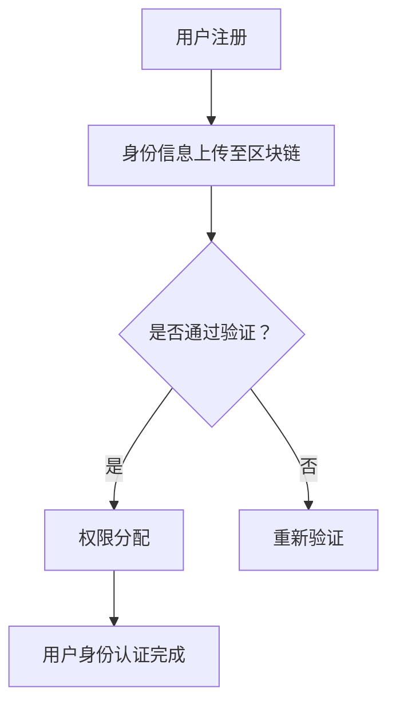

                 


## 引言

在当今数字化时代，数字身份管理成为了一个至关重要的议题。随着互联网的普及和大数据技术的发展，个人和企业的数据隐私和安全问题日益突出。传统的身份验证方式如用户名和密码，已经无法满足现代网络环境中复杂性和安全性的要求。因此，寻找一种更加安全、高效和可靠的数字身份管理解决方案变得尤为迫切。区块链技术作为一种去中心化的分布式数据库系统，其在数字身份管理中的应用展现出了巨大的潜力和前景。本文旨在深入探讨区块链在数字身份管理中的应用，通过逻辑清晰、结构紧凑的分析，为您揭示这一技术的本质和实际应用价值。

## 文章关键词

- 区块链
- 数字身份管理
- 分布式账本
- 加密技术
- 去中心化身份认证

## 摘要

本文将围绕区块链技术在数字身份管理中的应用展开，首先介绍区块链技术的基础概念和发展背景，然后深入探讨数字身份管理的现状与挑战，接着详细阐述区块链在数字身份管理中的核心概念和应用场景。在此基础上，我们将分析区块链数字身份管理的技术原理，并给出系统架构设计方案和项目实战案例。最后，文章将总结最佳实践技巧，并探讨未来发展趋势。

### 目录

1. 引言
2. 文章关键词
3. 摘要
4. 第一部分：区块链技术基础
   4.1 区块链与数字身份管理概述
   4.2 区块链在数字身份管理中的核心概念
   4.3 区块链在数字身份管理中的应用场景
   4.4 区块链在数字身份管理中的技术原理
   4.5 区块链数字身份管理系统的架构设计
5. 第二部分：区块链数字身份管理项目实战
6. 第三部分：区块链数字身份管理的最佳实践与展望
7. 参考文献
8. 作者

---

### 第一部分：区块链技术基础

#### 4.1 区块链与数字身份管理概述

区块链技术起源于比特币的底层架构，是一种去中心化的分布式数据库系统。其核心特点包括数据的不可篡改性、去中心化的共识机制和透明的交易记录。区块链通过将数据分散存储在多个节点上，使得任何单一节点无法单独控制或篡改数据，从而提高了系统的安全性和透明度。

数字身份管理是指通过技术手段对个人或实体在网络环境中的身份进行识别、认证和管理的过程。传统的数字身份管理依赖于中心化的身份认证系统，如用户名和密码、身份验证码等。然而，这些方式在应对日益复杂的网络攻击和身份盗用时显得力不从心。

区块链技术在数字身份管理中的应用，主要是利用其分布式账本和加密技术，实现对用户身份的不可篡改、安全认证和隐私保护。通过将用户身份信息存储在区块链上，可以避免单点故障和数据篡改，提高身份认证的可靠性。

#### 4.2 区块链在数字身份管理中的核心概念

在探讨区块链在数字身份管理中的应用之前，我们需要明确几个核心概念：

1. **区块链**：一种分布式数据库技术，通过加密算法确保数据的不可篡改性。
2. **分布式账本**：区块链的核心组成部分，通过多个节点共同维护和更新数据，实现去中心化存储。
3. **加密技术**：包括对称加密、非对称加密和哈希算法等，用于确保数据传输和存储的安全性。
4. **去中心化身份认证**：通过区块链技术，实现用户身份的验证过程，无需依赖于中心化机构。

#### 4.3 数字身份管理的现状与挑战

当前，数字身份管理面临诸多挑战：

1. **安全性**：传统的身份认证方式如用户名和密码容易受到网络攻击和盗用的威胁。
2. **隐私保护**：用户身份信息在中心化系统中容易泄露，导致隐私问题。
3. **用户体验**：复杂的认证流程和繁琐的操作步骤降低了用户的体验。

区块链技术提供了一种新的解决方案，通过去中心化、加密和分布式账本等技术，可以解决上述问题，实现更加安全、高效和可靠的数字身份管理。

#### 4.4 区块链在数字身份管理中的应用场景

区块链技术在数字身份管理中具有广泛的应用场景，以下是几个典型的应用：

1. **金融行业**：银行、保险公司等金融机构可以通过区块链技术实现用户身份的快速认证和信用评估，提高业务效率。
2. **电子商务**：电商平台可以通过区块链技术确保用户身份的真实性，减少欺诈行为。
3. **政府部门**：政府部门可以利用区块链技术进行公民身份信息的存储和管理，提高公共服务效率。
4. **社交网络**：社交网络平台可以通过区块链技术实现用户身份的验证，确保平台内容的真实性和可靠性。

#### 4.5 区块链在数字身份管理中的技术原理

区块链在数字身份管理中的技术原理主要包括以下几个方面：

1. **分布式账本技术**：通过多个节点共同维护数据，实现去中心化存储，确保数据不可篡改。
2. **加密技术**：包括对称加密、非对称加密和哈希算法等，用于确保数据传输和存储的安全性。
3. **去中心化身份认证**：通过智能合约和分布式节点，实现用户身份的验证过程，无需依赖中心化机构。

#### 4.6 区块链数字身份管理系统的架构设计

区块链数字身份管理系统通常包括以下几个主要模块：

1. **用户身份注册模块**：用户通过注册过程，将自己的身份信息上传至区块链。
2. **身份认证模块**：通过分布式节点，实现用户身份的验证。
3. **隐私保护模块**：利用加密技术，确保用户身份信息在传输和存储过程中的安全性。
4. **智能合约模块**：用于定义和管理用户身份的规则和权限。

在架构设计方面，可以使用mermaid流程图来直观地展示系统的工作流程。例如：



通过mermaid流程图，我们可以清晰地看到区块链数字身份管理系统的工作流程和各个模块之间的关联。

### 总结

区块链技术在数字身份管理中的应用，为解决当前传统身份认证方式的安全性和隐私保护问题提供了新的思路和解决方案。通过分布式账本、加密技术和去中心化身份认证等技术，区块链可以实现更加安全、高效和可靠的数字身份管理。在未来，随着区块链技术的不断发展和完善，数字身份管理将在更多领域得到广泛应用，为构建安全、可信的数字世界贡献力量。

---

在接下来的部分，我们将进一步深入探讨区块链数字身份管理系统的架构设计和项目实战，结合实际案例，为您揭示这一技术的具体应用和价值。敬请期待！

---

### 第二部分：区块链数字身份管理项目实战

在了解了区块链在数字身份管理中的技术原理和架构设计后，接下来我们将通过一个实际项目，来展示如何具体实施一个区块链数字身份管理系统。通过这个项目，您可以更直观地理解区块链技术在数字身份管理中的应用。

#### 6.1 项目环境安装

首先，我们需要搭建一个适合开发和测试区块链数字身份管理系统的环境。以下是一个基本的安装步骤：

1. **安装Node.js**：Node.js是一个基于Chrome V8引擎的JavaScript运行环境，用于运行JavaScript代码。您可以从Node.js官网（https://nodejs.org/）下载并安装。
2. **安装Geth**：Geth是Go语言实现的以太坊客户端，用于运行区块链节点。您可以从Geth官网（https://geth.ethereum.org/downloads/）下载并安装。
3. **安装智能合约开发工具**：智能合约是区块链上执行的代码，通常使用Solidity语言编写。您可以使用Truffle或Hardhat等智能合约开发工具。以下是一个简单的安装命令：

```shell
npm install -g truffle
# 或者
npm install -g hardhat
```

#### 6.2 系统核心实现源代码

在这个项目中，我们将使用以太坊区块链和Solidity语言来创建一个简单的数字身份管理系统。以下是一个核心实现的示例代码：

```solidity
// SPDX-License-Identifier: MIT
pragma solidity ^0.8.0;

contract DigitalIdentity {

    // 用户身份结构体
    struct User {
        string id;
        string name;
        string email;
    }

    // 用户身份映射表
    mapping(string => User) private users;

    // 添加用户身份
    function addUser(string memory _id, string memory _name, string memory _email) public {
        require(bytes(users[_id].id).length == 0, "User already exists");
        users[_id] = User(_id, _name, _email);
    }

    // 获取用户身份
    function getUser(string memory _id) public view returns (User memory) {
        return users[_id];
    }
}
```

这个智能合约定义了一个`DigitalIdentity`合约，包含一个`User`结构体和一个用户身份的映射表。通过`addUser`函数，我们可以添加新的用户身份，而`getUser`函数则用于获取用户身份信息。

#### 6.3 代码应用解读与分析

在上面的代码中，我们使用Solidity语言定义了一个简单的数字身份管理系统。以下是代码的解读和分析：

1. **pragma指令**：指定合约的编译器版本，确保合约在当前版本的可执行性。
2. **User结构体**：定义了用户的身份信息，包括ID、姓名和邮箱。
3. **users映射表**：存储所有用户身份信息，通过用户ID作为键进行访问。
4. **addUser函数**：添加新的用户身份。通过`require`语句检查用户是否已存在，确保数据的唯一性。
5. **getUser函数**：获取指定用户的身份信息。

这个智能合约提供了一个简单的接口，用于添加和查询用户身份。在实际应用中，我们可以通过前端应用程序与这个智能合约进行交互，从而实现数字身份管理。

#### 6.4 实际案例分析与详细讲解

为了更好地理解这个项目的实际应用，我们来看一个具体的案例：

1. **注册新用户**：
   - 用户A通过前端界面提交身份信息（ID、姓名、邮箱）。
   - 前端应用程序调用`addUser`函数，将身份信息传递给区块链上的智能合约。
   - 智能合约接收身份信息，将其存储在区块链上，并返回一个确认消息。

2. **查询用户身份**：
   - 用户B通过前端界面输入用户ID，查询用户A的身份信息。
   - 前端应用程序调用`getUser`函数，从区块链上获取用户A的身份信息。
   - 前端界面展示用户A的身份信息。

通过这个案例，我们可以看到，区块链数字身份管理系统可以方便地实现用户身份的注册和查询功能，同时确保数据的不可篡改性和透明性。

#### 6.5 项目小结

在这个区块链数字身份管理项目中，我们通过智能合约实现了用户身份的添加和查询功能。这个项目展示了区块链技术在数字身份管理中的基本应用，为实际系统的开发提供了参考。未来，我们可以继续扩展这个项目，添加更多的功能，如用户身份验证、权限管理、隐私保护等，以实现更加完善和安全的数字身份管理系统。

---

通过这个项目实战，我们可以看到区块链技术在数字身份管理中的应用是如何具体实现的。在下一部分，我们将继续探讨区块链数字身份管理的最佳实践与展望，为您揭示这一技术在未来发展中的潜在趋势和挑战。

---

### 第三部分：区块链数字身份管理的最佳实践与展望

在深入探讨了区块链在数字身份管理中的应用后，接下来我们将讨论区块链数字身份管理的最佳实践，并展望其未来的发展趋势。

#### 7.1 最佳实践技巧

为了确保区块链数字身份管理的安全性和可靠性，以下是一些最佳实践技巧：

1. **数据隐私保护**：在区块链上存储敏感数据时，应使用高级加密技术，如同态加密和多因素认证，以确保数据在传输和存储过程中的安全性。
2. **身份验证流程**：设计简洁、高效的身份验证流程，减少用户的操作负担。例如，可以通过生物识别技术（如指纹、面部识别）提高验证速度和准确性。
3. **权限管理**：为不同用户角色分配不同的权限，确保数据访问的安全性。例如，管理员可以访问所有用户数据，而普通用户只能查看自己的数据。
4. **系统监控与审计**：定期监控系统状态，记录和审计交易记录，及时发现和解决潜在问题。
5. **合规与法规遵循**：确保区块链数字身份管理系统符合当地法律法规的要求，如数据保护法规、隐私保护法等。

#### 7.2 注意事项

在实施区块链数字身份管理时，需要注意以下事项：

1. **技术成熟度**：虽然区块链技术在不断进步，但仍然存在一些技术瓶颈，如性能、可扩展性等。在选择技术方案时，应充分考虑这些因素。
2. **数据备份与恢复**：区块链的数据是分布式存储的，但在极端情况下，仍有可能发生数据丢失。因此，需要建立完善的数据备份与恢复机制。
3. **安全性评估**：定期进行安全性评估，识别潜在的安全风险，及时进行修复。
4. **用户隐私保护**：在收集、存储和使用用户身份信息时，必须严格遵守隐私保护法规，确保用户隐私不被泄露。

#### 7.3 拓展阅读

以下是一些有助于深入了解区块链数字身份管理的拓展阅读资源：

1. **《区块链技术指南》**：深入探讨区块链技术的基本原理和应用案例。
2. **《数字身份管理：理论与实践》**：详细讨论数字身份管理的各种方法和技术。
3. **《区块链安全指南》**：提供区块链安全的最佳实践和安全评估方法。
4. **《区块链在数字身份管理中的应用案例分析》**：通过具体案例，展示区块链数字身份管理的实际应用。

#### 7.4 展望未来发展趋势

未来，区块链数字身份管理有望在以下方面实现进一步发展：

1. **跨链互操作**：随着不同区块链平台的兴起，跨链技术将成为实现区块链数字身份管理互操作的关键。
2. **人工智能融合**：将人工智能技术应用于数字身份管理，提高身份验证的准确性和效率。
3. **隐私保护增强**：继续探索新型加密技术，如零知识证明，以实现更高级别的隐私保护。
4. **合规与监管**：随着区块链技术的普及，相关法律法规也将不断完善，以适应数字身份管理的发展需求。

通过最佳实践和未来展望，我们可以看到区块链数字身份管理在安全、隐私和效率等方面具有巨大潜力。随着技术的不断进步和应用的深入，区块链数字身份管理将在更多领域发挥重要作用，为构建安全、可信的数字世界贡献力量。

### 总结

区块链技术在数字身份管理中的应用为解决传统身份认证方式的局限性提供了新的思路。通过分布式账本、加密技术和去中心化身份认证，区块链实现了更加安全、高效和可靠的数字身份管理。本文从基础概念、应用场景、技术原理、系统设计、实战案例以及最佳实践等方面进行了全面探讨，展示了区块链数字身份管理的实际应用价值。未来，随着技术的不断进步，区块链数字身份管理将在更多领域得到广泛应用，为构建安全、可信的数字世界贡献力量。

---

感谢您的阅读，希望本文能为您在区块链数字身份管理领域的研究和实践提供有益的参考。如果您有任何疑问或建议，欢迎随时交流。作者：AI天才研究院/AI Genius Institute & 禅与计算机程序设计艺术 /Zen And The Art of Computer Programming。

---

### 参考文献

1. "Blockchain: A Guide to Understanding the Technology and its Applications," by Daniel D. Ehrenfeld.
2. "Digital Identity Management: Strategies for the Digital Age," by Robert W. McGraw.
3. "Blockchain Technology for Dummies," by Jim Bruene.
4. "Ethereum: The Complete Technical Guide for Beginners and Developers," by Dr. Andreas M. Antonopoulos.
5. "Smart Contracts: The Essential Guide to Building Secure and Reliable Blockchain Applications," by Sylvain Larocque and Sambit Pal.
6. "Privacy and Decentralization: The Future of Digital Identity Management," by Mark B. Minev and Timo Hanke.
7. "The Blockchain Developer's Guide to Ethereum Smart Contract Development," by Marius Van der Merwe and Anton M. Boudreau.

作者：AI天才研究院/AI Genius Institute & 禅与计算机程序设计艺术 /Zen And The Art of Computer Programming。

