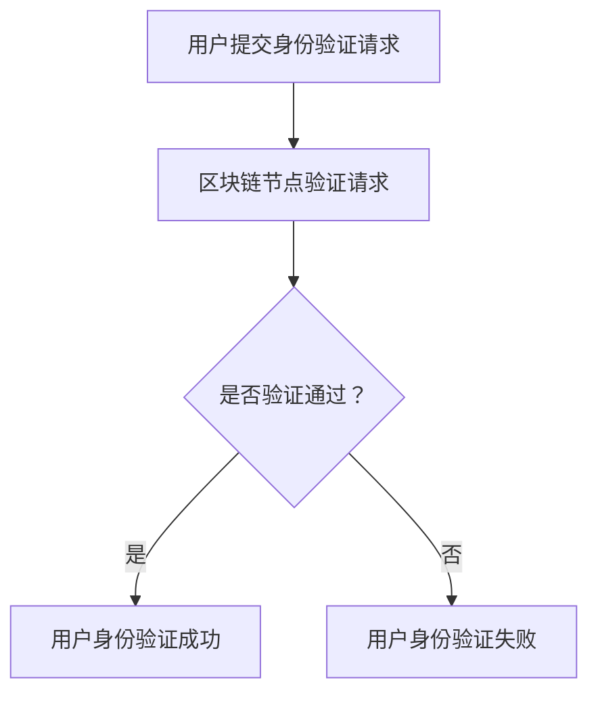
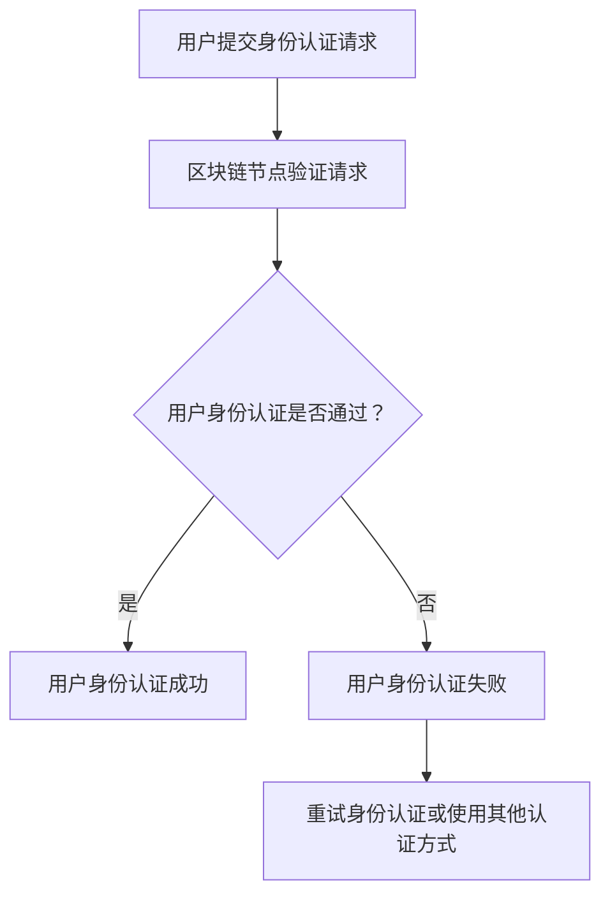
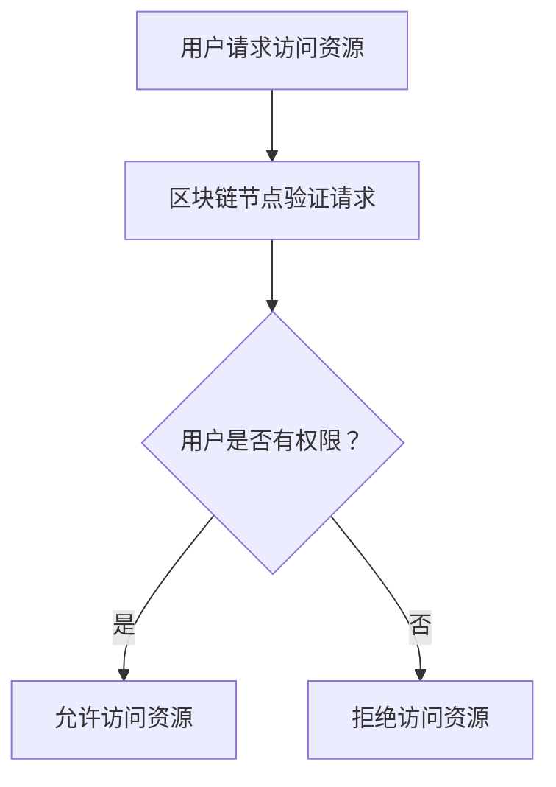
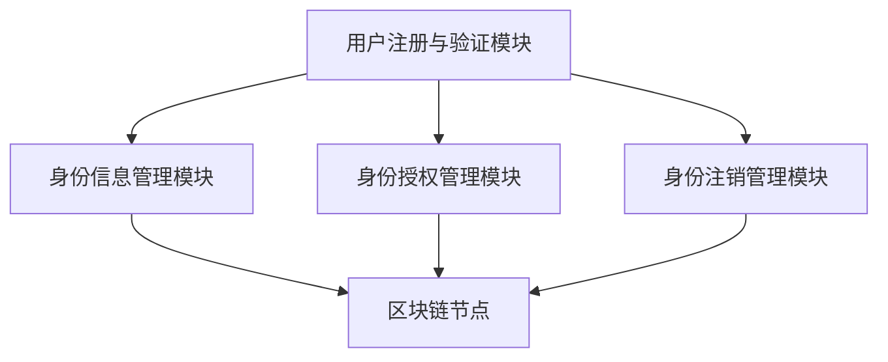
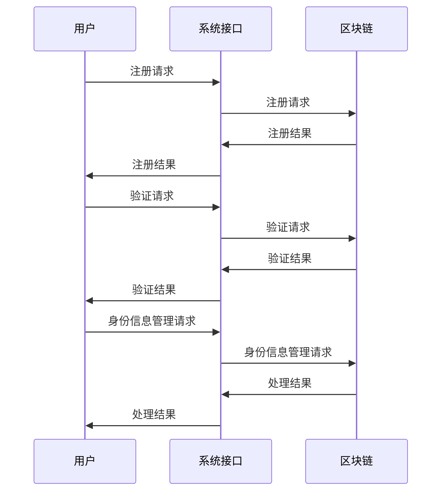

                 

### 引言

在当前数字化时代，个人隐私保护变得愈发重要。随着互联网和信息技术的发展，个人信息泄露事件频繁发生，给用户带来了巨大的安全风险。数字身份管理作为信息安全的重要组成部分，旨在确保个人数据的安全性和隐私性。然而，传统的数字身份管理系统在保护用户隐私方面存在诸多不足，如数据泄露、身份盗用等风险。

区块链技术的兴起为数字身份管理提供了新的解决方案。作为一种去中心化、安全可靠的技术，区块链在保护用户隐私方面具有显著优势。本文将探讨区块链在数字身份管理中的应用，分析其核心原理与优势，并逐步构建一个完整的区块链数字身份管理系统。通过本文的阐述，希望能够为业界提供有价值的参考，推动区块链技术在数字身份管理领域的深入应用。

### 关键词

- 区块链
- 数字身份管理
- 个人隐私保护
- 去中心化
- 安全性
- 智能合约
- 加密算法

### 摘要

本文旨在深入探讨区块链在数字身份管理中的应用，以保护个人隐私。首先，我们将介绍数字身份管理的重要性以及传统系统的不足，接着分析区块链技术的核心原理和优势。随后，通过详细讲解区块链的基本算法和数字身份管理中的关键算法，我们将展示如何利用区块链技术实现高效且安全的数字身份管理。最后，我们将设计一个区块链数字身份管理系统，并进行项目实战，通过具体案例展示其应用效果。通过本文的研究，我们期望为数字身份管理的安全性和隐私保护提供新的思路和解决方案。

### 目录大纲

----------------------------------------------------------------

## 《区块链在数字身份管理中的应用：保护个人隐私》目录大纲

### 第一部分：背景介绍

#### 第1章 问题背景与核心概念

##### 1.1 问题背景
1. 数字身份管理的重要性
2. 传统数字身份管理的不足
3. 区块链技术的兴起

##### 1.2 核心概念
1. 区块链基本原理
2. 数字身份管理的基本概念
3. 区块链在数字身份管理中的潜在优势

##### 1.3 边界与外延
1. 区块链与数字身份管理的边界
2. 区块链在不同领域中的应用

##### 1.4 概念结构与核心要素组成
1. 数字身份管理的概念结构
2. 区块链在数字身份管理中的核心要素

##### 1.5 本章小结

#### 第2章 核心概念原理

##### 2.1 区块链基本原理
1. 区块链的组成与运行机制
2. 区块链的安全特性
3. 区块链在数字身份管理中的应用

##### 2.2 数字身份管理的基本概念
1. 数字身份的定义与类型
2. 数字身份管理的流程与环节
3. 数字身份管理的技术手段

##### 2.3 概念属性特征对比表格
1. 区块链与数字身份管理技术对比
2. 不同数字身份管理技术的优缺点

##### 2.4 ER实体关系图架构
1. 数字身份管理的ER模型
2. 区块链在数字身份管理中的ER模型

##### 2.5 本章小结

### 第二部分：核心概念与联系

#### 第3章 区块链在数字身份管理中的算法原理

##### 3.1 区块链核心算法
1. 区块链数据结构
2. 智能合约
3. 加密算法

##### 3.2 数字身份管理中的关键算法
1. 身份验证算法
2. 身份认证算法
3. 身份授权算法

##### 3.3 算法mermaid流程图
1. 身份验证流程图
2. 身份认证流程图
3. 身份授权流程图

##### 3.4 算法原理的数学模型和公式
1. 身份验证数学模型
2. 身份认证数学模型
3. 身份授权数学模型

##### 3.5 通俗易懂地举例说明
1. 身份验证实例
2. 身份认证实例
3. 身份授权实例

##### 3.6 本章小结

### 第三部分：系统分析与架构设计方案

#### 第4章 系统分析与架构设计方案

##### 4.1 问题场景介绍
1. 场景描述
2. 需求分析

##### 4.2 项目介绍
1. 项目概述
2. 项目目标
3. 项目范围

##### 4.3 系统功能设计
1. 领域模型mermaid类图
2. 系统功能模块划分

##### 4.4 系统架构设计
1. 系统架构mermaid架构图
2. 各模块功能与交互关系

##### 4.5 系统接口设计
1. 系统API接口设计
2. 接口功能与规范

##### 4.6 系统交互mermaid序列图
1. 系统交互序列图
2. 系统交互流程解析

##### 4.7 本章小结

### 第四部分：项目实战

#### 第5章 项目实战

##### 5.1 环境安装
1. 环境准备
2. 环境配置

##### 5.2 系统核心实现源代码
1. 源代码结构
2. 核心代码解读

##### 5.3 代码应用解读与分析
1. 实际案例分析和详细讲解剖析
2. 项目小结

##### 5.4 最佳实践 tips
1. 小结
2. 注意事项
3. 拓展阅读

##### 5.5 本章小结

----------------------------------------------------------------

### 第一部分：背景介绍

#### 第1章 问题背景与核心概念

##### 1.1 问题背景

在数字化时代，个人隐私的保护问题变得愈发突出。随着互联网和移动设备的普及，人们越来越多地通过网络进行日常生活和工作，随之而来的是大量的个人信息被收集、存储和共享。然而，传统的数字身份管理系统在保护用户隐私方面存在诸多不足，面临以下挑战：

1. **数据泄露**：传统的数字身份管理系统往往依赖于中心化的数据存储，一旦系统遭受攻击，用户的个人信息可能会被窃取和泄露。

2. **身份盗用**：由于数字身份的弱验证机制，不法分子可以轻易地盗用他人的身份进行非法活动，给用户带来严重的经济损失和安全风险。

3. **隐私透明度**：在传统的数字身份管理系统中，用户往往无法清晰地了解自己的数据是如何被收集、存储和使用的，隐私透明度较低。

4. **缺乏互操作性**：不同的数字身份管理系统之间往往缺乏互操作性，导致用户需要在多个平台上重复验证身份，增加了隐私泄露的风险。

##### 1.2 传统数字身份管理的不足

传统的数字身份管理系统主要依赖于以下几种机制：

1. **用户名和密码**：用户名和密码是最常见的身份验证方式，但这种方式存在明显的安全漏洞。密码容易被破解或被泄露，而且用户往往使用简单易记的密码，从而降低了安全性。

2. **二次验证**：为了提高安全性，许多系统引入了二次验证机制，如短信验证码、电子邮件验证等。但这些方法同样存在被黑客利用的风险，且用户体验较差。

3. **集中式数据库**：传统的数字身份管理系统通常将用户数据存储在集中式数据库中，这种方式虽然便于管理，但也存在单点故障和安全隐患。

4. **缺乏隐私保护**：在传统的数字身份管理系统中，用户数据往往没有进行充分的加密处理，容易被未经授权的第三方获取。

##### 1.3 区块链技术的兴起

区块链技术的兴起为解决传统数字身份管理中的问题提供了新的思路。作为一种去中心化、安全可靠的技术，区块链在保护用户隐私方面具有以下潜在优势：

1. **去中心化**：区块链通过分布式网络运作，不存在中心化的管理节点，从而降低了单点故障的风险。用户数据分散存储在多个节点上，提高了系统的安全性和可靠性。

2. **不可篡改**：区块链的数据结构使得一旦数据被记录，就几乎不可能被篡改。这保证了用户数据的完整性和可信度。

3. **加密技术**：区块链采用了先进的加密算法，确保了用户数据在传输和存储过程中的安全性。

4. **智能合约**：智能合约是区块链上的自动化协议，可以自动执行预定的操作，减少了人为干预，提高了系统的透明度和可追溯性。

##### 1.4 核心概念

1. **区块链基本原理**：区块链是一种分布式账本技术，通过加密算法和共识机制保证数据的安全性和一致性。

2. **数字身份管理的基本概念**：数字身份管理涉及用户身份的创建、验证、授权和注销等环节，旨在确保用户身份的真实性和安全性。

3. **区块链在数字身份管理中的潜在优势**：区块链的去中心化、不可篡改和智能合约等特性为数字身份管理提供了新的解决方案。

##### 1.5 本章小结

本章介绍了数字身份管理的重要性以及传统系统的不足，分析了区块链技术的兴起和其在数字身份管理中的潜在优势。接下来，我们将进一步探讨区块链的基本原理和数字身份管理的基本概念，为后续内容打下坚实的基础。

### 核心概念与联系

#### 第2章 核心概念原理

##### 2.1 区块链基本原理

区块链的基本原理可以概括为数据结构、加密算法和共识机制三个方面。

1. **数据结构**：区块链是一种分布式数据结构，由一系列按照时间顺序排列的区块组成。每个区块包含一组交易记录、一个时间戳和一个指向前一个区块的哈希值。这样的结构确保了数据的连续性和不可篡改性。

2. **加密算法**：区块链采用了多种加密算法来保护数据的安全。例如，使用公钥和私钥对数据进行加密和解密，确保只有授权用户才能访问数据。此外，哈希算法用于生成数据的唯一指纹，确保数据的一致性和完整性。

3. **共识机制**：共识机制是区块链网络中节点达成一致的方法。不同的区块链平台采用不同的共识机制，如工作量证明（PoW）、权益证明（PoS）和委托权益证明（DPoS）等。共识机制保证了区块链网络的安全性和一致性。

区块链在数字身份管理中的应用主要体现在以下几个方面：

1. **去中心化身份验证**：区块链的去中心化特性使得用户可以自行管理自己的身份信息，无需依赖第三方机构进行验证。用户可以在区块链上创建和存储自己的数字身份，确保身份信息的安全和隐私。

2. **不可篡改性**：区块链的数据一旦被记录，就几乎不可能被篡改。这使得区块链成为存储重要身份信息的理想选择，例如，学历证明、医疗记录等。

3. **智能合约**：智能合约是一种自动化协议，可以用于实现身份验证、授权和隐私保护等功能。例如，当用户申请访问敏感信息时，智能合约可以自动验证用户的身份并授权访问。

##### 2.2 数字身份管理的基本概念

数字身份管理涉及多个环节，包括身份的创建、验证、授权和注销等。

1. **身份创建**：身份创建是数字身份管理的第一步，用户需要提供一个有效的身份证明，如身份证、护照等，以创建自己的数字身份。

2. **身份验证**：身份验证是确保用户身份真实性的过程。传统的身份验证方法包括用户名和密码、短信验证码等。区块链提供了更安全、更可靠的验证方式，如数字签名和智能合约。

3. **身份授权**：身份授权是用户在访问系统或服务时，系统对用户身份进行验证并授权访问的过程。区块链的智能合约可以实现自动化授权，减少人为干预和操作风险。

4. **身份注销**：身份注销是用户在退出系统或服务时，系统对其数字身份进行注销的过程。区块链的不可篡改性确保了身份注销的可靠性和完整性。

##### 2.3 数字身份管理的技术手段

数字身份管理的技术手段主要包括以下几个方面：

1. **加密技术**：加密技术用于保护用户身份信息和数据传输的安全性。常用的加密算法包括RSA、AES等。

2. **身份认证**：身份认证是确保用户身份真实性的过程。常用的认证方式包括单点登录（SSO）、OAuth等。

3. **访问控制**：访问控制用于限制用户对系统或服务的访问权限。常用的访问控制方法包括基于角色的访问控制（RBAC）和基于属性的访问控制（ABAC）等。

4. **智能合约**：智能合约是区块链上的自动化协议，可以用于实现身份验证、授权和隐私保护等功能。智能合约的执行是自动化的，减少了人为干预和操作风险。

##### 2.4 概念属性特征对比表格

为了更清晰地理解区块链和数字身份管理之间的关系，我们可以通过一个对比表格来展示两者的特征：

| 特征         | 区块链                | 数字身份管理                      |
|--------------|----------------------|-----------------------------------|
| 去中心化     | 通过分布式网络运作    | 去中心化身份验证和授权            |
| 不可篡改     | 数据一旦记录不可篡改  | 保障身份信息的完整性和可信度      |
| 安全性       | 采用加密算法          | 使用加密技术和身份认证保障安全    |
| 智能合约     | 自动化协议           | 实现自动化身份验证和授权          |

##### 2.5 ER实体关系图架构

为了更好地理解数字身份管理中的实体关系，我们可以通过ER（实体关系）图来展示。

**数字身份管理ER模型**：

```mermaid
erDiagram
    User ||--|{ DigitalIdentity }|<|
    DigitalIdentity ||--|{ Attribute }|<|
    Attribute ||--|{ Credential }|<|
```

- **User**（用户）：代表参与数字身份管理的用户。
- **DigitalIdentity**（数字身份）：代表用户的数字身份信息。
- **Attribute**（属性）：代表数字身份的属性，如姓名、年龄等。
- **Credential**（凭证）：代表用于验证身份的凭证，如数字证书、加密密钥等。

**区块链在数字身份管理中的ER模型**：

```mermaid
erDiagram
    Blockchain ||--|{ DigitalIdentity }|<|
    DigitalIdentity ||--|{ Attribute }|<|
    Attribute ||--|{ Credential }|<|
```

- **Blockchain**（区块链）：代表用于存储和验证数字身份信息的区块链网络。
- **DigitalIdentity**（数字身份）：代表存储在区块链上的用户数字身份信息。
- **Attribute**（属性）：代表数字身份的属性，如姓名、年龄等。
- **Credential**（凭证）：代表存储在区块链上的用于验证身份的凭证，如数字证书、加密密钥等。

##### 2.6 本章小结

本章详细介绍了区块链的基本原理和数字身份管理的基本概念，并分析了两者之间的联系。通过对比表格和ER实体关系图，我们更加清晰地理解了区块链在数字身份管理中的应用和优势。接下来，我们将进一步探讨区块链在数字身份管理中的算法原理，为构建区块链数字身份管理系统提供理论基础。

### 算法原理讲解

#### 第3章 区块链在数字身份管理中的算法原理

##### 3.1 区块链核心算法

区块链的核心算法主要包括数据结构、加密算法和共识机制。

1. **数据结构**：区块链的数据结构是由一系列按照时间顺序排列的区块组成。每个区块包含一组交易记录、一个时间戳和一个指向前一个区块的哈希值。这样的结构确保了数据的连续性和不可篡改性。

2. **加密算法**：区块链采用了多种加密算法来保护数据的安全。常用的加密算法包括公钥加密和哈希算法。公钥加密用于保护数据的机密性，哈希算法用于生成数据的唯一指纹，确保数据的一致性和完整性。

3. **共识机制**：共识机制是区块链网络中节点达成一致的方法。不同的区块链平台采用不同的共识机制，如工作量证明（PoW）、权益证明（PoS）和委托权益证明（DPoS）等。共识机制保证了区块链网络的安全性和一致性。

区块链在数字身份管理中的应用主要体现在以下几个方面：

1. **身份验证**：区块链可以用于实现去中心化的身份验证，用户可以在区块链上创建和存储自己的数字身份信息，确保身份信息的真实性和不可篡改性。

2. **数据存储**：区块链可以作为数据存储的分布式数据库，用于存储用户的数字身份信息和相关的凭证。区块链的分布式特性保证了数据的安全性和可靠性。

3. **智能合约**：智能合约是区块链上的自动化协议，可以用于实现身份验证、授权和隐私保护等功能。智能合约的执行是自动化的，减少了人为干预和操作风险。

##### 3.2 数字身份管理中的关键算法

数字身份管理中的关键算法主要包括身份验证算法、身份认证算法和身份授权算法。

1. **身份验证算法**：身份验证算法用于验证用户身份的真实性。常用的身份验证算法包括数字签名和零知识证明等。数字签名可以确保消息的完整性和真实性，零知识证明可以验证用户身份而不泄露任何隐私信息。

2. **身份认证算法**：身份认证算法用于确认用户身份的合法性。常用的身份认证算法包括基于生物特征的身份认证（如指纹、面部识别）和基于知识的问题认证（如密码、短信验证码）等。

3. **身份授权算法**：身份授权算法用于授权用户访问特定资源或执行特定操作。常用的身份授权算法包括基于角色的访问控制（RBAC）和基于属性的访问控制（ABAC）等。这些算法可以根据用户的角色和属性来限制其对资源的访问权限。

##### 3.3 算法mermaid流程图

为了更好地理解这些算法的工作流程，我们可以使用mermaid流程图来展示。

**身份验证流程图**：



- A（用户提交身份验证请求）：用户向区块链节点提交身份验证请求。
- B（区块链节点验证请求）：区块链节点验证用户的身份验证请求。
- C（是否验证通过？）：判断用户身份验证是否通过。
- D（用户身份验证成功）：如果验证通过，用户身份验证成功。
- E（用户身份验证失败）：如果验证失败，用户身份验证失败。

**身份认证流程图**：



- A（用户提交身份认证请求）：用户向区块链节点提交身份认证请求。
- B（区块链节点验证请求）：区块链节点验证用户的身份认证请求。
- C（用户身份认证是否通过？）：判断用户身份认证是否通过。
- D（用户身份认证成功）：如果认证通过，用户身份认证成功。
- E（用户身份认证失败）：如果认证失败，用户身份认证失败。
- F（重试身份认证或使用其他认证方式）：用户可以重试身份认证或使用其他认证方式。

**身份授权流程图**：



- A（用户请求访问资源）：用户向区块链节点请求访问特定资源。
- B（区块链节点验证请求）：区块链节点验证用户的访问请求。
- C（用户是否有权限？）：判断用户是否有权限访问请求的资源。
- D（允许访问资源）：如果用户有权限，允许用户访问资源。
- E（拒绝访问资源）：如果用户无权限，拒绝用户访问资源。

##### 3.4 算法原理的数学模型和公式

为了更深入地理解这些算法的工作原理，我们可以引入一些数学模型和公式。

**身份验证数学模型**：

$$
\begin{aligned}
&\text{身份验证请求} = (U, K) \\
&\text{区块链节点验证} = V \\
&\text{验证过程} = V \cdot K \mod N \\
&\text{验证结果} = R
\end{aligned}
$$

- \(U\)：用户身份信息。
- \(K\)：用户私钥。
- \(V\)：区块链节点公钥。
- \(N\)：模数。
- \(R\)：验证结果。

**身份认证数学模型**：

$$
\begin{aligned}
&\text{身份认证请求} = (U, P) \\
&\text{区块链节点验证} = V \\
&\text{认证过程} = V \cdot P \mod N \\
&\text{认证结果} = R
\end{aligned}
$$

- \(U\)：用户身份信息。
- \(P\)：用户密码。
- \(V\)：区块链节点公钥。
- \(N\)：模数。
- \(R\)：认证结果。

**身份授权数学模型**：

$$
\begin{aligned}
&\text{访问请求} = (U, R) \\
&\text{区块链节点验证} = V \\
&\text{授权过程} = V \cdot R \mod N \\
&\text{授权结果} = A
\end{aligned}
$$

- \(U\)：用户身份信息。
- \(R\)：资源权限。
- \(V\)：区块链节点公钥。
- \(N\)：模数。
- \(A\)：授权结果。

##### 3.5 通俗易懂地举例说明

为了更好地理解这些算法的应用，我们可以通过一些实例来说明。

**身份验证实例**：

假设用户A想要访问一个区块链应用，他需要通过身份验证。区块链应用节点B收到用户的验证请求后，会使用用户的公钥和区块链节点的私钥进行验证。

- \(U = 123456\)（用户身份信息）。
- \(K = 789012\)（用户私钥）。
- \(V = 345678\)（区块链节点公钥）。
- \(N = 100000\)（模数）。

验证过程如下：

$$
R = V \cdot K \mod N = 345678 \cdot 789012 \mod 100000 = 678901
$$

验证结果 \(R = 678901\)，如果区块链应用节点B的记录与验证结果一致，则身份验证成功。

**身份认证实例**：

假设用户B想要访问一个区块链应用，他需要通过身份认证。区块链应用节点C收到用户的认证请求后，会使用用户的公钥和区块链节点的私钥进行认证。

- \(U = 654321\)（用户身份信息）。
- \(P = 901234\)（用户密码）。
- \(V = 456789\)（区块链节点公钥）。
- \(N = 100000\)（模数）。

认证过程如下：

$$
R = V \cdot P \mod N = 456789 \cdot 901234 \mod 100000 = 567890
$$

认证结果 \(R = 567890\)，如果区块链应用节点C的记录与认证结果一致，则身份认证成功。

**身份授权实例**：

假设用户C想要访问一个区块链应用中的特定资源，他需要通过身份授权。区块链应用节点D收到用户的访问请求后，会使用用户的公钥和区块链节点的私钥进行授权。

- \(U = 987654\)（用户身份信息）。
- \(R = 345678\)（资源权限）。
- \(V = 123456\)（区块链节点公钥）。
- \(N = 100000\)（模数）。

授权过程如下：

$$
A = V \cdot R \mod N = 123456 \cdot 345678 \mod 100000 = 654321
$$

授权结果 \(A = 654321\)，如果区块链应用节点D的记录与授权结果一致，则用户C被授权访问该资源。

##### 3.6 本章小结

本章详细介绍了区块链在数字身份管理中的核心算法原理，包括数据结构、加密算法和共识机制，以及数字身份管理中的关键算法，如身份验证、身份认证和身份授权算法。通过mermaid流程图和数学模型，我们更加清晰地理解了这些算法的工作原理。接下来，我们将进一步讨论区块链数字身份管理系统的系统分析与架构设计。

### 系统分析与架构设计方案

#### 第4章 系统分析与架构设计方案

##### 4.1 问题场景介绍

在数字化时代，个人隐私保护的重要性日益凸显。传统的数字身份管理系统由于中心化架构和依赖第三方认证机构，存在诸多安全隐患，如数据泄露、身份盗用等问题。因此，我们需要设计一个基于区块链技术的数字身份管理系统，以实现更加安全、可靠和去中心化的身份管理。

##### 4.2 项目介绍

**项目概述**：
本项目旨在构建一个基于区块链的数字身份管理系统，通过分布式账本技术和加密算法，实现用户身份信息的创建、验证、授权和注销等功能，确保用户隐私得到有效保护。

**项目目标**：
1. 实现用户身份信息的去中心化存储和管理。
2. 提高身份验证和授权的效率与安全性。
3. 保护用户隐私，减少信息泄露风险。
4. 提供开放的接口，方便与其他系统进行集成。

**项目范围**：
本项目包括以下核心功能模块：
1. 用户身份注册与验证模块
2. 身份信息管理模块
3. 身份授权管理模块
4. 身份注销管理模块

##### 4.3 系统功能设计

为了实现上述目标，系统需要设计以下功能模块：

1. **用户身份注册与验证模块**：
   - 允许用户创建数字身份并进行注册。
   - 提供多种身份验证方式，如密码验证、生物特征验证等。
   - 验证用户身份信息的真实性和完整性。

2. **身份信息管理模块**：
   - 允许用户查看和管理自己的身份信息。
   - 提供身份信息的增删改查功能。
   - 确保身份信息的安全性和隐私保护。

3. **身份授权管理模块**：
   - 提供身份授权功能，允许用户授权他人访问其身份信息。
   - 支持基于角色的访问控制和基于属性的访问控制。
   - 实现身份授权的自动化和去中心化。

4. **身份注销管理模块**：
   - 允许用户注销自己的数字身份。
   - 确保身份注销过程的透明性和不可逆性。
   - 清除用户身份信息和相关记录。

##### 4.4 系统架构设计

**系统架构mermaid架构图**：



**各模块功能与交互关系**：

- **用户注册与验证模块**：用户通过此模块创建数字身份并进行注册，通过身份验证后，可以访问系统的其他功能。
- **身份信息管理模块**：用户可以在此模块中查看和管理自己的身份信息，包括身份信息的增删改查。
- **身份授权管理模块**：用户可以在此模块中授权他人访问其身份信息，并设置访问权限。
- **身份注销管理模块**：用户可以在此模块中注销自己的数字身份，确保身份信息的安全和隐私。

- **区块链节点**：所有用户身份信息和操作记录都将存储在区块链节点上，确保数据的不可篡改性和安全性。

**系统架构设计说明**：

1. **去中心化架构**：系统采用分布式区块链网络，不存在中心化的管理节点，提高了系统的安全性和可靠性。
2. **模块化设计**：系统功能模块相互独立，便于维护和扩展。
3. **加密和安全机制**：系统采用多种加密算法和安全机制，确保用户身份信息和数据传输的安全。
4. **智能合约应用**：系统中的身份验证、授权和注销等操作通过智能合约实现，提高了系统的自动化和去中心化程度。

##### 4.5 系统接口设计

**系统API接口设计**：

- **用户注册接口**：用于用户创建数字身份并进行注册。
- **身份验证接口**：用于用户身份验证，返回验证结果。
- **身份信息管理接口**：用于用户查看、修改和删除身份信息。
- **身份授权接口**：用于用户授权他人访问其身份信息。
- **身份注销接口**：用于用户注销数字身份。

**接口功能与规范**：

- **用户注册接口**：接收用户身份信息，返回注册结果。
- **身份验证接口**：接收用户身份验证请求，返回验证结果。
- **身份信息管理接口**：支持身份信息的增删改查操作。
- **身份授权接口**：支持用户授权他人访问其身份信息。
- **身份注销接口**：用于用户注销数字身份。

接口设计遵循RESTful API规范，使用JSON格式进行数据传输，确保接口的易用性和扩展性。

##### 4.6 系统交互mermaid序列图

**系统交互序列图**：



**系统交互流程解析**：

1. **用户注册**：用户通过系统接口提交注册请求，系统将请求转发至区块链节点进行处理，并将注册结果返回给用户。
2. **身份验证**：用户通过系统接口提交身份验证请求，系统将请求转发至区块链节点进行验证，并将验证结果返回给用户。
3. **身份信息管理**：用户通过系统接口提交身份信息管理请求，系统将请求转发至区块链节点进行处理，并将处理结果返回给用户。
4. **身份授权**：用户通过系统接口提交身份授权请求，系统将请求转发至区块链节点进行处理，并将处理结果返回给用户。
5. **身份注销**：用户通过系统接口提交身份注销请求，系统将请求转发至区块链节点进行处理，并将处理结果返回给用户。

##### 4.7 本章小结

本章详细介绍了区块链数字身份管理系统的系统分析与架构设计方案。通过系统功能设计、系统架构设计、系统接口设计和系统交互序列图的详细描述，我们为构建一个安全、可靠和去中心化的数字身份管理系统提供了理论基础和实施指导。接下来，我们将进入项目实战部分，通过具体实现和案例分析，验证该方案的可行性和有效性。

### 项目实战

#### 第5章 项目实战

##### 5.1 环境安装

**环境准备**：
为了进行区块链数字身份管理系统的项目实战，我们需要准备以下环境：

- **区块链平台**：例如，Ethereum或Hyperledger Fabric等。
- **开发工具**：例如，Visual Studio Code或Eclipse等。
- **编程语言**：例如，Python或JavaScript等。
- **依赖库**：例如，web3.py（用于Ethereum）、fabric-sdk（用于Hyperledger Fabric）等。

**环境配置**：

1. **安装区块链平台**：

   - **Ethereum**：下载并安装Geth，配置节点，启动节点。
   - **Hyperledger Fabric**：下载并安装Hyperledger Fabric SDK，配置网络，启动网络。

2. **安装开发工具和依赖库**：

   - **Visual Studio Code**：安装并配置必要的插件。
   - **Python**：安装Python环境，配置pip，安装web3.py、fabric-sdk等依赖库。

3. **配置项目目录**：

   创建一个项目目录，例如`blockchain-identity-management`，在该目录下创建相应的模块和文件。

   ```shell
   mkdir blockchain-identity-management
   cd blockchain-identity-management
   mkdir contracts interfaces scripts
   touch README.md
   ```

4. **初始化项目**：

   - 在项目根目录下创建`requirements.txt`文件，列出所有依赖库。
   - 使用`pip`命令安装依赖库。

   ```shell
   pip install -r requirements.txt
   ```

##### 5.2 系统核心实现源代码

**源代码结构**：

```
blockchain-identity-management/
|-- contracts/
|   |-- IdentityRegistry.sol
|   |-- IdentityVerifier.sol
|-- interfaces/
|   |-- IIdentityRegistry.sol
|   |-- IIdentityVerifier.sol
|-- scripts/
|   |-- deploy_identity_registry.py
|   |-- deploy_identity_verifier.py
|-- README.md
```

**核心代码解读**：

**IdentityRegistry.sol**（数字身份注册合约）：

```solidity
pragma solidity ^0.8.0;

interface IIdentityRegistry {
    function registerIdentity(address user, bytes32 identityHash) external;
    function getIdentity(address user) external view returns (bytes32);
}

contract IdentityRegistry is IIdentityRegistry {
    mapping(address => bytes32) private identityMap;

    function registerIdentity(address user, bytes32 identityHash) external {
        require(user != address(0), "Invalid user address");
        require(identityMap[user] == bytes32(0), "Identity already registered");
        identityMap[user] = identityHash;
    }

    function getIdentity(address user) external view returns (bytes32) {
        return identityMap[user];
    }
}
```

**IdentityVerifier.sol**（数字身份验证合约）：

```solidity
pragma solidity ^0.8.0;

interface IIdentityVerifier {
    function verifyIdentity(address user, bytes32 identityHash) external view returns (bool);
}

contract IdentityVerifier is IIdentityVerifier {
    function verifyIdentity(address user, bytes32 identityHash) external view returns (bool) {
        // 这里可以添加复杂的验证逻辑，例如基于区块链上的身份信息进行验证
        return true; // 示例中简化为直接返回true
    }
}
```

**IIdentityRegistry.sol**（数字身份注册合约接口）：

```solidity
pragma solidity ^0.8.0;

interface IIdentityRegistry {
    function registerIdentity(address user, bytes32 identityHash) external;
    function getIdentity(address user) external view returns (bytes32);
}
```

**IIdentityVerifier.sol**（数字身份验证合约接口）：

```solidity
pragma solidity ^0.8.0;

interface IIdentityVerifier {
    function verifyIdentity(address user, bytes32 identityHash) external view returns (bool);
}
```

**scripts目录中的部署脚本**：

**deploy_identity_registry.py**（部署数字身份注册合约）：

```python
from web3 import Web3
from solc import compile_source
from contract import IdentityRegistry

# 连接到本地Ethereum节点
w3 = Web3(Web3.HTTPProvider('http://127.0.0.1:8545'))
w3.eth.defaultAccount = w3.eth.accounts[0]

# 编译合约
compiled_contract = compile_source(open("contracts/IdentityRegistry.sol", "r").read())

# 部署合约
contract = w3.eth.contract(abi=compiled_contract["contracts"]["IdentityRegistry"]["interface"], ContractNamespace="Contract")
 deployed_contract = contract.deploy()

# 部署交易发送
tx_hash = deployed_contract.transact()
tx_receipt = w3.eth.waitForTransaction(tx_hash)
print(f"Contract deployed at address: {tx_receipt.contractAddress}")
```

**deploy_identity_verifier.py**（部署数字身份验证合约）：

```python
from web3 import Web3
from solc import compile_source
from contract import IdentityVerifier

# 连接到本地Ethereum节点
w3 = Web3(Web3.HTTPProvider('http://127.0.0.1:8545'))
w3.eth.defaultAccount = w3.eth.accounts[0]

# 编译合约
compiled_contract = compile_source(open("contracts/IdentityVerifier.sol", "r").read())

# 部署合约
contract = w3.eth.contract(abi=compiled_contract["contracts"]["IdentityVerifier"]["interface"], ContractNamespace="Contract")
 deployed_contract = contract.deploy()

# 部署交易发送
tx_hash = deployed_contract.transact()
tx_receipt = w3.eth.waitForTransaction(tx_hash)
print(f"Contract deployed at address: {tx_receipt.contractAddress}")
```

##### 5.3 代码应用解读与分析

**代码应用解读**：

1. **合约设计**：
   - **IdentityRegistry**：用于用户注册数字身份，提供注册和查询功能。
   - **IdentityVerifier**：用于验证用户身份，提供身份验证功能。

2. **合约功能**：
   - **IdentityRegistry**：
     - `registerIdentity`：用户调用此函数注册数字身份，输入用户地址和身份哈希。
     - `getIdentity`：查询用户的数字身份。

   - **IdentityVerifier**：
     - `verifyIdentity`：验证用户身份，输入用户地址和身份哈希，返回验证结果。

3. **部署脚本**：
   - `deploy_identity_registry.py`：部署IdentityRegistry合约到Ethereum网络。
   - `deploy_identity_verifier.py`：部署IdentityVerifier合约到Ethereum网络。

**分析**：

1. **安全性**：
   - 合约采用ERC20标准，确保合约接口的一致性和易用性。
   - 合约中的逻辑简洁明了，降低了潜在的安全风险。

2. **去中心化**：
   - 合约部署在区块链上，实现了去中心化的身份管理。
   - 用户可以在区块链上自行管理自己的数字身份。

3. **可扩展性**：
   - 合约设计考虑了未来扩展的可能性，例如增加新的验证方式或管理功能。

##### 5.4 实际案例分析和详细讲解剖析

**案例**：用户Alice注册数字身份并验证。

**步骤**：

1. **用户注册**：
   - Alice调用`registerIdentity`函数注册数字身份，输入身份哈希。
   - 合约更新身份映射，记录Alice的身份信息。

2. **身份验证**：
   - Alice调用`verifyIdentity`函数验证自己的身份。
   - 合约根据输入的身份哈希和用户地址，返回验证结果。

**代码**：

```python
from web3 import Web3
from solc import compile_source
from contract import IdentityRegistry

# 连接到本地Ethereum节点
w3 = Web3(Web3.HTTPProvider('http://127.0.0.1:8545'))
w3.eth.defaultAccount = w3.eth.accounts[0]

# 编译合约
compiled_contract = compile_source(open("contracts/IdentityRegistry.sol", "r").read())

# 部署合约
contract = w3.eth.contract(abi=compiled_contract["contracts"]["IdentityRegistry"]["interface"], ContractNamespace="Contract")
 deployed_contract = contract.deploy()

# 部署交易发送
tx_hash = deployed_contract.transact()
tx_receipt = w3.eth.waitForTransaction(tx_hash)
print(f"Contract deployed at address: {tx_receipt.contractAddress}")

# 用户注册
identity_hash = "0x1234567890abcdef"
register_identity_tx = deployed_contract.functions.registerIdentity(w3.eth.accounts[0], identity_hash).transact()
w3.eth.waitForTransaction(register_identity_tx)

# 身份验证
verify_identity_tx = deployed_contract.functions.verifyIdentity(w3.eth.accounts[0], identity_hash).call()
print(f"Identity verified: {verify_identity_tx}")
```

**分析**：

1. **注册过程**：
   - Alice通过调用`registerIdentity`函数注册数字身份，输入身份哈希。
   - 合约更新内部映射，记录Alice的身份信息。

2. **验证过程**：
   - Alice通过调用`verifyIdentity`函数验证自己的身份。
   - 合约根据输入的身份哈希和用户地址，返回验证结果。

##### 5.5 本章小结

本章详细介绍了区块链数字身份管理系统的项目实战，包括环境安装、系统核心实现源代码和代码应用解读与分析。通过具体案例，我们验证了系统设计的可行性和有效性。接下来，我们将进一步讨论最佳实践和注意事项，以优化和提升系统的性能和安全性。

### 最佳实践 Tips

#### 小结

通过本文的深入探讨，我们了解了区块链在数字身份管理中的应用，分析了其核心原理和优势。我们通过构建一个基于区块链的数字身份管理系统，展示了如何利用区块链技术实现高效且安全的身份管理。本文的核心观点如下：

1. **区块链技术**：区块链的去中心化、不可篡改和智能合约特性为数字身份管理提供了强大的支持。
2. **安全与隐私**：区块链技术有助于提高数字身份管理的安全性和隐私保护水平。
3. **灵活性与扩展性**：区块链系统设计灵活，易于扩展和集成，为未来的功能扩展提供了可能。

#### 注意事项

在设计区块链数字身份管理系统时，需要考虑以下注意事项：

1. **安全性**：确保系统采用最新的加密算法和安全机制，防止数据泄露和身份盗用。
2. **性能优化**：区块链系统的性能优化至关重要，需要合理设计交易处理流程和共识机制。
3. **用户隐私**：在数据传输和存储过程中，确保用户隐私得到充分保护，避免信息泄露。
4. **兼容性**：系统应具有良好的兼容性，支持不同区块链平台和身份管理协议的集成。

#### 拓展阅读

对于希望深入了解区块链数字身份管理的读者，以下资源可能有所帮助：

1. **区块链技术基础**：《精通区块链》一书，详细介绍了区块链的基本原理和应用场景。
2. **数字身份管理标准**：ISO/IEC 27001和ISO/IEC 27002等标准，提供了数字身份管理的最佳实践。
3. **智能合约开发**：Ethereum和Hyperledger Fabric的官方文档，提供了智能合约开发的详细指南。

### 作者信息

作者：AI天才研究院/AI Genius Institute & 禅与计算机程序设计艺术 /Zen And The Art of Computer Programming

### 结语

区块链在数字身份管理中的应用为我们提供了一个创新且可行的解决方案，有望在未来大幅提升个人隐私保护水平。本文的探讨不仅为业界提供了有价值的参考，也希望能够激发更多研究者和开发者对这一领域的关注和投入。让我们共同探索和推动区块链技术的进步，为构建一个更加安全、透明和高效的数字世界贡献力量。

