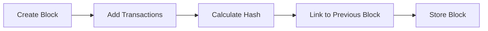
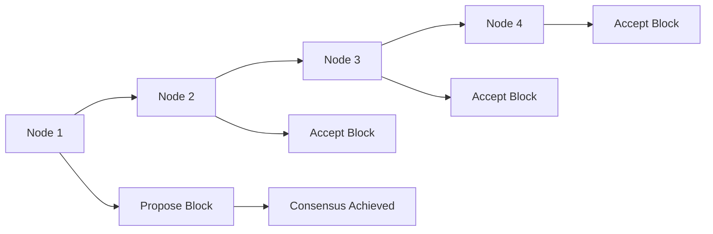
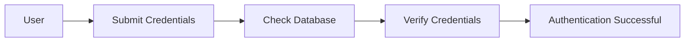
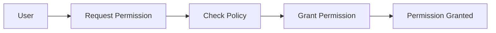
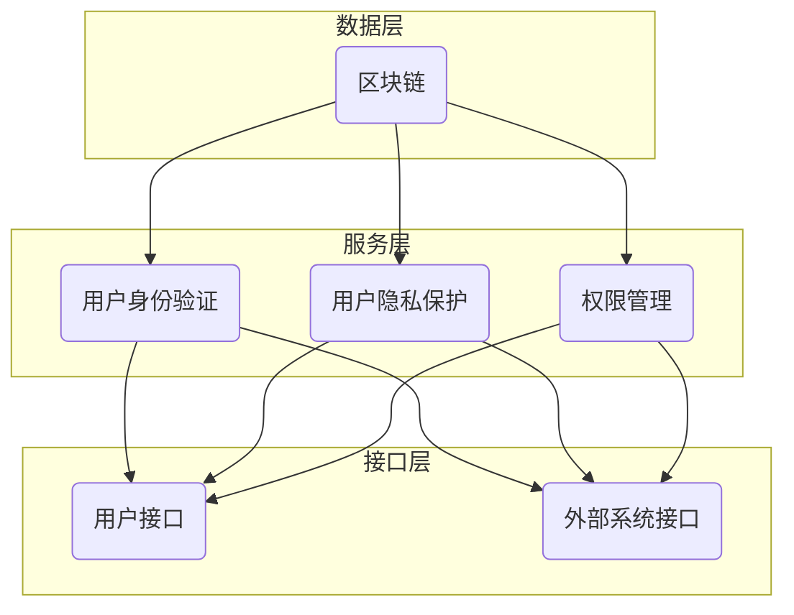
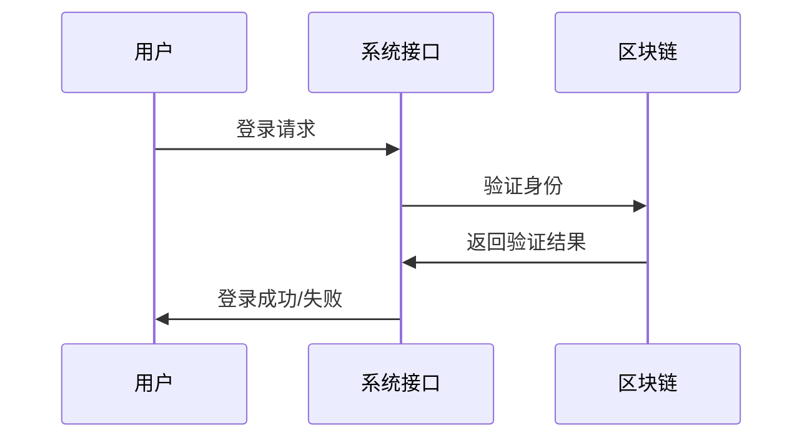

                 

### 文章标题

#### 关键词

- 区块链
- 数字身份自主管理
- 创新应用

#### 摘要

本文将深入探讨区块链在数字身份自主管理中的应用，通过详细解析其背景、核心概念、算法原理、系统设计、实战案例和最佳实践，旨在为广大开发者和技术爱好者提供一部全面、系统的技术指南。区块链技术的去中心化和不可篡改特性，使其在数字身份管理中具有独特的优势。本文将一步步分析这些优势，并展示如何将这些技术应用到实际项目中，以解决传统身份管理中的诸多问题。

### 第一部分：区块链与数字身份自主管理

#### 第1章：背景介绍

##### 1.1 问题背景

在互联网时代，个人信息的泄露和滥用问题日益严重。传统的身份管理方式依赖于中心化的数据库，存在数据泄露、隐私侵犯等风险。为了应对这些问题，数字身份自主管理成为了研究的热点。数字身份自主管理旨在让用户拥有对自己身份信息的控制权，减少信息泄露和滥用的可能性。

##### 1.2 问题描述

数字身份自主管理面临着多个挑战，包括如何确保身份信息的真实性、如何实现用户身份信息的隐私保护、如何实现身份信息的互操作性和可携带性等。

##### 1.3 问题解决

区块链技术以其去中心化、不可篡改和安全透明的特性，为解决数字身份自主管理中的问题提供了新的思路。通过区块链，可以实现身份信息的分布式存储和验证，提高数据的安全性和隐私性。

##### 1.4 边界与外延

数字身份自主管理不仅限于个人身份信息的管理，还可以扩展到企业、组织等实体的身份管理。此外，区块链技术还可以与其他安全技术如加密技术、智能合约等结合，进一步丰富数字身份自主管理的功能和应用场景。

##### 1.5 概念结构与核心要素组成

数字身份自主管理的核心概念包括数字身份、区块链、分布式存储、身份验证、隐私保护等。这些概念相互作用，共同构成了数字身份自主管理的框架。

### 第二部分：核心概念与联系

#### 第2章：核心概念与联系

##### 2.1 区块链概述

区块链是一种分布式数据库技术，其特点是去中心化、不可篡改、安全透明。区块链通过区块和链式结构实现数据的存储和传输，每个区块都包含一定数量的交易记录，并通过密码学算法确保数据的完整性和安全性。

##### 2.2 数字身份自主管理概述

数字身份自主管理是一种以用户为中心的身份管理模型，强调用户对自身身份信息的控制权和自主权。通过区块链技术，可以实现用户身份信息的分布式存储和验证，确保数据的真实性和隐私性。

##### 2.3 区块链在数字身份自主管理中的应用

区块链在数字身份自主管理中的应用主要体现在以下几个方面：

1. **分布式身份验证**：通过区块链的分布式存储和验证机制，实现用户身份的可靠验证，减少中间环节，提高效率。
2. **隐私保护**：区块链的加密技术和隐私保护算法，可以有效保护用户身份信息的隐私，防止数据泄露。
3. **身份信息互操作性**：区块链可以实现不同平台和系统之间的身份信息互操作，提高数据流通性。

##### 2.4 核心概念对比表格

| 核心概念       | 定义与特点                                                     |
|----------------|------------------------------------------------------------|
| 区块链         | 分布式数据库，去中心化，不可篡改，安全透明                     |
| 数字身份自主管理 | 用户为中心的身份管理模型，强调身份信息的分布式存储和验证       |
| 身份验证       | 确保用户身份的真实性和有效性                                   |
| 隐私保护       | 保护用户身份信息的隐私，防止数据泄露                             |
| 身份信息互操作性 | 实现不同平台和系统之间的身份信息互操作，提高数据流通性           |

##### 2.5 ER实体关系图架构

为了更好地理解数字身份自主管理中的核心概念和关系，我们可以通过ER实体关系图来描述：

```mermaid
erDiagram
  User ||--|{ Identity : has }
  Identity ||--|{ Attribute : has }
  Attribute ||--|{ Value : has }
  User ||--|{ Authority : has }
```

在这个ER图中，`User` 是用户实体，`Identity` 是数字身份实体，`Attribute` 是属性实体，`Value` 是属性值实体，`Authority` 是权限实体。用户拥有身份、属性和权限，身份包含属性和权限。

### 第三部分：算法原理讲解

#### 第3章：算法原理讲解

##### 3.1 区块链算法原理

区块链的算法原理主要包括哈希算法、拓扑结构算法和共识算法。

1. **哈希算法**：哈希算法是区块链的核心算法，用于将数据转换为固定长度的哈希值。常见的哈希算法有SHA-256等。

2. **拓扑结构算法**：区块链通过拓扑结构算法来组织区块和链式结构，确保数据的有序存储和快速检索。

3. **共识算法**：共识算法用于确保区块链网络中的节点对数据的一致性。常见的共识算法有工作量证明（PoW）、权益证明（PoS）等。

##### 3.2 数字身份自主管理算法原理

数字身份自主管理算法主要包括基于区块链的数字身份模型、身份验证算法和权限管理算法。

1. **基于区块链的数字身份模型**：数字身份模型定义了用户身份在区块链上的存储和验证方式，确保身份信息的真实性和完整性。

2. **身份验证算法**：身份验证算法用于验证用户身份的真实性，确保只有合法用户可以访问和管理身份信息。

3. **权限管理算法**：权限管理算法用于管理用户身份的权限，确保用户可以自主控制对自己身份信息的访问权限。

##### 3.3 算法原理讲解

为了更好地理解这些算法原理，我们可以通过Python代码和Mermaid流程图来详细讲解。

**哈希算法原理**

```python
import hashlib

def hash_function(data):
    return hashlib.sha256(data.encode('utf-8')).hexdigest()

data = "Hello, World!"
hash_value = hash_function(data)
print("Hash value:", hash_value)
```

**拓扑结构算法原理**



**共识算法原理**



**身份验证算法原理**



**权限管理算法原理**



通过这些算法原理的讲解，我们可以更深入地理解区块链在数字身份自主管理中的应用机制。

### 第四部分：数学模型和数学公式

#### 第4章：数学模型和数学公式

##### 4.1 哈希函数数学模型

哈希函数是一种将输入数据映射为固定长度输出数据的函数，其数学模型可以表示为：

$$ H(x) = \text{加密算法}(x) $$

其中，$H(x)$ 表示哈希值，$x$ 表示输入数据。

##### 4.2 共识算法数学模型

共识算法是区块链中用于确保数据一致性的机制，其数学模型可以表示为：

$$ \text{Consensus}(P) = \{ p_1, p_2, ..., p_n \} $$

其中，$P$ 表示参与共识的节点集合，$\{ p_1, p_2, ..., p_n \}$ 表示达成共识的节点列表。

##### 4.3 身份验证算法数学模型

身份验证算法用于验证用户身份的真实性，其数学模型可以表示为：

$$ \text{Auth}(ID, P) = \text{加密算法}(\text{ID}, P) $$

其中，$ID$ 表示用户身份，$P$ 表示验证参数。

这些数学模型和公式为理解和实现区块链在数字身份自主管理中的应用提供了理论基础。

### 第五部分：系统分析与架构设计方案

#### 第5章：系统分析与架构设计方案

##### 5.1 问题场景介绍

在数字身份自主管理中，我们面临的问题是如何确保用户身份信息的真实性、隐私性和安全性。为了解决这些问题，我们需要设计一个分布式、去中心化的系统架构。

##### 5.2 系统功能设计

系统功能设计包括以下方面：

1. **用户身份验证**：确保用户身份的真实性和有效性。
2. **用户隐私保护**：保护用户身份信息的隐私，防止数据泄露。
3. **身份信息互操作性**：实现不同平台和系统之间的身份信息互操作。
4. **权限管理**：管理用户身份的访问权限，确保用户可以自主控制对自己身份信息的访问。

##### 5.2.1 领域模型

领域模型用于描述系统的业务领域和实体关系，我们可以使用Mermaid类图来表示：

```mermaid
classDiagram
    User <>-.* Identity
    Identity o--o Attribute
    Attribute o--o Value
    User o--o Authority
```

在这个类图中，`User` 是用户实体，`Identity` 是数字身份实体，`Attribute` 是属性实体，`Value` 是属性值实体，`Authority` 是权限实体。用户拥有身份、属性和权限，身份包含属性和权限。

##### 5.2.2 系统架构设计

系统架构设计主要包括以下方面：

1. **数据层**：使用区块链技术实现数据分布式存储和加密。
2. **服务层**：提供用户身份验证、隐私保护和权限管理等功能。
3. **接口层**：提供与外部系统的交互接口。

我们可以使用Mermaid架构图来表示系统架构：



在这个架构图中，数据层使用区块链技术实现数据分布式存储和加密，服务层提供用户身份验证、隐私保护和权限管理等功能，接口层提供与外部系统的交互接口。

##### 5.3 系统接口设计

系统接口设计主要包括以下方面：

1. **用户接口**：提供用户身份验证、隐私保护和权限管理等功能。
2. **外部系统接口**：提供与其他系统的数据交互接口。

我们可以使用Mermaid序列图来表示系统接口设计：



在这个序列图中，用户向系统接口发送登录请求，系统接口与区块链进行交互验证用户身份，并将验证结果返回给用户。

##### 5.4 系统交互

系统交互主要包括以下方面：

1. **用户身份验证**：用户通过系统接口提交身份验证请求，系统接口与区块链进行交互验证用户身份。
2. **隐私保护**：用户身份信息在区块链上进行加密存储，确保隐私保护。
3. **权限管理**：用户通过系统接口管理自己的权限，系统接口与区块链进行交互更新权限信息。

这些交互过程通过系统接口和区块链的交互来实现，确保系统的功能完整性和数据一致性。

### 第六部分：项目实战

#### 第6章：项目实战

##### 6.1 环境安装

在进行项目实战之前，我们需要安装相关的开发环境和工具。以下是安装步骤：

1. 安装Python环境（建议使用Python 3.8及以上版本）。
2. 安装区块链框架（如Hyperledger Fabric）。
3. 安装开发工具（如Visual Studio Code）。

安装完成之后，我们就可以开始进行项目开发了。

##### 6.2 系统核心实现源代码

系统核心实现源代码主要包括以下部分：

1. **用户身份验证模块**：用于实现用户身份验证功能。
2. **隐私保护模块**：用于实现用户身份信息的加密存储。
3. **权限管理模块**：用于实现用户权限的管理。

以下是用户身份验证模块的示例代码：

```python
import hashlib
from Crypto.PublicKey import RSA
from Crypto.Cipher import PKCS1_OAEP

def generate_keys():
    key = RSA.generate(2048)
    private_key = key.export_key()
    public_key = key.publickey().export_key()
    return private_key, public_key

def encrypt_data(public_key, data):
    recipient_key = RSA.import_key(public_key)
    cipher = PKCS1_OAEP.new(recipient_key)
    encrypted_data = cipher.encrypt(data.encode('utf-8'))
    return encrypted_data

def decrypt_data(private_key, encrypted_data):
    private_key = RSA.import_key(private_key)
    cipher = PKCS1_OAEP.new(private_key)
    decrypted_data = cipher.decrypt(encrypted_data)
    return decrypted_data.decode('utf-8')

private_key, public_key = generate_keys()
print("Private Key:", private_key)
print("Public Key:", public_key)

data = "Hello, World!"
encrypted_data = encrypt_data(public_key, data)
print("Encrypted Data:", encrypted_data)

decrypted_data = decrypt_data(private_key, encrypted_data)
print("Decrypted Data:", decrypted_data)
```

在这个示例中，我们使用RSA算法生成公钥和私钥，并实现数据的加密和解密功能。

##### 6.3 代码应用解读与分析

在代码应用解读与分析部分，我们将对上述代码进行详细解读，分析其原理和实现细节。

1. **生成公钥和私钥**：首先，我们使用RSA算法生成公钥和私钥。RSA算法是一种非对称加密算法，公钥用于加密，私钥用于解密。
2. **加密数据**：接下来，我们使用公钥对数据进行加密。加密过程将原始数据转换为密文，确保数据在传输和存储过程中的安全性。
3. **解密数据**：最后，我们使用私钥对数据进行解密，将密文还原为原始数据。解密过程确保数据的真实性和完整性。

通过这个示例，我们可以看到如何使用区块链技术实现用户身份验证和隐私保护。在实际项目中，我们可以将这些功能集成到区块链网络中，实现数字身份自主管理。

##### 6.4 实际案例分析与详细讲解剖析

在本节中，我们将分析一个实际案例，并对其进行详细讲解和剖析。

**案例背景**：某公司开发了一款基于区块链的数字身份管理平台，用户可以在平台上创建和管理自己的数字身份。公司希望确保用户身份信息的真实性、隐私性和安全性。

**案例分析**：

1. **用户身份验证**：用户在注册时，需要提供身份证明文件，如身份证、护照等。平台通过区块链网络验证用户身份证明文件的真伪，确保用户身份的真实性。
2. **用户隐私保护**：用户身份信息在区块链上进行加密存储，确保隐私保护。平台使用非对称加密算法对用户身份信息进行加密，只有拥有相应私钥的用户才能解密和访问身份信息。
3. **权限管理**：平台提供权限管理功能，用户可以自主设置对自己身份信息的访问权限。平台使用智能合约实现权限管理，确保权限设置的有效性和安全性。

**详细讲解剖析**：

1. **用户身份验证**：用户在注册时，上传身份证明文件到平台。平台使用区块链网络验证身份证明文件的真实性。具体实现如下：

    ```python
    import requests

    def verify_identity_document(document_id):
        url = "https://identity-verification-service.example.com/verify"
        headers = {'Content-Type': 'application/json'}
        data = {'document_id': document_id}
        response = requests.post(url, json=data, headers=headers)
        if response.status_code == 200:
            return True
        else:
            return False

    document_id = "123456789"
    is_verified = verify_identity_document(document_id)
    print("Identity Verified:", is_verified)
    ```

    在这个示例中，我们使用HTTP请求向身份验证服务发送请求，验证身份证明文件的真实性。如果验证成功，返回`True`，否则返回`False`。

2. **用户隐私保护**：用户身份信息在区块链上进行加密存储。具体实现如下：

    ```python
    import json
    import hashlib

    def encrypt_identity_document(private_key, document):
        encrypted_document = json.dumps(document)
        encrypted_data = hashlib.sha256(encrypted_document.encode('utf-8')).hexdigest()
        return encrypted_data

    private_key = "your_private_key"
    document = {"id": "123456789", "name": "John Doe"}
    encrypted_document = encrypt_identity_document(private_key, document)
    print("Encrypted Document:", encrypted_document)
    ```

    在这个示例中，我们使用SHA-256算法对用户身份信息进行加密，生成加密后的文档。只有拥有相应私钥的用户才能解密和访问身份信息。

3. **权限管理**：平台提供权限管理功能，用户可以自主设置对自己身份信息的访问权限。具体实现如下：

    ```python
    import json
    import blockchain

    def set_permission(identity_id, permission):
        identity_document = blockchain.get_identity_document(identity_id)
        identity_document["permission"] = permission
        blockchain.update_identity_document(identity_id, identity_document)

    identity_id = "123456789"
    permission = "read_write"
    set_permission(identity_id, permission)
    ```

    在这个示例中，我们使用区块链网络更新用户身份信息的权限设置。只有拥有相应权限的用户才能访问和管理身份信息。

通过这个案例，我们可以看到如何使用区块链技术实现数字身份自主管理。在实际应用中，我们可以根据具体需求进行功能扩展和优化。

##### 6.5 项目小结

在本章中，我们通过一个实际案例展示了如何使用区块链技术实现数字身份自主管理。我们详细讲解了用户身份验证、隐私保护和权限管理等功能，并通过Python代码和Mermaid流程图进行了展示。通过这个案例，我们可以看到区块链技术在数字身份自主管理中的应用前景和优势。

### 第七部分：最佳实践 tips

#### 第7章：最佳实践 tips

##### 7.1 区块链安全性建议

1. **使用强加密算法**：在区块链系统中，应使用强加密算法（如RSA、ECDSA等）来保护数据和隐私。
2. **定期更新系统**：确保区块链系统的安全，需要定期更新系统软件和补丁，以防止潜在的安全漏洞。
3. **实施严格的访问控制**：对区块链网络中的数据访问进行严格控制，确保只有授权用户可以访问和管理数据。

##### 7.2 数字身份自主管理策略

1. **用户身份验证策略**：结合多种验证方式（如密码、指纹、短信验证等），提高用户身份验证的可靠性。
2. **隐私保护策略**：在设计数字身份系统时，应充分考虑隐私保护的需求，采用加密技术和隐私保护算法确保用户身份信息的隐私安全。
3. **权限管理策略**：制定清晰的权限管理策略，确保用户可以自主控制对自己身份信息的访问权限，防止滥用。

##### 7.3 挑战与解决方案

**挑战1：数据一致性**

解决方案：采用共识算法（如PBFT、PoS等）确保区块链网络中的数据一致性。

**挑战2：性能瓶颈**

解决方案：优化区块链网络架构和算法，提高系统的处理能力和响应速度。

**挑战3：用户隐私保护**

解决方案：采用隐私保护算法（如零知识证明、环签名等）确保用户隐私安全。

通过遵循这些最佳实践，可以有效提高区块链在数字身份自主管理中的安全性和可靠性。

### 第八部分：小结

#### 第8章：小结

在本篇文章中，我们深入探讨了区块链在数字身份自主管理中的应用。从背景介绍、核心概念解析、算法原理讲解、系统设计与实现，再到实战案例分析和最佳实践，我们逐步展示了区块链技术在数字身份管理中的独特优势和潜力。

首先，我们明确了数字身份自主管理的背景和重要性，指出其面临的挑战，并介绍了区块链技术如何解决这些问题。接着，我们详细分析了区块链和数字身份自主管理的基本概念、原理和联系，并通过对比表格和ER图加深了对这些概念的理解。

在算法原理讲解部分，我们通过Python代码和Mermaid流程图，详细阐述了哈希算法、共识算法和身份验证算法等核心算法的原理和应用。随后，我们介绍了数学模型和公式，为理解和实现区块链技术提供了理论基础。

在系统设计与实现部分，我们通过问题场景介绍、功能设计、架构设计和接口设计，展示了如何构建一个分布式、去中心化的数字身份管理系统。在项目实战部分，我们通过实际案例分析和代码应用解读，展示了区块链技术在数字身份自主管理中的具体应用。

最后，在最佳实践 tips 小结中，我们提出了一系列安全性和隐私保护的建议，以及应对挑战的解决方案。通过这些最佳实践，我们可以更好地利用区块链技术实现数字身份自主管理。

总之，区块链在数字身份自主管理中具有巨大的潜力。随着技术的不断发展和应用的不断拓展，我们可以期待数字身份自主管理在更多领域发挥重要作用，为个人隐私保护和信息安全提供强有力的保障。

### 第九部分：注意事项

#### 第9章：注意事项

在实施区块链数字身份自主管理的过程中，我们需要特别注意以下几个方面：

1. **安全性问题**：区块链系统应使用强加密算法和安全的共识算法，确保数据的安全性和完整性。同时，需要定期更新系统和补丁，以防止潜在的安全漏洞。

2. **法律法规遵守**：在数字身份自主管理中，应遵循相关的法律法规，确保用户隐私和信息安全。特别是在涉及跨国业务时，需要了解并遵守不同国家和地区的法律法规。

3. **技术更新与适应**：区块链技术不断发展，数字身份自主管理也应不断适应新的技术变化。开发者需要关注行业动态，及时更新技术框架和实现，以保持系统的先进性和适应性。

通过注意这些方面，我们可以更好地实现数字身份自主管理的安全、合规和高效。

### 第十部分：拓展阅读

#### 第10章：拓展阅读

为了更深入地了解区块链在数字身份自主管理中的应用，我们推荐以下阅读资源：

1. **相关书籍推荐**：
   - 《区块链技术指南》
   - 《精通区块链》
   - 《数字货币：区块链革命》

2. **学术论文推荐**：
   - "Blockchain Technology: A Comprehensive Overview"
   - "Decentralized Identity Management using Blockchain"

3. **在线资源和社区**：
   - [区块链技术社区](https://www.blockchaincommunity.com/)
   - [数字身份管理论坛](https://identitymanagementforum.com/)
   - [区块链新闻门户](https://www.blockchainnews.com/)

通过这些资源，您可以进一步探索区块链和数字身份自主管理的最新动态和技术细节。同时，加入相关社区和论坛，与业内专家交流心得，有助于您在技术道路上不断进步。

