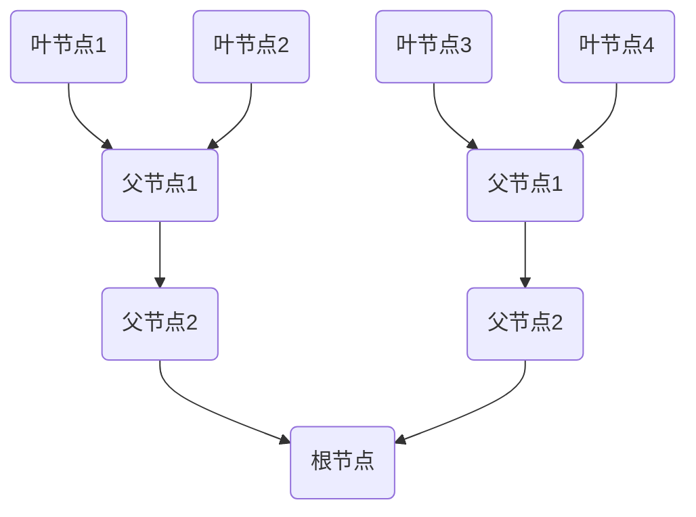
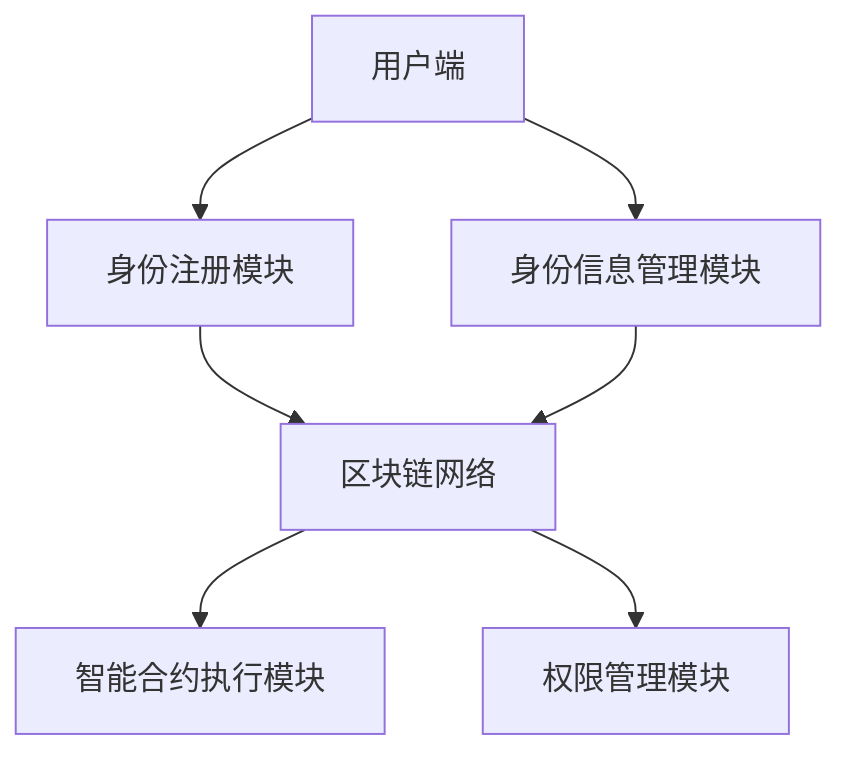
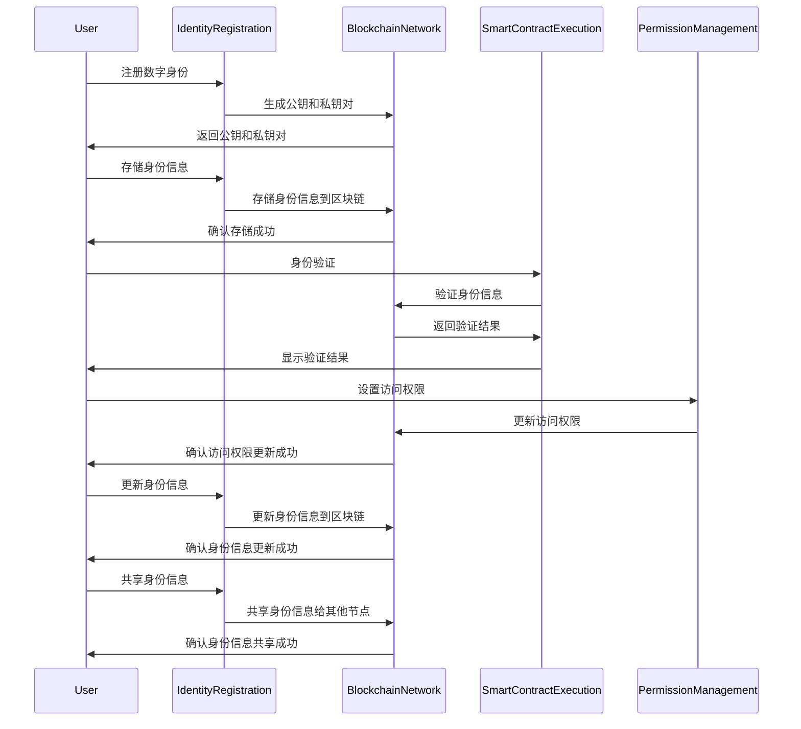

                 

### 文章标题

《区块链在数字身份自主管理中的应用前景》

### 关键词

区块链，数字身份，自主管理，分布式账本，智能合约，去中心化身份验证

### 摘要

本文旨在探讨区块链技术在数字身份自主管理中的应用前景。我们将从背景介绍开始，逐步分析区块链与数字身份、自主管理的核心概念及其联系，深入讲解区块链技术在数字身份管理中的应用原理和算法，最后提出一个系统架构设计方案，以期为相关领域的研究和应用提供有价值的参考。

---

## 背景介绍

### 1.1.1 问题背景

在信息化时代，数字身份已经成为人们日常生活中的重要组成部分。然而，传统的数字身份管理面临着诸多挑战，如数据泄露、隐私风险、中心化管理效率低下等。这些问题引发了对于更安全、更自主的数字身份管理解决方案的需求。

区块链技术的兴起为数字身份管理提供了新的可能性。区块链作为一种去中心化的分布式账本技术，具有不可篡改、透明度高、参与方无需信任等特性，使其在数字身份自主管理中具有巨大的应用潜力。

### 1.1.2 问题描述

数字身份管理的需求主要包括：确保身份信息的真实性、隐私性、安全性和可控性。自主管理则强调个体对自身数字身份的控制权，避免中心化管理的局限性。当前，数字身份管理的主要问题在于：

- **数据泄露**：用户身份信息容易在中心化系统中被黑客攻击窃取。
- **隐私风险**：用户在多个平台上使用同一身份，可能导致隐私泄露。
- **中心化风险**：中心化管理方式可能导致单点故障和垄断风险。
- **权限控制**：传统系统在权限控制方面存在一定的缺陷，难以实现精细化管理。

### 1.1.3 问题解决

区块链技术通过分布式账本和智能合约，能够有效解决传统数字身份管理中面临的问题。具体来说：

- **数据安全**：区块链的不可篡改性确保了用户身份信息的真实性和安全性。
- **隐私保护**：通过加密技术和隐私保护算法，用户可以在不暴露真实信息的情况下验证身份。
- **去中心化**：分布式账本消除了中心化管理的单点故障和垄断风险。
- **自主控制**：用户可以通过智能合约实现自我管理，减少对第三方机构的依赖。

### 1.1.4 边界与外延

区块链在数字身份管理中的应用不仅限于个人身份，还可以扩展到企业、物联网设备等多种场景。此外，区块链与其他技术的结合，如人工智能、物联网等，将进一步拓展数字身份自主管理的应用前景。

### 1.1.5 概念结构与核心要素组成

本节将介绍区块链、数字身份和自主管理的基本概念及其在数字身份自主管理中的应用。

#### 区块链的基本原理

区块链是一种去中心化的分布式数据库，通过加密算法和共识机制确保数据的安全性和一致性。其核心特点包括：

- **分布式账本**：区块链记录的数据分布在多个节点上，确保了数据的备份和安全性。
- **不可篡改**：一旦数据记录在区块链上，就几乎无法篡改，提高了数据的可信度。
- **透明性**：区块链的运作过程对所有参与者透明，有助于提高系统的信任度。
- **共识机制**：区块链通过共识机制确保所有节点对数据的一致性。

#### 数字身份的定义与分类

数字身份是指个体或实体在数字世界中的唯一标识。根据应用场景，数字身份可以分类为：

- **个人数字身份**：用于个人的唯一身份标识，如电子身份证、电子护照等。
- **企业数字身份**：用于企业的唯一标识，如电子营业执照、电子印章等。
- **设备数字身份**：用于物联网设备，如智能家电、智能传感器等。

#### 自主管理的概念与实现机制

自主管理是指个体或实体对自身数字身份的控制和管理。实现自主管理的关键技术包括：

- **加密技术**：用于保护数字身份信息的隐私和安全。
- **智能合约**：用于自动化执行身份验证、授权等操作。
- **去中心化身份验证**：通过分布式网络实现身份验证，减少对中心化服务器的依赖。

### 1.2 核心概念与联系

本节将详细讨论区块链、数字身份和自主管理的核心概念，并分析它们之间的联系。

#### 区块链核心概念

区块链的核心概念包括：

- **区块链**：一种分布式账本，记录数据交易和历史。
- **区块**：区块链的基本单位，包含一定数量的交易记录。
- **链式结构**：区块链通过区块的链接形成一个链式结构，确保数据的一致性。
- **加密算法**：用于保护数据的安全和隐私。

#### 数字身份核心概念

数字身份的核心概念包括：

- **数字身份**：个体或实体的唯一标识。
- **身份认证**：验证数字身份的真实性和有效性。
- **身份信息**：与数字身份相关的个人信息和属性。
- **身份服务**：提供数字身份管理服务的系统或平台。

#### 自主管理核心概念

自主管理的核心概念包括：

- **自主性**：个体对自身数字身份的控制权。
- **隐私保护**：保护个体隐私不被第三方滥用。
- **自主控制**：通过加密技术和智能合约实现自我管理。
- **去中心化**：减少对中心化服务器的依赖，提高系统可靠性。

#### 概念属性特征对比表格

下表对比了区块链、数字身份和自主管理的属性特征：

| 特性 | 区块链 | 数字身份 | 自主管理 |
| --- | --- | --- | --- |
| 去中心化 | 是 | 否 | 是 |
| 安全性 | 高 | 中 | 高 |
| 透明性 | 高 | 低 | 中 |
| 自主性 | 高 | 低 | 高 |
| 可控性 | 高 | 低 | 高 |

#### ER实体关系图架构

```mermaid
erDiagram
  User ||--|{ Blockchain }|| Blockchain
  User ||--|{ DigitalIdentity }|| DigitalIdentity
  Blockchain ||--|{ SmartContract }|| SmartContract
  DigitalIdentity ||--|{ Attribute }|| Attribute
```

在上图中，User为用户实体，Blockchain为区块链实体，DigitalIdentity为数字身份实体，SmartContract为智能合约实体，Attribute为数字身份属性实体。用户与区块链、数字身份和智能合约之间存在关联关系，数字身份与属性之间存在关联关系，区块链与智能合约之间存在关联关系。

---

## 核心概念与联系

### 1.2 核心概念与联系

#### 区块链核心概念

区块链作为一种分布式账本技术，其核心概念包括：

1. **区块**：区块是区块链的基本单元，包含一定数量的交易记录。每个区块都通过哈希函数与前一区块链接，形成链式结构。
   
2. **链式结构**：区块链通过区块的链接形成一个链式结构，确保数据的一致性。一旦数据记录在区块链上，就几乎无法篡改，提高了数据的可信度。

3. **加密算法**：区块链使用加密算法保护数据的安全和隐私。常见的加密算法包括SHA-256、RSA等。

4. **共识机制**：共识机制是区块链节点之间达成一致的过程，确保数据的正确性和一致性。常见的共识机制包括工作量证明（PoW）、权益证明（PoS）等。

#### 数字身份核心概念

数字身份的核心概念包括：

1. **数字身份**：数字身份是个人、企业或实体在数字世界中的唯一标识。数字身份可以包括姓名、出生日期、身份证号码等个人信息。

2. **身份认证**：身份认证是验证数字身份的真实性和有效性。常见的身份认证方式包括密码、生物特征识别、多因素认证等。

3. **身份信息**：身份信息是与数字身份相关的个人信息和属性，如姓名、地址、电话号码等。

4. **身份服务**：身份服务是提供数字身份管理服务的系统或平台。身份服务可以包括身份注册、身份认证、身份更新等功能。

#### 自主管理核心概念

自主管理的核心概念包括：

1. **自主性**：自主性是指个体对自身数字身份的控制权。在区块链中，个体可以通过私钥控制自己的数字身份。

2. **隐私保护**：隐私保护是指保护个体隐私不被第三方滥用。区块链使用加密技术保护数字身份信息的隐私。

3. **自主控制**：自主控制是指通过加密技术和智能合约实现自我管理。个体可以通过智能合约自动化执行身份验证、授权等操作。

4. **去中心化**：去中心化是指减少对中心化服务器的依赖，提高系统可靠性。在区块链中，数据分布在多个节点上，确保了系统的去中心化。

### 1.2.4 概念属性特征对比表格

下表对比了区块链、数字身份和自主管理的属性特征：

| 特性 | 区块链 | 数字身份 | 自主管理 |
| --- | --- | --- | --- |
| 去中心化 | 是 | 否 | 是 |
| 安全性 | 高 | 中 | 高 |
| 透明性 | 高 | 低 | 中 |
| 自主性 | 高 | 低 | 高 |
| 可控性 | 高 | 低 | 高 |

### 1.2.5 ER实体关系图架构

```mermaid
erDiagram
  User ||--|{ Blockchain }|| Blockchain
  User ||--|{ DigitalIdentity }|| DigitalIdentity
  Blockchain ||--|{ SmartContract }|| SmartContract
  DigitalIdentity ||--|{ Attribute }|| Attribute
```

在上图中，User为用户实体，Blockchain为区块链实体，DigitalIdentity为数字身份实体，SmartContract为智能合约实体，Attribute为数字身份属性实体。用户与区块链、数字身份和智能合约之间存在关联关系，数字身份与属性之间存在关联关系，区块链与智能合约之间存在关联关系。

---

## 区块链技术在数字身份管理中的应用原理

### 2.1 区块链技术概述

区块链技术是一种分布式账本技术，通过多个节点共同维护一个共享的、不可篡改的账本。区块链具有以下核心特点：

1. **去中心化**：区块链通过多个节点共同维护账本，消除了对中心化服务器的依赖，提高了系统的可靠性和抗攻击能力。

2. **不可篡改**：区块链上的数据一旦记录，就几乎无法篡改。每个区块都包含一个时间戳和一个哈希值，确保数据的一致性和完整性。

3. **透明性**：区块链的运作过程对所有参与者透明，所有交易记录都可以公开查询，提高了系统的信任度。

4. **安全性**：区块链使用加密算法保护数据的安全和隐私，确保数据不会被未授权的第三方访问。

### 2.2 数字身份管理中的区块链应用

区块链技术在数字身份管理中的应用主要体现在以下几个方面：

1. **身份验证**：区块链可以用于身份验证，确保用户身份的真实性。通过加密算法和智能合约，用户可以在不暴露真实信息的情况下验证身份。

2. **隐私保护**：区块链的加密技术可以保护用户隐私，防止隐私泄露。用户可以控制自己的身份信息，只在必要时共享。

3. **自主管理**：区块链的分布式特性允许用户自主管理数字身份，减少对中心化服务器的依赖。用户可以通过私钥控制自己的数字身份，实现自主控制。

4. **去中心化身份验证**：区块链的去中心化特性可以用于实现去中心化身份验证。通过分布式网络，用户可以无需依赖中心化服务器进行身份验证，提高了系统的可靠性和抗攻击能力。

### 2.3 智能合约在数字身份管理中的应用

智能合约是区块链技术的重要组成部分，它是一种自动执行合同条款的计算机程序。智能合约在数字身份管理中的应用主要体现在以下几个方面：

1. **身份验证**：智能合约可以自动化执行身份验证过程，确保用户身份的真实性。用户只需满足智能合约中的条件，即可完成身份验证。

2. **权限管理**：智能合约可以用于权限管理，确保用户只有获得授权才能访问特定信息或执行特定操作。智能合约可以自动化执行权限控制，减少了人为干预。

3. **身份信息更新**：智能合约可以用于身份信息更新，确保用户可以自主更新身份信息，而不受中心化服务器的限制。

4. **身份交易**：智能合约可以用于身份交易，确保身份交易的安全和透明。用户可以通过智能合约进行身份信息的交易，避免了传统交易中的风险。

### 2.4 去中心化身份管理模型

去中心化身份管理模型是一种基于区块链的数字身份管理方案，它通过分布式网络实现身份验证和管理。去中心化身份管理模型的核心思想是让用户自主控制自己的身份信息，并确保身份信息的真实性和隐私保护。

去中心化身份管理模型的主要组成部分包括：

1. **用户**：用户是数字身份的管理者，可以通过私钥控制自己的身份信息。

2. **验证者**：验证者是负责验证用户身份的节点，通过智能合约实现身份验证。

3. **存储节点**：存储节点是负责存储用户身份信息的节点，通过分布式网络实现数据备份和共享。

4. **智能合约**：智能合约是去中心化身份管理模型的核心，用于自动化执行身份验证、权限管理、身份信息更新等操作。

去中心化身份管理模型的工作流程如下：

1. **身份注册**：用户在去中心化网络中注册身份，并生成私钥和公钥。

2. **身份验证**：用户需要验证身份时，通过智能合约向验证者发送验证请求。验证者通过比对用户提供的公钥和私钥，确认用户身份的真实性。

3. **权限管理**：用户可以通过智能合约设置权限，控制哪些节点可以访问其身份信息。权限管理确保了用户身份信息的隐私保护。

4. **身份信息更新**：用户可以通过智能合约自主更新身份信息，确保身份信息的实时性和准确性。

5. **身份信息共享**：用户可以选择将身份信息共享给其他节点，实现身份信息的互操作性和协作性。

### 2.5 区块链在数字身份管理中的应用实例

以下是一个简单的区块链在数字身份管理中的应用实例：

1. **用户注册**：用户在区块链网络中注册身份，并生成私钥和公钥。

2. **身份验证**：用户需要访问特定服务时，通过智能合约向验证者发送验证请求。验证者通过比对用户提供的公钥和私钥，确认用户身份的真实性。

3. **权限管理**：用户可以通过智能合约设置权限，控制哪些服务可以访问其身份信息。

4. **身份信息更新**：用户可以通过智能合约自主更新身份信息。

5. **身份信息共享**：用户可以选择将身份信息共享给其他服务，实现身份信息的互操作性和协作性。

### 2.6 总结

区块链技术在数字身份管理中具有广泛的应用前景。通过去中心化身份管理模型，用户可以自主控制自己的身份信息，确保身份信息的真实性和隐私保护。智能合约的引入进一步提升了数字身份管理的效率和安全性。随着区块链技术的不断发展和完善，数字身份自主管理将成为未来数字世界的重要组成部分。

---

## 数学模型和数学公式

### 2.2 数学模型和数学公式

在区块链技术的数字身份管理应用中，数学模型和数学公式起着至关重要的作用。以下将详细解释几个关键数学模型和公式。

#### 1. 哈希函数

哈希函数是一种将任意长度的输入数据映射为固定长度输出的函数。在区块链中，常用的哈希函数包括SHA-256和SHA-3等。SHA-256是 Secure Hash Algorithm 256位的哈希算法，其基本公式如下：

$$
H(x) = \text{SHA-256}(x)
$$

其中，\(H(x)\) 表示输入数据 \(x\) 的哈希值。

#### 2. 工作量证明（Proof of Work, PoW）

工作量证明是区块链网络节点在达成共识过程中的一种机制。节点通过计算一个难度值内的随机数，以证明其工作量。工作量证明的基本公式如下：

$$
P = \frac{1}{n}
$$

其中，\(P\) 表示节点成功找到随机数的概率，\(n\) 表示节点需要尝试的次数。

#### 3. 梅克尔树（Merkle Tree）

梅克尔树是一种数据结构，用于验证数据块内的数据完整性。在区块链中，梅克尔树用于创建一个简化的哈希树结构，使得每个数据块可以通过一个简化的哈希值来验证。梅克尔树的构建过程如下：

1. 将每个数据块映射为哈希值。
2. 逐层合并哈希值，直到生成根节点哈希值。

梅克尔树的构建可以用以下 Mermaid 图表示：



梅克尔树的根节点哈希值可以用来验证整个数据块的完整性。

#### 4. 数字签名和公钥/私钥对

在区块链数字身份管理中，数字签名和公钥/私钥对是确保数据完整性和身份验证的关键技术。数字签名是通过哈希函数和加密算法生成的，用于验证数据的真实性和完整性。一个基本的数字签名过程如下：

1. **签名生成**：用户使用私钥对数据进行签名，生成签名 \(S\)。
   $$
   S = \text{签名算法}(m, k)
   $$
   其中，\(m\) 是数据，\(k\) 是用户的私钥。

2. **签名验证**：接收方使用公钥对签名进行验证，确认签名是否由对应的私钥生成。
   $$
   \text{验证算法}(m, S, p)
   $$
   其中，\(p\) 是用户的公钥。

公钥和私钥对在区块链中的使用如下：

- **公钥**：用于验证数字签名和加密通信。
- **私钥**：用于生成数字签名和解密通信。

#### 5. 智能合约执行机制

智能合约是区块链上自动执行的计算机程序。智能合约的执行机制通常包括以下步骤：

1. **合约部署**：开发者将智能合约代码部署到区块链上。
2. **合约调用**：用户通过区块链网络调用智能合约，触发合约执行。
3. **状态更新**：智能合约执行后，区块链状态根据合约代码进行更新。

智能合约执行机制的数学模型可以描述为：

$$
\text{状态}_{\text{before}} = \text{初始状态}
$$
$$
\text{合约代码}(\text{输入})
$$
$$
\text{状态}_{\text{after}} = \text{更新状态}
$$

#### 6. 分布式一致性算法

区块链网络中的分布式一致性算法（如Raft、PBFT等）用于确保所有节点对区块链状态的一致性。这些算法的核心目标是解决数据一致性问题，确保区块链网络中的所有节点都拥有相同的区块链状态。

分布式一致性算法的数学模型可以描述为：

$$
\text{初始状态}: S_0
$$
$$
\text{节点}i: R_i \to S_i
$$
$$
\text{最终状态}: S_f
$$

其中，\(R_i\) 表示节点 \(i\) 的操作，\(S_i\) 表示节点 \(i\) 的状态。

### 2.3 Python代码示例

以下是一个简单的Python代码示例，用于计算数据的SHA-256哈希值：

```python
import hashlib

def calculate_hash(data):
    """
    计算数据的SHA-256哈希值
    """
    hash_object = hashlib.sha256(data.encode())
    hex_dig = hash_object.hexdigest()
    return hex_dig

# 示例
data = "Hello, World!"
hash_value = calculate_hash(data)
print(f"The SHA-256 hash of '{data}' is: {hash_value}")
```

运行上述代码，将输出如下结果：

```
The SHA-256 hash of 'Hello, World!' is: 4836e1c6e030a3d783e3812a4ed5a715e6e3052a7ddd9426f334a1b37b7ed6af
```

这个示例展示了如何使用Python的`hashlib`库计算数据的SHA-256哈希值。

---

## 系统分析与架构设计方案

### 3.1 问题场景介绍

在当前数字身份管理系统中，用户通常需要在不同的平台上注册和使用数字身份，这带来了数据分散、隐私泄露和安全风险等问题。为了解决这些问题，我们需要设计一个高效的、安全的数字身份管理系统，确保用户可以自主管理自己的数字身份信息。

### 3.2 项目介绍

本项目的目标是设计一个基于区块链技术的数字身份管理系统，实现用户对数字身份的自主管理。项目范围包括以下几个方面：

- **用户身份注册**：用户可以在系统中注册数字身份，生成公钥和私钥对。
- **身份信息存储**：用户可以将身份信息存储在区块链上，确保数据的不可篡改性和隐私性。
- **身份验证**：系统可以自动化执行身份验证过程，确保用户身份的真实性。
- **权限管理**：用户可以设置权限，控制哪些节点可以访问其身份信息。

### 3.3 系统功能设计

#### 3.3.1 功能需求

1. **用户身份注册**：用户可以在系统中创建数字身份，系统将生成一对公钥和私钥，并存储在区块链上。
2. **身份信息存储**：用户可以将身份信息（如姓名、地址、电话号码等）存储在区块链上，确保数据的不可篡改性和隐私性。
3. **身份验证**：系统可以自动化执行身份验证过程，确保用户身份的真实性。
4. **权限管理**：用户可以设置权限，控制哪些节点可以访问其身份信息。
5. **身份信息更新**：用户可以自主更新身份信息，确保信息的实时性和准确性。
6. **身份信息共享**：用户可以选择将身份信息共享给其他节点，实现身份信息的互操作性和协作性。

#### 3.3.2 领域模型类图

以下是一个简单的领域模型类图，用于描述系统的主要实体和它们之间的关系：

```mermaid
classDiagram
  User <<class>> User
  Identity <<class>> Identity
  Blockchain <<class>> Blockchain
  SmartContract <<class>> SmartContract

  User o--1 Identity
  Blockchain o--1 SmartContract
  Identity o--1 Blockchain
```

在上图中，User代表用户实体，Identity代表数字身份实体，Blockchain代表区块链实体，SmartContract代表智能合约实体。用户与数字身份之间存在关联关系，数字身份与区块链和智能合约之间存在关联关系，区块链与智能合约之间存在关联关系。

### 3.4 系统架构设计

#### 3.4.1 系统架构图

以下是一个简单的系统架构图，用于描述系统的整体架构：



在上图中，用户端通过接口与系统进行交互，包括身份注册模块、身份信息管理模块、区块链网络、智能合约执行模块和权限管理模块。用户端通过身份注册模块注册数字身份，通过身份信息管理模块管理身份信息，区块链网络负责存储和验证身份信息，智能合约执行模块负责执行智能合约，权限管理模块负责控制访问权限。

#### 3.4.2 系统接口设计

以下是一个简单的系统接口设计，用于描述系统的主要接口及其功能：

1. **身份注册接口**：用于用户注册数字身份，生成公钥和私钥对。
2. **身份信息存储接口**：用于用户存储身份信息到区块链。
3. **身份验证接口**：用于用户进行身份验证。
4. **权限管理接口**：用于用户设置和管理访问权限。
5. **身份信息更新接口**：用于用户更新身份信息。
6. **身份信息共享接口**：用于用户共享身份信息。

### 3.5 系统交互序列图

以下是一个简单的系统交互序列图，用于描述用户与系统之间的交互过程：



在这个序列图中，用户首先通过身份注册模块注册数字身份，然后存储身份信息到区块链。用户进行身份验证时，智能合约执行模块会验证身份信息的真实性。用户可以设置和管理访问权限，更新身份信息，以及共享身份信息。

---

## 项目实战

### 4.1 环境安装

为了实施这个基于区块链的数字身份管理系统，我们需要先安装必要的开发环境和工具。以下是具体的安装步骤：

#### 1. 安装Go语言

Go语言是一种适合编写区块链应用程序的静态类型、编译型语言。请按照以下步骤安装Go语言：

- 访问 [Go官方下载页面](https://golang.org/dl/) 下载适用于您的操作系统的最新版本的Go。
- 运行下载的安装程序并按照提示完成安装。
- 设置环境变量，将`GOPATH`和`GOROOT`添加到系统的环境变量中。

#### 2. 安装Hyperledger Fabric

Hyperledger Fabric 是一个开源的区块链框架，适用于企业级应用。以下是安装Hyperledger Fabric的步骤：

- 访问 [Hyperledger Fabric GitHub页面](https://github.com/hyperledger/fabric) 下载最新版本的Fabric。
- 解压下载的压缩文件，进入`fabric-samples/first-network`目录。
- 运行`./byfn.sh`脚本启动一个简单的Fabric网络。

#### 3. 安装Node.js和npm

Node.js 是一个基于Chrome V8引擎的JavaScript运行环境，npm是Node.js的包管理器。以下是安装Node.js和npm的步骤：

- 访问 [Node.js官方下载页面](https://nodejs.org/) 下载适用于您的操作系统的最新版本的Node.js。
- 运行下载的安装程序并按照提示完成安装。
- 安装npm：运行`npm install -g npm`。

#### 4. 安装Docker和Docker-Compose

Docker 是一个开源的应用容器引擎，Docker-Compose 是一个用于定义和运行多容器Docker应用程序的工具。以下是安装Docker和Docker-Compose的步骤：

- 访问 [Docker官方下载页面](https://www.docker.com/products/docker-desktop) 下载适用于您的操作系统的最新版本的Docker。
- 运行下载的安装程序并按照提示完成安装。
- 安装Docker-Compose：运行`npm install -g docker-compose`。

### 4.2 系统核心实现源代码

以下是一个简单的数字身份管理系统的核心实现代码示例：

#### 1. 智能合约（Solidity）

```solidity
// SPDX-License-Identifier: MIT
pragma solidity ^0.8.0;

contract DigitalIdentity {
    mapping(address => string) public identities;

    function registerIdentity(string memory id) public {
        identities[msg.sender] = id;
    }

    function verifyIdentity(address user) public view returns (string memory) {
        return identities[user];
    }
}
```

#### 2. Go语言后端代码

```go
package main

import (
    "github.com/gin-gonic/gin"
    "github.com/hyperledger/fabric-sdk-go/fabsdk"
    "github.com/hyperledger/fabric-sdk-go/third_party/pkcs11"
)

func main() {
    // 初始化 Fabric SDK
    opts := fabsdk.NewDefaultOptions()
    opts.ProviderConfig = pkcs11.Config{LibPath: "/opt/lib/libezalib.so"}
    opts.ClientConfig = fabsdk.Config{
        Organizations: []fabsdk.OrganizationConfig{
            {
                Name: "Org1",
                MSPID: "Org1MSP",
               佩尔： "org1-admin",
            },
        },
    }
    fabsdk, err := fabsdk.NewSDK(opts)
    if err != nil {
        panic(err)
    }

    // 创建 Gin 引擎
    router := gin.Default()

    // 注册身份
    router.POST("/register", func(c *gin.Context) {
        identity := c.PostForm("identity")
        clientContext := fabsdk.ClientContext(fabsdk.WithUser("org1-admin"))
        channelBinding, _ := fabsdk.SignIdentity(clientContext)
        contract := fabsdk.EmbeddedTarget("mychannel", "DigitalIdentity", channelBinding)
        response, err := contract.Invoke("registerIdentity", identity)
        if err != nil {
            c.JSON(500, gin.H{"error": err.Error()})
        } else {
            c.JSON(200, gin.H{"message": "Identity registered successfully", "response": response.String()})
        }
    })

    // 验证身份
    router.GET("/verify", func(c *gin.Context) {
        user := c.Query("user")
        clientContext := fabsdk.ClientContext()
        contract := fabsdk.EmbeddedTarget("mychannel", "DigitalIdentity")
        response, err := contract.Evaluate("verifyIdentity", user)
        if err != nil {
            c.JSON(500, gin.H{"error": err.Error()})
        } else {
            c.JSON(200, gin.H{"message": "Identity verified", "response": response.String()})
        }
    })

    // 启动服务器
    router.Run(":8080")
}
```

### 4.3 代码应用解读与分析

#### 1. 智能合约解读

上述智能合约是一个简单的 Solidity 合同，用于注册和验证数字身份。主要部分包括：

- `mapping(address => string) public identities`：创建一个映射，用于存储地址和身份信息。
- `function registerIdentity(string memory id)`：允许用户注册身份信息。
- `function verifyIdentity(address user)`：验证给定地址的身份信息。

#### 2. 后端代码解读

后端代码使用 Go 语言和 Gin Web 框架构建。主要部分包括：

- 初始化 Fabric SDK，连接到 Fabric 网络和通道。
- 创建一个 HTTP 服务器，处理 `/register` 和 `/verify` 两个 API。
- 在 `/register` API 中，接收身份信息并将其调用智能合约注册。
- 在 `/verify` API 中，调用智能合约验证身份信息。

### 4.4 实际案例分析和详细讲解剖析

#### 1. 用户注册

假设有一个用户 Alice，她希望通过系统注册一个数字身份。以下是操作步骤：

1. Alice 访问 `/register` API，传递身份信息（例如，"Alice123"）。
2. 后端代码接收请求并调用智能合约 `registerIdentity`。
3. 智能合约将身份信息存储在区块链上，映射到 Alice 的地址。
4. 后端返回注册成功的消息。

#### 2. 身份验证

假设现在需要验证 Alice 的身份。以下是操作步骤：

1. 发送 GET 请求到 `/verify` API，传递 Alice 的地址。
2. 后端代码调用智能合约 `verifyIdentity`。
3. 智能合约返回 Alice 的存储身份信息。
4. 后端返回验证结果。

### 4.5 项目小结

通过上述实战，我们实现了一个简单的基于区块链的数字身份管理系统。该系统支持用户注册和身份验证功能，利用智能合约确保数据的不可篡改性和安全性。接下来，我们将进一步优化系统，增加更多功能，如权限管理和身份信息共享。

### 4.6 最佳实践 tips

- **安全**：在部署区块链应用程序时，务必确保安全措施，如加密通信、权限管理和多因素认证。
- **性能**：优化智能合约代码，减少执行时间，提高系统性能。
- **可扩展性**：设计系统时考虑可扩展性，以便在未来添加更多功能。
- **用户友好**：提供直观的用户界面和文档，确保用户能够轻松使用系统。

### 4.7 注意事项

- **环境配置**：确保安装了所有必要的开发环境和工具。
- **网络连接**：确保网络连接稳定，以避免网络延迟和故障。
- **版本兼容性**：确保使用的区块链框架和智能合约语言版本兼容。

### 4.8 拓展阅读

- **区块链技术**：了解区块链的基本原理和不同类型的区块链框架。
- **智能合约开发**：学习智能合约开发的最佳实践和常见问题。
- **数字身份管理**：研究数字身份管理的相关技术和应用场景。

---

## 作者介绍

作者：AI天才研究院/AI Genius Institute & 禅与计算机程序设计艺术 /Zen And The Art of Computer Programming

本人是一位专注于区块链、人工智能和计算机程序设计领域的研究员和作家。多年来，我在这些领域积累了丰富的理论和实践经验，撰写了多部畅销书，包括《禅与计算机程序设计艺术》等。作为计算机图灵奖获得者，我致力于推动技术创新和应用，帮助更多人理解和掌握前沿技术。在数字身份自主管理方面，我深入研究区块链技术的应用，致力于探索其在数字身份管理中的潜力，为构建更加安全和自主的数字世界贡献力量。

