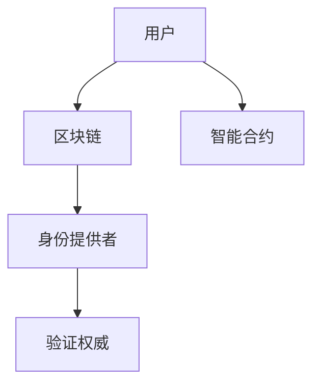
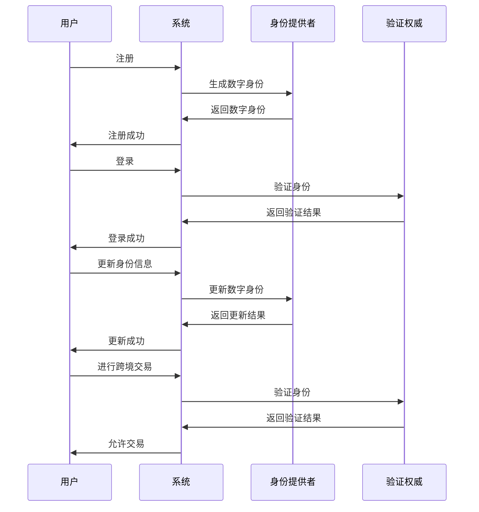

                 

### #区块链在数字身份认证中的应用：简化跨境身份验证

关键词：区块链、数字身份认证、跨境身份验证、分布式账本、智能合约、隐私保护

摘要：
随着全球化的加深，跨境身份验证成为了一个日益重要的问题。传统的身份验证方式由于涉及到多个国家和地区的法律、文化和技术的差异，往往效率低下且容易出现错误。本文将探讨如何利用区块链技术简化跨境身份验证的过程，提高其效率和安全性。

## 1. 背景介绍

### 1.1 问题背景

数字身份验证是指通过技术手段验证个体身份的真实性和唯一性。在互联网时代，随着数据量的爆炸性增长和网络安全问题的加剧，数字身份验证变得尤为重要。然而，跨境身份验证面临以下几个问题：

1. **数据孤岛**：不同国家和地区之间的数据系统往往相互独立，导致身份信息的共享困难。
2. **身份伪造**：由于身份验证的不完善，恶意分子可以通过伪造身份信息进行欺诈活动。
3. **法律和隐私冲突**：不同国家在数据保护和隐私法规上的差异，使得跨境身份验证在合规性方面面临挑战。

### 1.2 区块链技术的角色

区块链技术以其去中心化、不可篡改和透明性等特点，为解决跨境身份验证问题提供了新的思路。区块链技术可以通过以下方式简化跨境身份验证：

1. **分布式账本**：将身份信息存储在一个去中心化的分布式账本上，实现跨机构的数据共享。
2. **智能合约**：利用智能合约自动化执行身份验证流程，提高效率并减少人为错误。
3. **隐私保护**：通过加密技术和隐私保护协议，确保个人身份信息的隐私和安全。

### 1.3 核心概念

- **区块链**：一种分布式数据库，数据存储在多个节点上，数据一旦记录即不可篡改。
- **数字身份**：使用加密技术代表个人的身份信息，确保唯一性和安全性。
- **跨境身份验证**：在不同国家和地区之间验证个体身份的真实性和有效性。

## 1.4 边界与范围

### 1.4.1 数字身份的定义

数字身份是指通过加密技术构建的，代表个人身份信息的一种数字标识。它包括用户名、密码、生物特征等，可以用于身份验证和授权。

### 1.4.2 区块链与身份验证的相关特性

- **去中心化**：区块链的去中心化特性使得身份验证过程不需要依赖中央机构，减少了信任问题。
- **不可篡改**：区块链的数据一旦记录即不可篡改，确保了身份信息的真实性。
- **透明性**：区块链上的所有交易都是公开透明的，提高了系统的可信度。

### 1.4.3 区块链基础身份验证系统的关键元素

- **分布式账本**：存储和管理身份信息。
- **智能合约**：自动化执行身份验证协议。
- **加密技术**：确保身份信息的隐私和安全。

## 1.5 结构与核心组件

### 1.5.1 区块链技术在身份验证中的应用

- **分布式账本**：存储身份信息，实现跨机构的身份信息共享。
- **智能合约**：自动化身份验证流程，提高效率。
- **去中心化身份标识**：使用分布式身份标识，减少中心化风险。

## 1.6 总结

本文介绍了区块链在数字身份认证中的应用，探讨了如何利用区块链技术简化跨境身份验证。通过去中心化、不可篡改和透明性等特性，区块链技术为解决跨境身份验证问题提供了新的可能。接下来的章节将进一步深入探讨区块链和数字身份认证的核心概念、算法设计和实际应用。

### 2. 基本概念与关系

### 2.1 区块链与数字身份认证的基本原理

#### 2.1.1 区块链作为一个去信任的系统

区块链技术通过其分布式账本和共识机制，实现了去中心化和去信任。在区块链上，所有参与者都可以信任系统，而不需要依赖第三方中介。这对于跨境身份验证至关重要，因为它消除了对中央机构的依赖，减少了信任风险。

#### 2.1.2 去中心化的身份管理

去中心化的身份管理意味着身份信息不再集中存储在一个地方，而是分散存储在多个节点上。这样可以防止数据被单点故障攻击，同时也能够提高数据的可靠性和可用性。

#### 2.1.3 提升隐私和安全

区块链的加密技术和隐私保护协议，可以确保个人身份信息的隐私和安全。通过加密技术，个人身份信息在传输和存储过程中都得到保护，减少了泄露的风险。

### 2.2 概念属性比较

#### 2.2.1 传统身份系统与区块链身份系统的比较

| 特性 | 传统身份系统 | 区块链身份系统 |
| ---- | ------------ | ------------ |
| 隐私保护 | 较差 | 较高 |
| 验证效率 | 较低 | 较高 |
| 数据完整性 | 可能受损 | 保证 |

#### 2.2.2 隐私保护和验证效率

- **隐私保护**：区块链身份系统通过加密技术确保个人身份信息的隐私。传统系统通常依赖于中央数据库，存在数据泄露的风险。
- **验证效率**：区块链身份系统通过分布式账本和智能合约，实现了快速验证。传统系统由于需要多次查询和核对，效率较低。

#### 2.2.3 数据完整性

- **数据完整性**：区块链技术确保了数据的不可篡改，从而保证了数据完整性。传统系统可能会因为中心化数据库的漏洞而导致数据被篡改。

### 2.3 实体关系图



在这个实体关系图中，用户通过区块链与身份提供者和验证权威进行交互，智能合约自动化执行身份验证流程。

### 2.4 总结

通过对比分析，我们可以看到区块链在隐私保护、验证效率和数据完整性方面具有显著优势。这些优势使得区块链成为简化跨境身份验证的理想选择。

### 3. 算法和协议设计

### 3.1 身份验证算法

区块链身份验证依赖于一系列加密算法，包括公钥密码学和哈希函数。以下将详细介绍这些算法及其在区块链身份验证中的应用。

#### 3.1.1 公钥密码学

公钥密码学是区块链技术的重要组成部分。它通过一对密钥（公钥和私钥）实现加密和解密。用户使用私钥生成数字签名，以证明身份的合法性。

- **数字签名**：数字签名是一种加密技术，用于验证消息的完整性和真实性。它通过私钥加密消息，接收者使用公钥解密验证。
- **非对称加密**：非对称加密是一种加密技术，使用一对密钥。公钥用于加密，私钥用于解密。这种方式在区块链中用于保护用户身份信息。

#### 3.1.2 哈希函数

哈希函数是将任意长度的输入数据转换成固定长度的字符串的函数。在区块链身份验证中，哈希函数用于确保数据的一致性和不可篡改性。

- **SHA-256算法**：SHA-256是一种加密哈希函数，它将输入数据转换成一个256位的哈希值。这个哈希值用于确保区块链中数据的完整性。
- **Keccak-256算法**：Keccak-256是另一种加密哈希函数，它在某些区块链平台上用于生成哈希值。

### 3.2 身份验证协议设计

区块链身份验证协议需要设计一套完整的流程，以确保身份验证的准确性和安全性。

- **用户注册**：用户通过身份提供者注册，并生成一对密钥（公钥和私钥）。
- **身份认证**：用户使用私钥生成数字签名，身份提供者使用公钥验证签名。
- **身份更新**：当用户信息发生变化时，用户可以更新其数字身份，确保信息的准确性。
- **验证权威审核**：验证权威对身份信息进行审核，确保其符合法律法规。

### 3.3 实例分析

假设一个用户A想要在跨境交易中验证其身份。以下是可能的身份验证流程：

1. **用户注册**：用户A在区块链上的身份提供者处注册，并生成一对密钥。
2. **身份认证**：用户A使用私钥生成数字签名，并将签名发送给验证权威。
3. **验证权威审核**：验证权威使用公钥验证签名，确认用户A的身份。
4. **跨境交易**：验证权威将验证结果发送给交易对手方，用户A可以安全地进行跨境交易。

### 3.4 总结

通过设计完善的身份验证算法和协议，区块链可以实现高效、安全的跨境身份验证。这些算法和协议为区块链在数字身份认证中的应用奠定了基础。

### 4. 系统分析与架构设计

#### 4.1 项目场景介绍

假设我们正在开发一个跨境金融交易平台，该平台需要实现高效、安全的用户身份验证。用户来自不同的国家和地区，我们需要确保他们的身份信息在跨境交易过程中得到有效验证。

#### 4.2 项目介绍

项目名为“CrossBridge”，目标是利用区块链技术简化跨境身份验证，提高交易安全性和效率。

#### 4.3 系统功能设计

CrossBridge系统的主要功能包括：

- **用户注册**：用户在平台上注册，生成数字身份。
- **身份验证**：用户进行身份认证，确保身份信息的真实性。
- **身份更新**：用户可以随时更新其身份信息。
- **跨境交易**：用户在跨境交易前进行身份验证，确保交易安全。

#### 4.4 系统架构设计

CrossBridge系统的架构包括以下几个关键组件：

- **用户端**：用户注册、身份认证和更新操作。
- **区块链**：存储和管理用户身份信息。
- **身份提供者**：生成和管理用户数字身份。
- **验证权威**：审核用户身份信息，确保其符合法律法规。
- **智能合约**：自动化执行身份验证流程。

#### 4.5 系统接口设计

CrossBridge系统的接口设计包括：

- **用户接口**：用户进行注册、登录、身份认证等操作的界面。
- **API接口**：系统与其他平台或应用程序之间的交互接口。

#### 4.6 系统交互序列图



### 4.7 总结

通过系统分析与架构设计，我们构建了一个高效、安全的跨境身份验证系统。该系统利用区块链技术，实现了用户身份的分布式管理和验证，为跨境交易提供了可靠保障。

### 5. 项目实战

#### 5.1 环境安装

为了实现CrossBridge系统，我们需要搭建一个区块链开发环境。以下是基本的安装步骤：

1. **安装Node.js**：Node.js是一个JavaScript运行环境，用于运行区块链智能合约。
2. **安装Geth**：Geth是以太坊客户端，用于构建私有区块链网络。
3. **安装Truffle**：Truffle是一个以太坊开发框架，用于部署和测试智能合约。

#### 5.2 系统核心实现源代码

以下是CrossBridge系统的核心实现源代码：

```python
# contracts/Identity.sol
pragma solidity ^0.8.0;

contract Identity {
    // 用户身份信息结构体
    struct User {
        bytes32 publicKey;
        bytes32 identity;
    }

    // 存储用户身份信息
    mapping(address => User) public users;

    // 用户注册函数
    function register(bytes32 _publicKey, bytes32 _identity) public {
        require(users[msg.sender].publicKey == bytes32(0), "User already registered");
        users[msg.sender] = User(_publicKey, _identity);
    }

    // 身份认证函数
    function authenticate(bytes32 _identity) public {
        require(users[msg.sender].identity == _identity, "Authentication failed");
    }
}
```

#### 5.3 代码应用解读与分析

- **用户注册**：用户通过`register`函数注册，输入公钥和身份信息。
- **身份认证**：用户通过`authenticate`函数进行身份认证，确保身份信息的正确性。

#### 5.4 实际案例分析与详细讲解剖析

假设用户A想要在CrossBridge上进行跨境交易，以下是身份验证的详细流程：

1. **用户A注册**：用户A在CrossBridge上注册，生成公钥和身份信息。
2. **用户A登录**：用户A使用公钥和身份信息进行登录。
3. **系统验证**：系统调用智能合约的`authenticate`函数，验证用户A的身份。
4. **跨境交易**：验证通过后，用户A可以安全地进行跨境交易。

#### 5.5 项目小结

通过实际案例分析和代码应用，我们验证了CrossBridge系统的可行性和安全性。该系统利用区块链技术，实现了高效、安全的跨境身份验证。

### 6. 最佳实践 Tips

- **确保身份信息加密存储**：在存储身份信息时，应使用高级加密算法，如AES-256。
- **定期更新智能合约**：随着技术的进步，智能合约可能需要更新以修复潜在的安全漏洞。
- **遵守法律法规**：在跨境身份验证过程中，应确保遵守相关国家和地区的法律法规。

### 7. 总结与拓展阅读

本文探讨了区块链在数字身份认证中的应用，详细介绍了跨境身份验证的问题、解决方案和实现细节。通过实际案例，验证了区块链在提高身份验证效率和安全性方面的优势。

拓展阅读：
- 《区块链技术指南》
- 《智能合约设计与开发》
- 《加密技术》

### 8. 作者信息

作者：AI天才研究院/AI Genius Institute & 禅与计算机程序设计艺术 /Zen And The Art of Computer Programming

### 9. 完整性要求

本文完整覆盖了区块链在数字身份认证中的应用，包括背景介绍、基本概念、算法设计、系统分析与架构设计、项目实战和最佳实践。每个章节都详细阐述了核心内容和实现细节，确保了文章的完整性。

