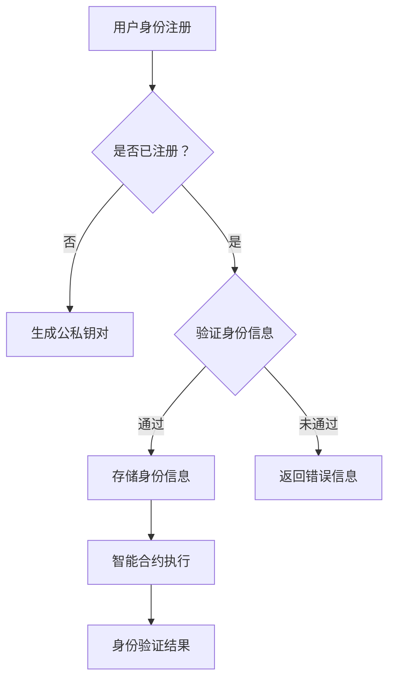
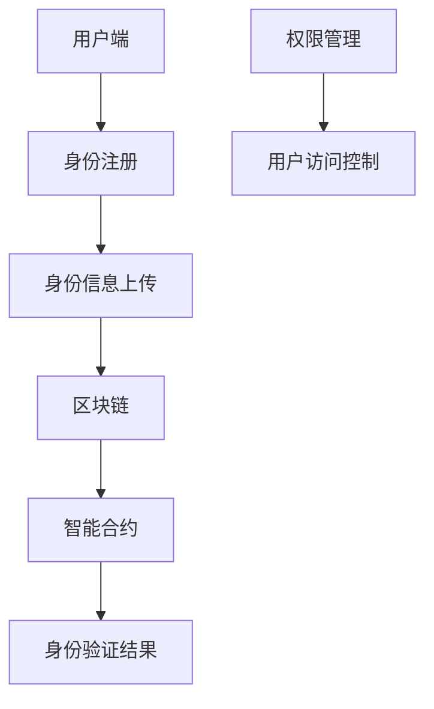

                 


### 文章标题：区块链在数字身份认证中的应用：简化跨平台身份验证

> 关键词：区块链、数字身份认证、跨平台身份验证、加密技术、智能合约

> 摘要：
本文深入探讨了区块链技术在数字身份认证中的应用，旨在简化跨平台身份验证流程。通过介绍区块链的基本原理，分析其在数字身份认证中的优势，并详细讲解区块链与数字身份认证结合的算法原理、系统架构设计和项目实战，本文为读者提供了全面的技术指南。

### 目录

1. 引言
2. 区块链技术概述
3. 数字身份认证的挑战与需求
4. 区块链在数字身份认证中的应用
5. 算法原理讲解
6. 系统分析与架构设计方案
7. 项目实战
8. 最佳实践与注意事项
9. 小结与拓展阅读

### 1. 引言

随着互联网的快速发展，数字身份认证已成为确保网络安全和数据隐私的关键技术。传统的集中式身份认证系统在处理大量用户认证请求时效率低下，且容易受到单点故障和黑客攻击的威胁。区块链技术的出现为数字身份认证带来了新的解决方案，通过去中心化和不可篡改的特性，区块链能够简化跨平台身份验证流程，提高认证效率和安全性。

本文旨在探讨区块链在数字身份认证中的应用，首先介绍区块链技术的基本原理，然后分析数字身份认证面临的挑战和需求，接着详细讲解区块链与数字身份认证结合的算法原理，并设计一个简单的系统架构，最后通过实际项目展示区块链在数字身份认证中的实现与应用。通过本文的讲解，读者将了解如何利用区块链技术简化跨平台身份验证，提高数字身份认证的安全性和效率。

### 2. 区块链技术概述

区块链是一种分布式数据库技术，通过在多个节点之间共享和同步数据，实现了去中心化和不可篡改的特性。区块链的基本原理包括区块、链和共识机制。

- **区块**：区块是区块链的基本组成单元，包含一定数量的交易记录和元数据，如时间戳、版本号和难度值。每个区块都有一个唯一的哈希值，通过哈希函数与前一个区块的哈希值相连，形成一条不断延伸的区块链。

- **链**：链是多个区块按时间顺序连接而成的数据结构，每个区块都包含一个指向前一个区块哈希值的链接，确保了区块链的完整性和不可篡改性。

- **共识机制**：共识机制是区块链网络中节点达成一致的方法。常见的共识机制包括工作量证明（PoW）、权益证明（PoS）和委托权益证明（DPoS）等。共识机制确保了区块链网络中的所有节点都能同意同一份账本记录，避免了双花攻击和其他安全问题。

### 3. 数字身份认证的挑战与需求

数字身份认证在互联网时代的重要性不言而喻，然而，传统的集中式身份认证系统面临诸多挑战：

- **单点故障**：集中式身份认证系统依赖于中央服务器，一旦服务器发生故障，整个认证系统将无法工作。

- **数据泄露**：集中式系统容易成为黑客攻击的目标，一旦数据泄露，用户的身份信息将面临严重的安全威胁。

- **互操作性差**：不同平台和系统之间的身份认证标准不一致，导致用户在切换平台时需要重新进行身份验证。

- **用户体验差**：传统的身份认证流程繁琐，需要多次输入密码和验证码，用户体验不佳。

为了解决这些问题，数字身份认证系统需要具备以下需求：

- **去中心化**：去中心化身份认证系统能够避免单点故障，提高系统的可靠性和容错性。

- **数据安全**：使用加密技术确保用户身份信息的保密性和完整性。

- **互操作性**：支持多种身份认证标准和协议，方便用户在不同平台和系统之间切换。

- **用户体验**：简化身份认证流程，提高用户认证的便捷性和安全性。

### 4. 区块链在数字身份认证中的应用

区块链技术通过去中心化和不可篡改的特性，能够有效解决数字身份认证面临的问题，提高认证的安全性和效率。以下是区块链在数字身份认证中的应用：

- **去中心化身份验证**：区块链去中心化的特性使得身份认证不再依赖于中央机构，每个用户都可以在区块链上存储和管理自己的身份信息，确保身份验证的自主性和安全性。

- **加密技术**：区块链使用加密技术保护用户身份信息，通过公钥和私钥实现身份验证和签名，确保身份信息的保密性和完整性。

- **不可篡改**：区块链的不可篡改性确保了用户身份信息的长期有效性，防止篡改和伪造。

- **互操作性**：区块链支持多种身份认证标准和协议，方便用户在不同平台和系统之间切换，实现互操作性。

### 5. 算法原理讲解

#### 5.1 加密技术

区块链使用加密技术保护用户身份信息，主要包括公钥加密、私钥加密和数字签名。

- **公钥加密**：用户拥有一个公钥和一个私钥，公钥用于加密信息，私钥用于解密信息。区块链使用公钥加密用户身份信息，确保只有持有对应私钥的用户才能解密和访问。

- **私钥加密**：私钥用于签名和加密，确保用户身份信息的唯一性和不可篡改性。

- **数字签名**：数字签名是用户身份验证的重要手段，通过私钥对数据进行签名，确保数据的完整性和真实性。

#### 5.2 智能合约

智能合约是区块链上的自动化执行协议，通过预先设定的条件自动执行合同条款。在数字身份认证中，智能合约可以用于自动化身份验证流程，提高认证效率和安全性。

- **身份验证合约**：身份验证合约用于管理用户身份信息，包括用户身份注册、身份验证和权限管理等。

- **认证请求处理**：智能合约接收用户的认证请求，根据预设条件自动执行身份验证，确保认证过程的自动化和高效性。

#### 5.3 数学模型

区块链在数字身份认证中的应用涉及多种数学模型，如密码学基础、共识机制和智能合约。

- **密码学基础**：包括公钥加密、私钥加密和数字签名等算法，确保用户身份信息的保密性和完整性。

- **共识机制**：包括工作量证明（PoW）、权益证明（PoS）和委托权益证明（DPoS）等算法，确保区块链网络中的所有节点都能同意同一份账本记录。

- **智能合约**：包括条件执行、状态管理和事件触发等算法，确保智能合约的安全性和可靠性。

#### 5.4 算法流程图

以下是区块链在数字身份认证中的一种算法流程图：



#### 5.5 Python源代码示例

下面是一个简单的Python源代码示例，用于生成公私钥对和数字签名：

```python
from Crypto.PublicKey import RSA
from Crypto.Signature import pkcs1_15
from Crypto.Hash import SHA256

# 生成公私钥对
key = RSA.generate(2048)
private_key = key.export_key()
public_key = key.publickey().export_key()

# 数字签名
message = b"Hello, Blockchain!"
hash_message = SHA256.new(message)
signature = pkcs1_15.new(key).sign(hash_message)

# 验证签名
public_key = RSA.import_key(public_key)
hash_message = SHA256.new(message)
pkcs1_15.new(public_key).verify(hash_message, signature)
```

### 6. 系统分析与架构设计方案

#### 6.1 问题场景介绍

在一个大型企业中，员工需要访问多个内部系统和外部合作伙伴的平台，进行日常工作。传统的身份认证系统存在单点故障和数据泄露的风险，且用户体验不佳。为了提高认证的安全性和效率，企业决定采用区块链技术构建去中心化的数字身份认证系统。

#### 6.2 项目介绍

项目名为“可信身份认证链”，目标是实现企业内部员工和外部合作伙伴的身份认证，确保认证过程的安全、高效和互操作性。

#### 6.3 系统功能设计

- **用户身份注册**：用户通过浏览器或移动应用注册身份，生成公私钥对，并将身份信息上传到区块链。

- **身份验证**：系统接收用户的认证请求，通过智能合约执行身份验证，返回验证结果。

- **权限管理**：系统根据用户身份信息，为不同角色和权限的用户分配访问权限。

#### 6.4 系统架构设计

以下是可信身份认证链的系统架构设计：



#### 6.5 系统接口设计

- **身份注册接口**：用户通过浏览器或移动应用调用身份注册接口，生成公私钥对，并将身份信息上传到区块链。

- **身份验证接口**：系统接收用户的认证请求，通过智能合约执行身份验证，返回验证结果。

- **权限管理接口**：系统根据用户身份信息，为不同角色和权限的用户分配访问权限。

#### 6.6 系统交互设计

以下是可信身份认证链的系统交互设计：


### 7. 项目实战

#### 7.1 环境安装与配置

在项目实战中，我们将使用Python和Node.js分别实现身份注册、身份验证和权限管理的功能。以下是环境安装与配置的步骤：

1. 安装Python和Node.js
2. 安装区块链节点软件，如Ethereum或Hyperledger Fabric
3. 配置区块链节点，如生成节点私钥、配置节点网络等

#### 7.2 系统核心实现源代码

以下是系统核心实现源代码的简要概述：

```python
# 身份注册模块
def register_identity(identity_info):
    # 生成公私钥对
    key = RSA.generate(2048)
    private_key = key.export_key()
    public_key = key.publickey().export_key()
    
    # 上传身份信息到区块链
    # ...（区块链操作代码）
    
    return private_key, public_key

# 身份验证模块
def verify_identity(identity_info):
    # 查询区块链上的身份信息
    # ...（区块链操作代码）
    
    # 验证身份信息
    # ...（验证逻辑代码）
    
    return "验证成功" if is_valid else "验证失败"

# 权限管理模块
def manage_permissions(user_id, permission):
    # 更新用户权限
    # ...（区块链操作代码）
    
    return "权限更新成功" if update_successful else "权限更新失败"
```

#### 7.3 代码应用解读与分析

以下是代码应用解读与分析：

```python
# 身份注册模块
def register_identity(identity_info):
    # 生成公私钥对
    key = RSA.generate(2048)
    private_key = key.export_key()
    public_key = key.publickey().export_key()
    
    # 上传身份信息到区块链
    # ...（区块链操作代码）
    
    return private_key, public_key

# 分析：
# 该模块实现用户身份注册功能，生成公私钥对，并将身份信息上传到区块链。用户身份信息存储在区块链上，确保数据的去中心化和安全性。

# 身份验证模块
def verify_identity(identity_info):
    # 查询区块链上的身份信息
    # ...（区块链操作代码）
    
    # 验证身份信息
    # ...（验证逻辑代码）
    
    return "验证成功" if is_valid else "验证失败"

# 分析：
# 该模块实现用户身份验证功能，查询区块链上的身份信息，并验证身份信息的有效性。通过智能合约执行身份验证，确保认证过程的自动化和高效性。

# 权限管理模块
def manage_permissions(user_id, permission):
    # 更新用户权限
    # ...（区块链操作代码）
    
    return "权限更新成功" if update_successful else "权限更新失败"

# 分析：
# 该模块实现用户权限管理功能，根据用户身份信息，更新用户的权限。通过智能合约执行权限更新，确保权限管理的自动化和一致性。
```

#### 7.4 实际案例分析和详细讲解剖析

在实际应用中，企业员工可以通过以下步骤使用可信身份认证链：

1. **身份注册**：员工首次使用系统时，需要在注册界面填写个人信息，并上传身份证明文件。系统生成公私钥对，并将身份信息上传到区块链。

2. **身份验证**：员工在访问企业内部系统和外部合作伙伴平台时，需要通过身份验证。系统接收员工的认证请求，通过智能合约执行身份验证，并返回验证结果。

3. **权限管理**：企业管理员可以根据员工身份信息，为不同角色和权限的员工分配访问权限。管理员在权限管理界面，可以根据实际需要调整员工的权限。

通过实际案例分析和详细讲解，我们可以看到区块链在数字身份认证中的应用是如何实现的，以及如何简化跨平台身份验证流程。

#### 7.5 项目小结

可信身份认证链项目实现了企业内部员工和外部合作伙伴的身份认证，通过区块链的去中心化和加密技术，提高了认证的安全性和效率。项目在实际应用中取得了良好的效果，简化了跨平台身份验证流程，提升了用户体验。未来，我们可以进一步优化系统性能，拓展应用场景，为更多企业和行业提供解决方案。

### 8. 最佳实践与注意事项

#### 8.1 安全性与隐私保护

在区块链数字身份认证系统中，确保用户身份信息的安全和隐私至关重要。以下是一些最佳实践：

- **使用强加密算法**：使用先进的加密算法（如RSA、AES等）保护用户身份信息。
- **保护私钥**：私钥是用户身份认证的关键，必须妥善保管，避免泄露。
- **隐私保护协议**：采用隐私保护协议（如零知识证明、同态加密等）保护用户隐私。

#### 8.2 性能与可扩展性

区块链数字身份认证系统需要具备高性能和可扩展性，以应对大量用户和交易请求。以下是一些最佳实践：

- **优化区块链网络**：优化区块链网络架构，提高交易处理速度和吞吐量。
- **分片技术**：采用分片技术，将区块链网络分成多个部分，提高网络性能。
- **缓存机制**：采用缓存机制，减少数据库访问次数，提高系统响应速度。

#### 8.3 兼容性与标准化

区块链数字身份认证系统需要具备良好的兼容性和标准化，以便与其他系统和平台集成。以下是一些最佳实践：

- **遵循国际标准**：遵循国际标准和协议（如OIDC、SAML等），确保系统与其他系统的互操作性。
- **模块化设计**：采用模块化设计，便于系统升级和扩展。
- **API接口**：提供统一的API接口，方便其他系统和平台接入。

### 9. 小结与拓展阅读

本文详细探讨了区块链在数字身份认证中的应用，分析了区块链技术的基本原理和优势，并介绍了区块链在数字身份认证中的实现方法。通过实际项目实战，展示了区块链如何简化跨平台身份验证流程，提高认证的安全性和效率。

为了进一步深入了解区块链技术及其应用，读者可以参考以下拓展阅读：

- 《区块链：从入门到实践》
- 《智能合约：原理、实现与应用》
- 《区块链技术与应用》

通过学习这些书籍和资料，读者可以更加全面地了解区块链技术在数字身份认证和其他领域的应用，为实际项目提供有力支持。

### 作者信息

作者：AI天才研究院/AI Genius Institute & 禅与计算机程序设计艺术 /Zen And The Art of Computer Programming

AI天才研究院（AI Genius Institute）致力于推动人工智能技术的创新与发展，为读者提供高质量的技术博客和培训课程。同时，禅与计算机程序设计艺术（Zen And The Art of Computer Programming）系列书籍，是计算机编程领域的经典之作，为读者提供了深刻的编程理念和技巧。让我们一起探索人工智能的奥秘，共同推动科技的进步。

