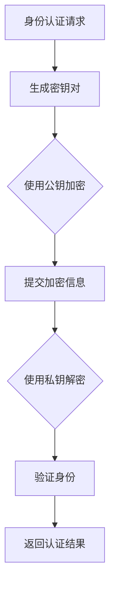
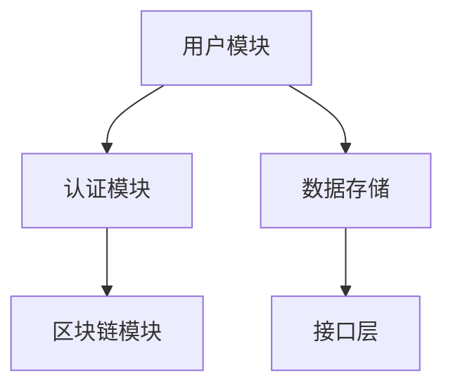
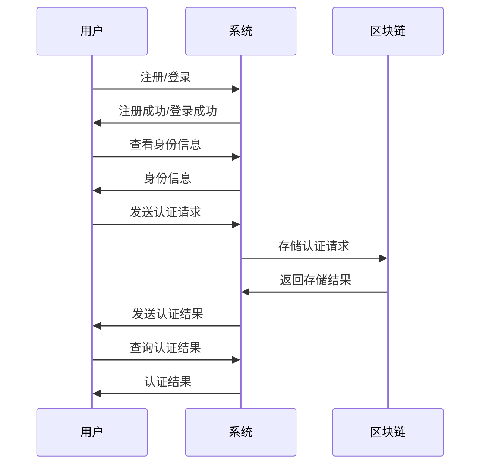

                 

# 区块链在数字身份跨平台认证中的应用

> 关键词：区块链、数字身份认证、跨平台认证、去中心化、加密算法、共识机制

> 摘要：本文深入探讨了区块链技术在数字身份跨平台认证中的应用。通过分析区块链的去中心化特性、加密算法和共识机制，阐述了区块链如何解决传统认证体系的不足，为数字身份跨平台认证提供了一种安全、透明和高效的解决方案。文章结构清晰，逻辑严密，旨在为读者提供一个全面、系统的了解和认识。

## 第一部分: 背景介绍

### 第1章: 问题背景与概述

#### 1.1.1 区块链技术的发展背景

区块链技术起源于比特币的发明。2008年，一位名为中本聪（Satoshi Nakamoto）的人发表了一篇题为《比特币：一种点对点的电子现金系统》的论文，提出了一种全新的去中心化电子货币系统——比特币（Bitcoin）。比特币的底层技术即区块链（Blockchain），它是一个去中心化的数据库系统，通过加密算法和分布式账本技术实现了数据的透明性和安全性。

区块链技术的发展经历了几个关键阶段：

1. **第一阶段（2008-2014年）**：比特币的诞生和区块链技术的初步应用，标志着区块链技术的诞生。
2. **第二阶段（2014-2017年）**：区块链技术的进一步研究和应用，包括以太坊、智能合约等创新。
3. **第三阶段（2017年至今）**：区块链技术逐渐成熟，应用范围扩大到金融、供应链、医疗等多个领域。

#### 1.1.1.2 区块链技术核心概念

- **去中心化**：区块链系统不需要中心化的机构进行控制，而是通过网络中的多个节点共同维护整个系统的运行。
- **加密算法**：区块链使用各种加密算法来确保交易数据的完整性和安全性。
- **分布式账本**：区块链本质上是一个分布式账本，每个节点都保存了一份账本副本，并通过共识机制保持账本的一致性。

#### 1.1.2 数字身份跨平台认证的需求

随着互联网的快速发展，数字身份认证变得越来越重要。然而，传统认证体系存在以下几个问题：

- **单点故障风险**：中心化系统一旦遭到攻击或出现故障，整个认证体系可能崩溃。
- **数据泄露风险**：用户个人信息容易泄露，导致隐私安全风险。
- **信任危机**：中心化机构可能导致信任危机，用户对认证体系的信任度下降。

数字身份跨平台认证的需求主要体现在以下几个方面：

- **身份验证的准确性**：确保用户身份的真实性和准确性，防止假冒和欺诈行为。
- **数据的隐私保护**：保护用户个人信息的安全，防止数据泄露。
- **跨平台互操作性**：实现不同平台之间的身份认证互操作性，方便用户在不同平台之间的切换。

#### 1.1.2.2 区块链在认证中的应用

区块链技术为解决传统认证体系的问题提供了可能：

- **去中心化**：区块链的去中心化特性使得认证过程更加透明和可信，无需依赖中心化机构。
- **数据加密**：区块链使用加密算法保护用户信息，确保数据安全性。
- **不可篡改**：区块链的数据一旦记录，就无法篡改，增加了数据的可信度。

#### 1.1.3 区块链在数字身份跨平台认证中的应用前景

区块链技术在数字身份跨平台认证中具有以下几个优势：

- **安全性与隐私保护**：区块链技术能够有效保护用户隐私，提高认证系统的安全性。
- **透明性与信任**：去中心化特性使得区块链系统更加透明，用户对认证体系的信任度提高。
- **跨平台互操作性**：区块链技术能够实现不同平台之间的数据互操作性，打破数据孤岛。

区块链在数字身份跨平台认证中的应用场景包括：

- **金融领域**：在金融交易中，区块链技术可用于实现安全、可信的数字身份认证。
- **教育领域**：学生和教师可以通过区块链技术实现身份验证，确保教育背景的真实性。
- **医疗领域**：医疗数据的认证和共享可以通过区块链技术实现，提高数据的安全性和可信度。

#### 1.1.4 本书结构

本书共分为7章，包括：

- 第1章：背景介绍
- 第2章：区块链与数字身份认证基础
- 第3章：区块链数字身份认证的架构与实现
- 第4章：区块链数字身份认证的核心算法
- 第5章：区块链数字身份认证的应用实践
- 第6章：区块链数字身份认证的挑战与未来
- 第7章：总结与展望

通过以上章节的详细探讨，本书旨在为读者提供一个全面、系统的区块链在数字身份跨平台认证中的应用指南。

#### 1.1.5 本章小结

本章主要介绍了区块链技术的发展背景、数字身份跨平台认证的需求以及区块链在认证中的应用前景。通过理解这些背景知识，读者可以更好地理解本书的核心内容，并为后续章节的学习打下基础。

## 第二部分: 核心概念与联系

### 第2章: 区块链与数字身份认证基础

#### 2.1 区块链基础

##### 2.1.1 区块链定义

区块链是一个去中心化的分布式数据库系统，它通过一系列按照时间顺序排列的“区块”组成，每个区块包含一定数量的交易数据，并通过密码学算法确保数据的完整性和安全性。

##### 2.1.2 区块链特点

- **去中心化**：没有中心化的控制机构，每个节点都可以参与区块链的维护和更新。
- **透明性**：所有交易记录都是公开透明的，任何用户都可以查看。
- **不可篡改性**：一旦数据被记录到区块链上，就无法被篡改。

##### 2.1.3 区块链的工作原理

- **区块**：每个区块包含一个时间戳、多个交易记录和一个前一个区块的哈希值。
- **链式结构**：新的区块通过其哈希值与前一个区块的哈希值相连，形成链式结构。
- **共识机制**：节点通过共识机制达成对区块链的共识，确保数据的一致性和安全性。

##### 2.1.4 区块链技术核心概念对比表格

| 核心概念 | 定义 | 特点 |
| --- | --- | --- |
| 去中心化 | 没有中心化的控制机构 | 提高系统的透明性和抗攻击性 |
| 加密算法 | 确保数据的安全性和完整性 | 提高数据的保密性和抗篡改性 |
| 分布式账本 | 每个节点都保存一份账本副本 | 提高数据的可靠性和一致性 |

##### 2.1.5 区块链的ER实体关系图

```mermaid
erDiagram
    User ||--|{ Transaction }|-- Employee
    User ||--|{ Identity }|-- Customer
    User ||--|{ Role }|-- Admin
```

#### 2.2 数字身份认证基础

##### 2.2.1 数字身份认证定义

数字身份认证是指利用数字技术对用户的身份进行验证，确保用户在数字世界中的身份真实性和合法性。数字身份认证通常包括以下步骤：

- **身份验证**：通过用户提供的身份信息（如用户名、密码、指纹等）来验证用户身份。
- **身份确认**：通过第三方机构（如银行、政府等）的认证来确认用户身份。
- **身份授权**：根据用户身份和权限，为用户提供相应的访问权限和服务。

##### 2.2.2 数字身份认证的特点

- **安全性**：数字身份认证通过加密算法和技术手段确保用户身份信息的安全。
- **便捷性**：数字身份认证使得用户在不同平台之间切换更加方便。
- **可靠性**：数字身份认证具有较高的可靠性和准确性，能有效防止假冒和欺诈行为。

##### 2.2.3 数字身份认证的流程

数字身份认证的流程通常包括以下步骤：

1. **用户注册**：用户在平台上进行注册，提供身份信息。
2. **身份验证**：平台通过用户提供的身份信息进行初步验证。
3. **身份确认**：平台通过第三方机构进行身份确认。
4. **身份授权**：平台根据用户身份和权限为用户提供相应的访问权限和服务。

##### 2.2.4 数字身份认证与区块链的关系

区块链技术与数字身份认证的结合，可以实现更安全、更可靠的数字身份认证：

- **去中心化**：区块链的去中心化特性，使得数字身份认证过程更加透明和可信，无需依赖中心化机构。
- **数据加密**：区块链使用加密算法保护用户身份信息，确保数据安全性。
- **不可篡改**：区块链的数据一旦记录，就无法篡改，增加了数据的可信度。

#### 2.2.5 区块链数字身份认证的优势

- **安全性**：区块链技术能够有效保护用户隐私，提高认证系统的安全性。
- **透明性**：去中心化特性使得区块链系统更加透明，用户对认证体系的信任度提高。
- **不可篡改**：区块链的数据一旦记录，就无法被篡改，增加了数据的可信度。
- **跨平台互操作性**：区块链技术能够实现不同平台之间的数据互操作性，打破数据孤岛。

#### 2.2.6 本章小结

本章主要介绍了区块链的基础知识、数字身份认证的定义和特点，以及区块链数字身份认证的优势。通过理解这些核心概念，读者可以更好地理解区块链在数字身份跨平台认证中的应用原理。

## 第三部分: 算法原理讲解

### 第3章: 区块链数字身份认证的核心算法

#### 3.1 加密算法

区块链数字身份认证的核心算法之一是加密算法。加密算法通过将明文转换为密文，确保数据在传输和存储过程中的安全性。常见的加密算法包括对称加密和非对称加密。

- **对称加密**：对称加密算法使用相同的密钥对明文进行加密和解密。常见的对称加密算法有AES、DES等。对称加密算法的优点是实现简单、加密速度快，但缺点是密钥分发和管理复杂。
- **非对称加密**：非对称加密算法使用一对密钥（公钥和私钥）进行加密和解密。公钥用于加密，私钥用于解密。常见的非对称加密算法有RSA、ECC等。非对称加密算法的优点是解决了密钥分发问题，但缺点是加密和解密速度相对较慢。

在区块链数字身份认证中，加密算法主要用于保护用户身份信息和交易数据。例如，用户在进行身份认证时，可以使用非对称加密算法生成一对密钥，公钥存储在区块链上，私钥由用户保管。在交易过程中，用户可以使用私钥对交易数据进行签名，确保交易数据的真实性和完整性。

#### 3.2 数字签名算法

数字签名算法是区块链数字身份认证的另一个核心算法。数字签名用于确保数据的真实性和完整性，同时防止数据被篡改。常见的数字签名算法有RSA签名和ECDSA签名。

- **RSA签名**：RSA签名算法是基于RSA加密算法的数字签名算法。RSA签名算法的优点是算法成熟、安全性较高，但缺点是签名和验证速度较慢。
- **ECDSA签名**：ECDSA签名算法是基于椭圆曲线加密算法的数字签名算法。ECDSA签名算法的优点是签名和验证速度快，且安全性较高。

在区块链数字身份认证中，数字签名算法主要用于用户身份认证和交易签名。例如，用户在进行身份认证时，可以使用ECDSA签名算法生成签名，将签名提交给认证系统进行验证。在交易过程中，用户可以使用私钥对交易数据进行签名，将签名附在交易数据中，确保交易数据的真实性和完整性。

#### 3.3 区块链数字身份认证算法的mermaid流程图



#### 3.4 区块链数字身份认证算法的Python实现

```python
import hashlib
from Crypto.PublicKey import RSA
from Crypto.Signature import pkcs1_15
from Crypto.Random import get_random_bytes

# 生成密钥对
private_key = RSA.generate(2048)
public_key = private_key.publickey()

# 加密信息
def encrypt_message(message):
    encrypted_message = public_key.encrypt(message)
    return encrypted_message

# 解密信息
def decrypt_message(encrypted_message):
    decrypted_message = private_key.decrypt(encrypted_message)
    return decrypted_message

# 生成签名
def generate_signature(message):
    signature = pkcs1_15.new(private_key).sign(message)
    return signature

# 验证签名
def verify_signature(message, signature):
    try:
        pkcs1_15.new(public_key).verify(message, signature)
        return True
    except (ValueError, TypeError):
        return False

# 测试代码
if __name__ == "__main__":
    message = get_random_bytes(16)
    encrypted_message = encrypt_message(message)
    decrypted_message = decrypt_message(encrypted_message)
    signature = generate_signature(message)
    print("明文:", message.hex())
    print("密文:", encrypted_message.hex())
    print("解密后:", decrypted_message.hex())
    print("签名:", signature.hex())
    print("签名验证:", verify_signature(decrypted_message, signature))
```

#### 3.5 本章小结

本章主要介绍了区块链数字身份认证的核心算法，包括加密算法和数字签名算法。通过Python实现，展示了区块链数字身份认证算法的原理和应用。这些算法在区块链数字身份认证中发挥着重要作用，确保了用户身份信息的安全性和数据完整性。

## 第四部分: 系统分析与架构设计方案

### 第4章: 区块链数字身份认证的架构与实现

#### 4.1 问题场景介绍

随着互联网的快速发展，越来越多的应用场景需要实现数字身份认证。传统的中心化认证体系在安全性和效率方面存在诸多问题，如单点故障风险、数据泄露风险等。为了解决这些问题，本文提出了一种基于区块链技术的数字身份认证系统，以提高认证系统的安全性、透明性和互操作性。

#### 4.2 项目介绍

项目名称：区块链数字身份认证系统

项目目标：实现一个安全、高效、可扩展的数字身份认证系统，支持跨平台认证和跨行业应用。

技术栈：Python、Flask、Ethereum、Hyperledger Fabric

#### 4.3 系统功能设计

系统功能设计主要包括以下几个方面：

1. **用户注册与身份验证**：用户可以在系统中注册账户，并通过身份验证流程获得认证。
2. **身份信息管理**：用户可以查看和管理自己的身份信息，如姓名、出生日期、身份证号等。
3. **身份认证请求**：用户可以向其他平台发送身份认证请求，对方平台可以基于区块链数据验证用户身份。
4. **认证结果查询**：用户可以查询自己发送的身份认证请求的认证结果。
5. **系统管理**：系统管理员可以管理用户账户、审核用户身份认证请求等。

#### 4.4 系统架构设计

系统架构设计采用微服务架构，包括以下几个方面：

1. **用户模块**：负责用户注册、身份信息管理、身份认证请求等功能。
2. **认证模块**：负责处理身份认证请求，验证用户身份，生成认证结果。
3. **区块链模块**：负责与区块链节点进行交互，存储和查询身份认证数据。
4. **数据存储**：使用关系型数据库存储用户信息和其他系统数据。
5. **接口层**：提供RESTful API供其他平台调用。

#### 4.5 系统架构mermaid图



#### 4.6 系统接口设计

系统接口设计主要包括以下API接口：

1. **用户注册接口**：用于用户注册，接收用户名、密码、身份信息等参数。
2. **用户登录接口**：用于用户登录，接收用户名和密码参数。
3. **身份信息管理接口**：用于用户查看和管理身份信息。
4. **身份认证请求接口**：用于用户发送身份认证请求，接收认证平台标识、认证类型等参数。
5. **认证结果查询接口**：用于用户查询认证结果，接收认证请求标识等参数。

#### 4.7 系统交互mermaid序列图



#### 4.8 本章小结

本章主要介绍了区块链数字身份认证系统的架构设计与实现，包括问题场景、项目介绍、系统功能设计、系统架构设计、接口设计和系统交互设计。通过本章的讲解，读者可以更好地理解区块链数字身份认证系统的实现原理和架构设计。

## 第五部分：项目实战

### 第5章: 区块链数字身份认证系统开发与实现

#### 5.1 环境安装

在开发区块链数字身份认证系统之前，需要安装以下环境：

1. **Python**：安装Python 3.8及以上版本。
2. **Flask**：安装Flask框架，用于构建Web应用。
3. **Ethereum**：安装Ethereum客户端，用于与以太坊区块链进行交互。
4. **Hyperledger Fabric**：安装Hyperledger Fabric，用于构建企业级区块链网络。
5. **关系型数据库**：安装MySQL或PostgreSQL，用于存储用户信息和系统数据。

#### 5.2 系统核心实现源代码

以下是一个简单的区块链数字身份认证系统核心实现源代码，包括用户注册、身份信息管理、身份认证请求和认证结果查询等功能。

**用户注册与身份验证模块**

```python
from flask import Flask, request, jsonify
from Crypto.PublicKey import RSA
from Crypto.Signature import pkcs1_15
from Crypto.Random import get_random_bytes
import sqlite3

app = Flask(__name__)

# 数据库连接
def get_db_connection():
    conn = sqlite3.connect('database.db')
    conn.row_factory = sqlite3.Row
    return conn

# 生成密钥对
def generate_key_pair():
    private_key = RSA.generate(2048)
    public_key = private_key.publickey()
    return private_key, public_key

# 用户注册
@app.route('/register', methods=['POST'])
def register():
    data = request.json
    username = data['username']
    password = data['password']
    
    # 生成密钥对
    private_key, public_key = generate_key_pair()
    
    # 保存用户信息到数据库
    conn = get_db_connection()
    conn.execute('INSERT INTO users (username, password, private_key, public_key) VALUES (?, ?, ?, ?)',
                 (username, password, private_key.export_key(), public_key.export_key()))
    conn.commit()
    conn.close()
    
    return jsonify({'status': 'success', 'public_key': public_key.export_key()}), 201

# 身份验证
@app.route('/authenticate', methods=['POST'])
def authenticate():
    data = request.json
    username = data['username']
    signature = data['signature']
    
    # 查询用户信息
    conn = get_db_connection()
    user = conn.execute('SELECT * FROM users WHERE username = ?', (username,)).fetchone()
    conn.close()
    
    if not user:
        return jsonify({'status': 'error', 'message': '用户不存在'}), 404
    
    # 验证签名
    message = username.encode()
    try:
        pkcs1_15.new(RSA.import_key(user['private_key']))

