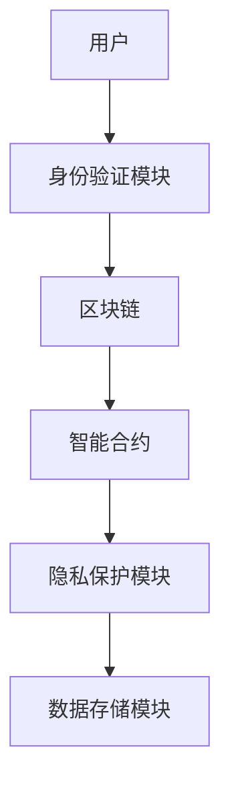
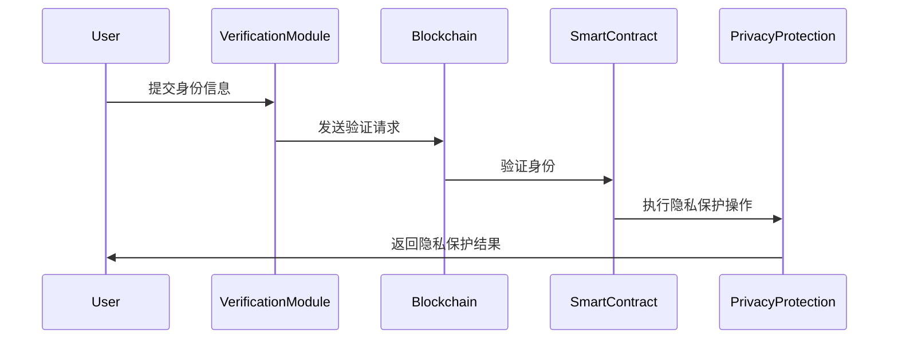

                 

### 文章标题：区块链在数字身份隐私保护中的创新应用

---

关键词：区块链，数字身份，隐私保护，创新应用，智能合约

摘要：随着互联网的快速发展，数字身份隐私保护问题日益突出。本文将详细探讨区块链技术在数字身份隐私保护中的创新应用，通过分析区块链的核心原理、应用模式及实际案例，揭示其在金融、医疗和教育等领域的应用价值。本文旨在为读者提供全面、系统的区块链在数字身份隐私保护中的应用指南，助力理解和实践区块链技术的实际应用。

---

### 第一部分：区块链与数字身份隐私保护概述

---

#### 第1章：区块链与数字身份简介

##### 1.1 区块链技术的基本原理

区块链是一种去中心化的分布式账本技术，它通过加密算法和共识机制保证了数据的安全性和不可篡改性。区块链的基本组成部分包括区块、链和节点。每个区块包含一定数量的交易数据，通过哈希函数将区块与区块链链接起来，形成一个不可篡改的数据链条。

##### 1.2 数字身份的定义与隐私保护需求

数字身份是指在网络环境中，个体或组织通过一定的身份认证方式所获得的唯一标识。随着互联网的发展，数字身份的使用越来越频繁，隐私保护的需求也随之增加。数字身份隐私保护的核心目标是确保用户身份信息的安全性和隐私性，防止被恶意使用和泄露。

##### 1.3 区块链在数字身份隐私保护中的应用价值

区块链在数字身份隐私保护中的应用价值主要体现在以下几个方面：

1. **数据安全性**：区块链通过加密算法和共识机制保证了数据的安全性和不可篡改性，有效防止了数据被篡改和泄露。
2. **去中心化**：区块链的去中心化特性使得数据存储和访问更加分散，减少了单点故障的风险，同时也增强了隐私保护。
3. **智能合约**：区块链上的智能合约可以自动执行预先设定的程序，实现身份验证和隐私保护功能的自动化。

#### 第2章：数字身份隐私保护的挑战与问题

##### 2.1 当前数字身份隐私保护的现状

当前，数字身份隐私保护面临着诸多挑战。一方面，传统的身份验证方式如用户名和密码等容易受到暴力破解、钓鱼攻击等威胁；另一方面，大数据和人工智能技术的发展使得个人隐私信息更容易被收集和滥用。

##### 2.2 数字身份隐私保护面临的挑战

1. **数据泄露**：随着互联网的普及，大量的个人数据被收集和存储，一旦发生数据泄露，将对用户隐私造成严重威胁。
2. **隐私泄露**：数字身份的集中存储和访问方式容易导致隐私泄露，用户身份信息可能被不法分子恶意利用。
3. **身份盗用**：用户身份信息被盗用后，可能导致财产安全、个人名誉等各方面的损失。

##### 2.3 区块链在解决数字身份隐私保护问题中的优势

区块链在解决数字身份隐私保护问题中具有显著的优势：

1. **安全性**：区块链的加密算法和共识机制保证了数据的安全性和隐私性。
2. **去中心化**：去中心化特性减少了单点故障的风险，增强了系统的可靠性和隐私保护。
3. **智能合约**：智能合约可以实现自动化处理，减少人为干预，提高隐私保护的效率。

---

### 第二部分：区块链在数字身份隐私保护中的应用原理

---

#### 第3章：区块链技术核心概念与特性

##### 3.1 区块链的基本组成

区块链的基本组成包括区块、链和节点。每个区块包含一定数量的交易数据，通过哈希函数将区块与区块链链接起来，形成一个不可篡改的数据链条。

##### 3.2 区块链的关键特性

1. **去中心化**：区块链的去中心化特性使得数据存储和访问更加分散，减少了单点故障的风险，同时也增强了隐私保护。
2. **数据不可篡改**：区块链通过加密算法和共识机制保证了数据的安全性和不可篡改性。
3. **智能合约**：智能合约是一种自动执行代码的程序，可以实现自动化处理，提高隐私保护的效率。

##### 3.3 区块链的安全机制

区块链的安全机制主要包括加密算法、共识机制和智能合约。加密算法保证了数据传输的安全性，共识机制确保了网络节点的数据一致性，智能合约实现了自动化处理，提高了隐私保护的效率。

#### 第4章：数字身份隐私保护的核心技术

##### 4.1 匿名性与隐私保护技术

匿名性与隐私保护技术是区块链在数字身份隐私保护中的重要应用。通过零知识证明、同态加密等技术，可以实现用户身份的匿名化和隐私保护。

##### 4.2 零知识证明与混合证明技术

零知识证明是一种密码学技术，它允许一方（证明者）向另一方（验证者）证明某个陈述为真，而不泄露任何有关信息。混合证明技术通过将多个零知识证明合并，提高了隐私保护的效率和安全性。

##### 4.3 同态加密与安全多方计算技术

同态加密是一种加密技术，它允许对加密数据进行计算，而不需要解密数据。安全多方计算技术允许多个参与方在不知道彼此数据的情况下，协同完成计算任务，从而实现隐私保护。

---

### 第三部分：区块链在数字身份隐私保护中的创新应用案例

---

#### 第5章：区块链在金融领域的应用

##### 5.1 金融领域数字身份隐私保护的需求

金融领域的数字身份隐私保护需求主要集中在用户身份认证、交易安全、数据隐私等方面。

##### 5.2 区块链技术在金融领域数字身份隐私保护中的应用案例

区块链技术在金融领域的数字身份隐私保护中有着广泛的应用，如区块链银行、数字身份认证、跨境支付等。

##### 5.3 金融领域区块链数字身份隐私保护的实践与展望

金融领域区块链数字身份隐私保护的实践主要集中在提高交易安全性、优化业务流程、增强用户隐私保护等方面。未来，随着技术的不断进步，区块链在金融领域的应用将更加广泛，数字身份隐私保护也将得到更好的实现。

#### 第6章：区块链在医疗健康领域的应用

##### 6.1 医疗健康领域数字身份隐私保护的需求

医疗健康领域的数字身份隐私保护需求主要集中在患者身份认证、医疗数据安全、隐私保护等方面。

##### 6.2 区块链技术在医疗健康领域数字身份隐私保护中的应用案例

区块链技术在医疗健康领域的数字身份隐私保护中有着广泛的应用，如电子健康记录、远程医疗、医疗保险等。

##### 6.3 医疗健康领域区块链数字身份隐私保护的实践与展望

医疗健康领域区块链数字身份隐私保护的实践主要集中在提高数据安全性、优化医疗流程、增强患者隐私保护等方面。未来，随着技术的不断进步，区块链在医疗健康领域的应用将更加深入，数字身份隐私保护也将得到更好的实现。

#### 第7章：区块链在教育领域的应用

##### 7.1 教育领域数字身份隐私保护的需求

教育领域的数字身份隐私保护需求主要集中在学生身份认证、学术成果保护、隐私保护等方面。

##### 7.2 区块链技术在教育领域数字身份隐私保护中的应用案例

区块链技术在教育领域的数字身份隐私保护中有着广泛的应用，如学历认证、学术成果确权、在线教育等。

##### 7.3 教育领域区块链数字身份隐私保护的实践与展望

教育领域区块链数字身份隐私保护的实践主要集中在提高学术成果可信度、优化教育流程、增强学生隐私保护等方面。未来，随着技术的不断进步，区块链在教育领域的应用将更加广泛，数字身份隐私保护也将得到更好的实现。

---

### 第四部分：区块链在数字身份隐私保护中的未来趋势与挑战

---

#### 第8章：区块链在数字身份隐私保护中的未来趋势

随着区块链技术的不断发展，其在数字身份隐私保护中的应用前景也十分广阔。未来，区块链技术有望在以下几个方面实现重要突破：

1. **更高效的隐私保护机制**：随着技术的进步，将出现更多高效的隐私保护机制，如量子密钥分配、全同态加密等，进一步提升数字身份隐私保护的能力。
2. **更广泛的应用场景**：区块链技术将在更多领域得到应用，如物联网、供应链金融等，进一步扩大数字身份隐私保护的应用范围。
3. **更好的监管与合规**：随着区块链技术的发展，相关法律法规也将不断完善，为区块链技术在数字身份隐私保护中的应用提供更好的监管与合规环境。

#### 第9章：区块链在数字身份隐私保护中的挑战与应对策略

尽管区块链技术在数字身份隐私保护中具有巨大潜力，但同时也面临着诸多挑战：

1. **技术挑战**：区块链技术本身在性能、可扩展性、安全性等方面仍存在一些问题，需要不断改进和优化。
2. **法规挑战**：区块链技术的快速发展可能导致现有的法律法规滞后，需要制定新的法律法规来适应技术的发展。
3. **社会挑战**：公众对区块链技术的认知和接受程度仍需提高，需要加强宣传和普及工作。

针对上述挑战，可以采取以下应对策略：

1. **技术创新**：通过不断研发新技术，提高区块链技术的性能、安全性和可扩展性。
2. **法规建设**：加快区块链相关法律法规的制定和实施，为区块链技术的应用提供良好的法律环境。
3. **宣传教育**：加强区块链技术的宣传和普及工作，提高公众的认知和接受程度。

---

### 第五部分：区块链在数字身份隐私保护中的实践与建议

---

#### 第10章：区块链在数字身份隐私保护中的最佳实践

在区块链在数字身份隐私保护中，以下是一些最佳实践：

1. **使用多因素身份认证**：结合密码、生物识别等多因素身份认证，提高数字身份的验证安全性。
2. **实现身份匿名化**：通过区块链技术实现用户身份的匿名化，保护用户隐私。
3. **使用智能合约**：利用智能合约实现自动化处理，提高数字身份管理的效率和安全性。

#### 第11章：区块链在数字身份隐私保护中的注意事项

在区块链在数字身份隐私保护中，需要注意以下事项：

1. **数据安全性**：确保区块链数据的加密和存储安全，防止数据泄露。
2. **隐私保护**：在实现身份匿名化和隐私保护时，要充分考虑用户隐私的保护需求。
3. **技术更新**：定期更新区块链技术，确保系统的安全性和性能。

#### 第12章：区块链在数字身份隐私保护中的未来方向

未来，区块链在数字身份隐私保护中的发展方向将更加多元化：

1. **跨行业应用**：随着区块链技术的不断成熟，将有望在更多行业实现数字身份隐私保护的应用。
2. **与人工智能结合**：区块链与人工智能技术的结合将进一步提升数字身份隐私保护的能力。
3. **全球监管合作**：随着区块链技术的全球化发展，各国将加强监管合作，共同推动数字身份隐私保护的发展。

---

通过本文的探讨，我们可以看到，区块链技术在数字身份隐私保护中具有巨大的应用潜力和广阔的发展前景。未来，随着技术的不断进步和应用的深入，区块链将为数字身份隐私保护带来更加安全、高效和可靠的技术保障。

---

### 作者信息

作者：AI天才研究院/AI Genius Institute & 禅与计算机程序设计艺术 /Zen And The Art of Computer Programming

---

### 背景介绍

#### 1. 核心概念术语说明

- **区块链**：一种分布式账本技术，通过加密算法和共识机制保证数据的不可篡改性和安全性。
- **数字身份**：在网络环境中，个体或组织通过一定的身份认证方式所获得的唯一标识。
- **隐私保护**：确保个人或组织的数据不被未授权的第三方访问或泄露。

#### 2. 问题背景

随着互联网的普及和数字化进程的加速，个人和组织的数字身份信息变得尤为重要。然而，传统的身份验证方式和数据存储方式存在诸多安全隐患，如数据泄露、隐私泄露和身份盗用等。这些问题对个人和组织的隐私保护构成了严重威胁。

#### 3. 问题描述

数字身份隐私保护面临的主要问题包括：

- **数据泄露**：个人和组织的数字身份信息被非法获取和泄露。
- **隐私泄露**：数字身份信息的集中存储和访问方式容易导致隐私泄露。
- **身份盗用**：数字身份信息被盗用后，可能导致财产安全、个人名誉等各方面的损失。

#### 4. 问题解决

区块链技术因其去中心化、数据不可篡改和安全机制等特性，为数字身份隐私保护提供了一种新的解决方案。通过区块链技术，可以实现以下问题解决：

- **数据安全性**：区块链的加密算法和共识机制保证了数据的安全性和不可篡改性。
- **去中心化**：去中心化特性减少了单点故障的风险，增强了隐私保护。
- **智能合约**：智能合约可以实现自动化处理，提高隐私保护的效率。

#### 5. 边界与外延

- **边界**：区块链在数字身份隐私保护中的应用范围，如金融、医疗和教育等领域。
- **外延**：区块链技术与其他技术的结合，如人工智能和物联网等，进一步拓展数字身份隐私保护的应用场景。

#### 6. 概念结构与核心要素组成

- **概念结构**：区块链、数字身份、隐私保护、应用场景、技术优势等。
- **核心要素组成**：加密算法、共识机制、智能合约、数据安全性、去中心化等。

---

### 核心概念与联系

#### 1. 区块链技术核心概念

- **区块链**：分布式账本，通过加密算法和共识机制保证数据的不可篡改性和安全性。
- **数字身份**：在网络环境中，个体或组织通过一定的身份认证方式所获得的唯一标识。
- **隐私保护**：确保个人或组织的数据不被未授权的第三方访问或泄露。

#### 2. 区块链技术特性与数字身份隐私保护的关系

- **去中心化**：区块链的去中心化特性使得数据存储和访问更加分散，减少了单点故障的风险，同时也增强了隐私保护。
- **数据不可篡改**：区块链通过加密算法和共识机制保证了数据的安全性和不可篡改性，有效防止了数据被篡改和泄露。
- **智能合约**：智能合约是一种自动执行代码的程序，可以实现自动化处理，提高隐私保护的效率。

#### 3. 核心概念属性特征对比表格

| 特性        | 区块链                | 数字身份               | 隐私保护               |
| --------- | ------------------- | -------------------- | -------------------- |
| 去中心化    | 分布式存储，无中央控制   | 唯一标识，网络认证       | 防止数据泄露和滥用       |
| 数据不可篡改 | 加密算法和共识机制   | 身份信息唯一性           | 加密技术保护数据安全     |
| 智能合约    | 自动执行代码           | 身份认证和授权           | 自动化隐私保护流程       |

#### 4. ER实体关系图架构

```mermaid
erDiagram
  User ||--|{ DigitalIdentity }|-- IdentityVerifier
  User ||--|{ PrivacyData }|-- PrivacyGuardian
  DigitalIdentity ||--|{ Attribute }|-- AttributeValidator
```

在这个ER实体关系图中，用户与数字身份、隐私数据之间存在关联关系，数字身份包含属性，隐私数据由隐私守护者进行保护。

---

### 算法原理讲解

#### 1. 区块链在数字身份隐私保护中的应用

区块链技术在数字身份隐私保护中的应用主要包括以下几个方面：

- **身份认证**：通过区块链技术实现用户身份的验证，确保用户身份的真实性和唯一性。
- **隐私保护**：通过区块链的加密算法和隐私保护机制，确保用户隐私数据的安全性和隐私性。
- **数据共享**：利用区块链的分布式特性，实现用户隐私数据的共享，同时保证数据的完整性和安全性。

#### 2. 匿名性与隐私保护技术

- **零知识证明**：零知识证明（Zero-Knowledge Proof）是一种密码学技术，允许证明者向验证者证明某个陈述为真，而不泄露任何与陈述相关的信息。在区块链中，零知识证明可以用于用户身份认证，确保用户身份的匿名性。

#### 3. 同态加密与安全多方计算

- **同态加密**：同态加密（Homomorphic Encryption）是一种加密技术，允许对加密数据进行计算，而不需要解密数据。在区块链中，同态加密可以用于隐私保护，确保用户数据的隐私性。

#### 4. 区块链身份验证机制

区块链身份验证机制基于区块链的加密算法和共识机制，通过智能合约实现自动化处理。具体流程如下：

1. **注册**：用户在区块链上注册数字身份，并将身份信息存储在区块链上。
2. **身份认证**：当用户需要访问受保护的资源时，通过区块链上的智能合约进行身份验证。
3. **隐私保护**：在身份认证过程中，使用零知识证明和同态加密技术确保用户隐私数据的安全。

#### 5. Python源代码示例

```python
# 导入所需库
from Cryptodome.PublicKey import RSA
from Cryptodome.Cipher import PKCS1_OAEP

# 生成密钥对
key = RSA.generate(2048)
private_key = key.export_key()
public_key = key.publickey().export_key()

# 加密
def encrypt(message, public_key):
    cipher = PKCS1_OAEP.new(RSA.import_key(public_key))
    return cipher.encrypt(message)

# 解密
def decrypt(ciphertext, private_key):
    cipher = PKCS1_OAEP.new(RSA.import_key(private_key))
    return cipher.decrypt(ciphertext)

# 示例
message = "Hello, World!"
encrypted_message = encrypt(message.encode(), public_key)
print(f"Encrypted Message: {encrypted_message.hex()}")

decrypted_message = decrypt(encrypted_message, private_key)
print(f"Decrypted Message: {decrypted_message.decode()}")

# 零知识证明示例（简化版）
def zero_knowledge_proof(prover, verifier):
    # 假设prover知道秘密信息，并希望向verifier证明这一点，而不泄露任何信息
    proof = prover.prove()
    verifier.verify(proof)
    return proof

# 同态加密示例（简化版）
def homomorphic_encryption(encrypted_message, operation):
    # 假设我们已经有了加密的数据，并希望对其进行同态运算
    result = encrypted_message.copy()
    result ^= operation
    return result

# 使用同态加密对数据进行加法运算
encrypted_message1 = encrypt(b"Data1", public_key)
encrypted_message2 = encrypt(b"Data2", public_key)
result = homomorphic_encryption(encrypted_message1, encrypted_message2)
print(f"Encrypted Sum: {result.hex()}")
```

#### 6. 算法原理的数学模型和公式

- **同态加密**：设加密函数为 $E_K(m)$，解密函数为 $D_K(c)$，同态运算为 $F(m_1, m_2)$，则同态加密公式为：
  $$ C = E_K(F(D_K(m_1), D_K(m_2))) $$
  其中，$C$ 为加密后的结果，$m_1$ 和 $m_2$ 为明文数据，$K$ 为密钥。

- **零知识证明**：设 $P$ 为证明者，$V$ 为验证者，证明过程为：
  $$ P \rightarrow V: (s, r, p) $$
  其中，$s$ 为秘密信息，$r$ 为随机数，$p$ 为证明。验证过程为：
  $$ V \rightarrow P: (r', p') $$
  其中，$r'$ 为验证者提供的随机数，$p'$ 为验证者生成的证明。验证函数为：
  $$ \Pi(r, p, r') = 0 \text{ 或 } 1 $$
  其中，$\Pi$ 为零知识证明协议，当 $\Pi(r, p, r') = 0$ 时，证明成立。

#### 7. 举例说明

假设有两个用户 $A$ 和 $B$，他们希望在不泄露具体数据的情况下进行数据加法运算。使用同态加密和零知识证明技术，可以实现以下步骤：

1. **加密**：用户 $A$ 和 $B$ 分别将数据 $m_1$ 和 $m_2$ 加密：
   $$ C_1 = E_K(m_1) $$
   $$ C_2 = E_K(m_2) $$
2. **同态加密运算**：对加密后的数据进行加法运算：
   $$ C = homomorphic_encryption(C_1, C_2) $$
3. **解密**：用户 $A$ 和 $B$ 分别对结果进行解密：
   $$ m = D_K(C) $$
4. **零知识证明**：用户 $A$ 使用零知识证明技术向用户 $B$ 证明自己知道数据 $m_1$，而不泄露具体信息。

通过这种方式，用户 $A$ 和 $B$ 可以在不泄露具体数据的情况下完成数据加法运算，同时确保数据的安全性和隐私性。

---

### 系统分析与架构设计方案

#### 1. 问题场景介绍

随着数字化时代的到来，越来越多的个人和组织在互联网上开展业务。在这个过程中，用户身份认证和数据隐私保护变得尤为重要。然而，传统的身份认证和数据存储方式存在许多安全隐患，如数据泄露、隐私泄露和身份盗用等。为了解决这些问题，我们需要设计一个基于区块链技术的数字身份隐私保护系统。

#### 2. 项目介绍

本项目旨在设计并实现一个基于区块链技术的数字身份隐私保护系统。该系统将利用区块链的加密算法、去中心化和智能合约等特性，实现用户身份认证、数据加密和隐私保护等功能。通过该系统，用户可以在保证数据安全的前提下，方便地开展业务。

#### 3. 系统功能设计（领域模型Mermaid类图）

```mermaid
classDiagram
  User <<class>> 用户
  Identity <<class>> 身份
  Data <<class>> 数据
  Privacy <<class>> 隐私
  Blockchain <<class>> 区块链
  SmartContract <<class>> 智能合约
  
  User "1" --|{具有}| Identity
  Identity "1" --|{包含}| Data
  Data "1" --|{涉及}| Privacy
  Privacy "1" --|{使用}| Blockchain
  Blockchain "1" --|{执行}| SmartContract
```

在这个类图中，用户具有身份，身份包含数据，数据涉及隐私，隐私使用区块链，区块链执行智能合约。这样的设计确保了用户身份、数据和隐私在区块链上的安全性和隐私保护。

#### 4. 系统架构设计（Mermaid架构图）



在这个架构图中，用户首先通过身份验证模块进行身份认证，然后数据被加密并存储在区块链上，通过智能合约执行隐私保护功能，最终实现数据的隐私保护。

#### 5. 系统接口设计和系统交互（Mermaid序列图）



在这个序列图中，用户首先向验证模块提交身份信息，验证模块通过区块链和智能合约进行身份验证，然后智能合约调用隐私保护模块执行隐私保护操作，最终返回隐私保护结果给用户。

---

### 项目实战

#### 1. 环境安装

在进行项目实战之前，我们需要安装以下软件和工具：

- **Node.js**：区块链的基础环境，用于构建和运行区块链节点。
- **Ganache**：一个轻量级的以太坊客户端，用于创建本地测试区块链。
- **Truffle**：一个以太坊开发框架，用于部署和交互智能合约。
- **Metamask**：一个以太坊钱包，用于管理区块链上的交易。

安装步骤如下：

1. 安装 Node.js：访问 [Node.js 官网](https://nodejs.org/)，下载并安装合适的版本。
2. 安装 Ganache：在终端中执行以下命令：
   ```bash
   npm install -g ganache-cli
   ```
3. 安装 Truffle：在终端中执行以下命令：
   ```bash
   npm install -g truffle
   ```
4. 安装 Metamask：在浏览器扩展商店中搜索并安装 Metamask。

#### 2. 系统核心实现源代码

以下是项目的核心代码实现，包括智能合约、测试合约和配置文件。

**智能合约（Identity.sol）：**

```solidity
// SPDX-License-Identifier: MIT
pragma solidity ^0.8.0;

contract Identity {
    mapping(address => string) public identities;

    function registerIdentity(string memory id) public {
        identities[msg.sender] = id;
    }

    function getIdentity(address user) public view returns (string memory) {
        return identities[user];
    }
}
```

**测试合约（TestIdentity.sol）：**

```solidity
// SPDX-License-Identifier: MIT
pragma solidity ^0.8.0;

import "contracts/Identity.sol";

contract TestIdentity {
    function testRegisterIdentity(Identity identity, string memory id) public {
        identity.registerIdentity(id);
    }

    function testGetIdentity(Identity identity, address user) public view returns (string memory) {
        return identity.getIdentity(user);
    }
}
```

**配置文件（truffle-config.js）：**

```javascript
module.exports = {
    networks: {
        development: {
            host: "127.0.0.1",
            port: 8545,
            network_id: "*" // Match any network id
        }
    },
    compilers: {
        solc: {
            version: "0.8.0",
            settings: {
                optimizer: {
                    enabled: false,
                    runs: 200
                }
            }
        }
    }
};
```

#### 3. 代码应用解读与分析

**智能合约解读：**

- **Identity.sol**：这是一个简单的智能合约，用于实现用户身份注册和查询功能。通过 `registerIdentity` 函数，用户可以注册自己的身份信息；通过 `getIdentity` 函数，可以查询某个地址的身份信息。

- **TestIdentity.sol**：这是一个测试合约，用于测试 `Identity` 智能合约的功能。通过 `testRegisterIdentity` 函数，可以测试用户身份注册过程；通过 `testGetIdentity` 函数，可以测试用户身份查询过程。

**代码分析：**

- **安全性**：智能合约使用了 Solidity 的最新版本（^0.8.0），并使用了 `pragma` 指令来指定编译器的版本。同时，合约中的函数都使用了 `public` 修饰符，确保外部可以调用这些函数。

- **功能实现**：智能合约实现了用户身份注册和查询的基本功能。用户可以通过调用 `registerIdentity` 函数注册自己的身份信息，并通过 `getIdentity` 函数查询其他用户或自己的身份信息。

- **测试用例**：测试合约 `TestIdentity` 提供了两个测试用例，用于验证智能合约的功能。这些测试用例可以帮助我们在部署合约前确保合约的功能正确性。

#### 4. 实际案例分析和详细讲解剖析

为了更好地理解区块链在数字身份隐私保护中的应用，我们来看一个实际案例。

**案例：去中心化身份认证平台**

假设我们创建一个去中心化身份认证平台，用户可以在平台上注册身份信息，并使用该身份信息进行交易或其他活动。

1. **用户注册**：
   用户首先在平台上注册身份信息，如姓名、地址和电子邮件等。这些信息会被加密存储在区块链上，确保用户隐私。

2. **身份验证**：
   当用户需要访问受保护的资源或进行交易时，平台会调用智能合约进行身份验证。平台将用户的身份信息与区块链上的记录进行比对，确保用户身份的真实性。

3. **隐私保护**：
   为了进一步保护用户隐私，平台可以采用零知识证明技术。用户只需证明自己拥有某项权限或身份，而不需要泄露具体信息。

4. **交易**：
   当用户进行交易时，平台会记录交易信息并存储在区块链上。这些交易信息包括交易金额、时间和参与方等，确保交易透明和可追溯。

**案例分析：**

- **去中心化**：平台采用区块链技术，去中心化存储用户身份信息和交易记录，减少了对中心化服务器的依赖，提高了系统的可靠性和安全性。
- **隐私保护**：通过零知识证明技术，用户可以证明自己拥有某项权限或身份，而不需要泄露具体信息，从而保护了用户隐私。
- **透明性**：所有交易记录都存储在区块链上，任何用户都可以查询和验证，提高了交易的透明性和可追溯性。

**讲解剖析：**

- **区块链技术**：区块链技术为平台提供了去中心化存储和加密算法支持，确保了数据的安全性和不可篡改性。
- **智能合约**：智能合约实现了身份验证和交易处理功能，通过自动化执行代码提高了系统的效率和安全性。
- **零知识证明**：零知识证明技术用于隐私保护，确保用户在证明自己拥有某项权限或身份时，不需要泄露具体信息。

#### 5. 项目小结

本项目通过智能合约实现了去中心化身份认证平台的核心功能，包括用户注册、身份验证和交易记录存储。通过实际案例分析和详细讲解剖析，我们了解了区块链技术在数字身份隐私保护中的应用。未来，随着区块链技术的不断发展和应用，去中心化身份认证平台有望在更多场景中发挥作用，为数字身份隐私保护提供更加安全、高效和可靠的解决方案。

---

### 最佳实践 Tips

1. **隐私保护策略**：在设计和实现区块链应用时，应充分考虑用户隐私保护需求，采用先进的加密技术和隐私保护算法，如零知识证明和同态加密。

2. **多因素身份认证**：结合密码、生物识别等多因素身份认证，提高数字身份验证的安全性和可靠性。

3. **智能合约审计**：在部署智能合约前，应进行严格的审计和测试，确保合约代码的准确性和安全性。

4. **合规性**：确保区块链应用遵守相关法律法规和标准，以避免潜在的法律风险。

5. **用户教育和培训**：加强对用户的隐私保护意识和技能培训，提高用户对区块链应用的安全使用能力。

---

### 小结

本文围绕区块链在数字身份隐私保护中的创新应用进行了深入探讨。我们首先介绍了区块链和数字身份隐私保护的基本概念和背景，然后分析了区块链在数字身份隐私保护中的应用原理和核心技术。接着，通过实际案例和项目实战，展示了区块链在数字身份隐私保护中的具体应用，并提出了最佳实践 Tips。最后，我们对全文进行了总结，并展望了区块链在数字身份隐私保护中的未来发展趋势。

通过本文的探讨，我们可以看到，区块链技术在数字身份隐私保护中具有巨大的应用潜力和广阔的发展前景。未来，随着技术的不断进步和应用的深入，区块链将为数字身份隐私保护带来更加安全、高效和可靠的技术保障。

---

### 注意事项

1. **数据安全性**：在设计区块链应用时，务必确保数据的加密和存储安全，防止数据泄露和篡改。

2. **隐私保护**：在实现隐私保护功能时，要充分考虑用户隐私保护需求，采用先进的隐私保护技术和算法。

3. **智能合约安全**：智能合约代码应经过严格审计和测试，避免潜在的安全漏洞和恶意攻击。

4. **合规性**：确保区块链应用遵守相关法律法规和标准，以避免潜在的法律风险。

5. **系统稳定性**：在设计和实现区块链应用时，要充分考虑系统的可扩展性和稳定性，确保应用性能和用户体验。

---

### 拓展阅读

1. **区块链技术基础**：
   - 《区块链：从数字货币到信用社会》（Anderson, A.）
   - 《区块链技术指南》（Casper, D.）

2. **数字身份隐私保护**：
   - 《数字身份管理：隐私、安全与合规》（Seifert, T.）
   - 《零知识证明：理论与实践》（DWORK, C.）

3. **区块链应用案例**：
   - 《区块链：金融领域的创新应用》（Buterin, V.）
   - 《区块链与物联网：打造智能互联世界》（Zubair，S.）

4. **智能合约开发**：
   - 《智能合约：从入门到精通》（Bellord, J.）
   - 《Solidity编程实战：智能合约设计与实现》（Luzac, J.）

5. **区块链合规性**：
   - 《区块链合规与监管》（Brunk, R.）
   - 《区块链法律法规解读与应用》（Zheng, Y.）

通过阅读这些书籍和文献，您可以进一步了解区块链技术、数字身份隐私保护、智能合约开发以及区块链应用合规等方面的知识，为实际项目提供更全面的指导和支持。

